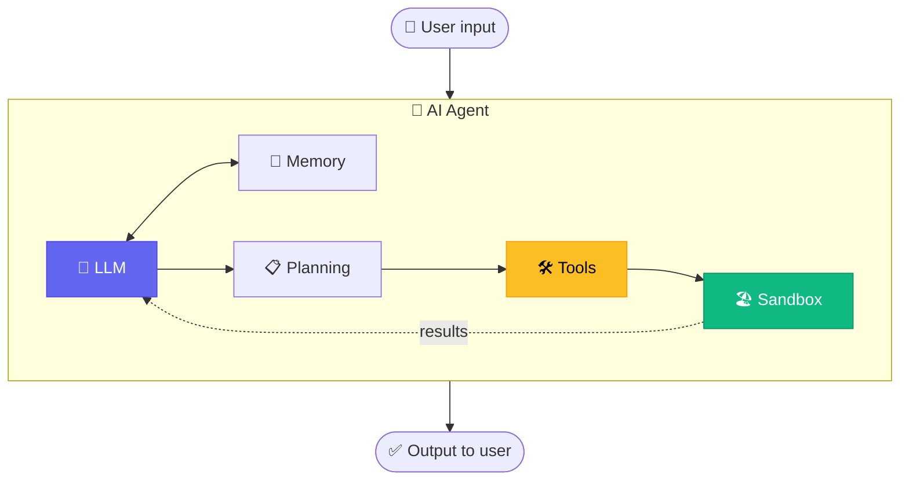

# Chapter 1 — AI Agent Foundation 101

<p style="font-size: 48px; line-height: 1; margin: 0 0 12px;">🧠</p>

> **"AI agent ≠ chatbot. An agent plans, calls tools, observes results, loops — until done."**

::: tip 🎯 You'll learn
- 🤔 **What is an AI Agent** — 5 components (LLM + Tools + Memory + Planning + Sandbox)
- 🆚 **Agent vs Chatbot vs Workflow vs Function Calling** — clear comparison
- 🔄 **Agent Loop** detailed (ReAct, Reflexion patterns)
- 🛠️ **Frameworks 2026** — Claude Code SDK, LangGraph, CrewAI
- 🧪 **Hands-on**: build first ReAct agent in 30 minutes (working code)
:::

> ⚠️ **Note**: This is FOUNDATION chapter. Master it before proceeding to Ch2-Ch6.

---

## 01 What is an AI Agent? — 5 Components

::: tip 🧩 Simple formula
**AGENT = LLM + Tools + Memory + Planning + Sandbox**

Missing 4 other components → just **raw LLM** (ChatGPT chat).
:::

### 5 components

**1. 🧠 LLM — "Brain"**
- Claude Sonnet 4.6 / Opus 4.7 / GPT-5.4 / Gemini 3 Pro
- Decides: what to think, what to do next

**2. 🛠️ Tools — "Hands and feet"**
- Functions agent can CALL: read_file, write_file, search_web, send_email, call_api
- Each tool: name, description, input schema, output

**3. 🧠 Memory — "Recall"**
- **Short-term**: conversation in context window
- **Long-term**: vector DB (Mem0, Zep), graph DB
- **Episodic**: cross-session continuity (Letta, MemGPT)

**4. 📋 Planning — "Strategy"**
- Before action, agent **plans** steps
- Pattern: **ReAct**, **Plan-and-Execute**, **Reflexion**

**5. 🏖️ Sandbox — "Safe space"**
- Isolated environment for agent to execute code safely
- E2B microVM, Browserbase, Daytona

### Diagram



---

## 02 Agent vs Chatbot vs Workflow vs Function Calling

::: warning ⚠️ Do NOT confuse — 4 different concepts

| Feature | Chatbot | Function Calling | Workflow | **AI Agent** |
|------|------|------|------|------|
| **LLM** | ✅ | ✅ | Optional | ✅ |
| **Tools** | ❌ | ✅ (1/turn) | ✅ predefined | ✅ dynamic |
| **Memory** | Context only | Context only | State machine | Persistent |
| **Planning** | ❌ | ❌ | Static graph | **Dynamic** |
| **Loop** | Single turn | Single turn | Fixed flow | **Until done** |
| **Example** | ChatGPT chat | Weather bot | n8n flow | Claude Code, Devin |
:::

### When to use which?

- **Chatbot** — Q&A only, no action
- **Function Calling** — 1 simple predictable action
- **Workflow** — Process predetermined (A→B→C→D)
- **Agent** — Complex, unpredictable steps, adaptive

---

## 03 Agent Loop — ReAct Pattern

::: tip 🔄 ReAct = REasoning + ACTing
Most common pattern 2026.
:::

### 4-step loop (repeat until done)

```
1. 💭 THOUGHT — "What should I do next?"
2. 🔧 ACTION — "Call tool X with input Y"
3. 👁️ OBSERVATION — "Tool returned Z"
4. 🔁 LOOP back to THOUGHT — "Enough info? Need more?"
```

### Interactive demo

<AgentLoopDemo />

### Pattern variations

| Pattern | When | Trade-off |
|------|------|------|
| **ReAct** ⭐ | Default 90% case | Simple, effective, debuggable |
| **Plan-and-Execute** | Long-horizon task | Less wasted tokens |
| **Reflexion** | Critical task | +5-15% accuracy, 3x cost |

---

## 04 When to BUILD vs NOT BUILD an Agent?

::: tip ✅ Build agent when
- Task complex, **unknown number of steps**
- Need to **adapt** based on results
- **Multi-tool** orchestration
- **Long-running** (>5 min)
- Value per task > $0.10
:::

::: warning ❌ Don't build agent when
- Simple task → use function calling
- Predetermined process → use workflow
- Real-time <1s latency
- Value per task <$0.01
- Need 100% deterministic
:::

---

## 05 Frameworks Landscape 2026

| Framework | Maker | Best for | Status |
|------|------|------|------|
| **Claude Code SDK** | Anthropic | Claude + MCP | ✅ Production |
| **LangGraph** | LangChain | Multi-agent prod (Klarna, Uber) | ✅ v1.0 |
| **CrewAI** | CrewAI Inc | Quick prototype | ✅ 150+ enterprise |
| **OpenAI Agents SDK** | OpenAI | OpenAI ecosystem | ✅ v0.17 |
| **A2A Protocol** | Linux Foundation | Cross-vendor | ✅ 150+ orgs |
| ~~AutoGen~~ | Microsoft | — | ❌ Maintenance |

→ See [Chapter 4 Multi-Agent](./4-multi-agent.md) and [Chapter 6 MCP](./6-mcp-ecosystem.md) for details.

---

## 06 🧪 Hands-on Lab — Build First ReAct Agent in 30 Min

::: tip 🎯 Goal
30 minutes: build a real reasoning + tool-use agent with Anthropic Claude API. Output: agent solves "Today's weather in Hanoi + outfit suggestion".
:::

### Prerequisites

```
□ Anthropic API key ($5+ topup — anthropic.com/api)
□ Python 3.10+ OR Node.js 18+
□ 30 minutes focus
```

### Step 1. Setup (Python)

```bash
mkdir first-agent && cd first-agent
python -m venv venv && source venv/bin/activate
pip install anthropic python-dotenv
echo "ANTHROPIC_API_KEY=sk-ant-..." > .env
```

### Step 2. Code agent (`agent.py`)

```python
import os, json
from anthropic import Anthropic
from dotenv import load_dotenv

load_dotenv()
client = Anthropic()

# DEFINE TOOLS
TOOLS = [
    {
        "name": "get_weather",
        "description": "Get current weather for a city",
        "input_schema": {
            "type": "object",
            "properties": {"city": {"type": "string"}},
            "required": ["city"]
        }
    },
    {
        "name": "suggest_outfit",
        "description": "Suggest clothing based on weather",
        "input_schema": {
            "type": "object",
            "properties": {
                "temp_celsius": {"type": "number"},
                "condition": {"type": "string"}
            },
            "required": ["temp_celsius", "condition"]
        }
    }
]

# IMPLEMENT TOOLS
def get_weather(city):
    data = {"Hanoi": {"temp": 28, "condition": "humid"},
            "HCMC": {"temp": 32, "condition": "sunny"}}
    return data.get(city, {"error": f"No data for {city}"})

def suggest_outfit(temp_celsius, condition):
    if temp_celsius < 20:
        return {"outfit": "warm jacket + jeans"}
    elif temp_celsius < 28:
        return {"outfit": "long sleeve + jeans"}
    elif condition == "sunny":
        return {"outfit": "t-shirt + shorts + cap"}
    else:
        return {"outfit": "t-shirt + light pants + umbrella"}

def execute_tool(name, input_data):
    if name == "get_weather":
        return get_weather(input_data["city"])
    if name == "suggest_outfit":
        return suggest_outfit(input_data["temp_celsius"], input_data["condition"])
    return {"error": f"Unknown tool: {name}"}

# AGENT LOOP (ReAct)
def run_agent(query, max_iter=10):
    messages = [{"role": "user", "content": query}]

    for i in range(max_iter):
        print(f"\n🔄 Iteration {i+1}")

        response = client.messages.create(
            model="claude-sonnet-4-6",
            max_tokens=1024,
            tools=TOOLS,
            messages=messages
        )

        if response.stop_reason == "end_turn":
            print(f"✅ Final: {response.content[0].text}")
            return response.content[0].text

        tool_results = []
        for block in response.content:
            if block.type == "tool_use":
                print(f"  🔧 {block.name}({block.input})")
                result = execute_tool(block.name, block.input)
                print(f"  👁️  {result}")
                tool_results.append({
                    "type": "tool_result",
                    "tool_use_id": block.id,
                    "content": json.dumps(result)
                })

        messages.append({"role": "assistant", "content": response.content})
        messages.append({"role": "user", "content": tool_results})

    return "Max iterations reached"

# RUN
if __name__ == "__main__":
    run_agent("What's the weather in Hanoi today, and what should I wear?")
```

### Step 3. Run

```bash
python agent.py
```

Expected output: agent calls `get_weather` → `suggest_outfit` → final answer.

→ You just built a real agent! 3 of 5 components:
- ✅ LLM (Claude Sonnet 4.6)
- ✅ Tools (get_weather, suggest_outfit)
- ✅ Loop (ReAct)

(Memory + Sandbox come in Ch2-Ch6.)

---

## 07 🏗️ Mini-Project — Helpdesk Agent for SME

::: warning 🎯 Assignment

**Goal**: Build helpdesk agent for an SME (F&B / fashion / retail).

**Requirements**:
1. **4 tools min**: `lookup_order`, `check_inventory`, `process_refund`, `escalate_to_human`
2. **Memory**: log conversation per customer (JSON file OK)
3. **Multi-turn**: support follow-up
4. **Safety**: refund > $50 → escalate

**Time**: 1 weekend
:::

---

## 08 🎓 Knowledge Check (10 Q)

::: details 1. AI Agent differs from chatbot in?
**A.** Better model
**B.** Has Tools + Memory + Planning + Loop ✅
**C.** Costs money
**D.** Same

**Answer: B** — Agent = LLM + Tools + Memory + Planning + Sandbox.
:::

::: details 2. Most common loop pattern 2026?
**A.** Tree-of-Thoughts
**B.** Plan-and-Execute
**C.** ReAct ✅
**D.** Reflexion

**Answer: C** — ReAct = default 90% production case.
:::

::: details 3. When NOT to use agent?
**A.** Complex multi-step
**B.** Predetermined process (workflow) ✅
**C.** Need adapt
**D.** Multi-tool

**Answer: B** — Predetermined → use workflow (n8n). Agent is for unpredictable tasks.
:::

::: details 4. 5 components of agent?
**A.** Model + Prompt + UI + DB + API
**B.** LLM + Tools + Memory + Planning + Sandbox ✅
**C.** Brain + Eyes + Body + Soul + Heart
**D.** Input + Compute + Output + Cache + Log

**Answer: B**
:::

::: details 5. Production-grade multi-agent framework 2026?
**A.** AutoGen (maintenance mode)
**B.** LangGraph ✅
**C.** OpenAI Swarm (deprecated)
**D.** Custom

**Answer: B** — LangGraph v1.0 used by Klarna, Uber, LinkedIn.
:::

::: details 6. Sandbox necessary because?
**A.** Performance
**B.** Protect production data when agent executes ✅
**C.** Caching
**D.** Compression

**Answer: B** — Isolated environment (E2B, Browserbase). Prevents agent from destroying data.
:::

::: details 7. Tool description should be?
**A.** Just name
**B.** Clear: name + purpose + schema + expected output ✅
**C.** Only English
**D.** Short

**Answer: B** — Clear description → LLM picks correct tool.
:::

::: details 8. Short vs long term memory?
**A.** Same
**B.** Short = context window, Long = persistent vector DB ✅
**C.** RAM vs SSD
**D.** English vs code

**Answer: B**
:::

::: details 9. Max iterations cap?
**A.** Speed up
**B.** Prevent infinite loop when stuck ✅
**C.** Reduce bugs
**D.** Increase accuracy

**Answer: B** — Set `max_iter=10` to prevent runaway agent.
:::

::: details 10. ReAct loop steps?
**A.** Read → Process → Write
**B.** Thought → Action → Observation ✅
**C.** Input → Compute → Output
**D.** Plan → Code → Test

**Answer: B** — Thought → Action → Observation → loop until done.
:::

**Score**:
- 8-10/10 ✅ Ready for Chapter 2
- 5-7/10 ⚠️ Re-read sections 1-5
- <5/10 ❌ Redo lab

---

## 09 Continue

| Chapter | What you learn |
|------|------|
| **[Ch2 Claude Code Deep](./2-claude-code-deep.md)** | Sub-agent orchestrator-worker (-40% cost) |
| **[Ch3 Computer Use](./3-computer-use.md)** | Agent clicks like human (72.5% OSWorld) |
| **[Ch4 Multi-Agent](./4-multi-agent.md)** | 4 patterns: orchestrator, debate, hierarchical, swarm |
| **[Ch5 Workflow Agent](./5-workflow-agent.md)** | n8n + voice agents (Vapi, Smax.ai VN) |
| **[Ch6 MCP Ecosystem](./6-mcp-ecosystem.md)** | Standard protocol 97M downloads/month |

::: warning 💡 Mantra
> *"2023: LLM chat bots. 2024: LLM function calling.*
> *2025-2026: LLM **self-driving** — plan, execute, recover. That's an AGENT.*
> *You just built your first one. Welcome to the era."*
:::
