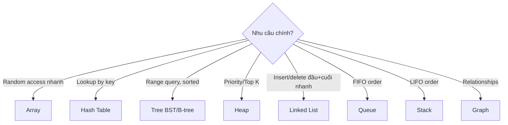

# Cấu trúc dữ liệu

::: tip Mở đầu
**Program = data structure + algorithm.**

Trước ta học CPU thực thi instruction, OS quản resource. Nhưng object core program xử là **data** — user info, product list, social relation... Cách tổ chức data trong memory quyết định trực tiếp program nhanh hay chậm.

Có thể bạn từng bối rối: sao có program xử vài chục nghìn record nhanh, có program xử vài trăm đã treo? Câu trả lời thường ở **chọn data structure**.
:::

**Bạn sẽ học**:
- Năng lực phán đoán trực giác: thấy 1 nhu cầu, tự nghĩ ra structure nào dùng
- View phân tích performance: phán đoán bottleneck là data structure sai hay algorithm kém
- Tư duy trade-off: hiểu "space vs time", không có structure hoàn hảo
- Năng lực đọc code: thấy HashMap, Stack, Queue không lạ
- Nền học tiếp: database index, cache system, search engine...

| Chương | Nội dung |
|-----|------|
| **1** | Toàn cảnh: 4 loại data structure |
| **2** | Linear: array, linked list, stack, queue |
| **3** | Hash table |
| **4** | Tree |
| **5** | Graph |
| **6** | So sánh performance |
| **7** | Hướng dẫn chọn |

---

## 1. Toàn cảnh: data structure là gì?

Tưởng tượng bạn xếp đống sách:

- **Để đống trên đất**: tìm phải lật từng cuốn — storage nguyên thuỷ
- **Theo số đặt giá**: vào vị trí đúng lấy — **Array**
- **Theo loại chia tủ**: xác định tủ rồi tìm — **Hash table**
- **Sort theo tên đặt nhiều tầng**: mỗi lần loại 1 nửa — **Tree**

Cách xếp khác → hiệu quả tìm khác hẳn. **Data structure = "cách xếp" data** — quyết store, find, modify thế nào.

<DataStructureOverviewDemo />

4 loại chính:

| Loại | Relation | Đại diện | Ẩn dụ |
|------|---------|---------|---------|
| **Linear** | 1-1, xếp hàng | Array, linked list, stack, queue | Toa tàu, queue |
| **Hash** | Key → Value mapping | Hash table, dict, set | Card index thư viện |
| **Tree** | 1-N, hierarchical | Binary tree, B-tree, heap | Gia phả, folder |
| **Graph** | N-N, network | Directed, undirected graph | Bản đồ metro, social network |

::: tip Sao học nhiều loại?
**Không có data structure vạn năng**. Mỗi cái trade-off giữa "speed tìm", "speed insert", "memory". Như không dùng cặp đựng đồ gia dụng, không dùng xe tải gửi 1 lá thư.
:::

---

## 2. Linear structure: cách tổ chức cơ bản nhất

Linear = data xếp nối tiếp nhau, như toa tàu. Khác nhau ở "cách connect" và "thao tác đầu nào".

<LinearStructuresDemo />

### 2.1 Array vs Linked List

| Tiêu chí | Array | Linked List |
|---------|------|------|
| **Memory layout** | Liên tục 1 khối | Rải rác, kết nối bằng pointer |
| **Access phần tử n** | Tính địa chỉ thẳng, O(1) | Từ đầu tìm từng cái, O(n) |
| **Insert giữa** | Sau phải đẩy, O(n) | Đổi 2 pointer, O(1) |
| **Size** | Cố định lúc tạo | Có thể tăng |
| **Ẩn dụ** | Hộp tủ đánh số | Treasure hunt chain |

::: tip Khi nào dùng cái nào?
- **Data đã biết, access theo vị trí thường xuyên** → Array (bảng điểm, pixel matrix)
- **Data chưa biết, insert/delete thường** → Linked List (playlist, undo history)
- **Không chắc?** → Array. Cache-friendly thường thắng
:::

### 2.2 Stack: LIFO (Last In, First Out)

Chỉ thao tác 1 đầu (top):
- `push`: thêm lên top
- `pop`: lấy ra từ top
- `peek`: xem top không lấy

**Ứng dụng**:
- Browser back history
- Undo/redo trong editor
- Function call stack
- Bracket matching `(())`
- DFS traversal

### 2.3 Queue: FIFO (First In, First Out)

Thao tác 2 đầu:
- `enqueue`: thêm cuối
- `dequeue`: lấy đầu

**Ứng dụng**:
- Task queue (job scheduler)
- BFS traversal
- Print queue
- Message queue

---

## 3. Hash Table: tìm O(1)

Key concept: **dùng key tính ra index thẳng**.

```
HashMap["nguyen"] → hash("nguyen") = 42 → Array[42]
```

### 3.1 Hash function

Tốt: phân bố đều, ít collision.
Xấu: nhiều element vào cùng bucket → degrade thành O(n).

### 3.2 Collision handling

- **Separate chaining**: mỗi bucket là linked list
- **Open addressing**: collision thì thử bucket khác (linear probing, quadratic, double hashing)

### 3.3 Trade-off

**Ưu**: lookup, insert, delete O(1) average
**Nhược**:
- Worst case O(n) khi nhiều collision
- Không có thứ tự
- Tốn memory hơn array

**Ứng dụng**:
- Database index
- Cache (Redis dictionary)
- Counter (word count)
- Set (kiểm tra membership)
- Symbol table (compiler)

---

## 4. Tree: hierarchical

### 4.1 Binary Tree

Mỗi node có ≤ 2 con.

**Binary Search Tree (BST)**: left < parent < right → search O(log n).
Worst case (unbalanced): O(n).

### 4.2 Balanced trees

**AVL**, **Red-Black**, **B-tree**, **B+ tree**: tự balance → guarantee O(log n).

Database (MySQL, Postgres) dùng **B+ tree** cho index.

### 4.3 Heap

**Binary heap**: complete binary tree, parent ≤ (hoặc ≥) con.

**Ứng dụng**:
- Priority queue
- Heap sort
- Top K problem
- Dijkstra algorithm

### 4.4 Tree thực tế

- **File system**: folder/file hierarchy
- **DOM tree**: web page
- **AST**: compiler parse code
- **Decision tree**: ML
- **Trie**: autocomplete, dictionary

---

## 5. Graph: network

Node + edge. Edge có hướng (directed) hoặc không.

### 5.1 Đại diện

- **Adjacency matrix**: 2D array N×N, `m[i][j]=1` nếu có edge
- **Adjacency list**: mỗi node có list neighbor

Matrix tốn O(N²), list O(N+E).

### 5.2 Traversal

- **BFS**: dùng queue, đi level-by-level
- **DFS**: dùng stack/recursion, đi sâu trước

### 5.3 Algorithm phổ biến

- **Dijkstra**: shortest path
- **Bellman-Ford**: shortest path with negative weight
- **Floyd-Warshall**: all-pairs shortest
- **Kruskal/Prim**: minimum spanning tree
- **Topological sort**: DAG dependency

### 5.4 Ứng dụng

- **Social network**: friend graph
- **Maps**: road network
- **Web**: page link graph
- **Recommendation**: user-item graph
- **Knowledge graph**: entity-relation

---

## 6. So sánh performance

| Operation | Array | Linked List | Hash Table | BST balanced | Heap |
|---|---|---|---|---|---|
| Access by index | O(1) | O(n) | - | - | - |
| Search by value | O(n) | O(n) | O(1) avg | O(log n) | O(n) |
| Insert at end | O(1) amortized | O(1) | O(1) | O(log n) | O(log n) |
| Insert at start/middle | O(n) | O(1) | - | O(log n) | - |
| Delete | O(n) | O(1) given node | O(1) avg | O(log n) | O(log n) |
| Min/Max | O(n) | O(n) | O(n) | O(log n) | O(1) |

---

## 7. Hướng dẫn chọn



---

## 8. Decision examples thực tế

### "Build hệ tracking user online"
- Set (Hash) để check user A online không: O(1)
- Counter (Hash) để đếm online theo region

### "Build undo function trong editor"
- Stack: mỗi action push lên, undo pop ra

### "Build chat history với 1 user, sort theo time"
- Array hoặc linked list (sorted theo time naturally)

### "Build news feed Facebook"
- Graph (friend network) + Heap (rank top stories)

### "Build autocomplete search"
- Trie

### "Build URL shortener"
- Hash table: short_id → long_url

### "Build Dijkstra cho Maps"
- Graph + Priority Queue (heap)

---

## 9. Trong AI/ML context

- **Embeddings**: high-dimensional vectors, often stored in Array
- **Vector DB**: special data structure (HNSW, IVF) cho nearest neighbor search
- **Tokenizer**: Trie để match longest token
- **Attention**: matrix operations
- **Transformer KV cache**: dynamic-size arrays

---

## 10. Tổng kết

- **Linear** cho sequence
- **Hash** cho fast lookup
- **Tree** cho hierarchical + sorted
- **Graph** cho relationship

**Nguyên tắc vàng**: không có structure hoàn hảo. Chọn dựa **access pattern** chính của bạn.

::: tip 2026 Update
- **Vector databases** (Pinecone, Qdrant, Milvus): HNSW, IVF cho similarity search
- **Time-series DB** (InfluxDB, TimescaleDB): optimized cho time-indexed data
- **Graph DB** (Neo4j, ArangoDB): mainstream cho social, knowledge graph
- **Probabilistic data structures**: Bloom filter, Count-Min Sketch cho big data
- **Persistent data structures** trong functional programming (Clojure, Elixir): immutable + sharing
:::

## Tài liệu

- [Visualgo](https://visualgo.net/) - visualize algorithm và data structure
- [Big-O Cheat Sheet](https://www.bigocheatsheet.com/)
- [CLRS textbook](https://mitpress.mit.edu/9780262046305/) - bible của algorithm
- [LeetCode](https://leetcode.com/) - practice problem
