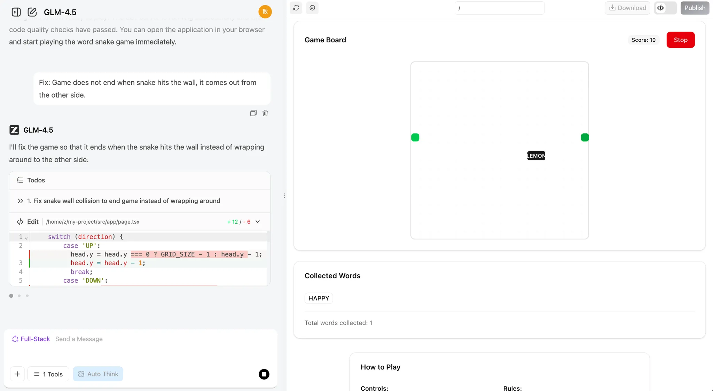
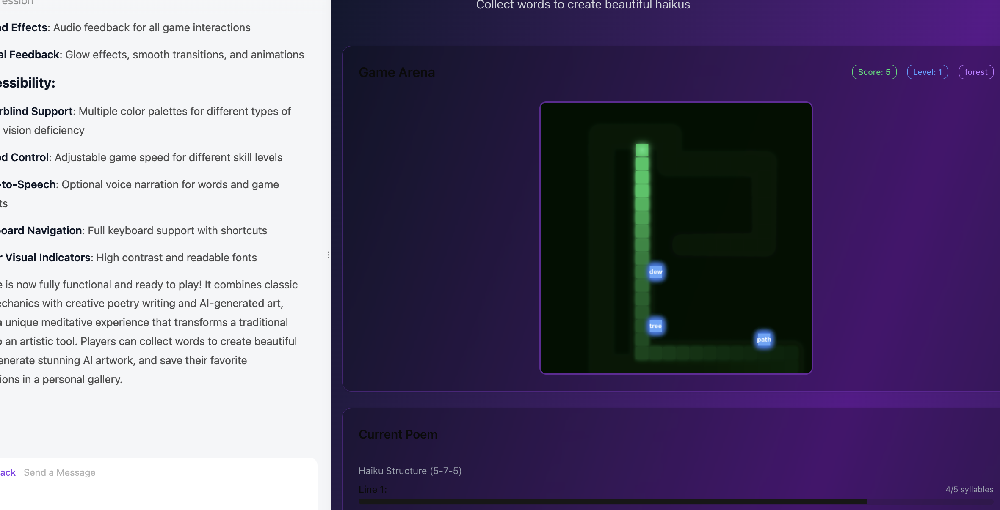

# Sơ cấp 1: Thời đại AI — Biết nói là biết lập trình

Đây là một bài học **theo dự án (project-based learning)**. Hãy làm theo từng bước và cố tái hiện lại kết quả.
Đừng sợ sai hay sửa lung tung — chúng tôi luôn tin bạn làm được, và hãy luôn nhớ:

<div style="text-align: center;">
<div style="display: inline-block; padding: 8px 20px; border-radius: 8px; border: 1px dashed #FFB6C1; background: linear-gradient(135deg, #FFF0F5 0%, #FFE4EC 100%); margin: 12px 0;">
  <span style="font-size: 15px; font-weight: 500; color: #666;">Hoàn thành quan trọng hơn hoàn hảo 🐣</span>
</div>
</div>

<script setup>
import { relatedArticlesMap } from '@theme/data/relatedArticles'

const duration = 'Khoảng <strong>4 giờ</strong>, có thể chia thành nhiều lần'
const relatedArticles =
  relatedArticlesMap['vi-vn/stage-1/ai-capabilities-through-games'] ?? []
</script>

## Dẫn nhập chương

<ChapterIntroduction :duration="duration" :tags="['Lập trình AI theo hội thoại', 'Game AI-native', 'Thực chiến Snake']" coreOutput="Game Snake AI-native + game tự sáng tạo" expectedOutput="1 game Snake AI-native chạy được + (tuỳ chọn) 1 game/Demo AI-native do bạn tự sáng tạo">

Nếu bạn <strong>hoàn toàn không biết lập trình</strong>, hoặc chỉ biết chút ít, chương này được viết cho bạn. Chúng ta bắt đầu từ cơ bản nhất: dùng <strong>hội thoại</strong> để bảo AI viết code thay bạn — không cần nhớ cú pháp, không cần cấu hình môi trường, chạy thẳng trên web là được.

Bạn sẽ tự tay làm ra <strong>chương trình chạy được đầu tiên</strong> — một game Snake biết "ăn từ, làm thơ, vẽ tranh". Qua thực chiến này, bạn sẽ cảm nhận được lập trình AI thực sự là cảm giác gì: không phải AI thay bạn suy nghĩ, mà là bạn nói ý tưởng ra, AI giúp bạn hiện thực hoá.

Mọi sáng tạo đều bắt đầu từ 0 đến 1. Rất vui được truyền niềm tin và sự chuyên nghiệp đến bạn — với bạn, <strong>execution là tất cả</strong>.

</ChapterIntroduction>

<div style="margin: 50px 0;">
  <ClientOnly>
    <StepBar :active="0" :items="[
      { title: 'Khó khăn & cơ hội', description: 'Khả năng lập trình mới cho người thường' },
      { title: 'Khám phá năng lực', description: 'Trải nghiệm dev cực nhanh 60 giây' },
      { title: 'Thực chiến AI-native', description: 'Build Snake AI-native' },
      { title: 'Sáng tạo mở rộng', description: 'Suy luận để tự làm game' }
    ]" />
  </ClientOnly>
</div>

## 1. Khó khăn & cơ hội của người thường

Nhiều người trong đầu chứa cả tá ý tưởng sản phẩm: một công cụ ghi chép chi tiêu, một website ghi lại quá trình con trưởng thành, thậm chí một game nhỏ. Nhưng cứ nghĩ đến phải viết code, phải tìm lập trình viên là... drop ngay.

AI xuất hiện, lần đầu tiên mở ra khả năng hoàn toàn mới cho người thường: bạn không cần biết viết code, chỉ cần học cách nói cho AI biết bạn muốn gì. Theo [dữ liệu của GitHub Copilot](https://www.wearetenet.com/blog/github-copilot-usage-data-statistics), hơn 15 triệu lập trình viên đang dùng AI hỗ trợ lập trình, trung bình 46% code được AI sinh ra! Trong các dự án Java tỉ lệ này lên tới 61%.

<el-card shadow="hover" style="margin: 20px 0; border-radius: 12px;">
  <template #header>
    <div style="display: flex; align-items: center; gap: 8px;">
      <span style="font-size: 20px;">🚀</span>
      <span style="font-weight: bold; font-size: 16px;">Bước nhảy về hiệu suất và tỷ lệ áp dụng</span>
    </div>
  </template>

  <el-row :gutter="20" style="margin-bottom: 24px;">
    <el-col :span="6" :xs="12">
      <div style="text-align: center; padding: 10px;">
        <div style="color: #409EFF; font-size: 24px; font-weight: bold;">55%</div>
        <div style="color: #909399; font-size: 12px; margin-top: 4px;">Tăng tốc độ</div>
      </div>
    </el-col>
    <el-col :span="6" :xs="12">
      <div style="text-align: center; padding: 10px;">
        <div style="color: #67C23A; font-size: 24px; font-weight: bold;">2.4 <span style="font-size: 14px;">ngày</span></div>
        <div style="color: #909399; font-size: 12px; margin-top: 4px;">Thời gian task (trước: 9.6 ngày)</div>
      </div>
    </el-col>
    <el-col :span="6" :xs="12">
      <div style="text-align: center; padding: 10px;">
        <div style="color: #E6A23C; font-size: 24px; font-weight: bold;">81%</div>
        <div style="color: #909399; font-size: 12px; margin-top: 4px;">Cài đặt trong ngày đầu</div>
      </div>
    </el-col>
    <el-col :span="6" :xs="12">
      <div style="text-align: center; padding: 10px;">
        <div style="color: #F56C6C; font-size: 24px; font-weight: bold;">96%</div>
        <div style="color: #909399; font-size: 12px; margin-top: 4px;">Tỉ lệ chấp nhận gợi ý</div>
      </div>
    </el-col>
  </el-row>

  <div style="line-height: 1.8; color: #606266;">
    Điều thực sự đáng phấn khích là sự bứt phá hiệu suất: tốc độ hoàn thành task của lập trình viên tăng <b>55%</b>. Code mà trước đây cần 9.6 ngày mới commit, giờ chỉ cần <b>2.4 ngày</b>. Sự cải thiện hiệu suất nhìn thấy bằng mắt thường này cho thấy AI không còn là "công cụ tuỳ chọn" nữa, mà đang trở thành trợ lý lập trình không thể thiếu trong quy trình phát triển. Dữ liệu về tỉ lệ áp dụng cũng xác nhận: ngay trong ngày được cấp quyền truy cập, <b>81%</b> lập trình viên cài ngay và bắt đầu dùng; trong đó <b>96%</b> bắt đầu chấp nhận các gợi ý code từ AI ngay trong ngày. Nói cách khác, lập trình viên gần như tích hợp AI vào công việc code hằng ngày ngay lập tức.
  </div>
</el-card>

Với người thường, xu hướng này còn có ý nghĩa hơn: nếu lập trình viên chuyên nghiệp đã phụ thuộc lớn vào AI để viết code, thì những người **không biết lập trình như chúng ta, tại sao không thể trực tiếp đối thoại với AI để hiện thực hoá ý tưởng**?

Mục tiêu của khoá học là giúp bạn rèn được kỹ năng mới: chỉ qua đối thoại ngôn ngữ tự nhiên là làm ra được ứng dụng. Chúng tôi sẽ dạy bạn cách giao tiếp với AI bằng "ngôn ngữ máy tính", cách bảo AI biến ý tưởng trong đầu thành sản phẩm sử dụng được thật.

<div style="margin: 50px 0;">
  <ClientOnly>
    <StepBar :active="1" :items="[
      { title: 'Khó khăn & cơ hội', description: 'Khả năng lập trình mới cho người thường' },
      { title: 'Khám phá năng lực', description: 'Trải nghiệm dev cực nhanh 60 giây' },
      { title: 'Thực chiến AI-native', description: 'Build Snake AI-native' },
      { title: 'Sáng tạo mở rộng', description: 'Suy luận để tự làm game' }
    ]" />
  </ClientOnly>
</div>

## 2. AI giúp bạn được đến mức nào

Phần này chỉ thảo luận một câu hỏi: nếu bạn hoàn toàn không biết code, AI hiện tại có thể giúp bạn làm tới đâu?

Nói đại khái, bạn có thể hiểu năng lực của các mô hình lớn hiện tại như sau: có thể đảm nhận được các **công cụ nhỏ nội bộ**, **dashboard trực quan dữ liệu**, và một số **game nhỏ nhẹ ký**. Năng lực này dùng làm **tool tự dùng**, **xác thực nhu cầu dưới góc nhìn PM** thì cơ bản đã đủ. Nhưng nếu muốn sinh ra **sản phẩm thương mại hoàn chỉnh** chỉ với một câu lệnh thì vẫn cần con người liên tục tối ưu về **thiết kế quy trình**, **hoàn thiện chi tiết**.

Tiếp theo, hãy lấy Snake làm ví dụ để xem cụ thể hiện tại AI lập trình có thể làm tới đâu.

### 2.1 Làm Snake trong 60 giây

Đầu tiên, mở trang thử nghiệm dùng trong khoá học [z.ai](https://chat.z.ai/). `z.ai` là nền tảng AI do Zhipu AI (một trong những công ty mô hình ngôn ngữ lớn hàng đầu Trung Quốc) phát triển, năng lực cốt lõi đến từ series GLM của Zhipu. Nền tảng tích hợp nhiều tính năng AI: sinh slide, thiết kế poster và phát triển full-stack. Ở đây chúng ta tập trung vào module phát triển full-stack.

::: details 💡 Mô hình "lập trình ngay trong trình duyệt" là gì?

Trước đây, để phát triển một ứng dụng web bạn cần:
- Cài môi trường lập trình (Python, Node.js…)
- Cấu hình editor
- Học HTML/CSS/JavaScript
- Xử lý dependency và đủ loại lỗi

Còn bây giờ, nhờ nền tảng AI Coding, bạn chỉ cần:
- Mở trình duyệt, truy cập web
- Mô tả tính năng bạn muốn bằng ngôn ngữ tự nhiên
- AI tự sinh code và xem preview realtime

Mô hình "hội thoại tức lập trình" này biến lập trình từ "viết code" thành "mô tả nhu cầu". Bạn không cần quan tâm chi tiết kỹ thuật tầng đáy, chỉ cần nói rõ với AI bạn muốn gì, nó sẽ biến ý tưởng thành chương trình chạy được. Đây chính là paradigm lập trình mới của thời đại AI — **Vibe Coding**.
:::


Sau khi nhập yêu cầu đơn giản và bấm nút **Full-Stack Development**, bạn xem được realtime quá trình tạo trang web. Thông thường chỉ thời gian pha ly cà phê là trang được sinh xong!

```
Giúp tôi làm một game Snake:
1. Dùng phím mũi tên điều khiển rắn
2. Ăn thức ăn rắn dài thêm, điểm tăng lên
3. Đụng tường hoặc thân mình thì game over
4. Có nút Start và Restart
5. UI gọn đẹp
```


Khi sinh xong, bên phải hiện ra trang web có thể duyệt. Bạn có thể scroll xem nội dung, hoặc bấm 🧭 ở top để xem fullscreen.

> Các nút trên top từ trái sang phải: nút mũi tên mở sidebar lịch sử hội thoại, nút bút chì tạo hội thoại mới, nút mũi tên quay vòng để refresh, nút la bàn để fullscreen, nút Download tải project, nút <> chuyển code view, nút Publish để publish project.


Nếu muốn xem source code của trang, bấm vào icon code ở góc trên bên phải để xem code đầy đủ.


::: tip 🌐 Khám phá thêm các công cụ AI Coding

Ngoài z.ai, bạn có thể thử các nền tảng AI Coding xuất sắc khác:

| Công cụ | Địa chỉ | Đặc điểm |
|------|------|------|
| **Google AI Studio** (khuyến nghị) | [aistudio.google.com/apps](https://aistudio.google.com/apps) | Google chính thức, hỗ trợ Gemini, phù hợp prototype nhanh |
| **Figma Make** | [figma.com/make](https://www.figma.com/make) | Tích hợp sâu với công cụ thiết kế, phù hợp designer làm prototype tương tác nhanh |
| **Coze** | [coze.com](https://www.coze.cn) | Nền tảng phát triển AI Bot của ByteDance, no-code visual builder, tích hợp sâu với Doubao, Kimi, hỗ trợ marketplace plugin, scheduled task và multi-channel publishing (Lark, WeChat...), phù hợp build app hội thoại C-end hoặc trợ lý nội bộ doanh nghiệp |
| **v0.dev** | [v0.dev](https://v0.dev) | Của Vercel, AI sinh UI — mô tả là sinh code React chạy được |
| **Bolt.new** | [bolt.new](https://bolt.new) | Của StackBlitz, nền tảng AI full-stack — sinh và deploy luôn Web app hoàn chỉnh |
| **Lovable** | [lovable.dev](https://lovable.dev) | Tập trung sinh React app chất lượng cao, tích hợp GitHub và deploy one-click |
| **Replit Agent** | [replit.com](https://replit.com) | IDE online tích hợp AI coding, hỗ trợ nhiều ngôn ngữ và cộng tác realtime |

Muốn biết chi tiết hơn về so sánh và hướng dẫn dùng các công cụ Web Coding, đọc bài extended: [So sánh thực tế 7 nền tảng Vibe Coding online phổ biến](../../stage-1/appendix-articles/example0-1/vibe-coding-tools-snake-game-tutorial.md)
:::

### 2.2 Hội thoại lập trình làm được gì, không làm được gì

Phần này tập trung một câu hỏi cụ thể: khi bạn chỉ dựa vào hội thoại với AI và không tự viết một dòng code nào, nó có thể đẩy mọi thứ đi tới đâu.

Theo kinh nghiệm, một kết luận khá ổn định: AI có thể giúp bạn hoàn thành một thứ "nhỏ nhưng hoàn chỉnh", nhưng "làm tới mức nào là đủ" vẫn cần bạn tự ra quyết định ở từng bước chi tiết.

#### Giỏi hơn ở các app "nhỏ và rõ ràng"

Từ ví dụ Snake phía trên, bạn đã thấy một pattern điển hình: chỉ cần bạn mô tả được giao diện và tương tác, AI thường có thể trong vài lượt hội thoại lắp ra một trang web hoàn chỉnh, mở được, bấm được, chơi được.

Các task kiểu này thường có vài đặc điểm chung:

- Phạm vi rõ ràng: một trang web, một tool nội bộ đơn giản, một gameplay nhỏ
- Kết quả nhìn thấy được: bạn có thể verify ngay trên trình duyệt xem nó có chạy như mong đợi
- Sửa lỗi trực tiếp: gặp vấn đề, có thể chỉ rõ hiện tượng trong hội thoại tiếp theo và yêu cầu sửa (copy lỗi paste vào, hoặc paste screenshot để AI sửa)

Trong ranh giới này, bạn có thể coi AI hội thoại như một "dev phụ giúp" có sức thực thi khá tốt. Bạn chỉ cần tinh chỉnh và điều chỉnh nhu cầu bằng ngôn ngữ tự nhiên qua từng lượt, là có ngay prototype dùng được.

**Tỉ lệ thành công khi AI tự làm dự án nhỏ:**
<el-progress :percentage="90" :stroke-width="15" status="success" striped striped-flow />

#### Dự án lớn cần "góc nhìn quy trình"

Khi vượt qua phạm vi nhỏ và rõ ràng, kỳ vọng AI làm end-to-end hệ thống phức tạp chỉ qua vài lượt hội thoại sẽ chạm trần rất nhanh. Dự án lớn thường phải kết nối backend, database, tích hợp third-party, lại còn dính permission, security, concurrency và rất nhiều quy tắc nghiệp vụ — mục tiêu là bàn giao một hệ thống tích hợp sâu với business hiện hữu, chứ không phải một trang web.

Trong trường hợp này, cách tiếp cận hợp lý không phải vứt tất cả yêu cầu cho AI một cục, mà là vẽ ra quy trình tổng thể rõ ràng trước: các bước chính là gì, input/output và state change ở từng bước, node nào nhạy cảm về performance và security. Dựa trên flow này, tách các phần tương đối độc lập ra, giao cho AI hội thoại sinh API, module, script và test.

Với năng lực hiện tại, AI giỏi hơn ở việc tăng tốc các bước nhỏ, còn bạn (hoặc team) quyết định cách chia bước, cách nối các bước, và chịu trách nhiệm về architecture, integration, ops cuối cùng.

#### Khác biệt giữa "viết được" và "dùng được"

Nhìn qua thì AI hình như viết được mọi thứ, nhưng những thứ này có thực sự dùng được không, dùng tới mức nào, ta phân loại sao đây?

Một kinh nghiệm tham khảo:

::: warning ⚠️ Hướng dẫn tình huống áp dụng

- **Prototype / Demo / Công cụ nội bộ tự dùng**: rất phù hợp giao cho AI làm bản đầu rồi bạn iterate chi tiết.
- **Sản phẩm lớn phục vụ user thật**: thường cần engineer đầu tư dài hạn về architecture, abstraction, performance và maintenance.
- **Hệ thống strong-security / strong-compliance (thanh toán, risk control, y tế…)**: ở giai đoạn hiện tại, không nên "sinh xong là deploy", phải có quy trình review và test nghiêm ngặt.
:::

Ngay lúc này, bạn có thể tương đối yên tâm coi AI là partner Demo và tool tự dùng hiệu quả: chỉ cần bạn chịu test nhiều, iterate nhiều, hỏi thêm vài lượt kiểu "chỗ này sai, sửa giúp và giải thích lý do", ở mức prototype và tool nội bộ thì chất lượng tổng thể thường đủ và có giá trị thực hành.

<div style="margin: 50px 0;">
  <ClientOnly>
    <StepBar :active="2" :items="[
      { title: 'Khó khăn & cơ hội', description: 'Khả năng lập trình mới cho người thường' },
      { title: 'Khám phá năng lực', description: 'Trải nghiệm dev cực nhanh 60 giây' },
      { title: 'Thực chiến AI-native', description: 'Build Snake AI-native' },
      { title: 'Sáng tạo mở rộng', description: 'Suy luận để tự làm game' }
    ]" />
  </ClientOnly>
</div>

## 3. Bắt tay: Ứng dụng AI-native đầu tiên của bạn

Quay lại phần thực hành. Phần trước chúng ta đã nhanh chóng làm ra prototype Snake chơi được bằng AI và biết AI làm được gì, không làm được gì. Tiếp theo chúng ta sẽ học cách dùng các kỹ thuật **Vibe Coding** cơ bản để tạo một game Snake AI **phiên bản hiện đại**. Chúng ta sẽ cho rắn ăn các ký tự văn bản thay vì hạt đậu. Cuối cùng để game sinh ra một bài thơ dựa trên các ký tự đã ăn, và vẽ một bức tranh.

Qua case thực tế này, bạn sẽ hiểu ý tưởng cốt lõi của paradigm lập trình mới: làm sao diễn đạt nhu cầu rõ ràng bằng ngôn ngữ tự nhiên.

### 3.1 Snake AI-native

Ban đầu, ta có thể đối thoại với mô hình theo cách đơn giản nhất, điều này giúp ta nhanh chóng có prototype. Ta có thể gõ thẳng vào khung chat:

> **💡 Prompt mẫu:** Giúp tôi làm một game Snake
>
> 

> **💡 Prompt mẫu:** Giúp tôi làm một game Snake hỗ trợ:
>
> 1. Tôi có thể ăn các từ khác nhau, chúng được gom vào một ô
>    

> **💡 Prompt mẫu:** Giúp tôi làm một game Snake hỗ trợ:
>
> 1. Tôi có thể ăn các từ khác nhau, chúng được gom vào một ô
> 2. Khi rắn ăn được 8 từ, LLM sẽ sáng tác một bài thơ dựa trên các từ đó, và ta có thể remix bài thơ theo nhu cầu
> 3. Khi thơ xong, bước tiếp theo tự động tạo một bức ảnh dựa trên bài thơ
>
> 

Lưu ý, trong quá trình phát triển, ta có thể gặp vấn đề không như ý: bấm nút không phản ứng, dùng tính năng thì báo lỗi, tính năng không chạy như mong đợi, hoặc UI khác bản thiết kế.

Trong trường hợp đó, ta cần hỏi tiếp mô hình để giúp fix các vấn đề bất ngờ này.



### 3.2 Thêm tính năng mới cho game

Sau khi hoàn thành chức năng cơ bản, ta có thể thử thêm vài chiêu mới! Nếu thấy quá trình rắn ăn từ/ký tự hơi chán, có thể cho rắn ăn các từ màu khác nhau và đổi màu rắn tương ứng.

Bạn cũng có thể thêm hiệu ứng đặc biệt cho hành động "ăn", hoặc thêm các "từ phép" kích hoạt hiệu ứng đặc biệt — ví dụ tăng tốc hoặc tăng kích cỡ rắn. Một ý khác: mỗi khi rắn ăn được một từ thì model sinh ra một bài thơ và một bức ảnh, thay vì đợi tới 8 từ.

Nếu thấy thử thách, cứ nhờ LLM giúp! Nó sẽ đưa các đề xuất sáng tạo để game thú vị hơn. Thử đi!

```
1. Cơ chế "Từ mở khóa thế giới"
Mỗi khi rắn ăn một từ, LLM sẽ liên tưởng thi vị về từ đó (ví dụ "cây"→"rừng", "bóng mát"), model ảnh sẽ tạo một artwork nhỏ cho từ đó. Các hình này dần lắp thành một panorama độc nhất do người chơi tạo ra — mỗi lần chơi đều đang "vẽ và làm thơ".

2. Gameplay "Xếp hình thơ"
Mỗi từ rắn ăn sẽ kích hoạt LLM sinh một câu thơ ngắn, model ảnh sinh minh hoạ. Các câu thơ và hình này ghép như puzzle, cuối ván tạo thành một bài thơ + tranh do AI cộng tác.

3. "Từ phép" & "Nhánh chuyện"
Các "từ phép" đặc biệt (ví dụ "gió", "đêm", "mộng") không chỉ kích hoạt LLM sinh thơ mà còn đổi tâm trạng hoặc chủ đề của bối cảnh — chuyển phong cách ảnh sinh ra thành ban đêm, bão tố, hoặc bầu không khí mộng mơ.
Nhánh chuyện: LLM cho ra một chủ đề hoặc câu đố đầu tiên (ví dụ "Ký ức mùa thu"). Lựa chọn từ của người chơi ảnh hưởng trực tiếp đến diễn biến và bài thơ, model ảnh realtime cập nhật background và hiệu ứng.

4. "Sinh tương tác realtime"
Sau mỗi từ, LLM sinh ra một dòng thoại hoặc miêu tả, NPC trong game có thể "nói chuyện" với người chơi, hoặc môi trường thay đổi tương ứng.
Ngoại hình rắn hoặc chướng ngại có thể đổi visual theo từ đã ăn, nhờ model ảnh.

5. "Sáng tạo & chia sẻ"
Người chơi có thể lưu và chia sẻ bài thơ + ảnh do AI sáng tạo khi kết thúc session, khoe "AI collaboration" độc bản.
Bảng xếp hạng "Thơ + nghệ thuật đẹp nhất", "Tổ hợp từ sáng tạo nhất" — khuyến khích chơi lại và sáng tạo.

6. Thử thách "Snake theo câu"
Reverse mode: LLM cho một câu thơ hoặc câu đố, người chơi phải dẫn rắn ăn các từ theo đúng thứ tự để xây lại câu. Ăn sai từ sẽ kích hoạt hậu quả vui hoặc nghệ thuật qua model sinh ảnh.

7. "Level theo chủ đề" & "Chọn phong cách"
Khi bắt đầu, người chơi chọn chủ đề (ví dụ "Cổ tích", "Sci-fi", "Thơ Đường"), LLM và model ảnh cùng điều chỉnh lựa chọn từ, phong cách thơ và visual để khớp, mỗi lượt chơi cảm giác mới.

8. "Co-create realtime"
Khi ăn một từ đặc biệt, LLM có thể prompt người chơi nhập một cụm từ hoặc chọn phong cách, sau đó AI sinh câu thơ và minh hoạ tương ứng, biến nó thành co-creation thật giữa người và AI.

9. "AI easter egg & achievement"
Một số tổ hợp từ được LLM nhận diện là chủ đề đặc biệt hoặc inside joke (ví dụ "trăng", "hoa quế", "bờ sông"), kích hoạt câu thơ và minh hoạ hiếm, thưởng cho khám phá.

10. "Câu chuyện trưởng thành"
Khi rắn lớn lên, LLM sinh ra một bài thơ-câu chuyện liên tục, model ảnh tạo một bức tranh dài cuộn liền mạch — nên người chơi cùng lúc "viết, vẽ và chơi".
```

Ngoài ra, ta có thể yêu cầu LLM trực tiếp sinh prompt cấp project. Ở phần trước, ta tự viết prompt cho game Snake. Bây giờ thử bảo mô hình sinh một prompt có framework tổng thể và đường đi triển khai (bạn có thể dùng z.ai để sinh).

Nếu muốn học cách viết prompt tốt hơn, xem [Phụ lục Prompt Engineering](/vi-vn/appendix/8-artificial-intelligence/prompt-engineering).

> Tôi muốn AI sinh một game Snake web, cần một prompt đầy đủ hơn để kết quả ấn tượng và thú vị. Hãy sinh prompt tương ứng. Mục tiêu hiện tại: sinh một game Snake hỗ trợ tính năng ăn các từ khác nhau và sinh thơ, kèm module sinh ảnh.

Phản hồi của z.ai sẽ kiểu thế này:


Ta có thể dùng prompt này trong chế độ Full-Stack Development để gen lại project:




<div style="margin: 50px 0;">
  <ClientOnly>
    <StepBar :active="3" :items="[
      { title: 'Khó khăn & cơ hội', description: 'Khả năng lập trình mới cho người thường' },
      { title: 'Khám phá năng lực', description: 'Trải nghiệm dev cực nhanh 60 giây' },
      { title: 'Thực chiến AI-native', description: 'Build Snake AI-native' },
      { title: 'Sáng tạo mở rộng', description: 'Suy luận để tự làm game' }
    ]" />
  </ClientOnly>
</div>

### 3.3 Thử làm các game nhỏ khác

Ngoài Snake, ta có thể thả tự do trí tưởng tượng.

Tạo bất cứ thứ gì mình muốn, thậm chí thử phá tan tành! Rồi làm lại từ đầu!

```
1. Nền tảng Phòng tranh AI Art
   Mô tả: gallery online trưng bày artwork AI sinh ra, user upload, share và comment.
   Tính năng: hệ thống tài khoản, upload và trưng bày artwork, rating, browse theo phân loại, tích hợp tool AI sinh ảnh.
   Highlight kỹ thuật: frontend React/Vue, backend Node.js, database MongoDB, tích hợp AI API.

2. Bảo tàng game retro
   Mô tả: trang web tôn vinh game kinh điển, có lịch sử game, hướng dẫn chơi và game retro chơi online.
   Tính năng: database game, timeline, emulator online, comment user, sưu tầm.
   Highlight kỹ thuật: responsive design, WebGL/Canvas, RESTful API, user auth.

3. Tracker sống bền vững
   Mô tả: website giúp user theo dõi và giảm carbon footprint qua các mẹo eco và thử thách cộng đồng.
   Tính năng: carbon calculator cá nhân, đặt mục tiêu, tracking tiến độ, thử thách cộng đồng, knowledge base eco.
   Highlight kỹ thuật: data viz, tối ưu mobile, social features, push notification.

4. Trợ lý bếp ảo
   Mô tả: nền tảng hướng dẫn nấu ăn dựa trên AI, đề xuất công thức cá nhân hoá và hướng dẫn từng bước.
   Tính năng: database công thức, nhận diện nguyên liệu, đề xuất cá nhân hoá, timer nấu, phân tích dinh dưỡng.
   Highlight kỹ thuật: image recognition API, recommendation ML, voice control, hướng dẫn video realtime.

5. Nền tảng khám phá underground music
   Mô tả: nền tảng streaming nhạc tập trung vào nghệ sĩ độc lập và mới nổi, trải nghiệm khám phá độc đáo.
   Tính năng: streaming, profile nghệ sĩ, đề xuất cá nhân, tạo playlist, comment cộng đồng.
   Highlight kỹ thuật: xử lý audio stream, thuật toán đề xuất, social features, visualization nhạc.

6. Task manager tối giản
   Mô tả: công cụ quản lý task với tinh thần thiền, tập trung vào tổ chức task gọn gàng và hiệu quả.
   Tính năng: tạo task và phân loại, ưu tiên, tracking tiến độ, cộng tác team, data analytics.
   Highlight kỹ thuật: UI tối giản, drag-and-drop, sync realtime, cross-platform.

7. Workshop viết sci-fi
   Mô tả: nền tảng cung cấp tool sáng tạo và cảm hứng cho writer sci-fi, gồm hỗ trợ worldbuilding và phát triển nhân vật.
   Tính năng: tool cấu trúc câu chuyện, profile nhân vật, template worldbuilding, thống kê viết, feedback cộng đồng.
   Highlight kỹ thuật: rich text editor, data viz, collaborative editing, AI hỗ trợ sáng tạo.

8. Personal knowledge graph
   Mô tả: tool giúp user xây dựng mạng kiến thức cá nhân, trực quan hoá và kết nối các ý tưởng và thông tin.
   Tính năng: tạo node và kết nối, hệ thống tag, search, import/export, biểu đồ trực quan.
   Highlight kỹ thuật: graph database, thuật toán data viz, support Markdown, sync đa thiết bị.

9. Vườn cây ảo
   Mô tả: bách khoa cây tương tác, user có thể khám phá thế giới thực vật và tạo vườn ảo.
   Tính năng: database cây, model 3D, mô phỏng sinh trưởng, hướng dẫn làm vườn, trưng bày cộng đồng.
   Highlight kỹ thuật: render 3D, mô phỏng đổi mùa, tích hợp AR, plant recognition API.

10. Đấu trường thử thách lập trình
    Mô tả: nền tảng thi đua online cho dev, các thử thách code với nhiều cấp độ khó.
    Tính năng: challenge problem, code editor, auto-evaluate, leaderboard, learning path.
    Highlight kỹ thuật: code sandbox, hệ thống đánh giá realtime, trực quan thuật toán, social learning.
```

Và... nếu bạn thích game, hãy cùng thử sáng tạo game!

```
1. Game RPG 3D open world
   Mô tả: RPG fantasy có thế giới mở rộng, quest và phát triển nhân vật.
   Tính năng: chu kỳ ngày-đêm, thời tiết động, skill tree, multiplayer co-op, hệ thống crafting.
   Highlight kỹ thuật: Three.js hoặc Babylon.js render 3D, game logic server-side, customize nhân vật, hệ thống save.

2. Đấu trường FPS first-person
   Mô tả: FPS multiplayer nhịp nhanh với nhiều game mode và map.
   Tính năng: team deathmatch, capture the flag, custom vũ khí, đấu rank.
   Highlight kỹ thuật: WebGL/Three.js 3D, multiplayer netcode, hit detection, voice chat.

3. Cờ vua AI và multiplayer
   Mô tả: nền tảng cờ vua đầy đủ tính năng với AI đối thủ và đấu online.
   Tính năng: nhiều cấp độ AI, thử thách tàn cuộc, mode tournament, replay phân tích.
   Highlight kỹ thuật: thư viện cờ vua logic, WebSocket cho đấu realtime, ELO ranking, anti-cheat.

4. Mạt chược online multiplayer
   Mô tả: mạt chược truyền thống với multiplayer online và tính điểm.
   Tính năng: nhiều bộ luật, phòng riêng, ranking, replay.
   Highlight kỹ thuật: logic ghép bài, multiplayer realtime, hệ thống lobby, score tracking.

5. Strategy theo lượt
   Mô tả: game chiến thuật tactical với chiến đấu trên grid và quản lý đơn vị.
   Tính năng: campaign mode, skirmish, nâng cấp đơn vị, fog of war, multiplayer.
   Highlight kỹ thuật: hệ thống di chuyển grid, AI quyết định, turn sync, save/load.

6. Racing time trial
   Mô tả: game đua xe 3D tập trung vào time trial và kỷ lục track.
   Tính năng: nhiều track, custom xe, ghost replay, leaderboard.
   Highlight kỹ thuật: physics xe 3D, track editor, replay system, leaderboard online.

7. Game thẻ bài đấu (deck builder)
   Mô tả: game thẻ chiến thuật, người chơi xây deck và đấu đối thủ.
   Tính năng: sưu tập thẻ, build deck, rank, sự kiện theo mùa.
   Highlight kỹ thuật: logic game thẻ, hệ thống matching, AI đối thủ, animation thẻ.

8. Battle Royale (top-down 2D)
   Mô tả: battle royale top-down 2D với vùng chơi co lại và loot mechanic.
   Tính năng: solo và squad, đa dạng vũ khí, sự kiện trong trận, leaderboard.
   Highlight kỹ thuật: multiplayer realtime, logic co vùng, hệ thống spawn loot, matchmaking.

9. Survival horror (first-person)
   Mô tả: horror first-person với resource management và escape mechanic.
   Tính năng: môi trường âm u, puzzle, AI quái, nhiều kết thúc.
   Highlight kỹ thuật: ánh sáng động, thiết kế âm thanh, pathfinding quái, save system.

10. Music rhythm game (3D)
    Mô tả: rhythm 3D, player bấm note theo nhịp nhạc.
    Tính năng: nhiều độ khó, track editor, support bài tự chọn, leaderboard.
    Highlight kỹ thuật: audio analysis, đồng bộ beat, track note 3D, timing detection.
```

## 📚 Assignment

<el-card id="assignment-card" shadow="hover" style="margin: 20px 0; border-radius: 12px;">
  <template #header>
    <div style="font-weight: bold; font-size: 16px;">🎯 Bài tập chương: Hoàn thành batch đầu tiên các game AI-native</div>
  </template>

  <p>
    Phần này bạn đã theo từng bước trải nghiệm trọn flow từ "hội thoại sinh Snake" đến "hiểu cách thiết kế game AI-native". Bài tập dưới đây giúp bạn biến những hiểu biết này thành năng lực của bản thân.
  </p>

  <ol>
    <li>
      <strong>Tái hiện đầy đủ game Snake AI-native</strong>
      <ul>
        <li>Tối thiểu: rắn di chuyển, ăn "thức ăn" thì dài thêm và tăng điểm, đụng tường hoặc thân mình thì game over.</li>
        <li>Trong quá trình tái hiện, luyện thói quen ném cùng lúc hiện tượng lỗi + thông báo lỗi + đoạn code key vào AI, yêu cầu fix theo "chế độ giải thích cho người mới".</li>
      </ul>
    </li>
    <li>
      <strong>(Tuỳ chọn) Tự sáng tạo 1 game/Demo AI-native</strong>
      <ul>
        <li>Có thể xoay quanh text, ảnh, nhạc, nhịp điệu — bất kỳ gameplay nhẹ nào, ví dụ "ăn từ làm thơ", "click theo nhịp", "generative runner"...</li>
        <li>Trọng tâm không phải đồ hoạ hoành tráng, mà bạn nói rõ được: AI ở chỗ này cụ thể giúp gì, nó giải quyết phần nào mà con người "khó hoặc rất phiền để làm".</li>
      </ul>
    </li>
  </ol>

  <p>
    Đây là toàn bộ tutorial! Bạn có thể cần <strong>4 giờ</strong> để hoàn thành mọi thứ và build game Snake của riêng mình. Đừng vội — khám phá, thử nghiệm và tận hưởng quá trình. Nếu gặp khái niệm chưa hiểu rõ, khuyến nghị tra phụ lục liên quan ở dưới.
  </p>
</el-card>

## Phụ lục

<el-card id="appendix-nav" shadow="hover" style="margin-top: 24px; margin-bottom: 24px; border-left: 5px solid #67C23A;">
  <div style="font-weight: bold; margin-bottom: 8px;">Điều hướng phụ lục</div>
  <div style="color: #606266; font-size: 14px; line-height: 1.6; margin-bottom: 12px;">
    Đây là tập hợp một số khái niệm cơ bản liên quan đến chương này. Nếu trong lúc học bạn gặp các câu hỏi như "frontend là gì", "Vibe Coding thực ra là gì"… cứ quay về đây tra.
  </div>
  <el-row :gutter="16">
    <el-col :span="12">
      <a href="#appendix-1" style="text-decoration: none; color: inherit;"><b>Phụ lục 1: Có cần kiến thức frontend không?</b></a><br/>
      <span style="font-size: 12px; color: #909399">Hiểu vị trí của frontend trong toàn ứng dụng, biết phần nào "nhìn thấy được".</span>
    </el-col>
    <el-col :span="12">
      <a href="#appendix-2" style="text-decoration: none; color: inherit;"><b>Phụ lục 2: Vibe Coding rốt cuộc là gì</b></a><br/>
      <span style="font-size: 12px; color: #909399">Hiểu tư duy cốt lõi của "phát triển theo hội thoại", biết cách phối hợp với AI.</span>
    </el-col>
  </el-row>
  <el-row :gutter="16" style="margin-top: 10px;">
    <el-col :span="12">
      <a href="#appendix-3" style="text-decoration: none; color: inherit;"><b>Phụ lục 3: Model context</b></a><br/>
      <span style="font-size: 12px; color: #909399">Hiểu các khái niệm hay nghe mà dễ lẫn lộn như "độ dài context".</span>
    </el-col>
    <el-col :span="12">
      <a href="#appendix-4" style="text-decoration: none; color: inherit;"><b>Phụ lục 4: Khả năng tuân lệnh</b></a><br/>
      <span style="font-size: 12px; color: #909399">Hiểu tại sao mô hình đôi khi "không nghe được", và cách viết rõ ràng hơn.</span>
    </el-col>
  </el-row>
  <div style="margin-top: 12px; font-size: 12px; color: #909399;">
    Mẹo nhỏ: bấm Ctrl/⌘+F để tìm từ khoá, hoặc paste đoạn không hiểu vào AI, nhờ nó giải thích lại theo cách "người mới hoàn toàn cũng hiểu được".
  </div>
</el-card>

## <span id="appendix-1">[Phụ lục 1: Có cần kiến thức frontend không?](#appendix-nav)</span>

::: tip 💡 Tóm tắt một câu
Bạn không cần biết viết code, nhưng hiểu các khái niệm cơ bản sẽ giúp bạn mô tả nhu cầu với AI tốt hơn.
:::

<el-row :gutter="16" style="margin: 20px 0;">
  <el-col :span="12" :xs="24" style="margin-bottom: 16px;">
    <el-card shadow="hover" style="border-radius: 12px; height: 100%;">
      <template #header>
        <div style="display: flex; align-items: center; gap: 8px;">
          <span style="font-size: 20px;">👁️</span>
          <span style="font-weight: bold;">Frontend</span>
          <el-tag type="success" size="small">Thấy được</el-tag>
        </div>
      </template>
      <div style="color: #606266; line-height: 1.8;">
        Tất cả những gì user <strong>thấy và bấm được</strong>
        <ul style="margin: 12px 0; padding-left: 20px;">
          <li>Tiêu đề, text, hình ảnh của trang</li>
          <li>Button, input, dropdown</li>
          <li>UI game, hiệu ứng animation</li>
        </ul>
      </div>
    </el-card>
  </el-col>
  <el-col :span="12" :xs="24" style="margin-bottom: 16px;">
    <el-card shadow="hover" style="border-radius: 12px; height: 100%;">
      <template #header>
        <div style="display: flex; align-items: center; gap: 8px;">
          <span style="font-size: 20px;">⚙️</span>
          <span style="font-weight: bold;">Backend</span>
          <el-tag type="info" size="small">Không thấy</el-tag>
        </div>
      </template>
      <div style="color: #606266; line-height: 1.8;">
        Xử lý dữ liệu chạy trên server
        <ul style="margin: 12px 0; padding-left: 20px;">
          <li>Lưu điểm số user</li>
          <li>Xác thực tài khoản đăng nhập</li>
          <li>Phân phối nội dung level</li>
        </ul>
      </div>
    </el-card>
  </el-col>
</el-row>

### Bộ ba frontend

Trình duyệt build trang qua ba loại "code":

<el-tabs type="border-card" style="margin: 20px 0;">
  <el-tab-pane label="🏗️ HTML - Khung xương">
    <div style="padding: 10px;">
      <p><strong>Vai trò:</strong> định nghĩa trang có <strong>những element gì</strong></p>
      <p><strong>Ẩn dụ:</strong> bản vẽ kết cấu ngôi nhà (tường, cửa, cửa sổ ở đâu)</p>
      <el-card style="background: #f5f7fa; margin-top: 12px;">
        <pre style="margin: 0;"><code>&lt;button&gt;Bấm vào tôi&lt;/button&gt;
&lt;h1&gt;Tiêu đề&lt;/h1&gt;
&lt;img src="photo.png"&gt;</code></pre>
      </el-card>
    </div>
  </el-tab-pane>
  <el-tab-pane label="🎨 CSS - Phong cách">
    <div style="padding: 10px;">
      <p><strong>Vai trò:</strong> điều khiển element <strong>trông như thế nào</strong></p>
      <p><strong>Ẩn dụ:</strong> trang trí nhà (màu, vật liệu, layout)</p>
      <el-card style="background: #f5f7fa; margin-top: 12px;">
        <pre style="margin: 0;"><code>button {
  background: blue;
  color: white;
  border-radius: 8px;
}</code></pre>
      </el-card>
    </div>
  </el-tab-pane>
  <el-tab-pane label="⚡ JavaScript - Hành vi">
    <div style="padding: 10px;">
      <p><strong>Vai trò:</strong> làm trang <strong>chuyển động</strong></p>
      <p><strong>Ẩn dụ:</strong> công tắc điện trong nhà (phản ứng khi bấm)</p>
      <el-card style="background: #f5f7fa; margin-top: 12px;">
        <pre style="margin: 0;"><code>button.onclick = () => {
  alert('Bạn đã bấm tôi!')
}</code></pre>
      </el-card>
    </div>
  </el-tab-pane>
</el-tabs>

### Code biến thành trang ra sao?

Khi bạn mở trang web, trình duyệt xử lý ba loại code theo thứ tự:

**1. HTML — Định nghĩa cấu trúc trang**
Trình duyệt parse HTML trước, biết trang có những element nào (heading, paragraph, image, button...) và quan hệ phân cấp giữa chúng.

**2. CSS — Áp style**
Sau đó trình duyệt áp các quy tắc CSS để thêm style cho các element: màu, kích cỡ, vị trí, khoảng cách... cho trang đẹp lên.

**3. JavaScript — Thêm tương tác**
Cuối cùng thực thi JavaScript để trang "động" lên: phản ứng click, submit form, chạy animation...

**4. Trang hiện ra**
Kết quả phối hợp của ba thứ trên chính là trang web bạn nhìn thấy cuối cùng.

### Frontend framework hiện đại: từ HTML đến React/Vue

HTML, CSS, JavaScript là "bộ ba" của frontend — nền tảng của mọi trang web. Nhưng khi trang phức tạp, dùng trực tiếp ba thứ này sẽ gặp thách thức: code khó bảo trì, làm việc lặp nhiều, sync dữ liệu phiền.

**Frontend framework hiện đại** (như React, Vue, Angular) xây trên HTML/CSS/JS để dev hiệu quả hơn:

**1. HTML/CSS/JS (giai đoạn nền)**
Thao tác element trang trực tiếp, phù hợp trang đơn giản. Khi code lớn lên, mọi logic trộn vào nhau, khó bảo trì.

**2. jQuery (giai đoạn chuyển tiếp)**
Đơn giản hoá thao tác DOM, code gọn hơn. Nhưng vẫn phải tự quản state — khi data đổi phải tự tìm element và update.

**3. React/Vue (giai đoạn hiện đại)**
Áp dụng thiết kế component và state-driven:
- **Component**: tách trang thành các module độc lập tái sử dụng được (button, card, navbar)
- **State-driven**: khi data đổi, framework tự update UI tương ứng, không cần thao tác thủ công

::: tip 💡 Hiểu đơn giản
- **HTML/CSS/JS** = vật liệu cơ bản (gạch, xi măng, cốt thép)
- **React/Vue** = khung xây dựng (cung cấp quy chuẩn và tool để xây nhà)

Trong thời đại AI hỗ trợ lập trình, bạn không cần thông thạo mọi chi tiết framework, chỉ cần hiểu khái niệm cơ bản là có thể mô tả nhu cầu để AI sinh code.
:::

### Trong Vibe Coding

**Trọng điểm: bạn không cần viết code, chỉ cần biết mô tả.**

Sau khi hiểu khái niệm frontend, bạn có thể mô tả nhu cầu với AI thế này:

> "Dùng React làm trang ranking, bên phải hiển thị danh sách điểm, bấm vào một row sẽ hiện chi tiết player ở dưới, phong cách gọn và hiện đại."

Nếu muốn đào sâu kiến thức nền HTML, CSS, JavaScript, xem [Phụ lục Web cơ bản](/vi-vn/appendix/3-browser-and-frontend/javascript-deep-dive). Muốn biết lịch sử phát triển frontend, xem [Phụ lục lịch sử frontend](/vi-vn/appendix/3-browser-and-frontend/frontend-frameworks).

## <span id="appendix-2">[Phụ lục 2: Vibe Coding rốt cuộc là gì](#appendix-nav)</span>

> 💡 Vibe Coding là gì? Nhà khoa học máy tính [Andrej Karpathy](https://karpathy.ai/) (đồng sáng lập OpenAI, cựu trưởng AI của Tesla) đã đề xuất từ **vibe coding** vào tháng 2/2025. Khái niệm này chỉ một phương pháp code dựa vào LLM, **cho phép lập trình viên cung cấp mô tả bằng ngôn ngữ tự nhiên thay vì tự gõ code, để sinh ra code chạy được.**


Theo nghĩa đen, Vibe Coding có thể hiểu là "phát triển bằng cách nói chuyện". Thay đổi cốt lõi: bạn không còn phải tự viết từng dòng code, tra cú pháp, debug, mà mô tả thẳng điều bạn muốn bằng ngôn ngữ tự nhiên, ví dụ:

"Tôi cần trang đăng nhập với ô nhập số điện thoại và ô nhập mã OTP."
"Đăng nhập xong, redirect về trang chủ và hiển thị tên user ở góc trên bên phải."
"Cho tôi một game Snake đơn giản, dùng phím mũi tên điều khiển."

Mô hình ngôn ngữ lớn (LLM) sẽ tự dịch các mô tả này thành code chạy được thật, sinh ra trang, logic và data structure tương ứng. Bạn thấy kết quả rồi đề xuất tiếp các sửa đổi bằng ngôn ngữ tự nhiên, ví dụ "Button to thêm chút", "Đổi background sang tối", "Lưu điểm và hiện bảng xếp hạng" — AI sẽ tiếp tục chỉnh implementation theo yêu cầu.

Trong mô hình này, bạn không cần học ngôn ngữ lập trình rồi mới viết code, mà tập trung vào: nói rõ muốn làm gì, nhìn kết quả và đánh giá "chỗ nào sai", rồi đề xuất sửa mới. AI lo phần biến ý tưởng cấp cao thành implementation cụ thể, giảm đáng kể công code cơ học và lặp đi lặp lại.

Bấm vào đây để xem thêm chi tiết về vibe coding: [https://www.ibm.com/think/topics/vibe-coding](https://www.ibm.com/think/topics/vibe-coding)

Bấm vào đây để xem nội dung Karpathy chia sẻ: [https://karpathy.bearblog.dev/blog/](https://karpathy.bearblog.dev/blog/)

### Cách giả vờ là master Vibe Coding

Thực tế, trong vibe coding thật, ta thường không dùng nhiều prompt phức tạp. Có thể ban đầu cần prompt cụ thể và đủ phức tạp cho toàn chương trình, nhưng các bước sau bạn chỉ cần các prompt kiểu:

```
"Code có bug, fix giúp."
"Tôi không muốn một phần code, đưa tôi full code sau khi sửa."
"Code của bạn vẫn lỗi."
"Sửa lại và đưa tôi full code đã sửa."
"Vừa nãy chạy được, sao giờ không chạy?"
"Bạn không hiểu ý tôi à? Đừng sửa code gốc của tôi."
"Đừng thêm tính năng debug nào."
"Đừng làm việc tôi không bảo bạn làm."
"Tính năng tôi yêu cầu đâu rồi?"
"Bạn không nghe tôi nói à?"
"Tôi chỉ cần một function."
"Tôi đã bảo bạn tham khảo code trước của tôi."
"Đừng thêm comment thừa."
"Đừng thay đổi logic cơ bản của code gốc."
"Sửa code giúp tôi."
"Dựa trên code của tôi mà sửa..."
"Đừng đổi tên biến của tôi!!!"
"Đừng đổi tên function gốc!"
"Đừng động lung tung biến của tôi."
"Đừng thêm tính năng phụ."
"Đừng chỉ sinh skeleton, sinh full code."
```

Nghe có vẻ phóng đại, nhưng thực ra đây chính là các prompt ta hay dùng hằng ngày. Do **giới hạn độ dài context** của LLM, hoặc đôi khi vì **khả năng tuân lệnh** không mạnh, mô hình có thể quên nội dung đã thảo luận trước. Trong vibe coding, ta thường dùng mô hình context dài và mô hình tuân lệnh tốt — có thể đánh giá qua ranking và metric của chúng.

Hoặc, do phong cách của training dataset, model thường trả lời theo style data huấn luyện. Ví dụ có người nói rất nghiêm túc, có người thích thêm nhiều từ ngữ trang trí, và một số model thích thêm rất nhiều comment hoặc module thừa trong code.

## <span id="appendix-3">[Phụ lục 3: Model context](#appendix-nav)</span>

Model context có thể hiểu là trí nhớ ngắn hạn của AI. Nó chỉ tất cả nội dung text mà model có thể "nhìn thấy" và "nhớ" trong một hội thoại hoặc task hiện tại — bao gồm câu hỏi bạn nhập trước đó, instruction từ hệ thống, tài liệu liên quan...

Chính nhờ có context, AI mới hiểu bạn đang hỏi tiếp nội dung trước, mới làm được hội thoại đa lượt liên mạch tự nhiên. Không có context, mỗi câu của bạn với model là một câu hỏi mới, nó không biết bạn từng nói gì.

Mỗi model có context length hiệu quả riêng (context window). Độ dài này thường tính bằng token (tạm hiểu là "đoạn từ vựng"), các model phổ biến hiện nay đa số trong khoảng 32k–128k token. Context càng dài, model đọc được càng nhiều trong một lượt, ví dụ:

- Đọc hết một paper hoặc report dài trong một lần
- Trích nhiều tài liệu, nhiều case trong cùng hội thoại
- Bắt model nhớ kết luận thảo luận phức tạp ở các lượt trước

Khi input của bạn gần hoặc vượt giới hạn context của model, sẽ có vài hiện tượng phổ biến:

- Model bắt đầu quên chi tiết hoặc thông tin quan trọng ở đoạn text dài phía trước
- Hội thoại đi xa, chủ đề lệch dần khỏi mục tiêu ban đầu
- Các câu hỏi-trả lời khác nhau cho cùng một tài liệu, nội dung trích bị không nhất quán

Các hiện tượng này không phải model "đột ngột ngu", mà là kết quả tự nhiên khi context dung lượng đầy hoặc gần đầy.

Trong thực tế dùng, ta vừa muốn context càng dài càng tốt, lại vừa phải ý thức:

- Context càng dài, càng tốn compute
- Chi phí gọi (tiền) cũng tăng theo

Vì vậy khi thiết kế ứng dụng AI cần cân bằng giữa cho model "nhìn đủ nhiều" và việc kiểm soát chi phí, nâng hiệu quả. Ví dụ:

- Với thông tin cần lưu lâu dài, hãy chắt lọc trước khi đưa cho model
- Với chi tiết không còn cần, tránh nhét lại vào context nhiều lần
- Dùng knowledge base ngoài để giao "trí nhớ dài hạn" cho hệ thống thay vì nhét cứng vào context model

## <span id="appendix-4">[Phụ lục 4: Khả năng tuân lệnh](#appendix-nav)</span>

Khả năng tuân lệnh chỉ: sau khi hiểu lệnh của bạn, model có thực hiện chính xác và đầy đủ theo yêu cầu không. Không chỉ trả lời câu hỏi, mà còn theo đúng format, phong cách, các bước được chỉ định.

Ví dụ, những lệnh sau đều có yêu cầu rõ ràng cho model:

- Tóm tắt bài này thành ba ý chính
- Viết email phản hồi bằng giọng trang trọng và lịch sự
- Dịch từ này sang tiếng Anh, mỗi nghĩa cho một ví dụ câu
- Trích tác giả, thời gian và sự kiện chính từ bài

Một model tuân lệnh tốt thường có các đặc điểm:

- Output đúng số lượng yêu cầu
  Ví dụ yêu cầu tóm 3 ý thì không đưa 5 ý.
- Bao quát mọi yếu tố được chỉ định
  Ví dụ yêu cầu trích tác giả, thời gian, sự kiện thì không bỏ sót cái nào.
- Tuân thủ format và giọng được chỉ định
  Ví dụ yêu cầu giọng trang trọng thì không output kiểu khẩu ngữ.
- Không thêm phần mở rộng thừa
  Ví dụ chỉ yêu cầu dịch và đặt câu thì không xuất thêm cả đoạn giải thích không liên quan.

Trong ứng dụng thực tế, khả năng tuân lệnh mạnh rất quan trọng vì:

- Tăng độ ổn định: cùng một lệnh chạy nhiều lần ở các thời điểm khác nhau, format và behaviour output nhất quán hơn, không phát huy tuỳ tiện
- Tăng độ tái lập: khi gắn prompt vào sản phẩm hoặc quy trình, có thể dự đoán model sẽ phản hồi thế nào, tiện test và iterate
- Dễ tích hợp hệ thống: khi output theo đúng format mong đợi, dễ tự động kết nối với backend, workflow, hoặc tool khác

Vì vậy, khi chọn và đánh giá LLM, ngoài việc nó thông minh và kiến thức rộng, cần đặc biệt quan tâm khả năng tuân lệnh. Với ứng dụng cấp công nghiệp, việc tuân lệnh ổn định và chính xác thường quan trọng hơn việc thi thoảng có một câu trả lời gây kinh ngạc.

<RelatedArticlesSection
  title="Tiếp tục học"
  description="Từ 'trải nghiệm gamification', khuyến nghị bạn đi tiếp vào phát triển local và thực hành sản phẩm."
  :items="relatedArticles"
/>
