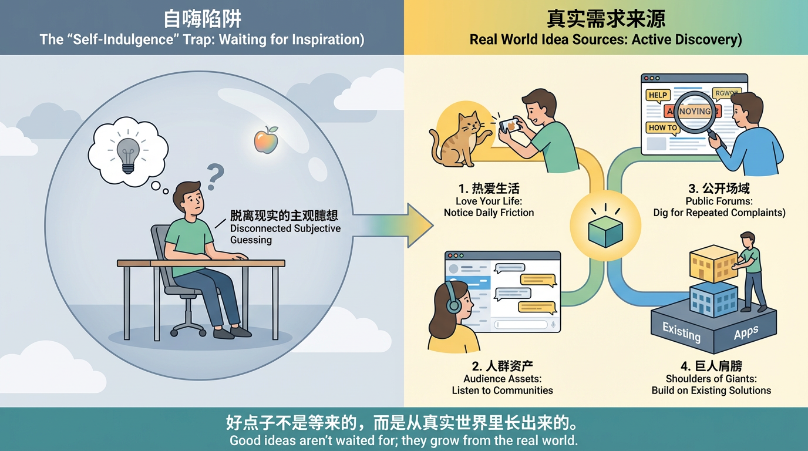
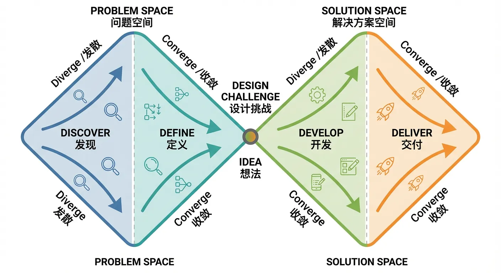
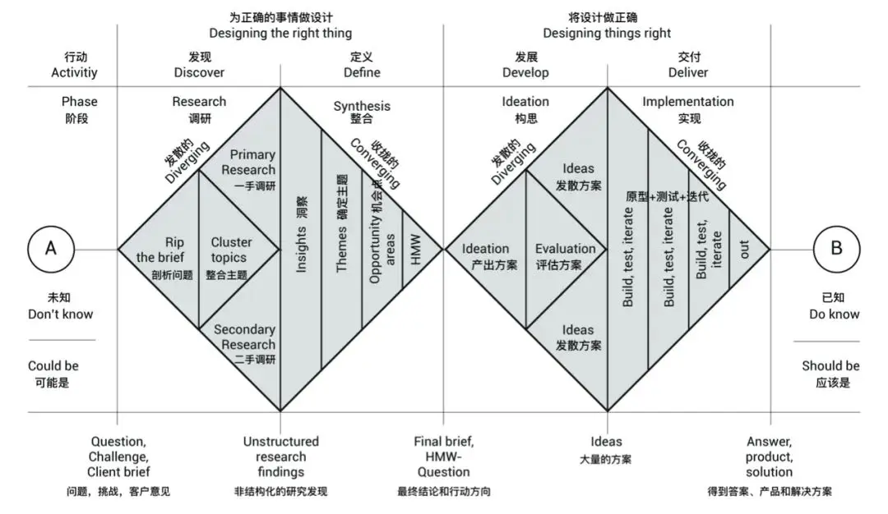
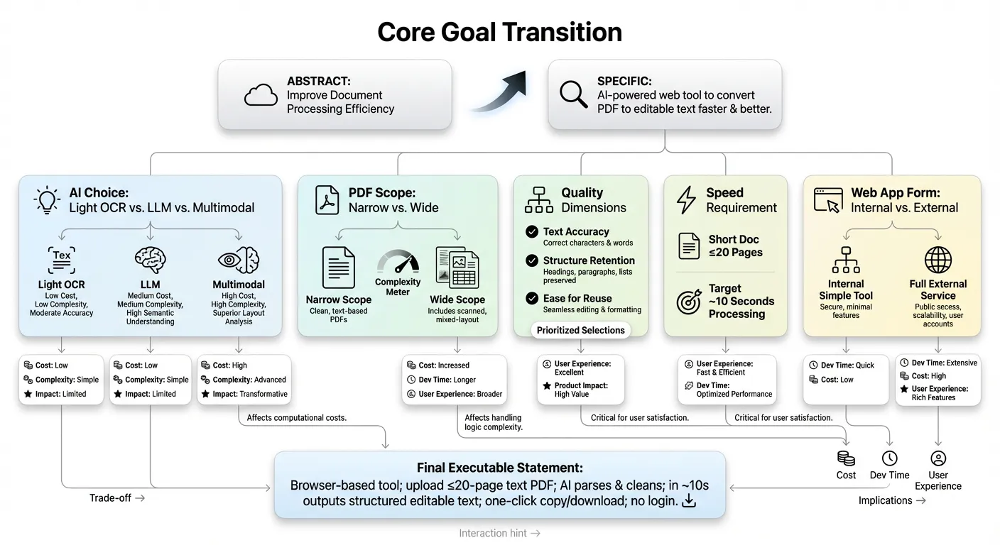
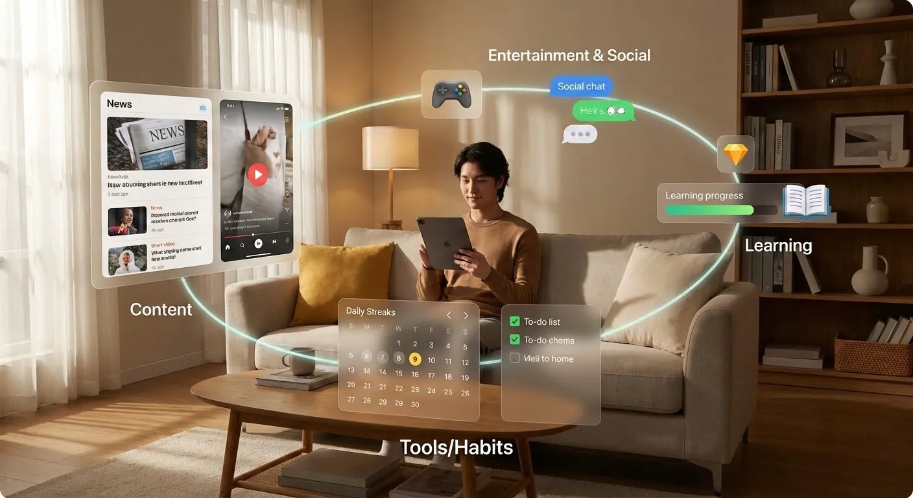
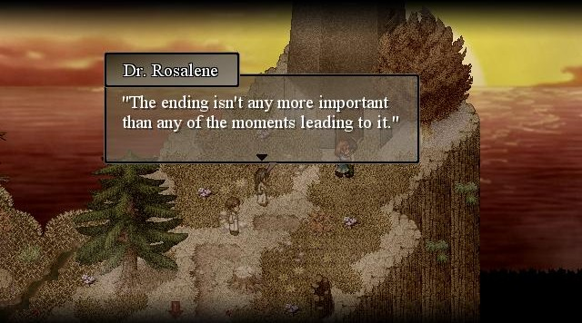

# Tư duy sản phẩm và thiết kế giải pháp

## Dẫn nhập chương

<ChapterIntroduction :duration="duration" :tags="['Tư duy sản phẩm', 'Phân tích nhu cầu', 'Thiết kế giải pháp', 'Insight người dùng']" coreOutput="1 giải pháp sản phẩm hoàn chỉnh" expectedOutput="Tư duy thiết kế sản phẩm có thể bắt tay làm">

Ở các chương trước, bạn đã biết build các tool nhỏ trên z.ai và AI IDE local, cũng đã thử dùng Trae xử lý cấu hình môi trường, cài dependency — bạn đã có khả năng đưa ý tưởng từ trình duyệt về dự án local.

Bây giờ, chúng ta đẩy trọng tâm từ <strong>"có làm được không"</strong> lên <strong>"rốt cuộc làm cái gì mới đáng được làm"</strong>.

Chương này thảo luận hệ thống:
- "Ý tưởng" là gì, thế nào mới gọi là "ý tưởng tốt"
- Làm sao đánh giá một hướng sản phẩm có đáng đầu tư không
- Làm sao dùng quy trình lặp lại để biến cảm hứng mơ hồ thành phương án ứng dụng rõ ràng

<strong>Mục tiêu cốt lõi:</strong> Từ biết build tool nâng lên có thể làm ra ứng dụng AI thật sự có người dùng, tạo giá trị thực.

</ChapterIntroduction>

  <ClientOnly>
    <StepBar :active="0" :items="[
      { title: 'Nguồn ý tưởng', description: 'Tìm ý tưởng sản phẩm đáng tin' },
      { title: 'Tách giải pháp', description: 'Biến ý tưởng thành app làm được' },
      { title: 'Mài giũa & đánh giá', description: 'Từ dùng được tới ngon' },
      { title: 'Phóng đại bằng AI', description: 'Dùng AI hợp lý để tạo giá trị' }
    ]" />
  </ClientOnly>

## Bạn sẽ học được

Tổng quan, bạn sẽ học kiến thức cơ bản để làm một app: ý tưởng từ đâu → ý tưởng thành app thế nào → app từ dùng được thành ngon ra sao → app dùng AI ra sao → làm xong tìm user thế nào.

1. Tôi muốn làm app, ý tưởng từ đâu mới đáng tin?
2. Có ý tưởng rồi, tách thành app làm được thế nào?
3. Làm xong, đánh giá và mài giũa thành "app tốt" thế nào?
4. Ở bước nào, dùng AI ra sao để phóng đại giá trị hợp lý?
5. Có app rồi, làm sao tìm batch user thật đầu tiên từ con số 0?

# 1. Tôi muốn làm app, ý tưởng từ đâu mới đáng tin

Nhiều người vừa nói tới làm app là phản xạ đầu tiên: "Tôi phải nghĩ một sáng tạo đủ ấn tượng đã." Rồi mỗi ngày lướt ranking, đọc bài báo, nghiên cứu các sản phẩm hot, dán mắt vào câu chuyện thành công của người khác, hy vọng có ngày mình cũng vớ được ý tưởng khác biệt.

Nhưng thực tế là, nhiều người vốn chẳng có ý tưởng gì, chỉ đơn thuần lo âu vì không có ý tưởng; cũng có người tự dựng ngưỡng cao: chưa đủ thú vị thì chưa bắt đầu, thấy bình thường nghĩa là thất bại. Khi bạn đi tiếp một đoạn, bạn sẽ thấy các app đi xa và bền vững phần lớn không phải bật ra trong đêm khuya, mà là từ các kịch bản cụ thể trong cuộc sống, xoay quanh vấn đề thật, mọc lên từng chút.

Vì vậy, chương này giải quyết câu hỏi điểm xuất phát: **làm sao có ý tưởng? Ý tưởng đó đáng tin không? Có đáng để bạn đầu tư thời gian và sức lực biến nó thành app thật không?**

## 1.1 Ý tưởng là gì

Bắt đầu từ câu hỏi cơ bản nhưng hay bị bỏ qua: thế nào mới tính là một ý tưởng.

Trong đối thoại hằng ngày, "ý tưởng" thường là cảm giác hứng thú chủ quan. Bạn lướt thấy 1 video rồi nghĩ: "Tôi cũng có thể làm cái tương tự." Hoặc trong cuộc tụ tập, mọi người chê 1 sản phẩm khó dùng, bạn buột miệng: "Giá mà có cái gì tự xử cho mình hết." Lúc này có ý tưởng mơ hồ, nhưng còn xa mới thành thứ làm được.

Đặt cho mình một chuẩn nghiêm hơn một chút. Chỉ khi 1 ý nghĩ thoả mãn các điều dưới, mới gọi là ý tưởng:

Một, **phải hướng tới một nhóm user rõ ràng**. Không nói chung chung "tất cả mọi người", mà nói rõ chủ yếu dùng cho ai — sinh viên, người mới đi làm, phụ huynh có con nhỏ, lập trình viên indie, chủ shop TMĐT, hay chủ doanh nghiệp nhỏ.

Hai, **phải cắm vào một kịch bản cụ thể**. App này dùng vào lúc nào — trên metro buổi sáng, giờ giải lao, trước khi ngủ, cuối tuần dọn tài liệu. Dù tool có vẻ trừu tượng như note, task management, phần thực sự được dùng nhiều phải buộc chặt vào kịch bản nào đó.

Ba, **phải giúp user hoàn thành một task rõ ràng**. Task không cần lớn, nhưng phải nói ra được. Ví dụ: sắp xếp todo trong ngày, tóm bài dài thành vài ý chính, sinh meeting note có cấu trúc, lên lộ trình cuối tuần.

Bốn, **phải đưa ra cách làm/tool tốt hơn hiện trạng**. User trước đây làm thế nào — nhớ trong đầu, ghi giấy bút, Excel, screenshot, chuyển qua lại giữa nhiều app. Nếu bạn cho cách rõ ràng tiết kiệm hơn, ổn định hơn, dễ chịu hơn, ý tưởng mới bắt đầu có giá trị.

Nếu nghĩ chưa thông cũng không sao — đây là thời đại AI. Bạn có thể tổng hợp các nội dung trên thành prompt đầy đủ, kèm ý tưởng, target user và kịch bản của bạn, giao cho mô hình lớn bổ sung và tinh chỉnh. Coi model như đối tác sản phẩm online, đối thoại — hỏi — sửa lặp đi lặp lại, biến concept mơ hồ thành cụ thể.

## 1.2 Ý tưởng và nhu cầu user: phòng tuyến đầu chống tự sướng

Hố lớn nhất người làm app lần đầu hay rơi vào là tự sướng. Bạn phấn khích về sáng tạo của mình, thấy đây là hướng đột phá thế giới, nhưng khi kể cho user thường, phản ứng họ rất lạnh, thậm chí lúng túng, chỉ lịch sự gật đầu "nghe cũng hay". Khi sản phẩm ra mắt, họ không tải, càng không dùng lâu dài.

Để tránh, phải tách rời "ý tưởng" và "nhu cầu user".

Trước hết, **nhu cầu user** là gì. Một câu đơn giản: trong một kịch bản cụ thể, **để đạt mục tiêu nào đó, user muốn giảm chi phí gì, hoặc tăng giá trị gì**. Chi phí ở đây không chỉ là tiền, còn thời gian, sức, gánh nặng tâm trí, rủi ro sai sót, áp lực xã hội. Một newbie công sở có thể chi tiền mua template, chỉ để báo cáo đầu không hồi hộp; phụ huynh có thể trả thêm phí, miễn mỗi ngày có nửa tiếng riêng.

Hiểu điều này, bạn sẽ thấy, **đơn thuần "cool" không tạo thành nhu cầu**. Nhiều sáng tạo đủ mới lạ, nhưng nếu không giúp user nhẹ nhàng hơn, an tâm hơn, tự tin hơn ở mục tiêu cụ thể nào, khó dựng được app bền vững.

Giữa ý tưởng và nhu cầu có khe nứt thường bị bỏ qua. **Ý tưởng đại diện cho phán đoán chủ quan của bạn chứ không phải data hỗ trợ** — bạn thấy gì vui, gì thú vị, gì trông trend. Nhu cầu đại diện cho điều user đang trải qua, đang lo. Bạn có thể thấy tính năng "tự sinh thơ" rất cool, nhưng với đa số user, một tool giúp họ bớt 10 phút mỗi ngày làm việc lặp lại hấp dẫn hơn. Trừ khi bạn như Steve Jobs hay có gu thiết kế cực tốt, khiến mọi người cảm thấy "tính năng tự sinh thơ" cũng rất cool, tự nguyện đi theo — nhưng việc này có độ khó nhất định.

Khi đánh giá ý nghĩ, có cách phân biệt đơn giản: nó giống **nhu cầu thật hay nhu cầu giả**. Đặc điểm rõ của nhu cầu thật: ngay cả khi không có app của bạn, user vẫn chủ động tìm cách giải quyết. Dù cách hiện tại vụng, họ vẫn sẵn lòng tốn thời gian, công sức, thậm chí tiền để lấp hố. Ví dụ có người tự viết script chỉ để giảm chút lao động lặp lại của mình. Trong các kịch bản này, nếu bạn cung cấp giải pháp thân thiện, phổ quát hơn, thường có cơ hội đứng vững.

Nhu cầu giả thì ngược lại. Nếu bạn không chủ động nêu, phần lớn không nhận ra đó là vấn đề, càng không thấy bắt buộc phải giải quyết. Kịch bản bạn vẽ nằm trong tưởng tượng của bạn, không phải đời thường của user. Họ nghe xong chỉ thấy "đồ tốt, thú vị", nhưng không trả tiền, thậm chí quay người là quên. Loại ý tưởng này viết truyện thì được, làm sản phẩm rất nguy hiểm.

Vì vậy, **phòng tuyến đầu chống tự sướng là hiểu nhu cầu user**. Ngay từ đầu, ép mình trả lời câu hỏi có vẻ đơn giản nhưng then chốt: ngoài tôi ra, còn ai đang nghiêm túc khổ vì việc này. Bạn có thể xem forum, cộng đồng, comment, hoặc trực tiếp hỏi vài người có thể trở thành user. Nếu khó nghe được phàn nàn có cảm xúc thật như "mỗi lần đều bị việc này làm trễ" hay "cách hiện tại quá phiền", chứng tỏ ý tưởng còn xa nhu cầu thật.

## 1.3 Vì sao ý tưởng tốt là ý tưởng tốt

Không phải ý tưởng nào cũng có chung số phận. Có ý tưởng, dù bạn chỉ tốn vài ngày làm một bản thô nhưng chạy được flow, cũng tự nhiên thu hút một nhóm nhỏ user thật. Họ ở lại, kiên nhẫn cho feedback. Có ý tưởng khác, dù bạn ráo riết chất tính năng, chi tiền quảng cáo, làm nhiều marketing trên nhiều nền tảng, cuối cùng cũng chỉ dựa vào lực bên ngoài đẩy ra ngắn hạn rồi tắt ngấm.

Khác biệt bản chất là ý tưởng có đạp đúng điểm vấn đề then chốt nào không.

**Ý tưởng tốt tự nhiên đón được tăng trưởng**: dù xuất hiện dưới hình thái thô sơ, chỉ vài nút bấm, miễn giải quyết được phiền nhỏ cụ thể trong tay user, sẽ có tăng trưởng tự nhiên ở mức nhất định. Ví dụ tool chuyển voice thành text nhanh, ban đầu chỉ là web với vài nút, nhưng chỉ cần độ chính xác đủ tốt, conversion tự nhiên, nhiều người tự nguyện gửi link cho bạn bè vì đang tiết kiệm thời gian cho họ.

**Ý tưởng tệ thường ngay từ đầu đã định phải dựa lực bên ngoài**. Dù ngoại hình đẹp, kernel sang trọng, bạn phải đẩy liên tục, hô hào liên tục, giải thích liên tục — vừa giảm lực kéo người là data sử dụng tụt thẳng đứng. Bạn liên tục đổ resource, kéo hợp tác, làm event, nhưng vĩnh viễn có cảm giác ngược dòng. Vấn đề không phải execute kém, mà điểm bạn đạp không trúng pain thật đủ.

Tất nhiên không tuyệt đối — ví dụ giai đoạn sớm user có thể chưa nhận ra giá trị có độ trễ, hoặc có đối thủ phải cân nhắc thêm ngoại hình, ease of use, brand. Nhưng đó là nội dung sâu hơn, tạm chưa bàn.

Khi bàn việc có nên đầu tư tiếp ý tưởng, cần quan tâm không phải sáng tạo cool đến đâu, mà nó có tự nhiên mọc ra con đường từ vấn đề tới giải pháp không. Làm ý tưởng không phải để chứng minh sáng tạo, mà để tìm điểm xuất phát có giá trị — đi theo đó, dần mài từ tool nhỏ thành app thật sự ngon.

Chọn lựa quan trọng hơn nỗ lực.

## 1.4 Ý tưởng tốt từ đâu: 4 nguồn lớn và ví dụ cụ thể

Nhiều người nói tới "nghĩ ý tưởng", hình dung là một người đóng cửa, nhìn trần nhà, mong cảm hứng rơi xuống. Thực tế ý tưởng tốt đa số không đến vậy. Chúng từ quan sát nhỏ trong cuộc sống, từ câu hỏi lặp đi lặp lại trong cộng đồng, từ đống phàn nàn trên mạng, từ các sản phẩm đã có — được lọc dần.

4 nguồn dưới đây, nếu bạn chịu làm nghiêm túc, rất dễ đào ra hướng có thể khởi động.

### Yêu cuộc sống của mình

Nguyên tắc giản dị nhưng hiệu quả: **bạn càng có cảm giác tham gia vào đời sống, càng dễ phát hiện vấn đề, càng có khả năng phán đoán cái gì đáng giải quyết**. Tham gia là tự trải nghiệm, thử, đạp hố, không phải nhìn người khác qua màn hình. Càng nghiêm túc với sở thích, càng có khả năng nó thành đất màu mỡ cho ý tưởng.

Ví dụ bạn thích nuôi mèo, 1 ngày sống cùng mèo cho bạn nhiều thông tin hơn 100 video "tips nuôi mèo". Bạn biết mèo dễ đập đổ đồ ở đâu, giờ nào nó nhảy nhót nhiều nhất, lúc nào dễ bị giật mình, tự tay dọn cát, chải lông, cắt móng, đi khám. **Mỗi trải nghiệm không thuận lợi đều là gợi ý sản phẩm tiềm năng**.

Chụp ảnh cho mèo là ví dụ: bạn giơ điện thoại, mèo không nhìn lens — cứ cúi liếm chân hoặc nhìn góc khác. Có thể làm tool nhỏ: trên màn hình điện thoại/tablet có chấm đỏ, lông vũ, sâu nhỏ tự di chuyển để hút mắt mèo. Khi bấm chụp, nó tự xuất hiện gần camera trước, "lừa" mắt mèo về hướng camera, chụp burst, giúp bạn chọn tấm rõ và đẹp. Nâng cấp: app còn ghi nhận từng con mèo thích màu nào, quỹ đạo nào, lần sau tự dùng mode "câu mèo" riêng cho nó.

Nếu bạn thích trang điểm/dưỡng da, mỗi chai trong tủ là kết quả nhiều thử nghiệm. Bạn đã quen chụp ảnh look mỗi lần, nhưng mỗi lần xem lại phải nhớ ngày đó dùng son nào, eye palette nào. Có thể ghi lại có hệ thống thành "atlas trang điểm" cá nhân? App có thể thống kê: look nào dùng nhiều dịp gì, combo nào ăn ảnh nhất, lần sau chọn không phải nghĩ từ 0.

Cụ thể: nhiều người sáng vội, mở album tìm "look đi làm thành công lần trước", lật cả nửa giờ không nhớ dùng gì. Có thể có function: chụp xong look chỉ cần nói "hôm nay là look phỏng vấn, dùng palette eye 01 màu cam-nâu và son đậu", app tự nhận diện tạo "công thức look" gắn với ảnh. Lần sau search "phỏng vấn", "eye cam-nâu", "đậu" là ra tất cả look liên quan, thậm chí tự sinh list "hôm nay chỉ xem look hợp đi làm, làm trong 5 phút".

Nếu bạn thích city walk hoặc slow travel, có thể bạn đang dùng nhiều tool ghép trải nghiệm: map ghi route, note list quán cà phê, album rải rác ảnh và cảm xúc. Có thể có app gói lại tất cả thành walk log có timeline, có câu chuyện? Tiến hơn, chia sẻ route cho bạn, để họ đi cùng thành phố theo phiên bản khác.

Đào sâu chi tiết: city walk có cảm giác "lúc đó thấy góc này đẹp, về nhà không tìm lại được trên map". Có thể làm function siêu nhẹ: bạn đi tới ngã rẽ thấy có cảm, chỉ cần giữ nút trên tai nghe, nói "đánh dấu chỗ này, hợp đi dạo hẹn hò", app tức thì đánh dấu có voice tại vị trí, tự ghi giờ, thời tiết, độ ồn. Sau này bạn hoặc bạn của bạn, chỉ cần mở map thành phố, sẽ thấy các "điểm vibe do dân thử thực tế": chỗ nào hợp đi 1 mình, chỗ nào hợp xem đêm, chỗ nào hợp đi bộ chat.

Các ví dụ này chỉ muốn nói: **bạn cần yêu cuộc sống của mình, cuộc sống là nguồn ý tưởng tốt nhất**. Mỗi bối rối hằng ngày, mỗi cách thoái giải tạm thời, mỗi chỗ thấy phiền nhưng cứ chịu — chỉ cần bạn chịu nhìn thêm chút, hỏi "có thể dùng tool nhỏ sửa không", đều có thể thành phôi sản phẩm.

### Khai thác từ tài sản nhân khẩu của bạn

Tài sản nhân khẩu là một nhóm bạn đã có thể tiếp cận. Có thể là độc giả, cộng đồng bạn quản lý, group nội bộ công ty, hoặc community sở thích bạn lâu năm. Chỉ cần bạn có kênh, **có thể ổn định nghe một nhóm người ngày nào nói gì, phiền gì, mong gì**, bạn đã có lợi thế lớn so với người bắt đầu từ con số 0.

Ví dụ thường gặp. Nếu bạn là organizer cộng đồng designer, mỗi ngày nhìn group là một bể nhu cầu quý. Có người than client đổi brief liên tục, có người than cách tính phí của site asset, có người thấy chỉnh size qua lại giữa các platform tốn quá nhiều thời gian. Mỗi than vãn là gợi ý sản phẩm. Bạn có thể làm tool sizing đơn giản, 1-click gen ra mọi size platform thông dụng; hoặc tool lưu và tái dùng các component thường dùng.

Nếu bạn ở cộng đồng ôn thi, group có thể lâu nay đầy chủ đề: hôm nay không trạng thái, plan delay nữa, đọc tài liệu gì hiệu quả, làm sao kiên trì check-in. Bạn không cần tưởng tượng từ không khí, chỉ cần quan sát một thời gian, tổng hợp các pain chung lặp lại, là vẽ được hướng chức năng app học: tách target hợp lý hơn, feedback check-in nhân văn hơn, trực quan hoá tiến độ thực tế hơn.

Trong các kịch bản này, bạn không phải làm sản phẩm rộng cho tất cả ngay từ đầu. Chỉ cần thừa nhận: nhóm nhỏ trong tay bạn là điểm xuất phát tốt nhất. Bạn càng hiểu sâu họ, càng biết các phiền họ nói được và không nói được, càng có cơ hội làm ra thứ thực sự được dùng.

### Khai thác nhu cầu từ không gian công khai

Dù tạm thời chưa có community hay reader riêng, đừng lo. Internet mỗi ngày có vô số người lớn tiếng nói về khó khăn và bất mãn của họ trên các platform. Các giọng nói trong không gian công khai là kho báu lớn, chỉ có điều đa số không nghe nghiêm túc.

Chọn vài platform liên quan ngành bạn quan tâm, định kỳ search các từ khoá có cảm xúc, ví dụ: **bực quá, có ai gợi ý, giải quyết thế nào, phiền thật, có cách nào tốt hơn**. Kiên nhẫn xem post và comment, chú ý 2 loại thông tin.

Một là vấn đề nào đó được nhắc đi nhắc lại dài hạn. Ví dụ board việc làm, cứ một thời gian lại có người hỏi viết CV thế nào, intro thế nào, follow up phỏng vấn ra sao; ở group mẹ bỉm, luôn xuất hiện chủ đề ăn dặm, điều chỉnh giấc, nói chuyện cha mẹ-con; community thương mại nhỏ, luôn lo về quản lý inventory, cash flow, xếp ca. Các vấn đề lặp dài hạn đó là pain hệ thống bị một ngành lặp đi lặp lại phơi ra.

Hai là một số kịch bản user dùng cách rất vụng để cố. Ví dụ ghi todo trên giấy, chụp ảnh upload cloud; copy paste giữa app này app kia chỉ để chuyển format; tổng hợp data từ nhiều kênh thành 1 bảng bằng tay. Các chỗ đó, chỉ cần quan sát tâm là thấy nhiều khoản nhỏ có thể flow-hoá, tool-hoá.

Đào nhu cầu trong không gian công khai thực ra là rèn năng lực: từ observer thành catcher. Khi bạn quen search các keyword, quen ghi case, não bạn dần tích luỹ độ nhạy với vấn đề thực, độ nhạy này sẽ giúp bạn rất nhiều lần trong thiết kế sản phẩm sau này.

### Đứng trên vai khổng lồ

Một nguồn ý tưởng hay bị bỏ qua là sản phẩm và project đã có. Đã có quá nhiều người giỏi đi qua đường khám phá thay chúng ta. Bạn không cần lúc nào cũng bắt đầu từ giấy trắng, hoàn toàn có thể đứng nơi người khác đã làm được nửa rồi, bước thêm 1 bước nhỏ.

**Hackathon, cuộc thi đổi mới sản phẩm, Startup Demo Day** thường xuất hiện nhiều tác phẩm nhỏ thú vị. Đặc điểm: thời gian gấp, resource hạn. Khá giống app nhỏ bạn muốn làm. Khi xem các tác phẩm đoạt giải, có thể hỏi thêm 2 câu: nếu chỉ phục vụ một nhóm hẹp hơn, có dễ làm hơn không. Nếu cắt một nửa hay 2/3 chức năng, chỉ giữ core, có rõ ràng hơn không.

Tương tự, **ranking sản phẩm, open source project, site tổng hợp tool** liệt kê các tool, đều có thể là điểm xuất phát suy nghĩ. Chọn vài cái bạn quan tâm, tách lẻ: nó giúp ai giải quyết gì, hiện tại còn lỗ hổng gì, nếu di chuyển sang kịch bản khác hoặc nước khác, sẽ khác thế nào. Bạn không phải copy, mà qua tách lẻ rèn hiểu mối quan hệ vấn đề-giải pháp.

Thế giới offline cũng vậy. Mỗi lần xếp hàng đăng ký bệnh viện, đợi số ở nhà hàng, điền cùng thông tin nhiều lần ở cơ quan hành chính, viết lặp lại trên form giấy, có thể chủ ý dừng và hỏi: ở đây có không gian gì có thể **hệ thống hoá, số hoá, tự động hoá**. Các kịch bản trông lộn xộn, lặp lại, kém hiệu quả là đất nuôi các tool tương lai.

Đào liên tục từ 4 đường này, bạn sẽ thấy ý tưởng không phải kỳ tích xuất hiện trong đầu, mà là sản phẩm phụ tự nhiên của tương tác dài hạn giữa bạn với cuộc sống, người khác, và thế giới thông tin.

## 1.5 Cách tóm ý tưởng tốt trong một câu: nghệ thuật "ít là nhiều"

Khi đã biết ý tưởng từ đâu, bài tập quan trọng kế tiếp **là thử nói rõ trong một câu**. Bài này nghe đơn giản nhưng tàn nhẫn, vì nó ép bạn đối mặt sự thật: **ý tưởng của bạn rốt cuộc có nắm trúng một core thật sự rõ ràng không.**

Người ta nhớ một người, hiếm khi vì mọi thứ đều ổn, mà vì một đặc điểm rõ. Có thể luôn đội mũ kiểu nào đó, cách nói chuyện rất vững, hoặc luôn ném ra một câu chốt khi thảo luận. Sản phẩm cũng vậy. **Thay vì để người khác miễn cưỡng nhớ chục tính năng của bạn, hãy để họ có ấn tượng giản dị nhưng rõ ràng.**

Hố thường gặp khi viết câu này là quá rộng. Ví dụ: "Đây là app giúp user nâng cao trình độ tiếng Anh." Nhìn thì không sai, nhưng đào sâu, câu này gần như chưa nói gì: giúp ai — học sinh, dân đi làm; bằng cách nào — học từ, luyện nghe, sửa phát âm, sửa writing; tốn bao thời gian, đem lại thay đổi gì. Tất cả info then chốt đều bị pha loãng.

Câu cụ thể hơn: "App học từ giúp bạn dùng 10 phút commute mỗi ngày, một tháng thuộc 100 từ core". Ít nhất nói 3 điều: chi phí kiểm soát được (10 phút/ngày); kết quả nhìn thấy (100 từ mới/tháng); kịch bản rõ (commute, không phải thời gian vụn khác). User nghe xong nhanh chóng đánh giá thứ này có hữu ích cho mình không.

Bài tập viết câu này thực ra là ép mình trả lời 3 câu hỏi: **bạn giúp ai, bạn muốn họ nhớ tới bạn trong kịch bản nào, bạn dự định trong bao lâu giúp họ đạt kết quả gì**. Chỉ khi bạn ghép thông tin này lại, dù hy sinh từ ngữ hoa mỹ, ý tưởng mới thực sự có thể hiểu và truyền.

Có thể đảo chiều, dùng bài này cho chính mình. Thử viết 1 câu mô tả 3 năm tương lai của mình. Ví dụ, "3 năm sau, tôi có thể nói 1-2 câu mình chủ yếu giúp nhóm nào, giải quyết vấn đề gì, đã làm được những kết quả nhìn thấy nào." Bài tập này giúp bạn rõ hơn khi chọn lựa, biết cái gì phải bám chặt, cái gì có thể bỏ. Học bỏ khó và đúng hơn học thêm.

Không biết học cách diễn đạt này từ đâu? Đơn giản: xem các nội dung mỗi ngày được mài để tranh sự chú ý của user. Tham khảo **mô tả 1 câu trên app store, title chính trên trang chủ của game/tool, copywriting cốt lõi trên các Landing Page**. Có thể chép ra, tách cấu trúc, dùng AI viết bản mới cho ý tưởng của bạn.

## 1.6 Dùng AI brainstorm và tìm khác biệt

Trước đây nghĩ ý tưởng đa số chỉ tự mò. Nay có AI, bạn có thêm đối tác brainstorm có thể gọi bất cứ lúc nào. Dùng tốt, nó mở rộng không gian suy nghĩ.

Khi kẹt một hướng, nghĩ tới nghĩ lui chỉ vài cái, mô tả ý tưởng cho AI rõ ràng, rồi nhờ nó vài việc. Ví dụ, **dựa trên cùng task core, liệt kê 20 nhóm user khác nhau**, hoặc từ góc sinh viên, freelancer, phụ huynh, chủ shop nhỏ — mô tả lại các cách dùng có thể. Hoặc nhờ đứng ở role PM, Operation, Marketing, Tech, đưa các điểm quan tâm.

Bạn sẽ thấy nhiều kịch bản bạn không tự nghĩ ra sẽ được ném cho bạn. Task của bạn không phải nhận hết, mà trong không gian được mở ra này, **chọn miếng bạn hiểu sâu và có resource ưu thế nhất**. Ví dụ AI list nhiều ngành, nhưng bạn thấy mình đặc biệt có cảm với giáo dục và content creation, ưu tiên đào theo 2 hướng này.

Trong quá trình này, một nguyên tắc quan trọng: **ý tưởng phổ biến không nghĩa là vô hiệu**. Newbie thường phản xạ tránh tất cả hướng đã có, nghĩ ai đã làm là không có cơ hội. Thực tế không vậy. Học từ, todo, sổ chi tiêu, check-in habit — các hướng "có vẻ phổ biến" đó liên tục có người làm vì vấn đề đằng sau thực sự phổ biến. Trường hợp này, cạnh tranh không phải có sáng tạo hoàn toàn mới, mà **ai hiểu rõ một nhóm nhỏ hơn, ai bám sát cuộc sống của họ trong chi tiết hơn**.

Bạn có thể list các ý tưởng dễ nghĩ ra cho newbie: tool học từ, app check-in hằng ngày, trợ lý ghi chú sách, CV generator, tool xây thói quen. Rồi với mỗi cái, riêng làm 1 vòng tách với AI, tập trung 3 câu hỏi: nếu chỉ phục vụ nhóm rất cụ thể (designer, luật sư, mẹ bỉm, học viên cao học), ý tưởng này sẽ ra hình thái khác nào. Nếu chỉ nhắm 1 kịch bản cố định (đường commute, nghỉ trưa 10 phút, nửa giờ trước khi ngủ), function và hiển thị có thể focus hơn không. **Nếu tôi đẩy "kết quả trình bày" đến cực hạn (dễ share, dễ print, dễ import vào hệ thống khác), có đủ thành khác biệt không**.

Giá trị AI ở đây không phải thay bạn ra quyết định, mà giúp bạn biến đường hẹp thành map đầy đủ hơn. Bạn nhanh thấy chỗ nào đã được người khác cày, chỗ nào còn trống tương đối. Còn đi đường nào, cuối cùng vẫn quay về câu hỏi cũ: chỗ nào bạn thật sự quan tâm, hiểu đủ sâu, sẵn lòng đầu tư dài hạn.

Cuối cùng, nhấn mạnh lại đường đáy. Mọi thảo luận về ý tưởng và sáng tạo cuối cùng đều phải về nhu cầu user. Bạn dùng AI hỗ trợ suy nghĩ, dùng nó tăng tốc gen variant, nhưng dù brainstorm bao nhiêu vòng, chuẩn cuối luôn là: ý tưởng này có thật sự đáp lại pain thật của một nhóm người không, có đẩy về phía trước một bước nhỏ ở vấn đề họ đang lặp lại cố giải quyết không.

## Tóm tắt

Bạn cần học dùng vài chiều đơn giản kiểm tra một ý tưởng đã đủ rõ chưa; phân biệt cái bạn thấy cool với cái user thật sự cần; biết ý tưởng tốt là tốt vì ngay từ đầu đã đạp một pain; học đào liên tục từ cuộc sống, tài sản nhân khẩu, info công khai và sản phẩm đã có; luyện nói 1 câu rõ ý tưởng; dùng AI làm partner mở rộng tư duy, không phải tool thay thế phán đoán.

Khi đã có 1-3 ý tưởng như vậy, **có thể nói 1 câu** rõ mỗi cái dùng cho ai, kịch bản nào, đem lại kết quả nào, bạn có thể dừng tiếp tục nghĩ ý tưởng mới, chuyển chú ý sang bước tiếp: làm sao tách 1 trong số đó thành app thực sự làm được, có user thật dùng được.

Ý tưởng này hơi tệ thì sao? Không sao, lúc đầu tệ mới đúng. **Hoàn thành luôn quan trọng hơn hoàn hảo** — bạn phải bắt đầu mới có kết cục.

## 📚 Assignments

Theo nội dung trên, hoàn thành các bài tập:

1. Kết hợp sở thích, dùng AI sinh vài "ý tưởng" app cho mình
2. Để AI đánh giá theo ý tưởng của bạn — đây là nhu cầu thật hay giả, đưa ra insight user và gợi ý
3. Từ 4 nguồn chọn 1-2 nguồn ra "ý tưởng", hoặc để AI sinh vài ý tưởng app
4. Từ tất cả idea trên, chọn 3 cái thích nhất, thử dùng 1 câu giàu thông tin tóm ý tưởng

# 2. Có ý tưởng rồi, tách thành app làm được thế nào

Chương trước giải quyết vấn đề điểm xuất phát: thế nào mới là ý tưởng đáng đối xử nghiêm túc.

Thử thách thực sự bắt đầu từ đây. Nhiều người gục ở bước này: trong đầu một bản blueprint trông hoàn chỉnh, vừa bắt tay là thấy phức tạp không biết bắt đầu từ đâu. Quá nhiều function, quá nhiều page, kỹ thuật trông sợ, dần delay, cuối cùng thành câu **tự an ủi**:

"**Không sao, sau này có dịp làm sau đi…**"

Đừng nghĩ nữa! Là bây giờ! Chương này muốn giúp bạn học một bộ phương pháp tách từ ý tưởng tới phiên bản làm được. Bạn sẽ thấy, từ không tới có không dựa vào thiên tài, mà dựa vào loạt động tác cụ thể có thể luyện lặp đi lặp lại: **phát tán, hội tụ, tách, tinh chỉnh, tham khảo, hỏi**. Theo trình tự này, dù không có team, không có nhiều thời gian, bạn vẫn biến được ý tưởng thành demo app chạy được.

## 2.1 Từ ý tưởng tới giải pháp: mô hình Double Diamond từ phát tán đến hội tụ

Khi đã biết vẽ trang nêu ý tưởng, bạn sẽ nhanh gặp vấn đề: ý tưởng càng lúc càng nhiều. Trên whiteboard bạn viết các kịch bản và function có thể, trên giấy đầy các phiên bản trang khác nhau, trông rất thành tựu, nhưng đến lúc thật sự làm, lại khó bắt tay hơn. Vì mỗi cái trông quan trọng, đều có vẻ đáng thử.

Lúc này cần một framework tư duy kinh điển nhưng dễ hiểu: mô hình Double Diamond. Ý nghĩa giản dị: ở nhiều giai đoạn của đời, bạn cần phát tán trước, hội tụ sau, không phải làm tất cả 1 lần.

### Double Diamond là gì

Mô hình do British Design Council đề xuất, framework innovation & design, ví toàn quá trình thành 2 hình thoi liên tiếp ("Double Diamond"): kim cương 1 từ "phát hiện vấn đề" tới "định nghĩa vấn đề rõ ràng" — phát tán rộng, research và hiểu user, rồi hội tụ ra vấn đề core thật sự cần giải quyết; kim cương 2 từ "phát triển giải pháp" tới "bàn giao phương án cuối" — phát tán táo bạo ý tưởng giải pháp, prototype iteration, rồi hội tụ chọn ra phương án ngon nhất khả thi. Double Diamond nhấn cả 2 giai đoạn vấn đề và giải pháp đều phải "phát tán-hội tụ", tránh nhảy thẳng vào giải pháp, nâng chất lượng đổi mới.

### Kim cương 1: Hiểu vấn đề, từ điểm tới toàn cảnh phát tán và hội tụ

**Kim cương 1 là về vấn đề bản thân**. Bạn bắt đầu từ nhận thức mơ hồ, dần phát tán ra nhiều tình huống và khả năng liên quan, rồi hội tụ tìm điểm vấn đề thật sự đáng giải quyết.

Áp vào app:

**Phát tán: liệt kê nhiều nhất các kịch bản dùng có thể của user**, các trở ngại có thể gặp, các kết quả họ mong. Đừng vội đánh giá, chỉ trải hết ra. Ví dụ với app xử lý tài liệu, liệt kê user có thể dùng trên metro, trước họp, trước viết report, lúc review; sợ tóm tắt không đúng, sợ format loạn, sợ miss point chính; mong nhanh hiểu bài dài muốn nói gì, nhanh tìm phần liên quan mình.

**Hội tụ: ép mình chỉ chọn 1-2 tình huống phổ biến và đau nhất**. Ví dụ từ đống kịch bản, nhiều người nói nhất là khi nhận tài liệu công việc dài, muốn hiểu nhanh nó muốn nói gì, kết luận chính là gì. Bạn đặt mục tiêu v1: giúp user trong 5 phút hiểu core 1 bài dài, không phải đồng thời giải quyết mọi vấn đề liên quan xử lý tài liệu.

Kết thúc kim cương 1, bạn nên rõ hơn lúc bắt đầu: **vấn đề thật sự bạn giải quyết là gì, so với vấn đề kế bên, ưu tiên nó cao hơn vì sao**.

### Kim cương 2: Thiết kế giải pháp, từ ý tưởng thô đến phương án thực thi

**Kim cương 2 là về sự ra đời của giải pháp**. Đã biết đại khái giải quyết vấn đề nào, kế tiếp là nghĩ càng nhiều cách càng tốt cho vấn đề đó, rồi lọc ra cái phù hợp nhất cho phiên bản đầu.

Phát tán nghĩa là liên tục thêm ý. Brainstorm các function, các kịch bản chi tiết hơn, các gameplay khả dĩ. Ví dụ tóm văn bản dài, có thể nghĩ độ chi tiết tóm khác nhau, hình thức trình bày kết quả khác nhau, có hỗ trợ voice broadcast không, cho user đánh dấu point không, cung cấp các style tóm khác nhau không. Bước này không cần ra quyết định ngay, chỉ liệt kê khả năng.

Hội tụ: dùng công cụ đánh giá đơn giản nhưng rất thực dụng — **giá trị user × tính khả thi × chi phí thời gian**. Cho mỗi ý 1 điểm thô ở 3 chiều, ví dụ 1-5 điểm, rồi ưu tiên ý tổng điểm cao, chi phí thời gian kiểm soát được làm thành phần MVP.

Ví dụ voice broadcast giá trị có thể tốt, nhưng integrate tech + front end thời gian cao; còn text summary và extract point đơn giản, giá trị tương tự, khả thi cao, thời gian thấp, hợp hơn làm function bắt buộc v1.

Trong quá trình, liên tục nhắc mình: **mục tiêu v1 không phải làm app hoàn hảo, mà làm phiên bản tồn tại thật, có người dùng được thật**. Không cần bao trùm hết, chỉ cần làm tốt 1 task cụ thể.

Có thể đặt biên thời gian cho kim cương 2, ví dụ 1 tháng giao 1 bản dùng được. Mọi ý trong phát tán mà cần hơn 1 tháng để landed, đều có thể tạm gác vào "list xem sau". Bạn không bị kéo lại từ đầu vì muốn làm quá nhiều.

Khi quen dùng Double Diamond tổ chức suy nghĩ, nhiều tình huống rối beng sẽ sạch sẽ hơn. Bạn biết giai đoạn nào nghĩ nhiều, giai đoạn nào dứt khoát cắt. Bạn không còn mong giải quyết mọi vấn đề 1 lần, mà học chuyển qua lại giữa phát tán và hội tụ.

## 2.2 Lấy được các bước thực thi: học từ trừu tượng tới cụ thể

Sau phát tán, có ý tưởng rất đơn giản, nhưng lấy được các bước thực thi rất khó. Nói "tôi muốn làm tool nâng hiệu suất", "tôi muốn làm app giúp content creator" nghe rất lớn. Khi thật sự bắt tay, trừu tượng gần như vô dụng. Mỗi ngày bạn đối mặt vấn đề cụ thể: **v1 cụ thể làm phần nào, cần page nào**, có cần register-login, có cần payment.

Cần năng lực gọi là **tách và tinh chỉnh, biến trừu tượng thành cụ thể**. Tách target lớn rộng từng chút thành các action item nhỏ có thể làm ngay. Năng lực này quan trọng cả khi làm sản phẩm và trong đời.

### Bắt đầu từ ví dụ đời: "tôi muốn ăn burger" rốt cuộc nghĩa là gì

Trước tiên không nói app, về ví dụ đời: tôi muốn ăn burger. Câu này không phức tạp, nhưng nếu tách sâu, có nhiều nhánh cụ thể bên trong.

Đầu tiên là **động cơ và nhu cầu core trong lòng**. Bạn thật sự muốn ăn burger? Bạn chỉ thèm vị, muốn giải quyết bữa nhanh, muốn tụ tập với bạn, hay chỉ vì lướt thấy ảnh đẹp. Tưởng không quan trọng, nhưng ảnh hưởng trực tiếp chọn lựa sau. Vì tụ tập có thể có yêu cầu môi trường; chỉ chạy thời gian thì nhanh quan trọng hơn ngon.

Tiếp là **phạm vi hành động**. Loại burger gì? Mấy giờ? Chỉ ăn burger hay muốn cả combo (drink, fries, dessert). Nếu lát có việc, không muốn ăn no, lựa chọn khác. Có thể hỏi tiếp: có mua sẵn cho sáng mai không, ví dụ mang thêm 1 burger đơn giản về.

Sâu hơn là **làm việc đó thế nào**. Burger với bạn là phải đến quán, hay ship cũng được, thậm chí tự nấu nhà. Mỗi chọn lựa tương ứng 1 đường action hoàn toàn khác. Đi quán nghĩa là check vị trí, giờ, lộ trình; ship nghĩa là xem app, so giá, so thời gian; tự nấu nghĩa là chuẩn bị nguyên liệu, dụng cụ, tìm recipe.

Khi bạn tách rõ, câu "tôi muốn ăn burger" mơ hồ thành chuỗi action cụ thể. Ví dụ: mở app ship, search quán đã ăn thấy ngon, chọn 1 combo, bỏ drink chỉ lấy burger và fries, ghi chú không sốt, đặt. Các action rất nhỏ, đều có thể làm ngay, và có thể được AI gen 1 plan có thể tự động hoá.

**Tách và tinh chỉnh có ý nghĩa ở đây: giúp bạn từ ước muốn lớn, trừu tượng, xuống tới list có thể thực thi cụ thể.**

### Ví dụ app: "nâng hiệu suất xử lý tài liệu" bắt đầu từ đâu

Ví dụ phức tạp hơn, có lớp. Giả sử bạn có ước muốn nghe khá chính đáng: "tôi muốn làm app nâng hiệu suất xử lý tài liệu." Hướng đúng, nhưng dừng ở nửa câu là gần như không biết bắt đầu. Bạn không biết bước 1 vẽ page nào, không biết v1 phải đến mức nào, càng không biết giải thích cho người khác thế nào.

Lúc này dùng cách tách trên, từng bước cụ thể hoá; vì thời gian, đây chỉ demo 2 layer tách.

#### Tách layer 1

**Đầu tiên cần định nghĩa "tài liệu" là gì**. Tài liệu là khái niệm rộng — bảng tính, Word report, PDF, Markdown comment code, TXT note, file ảnh OCR, paper học thuật có đồ thị/công thức. Function "xử lý" thiết kế sau phải khớp loại cụ thể, nên phải tinh chỉnh định nghĩa tài liệu. Ảnh thì cần OCR; bảng thì core là extract và phân tích data, không phải đơn thuần text summary.

**Tiếp theo, định nghĩa "xử lý". Xử lý ra cái gì mới tính là đã xử lý?** Cách xử lý là gì? Có người "xử lý" là gọn 1 report 50 trang xuống 5 trang readable; có người "xử lý" là chuyển đống Word/PDF/Markdown format loạn thành template thống nhất; có người quan tâm dịch, viết lại, polish — bản nháp thành bản chính thức có thể publish. Hỏi mình ngay: "xử lý" của tôi là "xem nhanh hơn", "sửa tốt hơn", hay "gửi người khác tiện hơn". Câu trả lời khác nhau, page entry và operation sẽ hoàn toàn khác.

**"App" cũng cần định nghĩa**. App là gì? Tool nhỏ chỉ cho mình dùng, hay mong sau có nhóm user dùng? Web app, mobile app, hay function nhỏ trong hệ thống có sẵn? Chỉ dùng máy tính của mình thì web đơn giản hay CLI script, chi phí thấp; nếu cho team đồng nghiệp, phải nghĩ account, permission, collaboration entry. Nghe như tech selection, nhưng giai đoạn tách chỉ cần trả lời 1 câu giản dị: tôi định dùng trên thiết bị nào, kịch bản nào.

Tiếp theo, **về chính câu "nâng hiệu suất xử lý tài liệu"**, tách rõ vài keyword. **"Nâng bằng cái gì"** — bắt buộc dùng AI? Hay không nhất định? Có nâng được bằng rule, template, shortcut: 1 nút gen cover format cố định cho report, 1 nút insert disclaimer chuẩn. Loại này có thể không cần model. Ngược lại, nếu bạn đối mặt nhiều text dài không cấu trúc, cần hiểu, summary, viết lại, AI tự nhiên là một mảnh.

"Hiệu suất" cũng đáng tách. **Hiệu suất là gì? Chỉ tốc độ, hay cả tốc độ + chất lượng + error rate + độ khó hiểu?** Ví dụ từ doc 20 trang xem 30 phút xuống lướt 5 phút, là tốc độ; user nhanh phát hiện logic sai, data mâu thuẫn trong summary, là chất lượng; người không quen jargon cũng hiểu được report nhờ giải thích và annotation, là hạ ngưỡng nhận thức. Hỏi thẳng: nếu app cực kỳ thành công, thay đổi lớn nhất cho user là gì? "Thời gian dành cho doc giảm nửa" hay "khi xử lý doc, tâm không mệt nữa"? Trả lời rõ, priority function có căn cứ.

#### Tách layer 2

Trên là layer 1. Giả sử ở giai đoạn này, kết quả tách sơ là: "tôi muốn làm 1 web app dùng AI nâng tốc độ và chất lượng chuyển PDF thành text". Câu này so với "nâng hiệu suất xử lý tài liệu" đã cụ thể hơn nhiều: rõ loại tài liệu (PDF), cách xử lý (chuyển text), hướng tối ưu (tốc độ và chất lượng), đường tech (AI), hình thái (web app). Từ góc nhu cầu, đã từ ước muốn trừu tượng co lại thành ý function tương đối rõ.

Nhưng mô tả này vẫn chỉ là "mục tiêu trung gian", chưa phải phương án sản phẩm thực thi được. Vì **nhiều info then chốt vẫn còn rộng: "dùng AI nào", "tới mức nào", "khớp kịch bản nào", "cho user thế nào"**. Vì vậy có thể, và cần, **tiếp tục tách xuống, biến câu này thành nhóm quyết định thiết kế và phương án kỹ thuật grain nhỏ hơn**.

Trước tiên là "AI". "AI" này là OCR nhẹ chỉ nhận diện text, hay cần LLM, thậm chí multimodal, để sửa lỗi, sắp lại layout, restructure nội dung? Mỗi chọn lựa, 3 chiều khác nhau:

- Chi phí: compute, call fee, latency — chủ yếu invest 1 lần hay chi phí liên tục.
- Độ khó dev: chỉ integrate OCR API, hay thiết kế prompt phức tạp, context management, train + eval riêng.
- Hình thái sản phẩm và strategy ra mắt: "tool nhỏ extract text nhanh" hay "platform xử lý doc thông minh" có thể restore outline, table, heading hierarchy, hợp deep reading và tái dùng nội dung.

Sau đó **tách thêm về "PDF". Bạn hỗ trợ loại PDF nào?** Nếu giới hạn "PDF text chính, có thể copy", không cần xử lý scan, đồ thị phức tạp, công thức format, multi-column, layout fancy. Ngược lại, "PDF nào quẳng vào cũng được" nghĩa là từ đầu phải xử lý OCR ảnh, restore layout, mixed image-text, extract table — độ phức tạp project tăng theo cấp số.

Layer này có thể chủ ý "thu hẹp" và viết rõ trade-off. Ví dụ: bản hiện tại chủ yếu phục vụ "PDF report và doc cấu trúc tương đối rõ, text chính", không đảm bảo hiệu quả cho scan, doc heavy mixed image-text. Mọi mục tiêu "tốc độ" và "chất lượng" sau đó có tiền đề tương đối kiểm soát được, dễ giải thích trong product spec và quản lý kỳ vọng user.

Tiếp "chuyển text chất lượng cao". "Chất lượng" tách ít nhất 3 chiều:

1. **Nhận diện đại khái đúng**: tỷ lệ chính xác chữ, dấu, ký tự đặc biệt; có ra cả đoạn rác không.
2. **Cấu trúc đoạn và heading có giữ không**: chương, đoạn, list, quote — sau khi chuyển text có restore được không.
3. **Tiện cho edit và tái dùng**: text gen ra đủ sạch, format gọn không; user copy sang Word, Notion, code editor có cần clean tay nhiều không.

**Chọn 2-3 cái quan trọng nhất làm hướng "chất lượng" chính**. Ví dụ ưu tiên "cấu trúc đoạn rõ" và "heading hierarchy giữ cơ bản", về typo chỉ yêu cầu "user có thể sửa tay trong vài phút". "Chất lượng cao" không còn là tính từ rỗng, mà thành chuẩn sản phẩm có thể viết và đo: thi thoảng có lỗi nhận diện cho phép, nhưng không được cắt doc rời rạc, đoạn loạn, càng không thể bắt user dọn cấu trúc còn tốn hơn copy tay.

Tiếp "tốc độ". Đã viết "nâng tốc độ và chất lượng" thì "nhanh" phải cụ thể tới **mức cảm nhận được**, không dừng ở "cảm giác hơi nhanh hơn". Trade-off ẩn:

- Hỗ trợ doc siêu dài (chục, trăm trang), dù user đợi lâu?
- Hay chỉ doc trung-ngắn, giới hạn trang, "kết quả trong vài giây đến chục giây"?

Kịch bản điển hình: trước họp chuyển 1 report 10-mấy trang thành text editable để annotate, sửa, trích — chọn tự nhiên hơn:

- Đặt giới hạn trang hợp lý cho mỗi doc, ví dụ "PDF text không quá 20 trang";
- Đưa chỉ số thời gian xử lý đại khái, ví dụ "thường xong trong khoảng 10 giây".

Hai mục này viết rõ ra, phương án tech (có cần parallel, async queue), copy UI (thời gian dự kiến hiển thị, cảnh báo timeout), quản lý kỳ vọng user — đều xoay quanh core "doc trung-ngắn + trả nhanh" để tối ưu.

**Cuối cùng là "web app". Mục này nhìn chỉ là chọn vỏ, thực ra cũng cần "thu hẹp" vừa phải,** tránh dính vào hình thái nặng quá sớm. Hỏi mình:

- Đây gần "tool tạm thời cho mình và phạm vi nhỏ nội bộ"?
- Hay từ đầu plan thành "service online cho 1 batch user thật dùng dài hạn"?

Nếu nghiêng cái đầu, có thể mạnh dạn cắt nhiều phức tạp: không build account và permission đầy đủ, không cần v1 implement history, project management, team collaboration, focus 1 flow cực giản:
**Mở web → Upload PDF → Đợi xử lý → Hiển thị text editable → 1 click copy hoặc download**.

Ngược lại, mục tiêu service ổn định chính thức, cần dần xét concurrency, queue scheduling, quota user, error recovery, log/monitoring, security/permission. Nhưng giai đoạn tách này hoàn toàn có thể định nghĩa "tool nhỏ trên browser, không cần login", gom mọi interaction về đường đơn giản nhất, core nhất.

Bạn cần biểu đạt cụ thể hơn các trade-off đằng sau "AI", "PDF", "chuyển text chất lượng cao", "yêu cầu tốc độ", "web app". Câu ban đầu "tôi muốn làm 1 web app AI nâng tốc độ và chất lượng chuyển PDF thành text" có thể siết tiếp thành mô tả rõ hơn, thực thi được:

> Cung cấp cho user 1 tool browser, ưu tiên hỗ trợ PDF report cấu trúc rõ, text chính, qua flow parse adapt và AI cleaning nhẹ, trong khoảng 10 giây ra text editable cấu trúc đoạn rõ, heading hierarchy giữ cơ bản, error rate chấp nhận được, không cần login.

Đến đây, bạn đã hoàn thành 1 bước nhảy quan trọng từ mục tiêu trừu tượng sang phương án landed. Tinh giản chút thành 1 câu:

> Cung cấp cho user 1 web tool, cho upload PDF text không quá 20 trang, trong khoảng 10 giây nhận text editable cấu trúc đoạn rõ, heading hierarchy giữ, hỗ trợ 1 click copy và download `.txt`.

Loại mô tả này không còn slogan rỗng, mà có thể trực tiếp thành prompt, hoặc cho AI làm plan execute. Bạn hoàn toàn có thể đưa đoạn này cho 1 AI có khả năng dev, để nó theo câu này gen plan dev hoặc trực tiếp gen web app phiên bản dùng tối thiểu; cũng có thể giao cho designer, để họ vẽ prototype UI cụ thể; hoặc gửi cho 1 engineer đồng nghiệp, đánh giá nhanh chi phí và phương án tech.

Khi đến đây, bạn sẽ thấy 2 thay đổi rất thực. Một, bạn không còn bị câu "tôi muốn làm app nâng hiệu suất" đè, mà có các bước bắt tay ngay được. Hai, chi phí giao tiếp với người khác giảm mạnh, vì bạn đã có 1 bản phương án ban đầu đủ cụ thể.

Từ trừu tượng tới cụ thể thực chất là biến "tôi muốn làm 1 app nâng hiệu suất xử lý tài liệu" thành nhóm task list ai cũng — kể cả AI — có thể hiểu và bắt đầu execute ngay. Theo cách này không có vấn đề khó giải quyết, mọi vấn đề khi phân giải tới atomic chỉ có 2 lựa chọn, chỉ cần atomic-hoá được là execute được:

1. Tôi giải quyết, execute sub-problem này.
2. AI hoặc chuyên gia khác execute sub-problem này.

## 2.3 Brainstorm app trên whiteboard: vẽ ra app đầu tiên trước

Nhiều người vừa nghĩ làm app là cái nhảy ra đầu tiên là code, backend, database, API, framework. Không lạ, vì chúng ta lâu được dạy: làm app trước hết là vấn đề tech. Nhưng đè ngay chú ý vào tech, dễ bỏ qua thứ quan trọng nhất: **user rốt cuộc đến đây làm gì**.

Cách đơn giản nhưng hay bị bỏ qua: vẽ trước. Không cần software chuyên, 1 whiteboard, 1 tờ giấy trắng, 1 cuốn note đều được. Quan trọng là **vẽ trước con đường từ user vào tới rời, bằng vài page sketch đơn giản**, không phải mở editor viết code ngay.

Có thể chia app thành 3 loại page: entry page, operation page, result page.

### Entry page: user vào từ đâu, nhìn thấy gì đầu tiên

Entry page là nơi user gặp app lần đầu. Nhiều người ban đầu chỉ nghĩ tới homepage chung, đầy nút function, module entry, banner ad, như thể vậy mới đủ nhiều, đủ giỏi. Nhưng nếu bạn vẽ ra giấy, dán lên tường, rồi đóng giả người mới lần đầu, sẽ nhận ra vấn đề rất thực: **tôi nên bấm đâu trước.**

Vẽ entry page, coi mình như hướng dẫn viên. Hỏi vài câu cụ thể: user vào bằng cách nào — bấm link share, search app store, scan QR. Mỗi nguồn nghĩa là kỳ vọng user về bạn hoàn toàn khác. User từ link bạn share, đã biết đại khái bạn làm gì, entry page có thể trực tiếp hơn, cho họ thử ngay function core; còn user search app store có thể chưa biết bạn, lúc này **entry page cần 1 câu giúp họ hiểu bạn làm gì, hoặc nhìn là dùng được**.

Vẽ đơn giản: trên giấy 1 khung màn hình điện thoại, trên cùng viết title của page, giữa vẽ vùng chính. Note rõ: page này tôi nói cho user cái gì, tôi muốn họ ra chọn lựa nào ở đây. Là bấm nút Start to, hay xem 1 ví dụ kết quả ngắn, hay điền 1 form đơn giản nhất.

Start page càng giản dị và cụ thể, càng có cơ hội cho user mới không lạc, lên tay nhanh.

### Operation page: user cần nhập, bấm, chọn gì

Một khi user quyết định đi tiếp, bước tiếp là operation page — vùng làm việc của app. Đây là chỗ user tương tác thật, cũng là chỗ nhiều người thiết kế quá phức tạp.

Bài tập hiệu quả vẽ operation page: **chỉ cho user làm 1 việc**. Trên giấy viết biểu đạt đơn giản nhất việc đó, ví dụ submit 1 đoạn text, voice ghi 1 ý, chọn 1 template, config 1 param. Rồi quanh việc này, làm ít nhất có thể: tối thiểu cần input nào, button nào.

Ví dụ app tự summary text dài, operation page thô nhưng chạy được flow có thể chỉ vài thứ: 1 input box paste text, 1 option chọn độ dài summary, 1 nút gen. Hoàn toàn có thể chưa nghĩ font, color, icon, focus vài câu: **user vừa vào page có biết phải làm gì không, cần chuẩn bị gì, có lúng túng giữa chừng không**.

Brainstorm operation page trên giấy có lợi thế: thử các phiên bản với chi phí cực thấp. Vẽ 1 bản tất cả input cùng page, vẽ 1 bản tách 2 bước wizard nhỏ, rồi diễn trong đầu vài lượt: bản nào ít làm người kẹt hơn. So với sửa flow trong code đã viết, điều chỉnh trên giấy gần như không chi phí.

### Result page: user nhận được gì, hiển thị thế nào

Nhiều app làm result rất qua loa. Dev thường nghĩ result là 1 đoạn text, 1 ảnh, 1 chuỗi data, hiển thị ra là xong. Với user thường ngược lại: lý do họ chịu input, đợi, thử ở các bước trước là vì kỳ vọng thấy thứ đủ rõ, đủ hữu ích ở result page.

Vẽ result page, nghĩ từ vài góc: **info core user quan tâm nhất là gì, phải đặt ở vị trí nổi nhất**. Result nào cần export, save, share, entry ở đâu. Có cần thêm giải thích đơn giản cho result để user biết nó nghĩa là gì.

Lại với summary text dài, design result page thân thiện: trên cùng vài point ngắn list kết luận core, dưới là summary chi tiết hơn, dưới cùng giữ link nguyên bản. Bên cạnh 2 nút nổi: 1 nút copy points, 1 nút export thành doc. Vẽ thử layout các vùng, note action mỗi nút.

Khi entry, operation, result đều vẽ xong, dùng mũi tên nối, **từ lần đầu vào tới kết thúc. Quá trình này phơi ra nhiều vấn đề bạn không nhận ra**: user ở result muốn sửa chi tiết, quay về operation thế nào; ở operation tạm thời không chắc tiếp hay không, có cách thoát rõ hoặc save nháp không.

Core chương này 1 câu: **vẽ flow user trước, rồi nghĩ implement tech**. Bạn có thể không viết code, vẫn có thể **qua vài sketch đơn giản biến ý tưởng thành phôi app nhìn thấy được**. Bước này càng rõ, sau đó dù tự implement hay hợp tác implement, đều dễ hơn rất nhiều.

## 2.4 Tham khảo app người khác: chép bài thông minh

Nhiều người làm app đầu tiên có gánh tâm lý: phải bắt đầu từ 0, page structure, interaction, visual layout phải hoàn toàn original, như chỉ vậy mới tính làm product. Thực tế, nếu giữ nguyên tắc này, sẽ tốn sức lớn ở chỗ không quan trọng.

Trong design app, có thái độ hiệu quả và trưởng thành hơn: **chép bài thông minh**. Không phải mô phỏng đơn thuần, mà có chọn lọc mượn giải pháp hay người khác đã verify, để sức cho chỗ thực sự cần dùng giá trị riêng.

Internet có nhiều site collect screenshot UI app, app store có nhiều detail page — như cuốn atlas tham khảo. Chọn vài app gần hướng của bạn, ví dụ cùng loại tool, sản phẩm cùng nhóm, rồi nghiên cứu từng page như sample.

Trọng tâm quan sát không phải color đẹp đâu, mà ở vài vùng then chốt:

- Navbar thế nào, bottom hay top, có vài entry core hay 1 nút chính
- Form tổ chức thế nào, điền 1 lần trên cùng page, hay tách nhiều bước nhỏ
- Hiển thị result, info quan trọng nhất có đặt vị trí rõ nhất không, info phụ được gom thế nào
- User mới lần đầu vào, có flow guide ngắn không, nói tiếp dùng thế nào

Tham khảo các site collect screenshot:

- [https://www.uisources.com/](https://www.uisources.com/)
- [https://screenlane.com/](https://screenlane.com/)
- [https://pagecollective.com/](https://pagecollective.com/)
- [https://patttterns.net/](https://patttterns.net/)
- [https://mobbin.com/](https://mobbin.com/)
- [https://refero.design/](https://refero.design/)
- [https://scrnshts.club/](https://scrnshts.club/)
- [https://godly.website](https://godly.website/)

Ngoài tham khảo app trực tiếp, có thể lấy cảm hứng từ contest như Hackathon (event team dev cường độ cao, thời gian giới hạn, làm prototype hoặc giải pháp trong thời gian ngắn) và các site demo public. Bản chất là batch người thực hành giao ra giải pháp trong cực ngắn thời gian. Tuy thô, nhưng trình bày cách trong thời gian giới hạn hoàn thành flow nén từ ý tưởng tới sản phẩm chạy được. Có thể tham khảo họ nghĩ thế nào là prototype min. Tuy nhiên Hackathon là contest thời gian ngắn, có thể sáng tạo > thực dụng, tác phẩm thắng giải không nhất định hợp làm product dài hạn — bạn cần đánh giá theo tình hình thực tế.

Bạn cũng có thể tham khảo các "tool site" — site tra thời tiết, dịch đa ngôn ngữ, atlas Pokémon, guide game, ranking xe hot, AI tool site. Các tool site này function rất đơn giản, nhưng có thể là "app" rất ngon thoả nhu cầu của một số người. Idea không ở phức tạp, mà ở hữu ích. Qua tham khảo các app khác, bạn thực sự biết market needs là gì.

## 2.5 Đừng đợi tất cả sẵn sàng mới khảo sát nhu cầu user

Nhiều người miệng nói làm sản phẩm driven by user, làm thật lại quen đóng cửa làm phiên bản hoàn chỉnh trong đầu, rồi mới đủ can đảm đưa người khác xem. **Nghe sang hơn, ít nhất không phơi bán thành phẩm. Nhưng từ góc sản phẩm, đây là thói quen rất nguy hiểm.**

Lý do đơn giản: bạn càng sau mới tiếp xúc user, đầu tư chi tiết phía trước càng nhiều — một khi sai hướng, mất càng lớn. Có thể bạn viết nhiều code cho 1 function không quan trọng, vẽ nhiều hình cho 1 chi tiết ít người quan tâm, cuối cùng phát hiện chỗ user thật sự kẹt căn bản không phải chỗ bạn tốn thời gian nhiều nhất.

Để tránh, có 1 nguyên tắc đơn giản nhưng hiệu quả nhắc thường xuyên: vừa vẽ vừa hỏi, **vừa làm vừa hỏi, đừng làm xong mới hỏi**.

### Vừa vẽ vừa hỏi: collect feedback từ giai đoạn giấy

Khi vừa vẽ entry, operation, result trên whiteboard hoặc giấy, thực ra đã có cơ sở đối thoại với user. Hoàn toàn có thể ở giai đoạn này, tìm 2-3 người có thể là target user, cho họ xem, nghe phản ứng đầu tiên.

Không cần phỏng vấn phức tạp, chỉ cần quan sát vài chi tiết: họ thấy entry page có tự nói câu bạn muốn họ nói không, ví dụ "đây giống tool summary text dài"; ở operation page, có tự nhiên theo trình tự bạn kỳ vọng không, ví dụ paste text trước, rồi chọn độ dài summary; ở result page, có bị thu hút ngay vào phần bạn muốn họ xem không, hay loanh quanh ở góc không quan trọng.

Các quan sát này giúp bạn phơi vấn đề design rõ nhất trước khi viết dòng code đầu. Có thể theo feedback sửa prototype giấy 1 lần, rồi tiếp, không phải đợi cả app build xong mới sửa cấu trúc lớn.

### Vừa làm vừa hỏi: lôi người thử ở giai đoạn nửa thành phẩm

Khi có phiên bản nửa thành phẩm chạy được flow cơ bản, càng không lý do tự dùng. Dù UI thô, nhiều function chưa thêm, **chỉ cần hoàn thành được task tối thiểu bạn định nghĩa, đã đủ điều kiện mời user thật thử**.

Bắt đầu từ người xung quanh, có thể từ tài sản nhân khẩu chương trước, không gian công khai — chọn người chịu thử tool mới. Gửi link, giải thích ngắn việc làm được, nhờ họ trong khi bạn không giải thích nhiều, đi từ entry tới result.

**Trong quá trình này, bạn làm không phải biện hộ, mà quan sát.** Họ do dự chỗ nào, dừng ở phần nào, nhìn nút nào lâu mà không dám bấm. Có thể hỏi sau vài câu cụ thể: bước nào bạn thấy tốn sức nhất, result nào bạn hài lòng nhất, có gì bạn nghĩ sẽ có nhưng cuối cùng không thấy.

Làm các việc này ở giai đoạn nửa thành phẩm có lợi lớn: bạn chưa đầu tư cảm xúc nhiều vào bất cứ phương án nào, dễ chấp nhận cắt một function trông cool nhưng user không quan tâm, sẵn lòng tốn thời gian tối ưu chi tiết nhỏ nhưng xuất hiện thường xuyên trong dùng thật.

### Đừng sợ phơi thô

Nhiều người không muốn người khác thấy giai đoạn sớm, vì sợ phơi thô của mình, nghĩ vậy không chuyên nghiệp. Ngược lại, người làm sản phẩm thật trưởng thành ít có cảm giác xấu hổ với phiên bản sớm. Vì họ biết, phơi vấn đề sớm — chi phí thấp nhất.

Đổi góc nhìn: bạn không trưng thành phẩm chưa xong, mà mời đối phương tham gia cùng mài giũa. Chỉ cần bạn nói rõ trước đây là phiên bản rất sớm, bạn muốn không phải khen mà cảm nhận dùng thực tế trực tiếp nhất, đa số sẵn lòng giúp, đặc biệt người vốn bị vấn đề bạn muốn giải quyết làm phiền.

Đến đây, bạn đã học dùng whiteboard và giấy biến ý tưởng trừu tượng thành đường flow user cụ thể; biết qua tách biến ước muốn lớn thành action item nhỏ có thể làm ngày mai; biết không tham, không nhét hết ý vào v1, mà dùng Double Diamond chuyển qua lại phát tán-hội tụ, chọn ra MVP đáng làm trước nhất; học tham khảo thông minh app có sẵn, đứng trên vai người khác về nav, form, hiển thị result; quan trọng hơn, biết không đợi tất cả sẵn sàng mới tìm user, mà từ demo cho họ vào, dùng cảm nhận giúp bạn sửa hướng.

Qua các tool và bước này, bạn có khả năng tách 1 ý tưởng thành app dùng được sơ bộ. Nhưng bạn cũng thấy, giữa app dùng được và app thật sự ngon còn 1 lớp màn.

Tiếp theo chúng ta bàn riêng: app thế nào mới tính là app tốt; cho bạn biết sau v1 dùng được, bước tiếp làm sao để app đi xa hơn.

## 📚 Assignments

1. Dùng 1 mô hình ngôn ngữ lớn bất kỳ, nhờ AI tham khảo Double Diamond cho ra kết quả phát tán cho ý tưởng trước. Bạn cần dựa kết quả chọn 1 giải pháp khả thi.
2. Theo ý tưởng đã nghĩ, dùng cách tách-tinh chỉnh ra nội dung thực thi cụ thể hơn. Ví dụ: "Cung cấp 1 web tool, cho upload PDF text không quá 20 trang, trong 10 giây nhận text editable cấu trúc đoạn rõ, heading hierarchy giữ, hỗ trợ 1 click copy và download .txt."
3. Theo ý tưởng đã tinh chỉnh, thử vẽ app trên whiteboard. App cần focus 2 phần: UI design thế nào, có function gì, mỗi function ở đâu.

# 3. Làm xong thế nào để đánh giá và mài giũa thành app tốt

Khi cuối cùng làm xong v1, đẩy ra thế giới thật cho người dùng, bạn vào giai đoạn hoàn toàn khác. Mọi thảo luận trước còn ở mức ý tưởng và design, giờ sản phẩm lần đầu được kiểm chứng trong kịch bản thực. Bạn sẽ thấy chỗ user bấm sai, chỗ họ do dự, chỗ họ kẹt; thấy bước nào trơn lạ kỳ, hoặc dừng thêm vài giây ở góc nào. Chi tiết này thực thà hơn nhiều mọi tưởng tượng của bạn về sản phẩm.

Chương này giải quyết vấn đề core: khi app đã làm ra, thậm chí đã có batch user sớm, đánh giá thế nào nó còn xa app tốt bao nhiêu, và dùng info trong quá trình dùng thật ra sao để mài giũa.

## 3.1 App tốt là gì: 4 đặc điểm core

Đánh giá app tốt không thể chỉ xem bạn thích nó bao nhiêu, không thể chỉ xem download hay vài lần dùng 1-2 ngày, mà phải xem nó có vài đặc điểm sâu hơn, ổn định hơn. Tham khảo vài đặc điểm:

### App tốt mang lại giá trị cụ thể

Đặc điểm trực tiếp nhất: nó giúp người trong kịch bản nào đó thực sự được lợi. Không cần lớn, không cần bao bằng từ cao siêu, nhưng phải cụ thể tới mức bạn nói rõ được: **giúp user bớt làm gì, bớt tốn thời gian gì, hoặc làm gì không dễ sai hơn.**

Ví dụ tool meeting note đơn giản, chỉ cần upload record hoặc record trực tiếp trong họp, xong là tự gen meeting note có cấu trúc, list rõ todo, người trách nhiệm, deadline. Tiết kiệm cho user không chỉ thời gian gõ, mà cả chuỗi: ghi, sắp xếp, lọc, format output. Có thể nói rõ tool này tiết kiệm khoảng 20 phút mỗi buổi họp cho 1 người. Cả team mỗi tuần 10 buổi như vậy, tổng thời gian tiết kiệm rất đáng kể.

Tool nén ảnh nhìn tầm thường, nếu giữ chất lượng gần như mắt thường không thấy khác, mà nén batch ảnh xuống 1/3, đồng thời đảm bảo 1-click export, cấu trúc folder không loạn, quy ước tên thống nhất — giá trị không chỉ là space ổ cứng, mà còn transfer nhanh hơn, upload mượt hơn, ít lỗi khi tích hợp với hệ thống khác. Giá trị cụ thể trông bình thường này thường tin cậy hơn nhiều "tăng hiệu suất" mơ hồ.

Vì vậy, khi nói app của mình có giá trị, tốt nhất là tách giá trị thành 1-2 kịch bản cụ thể, dùng ngôn ngữ người thường hiểu: app của bạn biến việc user vốn phải tốn bao lâu, làm bao thao tác, chịu rủi ro gì thành nhẹ nhàng hơn.

### User dễ lên tay, gần như không cần manual

Đặc điểm dễ bị đánh giá thấp nhưng cực quan trọng: **app tốt thường không cần giải thích nhiều**. User lần đầu mở, theo trực giác biết bắt đầu từ đâu, bấm gì sẽ xảy ra gì, button to nhất thường làm việc core nhất, entry quan trọng nhất ở vị trí thực sự quan trọng, không giấu ở layer 3 menu.

Tưởng tượng user vừa tải app, có thể đang xếp hàng, trong xe, ở quán cà phê tiện tay mở. Lúc đó tín hiệu mạng có thể không tốt, họ cũng không có kiên nhẫn đọc bài hướng dẫn dài. Thời gian chịu đựng được lúng túng chỉ vài giây. Trong vài giây đó nếu không thấy guide rõ, không biết bước tiếp làm gì, rất dễ close, không bao giờ quay lại.

Khi bạn thấy logic sản phẩm trơn, tốt nhất tìm 1 người hoàn toàn chưa thấy app, để họ trong khi bạn không nói chuyện, từ 0 mò. Bạn chỉ quan sát họ dừng đâu, do dự ở vị trí nào, lúc nào lộ vẻ "cái này là gì". Nếu user vừa vào bị splash popup, complex option, account binding chặn, khó trải nghiệm giá trị bạn thật sự cung cấp.

**Dễ lên tay bản chất là sự tôn trọng của sản phẩm với chi phí user.** Bạn đang thừa nhận: không ai có nghĩa vụ tốn thời gian nghiên cứu app của bạn.

### Trong kịch bản tần suất cao hoặc then chốt, tự nhiên nghĩ tới bạn

App tốt thường có nhịp dùng ổn định, hoặc tần suất cao, hoặc then chốt. **Tần suất cao là hoà nhập vào hằng ngày user, ví dụ messenger mỗi ngày mở vài lần**, tool commute mỗi ngày đi làm, app check-in mỗi ngày ghi. Then chốt là dù không phải mỗi ngày, nhưng khi gặp loại kịch bản nào đó, user lập tức nghĩ tới bạn, ví dụ tool khai thuế, calculator budget cải tạo nhà, tool quản lý đề thi phỏng vấn, trợ lý list tài liệu visa.

Hỏi mình vài câu: user thật sự dùng bạn vào lúc nào, kịch bản nào; nếu họ miss bạn, có thật sự thấy bất tiện không; trong cùng kịch bản, họ hiện đang sống bằng cách gì. Nếu có backup option, dù phiền nhưng đã quen, bạn cần không chỉ function ngang, mà còn để họ thấy đổi sang bạn đáng giá hơn thật.

Hiểu nhầm phổ biến: gắn use frequency với "app tốt hay xấu". Không cần. Ví dụ làm report cuối năm, làm 1 loại giấy tờ, chuyển khoản số lớn — tần suất không cao, nhưng khi xảy ra với user là việc quan trọng nhất lúc đó. **Nếu app của bạn vừa xử lý loại kịch bản then chốt này ổn, nhanh, làm họ yên tâm, cũng tính là app tốt.**

**Cần cảnh giác thật sự là loại user vừa không dùng bạn tần suất cao, cũng không chủ động nghĩ tới bạn ở bất cứ lúc nào then chốt**, thậm chí app biến mất khỏi điện thoại, họ chỉ vài tháng sau khi dọn ổ mới mơ hồ nhớ từng cài. Tình huống này thường nói app không gắn sâu với bất cứ kịch bản thật nào, chỉ chất 1 đống thứ tồn tại yếu ở layer function.

### Lòng vị tha

Nhiều người làm sản phẩm ban đầu trong lòng đồng thời toan tính nhiều việc: làm xong tính phí thế nào, tăng giá thế nào, làm sao để user dùng nhiều phải trả phí, làm sao khoá data ngăn user migrate. Toan tính business không sai, nhưng nếu từ đầu suy nghĩ quay quanh các thứ này, rất dễ làm ra app nhìn 1 cái là đầy cảnh giác: vào là đòi đủ permission, đầy điểm tính phí kiểu, function design rõ không phải để user mượt hoàn thành task, mà tìm cách dẫn họ tới nút trả phí.

So sánh, app tốt thực sự đều có lòng vị tha giản dị. Nó cũng nghĩ rõ làm sao sống, cũng đặt cách tính phí hợp lý, nhưng khi design path và trải nghiệm, ưu tiên luôn là: **làm sao để user dễ mượt hoàn thành việc này, không phải tìm cách thêm 1 bước flow tạo trở ngại**. Bạn sẽ thấy nó ở nhiều chỗ dùng cách thân thiện hơn với user, ví dụ ở bước then chốt cho gợi ý rõ, ở export và migrate không đặt rào quá, trước khi tính phí cho ít nhất trải nghiệm 1 phần giá trị thực.

Lòng vị tha này thường thể hiện ở chi tiết nhỏ. Ví dụ form không vì thu thêm info mà đòi đống data không liên quan, thứ tự tutorial xoay quanh mục tiêu user hoàn thành chứ không phải module function. Bạn cảm thấy app này đang nghiêm túc giúp bạn hoàn thành việc, không coi bạn là đối tượng bị ép.

Còn 1 điểm quan trọng: **app tốt không nhất thiết là app lớn. Có thể rất nhỏ, chỉ phục vụ 1 loại người, 1 kịch bản, 1 task**, nhưng làm rất tới trong mảnh nhỏ đó. Ví dụ chuyên giúp designer export bản thảo sang format printer yêu cầu, hay chuyên giúp freelancer sắp xếp case project cá nhân — phạm vi không lớn, nhưng giá trị bên trong không nhỏ.

## 3.2 Insight nhu cầu: **Tháp nhu cầu Maslow**

Trước khi làm app, nhiều người nhảy thẳng vào layer function: chỗ này có thể làm gì thêm, chỗ kia có cần thêm nút không. Thứ thực sự quyết định app có sống được là bạn đạp đúng layer nhu cầu nào của con người, và đạp chính xác đến đâu.

Tháp nhu cầu Maslow được nhắc lại nhiều lần ở nhiều lĩnh vực không phải vì nó nghiêm ngặt, mà vì nó cung cấp framework quan sát đủ hữu dụng. Không cần coi là kết luận tâm lý học nghiêm, chỉ cần coi là framework đơn giản: giúp bạn móc các động cơ user lên vài layer tương đối rõ, tiện đánh giá app đang thoả nhu cầu loại nào, càng thoả nhiều nhu cầu, càng là app tốt.

Maslow chia 5 layer, từ dưới lên: sinh lý, an toàn, thuộc về và yêu, tôn trọng, tự thực hiện.

### Nhu cầu sinh lý và sinh tồn

Layer này nền nhất, liên quan trực tiếp ăn, ngủ, trạng thái sinh tồn. Nghe có vẻ xa internet product, nhưng nhiều app phát huy tác dụng ở layer này.

Ví dụ ship đồ ăn, mua rau, tạp vụ, đặt phòng, gọi xe — các service to-home và đi lại điển hình — bản chất là giúp user dùng chi phí thời gian thấp hơn giải quyết các vấn đề cơ bản nhất như ăn, ra ngoài, nghỉ. Hay tracking tập, monitor giấc, ghi ăn — tuy nghiêng quản lý sức khoẻ, với nhiều người là cố duy trì trạng thái cơ thể không mất kiểm soát, cũng có thể coi là phần mở rộng của layer sinh lý-sinh tồn.

Nếu app bạn ở layer này, đặc điểm: **user cực nhạy với ổn định, đáng tin, có thể dự đoán**. Ship không tới, gọi xe mãi không có, đặt phòng sai info — gây phản ứng cảm xúc rất mạnh, vì các vấn đề này phá nhịp sống cơ bản.

### Nhu cầu an toàn và sự chắc chắn

Nhu cầu an toàn gồm an toàn vật lý, kinh tế, thông tin, tâm lý.

Nhiều app tool chủ yếu làm ở layer an toàn. Ví dụ sổ chi tiêu, quản lý asset, trợ lý bảo hiểm, tool template hợp đồng, password manager, tool backup, tool bảo vệ riêng tư, sync cloud, recovery data. Cam kết core: giúp giảm xác suất sai, có backup khi có vấn đề, hoặc ít nhất cho bạn cảm giác trong lòng có nền.

Loại điển hình: tool nhỏ chống mất, chống quên, chống sai — nhắc lịch, nhắc uống thuốc, nhắc deadline tài liệu quan trọng, nhắc note moment then chốt. Loại này dù mỗi ngày chỉ nhắc vài lần, nhưng chỉ cần 1-2 lần cứu bạn ở khoảnh khắc then chốt, nhanh được phân loại là "tool phải giữ".

Khi design loại sản phẩm này, hỏi thêm 1 câu: **bạn giúp user giảm loại rủi ro nào** — tiền, thời gian, quan hệ, hay compliance/pháp lý. Nếu chính bạn không nói rõ, user khó tin bạn.

### Thuộc về, kết nối và được nhìn thấy

Tiếp 1 layer: thuộc về và yêu. Đơn giản: "tôi không muốn 1 mình, tôi muốn nối với ai đó". Layer này là căn cứ chính của app social, community, group sở thích.

Friend feed, group chat, forum sở thích, community đồng cảnh, online book club, guild trong game, hay tool xoay quanh danh tính cụ thể như group cha mẹ mới, hỗ trợ du học sinh, platform vent nội bộ ngành — bản chất là cung cấp 1 dạng thuộc về: có nhóm người giống tôi, cùng xem chủ đề tương tự, vent khó khăn tương tự, chia kinh nghiệm tương tự.

Vài tool bề ngoài là app function, nhưng thật sự giữ user là layer nhu cầu này. Ví dụ trong app sổ chi tiêu, mọi người chia tiến độ tiết kiệm; trong app chạy, ranking và check-in circle; trong app học, group giám sát nhau. Module social trông như giá trị thêm thực ra để user gắn app với 1 danh tính group của họ.

Nếu app cố đứng ở layer này, chỉ có content không đủ, bạn cần suy nghĩ: **user dựa gì cảm thấy đây là người trong nhóm, có sẵn lòng để lại dấu vết, tạo tương tác nhẹ nhưng thật với người khác không**. Không thì bạn làm chỉ là 1 tool broadcast 1 chiều.

### Tôn trọng, giá trị bản thân và thành tựu

Tiếp 1 layer: tôn trọng và tự tôn. Người không chỉ muốn được nhận, mà ở 1 giai đoạn nào đó bắt đầu quan tâm: tôi ở đây có tính là người không tệ không, tôi có được nhìn thấy, được công nhận không, việc tôi làm được có ai biết không.

Nhiều check-in, huy hiệu, ranking, title, hệ thống achievement đều phát huy ở layer này. Trong app học hoàn thành bao tiết cho 1 title, trong app vận động đạt mục tiêu cho 1 certificate, platform sáng tạo mở các danh tính cấp khác nhau cho author, community có highlight rõ cho author content chất lượng.

Hố thường: tưởng thêm 1 đống huy hiệu, point, title là kích thích user. User muốn không phải décor hoa, mà "nỗ lực thật của tôi được ghi nhận và đối xử nghiêm túc". Nếu hệ thống achievement bạn design tách rời thật sự với invest của user — ví dụ bấm vài cái là được title senior, kích thích này nhanh thất hiệu, thậm chí thấy rẻ.

Ở layer này, then chốt không phải có hệ thống reward hay không, mà: **app có cung cấp 1 sân khấu user tích luỹ được không, để họ thấy rõ thay đổi từ beginner đến quen tay**, và ở bước then chốt cho cảm giác nghi thức "bước này đáng ghi 1 dấu".

### Tự thực hiện và tự siêu việt

Đỉnh tháp chỉ tới "tôi muốn thành người thế nào", và "tôi muốn cống hiến phần của mình". Nghe trừu tượng, nhưng vào kịch bản cụ thể có biểu hiện rất thực.

Ví dụ tool sáng tạo: viết, vẽ, làm nhạc, edit video, quản lý project lập trình — bề ngoài cung cấp tech, đằng sau hứng khát vọng user "tạo thứ thuộc về mình". Hay các platform học dài hạn, tool plan nghề nghiệp, tool xây thói quen — phục vụ không chỉ kỹ năng đơn, mà mục tiêu tự phát triển dài hạn.

Còn loại: muốn người khác tốt hơn. Nhiều người dùng platform chia kiến thức, community Q&A, app công ích, tool đồng sáng tạo — không chỉ kiếm point hay traffic, mà vì khi giúp người khác, đẩy 1 project tiến, có cảm giác "tôi đang làm việc có ý nghĩa", cũng thuộc tự thực hiện.

Khi app chạm layer này, thường có độ dính rất mạnh: dù UI không đẹp nhất, function không đủ nhất, user vẫn ở lại, vì **nó với "tôi là ai, tôi làm gì" lập kết nối sâu hơn**.

Dùng tháp Maslow làm góc nhìn sản phẩm có lợi: tránh 2 chệch thường gặp.

**Chệch 1: chỉ chăm 1 layer sai**. Ví dụ làm tool giúp user lưu file an toàn, bản chất ở layer an toàn, nhưng cứ bắt chước sản phẩm social, chất các like, comment, ranking trên UI — kết quả không giành được tâm trí user social, làm người chỉ muốn 1 tool lưu chắc thấy bạn không nghiêm túc.

**Chệch 2: bỏ qua quan hệ tiền-hậu giữa các layer**. Người không có ngay cả trải nghiệm dùng ổn định cơ bản, khó nghiêm túc tự thực hiện ở chỗ bạn. Ví dụ app hay crash, data thi thoảng mất, dù bạn cho bao huy hiệu, đường tăng trưởng đẹp cỡ nào, user cũng không thật lòng đầu tư. Ngược lại, nếu nền vững, dần xếp thêm giá trị layer cao, user dễ đi lên cùng bạn.

Trong design thực tế, tự check thế này:

- Hỏi trước: app của tôi chính, core nhất ở layer nu cầu nào, chỉ chọn 1 layer
- Hỏi tiếp: trên layer core, có cơ hội mở rộng tự nhiên lên layer trên không, không phải dán khái niệm cứng lên
- Cuối, nhìn: ở các layer dưới layer mục tiêu, có yếu rõ, thậm chí kéo chân user không

Khi bạn trả lời rõ các câu hỏi này, bạn không còn chỉ dừng ở cảm giác mơ hồ "họ có thể thích", giúp bạn làm app tốt hơn.

## 3.3 Phân loại theo type user: khác biệt app C-end và B-end

Sau khi làm app, nhanh thấy 1 việc quan trọng khác: face user cá nhân thường và face doanh nghiệp hoặc tổ chức là 2 luật chơi hoàn toàn khác. Đều gọi user, nhưng quan tâm khác hoàn toàn.

- C-end (Consumer End): "consumer end", core là user cá nhân thường. Ví dụ WeChat, TikTok, Meituan — user là cá nhân độc lập, business face cá nhân.
- B-end (Business End): "business end", core là user doanh nghiệp, tổ chức. Ví dụ DingTalk (tool team), software tài chính, POS bán lẻ — user là employee, team hoặc cả tổ chức, phục vụ nhu cầu vận hành, quản lý, sản xuất của doanh nghiệp.

### App C-end: face đời sống, cảm xúc, thói quen của người thường

App C-end face user cá nhân, gắn trong đời sống mỗi người. Loại thường: content, tool, giải trí, social, học...

App content (news, short video, podcast) — task core là cho user trong thời gian giới hạn lọc content quan tâm từ biển info. Đồng thời đảm bảo có thứ mới hút user quay lại.

App tool (sổ chi tiêu, todo, file management, calendar) — thường cho 1 task cụ thể giải pháp tiện hơn cách gốc, là infra hằng ngày.

App giải trí (game, light interaction, tool vui) — cho user thư giãn và vui vẻ cảm xúc, đo bằng user có sẵn lòng tốn thời gian liên tục không.

App social xoay quanh kết nối-tương tác giữa người, app học xoay quanh nâng kỹ năng nào đó (học từ, làm đề, đọc sách check-in, quản lý khoá).

Các app này khác loại, có vài chú ý chung:

**Một, tăng trưởng user.** Làm sao nhiều người lần đầu thử app. Liên quan kênh, copy lan toả, kích thích user, nhưng tiền đề luôn là: bạn phải có kịch bản dùng đủ rõ trước. Không, tool tăng trưởng giỏi cỡ nào cũng chỉ kéo tò mò ngắn hạn.

**Hai, retention và visit lại.** Không phải có người tới, mà họ có chịu ở lại, quay lại không. App content không liên tục ra content user quan tâm, nhanh bị thay; app tool ở vài lần dùng then chốt không giúp user thực sự xong task, khó tạo thói quen dài hạn. Quan sát retention ngày 1, 7, 30 đánh giá bao nhiêu người thực sự đưa bạn vào nhịp sống.

**Ba, conversion và trả phí.** Lý do user trả phí thường không phải bạn làm bản free rất tệ, mà sau khi họ đã được giá trị từ bạn, thấy function trả phí mang tiện cấp cao hơn. Ví dụ quota cao hơn, collaboration mạnh hơn, template chuyên hơn, performance ổn hơn.

**Bốn, tính lan toả share.** Nhiều C-end mở rộng nhanh vì trong dùng tự nhiên có thuộc tính share. Ví dụ gen 1 ảnh, 1 video, 1 đoạn text, user vì mục tiêu của mình bản thân cần gửi result cho người khác. Trong đó, miễn bạn làm brand exposure tự nhiên, không khó chịu, đều được lan toả word-of-mouth phần.

Cách đơn giản đánh giá nhu cầu thật C-end: xem user có sẵn lòng quanh nó hình thành thói quen nhỏ riêng không. Ví dụ sẵn lòng mỗi ngày mở xem, sẵn lòng gắn nó với nhịp sống, sẵn lòng để nó tham gia vào ghi nhận khoảnh khắc quan trọng. Ngược lại, nếu user chỉ vào vì 1 event hay quảng cáo, dùng xong là đi, gần như không quay lại — gần như có thể đánh giá bạn chỉ giải quyết tò mò nhất thời, không phải nhu cầu dài hạn.

### App B-end: face hiệu suất, chi phí, kiểm soát rủi ro của tổ chức

App B-end face doanh nghiệp, team, tổ chức hoặc bộ phận. Loại thường: ERP, CRM, tool collaboration, các SaaS tool, hệ thống quản lý nội bộ ngành.

Khác lớn nhất với C-end: cùng lúc thoả nhiều role. User có thể là nhân viên tuyến đầu, người ra quyết định là sếp, owner data có thể là tổ chức, flow approve có thể qua nhiều bộ phận. Bạn phải vừa làm user thấy dễ dùng, **vừa cho người ra quyết định thấy ROI**, và **đảm bảo cảm giác an toàn về rủi ro và compliance cho cả tổ chức**.

App B-end có vài quan tâm core:

**Một, nâng hiệu suất.** Không chỉ 1 người tốn ít thời gian, mà cả flow rút ngắn, chi phí cộng tác giảm, mắt giao tiếp giảm. Ví dụ 1 đơn từ tạo tới ship trước qua 5 hệ thống, giờ qua 1 entry chung — nâng cấp đó cho doanh nghiệp rất cụ thể.

**Hai, giảm chi phí.** Gồm nhân sự, đào tạo, bảo trì. Hệ thống function mạnh nhưng cần đầu tư đào tạo và bảo trì lớn mới chạy được — với nhiều SME tỷ lệ giá trị thấp. Ngược lại các SaaS nhẹ, lên tay nhanh, thấy reward nhanh — dễ sống trong thế giới thực.

**Ba, kiểm soát rủi ro và đảm bảo compliance.** Nhiều kịch bản B-end có yêu cầu cao về compliance và truy vết, như tài chính, y tế, sản xuất, government. App B-end tốt thường hy sinh chút free dùng để đổi quản lý permission rõ, log nghiêm, chain approve rõ. Với user cá nhân, mất chút không gian tự do, nhưng với cả tổ chức là giá trị.

**Bốn, quản lý permission và biên giới trách nhiệm.** Ai thấy gì, sửa gì, ai chịu trách nhiệm kết quả gì — quan trọng trong design hệ thống B-end. Làm không tốt sẽ gây phiền lớn cho audit, tranh chấp, truy trách nhiệm. Đánh giá app B-end không thể chỉ xem UI đẹp không, còn xem model permission có nghiêm, dễ hiểu và maintain không.

Từ ngành tới app, có thể nghĩ: **chọn 1 ngành bạn hiểu (giáo dục, TMĐT, sản xuất, tài chính, y tế)**, rồi tách xem hoạt động hằng ngày ngành đó dựa nhiều người ở chỗ nào, info hay tán ở nhiều hệ thống hay chat riêng nào, khâu nào tỷ lệ sai cao nhưng không dễ phát hiện ngay. Quanh các chỗ này, có thể design tool nhỏ rất focus.

Ví dụ ngành giáo dục, entry app cụ thể: tool xếp lịch khoá học và tối ưu sử dụng phòng. Không cần thay cả hệ thống quản lý học vụ, chỉ focus giúp giáo viên giáo vụ sắp giáo viên, phòng, giờ khoá dễ hơn, auto tránh xung đột, đưa combo tốt nhất, export course schedule ai cũng hiểu — 1 cái này đủ tiết kiệm nhiều thời gian giao tiếp lặp lại.

Ngành TMĐT, nhu cầu phổ biến là quản lý đơn đa kênh. Shop có thể đồng thời ở các platform khác nhau có cửa hàng, info đơn tán nhiều nơi. Nếu bạn cung cấp tool tổng hợp đơn các platform, xử lý chung after-sales và logistics — đã giải quyết 1 pain lớn trong operation lặp lại hằng ngày.

Ngành sản xuất, nhiều doanh nghiệp vẫn dựa giấy hoặc Excel theo dõi tiến độ. Có thể bắt đầu từ tool theo dõi work order đơn giản, giúp quản lý hiện trường trực quan thấy trạng thái mỗi công đoạn, không cần cả ngày hỏi và gọi.

Ngành tài chính, y tế, entry không nhất định front office, có thể là tool hỗ trợ compliance check, tool gen template doc, quản lý list tài liệu approve. Miễn bạn nói rõ trong 1 flow, bạn làm task của 1 vị trí dễ kiểm soát hơn — đã là hướng đáng thử.

Các app ngành trên thường có sản phẩm trưởng thành đang promote, cung cấp đường tham khảo tốt: search "ngành + nhu cầu core + product" (ví dụ "quản lý lịch khoá ngành giáo dục", "tool quản lý đơn đa kênh TMĐT"), không chỉ thấy product website, function intro, mà còn user review, case ngành, thậm chí video demo. Các info này giúp bạn hiểu cách product trưởng thành giải quyết vấn đề cùng loại, tránh chi phí trial-error.

## 3.4 Mài giũa theo data user: từ "tôi thấy ngon" sang "user thấy ngon"

Sau khi làm xong, ảo giác dễ xuất hiện nhất: bạn càng dùng càng quen tay, thấy hợp lý, tưởng user cũng vậy. Thực ra càng product mình viết, càng dễ bỏ qua vấn đề người khác. Để app dần từ tác phẩm tự cảm thấy tốt thành app thật sự tốt, phải học đưa feedback user thực giải quyết.

### Design feedback đơn giản, cho user có lối nói

Không cần ngay đầu hệ thống CS phức tạp và data platform. Bắt đầu từ cách rất giản dị.

**Group chat là cách trực tiếp nhất.** Nếu có group nhỏ user, mời mọi người chia vấn đề và ý trong dùng vào group. Bạn cần reply nghiêm túc, ghi và tổng kết định kỳ, không phải biện hộ hay phòng thủ trong group. Bạn càng xây được không khí có thể nói thật trong nhóm nhỏ này, feedback sau càng giá trị.

Survey hợp khi cần **collect nhiều info cấu trúc 1 lần**, ví dụ sau 1 version iterate, muốn biết cảm nhận về vài function cụ thể. Muốn tỷ lệ điền cao thì survey không nên dài, câu hỏi cụ thể: thời gian này bạn dùng function nào nhiều nhất, kẹt nhất ở bước nào — không phải hỏi chung "cảm giác tổng thể app".

Popup sau dùng là cách phổ biến khác, ví dụ sau khi user xong 1 task, dùng box rating ngắn và suggestion, hỏi trải nghiệm lần này có mượt không. Một rating số đơn đôi khi đủ giúp bạn đánh giá flow nào có vấn đề rõ.

Phỏng vấn 1-1 chi phí cao hơn, nhưng reward thường cũng lớn. Có thể **chọn vài user loại khác nhau, hẹn 20-40 phút**, chat chi tiết thói quen dùng, để họ vừa thao tác vừa nói thấy gì, cảm gì. Từng thấy 1 founder để hẹn user, mỗi ngày sắp hơn 10 cuộc họp với user — tốn thời gian hiểu nhu cầu user không bao giờ là việc xấu.

### Học chắt từ feedback lộn xộn ra 3 loại info

Feedback user thường lộn xộn, khó thấy ngay. Có thể thử chia 3 loại: **bug, vấn đề trải nghiệm, nhu cầu mới**.

**Bug là vốn bạn nói có hành vi nào đó, nhưng trong tình huống nào đó hoàn toàn không xảy ra, hoặc xảy ra sai**. Upload fail, crash, nút không phản hồi, result rõ sai. Bạn cần reproduce nhanh, fix, fix xong chủ động báo batch user bị ảnh hưởng — họ biết bạn coi trọng các vấn đề này.

**Vấn đề trải nghiệm là ở độ dài flow, vị trí thao tác, biểu đạt copy không chọn path mượt nhất.** Ví dụ user luôn do dự ở 1 nút, không biết bấm có gây hậu quả không đảo ngược được không; 1 function quan trọng nhưng ở góc khuất; default settings ngược thói quen đa số, mỗi lần phải chỉnh thêm 1 bước. Loại này cần data và quan sát kết hợp đánh giá có đổi không, đổi tới đâu.

**Nhu cầu mới là user bắt đầu nêu function, kịch bản bạn không nghĩ.** Có cái đáng cân nhắc nghiêm túc, ví dụ nhiều format export, collaboration team, đối tiếp với tool thông dụng khác. Nhưng lưu ý, không phải user nói gì cũng làm theo. Cần phân biệt: nhu cầu mới có chung pain không, có khớp với nhóm và task core bạn định phục vụ không. Không thì bị kéo về nhiều hướng, cuối thành sản phẩm gì cũng muốn làm, gì cũng không tinh.

Tạo thói quen: gắn tag mỗi feedback, đánh dấu thuộc bug, trải nghiệm hay nhu cầu mới. Định kỳ tổng hợp tag, xem loại nào tập trung ở function hoặc flow nào. Bạn không chỉ bị động vá, mà có ý thức iterate quanh các vấn đề cao tần.

### Dùng 3 chỉ số đơn giản, đánh giá có tiếp tục đầu tư không

Khi resource giới hạn, cần chỉ số đơn giản nhưng hiệu quả đánh giá app có đáng đầu tư dài hạn không.

**Một là retention.** Không xem 1 ngày bao nhiêu người mở, mà **trong khoảng thời gian bao nhiêu user còn dùng liên tục**. Có thể thống kê rất thô, ví dụ sau khi download 1 tuần còn bao nhiêu người dùng ít nhất 1 lần, 1 tháng có bao nhiêu người quay lại. Nếu đa số user chỉ dùng 1-2 lần rồi không quay lại — app chưa cho họ thấy đủ giá trị ở giai đoạn đầu, hoặc ngưỡng dùng quá cao.

**Hai là tần suất quay lại.** Người không gỡ app, bao lâu quay lại 1 lần. Tool dùng được mỗi ngày và app chỉ nghĩ tới mỗi quý — định vị khác, cần thước khác. Nhưng bất kể nào, bạn nên đưa được kỳ vọng nhịp dùng hợp lý, rồi đối chiếu data thực, xem có lệch lớn không. Tần suất cao hơn kỳ vọng, có thể giá trị vượt; thấp hơn rất nhiều, phải suy nghĩ có nắm kịch bản chưa chuẩn, hay trải nghiệm chỗ nào cho user thấy mệt.

**Ba là ý nguyện giới thiệu.** Có ai sẵn lòng chủ động giới thiệu app cho người khác. Có thể quan sát qua: sau khi user xong 1 task đặc biệt mượt, cho 1 entry share tự nhiên, xem bao nhiêu người thật sự dùng; trong group có ai tự nguyện quảng cáo product bạn không; hoặc khi phỏng vấn nhỏ hỏi: nếu xung quanh có người gặp vấn đề tương tự, bạn có giới thiệu tool này không. Ý nguyện giới thiệu thường nói được nhiều hơn satisfaction score, vì giới thiệu là hành vi có endorsement uy tín cá nhân — user chỉ giới thiệu khi thấy bạn thực sự giúp được nhiều.

Kết hợp 3 chỉ số với feedback user, đại khái đánh giá được app ở trạng thái gì. Có thể function chưa đủ, nhưng có batch người đã ở lại, dùng lặp trong kịch bản cụ thể — app này đáng tiếp tục invest và mài. Ngược lại, fix nhiều bug, chất nhiều function, retention và visit lại không lên, gần như không ai chủ động giới thiệu — phải bình tĩnh nghĩ, có cần thu hẹp phạm vi, về lại kịch bản core ban đầu, thậm chí đổi hướng.

# 4. Ở bước nào, dùng AI thế nào để phóng đại giá trị hợp lý?

Khi bắt tay nghiêm túc làm app, nhanh gặp cám dỗ phổ biến: có thể thêm chút AI vào không. Mạnh vì mỗi ngày bạn thấy đủ loại tuyên truyền: AI empower ngành nào đó, AI tái cấu trúc flow nào đó, AI giúp bạn 1 click xử tất cả. Lâu dần, dễ biến 1 vấn đề giản dị thành slogan đầy gimmick, rồi chất các model call trong tech stack, nhìn account tiền dần lỗ hết.

Dù tutorial này dạy phát triển app AI-native, bàn chủ đề này có vẻ tự đập bát cơm; nhưng với app nhỏ hoặc product mới khởi, **nguy hiểm nhất không phải không dùng AI, mà là dùng AI vì AI**. Bạn rõ ràng có thể làm 1 tool đơn giản nhưng tin cậy trước, lại bị các năng lực mới hút, liên tục thêm function trông thông minh, cuối cùng biến hướng có thể landed thành vừa đắt vừa phức tạp, không tăng giá trị rõ. Chương này giải quyết core: ở giai đoạn nào, dùng ở khâu nào, dùng cách nào, AI thực sự giúp bạn phóng đại giá trị app.

## 4.1 Đừng dùng AI vì AI

Để đánh giá mình có đang vô tình dùng AI vì AI, cách thực tế là trước khi thêm function AI nào, ép mình trả lời nghiêm 2 câu.

**Câu 1: không dùng AI, app có đứng vững không**. Tức xoá hết năng lực AI, việc bạn làm bản thân có giá trị không, user có nhu cầu thực không, có sẵn lòng đầu tư thời gian thật mỗi ngày, mỗi tuần, mỗi tháng không.

Câu này nghe nghịch trend, vì hầu hết intro product hiện đặt AI ở vị trí rất nổi. Nhưng nếu app bạn không có AI thì hoàn toàn không đứng được, nhiều khi không nói bạn tech chưa tiên tiến, mà vấn đề sâu hơn: pain bạn nắm có thể vốn không đau, thậm chí không thực sự tồn tại.

Tưởng tượng: làm tool giúp người sắp xếp todo. Nếu khác biệt chính: thêm các prompt model gen — auto title, auto phân loại, auto complete description. Nhưng user viết todo vốn không thấy đặt title đau khổ, chỉ muốn nhanh viết xong việc — các năng lực thông minh dù hoa cũng khó tạo giá trị liên tục. Ngược lại, lùi 1 bước, hỏi rõ không dùng AI thì giá trị giản dị nhất là gì, có thể bạn thấy hướng chắc hơn: giúp user gom các task tán ở nhiều kênh, giúp họ thấy rõ mỗi ngày làm xong được bao việc, giúp họ thấy rủi ro trước cuối ngày, làm phép trừ và đánh đổi. Làm chắc nền tảng quan trọng hơn ngay từ đầu thêm các smart tag cho todo.

**Câu 2: dùng AI rồi, cụ thể nâng được gì.** Không chấp nhận tổng kết rộng "nâng hiệu suất, tái cấu trúc trải nghiệm, smart upgrade", mà phải xuống 1-2 chiều ngay user cũng cảm rõ.

Tự gặng:

- Có nâng rõ tốc độ xong task không, ví dụ trang copy vốn phải tự viết từ 0 thành chỉ cần 5 phút review và sửa
- Có nâng rõ chất lượng result không, ví dụ user trong cùng thời gian ra nội dung có cấu trúc, chuyên hơn, đúng target audience hơn
- Có làm quá trình dùng mượt hoặc nhẹ hơn không, ví dụ form chán biến giống Q&A chat
- Có giảm chi phí thực không, ví dụ giảm số lần outsource, giảm thời gian CS, rút training, rút thời gian quyết định

Nếu câu trả lời trong đầu vẫn dừng ở **cảm thấy** sẽ tiện hơn, trông cool hơn — 9/10 nói function AI này chưa tìm chỗ áp lực then chốt.

2 câu này có trình tự rõ. Đầu tiên đảm bảo không dùng AI app cũng nói được, rồi trên nền đó hỏi, sau khi thêm AI cụ thể tốt ở chỗ nào.

## 4.2 Nghĩ AI đóng role gì

Khi đã chắc app không dùng AI cũng đứng được, và đã tìm điểm nâng rõ, bước tiếp là nghĩ cụ thể hơn: **trong app, AI rốt cuộc làm gì**. Nhiều product sai bước này vì coi AI là năng lượng trừu tượng, không phải role có phân công cụ thể. Kết quả: function chất nhiều, mỗi mảnh tác dụng mơ hồ, user dùng chỉ thấy "đâu cũng dính chút smart", nhưng không nói được chỗ nào thực sự không thể thiếu nó.

Tư duy rõ hơn: coi AI là vài bộ phận khác nhau — **có thể là não, là mắt, là tay**. Theo mục tiêu product, quyết nó phụ trách phần nào. Tốt nhất ngay đầu chỉ chọn 1-2 role làm cho tốt, không nhồi hết.

**Khi nó đóng role não, chủ yếu phụ trách hiểu và gen text, hoặc suy luận giữa info phức tạp.** Ví dụ làm trợ lý meeting note, phải bắt được point thảo luận core từ 1 đoạn ghi âm dài, không phải đơn thuần liệt kê theo time order. Làm app học, phải đánh giá theo answer của user — họ chưa hiểu concept hay chỉ ẩu sai bước, đưa feedback khác nhau. AI giá trị ở đây: đọc hiểu lời user, hiểu tài liệu user đưa, rồi gen output có cấu trúc, logic. Bạn cần giúp user hỏi rõ, đút context đủ chính xác, để não này có info đủ ra phán đoán.

**Khi nó đóng role mắt, focus xử lý ảnh, video, content không text**, biến thành mô tả máy hiểu được, rồi dựa đó action tiếp. Ví dụ làm tool sắp giấy tờ, qua chụp ảnh nhận diện, biến hoá đơn, hợp đồng, hướng dẫn đóng gói thành text search được. Làm app học vẽ, hiểu được sketch user, chỉ ra vấn đề composition và line. Làm tool gợi ý sắp xếp nhà, qua ảnh upload, nhận diện layout phòng và phân bố đồ hiện tại, đưa phương án cải tạo đơn giản. AI ở đây như cặp mắt biết phân tích, app không còn chỉ xử lý text input bàn phím, mà bắt đầu tiếp xúc vật thực trong đời user.

**Khi nó đóng role tay, bắt đầu execute chuỗi action cụ thể**, không chỉ cho suggestion hay text result. Ví dụ các platform automation, cho bạn ghép nhiều bước thành 1 workflow: đọc attachment từ email, tóm tắt thành point, gửi vào group, rồi save nguyên bản vào cloud, cuối tự tạo task follow-up trong task manager. AI ở đây: theo context động quyết bước tiếp làm gì trong flow phức tạp — nhận diện email có phải khiếu nại, đánh giá form điền đủ chưa, theo đó trigger action tiếp khác.

Ngoài mô tả đơn giản, trong app thật, role AI thường cụ thể và đa dạng hơn:

Xử lý text: dịch, tóm tắt, Q&A, viết tiếp, sentiment. Ví dụ hệ thống CS auto phân loại câu hỏi user, trợ lý hợp đồng pháp lý extract điều khoản, app giáo dục chấm văn.

- Tech nền chính: **deep learning LLM** — học rule ngôn ngữ và kiến thức thế giới từ corpus lớn, vừa hiểu được context bài dài, multi-turn, vừa viết ra nội dung mạch lạc, style nhất quán.
- Phía "hiểu", LLM nhận diện intent user, extract info key, đánh giá sentiment; phía "gen", auto write summary, Q&A, viết tiếp, dịch đa ngôn ngữ — auto hoá hoặc bán-auto công việc cần đọc, tổng hợp và viết bằng tay.
- Ví dụ **chatbot CS online**: hệ thống theo 1 câu user đánh giá thuộc query, complaint hay after-sales, extract order number, time, item name, rồi giao LLM kết hợp context và knowledge base doanh nghiệp gen reply tự nhiên, đầy đủ — vừa giảm áp lực thủ công, vừa giữ chất lượng ổn lúc peak.

Xử lý ảnh: nhận diện, phân loại, gen, recovery, enhancement. Ví dụ ảnh y khoa annotate vị trí tổn thương, TMĐT auto remove background, design tool gen ảnh theo mô tả text.

- Hiểu ảnh thường dùng **CNN** và các model visual deep learning, học edge, texture, structure từ ảnh lớn, dùng cho object detection, segmentation, phân loại chi tiết (phân biệt loại tổn thương, loại item).
- Gen và recovery ảnh dựa **diffusion, GAN và các generative model**, theo text hoặc ảnh tham khảo gen ảnh mới, recovery và super-res ảnh blur, thiếu, low-res.
- Nhiều hệ thống kết hợp LLM: dùng natural language hiểu mô tả user, auto gen "prompt", style tag, composition constraint hợp model visual, từ "hiểu bạn muốn gì" tới "vẽ ra bạn muốn gì".
- Ví dụ "smart main image gen" TMĐT: hệ thống dùng detection và segmentation model tách item từ ảnh gốc, qua LLM parse copy seller input (như "phòng khách Bắc Âu giản, ánh nắng tự nhiên dịu") chuyển thành tham số scene, color, style, cuối giao diffusion model gen background và light hợp, auto lọc composition kém hoặc style không khớp, output main image item dùng được ngay.

Xử lý audio/video: gen, transcribe, denoise, edit, subtitle. Ví dụ tool podcast auto gen intro/outro narration, platform video theo script auto compose video giảng, software meeting realtime transcribe và dịch và gen subtitle đa ngôn ngữ và replay.

- Phía "hiểu", dùng **speech recognition model** chuyển voice thành text, phân tích speaker, ngôn ngữ, tốc độ, sentiment; visual model hiểu scene, người, item key.
- Phía "gen", lấy LLM core, parse script, meeting content, command user, rồi drive **TTS** gen voice narration tự nhiên, drive **video gen và edit model** auto compose/edit, thay background, insert lens, subtitle; audio gen còn auto gen BGM, environment sound, kết hợp denoise và enhancement nâng listening.
- Ví dụ **product "text-to-short-video"**: user input 1 đoạn copy, hệ thống LLM tách thành các paragraph tự nhiên và scene, gen voiceover phù hợp speak và mô tả storyboard đơn giản; rồi TTS model gen voice, rồi video template và gen model theo storyboard chọn hoặc gen scene, trên timeline auto align subtitle và voice, cuối 1 click export short video publish được ngay.

Voice interaction: nhận diện, gen, sentiment, dialog management. Ví dụ smart speaker hiểu command user, voice navigation broadcast route, app học ngôn ngữ chỉnh phát âm.

- Front-end deep learning **speech recognition model** chuyển voice user thành text, extract intonation, volume, tốc độ, làm clue đánh giá sentiment và trạng thái.
- Back-end qua **TTS** chuyển text reply thành voice output mượt, sentiment recognition theo cách nói user lúc đó adjust tone và speed reply, giao tiếp gần dialog thật hơn.
- Ví dụ **smart speaker**: user nói "hôm nay hơi mệt, mở nhạc nhẹ đi", hệ thống speech recognition chuyển text, LLM kết hợp lịch sử play hiểu user thích "nhẹ", auto chọn playlist dịu hơn; sentiment recognition đánh giá user mệt, TTS khi gen reply giảm tốc độ, soft tone — giao tiếp "hiểu được" và "nghe êm".

Trên chỉ là intro đơn giản về app và tech AI ở vài hướng chính. Vào kịch bản nghiệp vụ thật, thường phải đưa nhiều AI API mới nhất, test toàn diện ở các task. Bạn cũng phải dần hiểu rõ năng lực AI hiện mạnh đến đâu, giải quyết vấn đề gì, dễ sai ở tình huống nào, biên nó ở đâu. Chỉ nhận thức được mới design function và flow hợp lý, không vì đánh giá năng lực sai chôn rủi ro.

Tiếp theo bàn hệ thống hơn: hiểu năng lực và biên AI thế nào, làm sản phẩm thật cần nghĩ gì.

## 4.3 Quen năng lực và biên của AI

Khi thật sự bắt đầu nhồi AI vào app, nhanh thấy thực tế: bộ "vạn năng" tuyên truyền và ràng buộc cụ thể trên 1 function có khoảng cách lớn. Để tránh hứa quá nhưng kết quả hụt, **cần nhận thức cơ bản về vài hướng chính năng lực AI hiện tại, đồng thời rõ biên mỗi cái. Cần qua nhiều test lấy Bad Case suy nghĩ, trong dùng tránh các tình huống AI cực dễ sai. Hoặc cần thêm warning cho lỗi.**

Model hiện tại trong nhiều kịch bản vẫn có vấn đề bịa, đặc biệt khi cho nó free play, hoặc không cho đủ tài liệu tham khảo tin cậy. Đôi khi cho câu trả lời tự tin nhưng hoàn toàn sai, thậm chí bịa file, data, kinh nghiệm không tồn tại. Vì vậy, mọi kịch bản result liên quan hậu quả nghiêm trọng (báo cáo tài chính, văn bản pháp lý, gợi ý y tế) đều phải thêm trong design 1 layer review thủ công hoặc multi-check, không coi output model là instruction có thể auto execute.

Đồng thời, riêng tư và data security là phần phải nghiêm túc đối mặt. Phải rất rõ data nào có thể gửi trực tiếp cho model, cái nào cần anonymize, cái nào dứt khoát không xuất hiện ở hệ thống bên 3. Với content nhạy cảm user upload (hợp đồng, hồ sơ y tế, info danh tính cá nhân), càng phải nói rõ trong UI và protocol cách xử lý của bạn, thậm chí trong tình huống có thể, riêng chọn cách deploy model an toàn, kiểm soát được cho các kịch bản này.

Cụ thể hơn, mượn 1 ví dụ về smart agent Agent để nói thế nào là thật sự hiểu biên năng lực AI. Lưu ý, không phải dạy bạn implement Agent từ 0, không phải để bạn đuổi 1 architecture nào đó hiện, mà qua ví dụ này, để bạn thấy cách suy nghĩ: cùng bàn Agent, có người chỉ coi như từ khoá mới, có người mượn topic này tách task rõ, vẽ biên rõ.

1 author lâu năm làm AI tuyến đầu, Barret Lý Tịnh, cho tóm tắt tôi rất đồng tình, để nói cách làm tốt Agent và có nên dùng AI không. Thể hiện rõ cách hiểu trưởng thành: tách vấn đề trước, rồi bàn nơi dùng AI.

> Agent có 2 biến: 1 là workflow điều khiển hướng task, 1 là context điều khiển content gen.
>
> 1) Nếu cả workflow và context đều certainty cao, loại task này dễ auto, giống traditional RPA. Ví dụ xử lý hoá đơn, điền form — AI giống chất kết dính, không gian phát huy giới hạn.
>
> 2) Nếu workflow xác định nhưng context không xác định, tức flow cố định nhưng input đa dạng, cần Agent bù về semantics và hiểu. Ví dụ Q&A CS, parse hợp đồng — cần external retrieval, knowledge graph tools bù khoảng trống info, để result suy luận hợp kỳ vọng.
>
> 3) Nếu workflow không xác định nhưng context xác định, tức input rõ nhưng cách đi đa dạng, Agent phải tự plan path. Ví dụ gen market analysis report, recommendation cá nhân — phần lớn End-to-End RL Agent giỏi loại này, vì trong training học rất nhiều path planning và cách giải.
>
> 4) Khi cả workflow và context đều không xác định, là kịch bản phức tạp nhất, vừa suy luận vừa explore, như design phương án innovation, thu thập info cross-team — nghiêng về Agent general, hiệu quả execute tuỳ richness của tool. Đặc biệt coding năng lực phải mở tối đa, ví dụ để nó học đi GitHub tìm repo clone và sửa code giải vấn đề, làm như con người.
>
> Vậy, làm Agent tốt trước hết phải rõ kịch bản. Bản chất, automation giải quyết "certainty", smart hoá giải quyết "uncertainty".

Giá trị của cách tách này: biến concept mơ hồ "làm Agent" thành câu hỏi đánh giá cụ thể: task bạn đối mặt, certainty và uncertainty ở đâu? Khi flow và info đều certain, traditional program đủ; chỉ khi uncertain xuất hiện, năng lực semantic hiểu, pattern recognition, reasoning planning của AI mới có chỗ dùng. Nhưng đồng thời, uncertainty càng cao, rủi ro mới AI đưa vào càng lớn. Trong kịch bản 2 đầu đều uncertain, mỗi bước AI có thể lệch, khó biết trước nó sẽ chọn gì. Vì vậy nhiều team bắt đầu từ quadrant 2 (workflow xác định, context không xác định), vừa phát huy năng lực hiểu của AI, vừa qua flow cố định khoanh rủi ro trong kiểm soát được.

Quay về vấn đề mở đầu section này: thế nào là thật sự hiểu biên năng lực AI?

Đầu tiên là hiểu nhu cầu khác nhau của các kịch bản với AI. Như ví dụ workflow và context: khi flow và info đều xác định, AI không có chỗ phát huy, traditional automation đủ; khi flow xác định nhưng info không xác định, AI giá trị ở hiểu và bù; khi flow không xác định, AI mới cần plan và explore. Cách tách này bản chất nhận diện nguồn và mức độ uncertainty. Năng lực core của AI là tìm pattern và liên hệ trong uncertainty. Cách này không chỉ áp Agent, mà cả ảnh recognition, gen content, recommendation đều quan trọng. Ví dụ làm tool remove background AI, input xác định (1 ảnh), nhưng accuracy edge recognition, năng lực xử lý background phức tạp là uncertainty.

Nhưng AI khi giải uncertainty cũng đưa uncertainty mới — output xác suất, có thể hiểu sai, suy luận lệch, gây hallucination. Mà kịch bản khác, user khác có dung sai khác hoàn toàn cho uncertainty này. Vì vậy còn phải hỏi:

**Uncertainty mới AI đưa vào, user và hệ thống có chịu được không?** Ví dụ kịch bản CS, nếu AI hiểu sai intent user, user có thể chỉnh ngay, uncertainty này kiểm soát được. Nhưng nếu auto execute approve tài chính, 1 lần sai của AI có thể gây hậu quả nghiêm trọng — uncertainty này không chấp nhận. Hay gen ảnh, nếu làm avatar makeover cho user, không hài có thể gen lại, chi phí trial-error thấp; nhưng nếu gen bản vẽ xây cho kiến trúc sư, 1 lỗi chi tiết có thể gây sự cố — chi phí cao.

**Accuracy AI có đạt passing line kịch bản không? Passing line tuỳ user dùng vào việc gì.** Cùng ảnh recognition, nếu giúp user dọn album, phân ảnh theo face, accuracy 80% chấp nhận được, chỉnh tay vài cái thôi. Nhưng nếu dùng vào kịch bản an ninh giám sát, miss 20% người khả nghi là nguy hiểm. Cùng text gen, nếu giúp user viết social media copy, 60 điểm creative đủ, user tự polish; nhưng gen điều khoản hợp đồng pháp lý, 95 điểm chưa đủ, vì 1 từ sai có thể gây dispute pháp lý. User khác, dùng khác có sensitivity khác cho error rate — phải rõ kịch bản bạn phục vụ có không gian dung sai bao nhiêu.

**Khi AI sai, có cách cứu không?** Trong kịch bản workflow xác định, có thể đặt review thủ công ở node then chốt, khoanh uncertainty AI trong cục bộ. Trong kịch bản workflow cũng không xác định, mỗi bước AI có thể lệch, khó đánh giá lúc nào cần intervene — chi phí và rủi ro tăng nhanh. Ví dụ recovery ảnh, AI sửa ảnh cũ không đủ thật, user thấy ngay, có thể chọn không dùng; nhưng trong kịch bản hỗ trợ chẩn đoán ảnh y khoa, AI annotate sai vị trí, bác sĩ khó thấy, hậu quả lớn.

**Có cách đo và tối ưu performance AI không?** Nếu task không có chuẩn đúng-sai rõ, làm sao biết AI làm tốt không? Nếu feedback user trễ, làm sao iterate nhanh? Khi đo cũng không được, uncertainty AI thành blackbox. Ví dụ recommendation, qua CTR, dwell time đánh giá nhanh hiệu quả; nhưng nếu gen ad copy creative, "tốt" chủ quan, có thể phải sau khi đầu tư mới biết conversion, iterate dài.

Phán đoán trưởng thành thật sự không phải "ở đây có uncertainty, vậy có thể dùng AI", mà "uncertainty ở đây AI xử lý được, uncertainty mới AI đưa vào tôi cũng quản được". "Trên function point này, AI giúp được tới đâu, có đáng đầu tư không, đầu tư cách nào ROI cao nhất." Cần hình thành năng lực phán đoán này, giúp chúng ta sau này mỗi lần design function, đánh giá phương án bớt nhiều đường vòng.

# 5. Có app rồi, làm sao từ 0 tìm batch user thật đầu tiên

Khi cuối cùng làm xong app, vấn đề tiếp: làm sao batch user thật đầu tiên xuất hiện.

Nhiều team giai đoạn này có ảo giác: thấy thứ đã làm xong, tiếp chỉ cần nghĩ cách push ra — làm propaganda, mua placement, tìm exposure — như chỉ cần nhiều người thấy, tự nhiên chạy. Nhưng vừa đầu là vội đuổi exposure scale lớn, dễ rơi vào hố điển hình: đốt thời gian và budget quý, data có vẻ có người ghé, nhưng không verify được app này có người sẵn lòng dùng liên tục không.

Việc quan trọng nhất giai đoạn này thực ra chỉ 1: **dùng giá đủ nhỏ chứng minh có người sẵn lòng dùng app này, và dùng xong còn quay lại**. Trong ngôn ngữ tăng trưởng và sản phẩm, bước này thường gọi là "cold start".

Cold start: trong tình huống gần như mọi thứ là 0, push 1 sản phẩm mới tới bước thật sự vận hành. Lúc này không có user base, không có word-of-mouth, không có search volume và brand awareness, các chỉ số gần như dừng ở 0. Bạn phải trong môi trường vắng này để batch người sẵn lòng dùng thật sự đầu tiên xuất hiện, và quanh họ dựng closed loop ban đầu.

Việc này hoàn toàn khác làm tối ưu trên product đã có user, đã có data. Đại khái, có thể đẩy theo 4 bước:

1. Trước hết biết tăng trưởng chia 0-1 và 1-N, biết hiện tại chỉ cần hiểu gì
2. Rõ đối tượng bạn thật sự phải tìm có gì, không chỉ dán mắt end user
3. Trong điều kiện rõ đối tượng, chọn 1-2 path cold start hợp mình
4. Trong thực tế resource giới hạn, học đánh đổi, siết sức vào mảng nhỏ then chốt nhất

## 5.1 Phân rõ 2 giai đoạn trước: 0-1 và 1-N

Trước khi chính thức bàn cách tìm user, cần rõ 1 việc: **tăng trưởng là chia giai đoạn**. Trộn mọi việc tăng trưởng lại, chỉ làm bạn không biết đặt sức ở đâu. Cách chia đơn giản và thực dụng nhất: tách tăng trưởng thành 2 giai đoạn: 0-1 và 1-N.

### 0-1: trong tình huống không ai dùng, cold start thế nào

0-1 là từ hoàn toàn không user, đến xuất hiện 1 nhóm nhỏ user sẵn lòng dùng thật. "Cold" của cold start ở chỗ ban đầu gần như mọi chỉ số là 0: không download, không search, không word-of-mouth, app trong thế giới này có thể nói không tồn tại.

Lúc này không thể trông chờ traffic tự nhiên và may mắn, mà phải chủ động ra tay, dựng nền tảng ban đầu. Cụ thể, có vài việc phải xong:

**Tìm batch nhỏ seed user sẵn lòng dùng thật**, không phải gom đại từ vòng quen. Họ phải có nhu cầu thật cho vấn đề bạn giải quyết, không phải vì nhân tình hay tò mò bấm xem rồi đi.

**Chuẩn bị trải nghiệm dùng ban đầu và supply**, đảm bảo user vào không chỉ thấy trang trắng. Dù function chưa hoàn, ít nhất họ làm được 1 thao tác core hoàn chỉnh, cảm được giá trị app.

**Nói rõ sản phẩm làm gì, giải quyết vấn đề gì bằng ngôn ngữ đơn giản**. Không có brand endorsement, kiên nhẫn user cho bạn chỉ vài giây, phải để họ trong thời gian ngắn nhất hiểu "thứ này có ích gì cho tôi".

**Lấy được kênh tiếp xúc đầu tiên**, đưa info này tới tay user tiềm năng. Có thể là 1 community nhỏ, 1 forum, 1 friend feed — then chốt không phải quy mô, mà có touchpoint chính xác tới người thực sự cần.

Trong 0-1, thực sự phải nghĩ: đưa batch người có nhu cầu thật đầu tiên vào, để họ hoàn thành 1 closed loop từ vào → dùng → feedback. Chỉ cần closed loop này chạy được, bạn chứng minh app không phải lâu đài trên không, mà thật sự có người cần, sẵn lòng dùng.

### 1-N: trên nền có người sẵn lòng dùng, scale thế nào

Khi tích luỹ được batch user dùng lặp, vấn đề mới: làm sao từ vài chục, vài trăm, mở rộng tới vài nghìn, vài chục nghìn, thậm chí nhiều hơn. Đoạn này là tăng trưởng, mở rộng, scale theo nghĩa truyền thống.

Trong 1-N, quan tâm: cơ chế, tổ chức, business, brand, team — cả 1 bộ vấn đề phức tạp hơn. Ví dụ:

**Có đường lấy user ổn định không**, biết invest bao nhiêu budget hoặc thời gian, đại khái đem được bao user mới. Lúc này cần không phải gặp may, mà path tăng trưởng lặp lại được, dự đoán được.

**Đã bắt đầu xây cơ chế service chưa**, ví dụ CS, marketing event, user education. User nhiều, không thể như sớm 1-1 dạy từng người dùng, phải xây hệ thống service chuẩn.

**Định cách product này kiếm tiền**, subscription, single payment, value-added service hay khác. Business model không phải ngay đầu phải nghĩ rõ, nhưng vào 1-N phải nghiêm túc xét cách để product vận hành bền.

**Muốn để lại brand impression nào** cho user. Sớm có thể chỉ lan trong nhóm nhỏ, nhưng user scale lớn, phải nghĩ cách để nhiều người nhớ, tin, sẵn lòng giới thiệu.

**Team còn thiếu năng lực gì, khâu nào phải có người trông dài hạn**, không thể full outsource. 1 người hoặc team nhỏ có thể chống 0-1, nhưng 1-N thường cần phối hợp nhiều role.

Các vấn đề này quan trọng, nhưng nếu 0-1 đã vội nghĩ chúng, thường chỉ làm bạn quay loanh quanh. Vì khi bạn còn không biết product có thật sự có người sẵn lòng dùng, sẵn lòng ở lại không, bàn business model và brand strategy chỉ kéo chú ý khỏi việc thật sự then chốt.

### Vì sao trước hết focus 0-1?

Với indie dev, team nhỏ, so với 1-N, **thật sự đáng quan tâm nhất là 0-1**. Lý do đơn giản: nếu batch user thật đầu tiên không tìm được, mọi bàn về scale, business, brand sau đều rỗng.

0-1 là thời khắc fragile và then chốt nhất trong toàn life cycle product. Nó quyết bạn có chứng minh được giá trị product, có xây được niềm tin ban đầu, có làm nền cho tăng trưởng sau không. Chỉ khi thật sự chạy thông 0-1, mới đủ tư cách xét 1-N.

Tiếp, focus thêm vào 0-1, nói rõ "rốt cuộc phải tìm ai", rồi bàn cold start path cụ thể.

## 5.2 Đối tượng cold start: seed user, supply, traffic, channel

Loại app khác nhau, thường đều không tránh được vài đối tượng then chốt: seed user, supply side, traffic side, channel side.

### Loại 1: Seed user

**Seed user là batch người dùng đầu bạn tiếp xúc.** Đặc trưng điển hình: số không nhiều, nhưng khớp cao với target persona. Bạn lấy từ họ không chỉ data đăng ký và dùng, mà cả phản hồi hướng và trải nghiệm tay đầu.

- App tool cá nhân, seed user có thể là batch người có pain dài hạn trên 1 vấn đề — content creator hay viết bài dài cần sắp xếp, dân công sở thường chuẩn bị tài liệu báo cáo, sinh viên hằng ngày làm việc với nhiều tài liệu
- App giáo dục, seed user có thể là 1 nhóm nhỏ đang ôn cùng 1 kỳ thi, hoặc phụ huynh học sinh 1 cấp lớp nào đó

Cold start, có thể đặt target seed user rõ, ví dụ tìm 20-50 user sẵn lòng phối hợp, dùng 1-2 tuần vừa dùng vừa nói chuyện. Trọng tâm không phải số lượng, mà qua giao tiếp mật độ cao mài rõ logic product.

### Loại 2: Supply side

**Ở vài product platform 2-bên hoặc nhiều bên**, chỉ có user end không đủ. Không có đủ supply, user dù được kéo vào cũng nhanh rời vì không tìm được gì để dùng.

**Supply side có thể là content creator, giáo viên, service provider, merchant, tài xế, chủ nhà** — họ quyết richness và sức hút của platform.

- Làm platform asset cho designer, phải thuyết phục batch designer sẵn lòng upload tác phẩm, dù chỉ mở 1 phần asset free quy mô nhỏ. Không, user vào chỉ thấy vài ảnh mẫu, khó tạo dính
- Làm tool đặt online, nếu không kết nối trước batch merchant hoặc tổ chức có ý dùng, user thường vào cũng không tìm được đối tượng đặt thật

Cold start, phải rất rõ mình đang giải user side trước, supply side trước, hay 2 bên cùng push. Nhiều platform sớm đều qua đánh đổi và cân nhắc thế này. Chỉ cần bạn nhận đây là vấn đề structural phải đối mặt, đã bước trước những người chỉ nghĩ kéo nhiều end user.

### Loại 3: Traffic side

Traffic side là người/tổ chức có thể trong **thời gian ngắn dẫn attention quy mô tới bạn. Có thể là KOL blogger, vertical account, media, community operator**, hoặc 1 tool platform có nhiều user.

- 1 tool công sở, nếu thuyết phục được vài career development blogger trong content tự nhiên giới thiệu app, có cơ hội trong thời gian ngắn được batch người nhạy với tool hiệu suất công sở
- 1 trợ lý chọn topic cho creator Xiaohongshu, nếu hợp tác với vài blogger trung lưng, để họ trong case thực chiến demo dùng — nhóm creator này tự nhiên là seed tiềm năng của bạn

Trong cold start, không phải vội tìm traffic side big, thậm chí không cần ngay đi với top tier. Nhiều khi small traffic side quy mô vừa nhưng overlap cao với nhóm target, sẵn lòng cùng bạn thử custom. Bạn cần tìm loại người/tổ chức này, rồi đưa đề nghị hợp tác rõ, để họ hiểu bạn làm gì, đem cho họ lợi gì.

### Loại 4: Channel side

Channel side là tổ chức/entry có thể **giúp bạn touchpoint user ổn định trong kịch bản cụ thể**. Khác traffic side ở: traffic side nghiêng attention one-shot, channel side giống cách connect dài hạn, cấu trúc.

- Trường, trung tâm đào tạo, doanh nghiệp, hiệp hội ngành, software service provider là channel side điển hình
- Nếu app giúp loại tổ chức nào đó nâng hiệu suất, tiết kiệm chi phí, nâng chất lượng service, họ có động cơ giới thiệu product bạn cho user trong hệ thống mình

Cold start, không cần mơ ngay được channel lớn, có thể bắt đầu từ pilot phạm vi nhỏ. Ví dụ hợp tác với 1-2 lớp, 1 công ty nhỏ, 1 community địa phương, để họ dùng trong nội bộ 1 thời gian, rồi theo feedback quyết có scale không.

Tách rõ đối tượng cold start có lợi trực tiếp: tránh đổ hết sức vào kéo end user mới, bỏ qua mảnh then chốt khác trong structure product. Có thể theo hình thái product, vẽ 1 sơ đồ role đơn giản, viết rõ mỗi loại đối tượng là ai, hiện có bao nhiêu, mục tiêu ngắn hạn của bạn là gì. Sau khi sơ đồ rõ, bàn path cold start cụ thể.

## 5.3 Cách cold start: 3 path chính cho các đối tượng khác nhau

Khi biết phải đi tìm ai, bước tiếp: qua path nào tìm, phục vụ họ.

Trong thực thi, không nhất thiết cứng 1 path, mà theo resource và đặc tính product chọn. Đa số sẽ lấy 1 làm main line, 1-2 bổ sung.

### Path 1: Phá kẹt bằng seed user, dùng tốt private domain

Chủ yếu nhắm seed user và 1 phần supply side.

Với hầu hết indie dev mới khởi, team nhỏ, thậm chí startup, cách thực tế nhất, chi phí thấp nhất, dễ kiểm soát nhịp nhất thường là từ private domain đã có.

Private domain không phải concept operation phức tạp, mà 1 batch người bạn có thể chủ động touchpoint — friend feed, community ngành bạn tham gia, group sở thích bạn có tiếng nói, độc giả MXH bạn maintain 1 thời gian.

Path này có 3 action then chốt:

1. **Chủ động mời ít user precise dùng**
   Then chốt không phải số, mà mức khớp với target persona. Bạn làm tool viết CV cho người mới đi làm, ưu tiên tìm sinh viên mới ra trường 1-2 năm, sinh viên thực tập — không phải bạn quen đã đi làm 10 năm.
   Khi mời nói rõ 3 việc:
   1. Đây là app cho loại người nào giải quyết vấn đề gì
   2. Mong đối phương dùng thử khoảng bao lâu
   3. Bạn sẽ đối xử thế nào với feedback họ cung cấp
2. **Có ý thức collect feedback và tối ưu nhanh**
   Giá trị seed user không phải giúp gom số, mà giúp thấy rõ blind spot product. Qua 1-1 chat, mini-survey, hỏi rõ: ở kịch bản nào nghĩ tới dùng, dùng kẹt đâu, phần nào hữu ích nhất hoặc hoàn toàn không dùng.
3. **Để seed user ra batch content/case đầu tiên**
   Dấu vết dùng thật là content. Đánh giá, screenshot so sánh, story dùng — đều có thể là material giới thiệu ra ngoài sau.

Trong quá trình, đặc biệt kiềm chế impulse đuổi mở rộng quy mô lớn ngay. Nếu mấy chục người này còn không phục vụ tốt, chỉ dựa exposure lớn hơn push nhiều người vào cùng hố — bản chất chỉ phóng đại vấn đề, không giải.

### Path 2: Drive bằng content hoặc benefit, đưa lý do đầu đủ rõ

Path này nhiều hơn nhắm seed user + traffic side, đặc biệt phổ biến ở track cạnh tranh gắt.

Khi user có nhiều thay thế, chỉ 1 câu "user mới mau thử" khó lay. Bạn cần đưa lý do rõ, hút hơn, để đối phương sẵn lòng tốn thời gian bước bước 1.

2 cách entry phổ biến:

1. Trực tiếp **dùng benefit thật làm mồi**
   1. Platform khoá học mới ra, có thể sớm mở vài khoá chất free, hoặc khuyến mãi giới hạn slot
   2. App TMĐT thường dùng subsidy red packet, group buy giá thấp, voucher để user mới thấy "thử 1 vòng không lỗ"
2. **Dùng vertical content liên tục hút**
   Trên TikTok, Xiaohongshu, MXH, podcast, quanh 1 vertical chủ đề target user quan tâm, ổn định output content giá trị — career tips, coding tricks, sentiment management, food tutorials, study methods…
   Batch đầu qua content hút có thể không chuyển ngay thành user app, nhưng ít nhất đã có niềm tin cơ bản với bạn. Khi bạn lúc thích hợp đưa tool hoặc app, họ dễ nghiêm túc xem 1 cái.

Nếu đi content drive, chấp nhận đây là cách slow-burn nhưng reward dài hạn. Cần invest sức liên tục, làm content chắc, tránh ngay đầu bị view, read dẫn dắt. **Người thật sự giúp cold start là batch nhỏ resonance với content, không phải traffic ùa vào và tan nhanh**. Dù là benefit hay content import, cuối đều phải về 1 câu: phải đưa người mượt vào app, để họ hoàn thành 1 trải nghiệm hoàn chỉnh.

### Path 3: Mượn lực platform lớn, tìm điểm phá trong ecosystem có sẵn

Path này nhắm supply side, traffic side và channel side.

Ở nhiều lĩnh vực, app mới muốn tự build ecosystem hoàn toàn, chi phí rất cao. Nhưng nếu sẵn lòng coi mình là shop mới, account mới, plugin mới trên platform lớn, độ khó cold start giảm nhiều.

- TMĐT, shop mới vào Taobao, Pinduoduo, JD, ít nhất không phải build payment, logistics, review từ 0. Cách cold start thường: KOL bán, in-site promote và event slot, livestream
- App tool, content, có thể qua dev plugin cho platform trưởng thành, tool nhỏ, đưa service lên capability marketplace của open platform, để user đã có nhu cầu rõ dễ tìm bạn

Logic đằng sau: **thừa nhận platform lớn đã gom user trong 1 số kịch bản cụ thể, bạn phải tìm trong các kịch bản đó góc nhỏ khớp với product bạn**. Mượn lực không nghĩa là từ bỏ độc lập, mà ở cold start dùng cách thực tế hơn mở cục diện.

## 5.4 Đánh đổi khi resource giới hạn: chỉ làm mảng nhỏ then chốt nhất trong 0-1

Khi đã xác nhận còn ở 0-1, rõ đối tượng phục vụ, chọn được path cold start, lại thấy resource căn bản không đủ.

Resource ở đây không chỉ tiền, còn thời gian, sức, người, attention, quan hệ và kênh. Cold start nếu ngay đầu muốn "thử nhiều path cùng lúc", kết quả thường: mỗi ngày bận, làm nhiều việc, nhưng không path nào đi sâu, cuối không lấy được result thuyết phục, cũng không thật sự hiểu user.

Giai đoạn này, cần chủ động co lại. Mục tiêu không phải "làm nhiều", mà "làm chắc mảng nhỏ then chốt nhất". Từ 3 góc tái cấu trúc cách action.

### Từ mục tiêu tới task cụ thể

Nhiều người ở cold start đặt mục tiêu kiểu "xem phản ứng thị trường trước", "kéo user lên trước", "kéo batch người thử". Các cách nói quá rộng, khó đánh giá mỗi ngày làm gì có thật sự gần mục tiêu không.

Cách thực tế hơn: siết mục tiêu thành việc nhỏ cụ thể, ví dụ: trong 4 tuần tới, để 20 user thật khớp target persona, trong kịch bản thật của họ, dùng app nhiều lần hoàn chỉnh, và lấy từ họ feedback đủ cụ thể.

**"Nhóm chi tiết" không phải "ai có thể dùng loại tool này", mà 1 nhóm bạn có thể chỉ vào 1 tag mô tả cụ thể**. Ví dụ làm tool gen báo cáo công việc, mục tiêu là "operation internet 1-3 năm kinh nghiệm", không phải chung chung "dân công sở". Nhóm này có vài điểm chung: mỗi tháng thực sự phải làm báo cáo, thời gian giới hạn, lại muốn content trông pro hơn, vấn đề cụ thể và liên tục.

**"Task dùng hoàn chỉnh" cũng không thể mơ hồ**. Với tool báo cáo: task hoàn chỉnh có thể là — user sắp xếp data operation và material tuần qua, import tool, gen 1 bản draft, theo cấu trúc và point gợi ý sửa 2-3 vòng, cuối export PPT hoặc doc, thực sự đem đi nói trong họp bộ phận. Nếu user chỉ bấm vài cái, xem đại khái trông gì, đóng không mở lại — không tính dùng hoàn chỉnh.

Feedback cụ thể phải hỏi đủ chi tiết. Ví dụ:

- Khi import data, có bước nào không hiểu, không tìm được entry, hay luôn bấm sai chỗ;
- Cấu trúc gen có gần thói quen báo cáo công ty họ không, ví dụ có format "background - target - process - result" họ cần không;
- Page nào họ thật sự đem dùng, page nào lần nào cũng xoá;
- Sau dùng, có cảm rõ chuẩn bị báo cáo từ 3 giờ rút 1 giờ, hay chỉ thấy "có vẻ tiện hơn chút, nhưng không nói rõ"

### Đừng cái gì cũng thử 1 lần

Sau khi xác định "mục tiêu nhỏ", câu hỏi tiếp: dùng cách nào tìm 20 user này, cùng họ chạy 1 vòng kịch bản thật.

Cách cold start nhiều: viết content, build community, làm ads, tìm KOL, tìm tổ chức, lên platform. Nhưng resource giới hạn, cần không phải biết có bao cách, mà **với bạn hiện tại, cách nào tự nhiên nhất, dễ duy trì làm tiếp**.

Nếu bạn vốn quen viết bài dài, có batch sẽ đọc hết bài, ưu tiên từ content. Viết 1 ghi chép thực chiến rất cụ thể, kể bạn dùng tool này chuẩn bị 1 báo cáo monthly thật thế nào: từ lấy raw data, cấu trúc, draft, sửa chi tiết, đến chạy trong phòng họp. Giữa chèn vài screenshot so sánh, demo khác biệt trước-sau về thời gian, hiệu quả, mạch lạc. Cuối bài đừng chỉ link cold, mà nói rõ: nếu bạn cũng làm báo cáo operation, sẵn lòng cùng tôi mài tool, có thể add tôi hoặc điền form ngắn, tôi sẽ chọn 20 người follow up 1-1.

Nếu bạn nắm vài community ổn định — group operation, group cựu sinh viên công sở — phù hợp hơn bắt đầu từ "private domain". Nói thẳng trong group: tôi đang làm tool gen báo cáo, vừa dùng được nhưng còn rất thô, giờ muốn tìm 1 batch thật sự có nhu cầu báo cáo, cùng tôi dùng cho mượt. Trong người tự ứng cử, theo vị trí, nội dung công việc chọn batch khớp nhất, ra group nhỏ riêng, trong đó mời thử, gửi screenshot, vent, đưa ý kiến, mỗi ngày tốn thời gian follow up.

Nếu bạn có quan hệ trong 1 ngành vertical, ví dụ quen vài giáo viên trung tâm đào tạo, hoặc biết business head 1 công ty nhỏ vừa, có thể làm pilot tới 1 lớp hoặc team nhỏ. Cách: đưa phương án dùng thử rõ — tháng tới, mọi báo cáo weekly team này thử dùng tool bạn gen, bạn cung cấp support và adjustment realtime, đổi lại họ mỗi tuần họp 10 phút với bạn, nói chỗ dùng mượt nhất và khó chịu nhất.

### Chỉ mài mảng then chốt nhất

Khi có small target, chọn được main path, kế tiếp là tự thêm giới hạn "chỉ làm mảng này".

Nhiều team ở cold start đều lo. Một khi lo lên, dễ tìm action mới ngoài: có nên cũng làm 1 short video account, quay vài tutorial; có nên chi chút budget thử 1 small ad; có nên contact vài media xem có viết bài được không. **Mỗi việc nhìn không sai gì, nhưng cộng lại: bạn mỗi ngày đổi hướng, không path nào lắng xuống**.

**Có thể tự đặt 1 ràng buộc giai đoạn rất cụ thể, ví dụ 4 tuần tới, chỉ tập trung 2 việc**: 1 là quanh 20 user, tối ưu lặp trải nghiệm dùng thật của họ, để họ từ "miễn cưỡng dùng được" thành "cơ bản quen tay"; 2 là theo main path đã chọn, liên tục tìm ít user mới, ghi lại behavior và feedback, xem có chung và khác gì với batch trước.

Trong 4 tuần này, gặp bất kỳ ý mới, cơ hội mới, hỏi mình trước 1 câu: việc này, có giúp rõ rệt 20 user dùng tốt hơn, hoặc giúp tôi rõ tìm batch sau loại tương tự không?

Đằng sau cách làm này là thừa nhận bản chất cold start: info bạn nắm rất giới hạn, không thể đồng thời ở nhiều hướng ra phán đoán tốt. Thay vì làm 10 chỗ mỗi chỗ chút, không bằng ở 1 kịch bản cụ thể, 1 nhóm cụ thể, làm cải tiến verify lặp được. Ví dụ, bạn có thể rõ thấy: trên batch operation mới này, tool thực sự rút thời gian chuẩn bị báo cáo, thực sự giúp họ dễ nói rõ điểm chính.

Bạn phải đi thông 1 closed loop "**tìm user → guide dùng → collect feedback → cải tiến trải nghiệm → user sẵn lòng dùng tiếp**". Rồi mới biết phải tìm user loại nào, dùng lời gì giao tiếp với họ, ở khâu nào dễ ra vấn đề, làm gì có thể kéo họ về. Khi path này được bạn đi mượt, mới có nghĩa khi thêm 1 kênh mới, thử 1 loại hợp tác mới.

# Tổng kết

Về câu hỏi đầu: tôi muốn làm 1 app, việc này bắt đầu từ đâu mới đáng tin.

Toàn bộ bài này thực ra xoay quanh 1 main line: **trước rõ ý tưởng là gì, rồi xem quan hệ với nhu cầu user, rồi từng bước tách thành con đường dùng đầy đủ — làm được, dùng được, mài giũa được, AI phóng đại được, tìm được user.**

Chương 1, xuất phát từ ý tưởng — ý tưởng không còn chỉ là cảm giác "trông cool" trong đầu, mà phải nhắm 1 nhóm user rõ, **cắm trong 1 kịch bản cụ thể, giúp họ xong 1 task cụ thể, đưa cách tốt hơn hiện trạng**. Bạn học xét ý tưởng từ 4 chiều — gameplay, user link, làm việc gì, giải vấn đề gì — và nhận ra giữa ý tưởng và nhu cầu user có 1 khe nứt dễ bỏ qua. Bạn nén impulse tự sướng, phân biệt nhu cầu thật-giả, thừa nhận ý tưởng tốt và xấu ngay đầu đã có số phận khác. Sau đó, không thụ động đợi cảm hứng, mà học đào liên tục từ cuộc sống yêu thích, tài sản nhân khẩu, không gian công khai và sản phẩm có sẵn; rèn 1 câu tóm bản chất ý tưởng, dùng AI brainstorm, trong các hướng phổ biến tìm khác biệt nhóm và kịch bản của mình.

Chương 2, không dừng ở nghĩ, **bắt đầu học bắt tay**. Học chuyển qua lại giữa **phát tán và hội tụ**, dùng Double Diamond trải ý tưởng rồi siết theo giá trị user, khả thi và chi phí thời gian **về path khả thi thật**. Luyện **từ trừu tượng tới cụ thể**, tách ước muốn rộng "tôi muốn làm app nâng hiệu suất" từng layer thành action item nhỏ, đến mỗi bước thành task có thể làm ngay. Cầm whiteboard hay giấy, vẽ trước rồi làm, chia app thành entry, operation, result, vẽ link đầy đủ user từ vào đến lấy result. Không coi tham khảo người khác là chép bài, mà có ý thức **phân tích nav, form, hiển thị result và flow guide người khác, mượn kinh nghiệm có sẵn**. Đồng thời, không đợi product hoàn toàn xong mới hỏi user, mà ở prototype và bán thành phẩm có ý thức vừa vẽ vừa hỏi, vừa làm vừa hỏi, để user thật can dự vào design sớm.

Chương 3, dần xây 1 bộ chuẩn phán đoán của mình, phân biệt cái gì chỉ dùng được, cái gì tính ngon. Bạn **không còn nói chung "app này không tệ", mà cụ thể xem có giúp user tiết kiệm thời gian, giảm tỷ lệ sai, giảm chi phí giao tiếp, nhẹ gánh tâm trí không**. Bạn biết **app tốt phải để người gần như không cần manual cũng dùng được**, trong kịch bản then chốt tự nhiên nghĩ tới bạn, hiểu lòng vị tha đằng sau app tốt. Tách vấn đề thực và pain user xuống biên chi phí, phân biệt đằng sau là tốn thời gian, tiền, tâm hay rủi ro. Đồng thời, hiểu sơ **khác biệt C-end và B-end** — trước quan tâm giá trị cảm xúc và lan toả, sau quan tâm hiệu suất, chi phí, rủi ro, compliance. Không chỉ tin "tôi thấy ngon", mà xây cơ chế feedback đơn giản, dùng retention, visit lại và giới thiệu — 3 loại chỉ số — đánh giá thứ này đáng tiếp tục đầu tư không, dùng từng feedback user mài app từ "tôi thấy ngon" thành "user thấy ngon".

Chương 4, mở rộng góc nhìn từ product thuần sang năng lực AI. Đè impulse "dùng AI vì AI", nghiêm túc hỏi 2 việc: không dùng AI app có đứng được không; dùng AI cụ thể nâng được gì. Quen năng lực cơ bản và biên AI trong text, ảnh, video, automation, biết chỗ nào có thể giao model, chỗ nào phải có review thủ công. Không dừng ở implement function, mà nhắm các chỉ số bản chất hơn: thời gian xong task có rút, chất lượng result có tốt hơn, tần suất dùng có tăng, user có sẵn lòng riêng trả tiền cho function AI không.

Chương 5, kéo tất cả về vấn đề thực: dù đã có app tạm ổn, thậm chí dùng AI, nếu không có user, giá trị vẫn là 0. Học **tách 0-1 và 1-N, tạm gác mọi vấn đề lớn về scale, brand, tổ chức, focus 1 việc: làm sao để 20 user thật dùng**, và xong sẵn lòng quay lại. Không thả lưới mù, mà theo 3 main line cold start: dùng community xung quanh, đồng nghiệp, bạn bè, dần tích seed user; dùng content và benefit giới hạn hút batch sẵn lòng thử đầu; mượn platform có sẵn và channel, ở chỗ đã có traffic dựng entry cho mình. Bắt đầu tách strategy cold start theo đối tượng — seed user, supply, traffic, channel — mỗi cái path khác. Resource giới hạn, không gì cũng làm 1 lần, mà nhìn rõ cái mình giỏi nhất và dễ khởi nhất, đi sâu đi thông 1 path trước, không nhồi 10 kênh bán thành phẩm.

Ghép tất cả lại, sẽ thấy bộ method này không bí ẩn: **từ 1 ý tưởng đáng tin xuất phát, đảm bảo cắm vào nhu cầu thật; bằng cách vẽ, viết, tách, hội tụ thành 1 app khả thi tối thiểu; bằng user thật và chỉ số rõ, từng chút mài thành app tốt; ở điểm then chốt đưa AI hợp lý phóng đại giá trị; cuối, trong resource giới hạn, dùng cold start hợp tìm batch user đầu sẵn lòng trả tiền cho nó**.

Bước tiếp bạn chỉ cần bỏ ảo tưởng quá nhiều, chắc chắn chọn 1 cái và làm ra rồi push, để nó thật sự vào thế giới chịu kiểm chứng. **Mọi thảo luận về ý tưởng, methodology, AI và tăng trưởng, cuối đều phải về 1 người cụ thể, 1 kịch bản cụ thể, 1 task cụ thể.**

Vì vậy, ban đầu làm rất thô không sao, function khuyết, flow cứng, UI giản đơn — đều không sao; push cả buổi không ai để ý, càng không ai đăng ký trả phí, vẫn không sao. Đó chỉ là trạng thái quá trình, không phải kết luận chung cuộc; chúng chỉ nói cho bạn biết bước tiếp có thể sửa gì, quan trọng thật sự là bạn phải có tiến bộ — trong quá trình bạn cần liên tục review, tổng kết, nâng giới hạn, biết nhiều người sẵn lòng cho bạn ý kiến.

Trong giai đoạn này, tác giả nghĩ chỉ cần tận hưởng quá trình. Như game truyện điện tử nổi tiếng "To the Moon" nói:

**_"The ending isn't any more important than any of the moments leading to it."_**

**_Kết cục mãi mãi không quan trọng hơn quá trình._**

