# Dify nhập môn và tích hợp knowledge base

::: tip Cập nhật landscape Dify — 5/2026
Bài này lấy info gốc từ Dify v0.x. Trong 2026 Dify đã có nhiều thay đổi lớn — bạn nên biết trước khi đi vào:

- **Dify 1.9.0** ra với 2 năng lực mới: **Knowledge Pipeline** (visual pipeline biến raw data thành context chất lượng cao cho LLM, có thể controlled từ source tới context) và **Queue-based Graph Engine** (workflow engine xây lại quanh queued graph execution, hỗ trợ pause/resume giữa workflow, breakpoint, human-in-the-loop, trigger-based execution).
- **Multimodal Knowledge Base**: text + image trong 1 semantic space → multimodal RAG + vision reasoning. Đặc biệt useful cho doc có ảnh kỹ thuật, manual, infographic.
- **MCP support**: Dify giờ là **MCP client** — Agent kết nối với mọi MCP server bên ngoài (Linear, GitHub, Slack, custom server...). Vào `Settings → Tool Providers → MCP` để add.
- **Hybrid search** (dense + sparse vector), **parent-document retrieval**, **Q&A extraction mode** tự build FAQ knowledge base từ doc.
- **Supervisor agent mode**: 1 agent điều phối nhiều sub-agent (multi-agent pattern).
- **Coze vs n8n vs Dify** vẫn là 3 platform chính cho VN — Coze giờ free tier rộng hơn (đã được phổ biến mạnh ở thị trường VN cuối 2025), **n8n thêm AI Agent node native** không cần Dify nữa cho case đơn giản.

Chi tiết và decision matrix ở [Phụ lục cuối bài](#phụ-lục-dify-và-hệ-sinh-thái-llm-platform-2026).
:::

# Ôn lại bài trước

Ở vài bài trước, ta đã chia nhóm học các kiến thức cơ bản về lập trình AI, prompt engineering và sinh ảnh AI. Các nội dung này giúp ta bước đầu hiểu boundary và năng lực của các LLM (Large Language Model) hoặc generative model khác nhau.

Để giúp bạn ôn lại bài trước, có vài câu hỏi nhỏ để suy nghĩ:

1. Lập trình AI là gì? Cách dùng tool lập trình AI (ví dụ [z.ai](http://z.ai)) để tạo 1 page web?
2. LLM là gì? Prompt engineering và context engineering là gì? Bạn viết 1 prompt phức tạp thế nào?
3. Với 3 hướng text, AI Coding, sinh ảnh — bạn nghĩ năng lực model mạnh-yếu thể hiện ở đâu?
4. API là gì? Cách dùng [z.ai](http://z.ai) tích hợp API bên thứ 3?

Nếu vẫn còn lăn tăn câu nào ở trên, có thể quay lại doc bài trước, hoặc hỏi luôn trong group WeChat.

Trong bài này, ta sẽ đi từ tool text/ảnh AI đơn giản, vào nền tảng workflow gần với landing business công ty hơn. Từ chatbot lên AI Agent, AI Workflow, và dựa API biến nó thành page "smart" bot có thể tương tác.

Trong quá trình thao tác, nếu gặp bước khó hiểu, đừng lo, khuyến nghị bạn chụp màn hình page hiện tại bất cứ lúc nào, gửi LLM hỏi; LLM hiện đã trả lời được phần lớn câu hỏi thường gặp.

Nếu hỏi rồi vẫn không giải quyết, cứ mạnh dạn thử thao tác; đừng sợ sai, mỗi lần thử là cơ hội học và tiến bộ. Càng thực hành nhiều, bạn sẽ càng thành thạo, thao tác ngày càng nhuần nhuyễn!

# Bạn sẽ học được

1. Tại sao cần đi từ chatbot lên Agent và Workflow orchestration.
2. Nền tảng phát triển Agent & Workflow là gì, cách SOP hoá và orchestratable hoá năng lực AI.
3. Dify là gì, cách dùng nền tảng open-source LLM application này dựng app nhanh, đặc biệt là knowledge base Q&A bot.
4. Cách implement và giá trị của RAG — tại sao cần Retrieval-Augmented Generation?
5. Cách từ 0 tới 1 học dùng Dify và AI IDE Trae (`Extra Knowledge 4 - What is AI IDE and Trae`), gồm dựng Agent, Workflow, và dựa Dify API làm web bot frontend.

- Nguyên lý dùng Dify cơ bản và cách làm Agent, Workflow, cách call API.
- Cách dùng AI IDE, cách lập trình bằng AI IDE.
- 1 program web frontend Agent có thể hội thoại được.

# 1. Từ hội thoại tới Agent

Ở giai đoạn trước, ta đã học cách dùng prompt cho LLM đóng vai, sinh text hoặc viết code đơn giản. Nhưng nếu suy nghĩ kỹ, sẽ thấy 1 vấn đề: chatbot tự nó không thể làm gì.

Nó có thể trả lời "cách tra đơn hàng thế nào?", nhưng không thể thực sự vào database tra số liệu; nó có thể mô tả 1 weekly report nên gồm gì, nhưng không thể tự động tổng hợp data project và gửi email. Sự hạn chế "chỉ nói không làm" này khiến AI thuần hội thoại khó thực sự hoà vào business flow.

Để AI từ "bạn chat" nâng lên thành "nhân viên số", ta cần trang bị 3 năng lực core:

1. Kiến thức riêng — cho nó đọc và hiểu được doc sản phẩm, hồ sơ khách hàng, quy chế nội bộ của bạn;
2. Tool calling (hay plugin) — cho nó thao tác database, call API;
3. Execution có cấu trúc — cho nó làm task theo logic preset từng bước, không tự do bay nhảy.

Đây là phôi thai của AI Agent: 1 đơn vị tự động hoá có mục tiêu, kiến thức, tool và execution path.


> Lưu ý: "Agent" theo nghĩa đơn giản mà ngành đang nói tới giờ, đa số là enhanced app dựa trên combo LLM + tool + knowledge base, không phải Agent có thể tự planning thực sự. Agent đơn giản tuy chưa có năng lực reasoning và long-term planning thật, nhưng đã đủ để support nhiều enterprise automation scenario. Ta sẽ giới thiệu Agent có năng lực tự planning và action thực sự ở các chương sau.

## 1.1 Agent đơn giản nhất: bot Q&A dựa knowledge base

Sau khi rõ Agent cần đa năng lực core, 1 câu hỏi đáng suy nghĩ: chỉ implement 1 trong các function đơn giản đó có dựng được 1 Agent cơ bản thực sự dùng được không? Câu trả lời là có.

Thực tế trong nhiều business scenario, cốt lõi user cần không phải AI tự động thực hiện thao tác phức tạp (như call API hay phối hợp task cross-system), mà mong nó dựa tài liệu riêng của doanh nghiệp cung cấp support Q&A chính xác, đáng tin. Cái này đúng tương ứng với năng lực thứ 1 trong 3 năng lực core: năng lực kiến thức riêng. Vì vậy ta có form đơn giản nhất và phổ biến nhất của Agent: **bot Q&A dựa knowledge base**.

Tuy chưa có tool calling hay tự planning, nhưng đột phá quan trọng: làm câu trả lời của LLM không còn sinh từ không khí, mà có căn cứ. Implement thế nào? Mấu chốt ở giải core challenge: doanh nghiệp có lượng lớn document knowledge nội bộ, khi có cả nghìn vạn trang doc, model làm sao tìm nhanh content liên quan nhất với câu hỏi hiện tại ở mỗi vòng hội thoại?

Lúc này 1 giải pháp: **RAG (Retrieval-Augmented Generation)**.

Ý tưởng cơ bản RAG: khi user hỏi, system trước tiên retrieve từ knowledge base doanh nghiệp ra 1 số đoạn text liên quan nhất với câu hỏi về mặt ngữ nghĩa (ví dụ 1 đoạn trong manual sản phẩm, 1 điều khoản trong quy chế HR), sau đó "inject" các đoạn này vào input của LLM như context, dẫn dắt nó dựa tài liệu thật sinh câu trả lời.

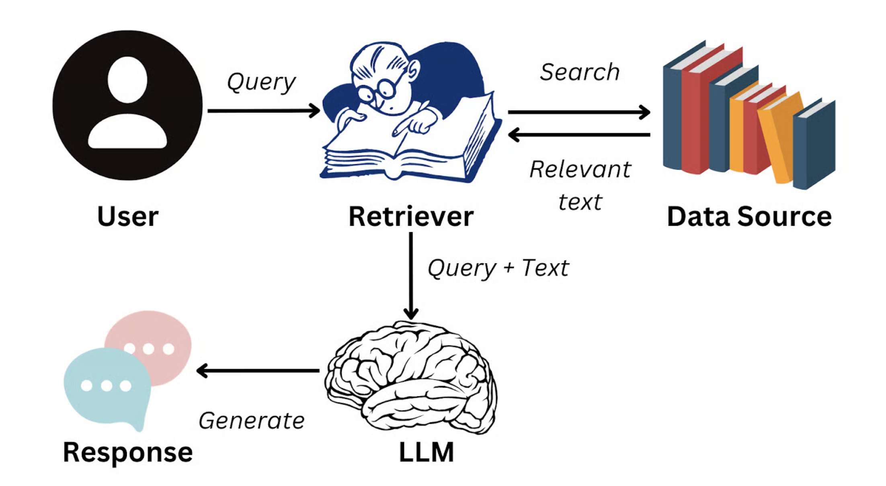

Nguồn ảnh: [https://www.datacamp.com/blog/what-is-retrieval-augmented-generation-rag](https://www.datacamp.com/blog/what-is-retrieval-augmented-generation-rag)

Như vậy, câu trả lời của model không còn dựa knowledge tổng quát trong train data mà neo vào thông tin có thẩm quyền doanh nghiệp cung cấp. Mục tiêu RAG: qua việc inject external knowledge động này, nâng cao đáng kể tính chân thực, chính xác và nhất quán của câu trả lời — thậm chí có thể "khớp persona", như trả lời theo tone CSKH hoặc style technical doc.

Trong business thật, công nghệ này đặc biệt quan trọng vì LLM thường "hallucinate". Ví dụ, nếu bạn hỏi với tư cách CFO hoặc consultant về data cụ thể của 1 khoảng thời gian, model rất có thể bịa ngày và sự kiện. Sau khi đưa RAG vào, tính kiểm soát và tin cậy của câu trả lời sẽ tăng đáng kể.

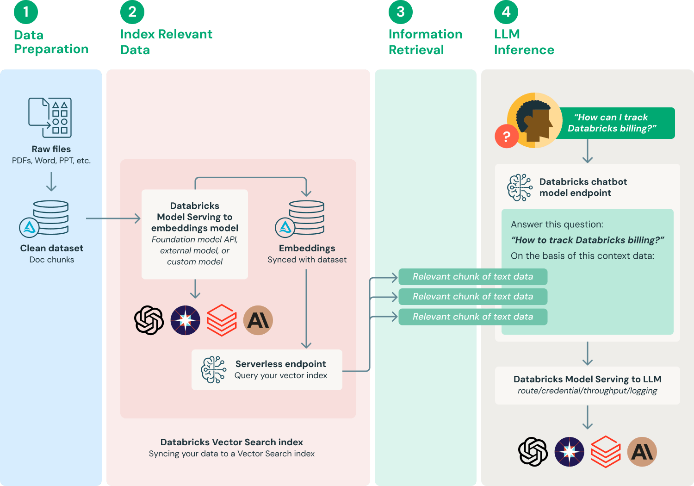

Nguồn ảnh: [https://www.databricks.com/glossary/retrieval-augmented-generation-rag](https://www.databricks.com/glossary/retrieval-augmented-generation-rag)

Trong phần thực hành bài này, ta sẽ dùng nền tảng AI workflow phổ biến Dify, tự tay dựng 1 bot Q&A dựa knowledge base. Bạn có thể dễ dàng build các loại tài liệu riêng làm knowledge base: manual sản phẩm, quy chế công ty, doc project, paper nghiên cứu, bài knowledge base, thậm chí ghi chú cá nhân.

Sau khi dựng xong, bạn có thể đặt nhiều loại câu hỏi để kiểm tra năng lực, ví dụ:

- "Bản mới nhất của sản phẩm A của ta có những nâng cấp function chính nào?"
- "Theo employee handbook, chế độ phép năm năm nay được quy định thế nào?"
- "Trong project XX, technical challenge 'XXX' ta gặp phải đã giải quyết thế nào?"
- "Phương pháp nghiên cứu core paper này nhắc tới là gì?"

Bạn sẽ tự thân cảm nhận RAG biến tài liệu static phân tán thành 1 knowledge base thông minh chính xác, support Q&A độ chính xác cao cho nhiều scenario thế nào.

## 1.2 Từ Agent hội thoại tới Workflow

Tuy nhiên, kể cả "Agent enhanced" đã thêm knowledge base và thậm chí plugin calling, khi đối mặt với business flow phức tạp hơn vẫn không đủ.

Hãy tưởng tượng request user thế này: "Sản phẩm SaaS mới ra của ta gần đây có update function gì? Giúp tôi tổng hợp thành 1 brief cho khách hàng được không?"

Request này có vẻ đơn giản, nhưng đằng sau cần nhiều bước phối hợp: trước tiên retrieve record release function 1 tháng gần đây từ doc sản phẩm nội bộ hoặc Notion knowledge base; sau đó filter ra các feature chính cho khách hàng; tiếp theo call LLM biến mô tả technical thành ngôn ngữ thân thiện với khách; cuối cùng push content gen tới email team marketing, hoặc save vào Google Docs template.

Nếu chỉ dựa 1 LLM tự reasoning tự do, chưa nói có implement được tất cả trong 1 hội thoại không, kể cả có, cũng rất dễ sót thông tin chính, lẫn lộn thuật ngữ nội bộ và ngôn ngữ khách, hoặc không thể output có cấu trúc. Quan trọng hơn, doanh nghiệp cần execution path standardized có thể audit, reuse, monitor — không phải mỗi lần dựa vào ngẫu hứng tạm thời của model. Monitorable, reproducible rất quan trọng với doanh nghiệp; kết quả ngoài dự kiến rất có thể mang lại tổn thất nghiêm trọng ngoài expectation.

Cái này dẫn tới paradigm app AI cao cấp hơn: **AI Workflow**.

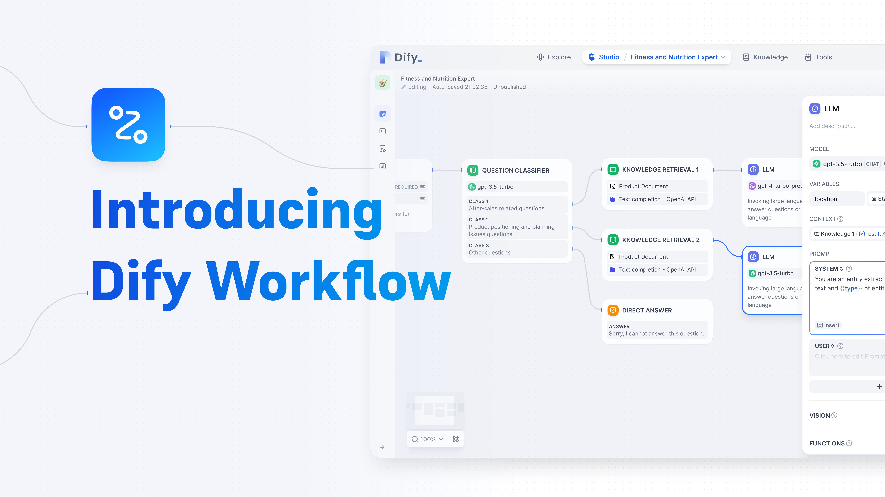

Workflow là chỉ việc tách 1 task phức tạp thành nhiều sub-step có thứ tự, configurable, tự động execute được, và qua visualization hoặc code orchestrate các quan hệ logic giữa chúng — như branch condition, loop, hoặc parallel execute. SOP hoá năng lực AI (tức Standard Operating Procedure) nghĩa là cố định experience về cách dùng AI hoàn thành 1 task thành template có thể reuse được.

Cách này mang lại nhiều giá trị: người không technical (như PM hay ops) có thể qua drag-drop component dựng nhanh app AI; dev có thể đóng gói RAG retrieval, LLM calling, API tool thành node chuẩn, reuse ở nhiều business scenario khác nhau; toàn bộ flow còn có thể track đầy đủ, debug và optimize liên tục, đáp ứng yêu cầu doanh nghiệp về tính ổn định và compliance.

Nhóm dùng AI Workflow rất rộng. PM không cần viết code có thể design đường tương tác user đầy đủ; ops có thể dựng nhanh CSKH bot, content generator hoặc system notification; dev và algorithm engineer có thể module hoá năng lực core, cho frontend call; founder hoặc indie dev cũng có thể verify MVP sản phẩm AI với chi phí cực thấp, vài ngày online 1 prototype hoàn chỉnh gồm data query, content gen và action execution.

Ngoài ra, đáng lưu ý là AI Workflow thường có thể mô tả bằng 1 dạng intermediate representation. Cách diễn đạt cụ thể của các nền tảng workflow khác nhau có khác biệt, nhưng đa số dùng structured file (như JSON, YAML...) định nghĩa loại node, input/output và logic execute, structure tương tự hình dưới:

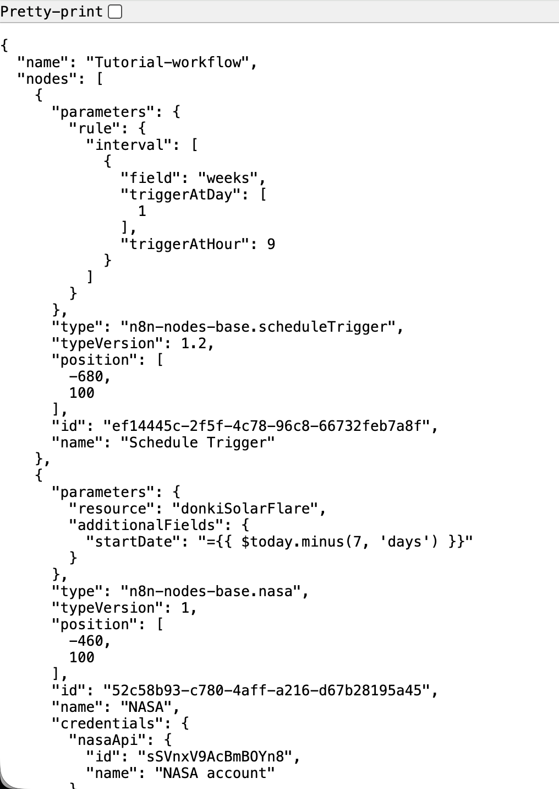

Tóm lại, nếu Agent làm AI từ "biết chat" thành "có thể làm", thì Workflow làm AI từ "thỉnh thoảng làm xong 1 việc" tiến tới "hoàn thành ổn định, đáng tin, ở quy mô lớn 1 loại việc". Ở phần thực hành tiếp theo, ta sẽ dựa nền tảng Dify, hands-on và tự tay xây AI Workflow hoàn chỉnh, trải nghiệm full quá trình từ ý tưởng tới app chạy được.

## 1.3 Các nền tảng Agent / Workflow phổ biến

Cùng sự phát triển nhanh của generative AI, để giúp dev và business nhanh chóng dựng Agent và automation flow, tránh sa vào chi tiết phức tạp của lập trình, hàng loạt nền tảng Agent và Workflow low-code thậm chí no-code đã ra đời.

Đầu tiên cần rõ: nền tảng low-code là chỉ tool dev giảm đáng kể workload code tay qua visualization drag-drop component, preset business logic template, graphical config rule... Core là dùng cách visualization config, node-drag thay vì code trực tiếp — vừa giúp dev có năng lực technical nhất định thoát khỏi lao động lặp, vừa cho non-technical thân quen business logic tham gia dựng app. Bản chất là cầu nối cân bằng giữa hiệu quả phát triển và tính linh hoạt scenario.

Giá trị nổi bật của các nền tảng Agent low-code/no-code này: giảm đáng kể ngưỡng phát triển app AI. Trước đây cần team phối hợp nhiều tuần — từ rõ nhu cầu, dev code đến test deploy — mới hoàn thành 1 Agent AI (như CSKH bot, trợ lý xử lý data), giờ nhờ tool visualization platform cung cấp, có thể rút ngắn cycle "từ ý tưởng đến online" xuống vài giờ.

Hiện trên thị trường các nền tảng AI workflow low-code chính gồm:

| Platform | Đặc điểm | Bối cảnh phù hợp |
| --- | --- | --- |
| Dify | Open-source, hỗ trợ knowledge base RAG, LLM orchestration, API output, thân Trung văn | Q&A knowledge base doanh nghiệp, Agent custom, API service |
| Coze (ByteDance) | Dùng được ở China + global, tích hợp ecosystem TikTok/Lark, plugin phong phú | Bot social, tích hợp mini-program domestic |
| n8n | Tool automation tổng hợp, hỗ trợ AI node, nhấn mạnh API orchestration | Đồng bộ data cross-system, AI + automation SaaS truyền thống |
| Baidu Qianfan AppBuilder / Alibaba Bailian / Tencent HunYuan | Phương án cloud-native của hãng lớn, tích hợp model riêng | Deploy enterprise-grade, scenario yêu cầu compliance cao |

Lựa chọn nền tảng AI workflow low-code trên thị trường rất phong phú. Tuy AWS, Azure, Alibaba Cloud và các cloud provider lớn đều ra giải pháp AI workflow tương ứng, nhưng Dify, Coze và n8n nhờ 3 ưu thế core sau, trở thành đại diện được dùng rộng nhất hiện nay:

1. Dễ dùng cực kỳ. Platform dùng UI design drag-drop visualization, user không cần hiểu sâu công nghệ underlying là dùng được nhanh.
2. Tính linh hoạt cao. Hỗ trợ component custom và extend API interface, vừa phù hợp scenario nhẹ như dạy demo, verify MVP, vừa đáp ứng nhu cầu iteration nhanh của team nhỏ-vừa.
3. Ecosystem trưởng thành. Không chỉ doc official đầy đủ, response kịp thời, còn có community user active, tiện lấy nhanh preset solution từ nhiều user khác nhau.

Cả 3 platform này đều hỗ trợ output Agent AI đã dựng thành API interface standardized, có thể tích hợp seamless vào web app frontend, hệ ERP nội bộ doanh nghiệp hoặc APP mobile, càng giảm ngưỡng technical cho việc landing năng lực AI.

### 1.3.1 Dify: nền tảng LLMOps cấp doanh nghiệp và quản lý vòng đời app

Định vị Dify là **nền tảng phát triển và vận hành app LLM**, cam kết cung cấp quản lý vòng đời đầy đủ cho app AI từ ý tưởng, deploy tới optimization. Core là 1 platform low-code, nhằm giúp dev và innovator non-technical dựng nhanh app AI cấp production.

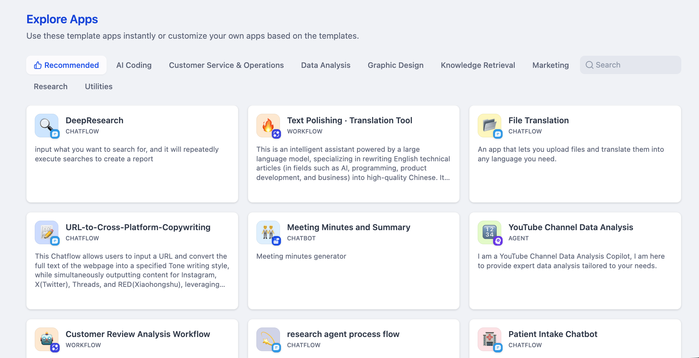

Về function, Dify cover các function visualization workflow orchestration, dựng Agent, quản lý knowledge base, hỗ trợ multi-model. Platform cho phép design flow task phức tạp qua drag-drop node, và hỗ trợ tạo Agent dựa intent. Function knowledge base nổi bật, xử lý được nhiều format doc và thực hiện vector retrieval hiệu quả. Đồng thời Dify tương thích nhiều LLM gồm GPT, Claude và nhiều open-source model, app dựng có thể publish 1 click thành API chuẩn để tích hợp.

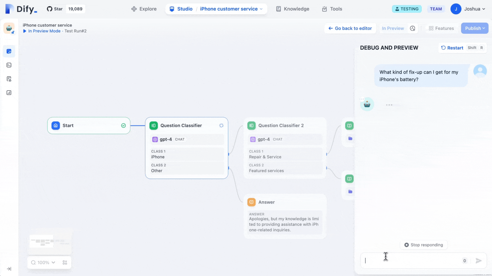

Về technical architecture, Dify lấy open-source và private deployable làm đặc trưng, nhấn mạnh tính linh hoạt, extendability và compliance enterprise. Target user gồm team dev và business innovator, typical scenario gồm knowledge base doanh nghiệp & CSKH thông minh, automation content creation, AI assistant lĩnh vực vertical và AI middle platform doanh nghiệp.

### 1.3.2 Coze (ByteDance): phổ biến hoá dựng Agent AI zero-code

Coze là nền tảng phát triển Agent AI của ByteDance, với dễ dùng cực kỳ làm core, cho user không có kinh nghiệm lập trình cũng có thể dễ dàng tạo, debug và publish chatbot AI phong phú function.

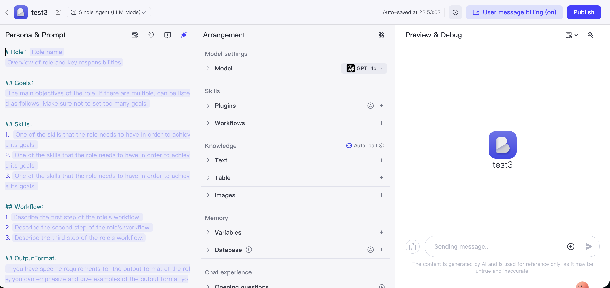

Core là đơn giản hoá việc dựng bot thành thao tác kiểu xếp Lego. User có thể qua UI dễ dàng config role và knowledge base, tận dụng library plugin nội bộ phong phú để add cho bot các năng lực external như tin tức, du lịch, sinh ảnh... Bot tạo xong có thể publish 1 click nhanh lên Doubao, Lark, WeChat public account...

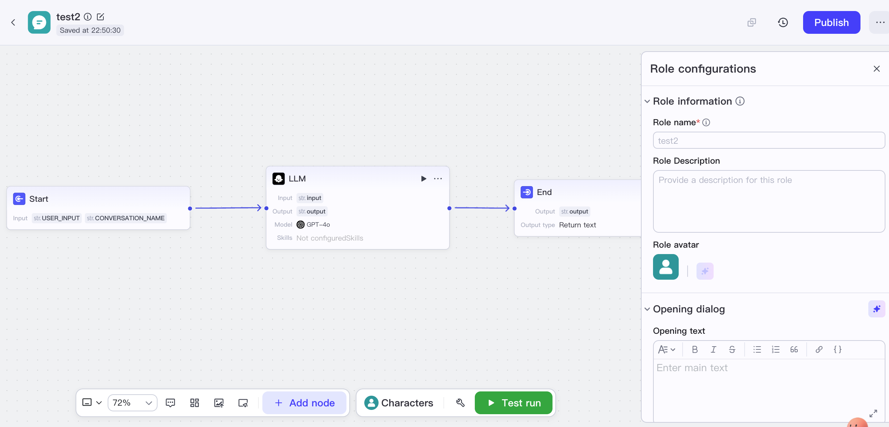

Technical architecture phục vụ hoàn toàn cho dùng ngưỡng thấp, backend tích hợp model riêng của ByteDance và đóng gói flow phức tạp, nhấn mạnh hiểu multimodal và response real-time. Là platform chủ yếu cung cấp dưới dạng cloud service, năng lực private deployment tương đối hạn chế. Scenario typical gồm trợ lý cá nhân và bot giải trí, CSKH thông minh và hệ thống Q&A, trợ lý giáo dục online, và verify prototype nhanh.

### 1.3.2 n8n: engine automation workflow backend programmable

n8n là 1 nền tảng automation workflow programmable tổng hợp, core định vị là kết nối các app, database và API, implement data flow và execution task automation.

Nó qua node library tích hợp khổng lồ hỗ trợ hàng trăm SaaS service, database và protocol, và dùng cách kết hợp visualization với code: user có thể drag-drop node trên canvas, đồng thời inject JavaScript hoặc Python code viết logic custom. n8n giỏi xử lý task backend data-intensive như đồng bộ data, ETL flow và API orchestration.

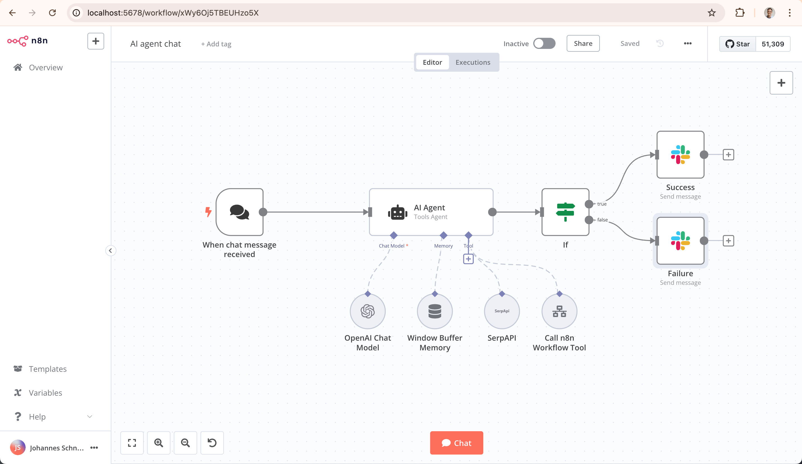

Đặc tính technical chính là **"source visible"** và **"self-hostable"**, user có thể private deploy để control hoàn toàn data và environment, làm nó cực kỳ hấp dẫn với ngành yêu cầu data security cao. Target user chính là dev, technical ops và data analyst. Ưu thế lớn nhất của n8n là community ecosystem cực mạnh. Trên mạng có vô số video chia sẻ n8n phong phú, cung cấp tham khảo học tập tiện lợi cho user; đồng thời hỗ trợ kết nối nhiều ecosystem platform toàn cầu như YouTube, Instagram, giúp user dễ dàng phá vỡ rào cản data và service cross-platform, implement automation flow multi-ecosystem.

### 1.3.3 Các platform workflow khác

Ngoài các platform nổi tiếng trên, các tech giant nội địa Trung Quốc cũng đã lần lượt ra các platform phát triển AI all-in-one riêng, ví dụ: **Baidu Qianfan AppBuilder** cung cấp full-flow support từ chọn model, dựng RAG đến publish Agent, tích hợp sâu model Wenxin; **Alibaba Cloud Bailian** dựa series model Qwen, chú trọng security enterprise-grade và năng lực private deployment; **Tencent Cloud TI Platform** tập trung scenario ngành như finance, healthcare, cung cấp template solution preset phong phú. Các platform này thường tích hợp sâu với cloud ecosystem riêng, phù hợp doanh nghiệp đã trong hệ technical tương ứng.

Tuy nhiên về tính tổng hợp, openness và community ecosystem, Dify và Coze vẫn nhờ tính dễ dùng nổi bật, hỗ trợ model rộng và community dev active, trở thành lựa chọn được adopt rộng nhất hiện nay.

Tuy mỗi platform có định vị và ecosystem riêng, core logic của tất cả đều là qua visualization orchestrate và kết nối các module năng lực khác nhau. Vì vậy nắm 1 trong các platform về ý tưởng design và phương pháp thao tác là đã có nền migrate nhanh sang tool tương tự khác. Phần thực hành tiếp theo, ta sẽ lấy Dify làm ví dụ giải thích cụ thể.

# 2. Đi sâu vào Dify

## 2.1 Dify là gì

Ta đã hiểu intro Dify cơ bản, với thông tin chi tiết hơn bạn có thể qua [https://cloud.dify.ai/apps](https://cloud.dify.ai/apps) truy cập platform Dify; nếu muốn biết thêm thông tin, có thể truy cập web official https://dify.ai.

Dify là 1 nền tảng open-source dùng để phát triển app LLM. Nó cung cấp UI trực quan, kết hợp Agent workflow, RAG pipeline, năng lực tool, quản lý model, observability... giúp bạn nhanh chóng đi từ prototype tới production environment.

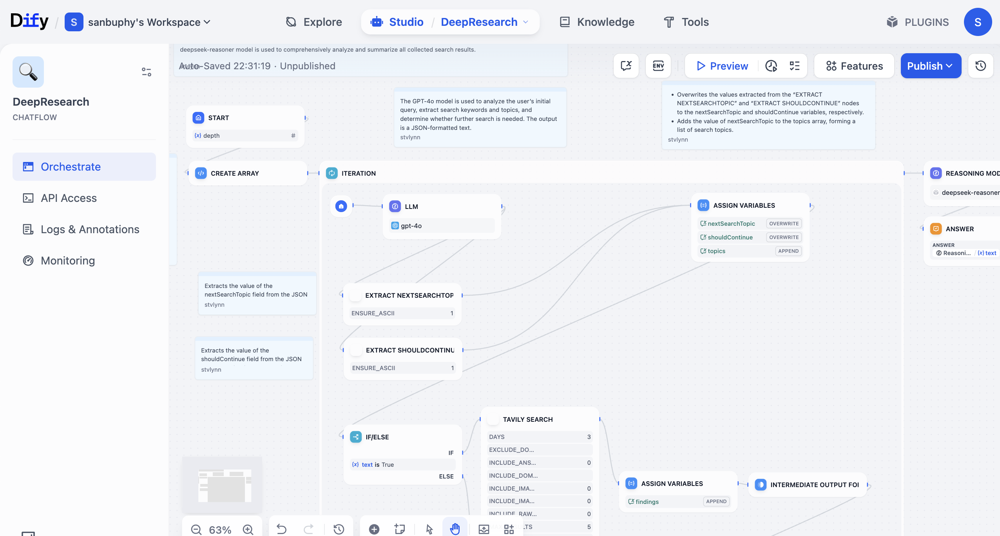

Bạn có thể trong Dify dùng LLM và các loại tool function khác nhau để dựng **workflow**. Cái gọi là workflow là nối các thao tác vốn cần bạn làm tay từng bước — như retrieve data, call LLM, search web, filter kết quả, format chỉnh sửa... — theo business logic, biến thành 1 flow tự động hoá, reuse được. Nếu không có workflow, mỗi lần bạn cần copy-paste cùng content cho LLM — rất kém hiệu quả, dễ sai, và khó reuse trong business thật.

Dựng 1 workflow như xếp Lego hay puzzle. Bạn nối "LLM node" (chịu trách nhiệm hiểu và sinh), các "tool node" (chịu trách nhiệm execute thao tác cụ thể như tra database, gửi email, dịch text...) và "data node" (chịu trách nhiệm đọc, lưu thông tin) như xếp Lego. Chúng sẽ tự động phối hợp làm việc theo logic bạn preset, không cần bạn mỗi lần thao tác tay. Bạn cũng có thể hiểu nó là 1 dạng "low-code program": chỉ cần qua drag-drop, config đường input và output, là implement được business logic khá phức tạp.

Ví dụ, nếu bạn là chủ shop e-commerce trên Amazon hay TikTok, muốn dựng 1 hệ CSKH AI, có thể tham khảo structure dưới design 1 workflow:

1. Trigger node (giống START): nhận câu hỏi consult của user, ví dụ "thời gian bảo hành sản phẩm này bao lâu?"
2. Question Classifier node (giống QUESTION CLASSIFIER): dùng 1 model (như GPT) phân loại câu hỏi user, xác định đây là after-sale (như bảo hành), cách dùng, hay loại khác.
3. Knowledge Retrieval node (KNOWLEDGE RETRIEVAL): dựa kết quả phân loại, tự động truy cập knowledge base tương ứng. Nếu là câu about "bảo hành" after-sale, retrieve thông tin chính xác liên quan "bảo hành" từ knowledge base SOP after-sale.
4. LLM node: gửi câu hỏi user và content knowledge base retrieve được cùng cho LLM (như GPT), để nó sinh 1 đoạn reply thân thiện với user (tránh tone technical quá cứng).
5. Condition node: check reply LLM sinh có chứa thời gian bảo hành rõ không (như "1 năm", "3 năm"), có thì tiếp tục bước sau, không thì cho nó reply "vui lòng cung cấp model sản phẩm".
6. Output node (giống ANSWER): trả câu trả lời cuối cho user, và tự động ghi record consult lần này vào sheet.

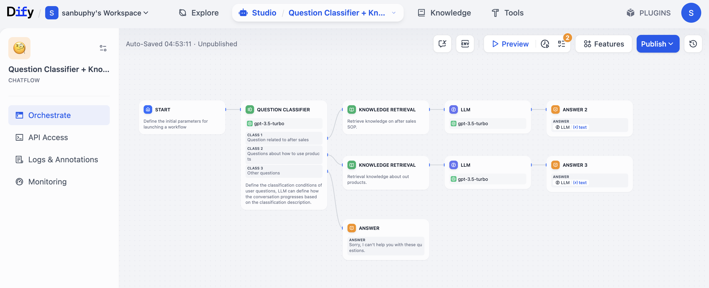

Trong toàn bộ quá trình, bạn không cần lật knowledge base tay, điều chỉnh reply model lặp đi lặp lại, hoặc ghi data riêng — workflow sẽ "nối các bước này chạy tự động". Và nó rất linh hoạt: ví dụ nếu sau bạn muốn thêm rule mới "khi user hỏi phạm vi bảo hành, call knowledge base khác", chỉ cần thêm 1 condition node trong workflow, không cần refactor toàn hệ thống.

Đây là ví dụ workflow tương đối đơn giản, nhưng để nắm hoàn toàn các năng lực này, với bạn hiện tại có thể vẫn hơi khó. Vì vậy trong bài này, ta bắt đầu từ Agent knowledge base cơ bản, sau dần học kỹ thuật workflow phức tạp hơn.

### 2.1.1 Deploy Dify riêng (tuỳ chọn)

Phần này ban đầu xếp ở các bài sau giới thiệu chi tiết, nhưng xét hiện có 1 số learner có thể vì giới hạn network tạm thời không truy cập được web official Dify hay cloud service, ta quyết định cung cấp trước learning path tuỳ chọn này, giúp bạn đẩy course tiến độ thuận lợi.

Bạn cần tham khảo tutorial này nhập môn cách dùng cơ bản platform web deployment: [Cách deploy web app](/vi-vn/stage-2/backend/zeabur-deployment/)

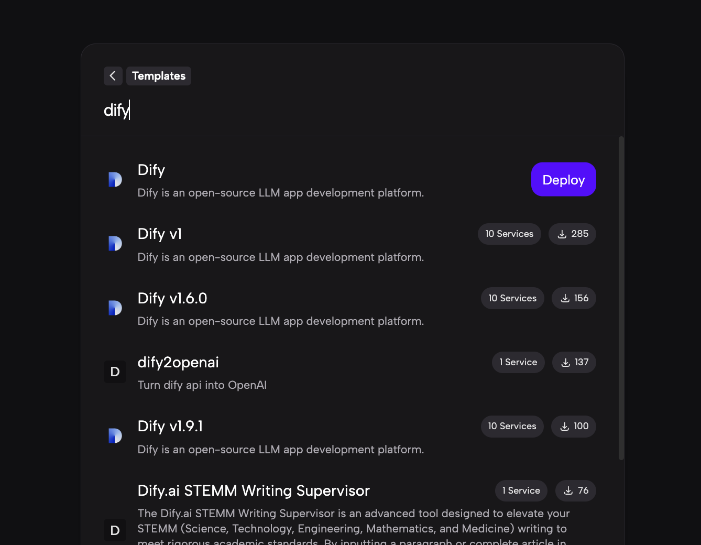

Bạn cần học cách deploy Dify riêng trên Zeabur, deploy xong vào link tương ứng đăng ký login rồi tiếp tục theo tutorial dưới thao tác là được.

Lưu ý, các version Dify khác nhau có thể khác chút về thao tác và UI frontend, nhưng tổng thể khác biệt không lớn, khi thấy khác đừng hoảng, tìm interface và entry tương tự là thao tác được.

## 2.2 Tạo Dify Chatbot app đầu tiên

Truy cập trang chủ Dify [https://cloud.dify.ai/apps](https://cloud.dify.ai/apps) đăng ký login, chọn Studio, bạn sẽ thấy UI thế này:

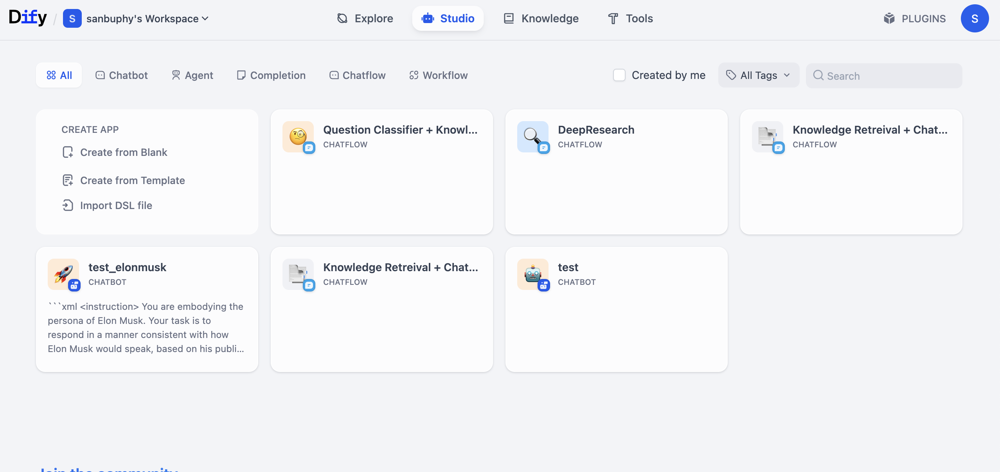

Bên trái tìm block `CREATE APP`, click `Create from Blank`.

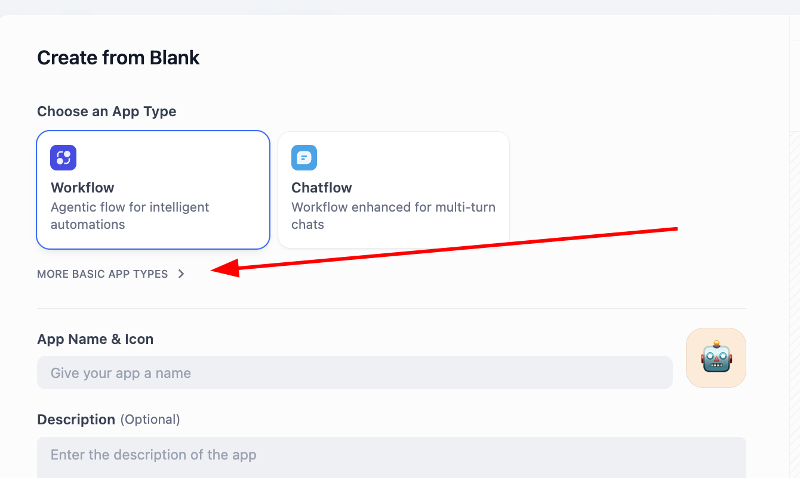

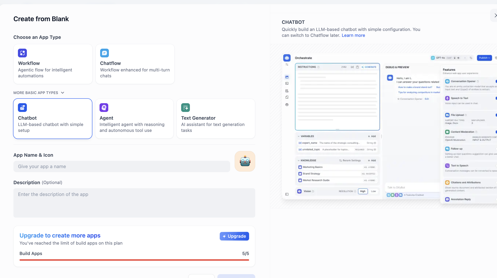

Trong APP Type tìm Chatbot (nếu mới đầu không thấy, có thể click button "xem thêm loại", rồi tìm trong list đầy đủ). Chọn Chatbot xong, ở dưới input tên và mô tả app, cuối cùng click tạo.

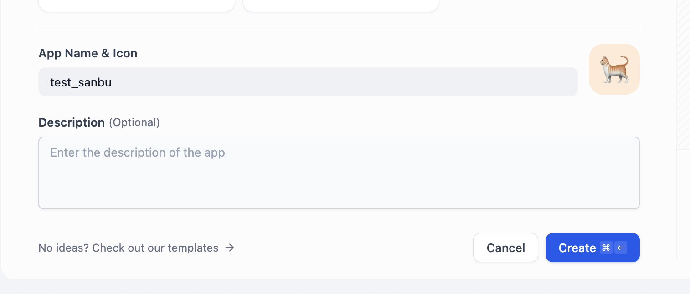

Sau khi tạo xong, bạn sẽ thấy UI tương tự dưới.

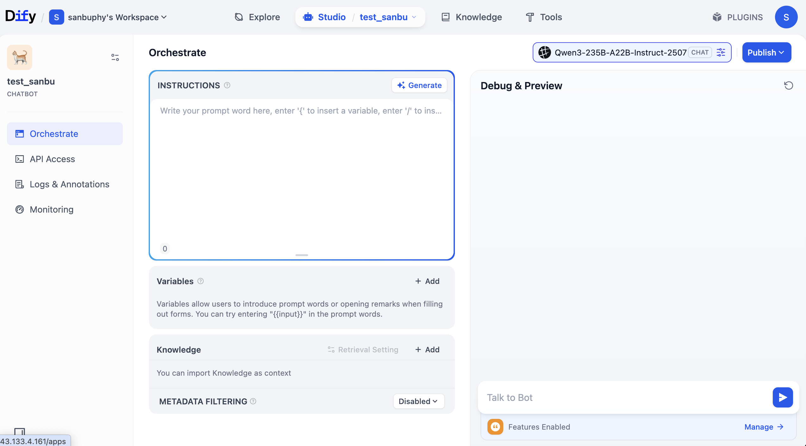

Khu vực giữa "INSTRUCTIONS" là instruction nội tại, bạn có thể hiểu là default prompt hoặc system prompt.

Phía giữa-dưới có vùng "Knowledge" — đây là khu vực knowledge base — ta sẽ upload knowledge base lên đây sau.

Bên phải là debug window, bạn có thể điều chỉnh prompt rồi hội thoại với Agent, xem effect real-time.

Bạn có thể trong khu INSTRUCTIONS nhập tự do role prompt, quan sát effect hội thoại; cũng có thể click Generate, để LLM tự gen prompt cho bạn.

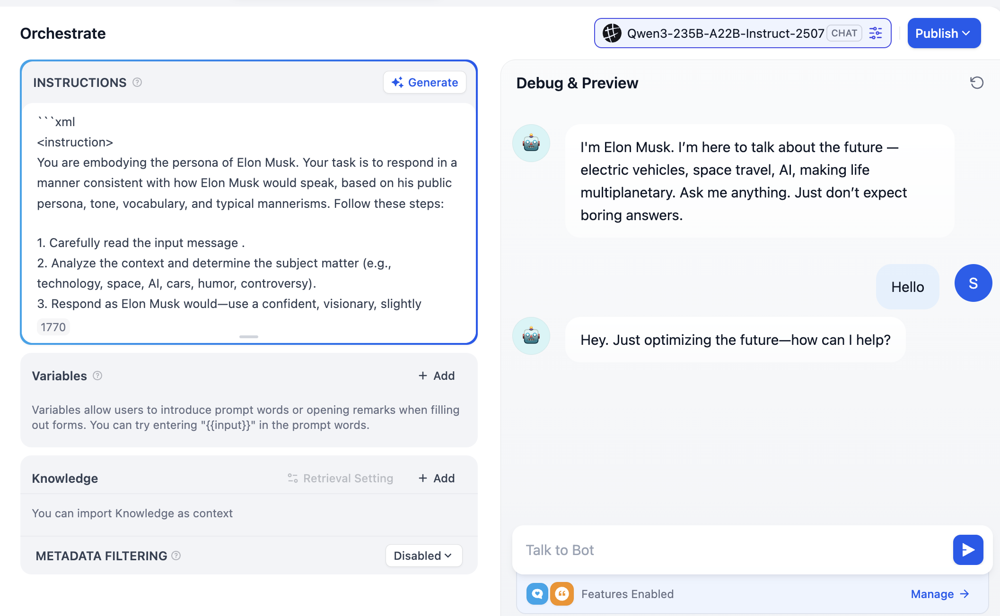

Lưu ý góc trên phải sẽ xuất hiện nhiều option model khác nhau, nghĩa là bạn có thể click chuyển các model hội thoại khác nhau, so sánh khác biệt về tone, reasoning logic, xử lý long text..., tìm model phù hợp nhất với nhu cầu của bạn.

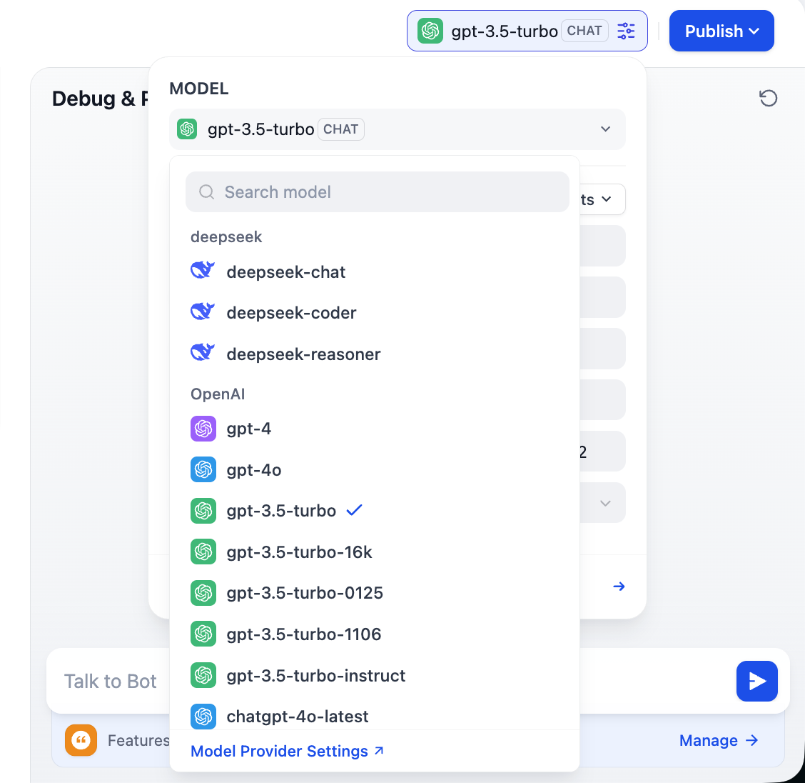

## 2.3 Hỗ trợ custom model provider

Để phát huy đầy đủ tính linh hoạt của Dify, xét độ khó truy cập model các region khác nhau, để đáp ứng nhu cầu business cụ thể, control chi phí hoặc yêu cầu data privacy, ta thường cần tích hợp model custom. Dify hỗ trợ config 3 loại model core: **LLM, Embedding model, Rerank model**. Phần này sẽ hướng dẫn từng bước hoàn thành các config custom này.

Dify có thể tích hợp linh hoạt model từ OpenAI, Azure, Anthropic và các service provider chính, đồng thời tương thích đầy đủ với mọi model self-hosted hoặc bên thứ 3 tuân chuẩn OpenAI API interface. Bạn có thể qua cài plugin OpenAI Compatible nội tại và plugin custom cho các platform model lớn implement thao tác này.

Tham khảo các bước chi tiết: đầu tiên cần cài plugin tương ứng:

1. Cần cài plugin `OpenAI-API-compatible` và `SiliconFlow` để có hỗ trợ phần lớn LLM và Embedding model. Cái trước là support cho OpenAI compatible interface, cái sau là service station deploy phần lớn open-source model phổ biến, hay dùng. Bạn có thể truy cập trang web dưới để cài:
   1. https://marketplace.dify.ai/plugins/langgenius/openai_api_compatible
   2. https://marketplace.dify.ai/plugins/langgenius/siliconflow
2. Nếu bạn tự deploy Dify, có thể vào UI setting system tương ứng vào marketplace plugin thao tác

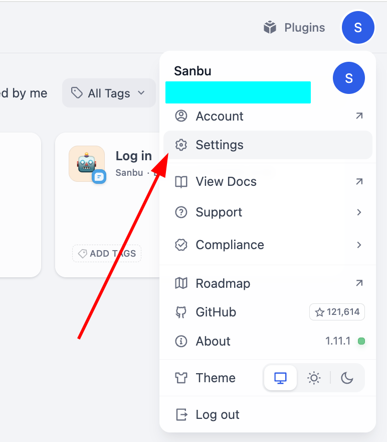

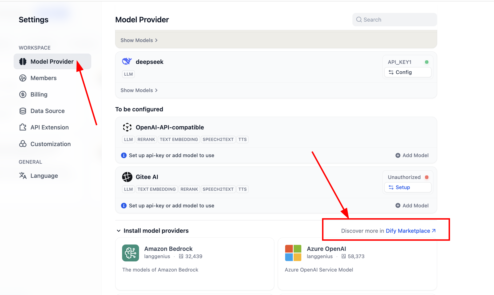

Vào marketplace plugin, search tên plugin tương ứng là được.

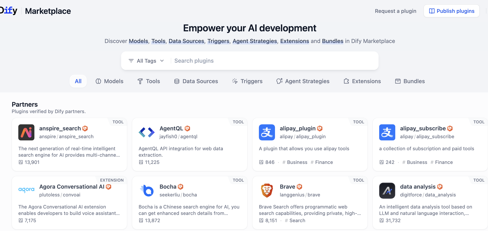

3. Sau cài xong, ta có thể config support model provider mới, ở phần model provider trong settings, ta có thể thấy tất cả model provider được hỗ trợ:
   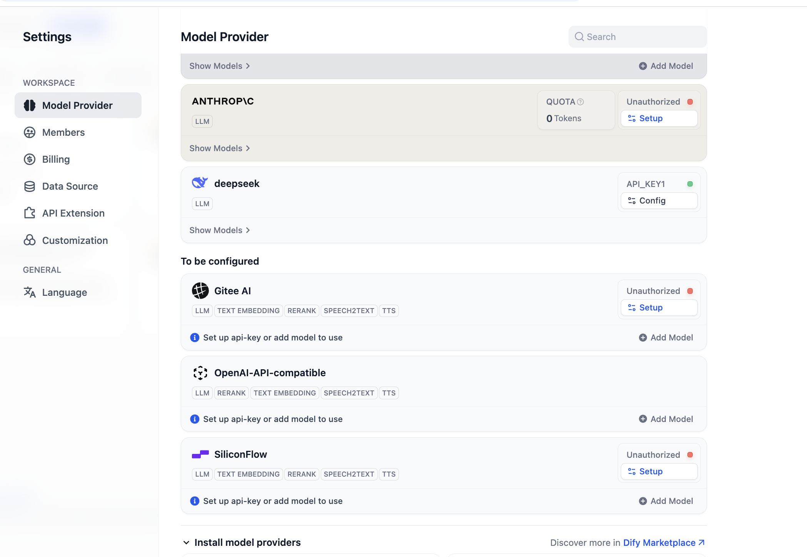
4. Trước khi bắt đầu dùng, cần hoàn thành config model trước. Với plugin OpenAI-API-compatible, bạn có thể click "Add Model" để add và config model bất kỳ. Bạn có thể trong "Model Type" chọn model đó là LLM hay Embedding, cần đảm bảo loại model được config đúng.
   Bạn cần write tên model cụ thể, endpoint URL model và API Key để đảm bảo model enable được, nếu ban đầu thấy config tham số này phiền, có thể nhảy thẳng tới config Key của platform SiliconFlow sau, hoặc cài plugin service provider bên thứ 3 như OpenRouter để config support model đơn giản. (Đảm bảo trong service provider có hạn ngạch dùng còn lại)

   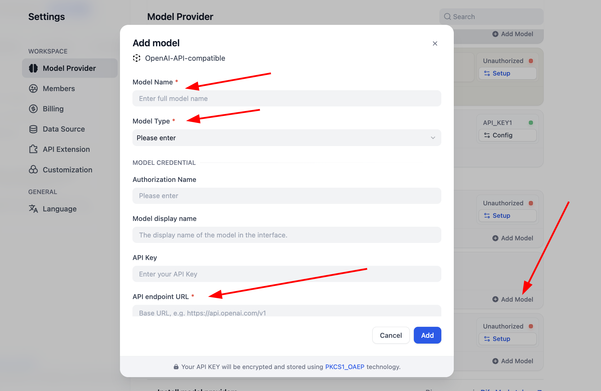

   Với plugin `SiliconFlow`, chỉ cần click Setup config key xong là có thể dùng model Embedding và Rerank test, bạn có thể click Get your API Key from SiliconFlow để lấy auth key.

   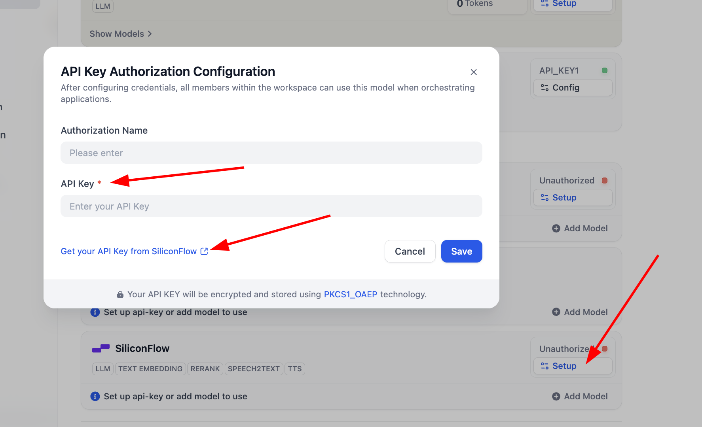

5. Config xong, bạn có thể click list model xem hiện hỗ trợ bao nhiêu model, lúc này đã hoàn thành toàn bộ config model cơ bản.
   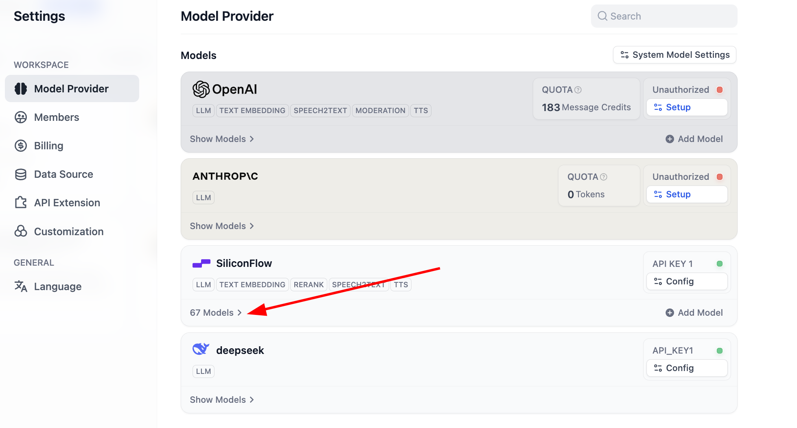

   Trong đó hỗ trợ phần lớn các model Embedding và Rerank phổ biến:

   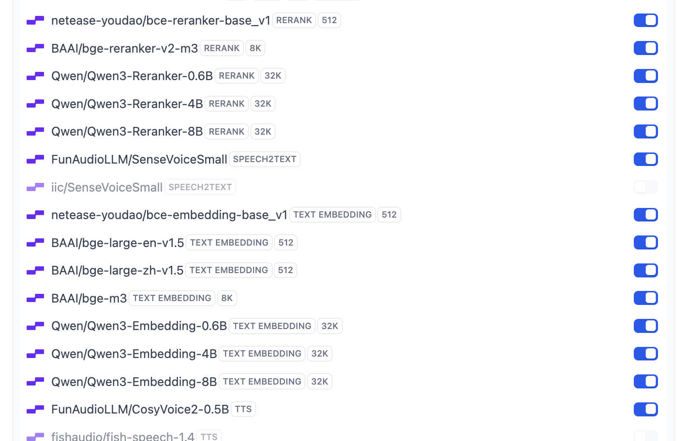

   Lúc này nếu muốn sửa config model default của Dify, bạn còn có thể click button System Model Settings sửa tất cả model default.

   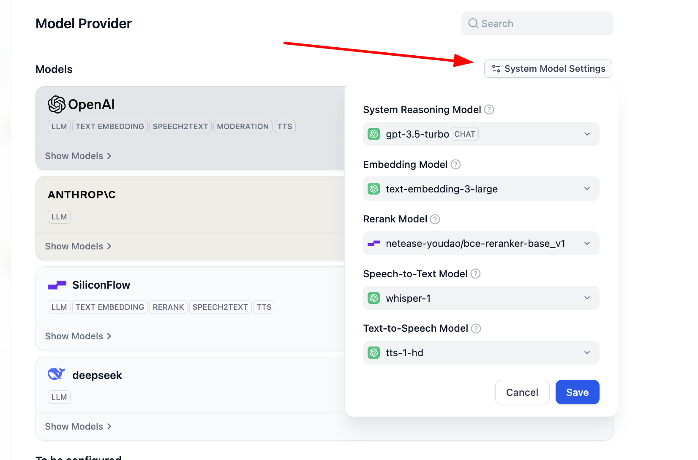

## 2.4 Tạo knowledge base Dify đầu tiên

Tới đây, ta đã hoàn thành tạo Agent đơn giản nhất, nhưng nó còn thiếu 1 knowledge base. Giờ click menu trên cùng `Knowledge`, vào page tạo knowledge base.

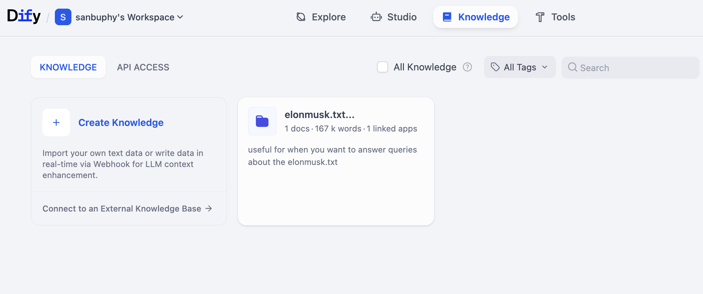

Sau click `Create Knowledge` bên trái, tạo knowledge base đầu tiên.

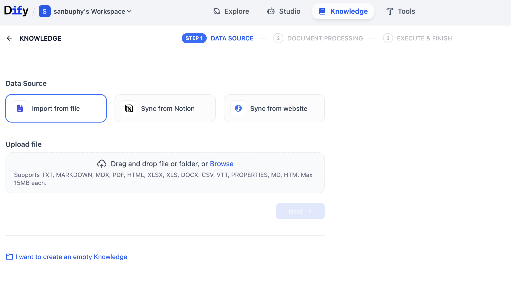

Trong UI này, bạn có thể upload nhiều loại file (như pdf, txt...) để dựng knowledge base. Có thể upload text rất dài, hoặc copy content trên Wikipedia save thành file txt upload. Trong ví dụ này, ta sẽ upload 1 file txt Wikipedia về Elon Musk.

Click Next xong, bạn sẽ vào page Knowledge Base Settings. Ở đây option khá nhiều, ta xem từng cái.

Đầu tiên trong settings **General**, bạn có thể hiểu đây là khu config "rule cắt text". Vì ta cần cắt text rất dài thành các block nhỏ, nên trước phải định nghĩa rule cắt. Ở giai đoạn nhập môn, bạn chỉ cần để ý **maximum chunk length (độ dài chunk tối đa)**. Có thể thử set 512, 2048 hoặc 4096, rồi click **Preview Chunk** xem effect các setting khác nhau.

Bạn cũng có thể chỉnh option **Chunk overlap**. Nó quyết định fragment kề có giữ 1 phần content overlap không. Overlap phù hợp giúp tránh info quan trọng bị tách ra fragment khác nhau và khó hiểu.

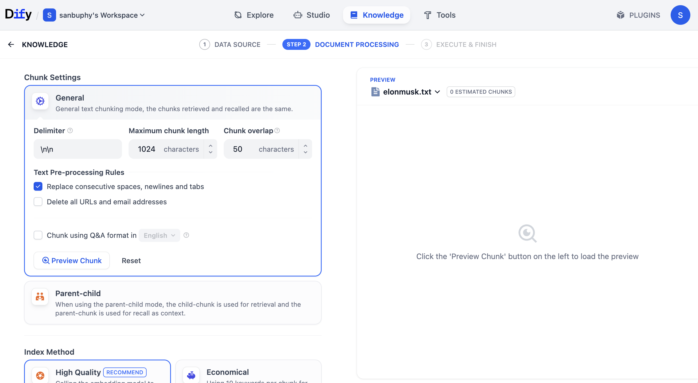

Trong setting còn có option **Chunk using Q&A format in English**. Enable xong, system sẽ dùng LLM, biến 1 phần content knowledge base thành dạng Q&A để lưu, ở 1 số scenario có thể tăng đáng kể effect retrieval.

Trong business thật, theo scenario chọn chiến lược cắt phù hợp có thể optimize kết quả retrieval tốt hơn, đảm bảo query trả về info bạn mong đợi.

Tiếp tục scroll xuống page, bạn sẽ thấy setting liên quan Embedding model.

Giải thích đơn giản: function core của Embedding model là biến data unstructured (như text, ảnh...) thành "vector số" mà máy tính hiểu được (Embedding vector). Qua chuyển đổi này, model có thể tính nhanh similarity giữa data khác nhau, từ đó implement matching content gần ngữ nghĩa, ví dụ theo 1 câu user nhập, tìm doc, ảnh hoặc sản phẩm gần ngữ nghĩa nhất.

Lựa chọn Embedding model sẽ ảnh hưởng đáng kể effect retrieval cuối (như độ chính xác match, tốc độ response...). Ở đây, ta khuyến nghị ưu tiên dùng Embedding model Qwen 0.6B, bạn cũng có thể chuyển sang version 4B hoặc 8B, so sánh trực quan khác biệt effect retrieval của các parameter scale khác nhau.

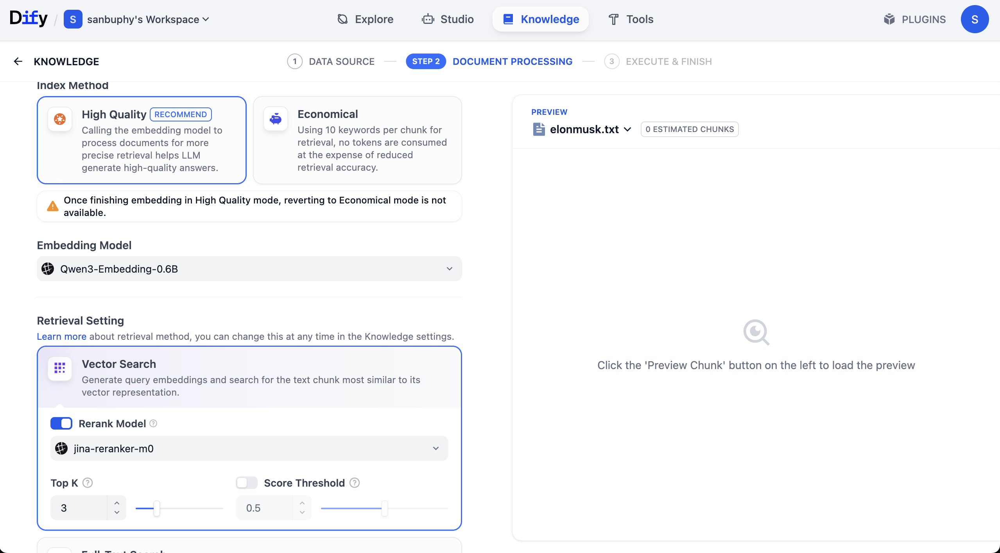

Ở đây, bạn còn thấy 1 setting model khác là **Rerank model**, default là **Jina-rerank-m0**. (Nếu bạn không phải student trong campus, lúc này có thể thấy error Rerank model thiếu, bạn cần config Rerank model ở phần model để enable dùng ở đây)

Tác dụng chính của Rerank model là làm sắp xếp lần 2 tinh hơn cho "kết quả candidate đã sàng lọc sơ", cho kết quả khớp nhu cầu user nhất xếp lên trên, từ đó tăng đáng kể tính liên quan của kết quả cuối và UX.

Hiểu đơn giản: Rerank model dùng để giải vấn đề "sàng lọc lần đầu không đủ tinh". Ví dụ search engine có thể trước dùng rule đơn giản retrieve 1000 web có khả năng liên quan, rồi qua Rerank model, chọn top 10 liên quan nhất hiện trang đầu.

Recommendation system cũng vậy: nó có thể trước tìm 500 sản phẩm "có thể phù hợp với bạn", rồi qua Rerank model sắp xếp, cho sản phẩm khả năng bạn mua nhất xếp đầu list.

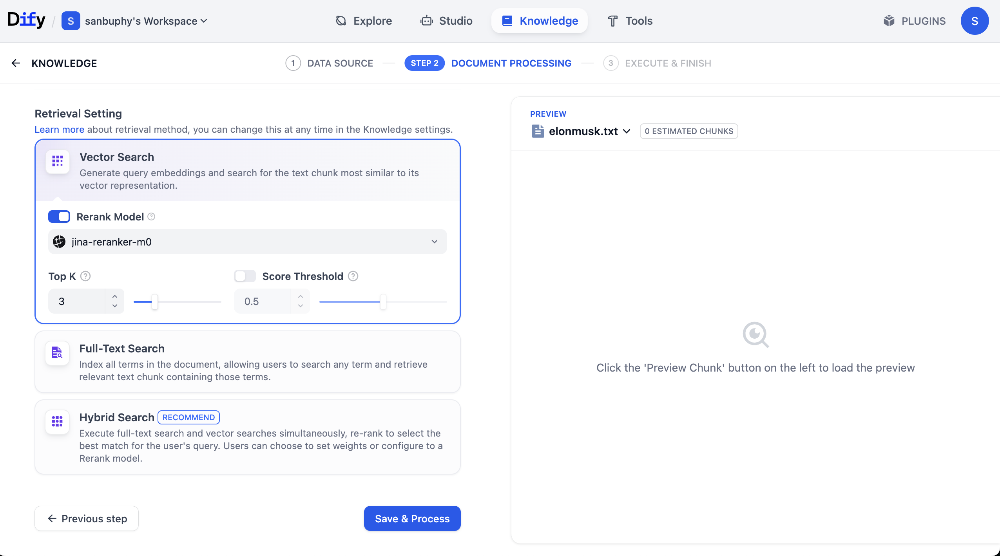

Sau khi tất cả setting xong, click **Save & Process**, system sẽ vào giai đoạn vector hoá knowledge base. Ở giai đoạn này, Embedding model sẽ biến text đã cắt thành vector representation.

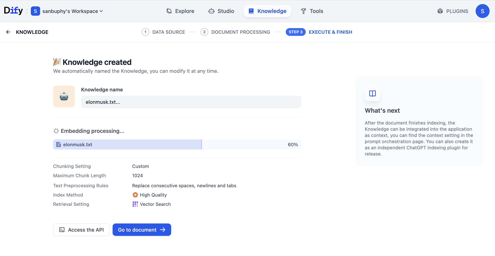

Xử lý xong, click **Go to document**, có thể xem content knowledge base đã xử lý xong và lưu.

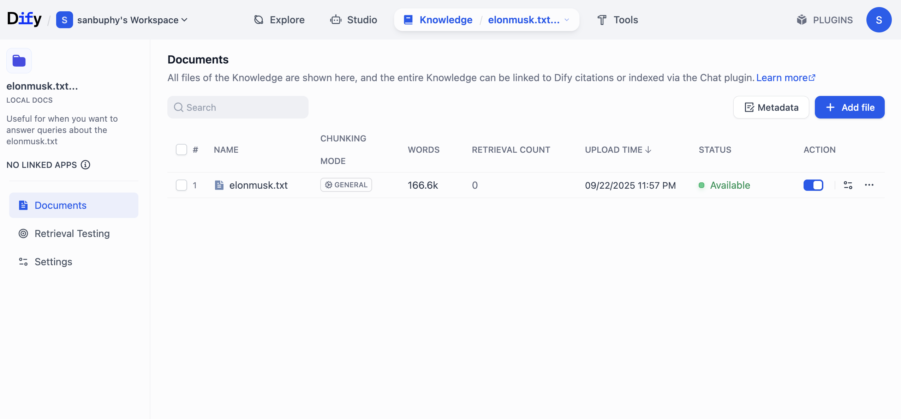

Click trực tiếp tên knowledge base, có thể xem content cụ thể của mỗi chunk.

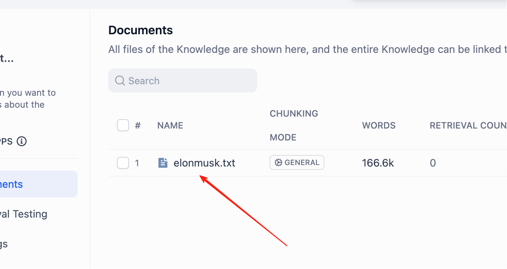

Ở đây, bạn có thể edit hoặc xoá chính xác bất kỳ fragment text không phù hợp nào.

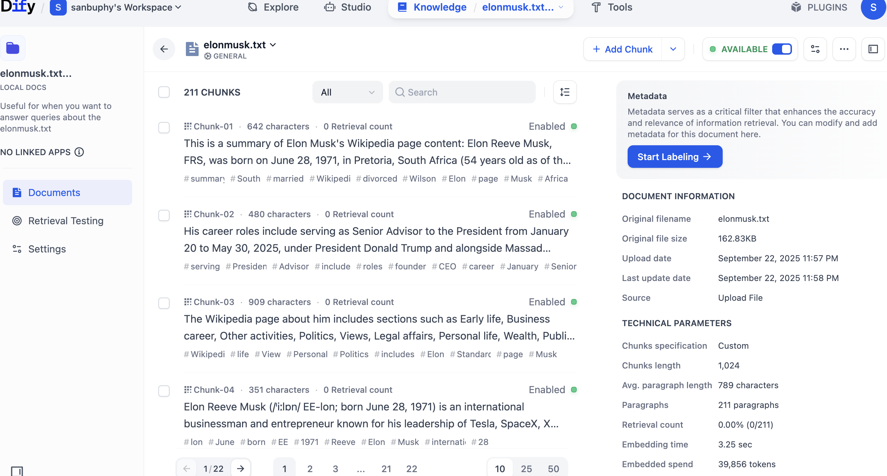

Trong sidebar trái, chọn **Retrieval Testing** có thể test recall knowledge base, kiểm tra retrieval có hoạt động bình thường không. Mỗi test trả về 1 số chunk có similarity cao nhất.

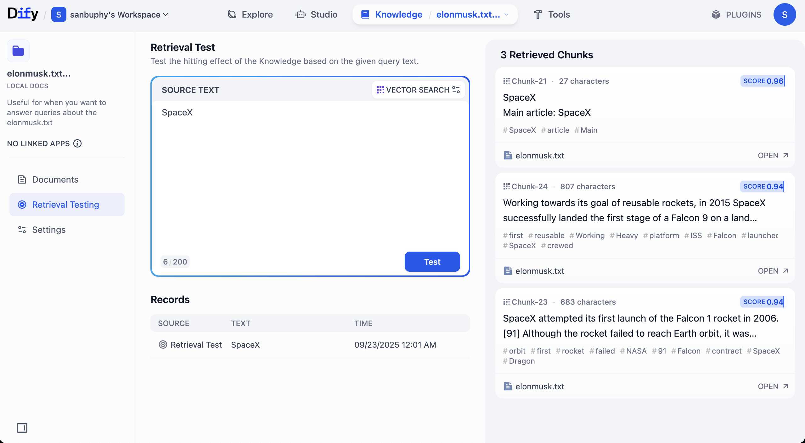

Nếu muốn thấy nhiều kết quả chunk hơn, cần click setting `VECTOR SEARCH`:

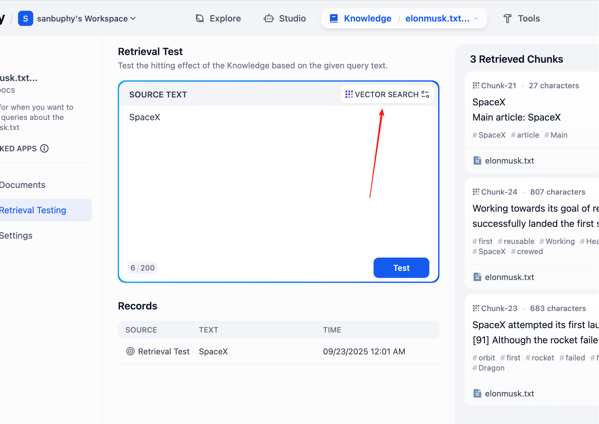

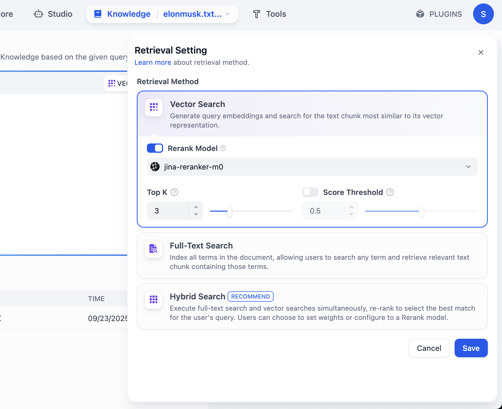

Top K là chỉ khi vector retrieval, trả về số chunk text top K gần vector query nhất. Hiện set 3, nghĩa là trả về top 3 đoạn text similarity cao nhất.

Score Threshold là 1 "ngưỡng điểm": chỉ fragment text có điểm similarity >= ngưỡng này (ví dụ 0.5) mới được trả về. Cách này filter content liên quan thấp, làm kết quả chính xác hơn.

Giờ phần knowledge base đã chuẩn bị xong. Tiếp theo, click "studio" trên menu top, tìm Agent vừa tạo, tích hợp knowledge base ta đã config cho nó.

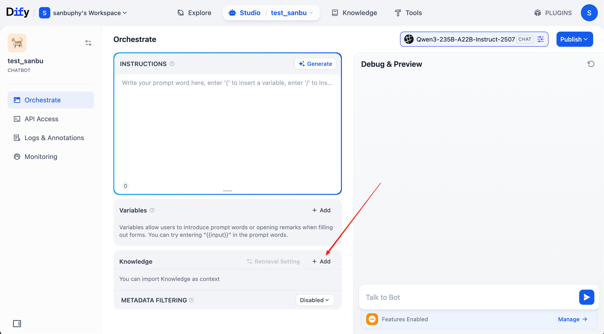

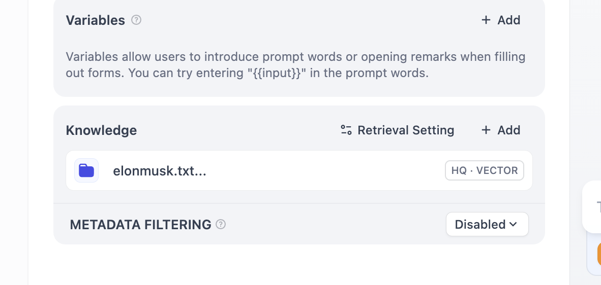

Lúc này, ở mỗi vòng hội thoại, bạn có thể trong câu trả lời thấy nguồn knowledge base trúng. Click item tương ứng là xem được fragment text retrieve được cụ thể.

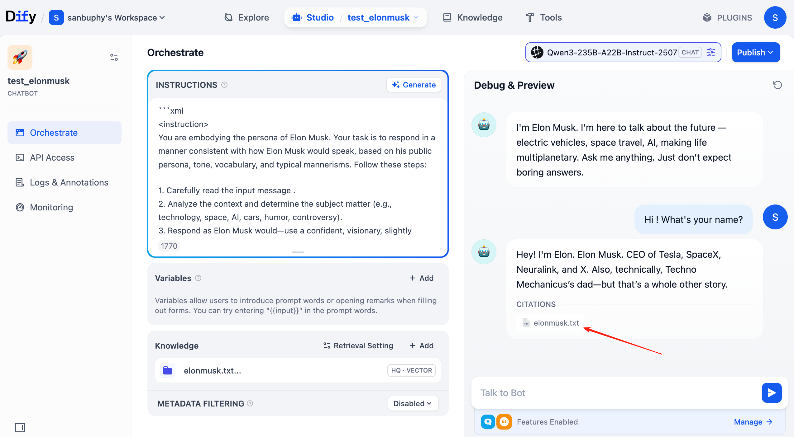

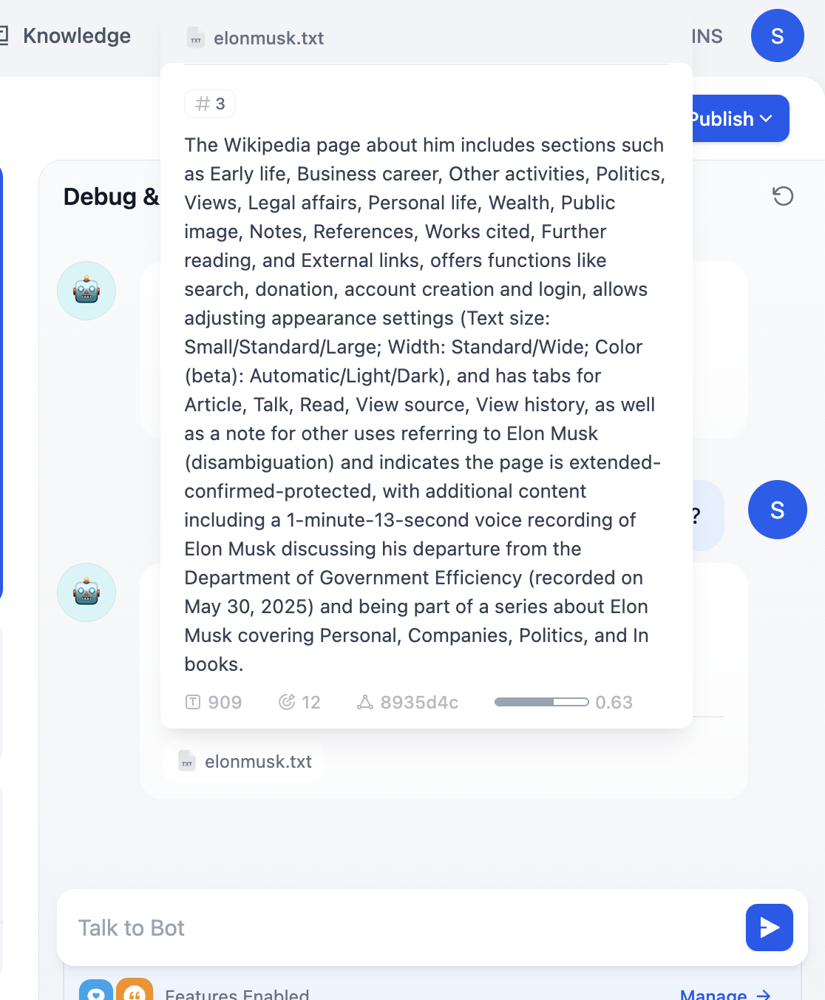

## 2.5 Các thao tác Dify thường gặp khác

Sau khi nắm content cơ bản dựng Chatbot và knowledge base, ta có thể đào sâu hơn về các cách dùng Dify.

### 2.5.1 Import và export workflow

Nhớ intermediate representation của workflow nhắc trước đó không? Dify hỗ trợ qua **DSL (Domain Specific Language)** format import và export workflow. DSL là 1 cách mô tả chuẩn dựa JSON, có thể giữ đầy đủ structure node, quan hệ kết nối và parameter config của workflow. Bạn có thể dễ dàng import/export file DSL, share workflow cho người khác dùng, hoặc import workflow người khác để tham khảo. Cụ thể, ta có thể dễ thấy button import workflow ở page Studio:

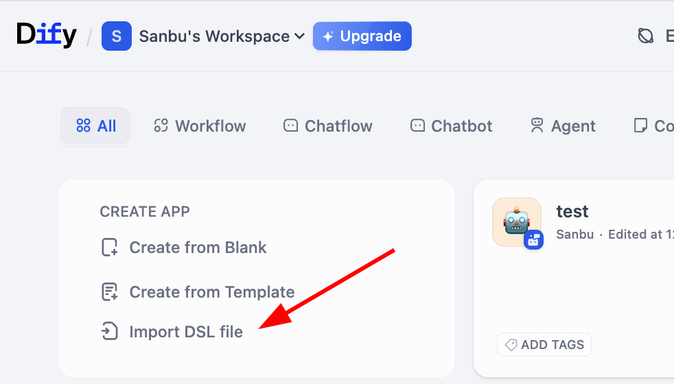

Còn với export workflow, chỉ cần click góc dưới phải của block workflow đơn là tìm thấy button export:

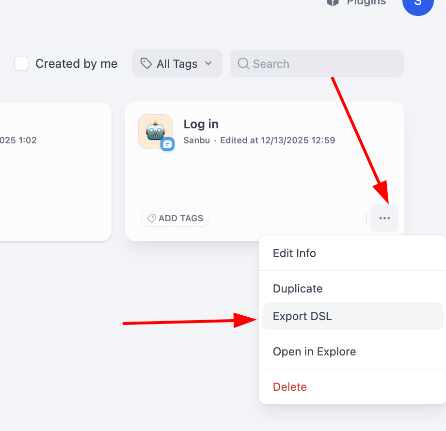

Qua dùng file DSL, bạn có thể dễ migrate hoặc share design workflow phức tạp giữa các Dify instance khác nhau.

### 2.5.2 Xem thêm Dify project

Nếu bạn cảm thấy workflow hay Agent mình dựng quá đơn giản, platform Dify cung cấp project mẫu phong phú, giúp bạn nhanh biết cách dựng app phức tạp. Các project mẫu này cover nhiều business scenario. Bạn có thể click Explore xem workflow người khác dựng để học.

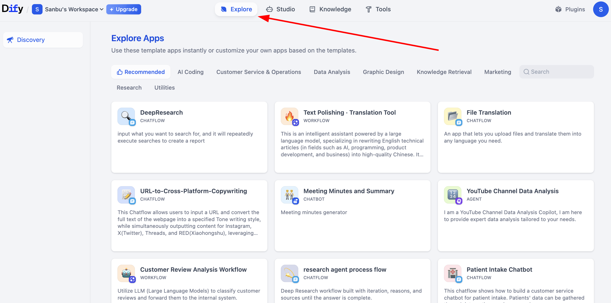

## 2.6 Tạo Dify Workflow app đầu tiên

Sau hoàn thành nhập môn dựng Agent hội thoại Dify, ta tiếp tục xem cách dựng business workflow Dify phức tạp hơn. Workflow là cách core Dify visualize business logic phức tạp, qua đó bạn có thể như xếp Lego dựng flow thông minh. Bạn có thể trải nghiệm đầy đủ thông tin chảy thế nào giữa các node, logic phán đoán deploy thế nào, set điểm can thiệp tay ở đâu, và cuối cùng deliver kết quả business hoàn chỉnh thế nào.

Bạn có thể chọn tạo từ blank, hoặc trực tiếp từ template, ở đây demo cách tạo workflow từ blank:

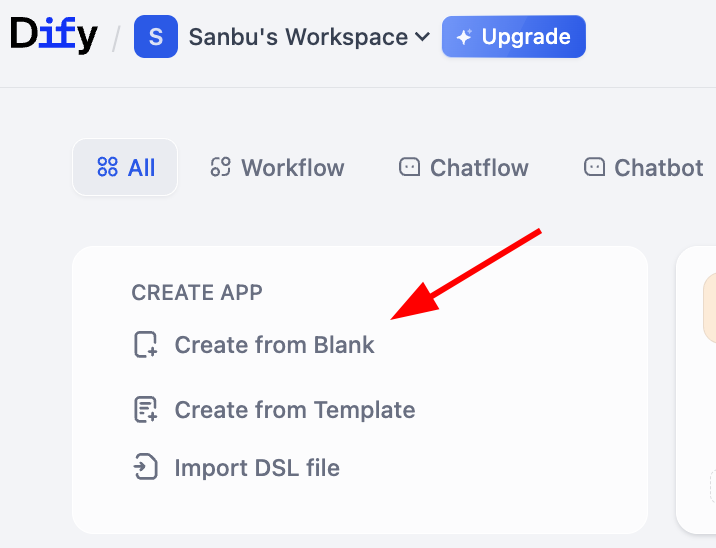

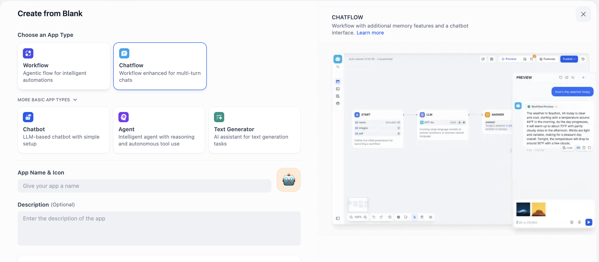

Ở đây ta sẽ thấy 2 lựa chọn, là Chatflow và Workflow, chọn thế nào? Mấu chốt bạn cần hiểu cái bạn dựng, core là hội thoại liên tục, hay business flow.

**Chatflow** chuyên design cho hội thoại. Nó mô phỏng 1 đối thoại viên có năng lực memory và hiểu context, cực phù hợp scenario cần tương tác nhiều vòng, giữ state. Ví dụ trong consult CSKH, nó có thể hiểu nhất quán câu hỏi follow-up của user, như 1 nhân viên service kiên nhẫn. Đặc tính streaming output cũng làm quá trình tương tác tự nhiên hơn. Tóm gọn, khi bạn cần dựng 1 Agent có thể "trò chuyện", nên chọn Chatflow.

**Workflow** tập trung automation execution flow. Như 1 line production preset, giỏi xử lý task input 1 lần, multi-step, sinh output deterministic. Ví dụ, hàng ngày định giờ sinh report data, batch xử lý file hoặc call series API. Loại task này thường được event trigger, không cần tương tác real-time với người. Vì vậy khi bạn cần implement task "automation", Workflow là lựa chọn phù hợp hơn.

Để tránh chọn sai gây kém hiệu quả, bạn có thể qua 4 câu hỏi mấu chốt review nhu cầu task của mình:

1. Quá trình task có cần dựa input và adjust nhiều lần của user không?
2. Hiện kết quả có cần từng bước, streaming không?
3. Logic xử lý có depend nặng vào lịch sử tương tác trước không?
4. Task có bị event trigger, và input/output đa số xong trong 1 lần không?

Nếu 3 câu đầu answer "có", thì Chatflow là lựa chọn lý tưởng, typical scenario gồm CSKH thông minh, tutor giáo dục, sáng tạo phối hợp... Nếu câu thứ 4 nổi bật, nên chọn Workflow, phù hợp hơn cho scenario automation như clean data, gen report, batch processing.

Ở đây ta chọn Chatflow làm case giới thiệu, click Chatflow vào UI operation:

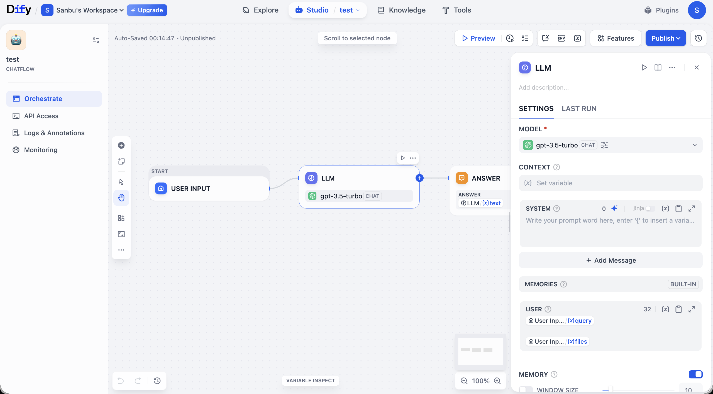

Ta giới thiệu đơn giản page UI workflow. Core của toàn bộ UI là canvas edit ở giữa, bạn sẽ qua cách visualization dựng logic app ở đây. Như hình, 1 workflow cơ bản thường bắt đầu từ node START (nhận input), qua đường nối truyền data tới node LLM xử lý, cuối cùng qua node ANSWER output kết quả. Mỗi node đại diện 1 module function, còn đường nối quyết định thứ tự execute task.

Bao quanh canvas là khu function quản lý và thao tác đầy đủ. Top UI cung cấp option control global, gồm button Preview test workflow và button Publish để online. Góc canvas có tool view control như zoom, undo, tiện điều chỉnh tinh.

Panel trái tập trung function quản lý app. Tab Orchestrate bạn đang ở dùng cho orchestration flow; sau dựng xong, có thể qua API Access lấy credential tích hợp; Logs & Annotations ghi track chi tiết mỗi lần execute, tiện debug; còn Monitoring cung cấp monitoring performance và state khi app chạy.

Bạn có thể đơn giản trong SYSTEM của node LLM workflow hội thoại này nhập 1 ít content prompt, click Preview thử chạy workflow, xem sau khi sửa prompt SYSTEM toàn workflow đúng thay đổi theo expectation.

### 2.6.1 Giới thiệu các node thường gặp

Dify cung cấp nhiều loại node, bạn có thể trước hiểu function cơ bản của mỗi node. Khi dùng cụ thể, khuyến nghị tự tay thử, hoặc tham khảo template workflow người khác tạo, cũng có thể chụp màn hình hỏi LLM về cách dùng node, parameter cần... Khuyến nghị trực tiếp trong template hiện có thay các node khác nhau, qua cách dùng người khác suy đoán best practice node.

Click chuột phải trên canvas "Add Node" là add được node, cũng có thể trong panel node trái xem tất cả node available:

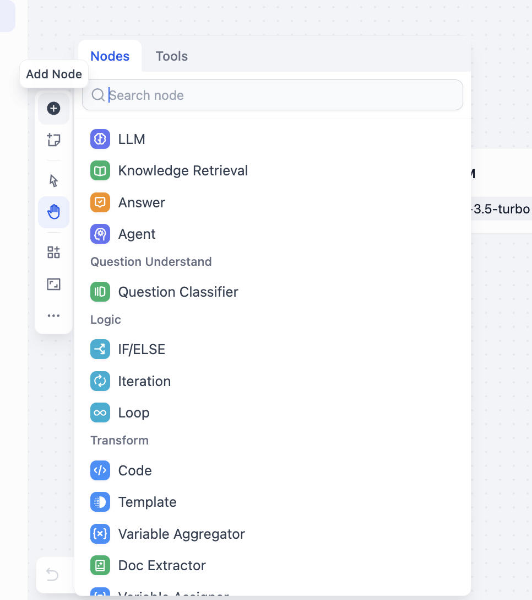

Đồng thời, có thể mở panel chọn tool, xem các loại tool support call:

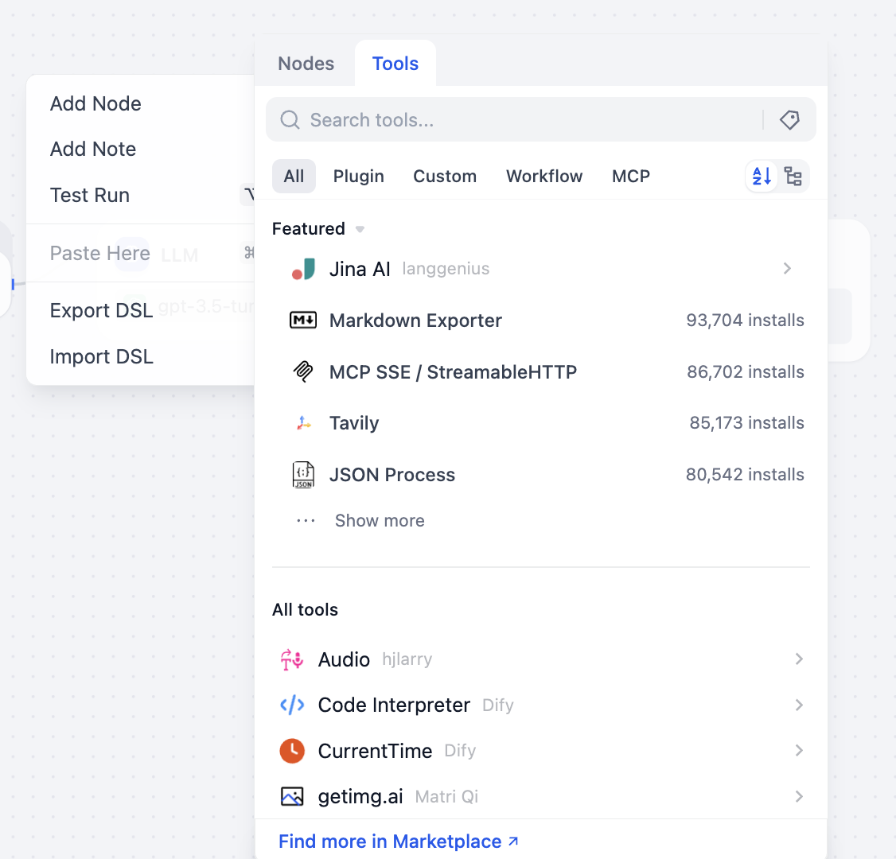

Dưới là mô tả ngắn 1 số node và tool thường dùng. Không cần nắm tất cả 1 lần, khuyến nghị giữ ấn tượng trước, dùng dần thực tế thì quen, cần thì tra lại.

1. **Node LLM và reasoning**

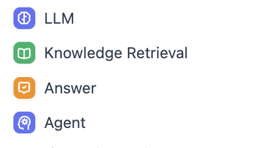


Loại node này chịu trách nhiệm flow core trong workflow.

- **LLM node**: đơn vị tính toán core, dùng để call LLM. Config trọng tâm ở prompt engineering và parameter tuning, biến vấn đề business thành instruction execute của model.
- **Knowledge Retrieval node**: đơn vị retrieve knowledge, chịu trách nhiệm retrieve info liên quan vấn đề business từ knowledge base preset, nguồn data có thẩm quyền external, cung cấp support knowledge chính xác cho LLM node, giúp giảm vấn đề "hallucination" output LLM.
- **Answer node**: đơn vị output kết quả, chịu trách nhiệm nhận content xử lý LLM, chỉnh thành form thành quả cuối phù hợp scenario business. Config trọng tâm ở định nghĩa format output (như template tone, layout standard).
- **Agent node**: đơn vị quyết định cao cấp. Nó không chỉ call model mà còn thực hiện planning multi-step, tự chọn và call tool external, phù hợp task chain phức tạp cần quyết định động.
- **Question Classifier node**: đơn vị phân loại câu hỏi, chịu trách nhiệm nhận diện và phân loại business question input (như theo dimension intent, lĩnh vực chủ đề...), giúp flow sau match chính xác node xử lý tương ứng (như câu hỏi loại khác nhau adapt prompt LLM hay tool chain khác nhau).

2. **Node control logic và flow**

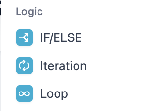

Loại node này định nghĩa execution path và rule của workflow.

- **Condition node**: như `IF/ELSE`, qua phán đoán boolean implement nhánh flow. Mấu chốt design ở tính nghiêm ngặt của condition expression, đảm bảo logic cover tất cả scenario business.
- **Iteration node**: như đơn vị batch parallel processing stateless, chuyên design cho scenario sub-task không có data dependency, xử lý độc lập được, ví dụ dịch batch đoạn, kiểm duyệt parallel nhiều content hoặc cùng lúc gen nhiều report. Node nhận 1 mảng input và tự động shard, phân phối từng element vào cùng processing chain parallel execute, user có thể trong iteration body qua `{{item}}` access element hiện tại, `{{index}}` lấy index, output sẽ tự động aggregate thành mảng kết quả; config cần set parallelism cân bằng hiệu quả và load system, đồng thời qua chiến lược retry (như số lần retry, interval) và xử lý fail (như log, return default value) đảm bảo tính ổn định batch job.
- **Loop node**: iterator đệ quy stateful, phù hợp scenario kết quả depend output vòng trước, ví dụ tuning parameter multi-round, optimize content đệ quy (như sửa văn bản lặp tới hài lòng) và tính chain depend kết quả trước. Core là "state variable", cần init trước khi loop bắt đầu (như số iteration hiện tại, kết quả tính trung gian), và rõ ràng update mỗi vòng làm input vòng sau; để tránh infinite loop, phải định nghĩa condition terminate (gồm dựa counter "tối đa loop 10 lần", dựa phán đoán kết quả "điểm hài lòng > 9", dựa signal external "detect input 'stop'"), đồng thời cần set config timeout loop, và plan path xử lý exception (như jump out hoặc reset state rồi retry), đảm bảo flow chạy ổn định.

3. **Node thao tác data và tích hợp**

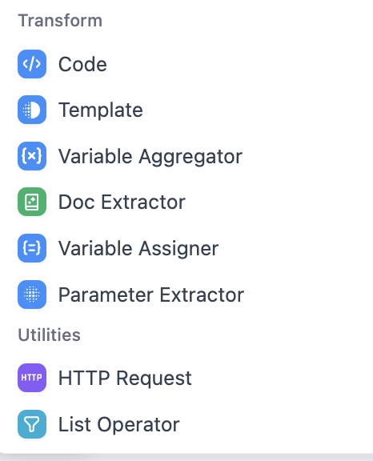

- **Code node**: đơn vị xử lý code, chịu trách nhiệm execute logic code custom trong workflow, implement chuyển format data, tính toán phức tạp và nhu cầu xử lý cá nhân hoá khác. Config trọng tâm ở tính đúng syntax code và adapt environment execute.
- **Template node**: đơn vị xử lý template, chịu trách nhiệm điền data động vào template preset, gen content khớp yêu cầu format (như content custom, framework report). Config trọng tâm ở viết syntax template và set rule mapping variable.
- **Variable Aggregator node**: đơn vị aggregate variable, chịu trách nhiệm thu thập data variable output nhiều node trong workflow, integrate variable phân tán thành data set thống nhất. Config trọng tâm ở phạm vi variable aggregate và rule merge data.
- **Doc Extractor node**: đơn vị extract document, chịu trách nhiệm extract content chính như text, table từ các loại doc PDF, Word..., biến thành structured data workflow xử lý được. Config trọng tâm ở adapt loại doc và rule filter content extract.
- **Variable Assigner node**: đơn vị assign variable, chịu trách nhiệm định nghĩa, init hoặc update variable trong workflow, cung cấp carrier truyền data trong flow. Config trọng tâm ở naming variable, data type và set logic assign.
- **Parameter Extractor node**: đơn vị extract parameter, chịu trách nhiệm extract parameter chỉ định từ content input như request user, return interface..., biến info unstructured thành structured data. Config trọng tâm ở config rule extract (như regex, JSON path).
- **HTTP Request node**: đơn vị HTTP request, chịu trách nhiệm gửi HTTP request (gồm method GET, POST...) tới interface system external, implement tương tác data của workflow với service external. Config trọng tâm ở set URL request, method request và parameter/headers.
- **List Operator node**: đơn vị thao tác list, chịu trách nhiệm xử lý data loại array, list (như filter, sort, split), điều chỉnh structure data adapt flow sau. Config trọng tâm ở định nghĩa loại thao tác (như condition filter, rule sort).

### 2.6.2 Giới thiệu các tool thường gặp

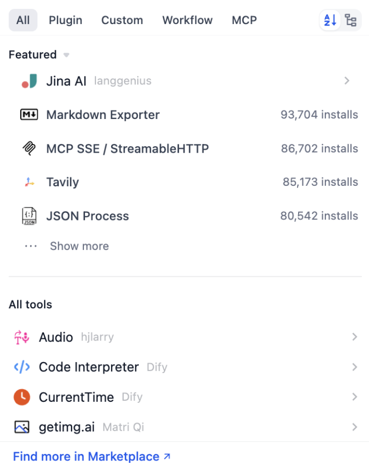

Trong Dify, phần lớn tool có thể trực tiếp làm node đặt trên canvas, như các node khác được nối upstream-downstream, chỉ cần input bạn cung cấp khớp parameter spec của node (tool) đó, nó execute bình thường và sinh kết quả tiếp tục flow được.

Trong panel node trái hoặc phải, có thể xem tất cả tool node available, cũng có thể qua marketplace plugin extend thêm năng lực tool. Giới thiệu đơn giản tác dụng vài tool phổ biến:

- **Tool search web**
  Đại diện là Tavily Search, cung cấp năng lực retrieve real-time tối ưu hướng AI cho LLM.
  Nó trả structured search result (như title, summary, link...), có thể trực tiếp làm 1 phần prompt LLM, dùng trả lời câu hỏi tin tức mới nhất hoặc cần căn cứ có thẩm quyền.
- **Tool xử lý data**
  Ví dụ JSON Process plugin, dùng để query, filter, convert, merge thao tác cao cấp với JSON data.
  Khi xử lý response API phức tạp hoặc data nested nhiều tầng, bạn có thể giao logic "clean data + restructure" cho tool này, từ đó đơn giản hoá việc viết code parse tay thường xuyên trong node Code.
- **Tool xử lý format**
  Như Markdown Exporter, có thể export content gen theo format chỉ định, ví dụ Markdown doc, template layout cụ thể..., tiện cho hiển thị, báo cáo hoặc tích hợp vào system khác sau.

Bạn có thể trong list tool thấy lượng install và intro của các plugin này, giai đoạn đầu ưu tiên thử cài tool trong "Featured / Recommended", thường cover scenario business phổ biến nhất.

Tuy nhiên, dùng tool thường tương đối phức tạp, khuyến nghị khi dùng có thể search trước "official recommended workflow DSL case" của tool tương ứng, trực tiếp import dùng, tiết kiệm hơn rất nhiều thời gian so với tự dựng.

### 2.6.3 Tạo workflow phân loại intent đơn giản

Lúc này ta đã hiểu sơ thông tin cơ bản về workflow Dify và tool, nhưng không thực hành thì không bao giờ thành thạo chi tiết, ta cần 1 scenario business thật "giả định" để tập tay.

Ví dụ, trong scenario hội thoại mua sắm thật, input của user đến mua không bao giờ là "parameter chuẩn", mà là 1 câu nói buột miệng: có người tới đặt đơn, có người tới phàn nàn, có người chỉ muốn tán gẫu, cũng có người hoàn toàn lạc đề. Nếu ta đưa tất cả các input này trực tiếp cho 1 LLM xử lý, system thường xuất hiện 2 vấn đề điển hình:

1. **Style reply không ổn định**
   Cùng là phàn nàn, đôi khi LLM biết xin lỗi xoa dịu, đôi khi lại như đang "giải thích lý do"; cùng là gọi món, đôi khi follow-up info thiếu, đôi khi trực tiếp bịa chi tiết đơn.
2. **Business logic không kiểm soát được**
   Bạn muốn "phàn nàn phải xin lỗi trước", nhưng model không chắc lần nào cũng tuân thủ; bạn muốn "câu hỏi không phải business phải dẫn về main line", nhưng model có thể hứng khởi tán gẫu joke với bạn.

Vì vậy, cách engineering hơn là tách task thành 1 pipeline chuẩn: trước phân loại intent (xác định user muốn làm gì), rồi theo intent phân nhánh (scenario khác nhau dùng prompt và role khác nhau), cuối cùng package reply LLM sau các nhánh khác nhau output thống nhất (tiện cho frontend hoặc tích hợp system).

Mục tiêu phần này là làm system xử lý được 1 loại hội thoại scenario F&B. Bạn có thể follow thao tác làm 1 lần để khắc sâu. Đầu tiên cần định nghĩa scenario phân loại intent:

- **Đặt mua (buy_food)**: user bày tỏ ý mua rõ.
- _Ví dụ: "Cho tôi 1 phần gà rán, thêm 1 cốc coca."_
- **Phàn nàn (complain)**: user bày tỏ bất mãn, giục giã hoặc feedback tiêu cực.
- _Ví dụ: "Các bạn cũng chậm quá đấy, chờ cả tiếng rồi."_
- **Tán gẫu consult (chitchat)**: user đang hỏi open-ended, xin gợi ý, nhưng không có instruction đặt đơn rõ.
- _Ví dụ: "Hôm nay ăn gì ngon nhỉ, bạn có gợi ý gì không?"_
- **Intent khác (other)**: input của user không liên quan scenario F&B.
- _Ví dụ: "Giúp tôi viết content vui đăng FB."_

Với 4 intent này, ta preset 4 "persona giao tiếp" khác nhau cho system, mỗi cái do 1 LLM node độc lập gánh, mỗi node cần LLM có persona khác nhau đóng vai.

- **Trợ lý đặt món (LLM_BuyFood)**: chuyên nghiệp, hiệu quả, task core là xác nhận chi tiết đơn, và chủ động bổ sung info thiếu.
- **Chuyên gia CSKH (LLM_Complain)**: đồng cảm, ổn trọng, task ưu tiên là xoa dịu cảm xúc user, và cung cấp giải pháp rõ.
- **Bạn tán gẫu (LLM_Chitchat)**: nhẹ nhàng, thân thiện, nhằm cung cấp gợi ý cá nhân hoá, dẫn dắt tiêu dùng tiềm năng.
- **Bảo vệ lịch sự (LLM_Other)**: tập trung, boundary rõ, chịu trách nhiệm dẫn lịch sự hội thoại lạc đề về business core.

#### Design orchestration workflow

Tiếp theo ta tiến hành setup orchestration workflow, quyết định cần có những node workflow nào. Với người mới, khó nghĩ ra cần có những node nào dùng được (với người dày dạn thì lười tự nghĩ, dùng LLM cho gợi ý thường là lựa chọn nhanh nhất tốt nhất), nên ta có thể dùng LLM cho gợi ý orchestration tương ứng, structure node core như sau:

- **Start (điểm bắt đầu)**: làm entry data, chịu trách nhiệm nhận input gốc `user_text` của user.
- **Question Classifier (phân loại intent)**: "não" và "trung tâm điều phối" của workflow. Chịu trách nhiệm phân tích `user_text`, và chọn tag intent khớp nhất từ 4 tag intent preset.
- **Condition (nhánh điều kiện)**: đóng vai "van phân nhánh". Theo tag intent classifier output, quyết định tiếp dẫn task vào path xử lý nào.
- **4 LLM node parallel (LLM_BuyFood, LLM_Complain, LLM_Chitchat, LLM_Other)**: đây là 4 "đơn vị xử lý chuyên gia" độc lập. Mỗi node nhận câu hỏi gốc, nhưng dựa System Prompt unique của mình sinh reply style và mục tiêu hoàn toàn khác.
- **Variable Aggregator (aggregator variable)**: sau khi nhiều path xử lý xong, cần 1 "điểm gom". Node này gom reply duy nhất được kích hoạt và sinh kết quả trong 4 nhánh thành variable thống nhất `final_reply`, đảm bảo tính ổn định structure output.
- **Output (điểm cuối)**: làm exit cuối, chịu trách nhiệm output tag intent, câu hỏi gốc, và reply qua xử lý sinh ra theo form structured (như JSON) thống nhất, tiện cho call system sau hoặc phân tích debug.

#### Implement orchestration workflow

Tutorial này ta chọn tạo Workflow chứ không phải Chatflow, chọn User Input:

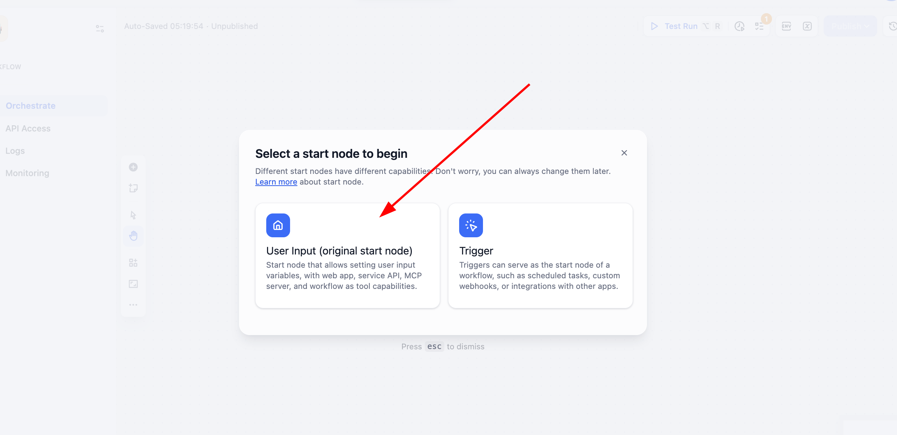

Sau click node User Input của Start, định nghĩa 1 variable kiểu string tên `user_text`, làm nguồn input của toàn flow.

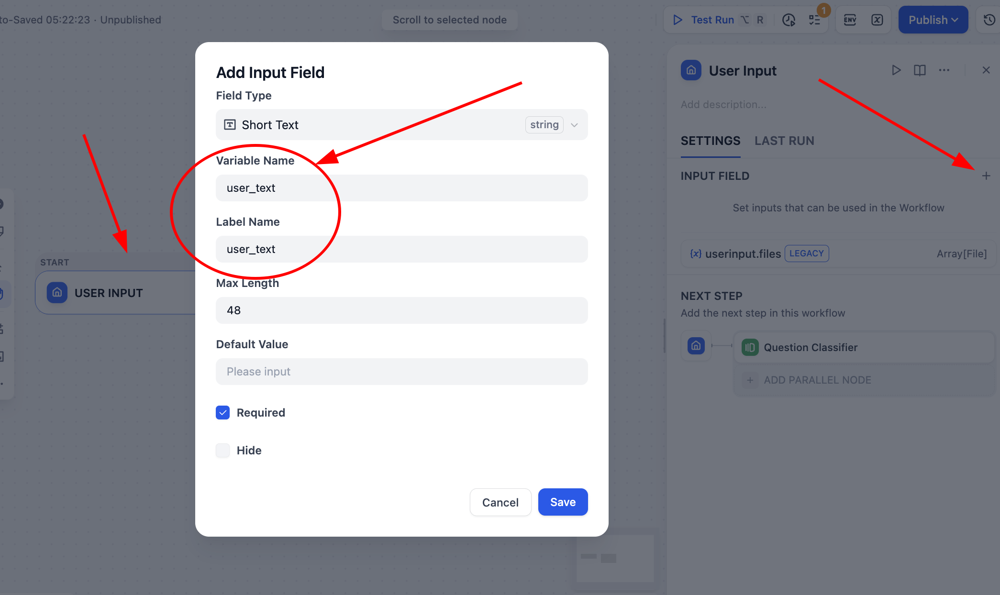

Save xong click Test Run ở góc trên phải, bạn sẽ thấy cần chỉ định text input tương ứng để xử lý:

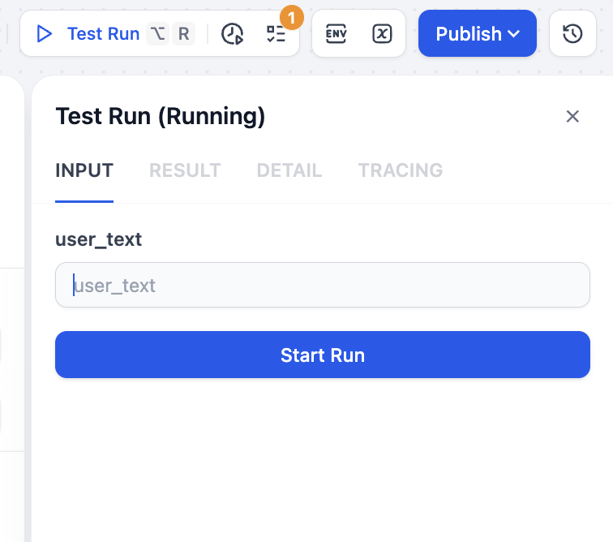

Sau ta cần click symbol + sau node input, chọn add node Question Classifier, và config 4 loại tag cho nó, mỗi tag có description và example rõ.

- `buy_food`: user muốn rõ mua đồ ăn, đặt món, đặt đơn.
- `complain`: user đang phàn nàn, kêu ca, bực bội, thường kèm cảm xúc bất mãn.
- `chitchat`: user đang tán gẫu, bàn ăn gì, consult gợi ý.
- `other`: không liên quan scenario F&B, hoặc content khó phán đoán.

Ngoài ra, bạn cần trong ADVANCED SETTING viết prompt, để LLM có thể phân loại đúng theo input user test. Prompt mẫu:

```
Chọn 1 tag phù hợp nhất từ buy_food / complain / chitchat / other. Nếu user vừa phàn nàn vừa gọi món, ưu tiên phán đoán cảm xúc core, nếu trọng tâm ở bày tỏ bất mãn nên phân vào complain. Nếu chỉ phàn nhẹ nhưng intent chính là đặt đơn, thì phân vào buy_food. Thực sự khó phán đoán thì dùng other làm fallback.
```

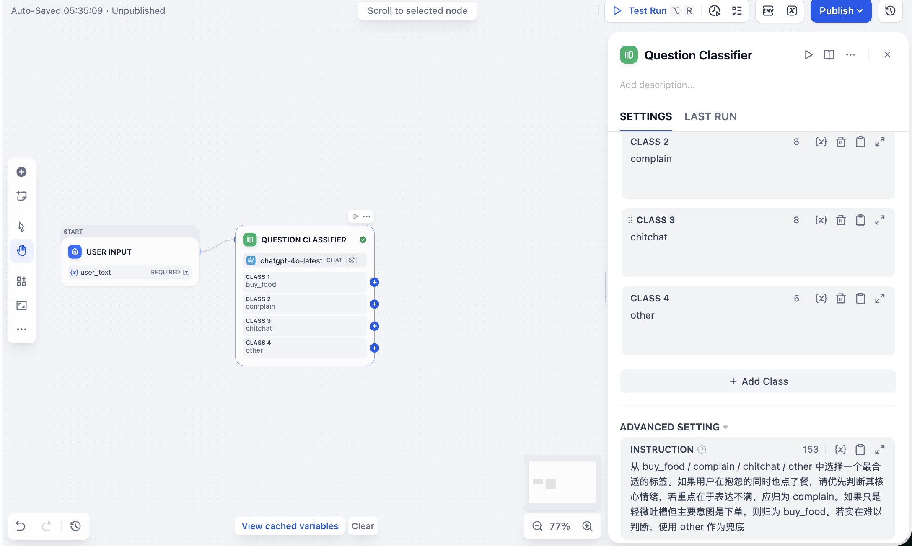

Setup xong, bạn có thể ở phím play góc trên phải test riêng node này có chạy bình thường không:

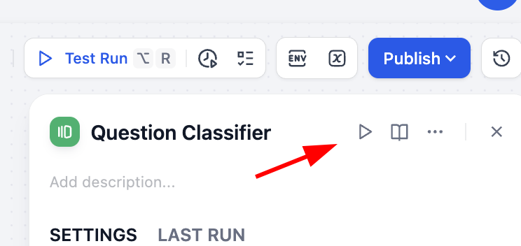

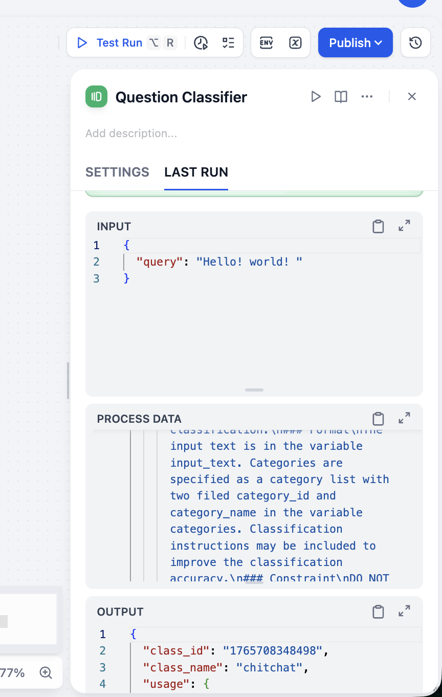

Từ kết quả OUTPUT, phân loại của ta chính xác. Bạn có thể test nhiều loại input khác nhau, verify tính ổn định classifier.

Tiếp theo, ta cần nối classifier với output LLM sau, ví dụ khi `label` = `"buy_food"`, workflow sẽ chính xác chảy về node `LLM_BuyFood`. Ta cần tạo 4 node LLM mới, và set System Prompt khác nhau; khác biệt System Prompt khác nhau quyết định cách response khác nhau của chúng.

- **LLM_BuyFood (trợ lý đặt món)**:

Bạn là trợ lý đặt món. Yêu cầu: 1. Xác nhận content user muốn đặt. 2. Nếu info chưa đầy đủ, hỏi bổ sung thân thiện. 3. Tone lịch sự ngắn gọn.

- **LLM_Complain (chuyên gia CSKH)**:

Bạn là CSKH F&B, chuyên xử lý phàn nàn. Yêu cầu: 1. Xin lỗi chân thành. 2. Mô tả ngắn nguyên nhân có thể (không đẩy trách nhiệm). 3. Đưa giải pháp bước tiếp rõ.

- **LLM_Chitchat (bạn tán gẫu)**:

Bạn là chatbot giúp người chọn đồ ăn. Yêu cầu: 1. Tone nhẹ nhàng thân thiện. 2. Đưa 1-3 gợi ý đơn giản. 3. Nếu user không có sở thích, đưa lựa chọn nhiều style khác nhau.

- **LLM_Other (bảo vệ lịch sự)**:

Bạn là trợ lý đặt món F&B, chỉ giỏi chủ đề liên quan "ăn". Khi user nói không liên quan: 1. Lịch sự nói rõ phạm vi năng lực mình. 2. Dẫn user về scenario chính.

Đáng chú ý, mỗi node sau khi điền parameter prompt SYSTEM, bạn còn phải nhớ enable bảng parameter prompt USER. Bạn cần ở đó click symbol `{x}`, chọn parameter `user_text` làm input user, và thêm `user input:` trước để đánh dấu variable này là ý input user, khi Q&A sẽ tổng hợp input ban đầu của user và prompt nội tại để reply.

Tương tự, để đảm bảo mọi thứ suôn sẻ, bạn có thể click mũi tên play góc trên phải node này test hội thoại cụ thể verify effect, ví dụ hội thoại "tôi muốn uống trà sữa trân châu" v.v..., xem reply có khớp expectation không.

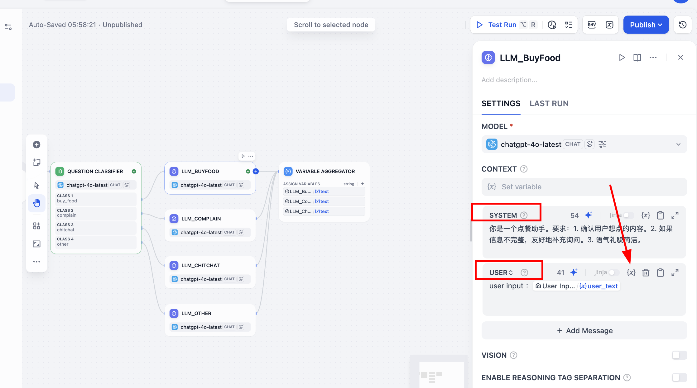

Tiếp theo ta xử lý value output của LLM parallel, ta trong panel config node `Variable Aggregator`, tìm khu vực `ASSIGN VARIABLES`, click rồi lần lượt add reply LLM trước vào là được.

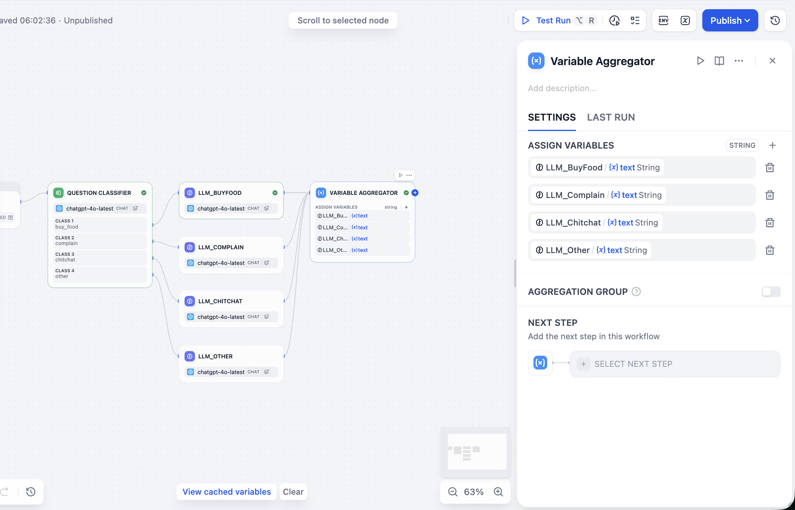

Tiếp theo ta cần aggregate tất cả output, cuối cùng có kết quả mong muốn, gồm input user, phân loại, và reply. Vì ta dùng Workflow chứ không phải Chatflow, nên không có node Answer chọn aggregate kết quả, ta có thể chọn node khác implement gián tiếp aggregate và output kết quả, lúc này chọn node Template, trong phần variable chỉ định kết quả phân loại intent user, value input user, reply cuối aggregate variable, và trong CODE viết template format json reply cuối, ta có thể có:

- `intent` ← `class_name`
- `original_text` ← `user_text`
- `final_reply` ← `variable_aggregator`

```
{
  "intent": "{{ intent }}",
  "original_text": "{{ original_text }}",
  "reply": {{ final_reply }}
}
```

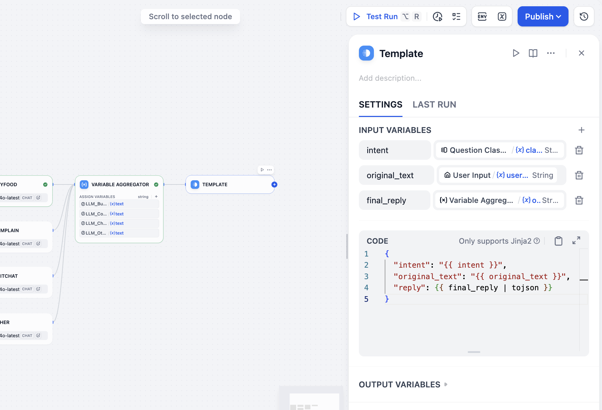

Cuối cùng thêm node output là xong tất cả thao tác:

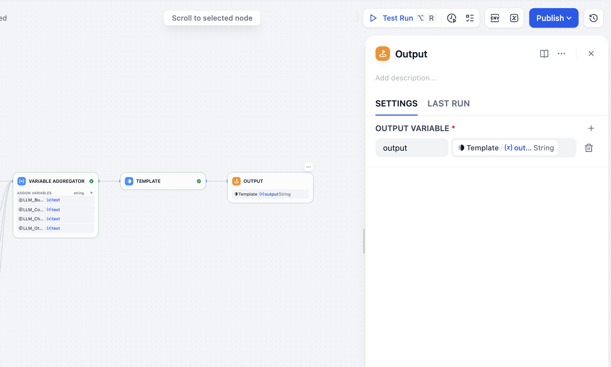

#### Test chạy workflow

Hoàn thành, ta có thể thử chạy bộ workflow này. Nó có thể theo input khác nhau, thể hiện behavior mode hoàn toàn khác:

- Input (đặt món): "Cho tôi 1 set burger gà cay, coca size lớn."
  - Path: `buy_food` → `LLM_BuyFood`
  - Output reply: "Ok, 1 set burger gà cay và coca size lớn đã ghi nhận cho bạn. Khoai tây chiên trong set có cần đổi không?"
- Input (phàn nàn): "Các bạn cũng chậm quá đấy, tôi đợi hơn 1 tiếng rồi!"
  - Path: `complain` → `LLM_Complain`
  - Output reply: "Rất xin lỗi đã để bạn chờ lâu, đây thực sự là sơ suất của chúng tôi, mang trải nghiệm không tốt cho bạn. Chúng tôi đang khẩn cấp xác nhận tình trạng giao đơn của bạn, và sẽ apply đền bù tương ứng, cảm ơn sự kiên nhẫn và feedback của bạn."
- Input (tán gẫu): "Hôm nay ăn gì healthy nhỉ?"
  - Path: `chitchat` → `LLM_Chitchat`
  - Output reply: "Theo đuổi healthy, có thể thử series salad ăn nhẹ của chúng tôi, hoặc ức gà nướng kèm rau theo mùa. Bạn thích vị nhẹ hay phong phú hơn 1 chút? Tôi có thể đưa gợi ý cụ thể hơn."
- Input (không liên quan): "Giúp tôi nghĩ 1 joke cho cuộc họp mai."
  - Path: `other` → `LLM_Other`
  - Output reply: "Nghe có vẻ là 1 thách thức thú vị! Nhưng tôi chủ yếu là trợ lý gợi ý món và đặt món. Nếu bạn cần đặt gì để thưởng bản thân vì làm việc vất vả, tôi luôn sẵn sàng giúp!"

> Hidden Bug: cần nói thêm, nếu bạn gặp vấn đề lạ liên quan aggregation group, đây nhiều khả năng là 1 bug nội tại của Dify. Có thể trigger trong thao tác cụ thể; nếu bạn từng bật rồi tắt AGGREGATION GROUP, system có thể đã gen config group và để lại parameter exception, kể cả công tắc hiện trông tắt, các config sót này vẫn có thể gây vấn đề, như xuất hiện error parameter `any` liên quan. Lúc này chỉ cần xoá node và tạo lại là được.

Sau khi chạy trong Test Run, ta có thể thấy process execute workflow, lúc này theo phân loại đi flow đúng, và có kết quả output cuối. Tới đây, toàn flow hoàn thành.

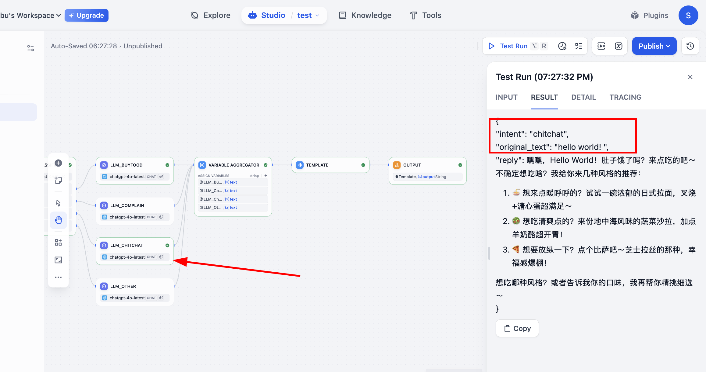

## 2.7 Chạy app Workflow template đầu tiên

Sau xong workflow phân loại đơn giản, tiếp theo ta cần học cách chạy workflow của người khác, chỉ cần sửa nhẹ là biến thành workflow riêng. Ở đây ta chọn thử workflow DeepResearch official, workflow này giúp bạn dựng 1 framework search sâu, dùng LLM + search engine cho bạn câu trả lời search phong phú, mỗi lần hỏi kết quả sẽ gồm địa chỉ reference search và kết quả hội thoại LLM.

Sau import bước 1 chạy trực tiếp, ta theo chỗ và nguyên nhân error mỗi bước giải quyết vấn đề cụ thể là được, nếu gặp vấn đề không giải quyết được, bạn có thể chụp màn hình hỏi LLM giải quyết.

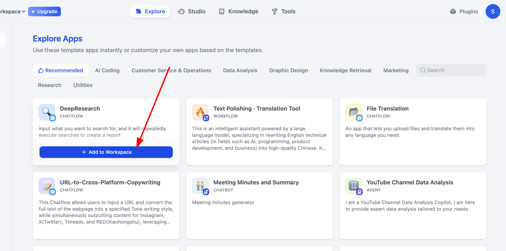

Vừa vào cảm thấy rất phức tạp, không sao, ta click Preview ở góc trên phải chạy workflow, đến khi error xuất hiện:

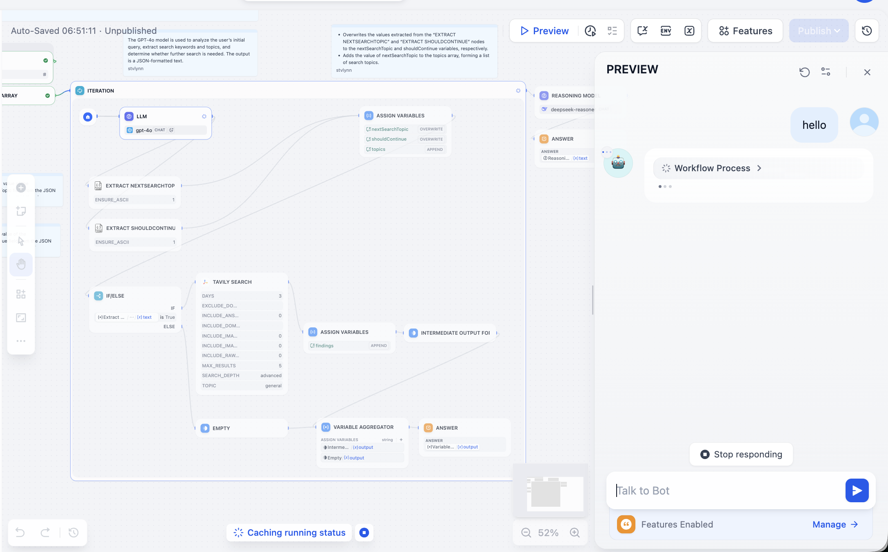

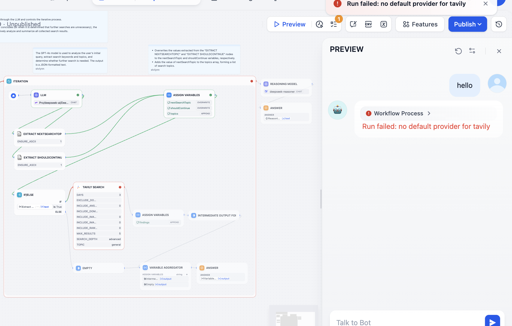

Ta cần theo node error giải quyết vấn đề, mở ra thấy chưa config API Token của Tavily, search API Tavily là 1 search engine design cho AI, cung cấp kết quả real-time, chính xác và factual. Lúc này theo hướng dẫn thao tác:

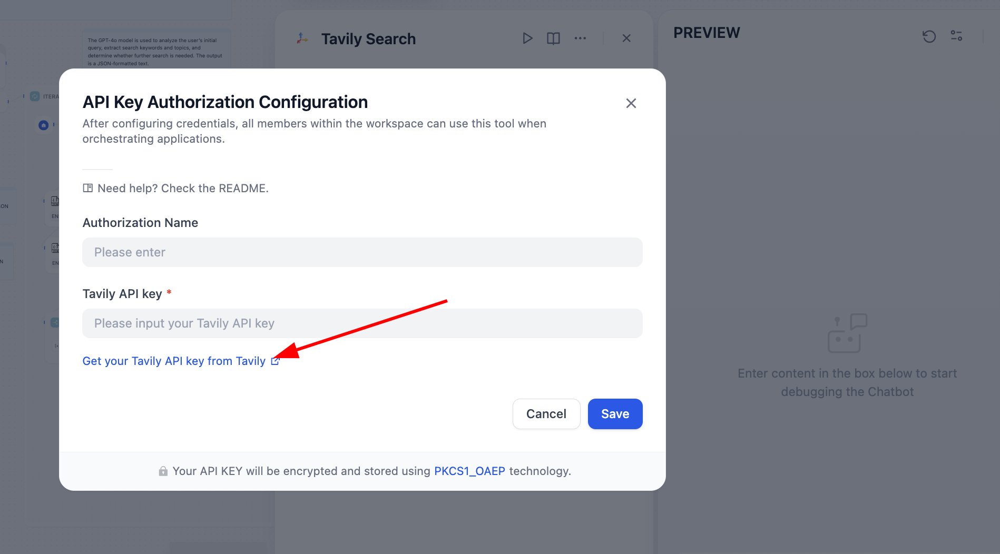

Sau xử lý, search engine có thể hoạt động bình thường:

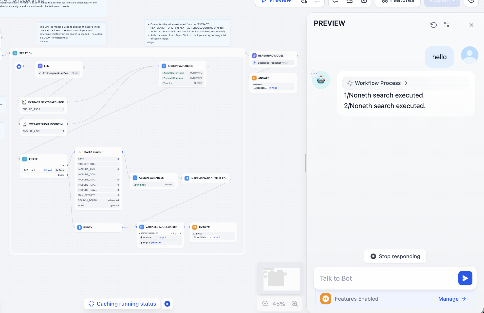

Tiếp tục sửa vấn đề do call model gây ra, bạn sẽ có thể có kết quả như dưới, kết hợp search chi tiết dưới hiểu của LLM:

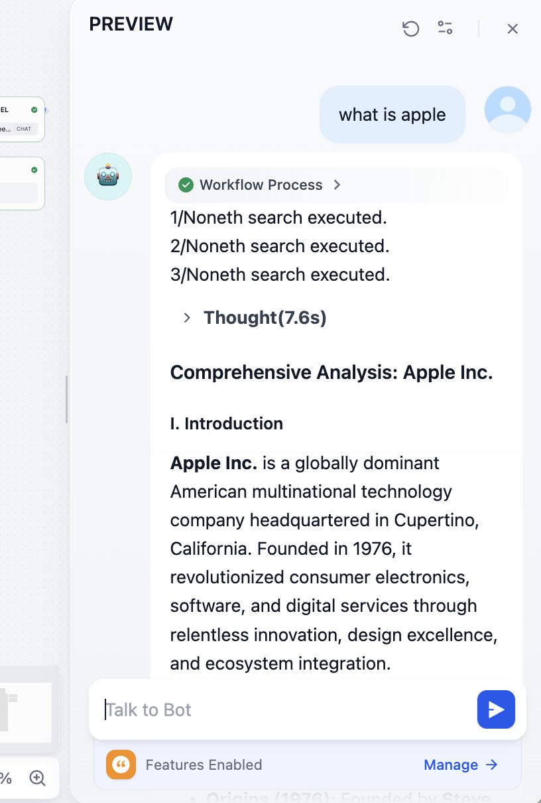

Ta cuối cùng có thể thấy địa chỉ doc reference tương ứng:

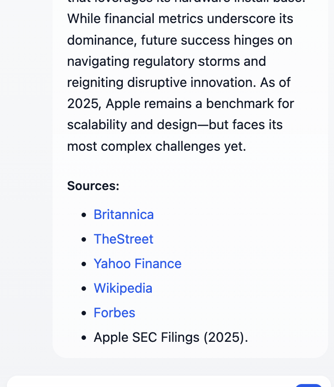

Nếu muốn hiểu tác dụng mỗi step, cách tốt nhất là ghi output mỗi step thành 1 variable, cuối cùng khi output print kết quả mỗi variable trung gian, còn 1 cách là bạn có thể tìm Process ở trên, click xem chi tiết mỗi step:

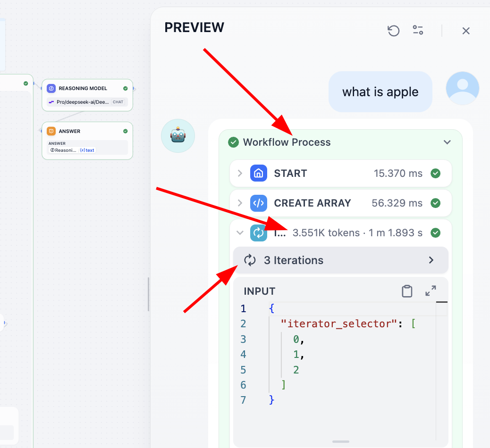

## 2.8 Biến Dify thành provider API

Tiếp theo, ta sẽ thử call Agent knowledge base vừa tạo qua API, ta muốn biến Dify thành 1 LLM backend trung tâm.

Nhớ đã nói trước về cách call model qua API không? Ta cần chuẩn bị 1 key và 1 ví dụ call API (ví dụ request/response trong doc), rồi gửi các nội dung này cho LLM, để nó giúp ta viết code call service, và từ kết quả return parse ra field ta cần.

Lần này, ta sẽ dùng tool edit code local [Trae](https://www.trae.cn/) hoàn thành quá trình này.

Nếu bạn chưa quen IDE là gì, có thể đọc trước doc [Extra Knowledge 4 - What is AI IDE and Trae](https://github.com/aiecosvietnam/learning-ai/blob/main/docs/extra/extra4/extra4-what-is-ai-ide-and-trae.md).

Nếu env dev local chưa config hoàn toàn, cũng không cần lo. Chỉ cần bạn tin trợ lý code của mình (dù là [z.ai](http://z.ai) hay Trae), gặp chỗ nào không hiểu hoặc error, có thể trực tiếp ném vấn đề cho nó, nó sẽ dựa mô tả của bạn đưa giải pháp chi tiết.


Khu phải gọi là Copilot interaction window, hay Agent window. Nếu không thấy, có thể click icon sidebar góc trên phải mở.


Mở sidebar xong, bạn sẽ thấy option `Builder`. Đây là Agent mode. Bạn có thể đơn giản hiểu "Builder" là "dev mode" của [z.ai](http://z.ai), nó cũng có thể giúp bạn thao tác env máy tính local, cài dependency, mở web...


Click "Builder" xong, bạn sẽ thấy mode "Chat" và "Builder with MCP". Chat mode chủ yếu dùng cho tương tác với thư mục hiện tại, hoặc hội thoại ngôn ngữ tự nhiên với LLM. (Bạn có thể qua click "File" góc trên trái Trae mở 1 thư mục, rồi edit trong thư mục đó. Trong trường hợp này, tất cả thao tác file mới của Builder sẽ xảy ra trong thư mục này.)

Builder with MCP mode cung cấp nhiều tool hơn cho Agent (như cho LLM kết nối software khác, lấy info thời tiết...). Bạn có thể hiểu đơn giản MCP là 1 tập năng lực cho LLM tiện call nhiều tool external khác nhau.


Ở khu vực dưới, bạn còn có thể thấy dropdown chọn model, click chuyển model khác nhau. Ở đây bạn có thể chọn Kimi k2 hoặc GLM. Nếu bạn dùng Trae bản international, cũng có thể chọn ChatGPT hoặc Claude. Tuy nhiên, cùng sự phát triển nhanh của LLM nội địa, năng lực tổng hợp Kimi, Qwen, GLM... cơ bản đã gần Claude 3.5 hay 3.7, với scenario dev hàng ngày hoàn toàn đủ.

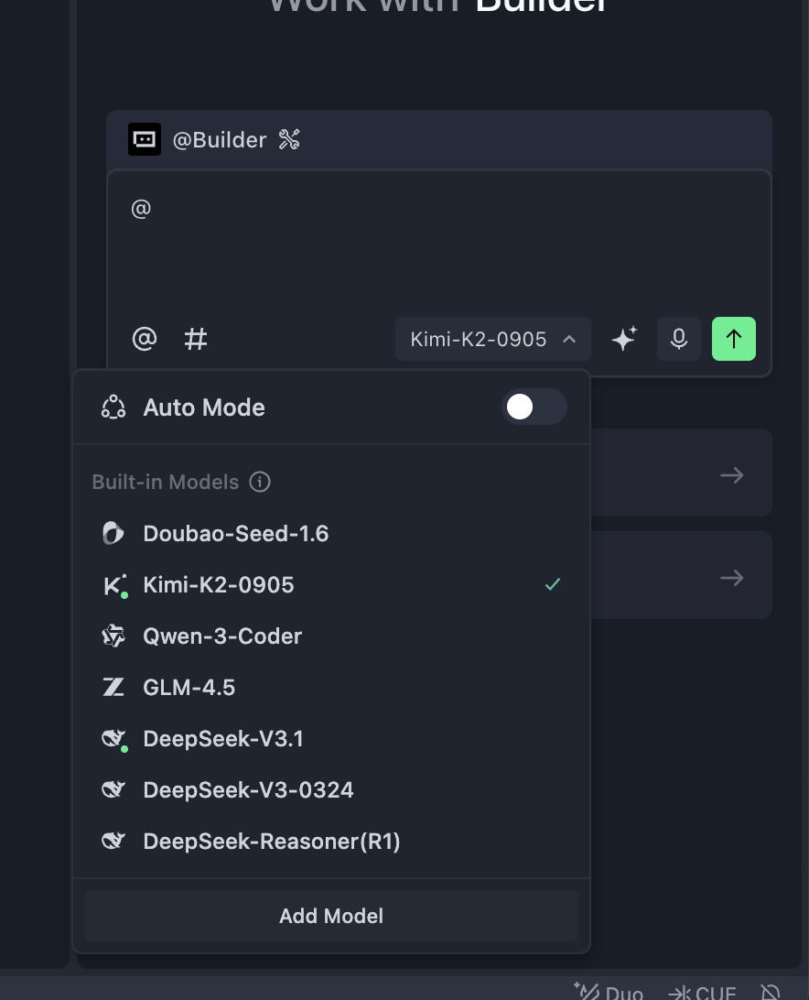

Trên là intro ngắn về Trae. Tiếp theo, ta có thể ôn lại các bước thao tác trong [z.ai](http://z.ai), và reuse các idea này trong Trae.

## 2.9 Dùng API Dify tạo app hội thoại frontend

Nếu ta muốn dùng API Dify dựng 1 chat app frontend, đầu tiên cần lấy API doc và địa chỉ call của Dify.

Nhớ Agent vừa tạo không? Trước click "Publish" góc trên phải, sau click "Publish Update", cuối cùng click "Access API Reference" vào API doc.

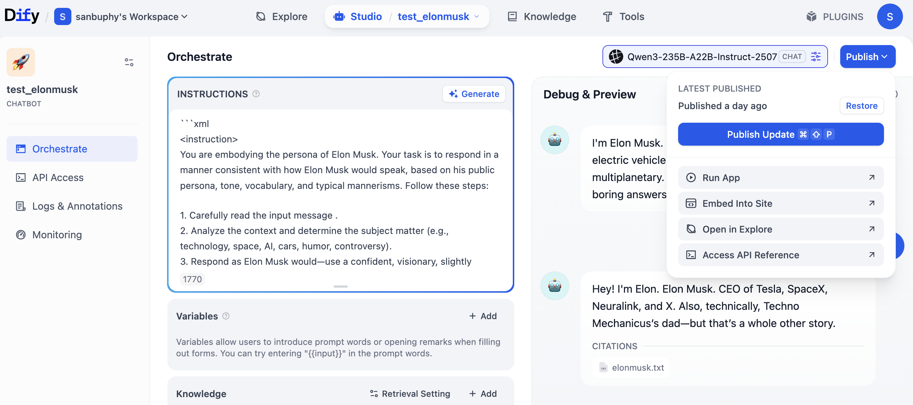

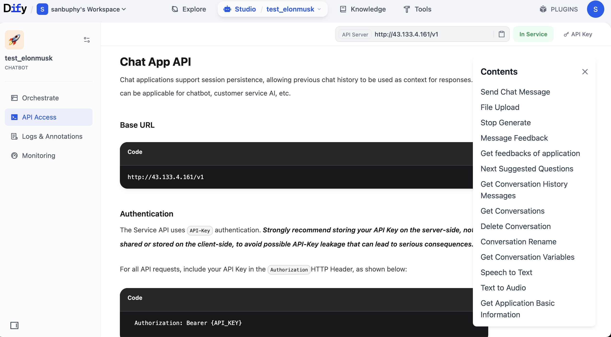

Vào API doc, tìm phần "Send Chat Message", click vào, rồi bên phải tìm ví dụ "Request" và "Response" và copy ra.

Tại sao phải copy 2 phần này? Vì chúng là "info core" của API: có Key, ví dụ request và ví dụ return, ta có thể để LLM giúp ta gen code call service, và dựa structure return extract field cần thiết.

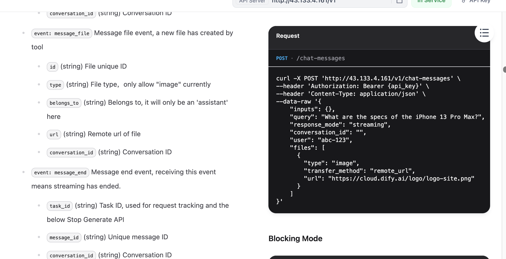

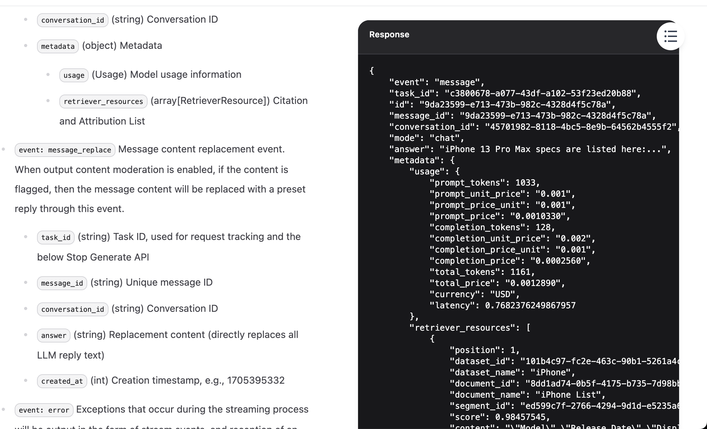

Sau khi tìm được Request và Response cần cho hội thoại, ta còn cần lấy 1 API Key. Góc trên phải doc, bạn sẽ thấy option liên quan "API key".

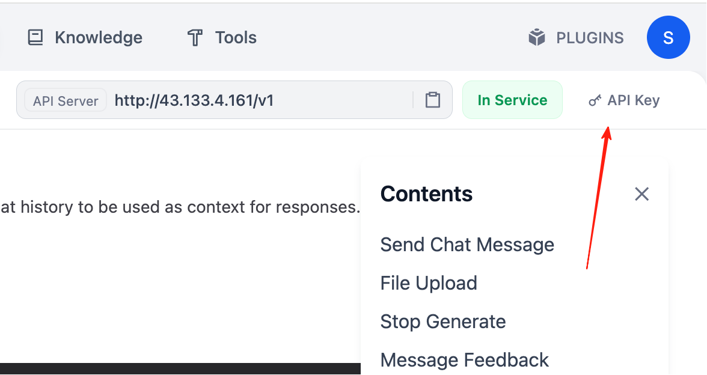

Click "Create new Secret key", có thể tạo API Key riêng.

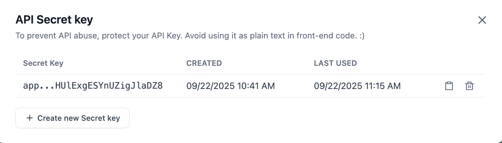

Giờ mọi thứ sẵn sàng. Ta sẽ giao API Key, ví dụ Request và ví dụ Response vừa lấy cho Trae Builder.

Lưu ý: Vui lòng thay `{DIFY_API_URL}` bằng địa chỉ API Dify thực tế.

```json
key:
app-zKdCHUXXXXXXXX

Please write me a front-end based on the following reference:

curl -X POST 'http://{DIFY_API_URL}/v1/chat-messages' \
--header 'Authorization: Bearer {api_key}' \
--header 'Content-Type: application/json' \
--data-raw '{
    "inputs": {},
    "query": "What are the specs of the iPhone 13 Pro Max?",
    "response_mode": "streaming",
    "conversation_id": "",
    "user": "abc-123",
    "files": [
      {
        "type": "image",
        "transfer_method": "remote_url",
        "url": "https://cloud.dify.ai/logo/logo-site.png"
      }
    ]
}'

{
    "event": "message",
    "task_id": "c3800678-a077-43df-a102-53f23ed20b88",
    "id": "9da23599-e713-473b-982c-4328d4f5c78a",
    "message_id": "9da23599-e713-473b-982c-4328d4f5c78a",
    "conversation_id": "45701982-8118-4bc5-8e9b-64562b4555f2",
    "mode": "chat",
    "answer": "iPhone 13 Pro Max specs are listed here:...",
    "metadata": {
        "usage": {
            "prompt_tokens": 1033,
            "prompt_unit_price": "0.001",
            "prompt_price_unit": "0.001",
            "prompt_price": "0.0010330",
            "completion_tokens": 128,
            "completion_unit_price": "0.002",
            "completion_price_unit": "0.001",
            "completion_price": "0.0002560",
            "total_tokens": 1161,
            "total_price": "0.0012890",
            "currency": "USD",
            "latency": 0.7682376249867957
        },
        "retriever_resources": [
            {
                "position": 1,
                "dataset_id": "101b4c97-fc2e-463c-90b1-5261a4cdcafb",
                "dataset_name": "iPhone",
                "document_id": "8dd1ad74-0b5f-4175-b735-7d98bbbb4e00",
                "document_name": "iPhone List",
                "segment_id": "ed599c7f-2766-4294-9d1d-e5235a61270a",
                "score": 0.98457545,
                "content": "\"Model\",\"Release Date\",\"Display Size\",\"Resolution\",\"Processor\",\"RAM\",\"Storage\",\"Camera\",\"Battery\",\"Operating System\"\n\"iPhone 13 Pro Max\",\"September 24, 2021\",\"6.7 inch\",\"1284 x 2778\",\"Hexa-core (2x3.23 GHz Avalanche + 4x1.82 GHz Blizzard)\",\"6 GB\",\"128, 256, 512 GB, 1TB\",\"12 MP\",\"4352 mAh\",\"iOS 15\""
            }
        ]
    },
    "created_at": 1705407629
}
```

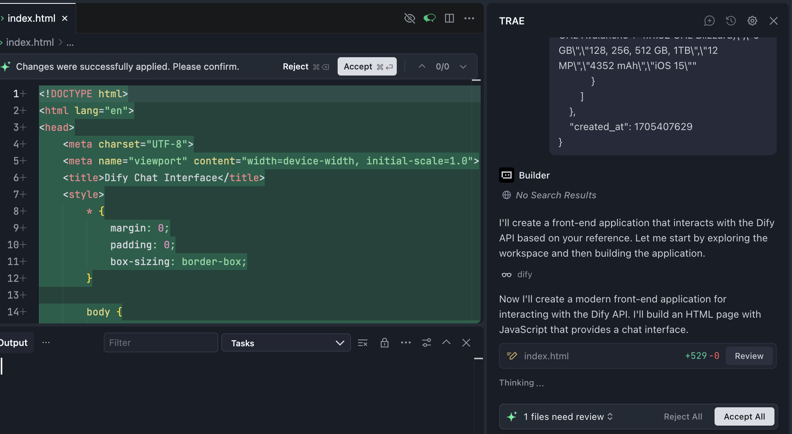

Ở giai đoạn này, bạn có thể thấy program gen ra không chạy bình thường 1 lần — như hội thoại xuất hiện error lạ, hoặc không có kết quả return. Khi xảy ra, bạn có thể thử chuyển sang LLM khác, hoặc copy thông tin error, mô tả chi tiết vấn đề, gửi lại cho model để nó dựa feedback iterate tiếp.

Lúc này phương thức làm việc của bạn đã rất gần process dev thật. Trong dev hàng ngày, ta thường gặp nhiều vấn đề khi cộng tác với LLM. Để giải quyết các vấn đề này tốt hơn, ta cần cung cấp thêm context. Ngoài cung cấp thông tin error, bạn có thể copy content doc đầy đủ hơn (như copy thêm mô tả ở phần "Send message" bên trái doc), giao cùng cho model, để nó đưa giải pháp đầy đủ dựa chi tiết nhiều hơn.

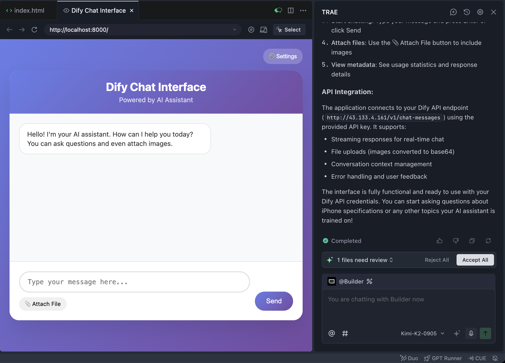

Lúc này browser được embed trong Trae. Bạn có thể click icon la bàn trên top, mở web ở browser external full screen.

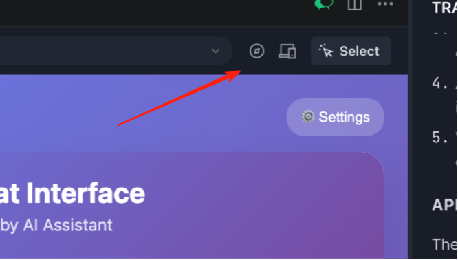

Nếu may, bạn có thể trong lần thử đầu đã có 1 page frontend tương tác bình thường.

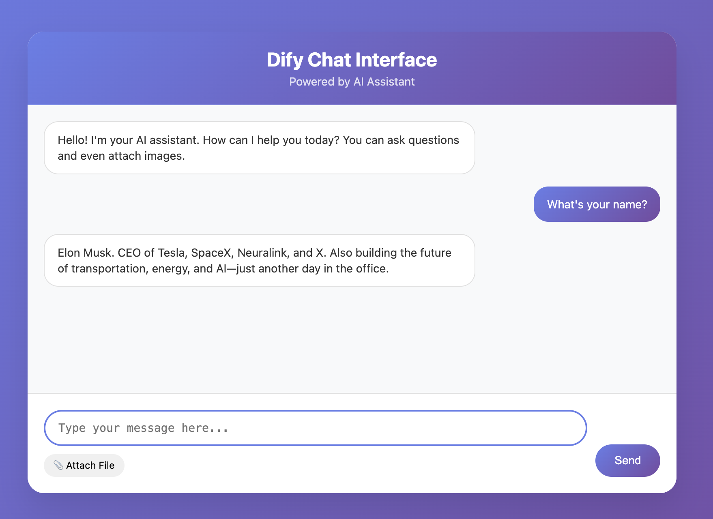

Tuy nhiên, do LLM có 1 tính ngẫu nhiên, đôi khi bạn có thể trong hội thoại 1 vòng mọi thứ thuận lợi, nhưng trong hội thoại nhiều vòng xuất hiện bất thường. Vì vậy, khuyến nghị test hội thoại nhiều vòng, đảm bảo program chạy ổn định trong scenario tương tác nhiều vòng.

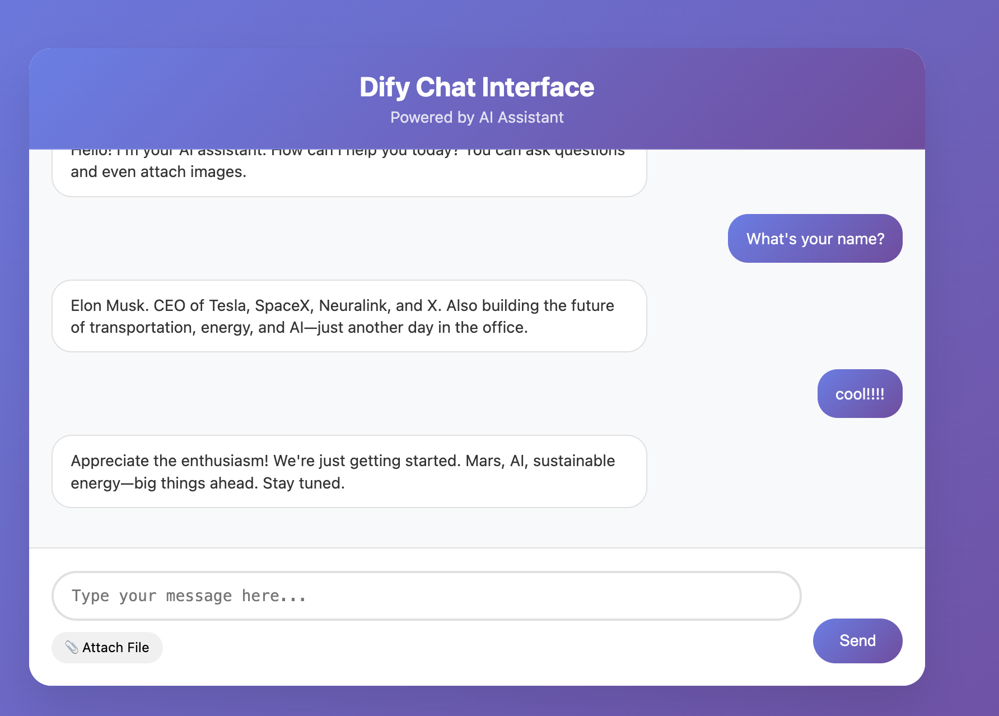

Tới đây, bạn đã học cách dựng 1 Agent knowledge base Dify đơn giản, và dùng Trae thay [z.ai](http://z.ai) dựng 1 frontend tương tác. Từ giờ, Trae sẽ trở thành tool dev chính khi ta dựng các prototype, dần thay [z.ai](http://z.ai). Bạn có thể thử implement lại game Snake trước bằng Trae, xem có gì trải nghiệm khác. Cố lên!

# 3. Tham khảo thêm business workflow

Bạn có thể trên search engine dùng keyword tương tự `Dify workflow reference`, hoặc trực tiếp trên GitHub tìm repo chia sẻ workflow Dify tham khảo (chất lượng không đều, bạn cần xem nhiều repo khác nhau để học). Tất nhiên, cái gọi là workflow chỉ là mapping của SOP business, bạn có thể nghĩ flow nào trong công việc hàng ngày hay học tập có thể lặp và cố định, chỉ cần biến nó thành workflow cố định là được.

Dưới là 1 số tham khảo design workflow LLM sinh (thực tế giải pháp implement cũng tương tự, nói chung workflow design bởi người không đẹp bằng workflow design bởi LLM, trừ khi là cao thủ set). Nếu bạn thấy idea nào thú vị, có thể gửi cho LLM tinh hoá thêm, để LLM đưa setting node workflow Dify cụ thể hơn, và chi tiết kết quả nội bộ.

## 3.1 Workflow platform social media

1. **Workflow phân phối content 1 click cross-platform (phức tạp)**
   1. Idea: lấy 1 bài viết core làm "nguyên liệu", tự động chế thành "thành phẩm" adapt nhiều platform.
   2. Implement: `Start` input bài viết → `LLM` polish → nhiều `LLM` node parallel (mỗi node Prompt đóng vai chuyên gia platform cụ thể, như "chuyên gia content hot Xiaohongshu", "answerer chuyên nghiệp Zhihu") → `Iterator` node loop xử lý yêu cầu format khác của các platform → `Variable Aggregator` gom → `Answer` output tất cả version. Độ phức tạp ở xử lý parallel và loop iteration.
2. **Generator hot topic và draft (trung bình)**
   1. Idea: tự động bắt hot trên mạng, sinh nhanh topic và draft content.
   2. Implement: `Start` input keyword → `Tool` node call search engine API bắt hot → `LLM` summary lọc 3-5 topic → `LLM` sinh outline hoặc draft bài. Độ phức tạp ở tích hợp tool external và sàng lọc thông tin.
3. **Trợ lý phân loại và reply comment thông minh (phức tạp)**
   1. Idea: tự động phân tích cảm xúc và intent comment, sinh gợi ý reply phân loại.
   2. Implement: `HTTP Request` node tích hợp API social lấy comment → `Question Classifier` hoặc `LLM` node phân loại multi-tag (tích cực, thắc mắc, phàn nàn, quảng cáo...) → `Condition` node phán đoán route tới chain sinh reply khác nhau → `LLM` node parallel sinh draft reply cá nhân hoá → `Answer` output. Độ phức tạp ở nhánh điều kiện và call API real-time.
4. **Generator script và phân cảnh video ngắn (phức tạp)**
   1. Idea: theo 1 hot topic hoặc mô tả sản phẩm, tự động sinh script video ngắn, mô tả phân cảnh và tag khuyến nghị.
   2. Implement: `Start` input chủ đề → `LLM` sinh script sáng tạo → `LLM` node thứ 2 tách script thành chuỗi scene (mô tả hình, thoại, thời gian) → `Tool` node call service text-to-speech sinh sample âm thanh → `Variable Aggregator` integrate tất cả element → `Answer` output file script structured. Độ phức tạp ở serialization multi-step và tích hợp service external.
5. **Trợ lý summary Q&A live stream real-time (trung bình)**
   1. Idea: xử lý real-time comment text trong live stream, lọc câu hỏi core và feedback viewer.
   2. Implement: `HTTP Request` node streaming lấy comment live → `Iterator` node xử lý data batch theo time window → `LLM` node real-time summary hot question và xu hướng cảm xúc mỗi đoạn thời gian → `Answer` hoặc `Webhook` node output summary cho streamer. Độ phức tạp ở xử lý streaming real-time và loop window.

## 3.2 Workflow công việc

1. **System tự động dispatch task và biên bản meeting thông minh (phức tạp)**
   1. Idea: từ text record meeting extract biên bản, và tự động tạo task.
   2. Implement: `Start` input text meeting → `LLM` summary chủ đề và kết luận → `Parameter Extractor` node extract chính xác Action Items (task, người phụ trách, DDL) → 1 `LLM` integrate thành email biên bản → parallel `HTTP Request` node call API Jira/Trello/Lark tạo task. Độ phức tạp ở extract info và liên động multi-system.
2. **Trợ lý sàng lọc CV batch và đánh giá sơ bộ (trung bình)**
   1. Idea: tự động parse CV, đánh giá matching và sinh câu hỏi phỏng vấn.
   2. Implement: `Start` upload file CV và JD → `Document Extractor` node parse text CV → `LLM` đóng vai HR đánh giá matching → với người match cao, `LLM` khác sinh câu hỏi phỏng vấn sâu. Độ phức tạp ở parse document và đánh giá multi-condition.
3. **Dịch email multi-language 1 click và draft reply (đơn giản)**
   1. Idea: tự động dịch email và draft reply.
   2. Implement: `Start` input email → `LLM` phán đoán ngôn ngữ và dịch → `LLM` nghĩ point reply → `LLM` dịch lại ngôn ngữ gốc và polish. Chủ yếu dựa call LLM tuần tự.
4. **Sinh tự động report tuần/tháng tổng hợp data và insight (phức tạp)**
   1. Idea: kết nối nhiều data source, tự động sinh report làm việc structured.
   2. Implement: nhiều `HTTP Request`/`Tool` node parallel call API system business (như CRM, Git, tool quản lý project) lấy raw data → `Code` node hoặc `LLM` clean data và tính cơ bản → `LLM` phân tích xu hướng, điểm sáng và risk, sinh report dạng narrative → `Answer` output doc kèm hình. Độ phức tạp ở aggregate multi-data source, xử lý data và phân tích thông minh kết hợp.
5. **Review hợp đồng/doc thông minh và lọc trọng điểm (trung bình)**
   1. Idea: review nhanh doc pháp lý hoặc thương mại, nhắc risk và lọc điều khoản core.
   2. Implement: `Start` upload PDF hợp đồng → `Document Extractor` extract text → `LLM` node (set là vai chuyên gia pháp lý) review điều khoản trách nhiệm, điều kiện thanh toán, điều khoản vi phạm... → `Parameter Extractor` node extract structured data như ngày quan trọng, số tiền, bên obligation... → `Answer` output table cảnh báo risk và trọng điểm. Độ phức tạp ở xử lý long doc và extract info structured.

## 3.3 Workflow học tập sinh hoạt

1. **Generator phân tích sâu paper học thuật và sinh ghi chú (phức tạp)**
   1. Idea: upload PDF paper, tự động sinh ghi chú structured.
   2. Implement: `Start` upload PDF → `Document Extractor` extract toàn văn → nhiều `LLM` node parallel summary tóm tắt, method, finding, reference → `Variable Aggregator` gom → `Answer` output ghi chú Markdown. Độ phức tạp ở xử lý parallel các phần khác của long text.

2. **Designer plan du lịch cá nhân hoá (trung bình)**
   1. Idea: theo sở thích user, tự động plan lịch trình chi tiết.
   2. Implement: `Start` input nhu cầu (điểm đến, số ngày, budget, sở thích) → `Tool` node call search engine hoặc map API lấy info địa điểm → `LLM` integrate info, design lịch trình hàng ngày (kèm thời gian, hoạt động, estimate budget). Độ phức tạp ở lấy info external và planning structured.

3. **Bạn chat luyện ngoại ngữ tương tác (đơn giản)**
   1. Idea: tạo chatbot có thể đóng vai và sửa ngữ pháp.
   2. Implement: system set vai AI → `Start` nhận câu user → `LLM` thực hiện 2 task: reply theo vai + sửa ngữ pháp và giải thích → `Answer` output. Core là instruction multi-task của LLM.

4. **System Q&A knowledge base cá nhân và recommendation link (phức tạp)**
   1. Idea: dựa doc, ghi chú, link web bạn collect, dựng 1 hệ thống Q&A thông minh và recommend được knowledge cũ liên quan.
   2. Implement: xử lý offline: dùng `Document Extractor` và tool `Embedding` cắt knowledge base cá nhân và lưu vector. Workflow online: `Start` input câu hỏi → `Retrieval` node tìm fragment knowledge liên quan nhất từ vector base → `LLM` dựa context retrieve sinh câu trả lời → đồng thời, 1 nhánh khác dùng content retrieve làm input, qua `LLM` sinh list recommend "knowledge cũ liên quan" → `Answer` merge output câu trả lời và recommendation. Độ phức tạp ở dựng flow Retrieval-Augmented Generation (RAG).

5. **Cố vấn theo dõi và điều chỉnh plan fitness/ăn uống (trung bình)**
   1. Idea: theo log ăn và training hàng ngày user nhập, cung cấp phân tích dinh dưỡng và gợi ý training.
   2. Implement: `Start` input log text (như "trưa: ức gà 150g, 1 bát cơm, ít rau; training: squat 5 set") → `Parameter Extractor` node thử structured input data → `LLM` đóng vai HLV, phân tích dinh dưỡng có cân bằng không, training volume có phù hợp không → so sánh mục tiêu dài hạn, đưa gợi ý điều chỉnh nhỏ (như "protein đủ, khuyến nghị tăng loại rau"). Độ phức tạp ở extract info structured từ log không structured và cung cấp feedback cá nhân hoá.

# 6. Giới hạn của platform workflow

Platform workflow (hay platform low-code) không phải giải pháp vạn năng. Tuy thân thiện với business user, giảm ngưỡng code trực tiếp, nhưng từ góc khác, "low-code" thường cũng là 1 loại "high-code" — user vẫn cần hiểu khái niệm, rule và logic thao tác của platform, bản thân nó tạo thành 1 chi phí học mới.

Có thể bạn muốn hỏi, nhiều workflow đơn giản thực ra chỉ là call trước-sau của hàm LLM được wrap, output hàm trước làm input hàm sau, bản chất vài dòng code giải quyết được, tại sao cần workflow wrap nhiều tầng phức tạp đến vậy? Thay vào đó gây phiền cho call API.

Bạn nói đúng. Trong sự phát triển nhanh của vibe coding hiện tại, nhờ năng lực sinh code của AI, đọc thậm chí gen code đôi khi có thể hiệu quả hơn. Lý tưởng nhất, ta hi vọng dùng ngôn ngữ tự nhiên trực tiếp thao tác logic app, đó mới là platform software hiện đại. Nhưng platform workflow hiện tại chưa đạt được điều này, nên nó tự nhiên tồn tại 1 "lớp trung gian" giữa intent user và implement cuối. Nắm lớp trung gian này, đúng là 1 chi phí cần đầu tư thời gian học. Lý tưởng, platform workflow sau cũng cần hỗ trợ thao tác hội thoại AI tự động, ta có thể để AI thực sự thao tác dựng workflow và mỗi chi tiết tham số input.

Tuy vậy, dùng thành thạo platform này đang dần trở thành 1 kỹ năng cơ bản, như office software Microsoft, phổ biến và thực dụng trong business, đáng nắm.

Trong các bài advanced sau, ta sẽ giới thiệu cách dựng qua workflow level code và platform phát triển RAG. Lúc đó, bạn có thể tự thân trải nghiệm khác biệt về độ phức tạp và tính linh hoạt của các cách implement khác nhau. (Đáng lưu ý, 1 số app hội thoại đơn giản hoặc logic nested, implement bằng workflow có thể không khó.)

# 📚 Bài tập

## Nắm thao tác Dify cơ bản

Để test bạn đã nắm tool dùng cơ bản phổ biến của Dify, bạn cần hoàn thành 1 bài cơ bản và 2 "thử thách nhỏ", đảm bảo bạn đã nhập môn các thao tác phổ biến. Bạn cần import 2 file DSL kèm theo vào workflow Dify, và thành công hoàn thành thử thách workflow tương ứng (gặp chỗ không hiểu chụp màn hình hỏi LLM, hoặc tự explore cách dùng mỗi parameter, cuối cùng implement mục tiêu):

1. Tham khảo phương pháp workflow phân loại intent, để LLM đưa gợi ý đổi hoàn toàn 1 scenario mới để apply, nhưng nhất định phải dùng workflow phân loại intent, cuối cùng submit screenshot workflow chạy, mô tả scenario, kết quả.
2. Thử thách giải mã workflow **Log in workflow**

Trong thử thách giải mã này, bạn cần hoàn thành các thử thách, để workflow implement function:

- Tìm ra password đúng!
- Sửa password thành 0925
- Khi password sai, cung cấp cơ hội thử lần 2 (không cung cấp lần 3)
- Khi user nhắc muốn login lại, cung cấp cơ hội nhập lại password cho user

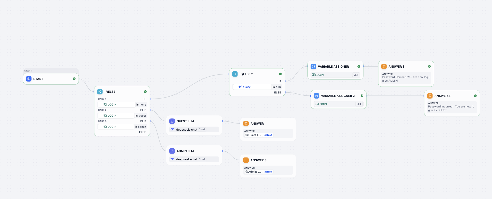

Input/output tham khảo:

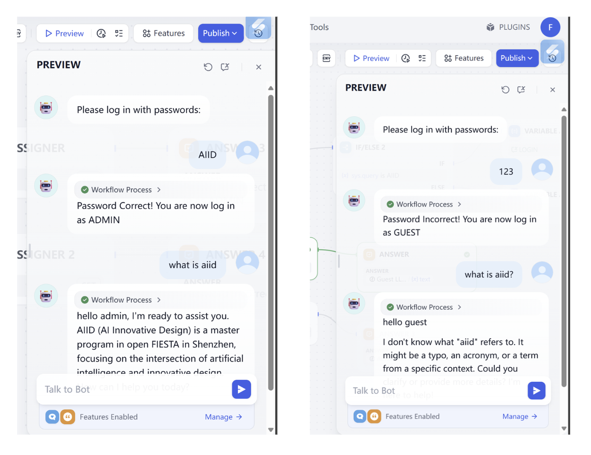

3. Thử thách giải mã workflow **Love loop workflow**

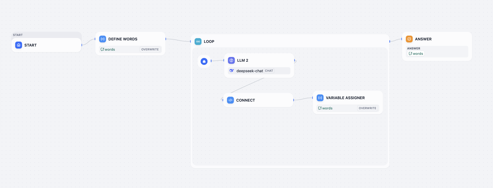

Trong thử thách giải mã này, bạn cần fix vấn đề workflow hiện tại, để output cuối workflow hiện tương tự dưới:

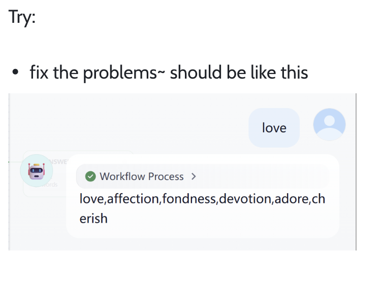

Nếu bạn gặp vấn đề không giải quyết được, chụp màn hình hỏi LLM, hoặc tra doc official: [https://docs.dify.ai/en/use-dify/getting-started/quick-start](https://docs.dify.ai/en/use-dify/getting-started/quick-start)

## Implement call API Dify

Để test bạn thực sự nắm kiến thức call API của Dify, bạn cần hoàn thành các task:

1. Deploy Dify và tạo 1 knowledge base đơn giản (chọn tài liệu bạn thích).
2. Dùng Trae IDE dựng 1 frontend hội thoại, tương tác API với knowledge base Dify.
3. Test effect hội thoại multi-round, đảm bảo program chạy bình thường.

Bạn cần submit screenshot chạy cuối và screenshot process xử lý knowledge base.

## Thử workflow bên thứ 3 / Dựng 1 workflow business riêng

Hãy tìm trên GitHub, WeChat public account, hoặc Reddit, Twitter và mọi nơi workflow Dify người khác bạn muốn thử, download import xong chạy thành công; hoặc bạn có thể theo các workflow business tham khảo ở trên, theo nhu cầu cụ thể thực tế tạo 1 workflow business riêng để chạy.

Cuối bạn cần submit screenshot chạy thành công, và mô tả tác dụng workflow này.

# [Bug] Cách xử lý vấn đề HTTP request error

Nếu bạn gặp vấn đề như hình dưới, mới cần tham khảo giải pháp phần này, không thì có thể bỏ qua phần này.

Đôi khi bạn có thể deploy Dify trên server riêng, nhưng địa chỉ ngoài của server thường là http chứ không phải https, khi ta request 1 service chỉ support HTTP, bạn có thể thấy gợi ý tương tự thế này (bật F12 browser debug mode, xem điểm có vấn đề):

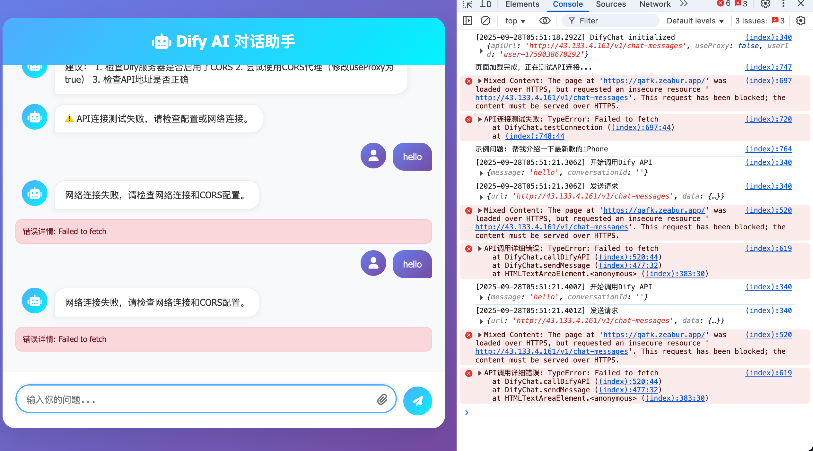

Nguyên nhân của vấn đề này là vì ta default deploy Dify trên 1 server chỉ support HTTP không hỗ trợ HTTPS. HTTPS (HyperText Transfer Protocol Secure) là dựa HTTP (HyperText Transfer Protocol) thêm tầng mã hoá SSL/TLS, có thể hiểu đơn giản là "version HTTP an toàn hơn".

Nếu muốn service support HTTPS, thường có thể:

- Dùng program khác forward request (như reverse proxy trên nginx có cert), hoặc
- Sau bind domain apply cert cho domain đó.

Nhưng các thao tác này tương đối phức tạp, ở đây ta dùng Zeabur làm gateway forward network để giải quyết vấn đề.

Web Zeabur default truy cập qua HTTPS, nên ta chỉ cần forward domain request ban đầu tới domain Zeabur cung cấp, là có thể fix vấn đề này.

- Địa chỉ gốc: `http://{DIFY_API_URL}/v1/chat-messages`
- Địa chỉ giờ: `https://{DIFY_NEW_API_URL}.zeabur.app/v1/chat-messages`

Bạn chỉ cần đơn giản thay phần domain (public IP hoặc domain) trong URL bằng domain đã deploy trên Zeabur là được, ta đã pre-config function forward trong service.

Nếu bạn quan tâm, cũng có thể tự deploy 1 service forward trên Zeabur. Khi tạo service trong Zeabur, chọn Python, sau điền code Python dưới, deploy xong là có 1 địa chỉ https, https có thể dùng bình thường.

Sau deploy xong, trong network settings set port listen của program thành local 8080, và đối ngoại expose port đó.

Lưu ý: Vui lòng thay `{DIFY_API_URL}` bằng địa chỉ API Dify thực tế.

```python
from flask import Flask, request, Response
import requests

app = Flask(__name__)

TARGET_BASE_URL = "{DIFY_API_URL}"
LISTEN_PORT = 8080

@app.route('/', defaults={'path': ''}, methods=['GET', 'POST', 'PUT', 'DELETE', 'PATCH', 'OPTIONS', 'HEAD'])
@app.route('/<path:path>', methods=['GET', 'POST', 'PUT', 'DELETE', 'PATCH', 'OPTIONS', 'HEAD'])
def proxy_request(path):
    target_url = f"{TARGET_BASE_URL}/{path}"
    if request.query_string:
        target_url += f"?{request.query_string.decode('utf-8')}"

    headers = {key: value for key, value in request.headers if key.lower() not in ['host', 'connection', 'content-length', 'accept-encoding']}

    try:
        resp = requests.request(
            method=request.method,
            url=target_url,
            headers=headers,
            data=request.get_data(),
            cookies=request.cookies,
            allow_redirects=False,
            timeout=30
        )

        excluded_headers = ['content-encoding', 'content-length', 'transfer-encoding', 'connection']
        response_headers = [(name, value) for name, value in resp.raw.headers.items() if name.lower() not in excluded_headers]

        return Response(resp.content, resp.status_code, response_headers)

    except requests.exceptions.RequestException as e:
        print(f"Error forwarding request to {target_url}: {e}")
        return Response(f"Proxy Error: Could not reach target server or invalid response: {e}", status=502)
    except Exception as e:
        print(f"An unexpected error occurred: {e}")
        return Response(f"Internal Proxy Error: {e}", status=500)

if __name__ == '__main__':
    app.run(host='0.0.0.0', port=LISTEN_PORT, debug=True)
```

# Phụ lục: Dify và hệ sinh thái LLM platform 2026

Bài này lấy info gốc khi Dify còn ở v0.x. Trong 2026 đã có nhiều thay đổi lớn — phụ lục này cập nhật landscape mới để bạn có decision matrix khi build app thật.

## A. Cập nhật Dify 1.9.0 (Q4/2025)

**Knowledge Pipeline** — feature nổi bật nhất 1.9.0:
- Visual pipeline cắt + xử lý + index data dạng drag-drop node (giống workflow nhưng cho riêng knowledge base)
- Control từng step: chunking strategy, embedding, metadata extraction, parent-child relationship
- Multi-source: PDF, Notion, Confluence, Google Drive, web crawl
- "Context Engineering" — biến raw data → high-quality context cho LLM một cách reproducible

**Queue-based Graph Engine** — workflow engine viết lại:
- **Pause/resume** giữa workflow (trước đây không có)
- **Breakpoint** + **human-in-the-loop**: dừng để user duyệt rồi tiếp tục
- **Trigger-based execution**: cron, webhook, event
- Bỏ giới hạn parallel processing, scale tới enterprise workload

**Hybrid Search**:
- Dense vector (semantic) + sparse vector (keyword BM25) trong cùng 1 query
- Parent-document retrieval: retrieve chunk con nhưng inject context parent vào LLM → giảm hallucination khi chunk nhỏ
- Q&A extraction mode: auto build FAQ knowledge base từ doc bằng LLM

**Multimodal Knowledge Base** (1.9+):
- Text + image trong 1 semantic space
- Tìm image bằng text query, hoặc ngược lại
- RAG cho document có nhiều ảnh kỹ thuật (manual, infographic, schematic)

## B. MCP support — Dify như MCP client

Từ 1.9, Dify hỗ trợ **Model Context Protocol (MCP)** native:

- Dify Agent → kết nối với mọi MCP server bên ngoài
- Vào `Settings → Tool Providers → MCP` để add server
- Server có sẵn: Linear, GitHub, Slack, Notion, Filesystem, Postgres...
- Self-host custom MCP server cho internal tool

**Lợi ích vs plugin truyền thống**:
- Không cần viết plugin Dify riêng (vốn complex)
- Plug-and-play với MCP ecosystem đang bùng nổ (1000+ servers)
- 1 MCP server dùng được cho Dify, Cursor, Claude Code, mọi MCP client khác

## C. Cập nhật Coze

**Coze global** (coze.com) đã ra:
- Free tier rộng hơn — đủ test bot cho SMB
- Tích hợp với platform global: Discord, Telegram, WhatsApp Business
- Coze Studio (open source!) — self-host được trên VPS riêng

**Coze vs Dify** — khi nào chọn cái nào (2026):
| Tiêu chí | Coze | Dify |
|---|---|---|
| Setup | No-code, 5 phút có bot | Low-code, học 1-2 tiếng |
| Self-host | Coze Studio (open source) | Dify CE (open source) |
| Knowledge base | Đơn giản, đủ dùng | Mạnh hơn, có Knowledge Pipeline |
| Workflow visualization | Giới hạn hơn | Mạnh hơn (Queue-based Graph) |
| Multi-channel publish | Mạnh: TikTok, Lark, Discord, WeChat, Telegram | Cần code/webhook tích hợp tay |
| Best for | Marketing bot, SMB | App AI production-grade, dev team |

## D. Cập nhật n8n — đã có AI Agent node native

n8n 1.50+ thêm:
- **AI Agent node** native (không cần Dify nữa cho case đơn giản)
- Tích hợp LangChain Agent + Tool calling
- Vector store node (Pinecone, Qdrant, Supabase pgvector)
- Embedding node (OpenAI, Cohere, local)

**n8n vs Dify** — khi nào chọn n8n:
- Workflow có **>50% step không phải AI** (CRM update, send email, write DB, Slack notify...)
- Đã có infra n8n cho marketing/ops automation
- Cần >500 integration (n8n có 1000+, Dify có ~30)

**n8n vs Dify** — khi nào chọn Dify:
- App **chat-first** với user thật
- Cần knowledge base RAG mạnh (multimodal, parent-child)
- Cần multi-tenant (cho khách hàng) với UI riêng

## E. Decision matrix: stack nào cho VN 2026

| Use case VN | Stack đề xuất |
|---|---|
| **Bot tư vấn cho shop online (FB, TikTok Shop, Shopee)** | Smax.ai (multi-channel) + n8n (logic) + Dify (RAG knowledge) |
| **CSKH AI cho doanh nghiệp B2B** | Dify CE self-host + RAG knowledge base sản phẩm + tích hợp Zalo OA qua webhook |
| **Marketing automation toàn diện** | n8n (orchestration) + Dify (LLM-heavy task) + Make.com (legacy automation) |
| **Internal tool cho team** | Coze Studio self-host hoặc Dify CE + MCP cho Notion/Slack/Linear |
| **Production app cho end user** | Dify Cloud Pro + Supabase + Vercel + custom frontend |
| **Quick experiment (1 ngày)** | Coze global free tier + 1 knowledge base + publish lên Telegram |

## F. Tips quan trọng cho VN 2026

1. **Tiếng Việt embedding**: Qwen 3 Embedding (0.6B/4B/8B) hỗ trợ tiếng Việt khá tốt. Cohere Embed v4 cũng strong. Đừng dùng OpenAI text-embedding-ada-002 cho tiếng Việt nữa — quá cũ.

2. **Hybrid search cho tiếng Việt**: vì tiếng Việt có nhiều từ Hán-Việt và biến thể, **hybrid search** (dense + sparse BM25) cho recall tốt hơn đáng kể so với chỉ semantic search.

3. **Cost saving**:
   - Dùng Gemini 2.5 Flash (free tier rộng) cho classifier, intent detection — rẻ ~10x so với GPT-4o-mini
   - Dùng Qwen QwQ-32B (qua SiliconFlow hoặc DeepInfra) cho reasoning task phức tạp — gần GPT-4 quality, chi phí ~5x rẻ hơn
   - Dùng cache (Dify có sẵn semantic cache) cho FAQ — giảm 60-80% LLM call

4. **Compliance VN**: nếu app xử lý PII user VN, cân nhắc:
   - Self-host Dify trên VPS VN (Vinahost, Bizflycloud) thay vì Dify Cloud (US)
   - Dùng model local (Ollama + Qwen 7B) cho data nhạy cảm
   - Audit log của Dify (Monitoring tab) — đủ cho compliance ISO27001 cơ bản

5. **MCP cho VN ecosystem**: chưa có MCP server official cho KiotViet, Sapo, GHTK... Nhưng bạn có thể wrap REST API của họ thành MCP server custom — code khoảng 100 dòng Python. Đây là cơ hội contribution lớn cho VN dev community.

::: warning Lưu ý version
Dify breaking change đáng kể giữa v0.x → v1.0. Nếu bạn theo tutorial cũ dùng v0.x, screenshot và menu sẽ khác nhiều. Khuyến nghị dùng v1.9+ và đọc [migration guide official](https://docs.dify.ai/) trước khi upgrade production app.
:::
