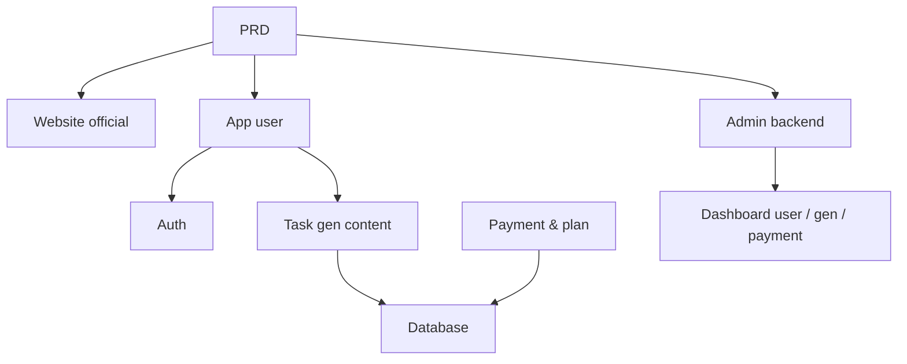

# Thực chiến: SaaS AI viết content marketing

## Tổng quan

Project thực chiến này yêu cầu bạn dựa trên 1 PRD thật, làm từ 0 một SaaS AI viết content marketing cho indie dev và content team. Bạn sẽ dùng Supabase làm backend service, Stripe làm payment system, hoàn thành đầy đủ từ phân tích nhu cầu tới deploy online.

Đây là phần thực chiến tổng hợp Stage 2. Ở các chương trước bạn đã học từng kỹ năng riêng — dựng page frontend, dev API backend, thao tác database, tích hợp payment. Project này yêu cầu bạn nối tất cả lại, deliver 1 prototype sản phẩm chạy được.

## Kiến thức tiền đề

Trước khi bắt đầu, bạn nên đã nắm:

- Design page frontend và dùng component library ([UI design](../../frontend/ui-design/), [component library hiện đại](../../frontend/modern-component-library/))
- Design và phát triển API backend ([viết code API](../../backend/ai-interface-code/))
- Nền tảng database và Supabase ([từ database tới Supabase](../../backend/database-supabase/))
- Tích hợp payment ([hệ thống thu phí Stripe](../../backend/stripe-payment/))
- Git workflow và deploy ([Git/GitHub](../../backend/git-workflow/), [deploy web app](../../backend/zeabur-deployment/))

## Mục tiêu học

Sau project bạn sẽ:

1. Đọc và hiểu 1 PRD thật, extract được task list
2. Dùng AI hỗ trợ gen từng bước page frontend và API backend
3. Dùng Supabase implement auth user, thao tác database
4. Tích hợp Stripe implement function subscribe trả phí
5. Dựng admin backend và hoàn thành end-to-end debug

## Giới thiệu project

Product bạn cần build là 1 SaaS AI viết content marketing, gồm 3 hệ con:

| Hệ con | Trách nhiệm |
|--------|------|
| **Website official (www)** | Giới thiệu product, pricing, FAQ, convert đăng ký |
| **App user (workbench)** | Nhập thông tin sản phẩm, gen content, xem history, upgrade plan |
| **Admin backend** | Quản lý user, record gen, data payment, overview vận hành |

Backend dùng Supabase cung cấp database và auth, dùng Stripe xử lý payment, dùng AI model gen content marketing.

::: tip PRD Entry
PRD project trên GitHub: [Xem PRD](https://github.com/MichaelDo0101/learning-ai/blob/main/docs/vi-vn/stage-2/assignments/copywriting-platform-supabase/PRD.md)
:::

<div style="margin: 32px 0;">
  <ClientOnly>
    <StepBar :active="0" :items="[
      { title: 'Phân tích nhu cầu', description: 'Đọc PRD, rõ page, function, auth, phạm vi payment' },
      { title: 'Dựng khung', description: 'AI gen 3 bộ khung frontend (www / app / admin)' },
      { title: 'Tích hợp backend', description: 'Supabase auth, gen API, Stripe payment' },
      { title: 'Debug & online', description: 'Chạy end-to-end, deploy, sẵn sàng demo' }
    ]" />
  </ClientOnly>
</div>

## Phần 1: Phân tích nhu cầu

### 1.1 Đọc PRD

Mở doc PRD, tập trung trả lời:

- Hệ thống có mấy entry? Mỗi entry cover những page nào?
- Function core của mỗi page là gì?
- Backend gồm module nào và bảng database nào?
- Pricing plan, luồng payment, free quota design thế nào?
- Phạm vi MVP là gì? V1 làm gì, không làm gì?

::: warning
Chưa rõ các câu trên thì đừng viết code. Hiểu nhu cầu không rõ là nguyên nhân phổ biến nhất dẫn tới rework.
:::

### 1.2 Xác nhận kiến trúc hệ thống

Dựa PRD vẽ ra kiến trúc tổng thể:



## Phần 2: Dựng khung project

### 2.1 Gen page frontend

Dùng AI gen trước structure cơ bản và mock data của tất cả page.

Prompt mẫu:

```text
Dựa PRD hiện tại, gen cho tôi khung frontend SaaS AI viết content marketing.

Yêu cầu:
1. Tách 3 entry: www, app, admin
2. Website gồm: trang chủ, pricing, FAQ
3. App gồm: login, đăng ký, workbench gen, history, page plan
4. Admin gồm: trang chủ backend, quản lý user, record gen, đơn payment
5. Đầu tiên chỉ gen structure page và mock data, chưa nối API thật
6. Style như SaaS hiện đại, không như demo lớp học
```

### 2.2 Hoàn thiện page core

Khung dựng xong, tập trung hoàn thiện page workbench gen content (Dashboard):

```text
Tiếp tục hoàn thiện page /dashboard.

Đây là 1 workbench AI viết content marketing.

Field form bên trái:
- Tên sản phẩm
- Mô tả 1 câu
- Đối tượng user
- 3 USP
- Kênh đăng (website, FB, Insta, TikTok, email)

Vùng kết quả bên phải có sẵn:
- Tiêu đề chính
- Phụ đề
- CTA
- 3 phiên bản content ngắn
- Content dài

Đầu tiên dùng mock data chạy tương tác.

Yêu cầu:
- Bấm "gen content" có loading state
- Vùng kết quả design empty state
- Layout responsive, màn rộng và hẹp đều hiện được
```

### 2.3 Verify structure page

Check từng item:

- [ ] Routing 3 entry có độc lập không
- [ ] Số page khớp PRD chưa
- [ ] Layout form và vùng kết quả của Dashboard hợp lý không
- [ ] Mock data hiện được trạng thái UI cơ bản

### Gặp khó khăn?

Nếu mắc ở stage dựng khung frontend, có thể review:

- [UI design](../../frontend/ui-design/)
- [Design page và button theo quy chuẩn UI](../../frontend/multi-product-ui/)
- [Dùng LLM và Skills làm UI đẹp lên](../../frontend/llm-skills-beautiful/)
- [Từ design prototype tới code project](../../frontend/design-to-code/)
- [Cập nhật giao diện bằng component library hiện đại](../../frontend/modern-component-library/)

## Phần 3: Tích hợp backend

### 3.1 Tích hợp login Supabase

```text
Coi tôi như 0 base, dẫn từng bước hoàn thành tích hợp login Supabase.

Cần giúp tôi:
1. Project tích hợp Supabase
2. Implement function đăng ký, login, logout
3. Sau login thành công redirect /dashboard
4. User chưa login truy cập /dashboard, /billing, /admin tự động redirect /login
5. Tạo bảng profiles
6. Sau khi user đăng ký thành công, tự động tạo record trong bảng profiles
7. Bảng profiles gồm field email, role, plan

Yêu cầu implement:
- Mỗi bước nói rõ đang sửa file nào
- Key đừng hardcode
- Chỗ nào cần thao tác tay trong Supabase backend thì đánh dấu rõ
- Sau khi hoàn thành mô tả cách verify đăng ký và login
```

### 3.2 Tích hợp API gen và database

```text
Coi tôi như 0 base, giúp tôi hoàn thành function core của website: gen content marketing và save.

Effect mục tiêu:
1. User ở /dashboard điền form, bấm "gen content"
2. Backend nhận: tên sản phẩm, mô tả, đối tượng user, USP, kênh đăng
3. Backend call model gen kết quả
4. Page hiện kết quả gen
5. Input và output đều save vào database
6. Lần sau user vào xem được history

Cần hoàn thành:
- Tạo API gen /api/generate
- Tạo bảng generations
- Design field input và output
- Page Dashboard đọc history của user hiện tại

UX:
- Loading state cho button
- Error message khi gen fail
- Empty state khi chưa có history

Sau khi hoàn thành mô tả:
- File path page frontend
- File path API backend
- Logic write database
- Cách test chuỗi gen hoàn chỉnh
```

### 3.3 Tích hợp Stripe payment

```text
Coi tôi như 0 base, giúp tôi thêm Stripe payment tối giản dùng được cho LaunchKit.

Không cần hệ thống phức tạp, chạy được luồng payment cơ bản trước.

Cần hoàn thành:
1. Page /billing hiện 2 plan free và pro
2. User bấm upgrade redirect Stripe Checkout
3. Sau payment thành công về website
4. Kết quả payment save vào bảng subscriptions
5. Đồng bộ update field profile.plan
6. User free giới hạn 3 lần gen/ngày, user pro không giới hạn

Nguyên tắc implement:
- Chạy main flow trước, chưa xét boundary phức tạp
- Chỗ nào cần config trong Stripe backend phải ghi rõ
- Sau khi hoàn thành mô tả cách test luồng payment hoàn chỉnh
```

### 3.4 Dựng admin backend

```text
Coi tôi như 0 base, giúp tôi làm 1 admin backend tối giản dùng được.

Chỉ admin truy cập được.

Cần hoàn thành:
1. Chỉ user role = admin truy cập được /admin
2. Backend gồm 3 tab: list user, record gen, trạng thái subscription
3. List user hiện: email, plan, ngày tạo
4. Record gen hiện: user, tên sản phẩm, kênh, ngày tạo
5. Trạng thái subscription hiện: user, plan, trạng thái payment

Yêu cầu:
- Giao diện tối giản rõ
- Dùng table, tab, badge của component library
- Sau khi hoàn thành mô tả cách set account thành admin
```

### Gặp khó khăn?

Nếu mắc ở stage phát triển backend, có thể review:

- [Từ database tới Supabase](../../backend/database-supabase/)
- [LLM hỗ trợ viết code API và doc API](../../backend/ai-interface-code/)
- [Cách tích hợp Stripe và các hệ thống thu phí](../../backend/stripe-payment/)

## Phần 4: Debug & online

### 4.1 Test end-to-end

Ít nhất verify các scenario:

- Đăng ký → login → gen content → xem history → upgrade plan
- Admin login → xem data user → xem record gen → xem trạng thái payment

Check trước deploy:

```text
Coi tôi như 0 base, giúp tôi check project có đủ điều kiện deploy chưa.

Trọng tâm check:
- Env var đầy đủ chưa
- Login callback URL đúng chưa
- Stripe payment callback URL đúng chưa
- Page có thiếu loading, empty state, error message không
- README có chứa start instruction và deploy instruction chưa

Cần bạn:
1. List item cần fix theo priority
2. Đánh dấu cái nào phải fix trước
3. Mô tả các bước deploy sau fix
```

### 4.2 Deploy

Deploy project lên môi trường internet. Tutorial tham khảo: [Git và GitHub workflow](../../backend/git-workflow/), [Cách deploy web app](../../backend/zeabur-deployment/).

## Sản phẩm bàn giao

Cuối project bạn cần submit:

- [ ] Link demo online truy cập được
- [ ] Link repo source code (kèm README)
- [ ] Doc PRD
- [ ] Screenshot page chính (trang chủ, Dashboard, Billing, Admin)
- [ ] Video demo 60s (cover đăng ký → gen → payment → admin)

README ít nhất gồm: giới thiệu project, mô tả page chính, tech stack, các bước start local, danh sách env var.

## Tiêu chuẩn chấm điểm

| Chiều | Cơ bản | Nâng cao |
|------|---------|---------|
| Hoàn thiện product | Trang chủ, login, Dashboard, Billing, Admin đều truy cập được | Content trang chủ và style giống SaaS thật |
| Vòng lặp business | Đăng ký → login → gen → xem history chạy được | Khác biệt permission free/Pro rõ ràng |
| Đúng data | Kết quả gen và trạng thái payment đều write DB | Có error message rõ, empty state và loading |
| Permission & security | Chưa login không truy cập page protected, user thường không vào Admin được | Có validation input cơ bản và auth server |
| Engineering deliver | Project start local được, deploy public được | README rõ, video demo đầy đủ structure |

::: tip
Nếu thấy task quá lớn, nhớ 1 nguyên tắc: **đảm bảo "chạy được" trước, rồi mới "làm đẹp".**
:::

## Check trước khi submit

<el-card shadow="hover" style="margin: 20px 0; border-radius: 12px;">
  <template #header>
    <div style="font-weight: bold; font-size: 16px;">Nhìn lại lần cuối trước submit</div>
  </template>

  <ul style="list-style-type: none; padding-left: 0;">
    <li><label><input type="checkbox" disabled /> Trang chủ, page login, Dashboard, Billing, Admin đều xong</label></li>
    <li><label><input type="checkbox" disabled /> User có thể đăng ký, login, logout</label></li>
    <li><label><input type="checkbox" disabled /> Kết quả gen thực sự write vào database</label></li>
    <li><label><input type="checkbox" disabled /> Main flow payment chạy được</label></li>
    <li><label><input type="checkbox" disabled /> Admin xem được user, record gen và trạng thái payment</label></li>
    <li><label><input type="checkbox" disabled /> Project đã deploy public</label></li>
  </ul>
</el-card>

## Tài liệu tham khảo

- [UI design](../../frontend/ui-design/)
- [Design page và button theo quy chuẩn UI](../../frontend/multi-product-ui/)
- [Dùng LLM và Skills làm UI đẹp lên](../../frontend/llm-skills-beautiful/)
- [Từ design prototype tới code project](../../frontend/design-to-code/)
- [Cập nhật giao diện bằng component library hiện đại](../../frontend/modern-component-library/)
- [Từ database tới Supabase](../../backend/database-supabase/)
- [LLM hỗ trợ viết code API và doc API](../../backend/ai-interface-code/)
- [Git và GitHub workflow](../../backend/git-workflow/)
- [Cách deploy web app](../../backend/zeabur-deployment/)
- [Cách tích hợp Stripe và các hệ thống thu phí](../../backend/stripe-payment/)
