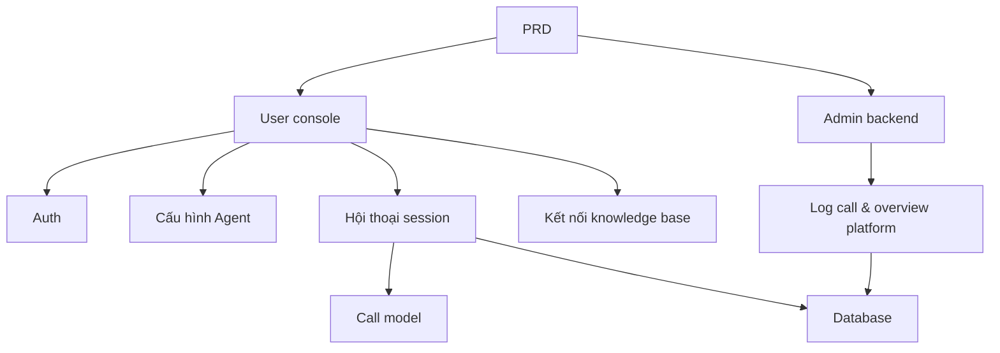

# Thực chiến: nền tảng Agent kiểu Dify

## Tổng quan

Project thực chiến này yêu cầu bạn dựa trên 1 PRD thật, làm từ 0 một nền tảng Agent mô phỏng trải nghiệm core của Dify. Bạn sẽ build user console, admin backend và platform backend, implement các function core như quản lý Agent, hội thoại, log và knowledge base.

Đây là phần thực chiến tổng hợp Stage 2. Khác project single-page hoặc single-function trước đó, project này yêu cầu bạn build 1 sản phẩm AI có "cảm giác platform" — gồm nhiều role, nhiều module, persistent data và chuỗi call model.

## Kiến thức tiền đề

Trước khi bắt đầu, bạn nên đã nắm:

- Design page frontend và dùng component library ([UI design](../../frontend/ui-design/), [component library hiện đại](../../frontend/modern-component-library/))
- Design và phát triển API backend ([viết code API](../../backend/ai-interface-code/))
- Nền tảng database và Supabase ([từ database tới Supabase](../../backend/database-supabase/))
- Git workflow và deploy ([Git/GitHub](../../backend/git-workflow/), [deploy web app](../../backend/zeabur-deployment/))

## Mục tiêu học

Sau project bạn sẽ:

1. Đọc và hiểu 1 PRD thật, extract được task list
2. Design kiến trúc page và data model cho nền tảng Agent
3. Implement chuỗi đầy đủ: tạo Agent, hội thoại, ghi log
4. Dùng AI hỗ trợ phát triển sản phẩm dạng platform
5. Hoàn thành end-to-end debug, deliver 1 prototype platform AI

## Giới thiệu project

Product bạn cần build là nền tảng Agent kiểu Dify, gồm 2 hệ con:

| Hệ con | Trách nhiệm |
|--------|------|
| **User console** | Tạo Agent, cấu hình Prompt, mở hội thoại, xem log, quản lý knowledge base |
| **Admin backend** | Xem data user, tình hình dùng resource platform, thống kê call |

Backend cần hỗ trợ các năng lực core: quản lý Agent, quản lý session, lưu message, call model, ghi log call, kết nối knowledge base.

::: tip PRD Entry
PRD project trên GitHub: [Xem PRD](https://github.com/datawhalechina/easy-vibe/blob/main/docs/vi-vn/stage-2/assignments/custom-dify-agent-platform/PRD.md)
:::

<div style="margin: 32px 0;">
  <ClientOnly>
    <StepBar :active="0" :items="[
      { title: 'Phân tích nhu cầu', description: 'Đọc PRD, rõ page, boundary năng lực, auth, data model' },
      { title: 'Dựng khung', description: 'AI gen khung user console và admin backend' },
      { title: 'Iterate dev', description: 'Bổ sung từng module: Agent, hội thoại, log, knowledge base' },
      { title: 'Debug & online', description: 'Chạy end-to-end, deploy, sẵn sàng demo' }
    ]" />
  </ClientOnly>
</div>

## Phần 1: Phân tích nhu cầu

### 1.1 Đọc PRD

Mở doc PRD, tập trung trả lời:

- Agent, session, log, knowledge base — cái nào vào MVP?
- Danh sách page và routing đã chốt chưa?
- Boundary call model và ghi log là gì?
- Multi-tenant và workflow phức tạp tạm chưa làm?

::: warning
Chưa rõ các câu trên thì đừng viết code. Hiểu nhu cầu không rõ là nguyên nhân phổ biến nhất dẫn tới rework.
:::

### 1.2 Xác nhận kiến trúc hệ thống

Dựa PRD vẽ ra kiến trúc tổng thể:



## Phần 2: Dựng khung project

### 2.1 Gen page frontend

Prompt mẫu:

```text
Dựa PRD hiện tại, gen cho tôi khung frontend nền tảng Agent kiểu Dify.

Yêu cầu:
1. User side gồm: login, danh sách Agent, cấu hình Agent, page hội thoại, page log, page knowledge base
2. Admin side gồm: trang chủ backend, overview user, overview dùng resource
3. Đầu tiên chỉ gen structure page và mock data, chưa nối API thật
4. Style như platform AI hiện đại
```

### 2.2 Verify structure page

Check từng item:

- [ ] Entry user console và admin backend có tách riêng không
- [ ] Page danh sách Agent, cấu hình, hội thoại, log, knowledge base có đầy đủ không
- [ ] Trang chủ admin, page overview user truy cập được
- [ ] Mock data hiện được trạng thái UI cơ bản

## Phần 3: Iterate dev

### 3.1 Đẩy từng module

Trên nền khung, đẩy từng module theo thứ tự:

1. **Auth**: đăng ký, login, phân role
2. **Quản lý Agent**: tạo, sửa, xoá, cấu hình Prompt
3. **Function hội thoại**: tạo session, gửi/nhận message, call model
4. **Ghi log**: thời gian, token usage, ghi lỗi
5. **Kết nối knowledge base** (bonus): upload doc, retrieval, inject kết quả
6. **Admin backend**: data user, dùng resource, thống kê call

Mỗi module xong, dùng bảng dưới self-check:

| Check | Cách verify |
|--------|----------|
| Nhất quán page | Số page, function khớp PRD |
| Vòng lặp API | API agents, chat, logs, knowledge có đầy đủ không |
| Phân quyền | User có chỉ quản lý được agent và session của mình không |
| Nhất quán data | Data messages, logs, documents có khớp không |
| Demo được | Có demo được chuỗi "tạo agent → hội thoại → xem log" hoàn chỉnh không |

### 3.2 Kết nối knowledge base (bonus)

Nếu muốn thêm năng lực knowledge base, có thể cho mỗi Agent 1 "công tắc knowledge base":

- Bật: retrieve fragment kiến thức trước, rồi cùng câu hỏi user gửi tới model
- Tắt: trả lời theo mode hội thoại bình thường

V1 chưa cần RAG phức tạp, chỉ cần "thấy được kết quả retrieve, giải thích được chuỗi call" là đủ.

## Phần 4: Debug & online

### 4.1 Test end-to-end

Ít nhất verify các scenario:

- Đăng ký → tạo Agent → cấu hình Prompt → mở hội thoại → xem log
- Admin login → xem data user → xem thống kê call

Check trước khi deploy:

- [ ] Tất cả API core đã có verify login
- [ ] Permission check ownership Agent đã pass
- [ ] Record session, record log thực sự lưu DB
- [ ] Model Key dùng env var, không hardcode
- [ ] Error message thấy được ở frontend, không chỉ ở console

### 4.2 Deploy

Deploy project lên môi trường internet. Tutorial tham khảo: [Git và GitHub workflow](../../backend/git-workflow/), [Cách deploy web app](../../backend/zeabur-deployment/).

## Sản phẩm bàn giao

Cuối project bạn cần submit:

- [ ] Link demo online truy cập được
- [ ] Link repo source code (kèm README)
- [ ] Doc PRD
- [ ] Screenshot page chính (quản lý Agent, hội thoại, log, trang chủ admin)
- [ ] Video demo 60s (cover tạo Agent → hội thoại → xem log)

README ít nhất gồm: giới thiệu project, mô tả kiến trúc, tech stack, các bước start local, danh sách env var, mô tả API.

## Tiêu chuẩn chấm điểm

| Chiều | Cơ bản | Nâng cao |
|------|---------|---------|
| Hoàn thiện platform | 3 page agents / chat / logs dùng được | Có nav rõ và design language thống nhất |
| Vòng lặp business | Tạo được Agent và hội thoại thật | Hỗ trợ chuyển nhiều Agent và session lịch sử |
| Data & tracking | Message và log call query được | Có dashboard thống kê token / thời gian |
| Permission & security | Chỉ user login mới truy cập API core | Check ownership resource đầy đủ |
| Engineering deliver | Deploy được, demo được, README rõ | Kết nối knowledge base và giải thích được kết quả retrieve |

## Check trước khi submit

<el-card shadow="hover" style="margin: 20px 0; border-radius: 12px;">
  <template #header>
    <div style="font-weight: bold; font-size: 16px;">Nhìn lại lần cuối trước submit</div>
  </template>

  <ul style="list-style-type: none; padding-left: 0;">
    <li><label><input type="checkbox" disabled /> Sau login truy cập được page quản lý Agent, hội thoại, log</label></li>
    <li><label><input type="checkbox" disabled /> Tạo được ít nhất 1 Agent và hội thoại thành công</label></li>
    <li><label><input type="checkbox" disabled /> Mỗi lượt hỏi đáp đều query được record trong database</label></li>
    <li><label><input type="checkbox" disabled /> Khi call fail, error message thấy được ở frontend và log đã ghi</label></li>
    <li><label><input type="checkbox" disabled /> Project đã deploy, README và video demo đầy đủ</label></li>
  </ul>
</el-card>

## Tài liệu tham khảo

- [UI design](../../frontend/ui-design/)
- [Cập nhật giao diện bằng component library hiện đại](../../frontend/modern-component-library/)
- [Từ database tới Supabase](../../backend/database-supabase/)
- [LLM hỗ trợ viết code API và doc API](../../backend/ai-interface-code/)
- [Git và GitHub workflow](../../backend/git-workflow/)
- [Cách deploy web app](../../backend/zeabur-deployment/)
