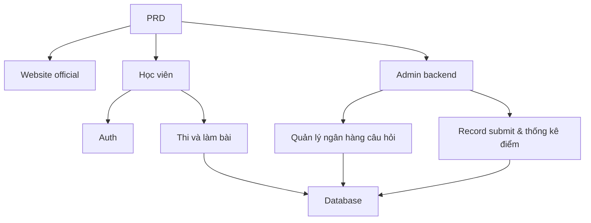

# Thực chiến: hệ thống thi cử và quản lý online

## Tổng quan

Project thực chiến này yêu cầu bạn dựa trên 1 PRD thật, làm từ 0 một hệ thống thi cử và quản lý online. Đặc biệt của project: gồm nhiều role (học viên và admin), mỗi role xem page và thao tác khác nhau. Bạn sẽ dùng Express xây backend, implement chuỗi business thi cử đầy đủ.

Đây là phần thực chiến tổng hợp Stage 2. Hệ thống multi-role permission rất phổ biến trong thực tế — sau khi nắm pattern này, bạn có thể đối mặt với các business scenario như edtech, SaaS, admin backend...

## Kiến thức tiền đề

Trước khi bắt đầu, bạn nên đã nắm:

- Design page frontend và dùng component library ([UI design](../../frontend/ui-design/), [component library hiện đại](../../frontend/modern-component-library/))
- Design và phát triển API backend ([viết code API](../../backend/ai-interface-code/))
- Nền tảng database và Supabase ([từ database tới Supabase](../../backend/database-supabase/))
- Git workflow và deploy ([Git/GitHub](../../backend/git-workflow/), [deploy web app](../../backend/zeabur-deployment/))

## Mục tiêu học

Sau project bạn sẽ:

1. Đọc và hiểu 1 PRD thật, extract được task list
2. Design permission control và routing page cho hệ thống multi-role
3. Dùng Express implement API backend đầy đủ
4. Implement chuỗi business: thi cử, submit, tự động chấm điểm
5. Hoàn thành end-to-end debug, deliver 1 prototype hệ thống business

## Giới thiệu project

Product bạn cần build là hệ thống thi cử và quản lý online, gồm 3 hệ con:

| Hệ con | Trách nhiệm |
|--------|------|
| **Website official** | Giới thiệu platform, entry login |
| **Học viên** | List bài thi, làm bài, submit, xem điểm |
| **Admin backend** | Quản lý ngân hàng câu hỏi, quản lý kỳ thi, record submit, thống kê điểm |

Backend dùng Express, cần hỗ trợ: login auth, role permission, quản lý kỳ thi và ngân hàng câu hỏi, luồng submit và auto chấm, quản lý điểm và thống kê.

::: tip PRD Entry
PRD project trên GitHub: [Xem PRD](https://github.com/datawhalechina/easy-vibe/blob/main/docs/vi-vn/stage-2/assignments/exam-management-express/PRD.md)
:::

<div style="margin: 32px 0;">
  <ClientOnly>
    <StepBar :active="0" :items="[
      { title: 'Phân tích nhu cầu', description: 'Đọc PRD, rõ role, page, chuỗi thi và data model' },
      { title: 'Dựng khung', description: 'AI gen khung page học viên và admin' },
      { title: 'Phát triển backend', description: 'Express thông login, kỳ thi, submit, chấm điểm' },
      { title: 'Debug & online', description: 'Chạy end-to-end, deploy, sẵn sàng demo' }
    ]" />
  </ClientOnly>
</div>

## Phần 1: Phân tích nhu cầu

### 1.1 Đọc PRD

Mở doc PRD, tập trung trả lời:

- Hệ thống gồm những role nào? Mỗi role làm được gì?
- Danh sách page có đầy đủ chưa? Học viên và admin có những page nào?
- Hỗ trợ những loại câu hỏi nào? Logic chấm điểm của từng loại?
- Luồng đầy đủ của 1 kỳ thi? (publish → bắt đầu → làm bài → submit → chấm → xem điểm)

::: warning
Chưa rõ các câu trên thì đừng viết code. Hiểu nhu cầu không rõ là nguyên nhân phổ biến nhất dẫn tới rework.
:::

### 1.2 Xác nhận kiến trúc hệ thống

Dựa PRD vẽ ra kiến trúc tổng thể:



## Phần 2: Dựng khung project

### 2.1 Gen page frontend

Prompt mẫu:

```text
Dựa PRD hiện tại, gen cho tôi khung frontend hệ thống thi cử và quản lý online.

Yêu cầu tech stack:
- Next.js App Router
- TypeScript
- Tailwind CSS
- shadcn/ui

Danh sách page:
1. Trang chủ /
2. Page login /login
3. Page list bài thi của học viên /student/exams
4. Page làm bài của học viên /student/exams/[id]
5. Page điểm của học viên /student/history
6. Trang chủ admin /admin
7. Page quản lý kỳ thi /admin/exams
8. Page quản lý ngân hàng câu hỏi /admin/questions
9. Page record submit /admin/submissions

Yêu cầu:
- Page học viên nhấn vào sự rõ, tập trung, dễ làm bài
- Page admin dùng layout sidebar + topbar
- Đầu tiên dùng mock data, chưa nối API thật
- Lưu ý usability cơ bản trên desktop và mobile
```

### 2.2 Hoàn thiện page làm bài học viên

Page làm bài là page core của học viên, tập trung hoàn thiện:

```text
Tiếp tục hoàn thiện page làm bài học viên.

Đây là page làm bài thi online, gồm:
- Trên cùng hiện title bài thi, countdown, số câu đã làm
- Giữa hiện nội dung câu hỏi và options
- Hỗ trợ 3 loại: trắc nghiệm, đúng/sai, tự luận ngắn
- Trái hoặc trên có "answer card" hiện trạng thái từng câu đã làm chưa
- Trước khi submit có dialog confirm

Đầu tiên dùng mock data implement tương tác, chưa nối API thật.

Yêu cầu:
- Giao diện tối giản, không giống page table admin
- Countdown phải nổi bật nhưng không tạo áp lực quá mạnh
- Có empty state và loading state
```

### 2.3 Hoàn thiện admin backend

Admin backend v1 tập trung 3 vùng core:

- **Quản lý kỳ thi**: tạo kỳ thi, set thời gian, publish status
- **Quản lý ngân hàng câu hỏi**: thêm câu hỏi, sửa câu hỏi, filter theo loại
- **Record submit**: xem submit học viên, điểm, thời gian

### 2.4 Verify structure page

Check từng item:

- [ ] Entry học viên và admin có tách riêng không
- [ ] Page login, list bài thi, làm bài, điểm có đầy đủ không
- [ ] Admin: page ngân hàng câu hỏi, quản lý kỳ thi, record submit truy cập được
- [ ] Style page học viên và admin có phân biệt rõ không

### Gặp khó khăn?

Nếu mắc ở stage dựng khung frontend, có thể review:

- [Từ database tới Supabase](../../backend/database-supabase/)
- [Design và phát triển API backend](../../backend/ai-interface-code/)
- [Cập nhật giao diện bằng component library hiện đại](../../frontend/modern-component-library/)

## Phần 3: Phát triển backend

### 3.1 Login và permission control

```text
Coi tôi như 0 base, giúp tôi hoàn thành login và permission control cho hệ thống thi cử online.

Backend dùng Express.

Mục tiêu:
1. Học viên và admin đều login được
2. Sau login trả về role user
3. Học viên chỉ truy cập được API /student/*
4. Admin chỉ truy cập được API /admin/*
5. User chưa login truy cập page protected thì redirect /login

Yêu cầu implement:
- Đề xuất structure thư mục rõ
- Nói rõ middleware làm gì
- Chỗ nào dùng env var thì đừng hardcode
- Sau khi hoàn thành, mô tả cách verify permission có active không
```

### 3.2 API quản lý kỳ thi và ngân hàng câu hỏi

Khuyến nghị implement theo module:

| Module | API gợi ý |
|------|----------|
| Quản lý kỳ thi | `GET /api/exams`, `POST /api/admin/exams`, `PATCH /api/admin/exams/:id` |
| Quản lý ngân hàng câu hỏi | `GET /api/admin/questions`, `POST /api/admin/questions` |
| Bắt đầu thi | `POST /api/submissions/start` |
| Submit bài | `POST /api/submissions/:id/submit` |
| Record điểm | `GET /api/student/history`, `GET /api/admin/submissions` |

Prompt mẫu:

```text
Giúp tôi design và implement Express API cho hệ thống thi cử online.

Phạm vi function:
- Admin tạo kỳ thi
- Admin maintain ngân hàng câu hỏi
- Học viên xem kỳ thi đã publish
- Học viên bắt đầu thi và tạo submission
- Sau khi học viên submit, auto chấm trắc nghiệm và đúng/sai
- Câu tự luận đánh dấu pending review
- Học viên xem điểm lịch sử của mình
- Admin xem tất cả record submit

Yêu cầu:
- API naming rõ
- Return JSON structure thống nhất
- Code phân tầng controller, service, middleware, db
- Mô tả cách test mỗi API
```

### 3.3 Logic chấm điểm

Logic chấm điểm là rule business core của hệ thống thi:

- **Trắc nghiệm**: đáp án user khớp đáp án chuẩn → được điểm
- **Đúng/sai**: cũng auto chấm được
- **Tự luận**: v1 chỉ save đáp án, điểm để trống, status `reviewed = false`

::: tip Bonus
Muốn thêm năng lực AI: cho admin nhập "chủ đề + độ khó" ở backend, model gen 1 batch câu hỏi candidate, sau review tay rồi nhập kho. Đây là bonus, không bắt buộc.
:::

## Phần 4: Debug & online

### 4.1 Test end-to-end

Ít nhất verify các scenario:

- Học viên login → xem list bài thi → bắt đầu làm → submit → xem điểm
- Admin login → tạo kỳ thi → thêm câu hỏi → publish → xem record submit

### 4.2 Deploy

- Frontend deploy lên Vercel / Zeabur
- Express API deploy lên Zeabur / Railway / Render
- Database dùng Supabase Postgres hoặc managed PostgreSQL

Check trước deploy:

- [ ] Env var đầy đủ chưa
- [ ] URL API frontend-backend đúng chưa
- [ ] Login state ở production bình thường không
- [ ] Account admin truy cập được backend thật không
- [ ] README có chứa start, deploy, test instruction chưa

## Sản phẩm bàn giao

Cuối project bạn cần submit:

- [ ] Link demo online truy cập được
- [ ] Link repo source code (kèm README)
- [ ] Doc PRD
- [ ] Screenshot page chính (trang chủ, list bài thi học viên, page làm bài, admin)
- [ ] Video demo 60s (cover luồng làm bài học viên và luồng quản lý admin)

README ít nhất gồm: giới thiệu project, mô tả page chính, tech stack, các bước start local, danh sách env var.

## Tiêu chuẩn chấm điểm

| Chiều | Cơ bản | Nâng cao |
|------|---------|---------|
| Hoàn thiện page | Page chính của học viên và admin truy cập được | Style page thống nhất, mobile cơ bản dùng được |
| Vòng lặp business | Học viên login, dự thi, submit và xem điểm được | Admin có thể tạo và publish kỳ thi đầy đủ |
| Đúng data | Sau submit lưu được vào DB, câu khách quan auto chấm được | Câu tự luận hỗ trợ review tay hoặc AI hỗ trợ |
| Permission control | Boundary truy cập học viên và admin rõ | API server cũng có check role |
| Engineering deliver | Project chạy được, deploy được, README rõ | Có video demo và test instruction |

## Check trước khi submit

<el-card shadow="hover" style="margin: 20px 0; border-radius: 12px;">
  <template #header>
    <div style="font-weight: bold; font-size: 16px;">Nhìn lại lần cuối trước submit</div>
  </template>

  <ul style="list-style-type: none; padding-left: 0;">
    <li><label><input type="checkbox" disabled /> Trang chủ, page login, page học viên, page admin đều xong</label></li>
    <li><label><input type="checkbox" disabled /> Học viên có thể bắt đầu thi và submit đáp án bình thường</label></li>
    <li><label><input type="checkbox" disabled /> Admin có thể tạo kỳ thi và xem record submit</label></li>
    <li><label><input type="checkbox" disabled /> Điểm câu khách quan tự động tính và lưu DB được</label></li>
    <li><label><input type="checkbox" disabled /> Boundary permission học viên và admin đã verify</label></li>
    <li><label><input type="checkbox" disabled /> Project đã deploy hoặc có instruction chạy local đầy đủ</label></li>
  </ul>
</el-card>

## Tài liệu tham khảo

- [UI design](../../frontend/ui-design/)
- [Cập nhật giao diện bằng component library hiện đại](../../frontend/modern-component-library/)
- [Từ database tới Supabase](../../backend/database-supabase/)
- [LLM hỗ trợ viết code API và doc API](../../backend/ai-interface-code/)
- [Git và GitHub workflow](../../backend/git-workflow/)
- [Cách deploy web app](../../backend/zeabur-deployment/)
