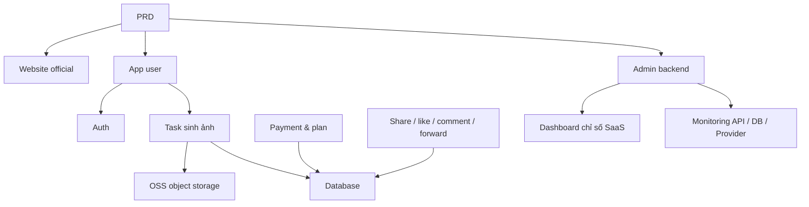

# Thực chiến: SaaS sinh ảnh AI hiện đại

## Tổng quan

Project thực chiến này yêu cầu bạn dựa trên 1 PRD thật (Product Requirements Document), làm từ 0 một sản phẩm SaaS sinh ảnh AI tham khảo trải nghiệm Midjourney. Bạn sẽ đi đầy đủ qua phân tích nhu cầu, bóc tách project, iterate dev, debug & online.

Đây là phần thực chiến tổng hợp Stage 2. Ở các chương trước bạn đã học từng kỹ năng riêng — design page frontend, dev API backend, thao tác database, tích hợp payment. Project này yêu cầu bạn nối tất cả lại, deliver 1 prototype sản phẩm chạy được.

## Kiến thức tiền đề

Trước khi bắt đầu, bạn nên đã nắm:

- Design page frontend và dùng component library ([UI design](../../frontend/ui-design/), [component library hiện đại](../../frontend/modern-component-library/))
- Design và phát triển API backend ([viết code API](../../backend/ai-interface-code/))
- Nền tảng database và Supabase ([từ database tới Supabase](../../backend/database-supabase/))
- Tích hợp payment ([hệ thống thu phí Stripe](../../backend/stripe-payment/))
- Git workflow và deploy ([Git/GitHub](../../backend/git-workflow/), [deploy web app](../../backend/zeabur-deployment/))

## Mục tiêu học

Sau project bạn sẽ:

1. Đọc và hiểu 1 PRD thật, extract được task list
2. Bóc tách module dựa PRD, lên kế hoạch đẩy từng bước
3. Dùng AI hỗ trợ dựng khung frontend và viết API backend
4. Verify và iterate optimize từng module
5. Hoàn thành end-to-end debug, đẩy project từ "chạy được" lên "giao được"

## Giới thiệu project

Product bạn cần build là 1 nền tảng SaaS sinh ảnh AI hiện đại, gồm 3 hệ con:

| Hệ con | Trách nhiệm |
|--------|------|
| **Website official (www)** | Giới thiệu product, pricing, FAQ, convert đăng ký |
| **App user (workbench)** | Nhập Prompt, sinh ảnh, gallery, credit, plan, tương tác community |
| **Admin backend** | Quản lý user, quản lý task, quản lý payment, kiểm duyệt content, chỉ số SaaS, monitoring hệ thống |

Backend cần hỗ trợ các năng lực core: auth user, task sinh ảnh, OSS object storage, credit & plan payment, social tương tác ảnh, monitoring data vận hành.

::: tip PRD Entry
PRD project trên GitHub: [Xem PRD](https://github.com/aiecosvietnam/learning-ai/blob/main/docs/vi-vn/stage-2/assignments/modern-landing-page/PRD.md)
:::

<div style="margin: 32px 0;">
  <ClientOnly>
    <StepBar :active="0" :items="[
      { title: 'Phân tích nhu cầu', description: 'Đọc PRD, extract page, module, data model và boundary' },
      { title: 'Dựng khung', description: 'AI gen 3 bộ khung frontend (www / app / admin)' },
      { title: 'Iterate dev', description: 'Bổ sung từng module API, permission, payment, monitoring' },
      { title: 'Debug & online', description: 'Chạy end-to-end, deploy, sẵn sàng demo' }
    ]" />
  </ClientOnly>
</div>

## Phần 1: Phân tích nhu cầu

### 1.1 Đọc PRD

Mở doc PRD, tập trung trả lời:

- Hệ thống có mấy entry? Mỗi entry cover những page nào?
- Function core của mỗi page là gì?
- Backend gồm module nào và bảng database nào?
- Phạm vi MVP là gì? V1 làm gì, không làm gì?

::: warning
Chưa rõ các câu trên thì đừng viết code. Hiểu nhu cầu không rõ là nguyên nhân phổ biến nhất dẫn tới rework.
:::

### 1.2 Xác nhận kiến trúc hệ thống

Dựa mô tả trong PRD, vẽ ra kiến trúc tổng thể:



Khuyến nghị bạn tự vẽ lại kiến trúc bằng lời mình, confirm hiểu hệ thống đầy đủ.

## Phần 2: Dựng khung project

### 2.1 Gen page frontend

Dùng AI gen trước structure cơ bản của tất cả page và mock data. Mục tiêu bước này là dựng kiến trúc thông tin và routing, không cần nối API thật.

Prompt mẫu:

```text
Dựa PRD hiện tại, gen cho tôi khung frontend SaaS sinh ảnh AI hiện đại.

Yêu cầu:
1. Tách 3 entry: www, app, admin
2. Website gồm: trang chủ, pricing, FAQ
3. App gồm: login, đăng ký, workbench sinh ảnh, gallery, plan, credit, community, chi tiết tác phẩm, cá nhân
4. Admin gồm: trang chủ backend, quản lý user, quản lý task, quản lý content, quản lý plan, đơn payment, cấu hình vận hành, chỉ số SaaS, monitoring
5. Đầu tiên chỉ gen structure page và mock data, chưa nối API thật
6. Style tham khảo Midjourney: tối giản, hiện đại, có cảm giác product
```

### 2.2 Verify structure page

Sau khi khung gen xong, check từng item:

- [ ] Routing của 3 entry độc lập (`/`, `/app`, `/admin`)
- [ ] Số lượng page khớp PRD
- [ ] Mỗi page truy cập và điều hướng bình thường
- [ ] Mock data hiện được trạng thái UI cơ bản (list, empty state, form...)

## Phần 3: Iterate dev

### 3.1 Đẩy từng module

Trên nền khung, đẩy từng module theo thứ tự:

1. **Auth**: đăng ký, login, phân role
2. **Database**: tạo bảng, API đọc/ghi
3. **Business core**: task sinh ảnh, lưu kết quả
4. **OSS storage**: upload và truy cập ảnh
5. **Payment**: plan, credit, tích hợp Stripe
6. **Social tương tác**: share, like, comment
7. **Admin**: quản lý user, quản lý task, kiểm duyệt content
8. **Monitoring data**: dashboard chỉ số SaaS, monitoring hệ thống

Mỗi module xong, dùng bảng dưới self-check:

| Check | Cách verify |
|--------|----------|
| Nhất quán page | Số page, entry, function khớp PRD |
| Đúng API | Param request, structure return, xử lý state hợp lý |
| Phân quyền | User thường và admin có cách ly không |
| Nhất quán data | Database, OSS, payment, credit có khớp không |
| Demo được | Có demo được 1 chuỗi business hoàn chỉnh cho người khác không |

::: tip
Nếu thấy AI gen lệch PRD, đừng xoá nguyên page làm lại — chỉ cần để nó sửa module cụ thể.
:::

### 3.2 Vai trò và phân công

Trong quá trình iterate, bạn cần đóng 3 vai trò:

- **PM**: confirm function mỗi module khớp PRD
- **Tech lead**: confirm phương án implement hợp lý
- **Test engineer**: confirm function chạy được

## Phần 4: Debug & online

### 4.1 Test end-to-end

Trọng tâm giai đoạn cuối không phải thêm page mới, mà là chạy đầy đủ chuỗi business. Ít nhất verify các scenario:

- Đăng ký → mua credit → sinh ảnh → xem history → share tương tác
- Admin login → xem data user → xem thống kê task → xem monitoring hệ thống

### 4.2 Deploy

Deploy project lên môi trường internet, đảm bảo:

- Cấu hình env var đầy đủ
- Login callback URL đúng
- Payment callback URL đúng
- Page không thiếu loading, empty state, error message

Tutorial deploy tham khảo: [Git và GitHub workflow](../../backend/git-workflow/), [Cách deploy web app](../../backend/zeabur-deployment/).

## Sản phẩm bàn giao

Cuối project bạn cần submit:

- [ ] Link demo online truy cập được
- [ ] Link repo source code (kèm README)
- [ ] Doc PRD
- [ ] Screenshot page chính (trang chủ official, workbench sinh ảnh, gallery, page plan, trang chủ admin)
- [ ] Video demo 60s (cover đăng ký → sinh → xem → admin)

README ít nhất gồm: giới thiệu project, mô tả page chính, tech stack, các bước start local, danh sách env var.

## Tiêu chuẩn chấm điểm

| Chiều | Cơ bản | Nâng cao |
|------|---------|---------|
| Bám PRD | Page, function, data structure cơ bản khớp PRD | Giải thích rõ mỗi design decision liên hệ thế nào với PRD |
| Vòng lặp product | Đăng ký → mua credit → sinh ảnh → xem history → share chạy được | Trạng thái payment, số dư credit, số lần sinh data nhất quán |
| Năng lực backend | Quản lý user, task, payment, content xem được | Dashboard chỉ số SaaS và page monitoring đầy đủ |
| Engineering | Chuỗi frontend, backend, database, OSS, payment đã thông | Có xử lý lỗi, empty state, loading state |
| Chất lượng deliver | Deploy được, chạy được | README rõ, video demo đầy đủ structure |

## Tài liệu tham khảo

- [UI design](../../frontend/ui-design/)
- [Design page và button theo quy chuẩn UI](../../frontend/multi-product-ui/)
- [Dùng LLM và Skills làm UI đẹp lên](../../frontend/llm-skills-beautiful/)
- [Từ design prototype tới code project](../../frontend/design-to-code/)
- [Cập nhật giao diện bằng component library hiện đại](../../frontend/modern-component-library/)
- [Từ database tới Supabase](../../backend/database-supabase/)
- [LLM hỗ trợ viết code API và doc API](../../backend/ai-interface-code/)
- [Git và GitHub workflow](../../backend/git-workflow/)
- [Cách deploy web app](../../backend/zeabur-deployment/)
- [Cách tích hợp Stripe và các hệ thống thu phí](../../backend/stripe-payment/)
