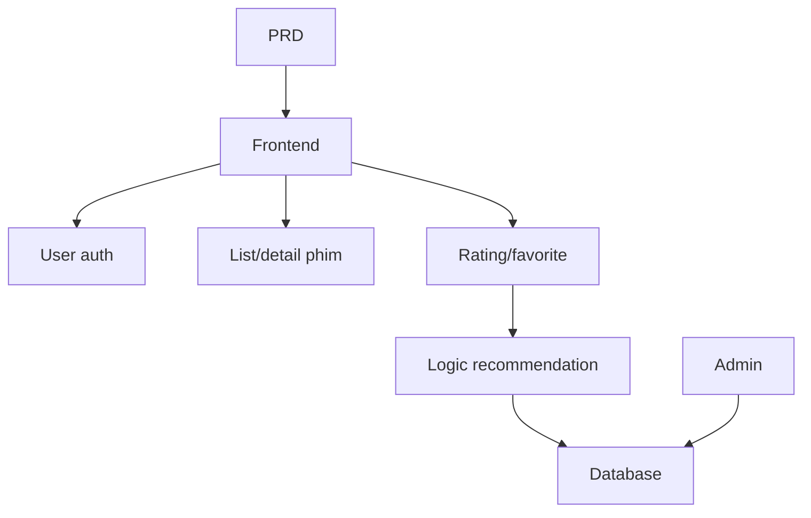

# Thực chiến: hệ thống gợi ý phim Spring Boot

## Tổng quan

Project thực chiến này yêu cầu bạn dựa trên 1 PRD thật, dùng Spring Boot hoàn thành 1 website phim có năng lực gợi ý. Thử thách core: không phải CRUD đơn thuần, mà cần nghĩ "hành vi user ảnh hưởng kết quả gợi ý thế nào" và "gợi ý phải giải thích được".

Đây là phần thực chiến tổng hợp Stage 2. Lần đầu bạn tiếp xúc mô hình dev "content + behavior + recommendation" — phổ biến trong TMĐT, content platform, personalized feed.

## Kiến thức tiền đề

- Design page frontend và component library ([UI design](../../frontend/ui-design/), [component library hiện đại](../../frontend/modern-component-library/))
- Design và dev API backend ([viết code API](../../backend/ai-interface-code/))
- Database cơ bản và Supabase ([từ database tới Supabase](../../backend/database-supabase/))
- Git workflow và deploy ([Git và GitHub](../../backend/git-workflow/), [deploy app Web](../../backend/zeabur-deployment/))

## Mục tiêu học

1. Đọc PRD và extract task dev cho hệ recommendation
2. Dùng Spring Boot dựng backend và implement RESTful API
3. Design chuỗi data "user behavior → recommendation"
4. Implement logic gợi ý giải thích được
5. End-to-end debug, deliver product prototype demo được

## Giới thiệu project

| Tính năng | Mô tả |
|------|------|
| **Duyệt & search** | User duyệt và search phim |
| **Rating & favorite** | User chấm điểm, thêm favorite |
| **Recommendation cá nhân** | Hệ thống gợi ý theo behavior user |
| **Admin backend** | Admin maintain data phim, xem hiệu quả gợi ý |

::: tip Entry PRD
PRD trên GitHub: [Xem PRD](https://github.com/MichaelDo0101/learning-ai/blob/main/docs/vi-vn/stage-2/assignments/movie-recommendation-springboot/PRD.md)
:::

<div style="margin: 32px 0;">
  <ClientOnly>
    <StepBar :active="0" :items="[
      { title: 'Phân tích nhu cầu', description: 'Đọc PRD, rõ chiến lược recommendation' },
      { title: 'Dựng khung', description: 'AI gen list, detail, recommendation, admin page' },
      { title: 'Iterate dev', description: 'Bổ sung logic, ghi behavior, admin' },
      { title: 'Debug online', description: 'Chạy end-to-end, deploy, demo' }
    ]" />
  </ClientOnly>
</div>

## Phần 1: Phân tích nhu cầu

### 1.1 Đọc PRD

Mở PRD, trọng tâm:

- Chiến lược recommendation là gì? V1 có dùng version giải thích được không (dựa rating similarity)?
- Data behavior user lưu gì? (rating, favorite, browse history)
- Admin cần chỉ số gì?
- Page list đầy đủ chưa?

::: warning
Chưa rõ các câu trên, đừng viết code. Hiểu nhu cầu không rõ là nguyên nhân rework phổ biến nhất.
:::

### 1.2 Xác nhận kiến trúc



## Phần 2: Dựng khung project

### 2.1 Gen frontend

```text
Dựa PRD, gen khung frontend hệ recommendation phim Spring Boot.
Yêu cầu: gồm home, list, detail, recommendation, profile, admin.
Gen cấu trúc + fake data trước, chưa nối API thật.
Style giống content product thật.
```

### 2.2 Verify

- [ ] List phim có search/filter
- [ ] Detail có button rating/favorite
- [ ] Recommendation hiển thị kèm lý do
- [ ] Admin hiển thị data và hiệu quả

## Phần 3: Iterate dev

1. **Dựng Spring Boot**: structure, config database, CRUD
2. **Quản data phim**: list, detail, search API
3. **User behavior**: rating, favorite API
4. **Logic recommendation**: thuật toán dựa behavior
5. **Hiển thị recommendation**: kèm lý do
6. **Admin**: maintain data, xem hiệu quả

| Check | Verify |
|--------|----------|
| Function cơ bản | List, detail, rating, favorite closed loop |
| Liên động recommend | Behavior ảnh hưởng kết quả |
| Giải thích được | User hiểu lý do recommend |
| Data backend | Admin xem data và hiệu quả |

## Phần 4: Debug và online

Verify end-to-end: duyệt → rating → favorite → xem recommendation, kết quả đổi; admin add phim → xem thống kê.

## Sản phẩm bàn giao

- [ ] Link demo online
- [ ] Repo (có README)
- [ ] PRD doc
- [ ] Screenshot page core
- [ ] Video demo 60s

## Tiêu chuẩn chấm điểm

| Chiều | Cơ bản | Nâng cao |
|------|---------|---------|
| Bám PRD | Page, function, data khớp PRD | Giải thích quyết định design |
| Closed loop | Duyệt→rating→favorite→recommend chạy thông | Behavior ảnh hưởng rõ |
| Chất lượng recommend | Hợp lý, giải thích được | Nhiều chiến lược |
| Backend | Data và hiệu quả xem được | Có chỉ số độ chính xác |
| Engineering | Frontend, backend, database thông | Cache hoặc tối ưu performance |

## Tài liệu tham khảo

- [UI design](../../frontend/ui-design/)
- [Component library hiện đại](../../frontend/modern-component-library/)
- [Từ database tới Supabase](../../backend/database-supabase/)
- [Viết code API](../../backend/ai-interface-code/)
- [Git và GitHub](../../backend/git-workflow/)
- [Deploy app Web](../../backend/zeabur-deployment/)
