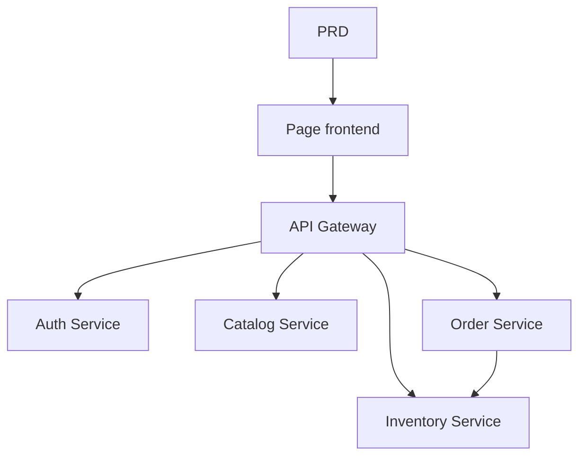

# Thực chiến: hệ thống microservices e-commerce thực phẩm

## Tổng quan

Project thực chiến này yêu cầu bạn dựa trên 1 PRD thật, làm từ 0 một hệ thống microservices e-commerce thực phẩm tươi sống. Khác project single-service trước đó, backend ở đây được tách thành nhiều service độc lập theo business, kết nối ra ngoài thống nhất qua API Gateway. Bạn sẽ học cách design service boundary, cách xử lý vấn đề nhất quán data giữa các service.

Đây là phần thực chiến tổng hợp Stage 2. Kiến trúc microservices rất phổ biến trong thực tế — sau khi nắm tư duy tách service và routing qua gateway, bạn có thể đối mặt với design hệ thống backend phức tạp hơn.

## Kiến thức tiền đề

Trước khi bắt đầu, bạn nên đã nắm:

- Design page frontend và dùng component library ([UI design](../../frontend/ui-design/), [component library hiện đại](../../frontend/modern-component-library/))
- Design và phát triển API backend ([viết code API](../../backend/ai-interface-code/))
- Nền tảng database và Supabase ([từ database tới Supabase](../../backend/database-supabase/))
- Git workflow và deploy ([Git/GitHub](../../backend/git-workflow/), [deploy web app](../../backend/zeabur-deployment/))

## Mục tiêu học

Sau project bạn sẽ:

1. Đọc PRD và extract task list cho hệ thống microservices
2. Tách service boundary theo business domain (auth, sản phẩm, kho, đơn hàng)
3. Design và implement routing API Gateway
4. Xử lý vấn đề trừ kho và nhất quán đơn hàng giữa các service
5. Hoàn thành end-to-end debug, deliver được prototype microservices

## Giới thiệu project

Product bạn cần build là hệ thống microservices e-commerce thực phẩm tươi sống:

| Hệ con | Trách nhiệm |
|--------|------|
| **Client app** | Xem sản phẩm, đặt đơn, xem đơn hàng |
| **Admin app** | Quản lý sản phẩm, quản lý kho, quản lý đơn hàng |

Backend tách theo business thành các service:

| Service | Trách nhiệm |
|------|------|
| **API Gateway** | Entry thống nhất, routing forward, verify auth |
| **Auth Service** | Đăng ký user, login, cấp JWT |
| **Catalog Service** | Quản lý thông tin sản phẩm |
| **Inventory Service** | Quản lý số lượng kho |
| **Order Service** | Tạo đơn, quản lý trạng thái |

::: tip PRD Entry
PRD project trên GitHub: [Xem PRD](https://github.com/aiecosvietnam/learning-ai/blob/main/docs/vi-vn/stage-2/assignments/simple-grocery-microservices/PRD.md)
:::

<div style="margin: 32px 0;">
  <ClientOnly>
    <StepBar :active="0" :items="[
      { title: 'Phân tích nhu cầu', description: 'Đọc PRD, rõ tách service, page và luồng giao dịch' },
      { title: 'Dựng khung', description: 'Gen khung frontend, gateway và từng service' },
      { title: 'Iterate dev', description: 'Bổ sung API từng module, fix nhất quán kho và đơn hàng' },
      { title: 'Debug & online', description: 'Chạy end-to-end, deploy, sẵn sàng demo' }
    ]" />
  </ClientOnly>
</div>

## Phần 1: Phân tích nhu cầu

### 1.1 Đọc PRD

Mở doc PRD, tập trung trả lời:

- Service tách thế nào? Boundary trách nhiệm của từng service là gì?
- Client và admin có những page nào?
- Strategy trừ kho sau khi đặt đơn là gì? Success / fail / timeout xử lý ra sao?
- V1 chưa làm năng lực phức tạp nào (distributed transaction, message queue)?

::: warning
Chưa rõ các câu trên thì đừng viết code. Hiểu nhu cầu không rõ là nguyên nhân phổ biến nhất dẫn tới rework.
:::

### 1.2 Xác nhận kiến trúc hệ thống



## Phần 2: Dựng khung project

### 2.1 Gen project structure

Prompt mẫu:

```text
Dựa PRD hiện tại, gen cho tôi khung project hệ thống microservices e-commerce thực phẩm tươi sống.

Yêu cầu:
1. Gen khung frontend client và admin
2. Gen 5 thư mục: api-gateway, auth-service, catalog-service, inventory-service, order-service
3. Mỗi service đầu tiên chỉ làm entry tối thiểu chạy được
4. Chưa nối database thật và payment
```

### 2.2 Verify project structure

Check từng item:

- [ ] 5 thư mục service rõ structure
- [ ] API Gateway start được và forward request được
- [ ] Mỗi service có endpoint health check dùng được
- [ ] Page client và admin truy cập được

## Phần 3: Iterate dev

### 3.1 Đẩy từng module

1. **API Gateway**: cấu hình routing, middleware verify JWT
2. **Auth Service**: đăng ký, login, cấp JWT
3. **Catalog Service**: CRUD sản phẩm, query list
4. **Inventory Service**: query kho, trừ kho
5. **Order Service**: tạo đơn, chuyển trạng thái, liên động với kho
6. **Admin**: quản lý sản phẩm, quản lý kho, quản lý đơn hàng

### 3.2 Self-check module

| Check | Cách verify |
|--------|----------|
| Routing gateway | API các service có forward đúng qua gateway không |
| Phân quyền | API client và admin có cách ly không |
| Data nhất quán | Data sản phẩm và kho có đồng bộ không |
| Vòng lặp giao dịch | Sau khi đặt đơn, trừ kho và trạng thái đơn có nhất quán không |
| Xử lý fail | Khi kho không đủ hoặc timeout có cơ chế bù không |

## Phần 4: Debug & online

### 4.1 Test end-to-end

Ít nhất verify các scenario:

- Xem sản phẩm → bỏ vào giỏ → đặt đơn → xem đơn
- Admin → thêm sản phẩm → cập nhật kho → xem đơn

## Sản phẩm bàn giao

Cuối project bạn cần submit:

- [ ] Link demo online truy cập được
- [ ] Link repo source code (kèm README)
- [ ] Doc PRD
- [ ] Screenshot page chính (danh sách sản phẩm, page đặt đơn, page đơn, admin)
- [ ] Video demo 60s

## Tiêu chuẩn chấm điểm

| Chiều | Cơ bản | Nâng cao |
|------|---------|---------|
| Bám PRD | Page, function, tách service cơ bản khớp PRD | Giải thích rõ lý do tách service |
| Vòng lặp product | Xem sản phẩm → đặt đơn → trừ kho → xem đơn chạy được | Có cơ chế bù khi đơn timeout hoặc kho không đủ |
| Kiến trúc service | Mỗi service start được độc lập, truy cập thống nhất qua gateway | Giao tiếp giữa service có xử lý lỗi và retry |
| Năng lực backend | Quản lý sản phẩm, kho, đơn vận hành được | Admin có thống kê data |
| Engineering | Chuỗi frontend, gateway, service, database đã thông | Có Docker Compose hoặc orchestration tương tự |

## Tài liệu tham khảo

- [UI design](../../frontend/ui-design/)
- [Cập nhật giao diện bằng component library hiện đại](../../frontend/modern-component-library/)
- [Từ database tới Supabase](../../backend/database-supabase/)
- [LLM hỗ trợ viết code API và doc API](../../backend/ai-interface-code/)
- [Git và GitHub workflow](../../backend/git-workflow/)
- [Cách deploy web app](../../backend/zeabur-deployment/)
