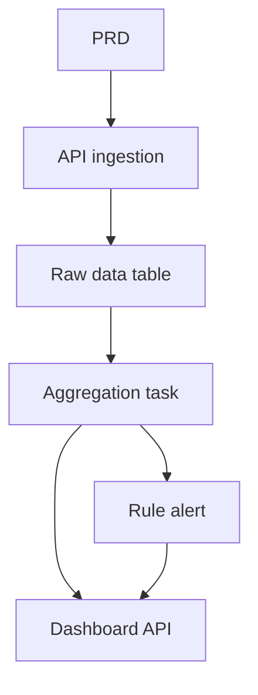

# Thực chiến: phân tích & visualization dữ liệu giao thông bằng Go

## Tổng quan

Project thực chiến này dùng Go xây 1 nền tảng phân tích dữ liệu giao thông dựa trên PRD thật. Khác với CRUD trước, bạn sẽ build chuỗi "data ingestion → aggregation → alert → visualization" hoàn chỉnh. Loại data product này phổ biến trong IoT, monitoring, operation analytics.

Đây là phần thực chiến tổng hợp Stage 2, cũng là lần đầu bạn tiếp xúc Go. Đừng lo, có nền JavaScript/TypeScript rồi, học Go không khó — trọng tâm là hiểu tư duy design chuỗi data.

## Kiến thức tiền đề

- Design page frontend ([UI design](../../frontend/ui-design/), [component library](../../frontend/modern-component-library/))
- Design API backend ([viết code API](../../backend/ai-interface-code/))
- Database và Supabase ([Supabase](../../backend/database-supabase/))
- Git và deploy ([Git/GitHub](../../backend/git-workflow/), [deploy Web](../../backend/zeabur-deployment/))

## Mục tiêu học

1. Đọc PRD, extract task dev cho data product
2. Dùng Go (Gin hoặc Fiber) xây API service
3. Design chuỗi data ingestion, window aggregation, alert
4. Đồng bộ data backend với dashboard frontend
5. End-to-end debug, deliver prototype data product

## Giới thiệu project

| Module | Trách nhiệm |
|------|------|
| **Data ingestion** | Nhận raw traffic event và lưu |
| **Aggregation** | Tính trend và chỉ số kẹt xe theo time window |
| **Alert** | Sinh record alert dựa rule |
| **Dashboard** | Hiện trend chart, ranking, list alert ở frontend |

::: tip Entry PRD
PRD trên GitHub: [Xem PRD](https://github.com/datawhalechina/easy-vibe/blob/main/docs/vi-vn/stage-2/assignments/traffic-data-visualization-go/PRD.md)
:::

<div style="margin: 32px 0;">
  <ClientOnly>
    <StepBar :active="0" :items="[
      { title: 'Phân tích nhu cầu', description: 'Đọc PRD, rõ source data và rule alert' },
      { title: 'Dựng khung', description: 'AI gen Go API và khung dashboard frontend' },
      { title: 'Iterate dev', description: 'Bổ sung logic aggregation, rule alert, dashboard API' },
      { title: 'Debug online', description: 'Chạy end-to-end, deploy, demo' }
    ]" />
  </ClientOnly>
</div>

## Phần 1: Phân tích nhu cầu

### 1.1 Đọc PRD

- Source data là gì? Có field nào?
- Định nghĩa các chỉ số core (ví dụ "kẹt xe" tiêu chuẩn cụ thể)?
- Rule alert là gì? V1 có thu hẹp về rule đơn giản không?
- Dashboard có page và chart gì?

::: warning
Chưa rõ các câu trên thì đừng viết code.
:::

### 1.2 Xác nhận chuỗi data



## Phần 2: Dựng khung

### 2.1 Gen Go API service

```text
Dựa PRD, gen khung nền tảng phân tích data giao thông Go.
Yêu cầu: dùng Gin hoặc Fiber, có API ingestion, khung aggregation task, khung API dashboard/alerts.
Chưa làm phân tích phức tạp, chỉ structure chạy được.
```

### 2.2 Verify

- [ ] Go service start được
- [ ] API ingestion nhận và lưu data được
- [ ] Khung aggregation đã dựng
- [ ] Dashboard frontend hiện chart cơ bản

## Phần 3: Iterate dev

1. **API ingestion**: nhận raw event, ghi database
2. **Aggregation**: theo time window, tính trend và chỉ số
3. **Rule alert**: dựa threshold gen record alert
4. **Dashboard API**: cung cấp data trend, ranking, list alert
5. **Frontend**: trend chart, ranking, list alert

| Check | Verify |
|--------|----------|
| Ingestion | Raw data vào database đúng |
| Aggregation | Logic tính trend/ranking nhất quán |
| Alert | Điều kiện trigger đúng kỳ vọng |
| Consistency | Dashboard và backend khớp |
| API | Có format return và xử lỗi thống nhất |

## Phần 4: Debug và online

Verify end-to-end: ingest batch test data → aggregation chạy → dashboard update; trigger alert → record sinh → page alert hiện.

## Sản phẩm bàn giao

- [ ] Link demo online
- [ ] Repo (có README)
- [ ] PRD doc
- [ ] Screenshot page core
- [ ] Video demo 60s

## Tiêu chuẩn chấm điểm

| Chiều | Cơ bản | Nâng cao |
|------|---------|---------|
| Bám PRD | Function và data khớp PRD | Giải thích chỉ số và logic aggregation |
| Chuỗi data | Ingest→aggregate→alert→dashboard chạy | Aggregation hỗ trợ incremental |
| Năng lực phân tích | Trend, ranking, alert dùng được | Chỉ số config được, rule alert custom được |
| Frontend | Chart cơ bản | Chart hỗ trợ filter time range |
| Engineering | Go API, database, frontend thông | API có xử lỗi và log thống nhất |

## Tài liệu tham khảo

- [UI design](../../frontend/ui-design/)
- [Component library hiện đại](../../frontend/modern-component-library/)
- [Từ database tới Supabase](../../backend/database-supabase/)
- [Viết code API](../../backend/ai-interface-code/)
- [Git và GitHub](../../backend/git-workflow/)
- [Deploy app Web](../../backend/zeabur-deployment/)
