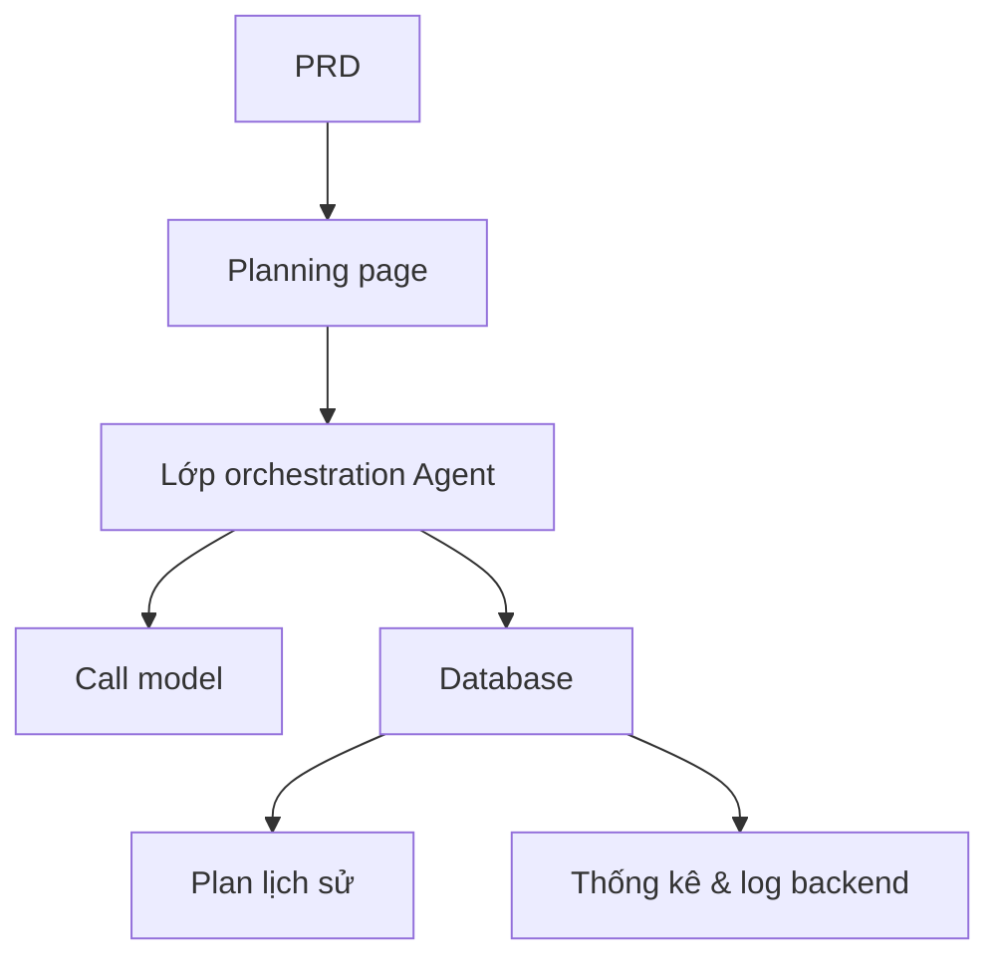

# Thực chiến: nền tảng Agent quy hoạch du lịch thông minh

## Tổng quan

Project thực chiến này yêu cầu bạn dựa trên 1 PRD thật, làm từ 0 một nền tảng Agent quy hoạch du lịch thông minh. Bạn sẽ build 1 sản phẩm AI hoàn chỉnh nhận input có cấu trúc, gen lịch trình hàng ngày, hỗ trợ save và reuse — không chỉ là chatbot, mà là product có năng lực task management.

Đây là phần thực chiến tổng hợp Stage 2. Thách thức cốt lõi của project: làm sao để AI gen ra lịch trình có cấu trúc, dùng được, thay vì 1 đoạn text dài không actionable.

## Kiến thức tiền đề

Trước khi bắt đầu, bạn nên đã nắm:

- Design page frontend và dùng component library ([UI design](../../frontend/ui-design/), [component library hiện đại](../../frontend/modern-component-library/))
- Design và phát triển API backend ([viết code API](../../backend/ai-interface-code/))
- Nền tảng database và Supabase ([từ database tới Supabase](../../backend/database-supabase/))
- Git workflow và deploy ([Git/GitHub](../../backend/git-workflow/), [deploy web app](../../backend/zeabur-deployment/))

## Mục tiêu học

Sau project bạn sẽ:

1. Đọc PRD và extract được task list cho nền tảng Agent
2. Design form input có cấu trúc và format output có cấu trúc
3. Implement lớp orchestration Agent: xử lý input → call model → lưu kết quả
4. Build vòng lặp business "generate → save → reuse"
5. Hoàn thành end-to-end debug, deliver được prototype sản phẩm AI

## Giới thiệu project

Product bạn cần build là 1 nền tảng Agent quy hoạch du lịch thông minh:

| Function | Mô tả |
|------|------|
| **Quy hoạch lịch trình** | User nhập điểm xuất phát, đích, ngày, budget, sở thích — system gen lịch trình từng ngày |
| **Phân bổ budget** | Kết quả lịch trình kèm phân bổ budget và gợi ý |
| **Quản lý lịch sử** | User có thể save plan cũ, regen, export |
| **Quản trị backend** | Admin xem destination hot, task fail, feedback user |

::: tip PRD Entry
PRD project trên GitHub: [Xem PRD](https://github.com/aiecosvietnam/learning-ai/blob/main/docs/vi-vn/stage-2/assignments/travel-planning-agent-platform/PRD.md)
:::

<div style="margin: 32px 0;">
  <ClientOnly>
    <StepBar :active="0" :items="[
      { title: 'Phân tích nhu cầu', description: 'Đọc PRD, rõ page, orchestration Agent, cấu trúc input/output' },
      { title: 'Dựng khung', description: 'AI gen khung trang chủ, planning page, history page, admin page' },
      { title: 'Iterate dev', description: 'Bổ sung output có cấu trúc, task status, quản lý lịch sử theo từng module' },
      { title: 'Debug & online', description: 'Chạy end-to-end, deploy, sẵn sàng demo' }
    ]" />
  </ClientOnly>
</div>

## Phần 1: Phân tích nhu cầu

### 1.1 Đọc PRD

Mở doc PRD, tập trung trả lời:

- V1 chỉ làm single destination không?
- Output lịch trình bắt buộc có cấu trúc không? Cấu trúc thế nào?
- Năng lực export làm tới đâu? (link chia sẻ / PDF / ảnh)
- Phạm vi thống kê backend và log task là gì?

::: warning
Chưa rõ các câu trên thì đừng viết code. Hiểu nhu cầu không rõ là nguyên nhân phổ biến nhất dẫn tới rework.
:::

### 1.2 Xác nhận kiến trúc hệ thống



## Phần 2: Dựng khung project

### 2.1 Gen page frontend

Prompt mẫu:

```text
Dựa PRD hiện tại, gen cho tôi khung frontend nền tảng Agent quy hoạch du lịch thông minh.

Yêu cầu:
1. Page gồm: trang chủ, planning page, chi tiết lịch trình, history page, admin page
2. Planning page: trái là form, phải là preview kết quả
3. Đầu tiên chỉ gen structure page và mock data, chưa nối API thật
4. Style như AI product hiện đại
```

### 2.2 Verify structure page

Check từng item:

- [ ] Field form ở planning page khớp PRD chưa
- [ ] Vùng preview kết quả hiện được data lịch trình có cấu trúc
- [ ] History page hiện được nhiều plan
- [ ] Admin backend hiện được data thống kê

## Phần 3: Iterate dev

### 3.1 Đẩy từng module

1. **Auth**: đăng ký, login
2. **Planning form**: input có cấu trúc (xuất phát, đích, ngày, budget, sở thích)
3. **Agent orchestration**: nhận input → call model → parse output có cấu trúc
4. **Hiển thị kết quả**: lịch trình theo ngày, phân bổ budget, gợi ý
5. **Quản lý lịch sử**: save plan, regen, export
6. **Admin backend**: destination hot, task fail, feedback user
7. **Task status**: quản lý trạng thái generating / success / failed và ghi log lỗi

### 3.2 Self-check module

| Check | Cách verify |
|--------|----------|
| Đầy đủ input | Field form khớp PRD không |
| Output có cấu trúc | Kết quả lịch trình có là data có cấu trúc (chứ không phải 1 đoạn text dài) |
| Nhất quán data | Data trip, itinerary, logs có khớp nhau không |
| Verify vòng lặp | Có demo được "input → generate → save → regen" không |

## Phần 4: Debug & online

### 4.1 Test end-to-end

Ít nhất verify các scenario:

- Nhập tham số → gen lịch trình hàng ngày → xem phân bổ budget → save vào history
- Từ history regen lịch trình
- Admin xem thống kê task và log fail

## Sản phẩm bàn giao

Cuối project bạn cần submit:

- [ ] Link demo online truy cập được
- [ ] Link repo source code (kèm README)
- [ ] Doc PRD
- [ ] Screenshot page chính (planning, chi tiết lịch trình, history, admin)
- [ ] Video demo 60s

## Tiêu chuẩn chấm điểm

| Chiều | Cơ bản | Nâng cao |
|------|---------|---------|
| Bám PRD | Page, function, data structure cơ bản khớp PRD | Giải thích rõ design decision |
| Vòng lặp product | Planning → save → history → regen chạy được | Hỗ trợ export và share |
| Chất lượng output | Lịch trình có cấu trúc và đọc được | Phân bổ budget hợp lý, gợi ý có target |
| Năng lực backend | Thống kê task và log fail xem được | Có phân tích destination hot |
| Engineering | Chuỗi frontend, backend, database, model call đã thông | Quản lý task status hoàn thiện, có thể trace lỗi |

## Tài liệu tham khảo

- [UI design](../../frontend/ui-design/)
- [Cập nhật giao diện bằng component library hiện đại](../../frontend/modern-component-library/)
- [Từ database tới Supabase](../../backend/database-supabase/)
- [LLM hỗ trợ viết code API và doc API](../../backend/ai-interface-code/)
- [Git và GitHub workflow](../../backend/git-workflow/)
- [Cách deploy web app](../../backend/zeabur-deployment/)
