# Workflow Git và GitHub

Ở các bài trước, ta đã học cách dùng tool vibe coding trên Web để viết code. Mỗi lượt hội thoại tạo 1 phiên bản code mới. Nhưng hãy nghĩ: nếu muốn rollback về sửa đổi trước đó, có cách tiện không? Có tool nào ghi lại code ở các giai đoạn khác nhau, cho ta tự do switch và sửa giữa các phiên bản không?

Để đáp ứng nhu cầu này, phần mềm quản lý phiên bản ra đời. Trong bài này, ta sẽ giới thiệu chương trình version control nổi tiếng nhất — Git — và platform host code tốt nhất — GitHub. Ta sẽ học cách dùng Git để quản code, cách lấy code người khác từ GitHub, cách upload code của mình, và cách cộng tác trong project lớn.

Dù là tracking phiên bản project cá nhân, sync code trong cộng tác team, hay đóng góp cho cộng đồng open source — Git và GitHub đều là tool thiết yếu của dev hiện đại. Làm chủ chúng, bạn sẽ quản code hiệu quả hơn, tạo checkpoint khi cần, switch tự do giữa các giai đoạn code, và xử lý mọi việc từ thay đổi file đơn tới dev project lớn — khiến mỗi lần iterate code đều kiểm soát được và truy vết được.

> 💡 **Kiến thức tiền đề**
> 
> Trước khi học Git, khuyến nghị hiểu:
> - [Terminal/command line là gì](/vi-vn/appendix/2-development-tools/command-line-shell) — học dùng command line tương tác với máy
> - [Git là gì](/vi-vn/appendix/2-development-tools/git-version-control) — hiểu khái niệm core hệ thống quản version Git
>
> Bài này focus workflow GitHub và thao tác thực tế, kiến thức nền trên tham khảo link phụ lục.

# Quick start Git

Trước khi dùng Git, hãy chắc bạn đã đọc phụ lục về [command line](/vi-vn/appendix/2-development-tools/command-line-shell) và [Git cơ bản](/vi-vn/appendix/2-development-tools/git-version-control). Bài này giả định bạn đã có kiến thức nền này, đi thẳng vào cách cài config Git và dùng GitHub để cộng tác.

## Cài Git

Demo 3 cách cài Git trên các OS khác nhau. Theo phiên bản hệ thống của bạn:

### Windows

1. Vào [trang download Git chính thức](https://git-scm.com/download/win) và download installer phù hợp: [installer](https://github.com/git-for-windows/git/releases/download/v2.51.0.windows.1/Git-2.51.0-64-bit.exe). Mặc định khuyến nghị x64 installer.
2. Double-click installer và theo wizard:
   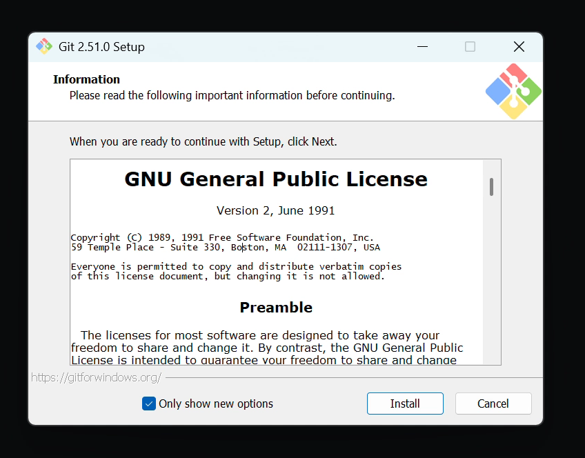
   1. Khuyến nghị giữ default option. Nếu cần custom, lưu ý: (đa số trường hợp cứ bấm "Next")
      - Chọn editor mặc định Git dùng: chọn editor bạn thích (VS Code). Bạn có thể default option đầu, Vim (text editor), hoặc chọn "Visual Studio Code as Git's default editor" (cần cài sẵn VS Code). Giữ default và "Next".
        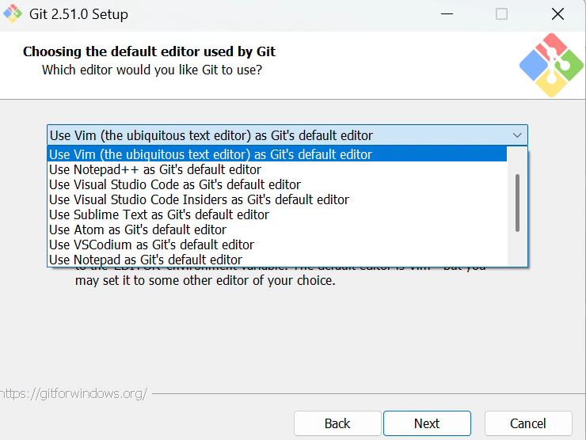
      - Chọn cách dùng Git: 3 option điều khiển khả năng truy cập Git trong hệ thống. Khuyến nghị option 2 ("from command line and 3rd-party software") — add Git tool cơ bản vào PATH, dùng được Git trong Git Bash, command prompt, PowerShell và IDE mà không làm loạn hệ thống.
        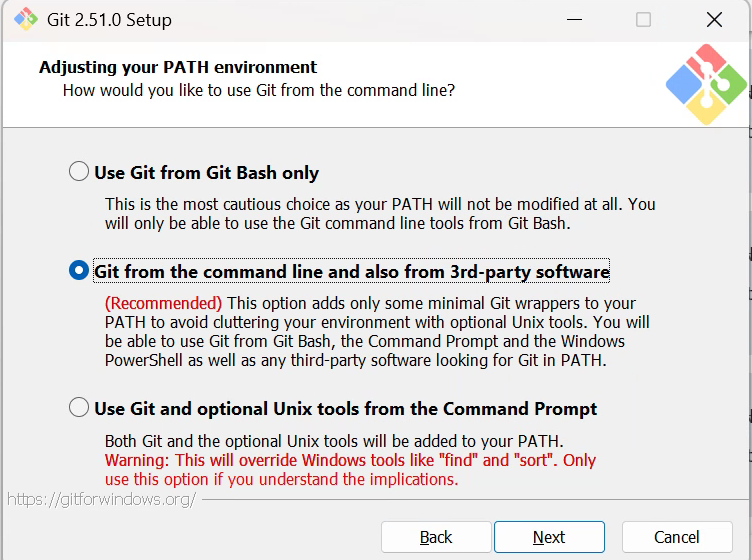

3. Sau khi cài, right-click desktop. Nếu thấy "Git Bash Here" trong menu, cài thành công.


### MacOS

Trên macOS, có thể gõ `git --version` trong terminal trước để check có Git chưa. Nếu chưa, hệ thống sẽ prompt cài — chỉ cần theo hướng dẫn.

1. Cách 1: cài qua Homebrew
   Nếu đã cài [Homebrew](https://brew.sh/) (Mac package manager), mở terminal gõ:
   ```bash
   brew install git
   ```
2. Cách 2: (khuyến nghị) cài qua Xcode: https://developer.apple.com/xcode/, Xcode có sẵn Git. Sau cài, theo hướng dẫn tiếp.

### Linux

Đa số Linux distro cài Git qua package manager:

- Ubuntu/Debian:

```bash
sudo apt update
sudo apt install git
```

- CentOS/RHEL:

```bash
sudo yum install git
```

- Verify: gõ `git --version` trong terminal. Hiện version number là cài OK.

## Init Git

Sau cài Git, đầu tiên cần config user info — đây là bước cơ bản để dùng Git version control. Trong terminal execute (thay nội dung trong ngoặc bằng info bạn):

```bash
# Set username global (hiển thị trong commit record)
git config --global user.name "Your Name"

# Set email global (khuyến nghị dùng email đã register GitHub/GitLab)
git config --global user.email "your.email@example.com"
```

Git nhúng info này vào mỗi commit record như "author info" của mỗi sửa đổi. Xem lịch sử version (vd `git log`), bạn thấy rõ ai đã sửa từng dòng — tiện truy vết và giao tiếp. Trong project cộng tác, info danh tính thống nhất giúp team nhanh nhận diện ai đã làm thay đổi gì, nâng hiệu suất cộng tác (ví dụ qua commit record tìm dev liên quan để bàn vấn đề).

Có thể gõ `git config --list` trong command line để xem config Git hiện tại, xác nhận setting thành công.

# GitHub là gì

GitHub là platform host code dựa trên Git. Nó không chỉ cung cấp lưu trữ remote cho Git repo, mà còn có tool cộng tác (Issues, Pull Requests, Projects) — giúp dev dễ share code và cộng tác. Đơn giản: Git là tool version control local, còn GitHub là "cloud kho code + community cộng tác" remote.

GitHub không chỉ là platform host code lớn nhất thế giới, mà còn là community open source năng động và có ảnh hưởng nhất. "Open source" ở đây có ý core: bất kỳ ai cũng download và chạy được source code phần mềm. Mô hình này cho phép người khắp thế giới review code của nhau, sửa đổi, hoặc tạo project mới dựa trên đó. Ví dụ trên GitHub bạn có thể tìm thấy đủ loại tutorial học và full source của các framework để train GPT model (như PyTorch). Mỗi ngày, vô số người cộng tác toàn cầu để review và cải thiện code.


Nhiều công ty lớn open source chương trình hoặc tutorial trên GitHub để đạt lợi thế cạnh tranh ngành — cũng có thể coi là một dạng quảng cáo. Trong community GitHub, số "stars" project đạt được là chỉ số chính đo giá trị; project hoặc tổ chức có nhiều stars hơn, độ tin cậy và ảnh hưởng càng lớn.

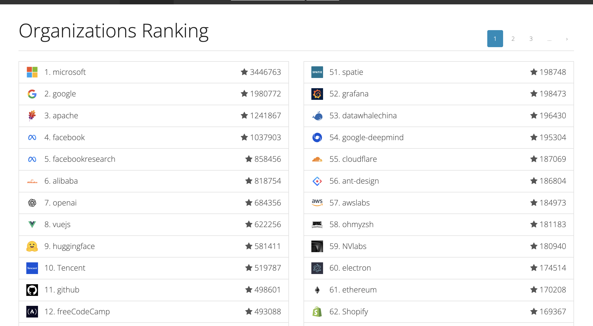

Trong khoá học của chúng ta, tài nguyên hỗ trợ và bài tập cũng sẽ upload lên GitHub repo riêng. Qua quá trình upload bài tập, bạn dần quen và làm chủ cách dùng GitHub, đặt nền vững cho version control trong dev app tương lai.

## Đăng ký tài khoản GitHub

1. Vào [trang chủ GitHub](https://github.com/) và bấm "Sign up" góc trên bên phải.
   
2. Nhập email (khuyến nghị dùng email hay dùng, vì verify và notification sẽ gửi tới đó), set password (phải có cả chữ, số, ký tự đặc biệt).
3. Hoàn thành verify người, theo prompt verify email — tài khoản tạo xong.

## Tạo repo đầu tiên trên GitHub

Tiếp theo, ta tạo folder lưu trữ đầu tiên, gọi là repository hoặc "repo".

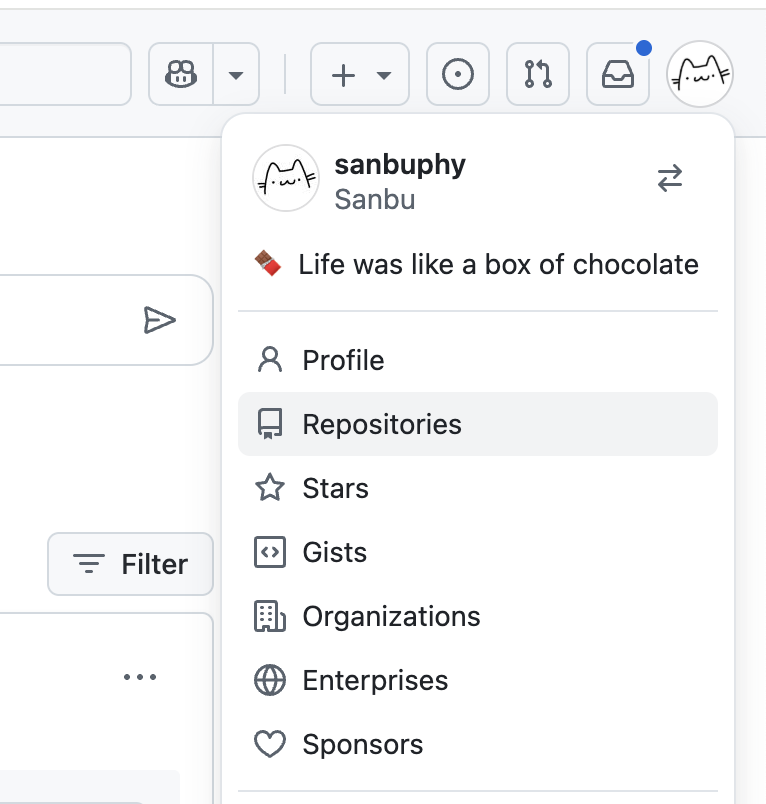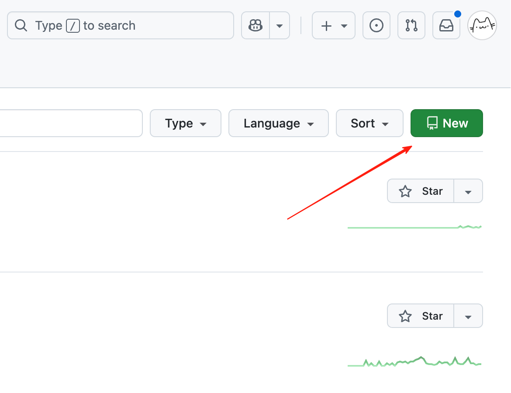

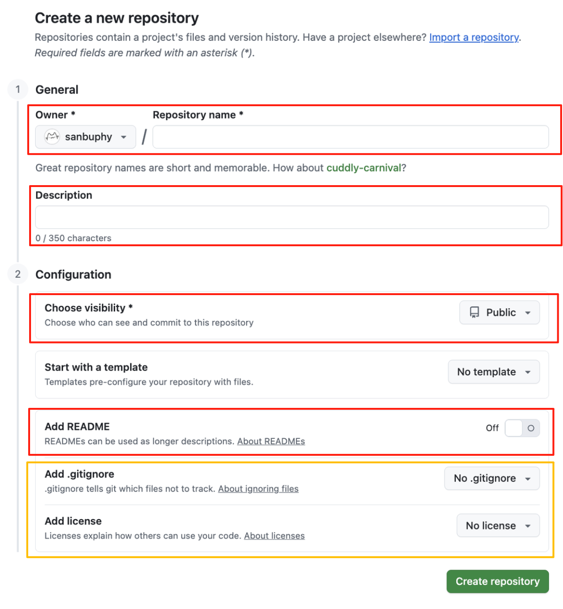

1. Repository name: tên repo hiển thị cho người khác.
2. Description: mô tả chi tiết repo.
3. Choose visibility: với repo cá nhân, set private thì chỉ bạn và người được mời thấy. Set public thì mọi người đều thấy.
   Với repo trong tổ chức, Private thì chỉ người trong tổ chức thấy.
   Public thì người ngoài tổ chức cũng thấy.
4. README: thông lệ là mỗi repo nên có file README. Có thể coi như intro đầy đủ của repo, gồm hướng dẫn dùng, list file, cách thao tác.
5. Add .gitignore and license:
   1. File .gitignore nói Git bỏ qua một số folder/file khi upload lên GitHub — không tracking, không add vào staging. Hữu ích cho file test tạm, package dependency, file lớn. Khi đã chỉ định, file đó không còn được track.
   2. license chỉ loại open source license bạn chọn. Các license khác nhau quy định chi tiết người khác có dùng code bạn cho mục đích thương mại không, và các điều khoản khác.

Khuyến nghị tick "Add README", set visibility "Private", và điền name + description theo ý thích, rồi bấm "Create repository" hoàn tất tạo repo remote đầu tiên.

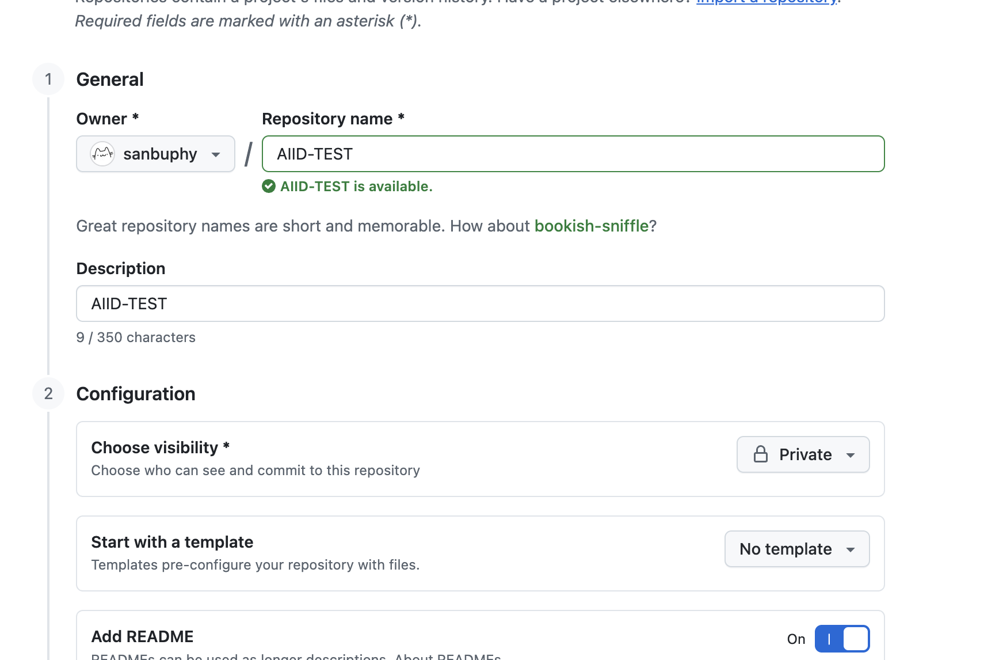

Sau đó, bạn có 1 repo sạch không file phụ. Tiếp theo bạn có thể bắt đầu upload file.

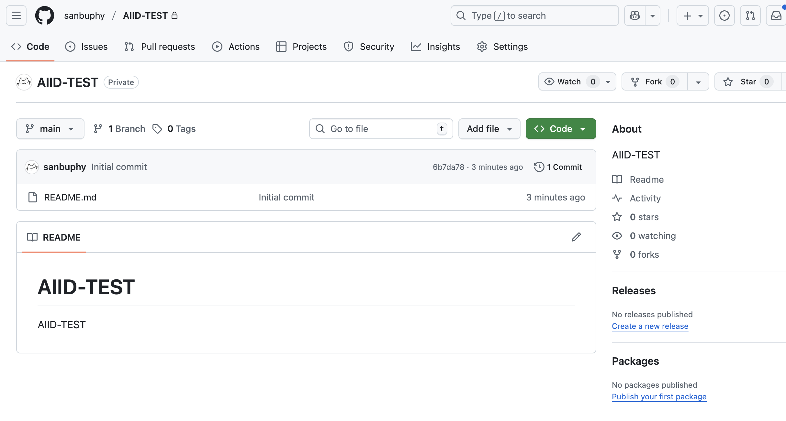

Lệnh lấy repo là `git clone`, nhưng cần địa chỉ repo. Bấm nút "Code" xanh để tìm địa chỉ repo, sẽ thấy option HTTPS và SSH. Thường có thể dùng bất kỳ cách nào trong 2 để download repo về máy local (chỉ vậy mới sửa và upload file được).

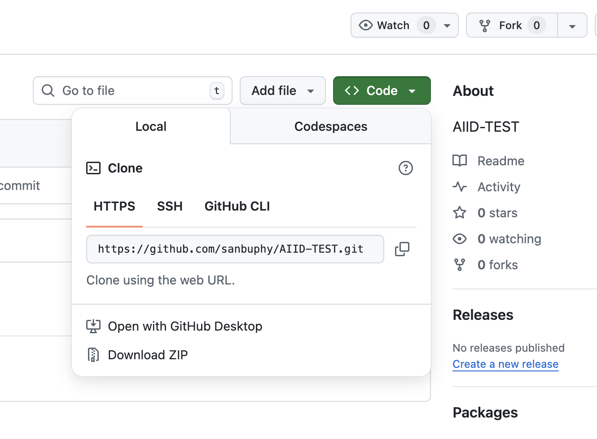

Nói chung, repo clone qua HTTP hợp download tạm và test repo người khác, nhưng không khuyến nghị cho dev của mình. Trải nghiệm học tốt hơn, bạn nên setup SSH auth trước.

## Bind local SSH

Trong GitHub, "bind SSH protocol" bản chất là liên kết SSH public key của thiết bị local của bạn với tài khoản GitHub, cho phép GitHub qua SSH protocol nhận diện thiết bị bạn. Cho phép thao tác repo remote an toàn không cần password (clone, push, pull code).

Đơn giản: như cho thiết bị 1 "thẻ access GitHub độc quyền". Sau bind, khi thiết bị qua SSH access GitHub repo, GitHub verify "thẻ access" này (SSH public key). Một khi xác nhận là thiết bị được phép, bạn có thể thao tác trực tiếp — không cần nhập tài khoản password mỗi lần.

> 💡 SSH là gì

### Vì sao cần bind SSH protocol?

GitHub hỗ trợ 2 protocol thao tác repo chính: HTTPS và SSH:

- HTTPS: mỗi lần thao tác (như push) cần nhập tài khoản password GitHub (hoặc personal access token PAT). Quá trình verify phiền, có rủi ro lộ password.
- SSH: verify danh tính qua "key pair", không cần nhập password lặp lại, mã hoá transfer an toàn hơn.

"Bind SSH protocol" là bước tiền đề để bật SSH auth GitHub — chỉ khi bind SSH public key local vào GitHub, GitHub mới nhận diện thiết bị và cho phép thao tác SSH với repo.

### Logic core của "bind": vai trò SSH key pair

SSH auth dựa key pair (public key + private key), là file mã hoá khớp nhau. Sau gen, bạn cần đưa "public key" cho GitHub ("bind"), còn "private key" giữ lại thiết bị local:

1. Private key: lưu trong directory chỉ định trên thiết bị local (thường ~/.ssh/), như "chìa khoá riêng của bạn", tuyệt đối không share với ai.
2. Public key: là "ổ khoá" có thể share công khai — bạn cần copy vào "SSH keys list" của tài khoản GitHub (thao tác "bind").

Khi bạn qua SSH thao tác GitHub repo (ví dụ `git push git@github.com:xxx/xxx.git`):

- Thiết bị local dùng private key mã hoá "request thao tác" rồi gửi cho GitHub;
- Nhận request, GitHub thử dùng public key bạn đã bind để giải mã;
- Nếu giải mã thành công, thiết bị bạn được xác nhận là được phép, thao tác được cho phép; ngược lại, truy cập bị từ chối.

### Các bước cụ thể của "bind" (flow core)

Một khi hiểu nguyên lý, thao tác thực tế rất đơn giản — core là "gen key pair → upload public key lên GitHub":

1. Gen SSH key pair ở local
   1. Dùng Trae lấy public key (khuyến nghị)
      Prompt: `Help me create the SSH key needed for GitHub login. My email is your_email@gmail.com , Please return the public key for me to copy`

   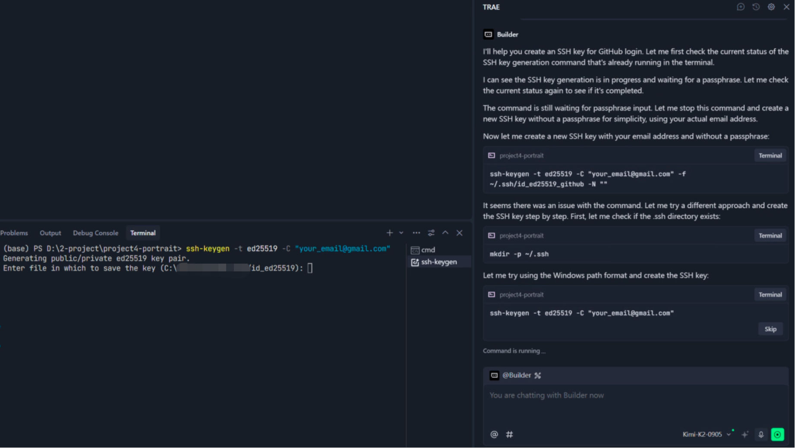

   Sau nhập prompt, bạn còn cần bấm Enter trong terminal bên trái, nếu không lệnh sẽ đợi mãi không execute. Vì Trae không thể thay bạn execute các điều kiện phán đoán, chỉ cần liên tục bấm Enter là được.

   Cuối, bạn sẽ thấy Trae bên phải return public key nó đọc được. Chỉ cần copy và chuẩn bị paste ở bước tiếp.

   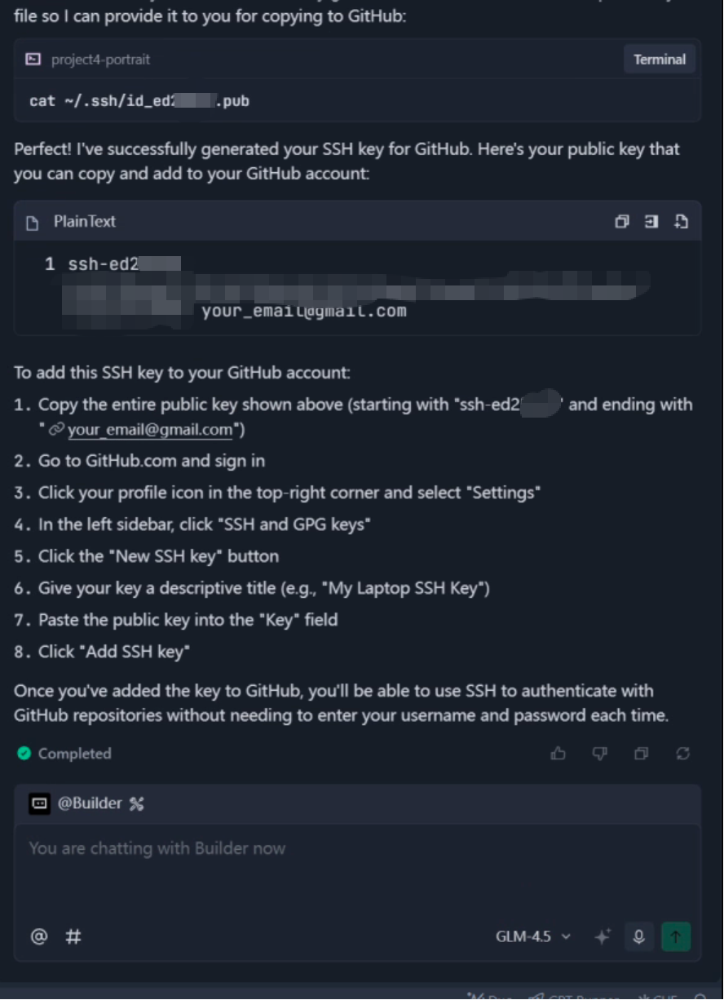 2. Lấy public key thủ công
   Mở terminal local (trên Windows dùng Git Bash hoặc PowerShell; trên macOS/Linux dùng terminal), nhập lệnh sau (thay your_email@example.com bằng email bạn dùng register GitHub):

   ```bash
   ssh-keygen -t ed25519 -C "your_email@example.com"
   ```

   1. Bấm Enter để accept default (đường file default, không password, hoặc set password theo nhu cầu). Sẽ gen 2 file trong directory ~/.ssh/:
      - id_ed25519: private key (lưu local, **tuyệt đối không share**);
      - id_ed25519.pub: public key (cần upload lên GitHub).

2. "Bind" public key vào tài khoản GitHub

Đây là bước bind core — thêm public key local vào "SSH keys list" của tài khoản GitHub:

1. Copy nội dung public key:
   1. Trae:
   2. Windows: mở C:\Users\<your>\.ssh\id_ed25519.pub bằng Notepad và copy toàn bộ;
   3. macOS/Linux: trong terminal chạy `cat ~/.ssh/id_ed25519.pub` và copy toàn bộ output (từ SSH-ed25519 đầu tới email cuối).
2. Login GitHub và vào trang "SSH Key Management":
   1. Bấm avatar góc trên phải → Settings → menu trái SSH and GPG keys → bấm New SSH key.
      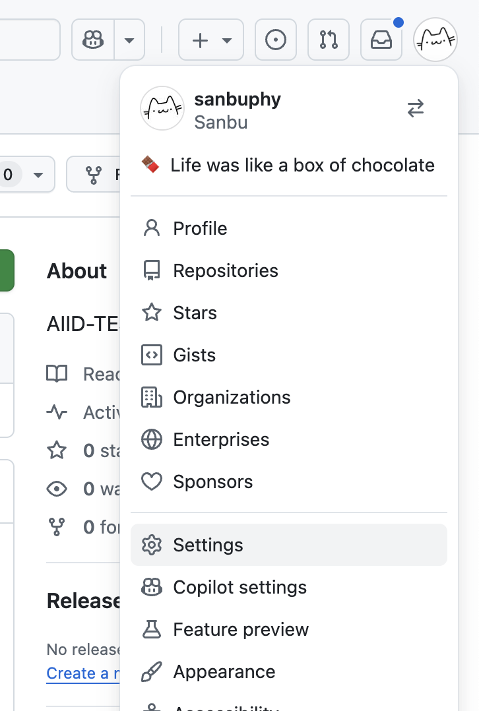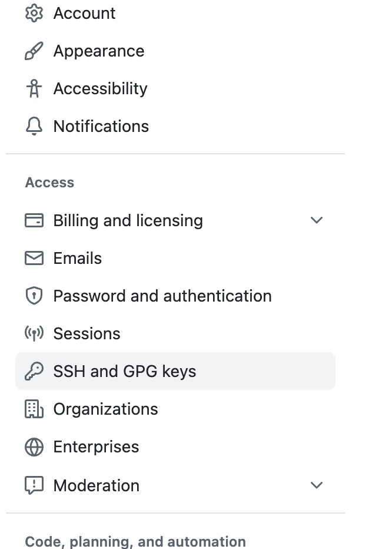
   2. Nhập title bất kỳ (ví dụ "your local computer's SSH"), rồi paste SSH public key vừa lấy vào đây.

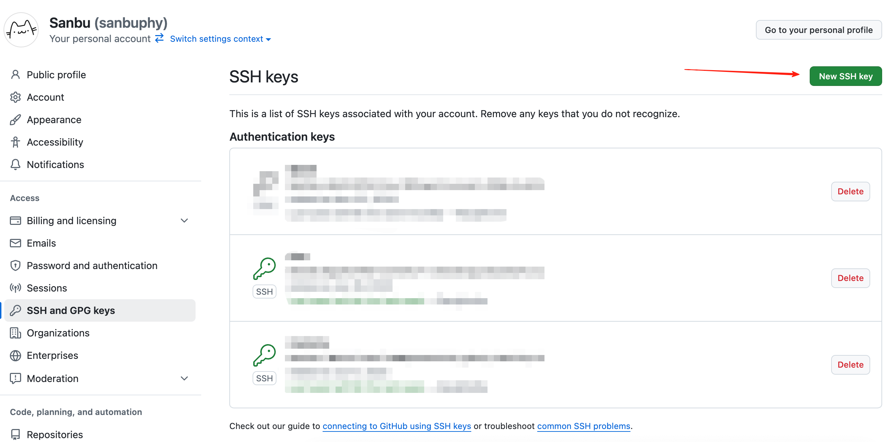

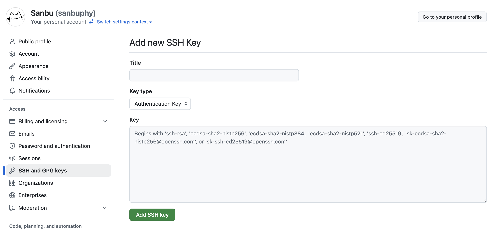

3. Verify bind thành công

Trong terminal nhập lệnh sau (**Trae cũng làm được**) để test GitHub có nhận diện thiết bị không:

```bash
ssh -T git@github.com
```

- Thấy đại loại `Hi [your GitHub username]! You've successfully authenticated...` nghĩa là bind key thành công;
- Gặp error thường do public key copy không đủ, quyền private key quá cao (~/.ssh/ local nên chỉ bạn read/write). Check theo nhu cầu.

### Lưu ý quan trọng

Nếu bạn có nhiều thiết bị (laptop và desktop), cần gen SSH key pair riêng cho mỗi thiết bị, bind từng public key vào cùng tài khoản GitHub — mỗi thiết bị có "thẻ access" riêng.

Tuyệt đối không share private key (không upload lên GitHub hay share với ai), không thì có người có thể giả mạo bạn thao tác repo. Nếu private key lộ, xoá ngay public key tương ứng trên GitHub và gen key pair mới.

Sau bind SSH, dùng địa chỉ repo format SSH (ví dụ `git@github.com:username/repository.git`) để thao tác, không phải HTTPS format (như `https://github.com/username/repository.git`). Nếu trước đó đã clone qua HTTPS, có thể dùng `git remote set-url origin <new>` để switch protocol.

# Dùng Trae thao tác GitHub

Ta đã giải thích Git là gì, GitHub là gì, SSH là gì, và cách config. Giờ bạn tự do dùng Trae execute thao tác Git. Đầu tiên, học cách clone repo remote về máy local.

## Git clone: download repo có sẵn

Bạn có thể trực tiếp nói cho nó địa chỉ repo muốn clone.

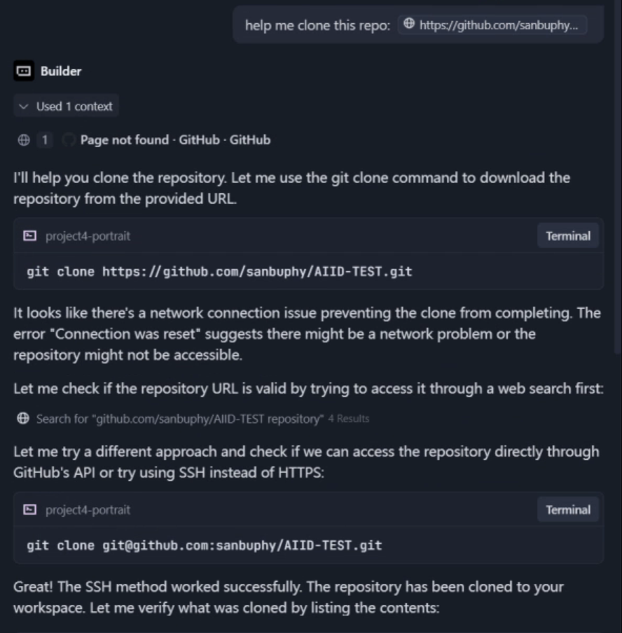

## Git pull: lấy update từ repo remote

Mỗi lần update repo, vì có thể nhiều người maintain, bạn cần pull thay đổi mới nhất trước. Sau đó, có thể sửa và push file.

**Nhớ kèm tên folder và đường dẫn tương đối hoặc tuyệt đối để tránh push sai repo.**

prompt: `Help me pull this repository AIID-TEST in ./AIID-TEST.`

## Git commit & Git push: stage update và push lên GitHub

Khi mọi thứ sẵn sàng, bạn có thể thử sửa file local, add hoặc xoá item trong folder. Rồi để Trae detect thay đổi và giúp bạn push lên GitHub.

prompt: `I finished. Commit and push to the repository AIID-TEST in ./AIID-TEST.`

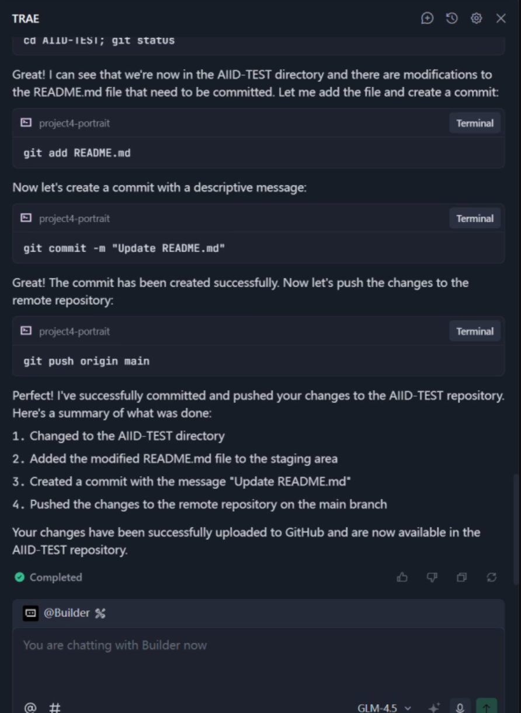

Push thành công. Giờ bạn có thể thấy nội dung đã update trên GitHub.

# Tài liệu tham khảo

- Pro Git book https://git-scm.com/book/en/v2
- GitHub Docs https://docs.github.com/en
