# CLI AI coding tool

Trong tutorial này, ta sẽ giới thiệu AI coding Agent chạy thẳng trong command line. Chúng khác Agent trong Trae, Cursor đã học — CLI AI coding tool chỉ dùng được trong terminal. So với Agent tích hợp trong AI IDE, chúng thường có context window dài hơn, tool call nhanh hơn, và tương thích nhiều loại mô hình lớn hơn. Trong thực chiến AI Vibe Coding mới nhất, ta thường ưu tiên dùng CLI AI coding tool hơn coding Agent built-in trong IDE.

## Nói từ CLI

Nhớ CLI đã giới thiệu trước không? CLI chỉ thao tác phần mềm qua terminal hoặc command prompt, bằng text command thuần, không dựa GUI (giao diện có button bấm được trên máy tính/điện thoại, không cần gõ lệnh).

> Trên Windows, terminal phổ biến có "Command Prompt (cmd)" và "PowerShell". Có thể gõ "cmd" hoặc "powershell" trong run/search box của máy để start các program command line này.

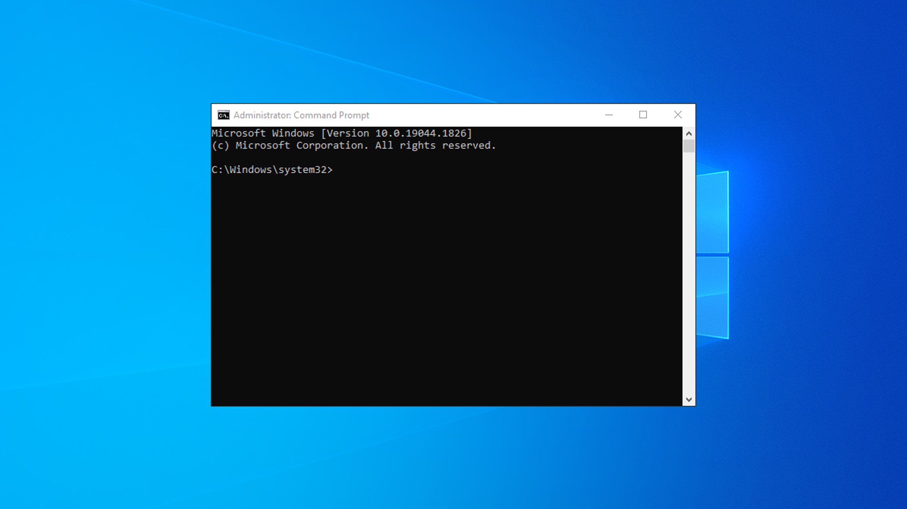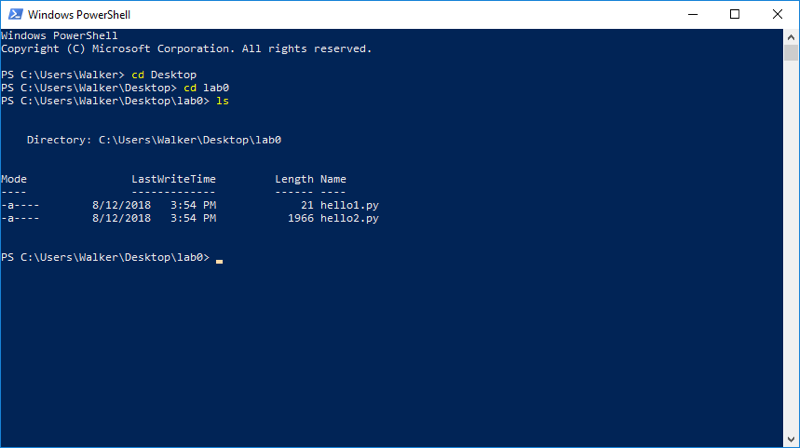

CLI bẩm sinh hợp thao tác text command. Trong nhóm geek nhỏ (lover lập trình theo đuổi cực hạn), CLI thậm chí được ưa hơn GUI — họ muốn mọi thao tác qua bàn phím, thấy động chuột làm chậm hiệu suất code.

Trong công nghiệp, CLI cũng là interface phổ biến nhất, vì GUI cần OS vẽ thêm UI, quản window, yêu cầu resource máy cao; còn CLI chỉ cần forward command nhận được cho hệ thống execute. Vì vậy, khi connect cluster server quy mô lớn, ta thường chỉ tương tác qua CLI.

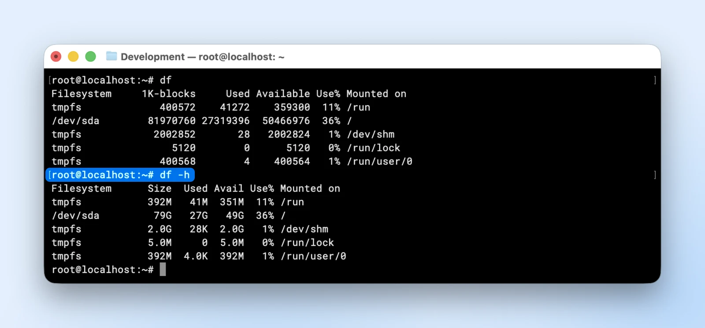

Nhiều bạn không có kinh nghiệm CLI có thể thấy thao tác CLI phức tạp, lệnh quá nhiều, thậm chí lo "lỡ tay làm hỏng máy". Đừng lo. Nhớ trong tutorial trước ta thường để Trae giúp làm các thao tác cơ bản không? Ở đây áp dụng cùng tư duy — để CLI coding tool execute mọi thao tác CLI: vào folder chỉ định, search và xử file, run hoặc copy open source project... Toàn quá trình qua chat với CLI AI coding tool là xong.

## Khác AI IDE thế nào

Có thể ẩn dụ CLI AI coding tool giống z.ai và Trae đã học. Theo nghĩa nào đó, CLI AI coding tool có thể coi là z.ai đặc biệt: chỉ cần 1 entry chat đơn giản, tự execute mọi thao tác cần (chỉ là đôi khi bạn cần tự mở browser xem kết quả cuối). Còn nếu ẩn dụ AI IDE, CLI AI coding tool có thể coi là module Agent trong IDE — vùng chat ở sidebar.

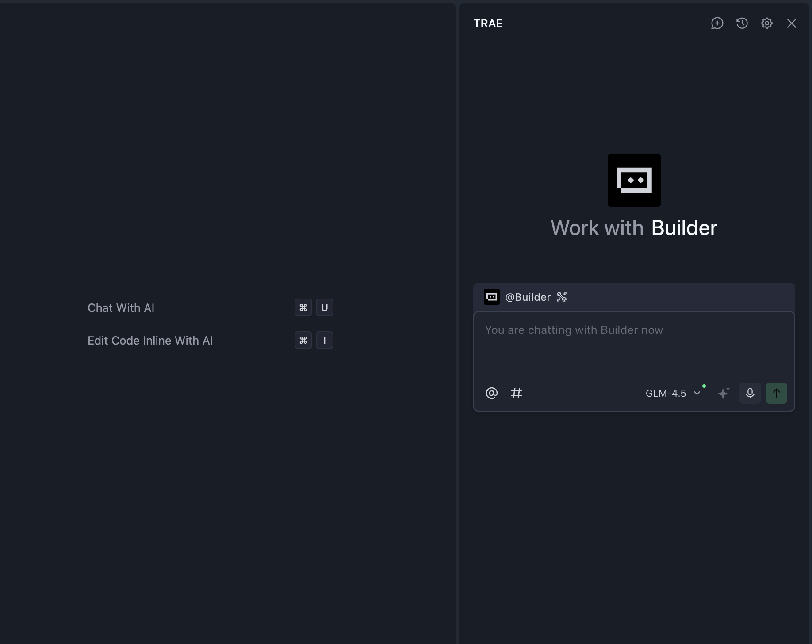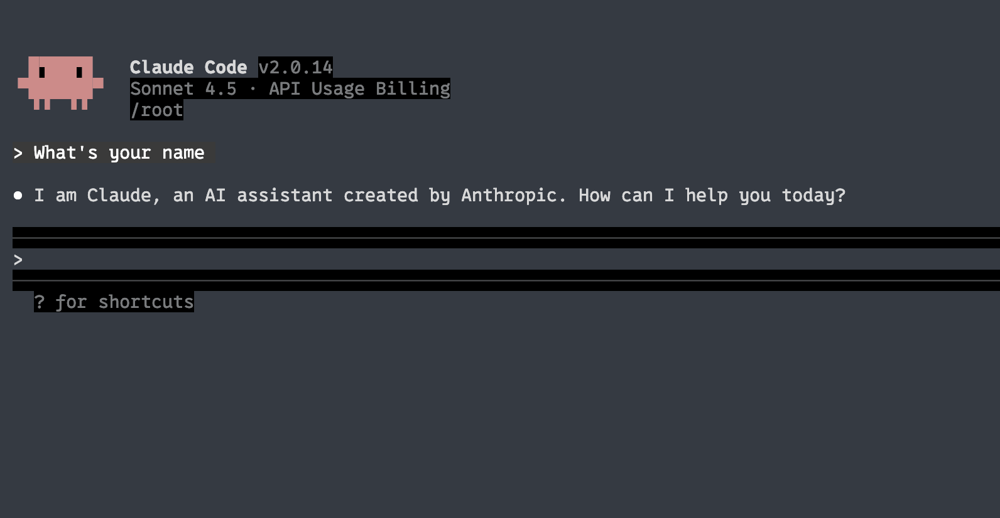

Tuy nhiên, vì cách implement Agent của các AI IDE khác nhau, khác biệt năng lực lớn, hiệu quả AI coding thường không ổn định, nên CLI AI coding tool thường do big tech tự dev — như Anthropic (sau Claude), OpenAI (sau ChatGPT).

So với các AI coding Agent khác, dùng thẳng product big tech thường là thực hành tốt hơn, đặc biệt Claude Code vốn là tool phục vụ team dev nội bộ Anthropic — từ đầu thiết kế xung quanh "thoả mãn nhu cầu thật của engineer".

Để so sánh trực quan hơn, xem khác biệt Claude Code và Agent của 1 AI IDE (lấy Cursor làm ví dụ):

| Tính năng | Claude Code | Cursor | Tốt hơn |
| --- | --- | --- | --- |
| Auto execute task | ✅ Rất mạnh | ❌ Năng lực giới hạn | Claude Code |
| Tích hợp IDE | ❌ Chỉ CLI | ✅ Native VS Code | Cursor |
| Code completion realtime | ❌ Không | ✅ Trải nghiệm cực tốt | Cursor |
| Thao tác đa file | ✅ Rất mạnh | ⚠️ Khá | Claude Code |
| Thao tác GitHub tích hợp | ✅ Commit thẳng | ⚠️ Cần thao tác tay | Claude Code |
| Chi phí học | ⚠️ Trung bình | ✅ Lên tay đơn giản | Cursor |
| Độ dài context | ✅ Rất dài | ⚠️ Khá | Claude Code |
| Hỗ trợ debug | ✅ Tự động | ⚠️ Nhiều phải tay | Claude Code |

Nguồn bảng: <https://northflank.com/blog/claude-code-vs-cursor-comparison>

Đơn giản, CLI AI coding tool thường:

- Hỗ trợ chat liên tục lâu hơn (thậm chí giúp bạn "làm cả ngày").
- Cung cấp context window dài hơn (không cần nói "tiếp" thường xuyên).
- Tốc độ response nhanh hơn (tích hợp được nhiều API model tự custom).

Trong các thao tác liên quan code, thường thông minh và ổn định hơn đa số Agent built-in trong IDE.

## CLI AI coding tool phổ biến

Hiện có nhiều open source implementation, nhưng trong thực hành chỉ khuyến nghị 2 type lớn CLI AI coding tool, là "combo ưu tiên". Có thể chọn theo thói quen, khuyến nghị thử cả 2 rồi chọn cái hợp nhất.

- Codex dùng GPT-5, năng lực tổng thể mạnh hơn;
- Claude Code qua GLM 4.6 forward API, trải nghiệm gần Claude 4 nhưng rẻ hơn.
- OpenCode có thể switch và phối hợp model tuỳ ý, cung cấp model free, kiểm soát chi phí tốt hơn.

Cái nào dùng tốt hơn trong project thực tế chỉ có thể tự test mới biết. Nắm nhiều tool AI coding luôn có ích: thành thạo xong, bạn linh hoạt switch giữa Claude Code, Codex hoặc Trae trong scenario khác. Nếu thử nhiều lần thấy 1 tool hiệu quả thường, đổi tool hoặc model khác.

Đồng thời, vì version model update rất nhanh, khuyến nghị ưu tiên giải pháp tốt nhất về "tỉ lệ giá-trị (hiệu quả/chi phí)".

### Claude Code

Claude Code là tool AI coding do Anthropic dev dựa năng lực mô hình Claude. Scenario tương tác chính là terminal, cũng hỗ trợ làm plugin VS Code. Giống Agent trong AI IDE, nó có thể hiểu sâu code repo dev, qua lệnh ngôn ngữ tự nhiên hoàn thành task dev end-to-end — edit code, fix bug, execute và fix test, quản Git workflow (giải merge conflict, tạo PR), giải code phức tạp, execute terminal command.

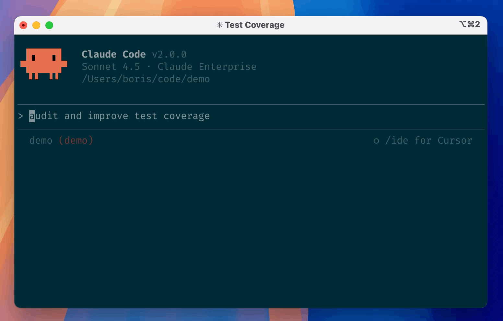

Ưu thế Claude Code thể hiện chính ở: context window cực dài (xử file đầy đủ thậm chí project nhỏ), chủ động làm rõ nhu cầu mơ hồ, tự plan và phân phối execute task, hiểu sâu và giải thích nội dung cả code base. So với Agent IDE thường, hợp flow dev "vibe coding immersive".

Trong dùng thực, qua lệnh chat, để nó giúp tạo project mới, execute thao tác CLI (sắp xếp folder, batch rename file, deploy open source project...), config môi trường dev (cài và debug Python environment). Nếu thấy đoạn code khó hiểu, structure folder không rõ, cũng có thể để Claude Code gen tài liệu phân tích có cấu trúc, hoặc giải từng bước nội dung cụ thể.

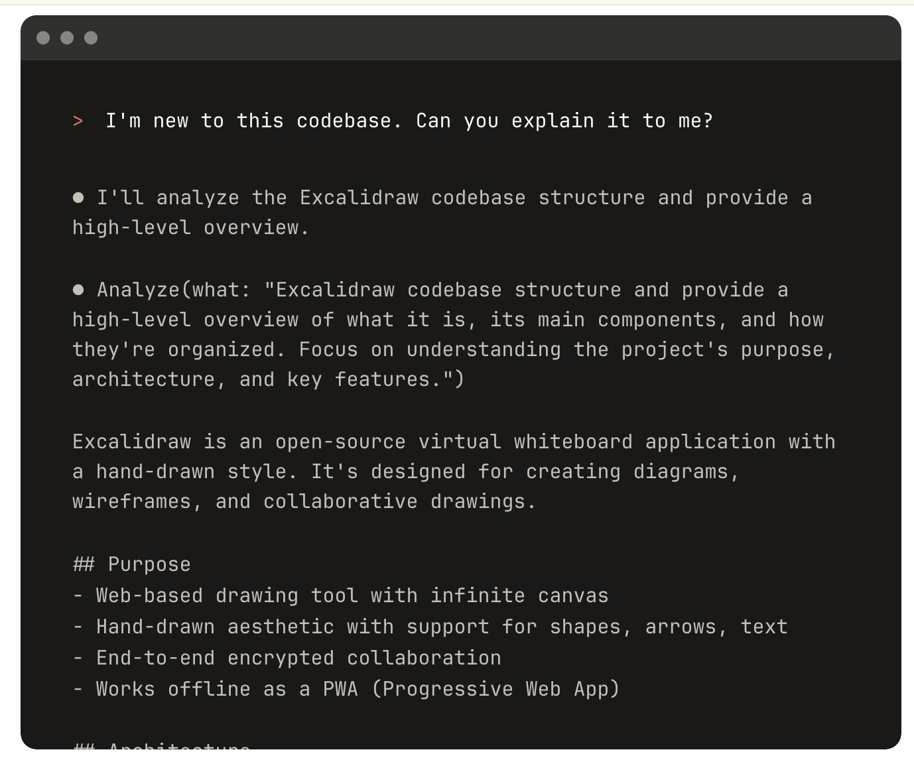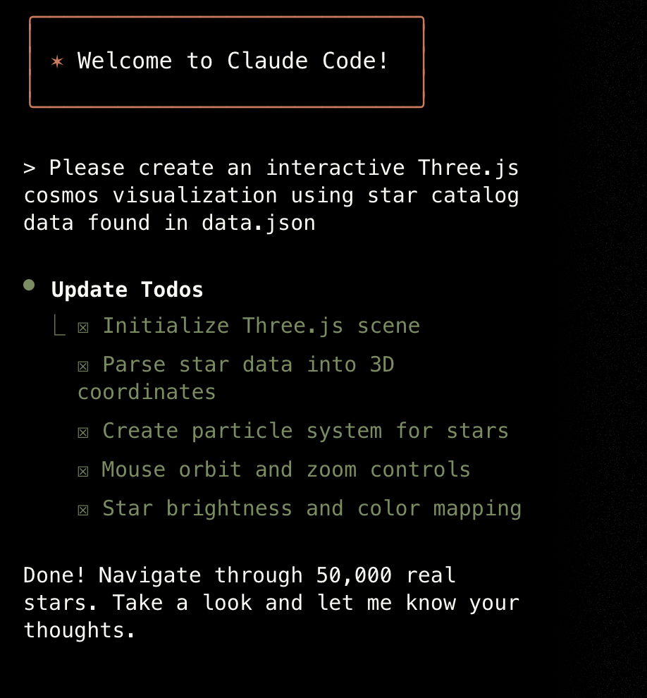

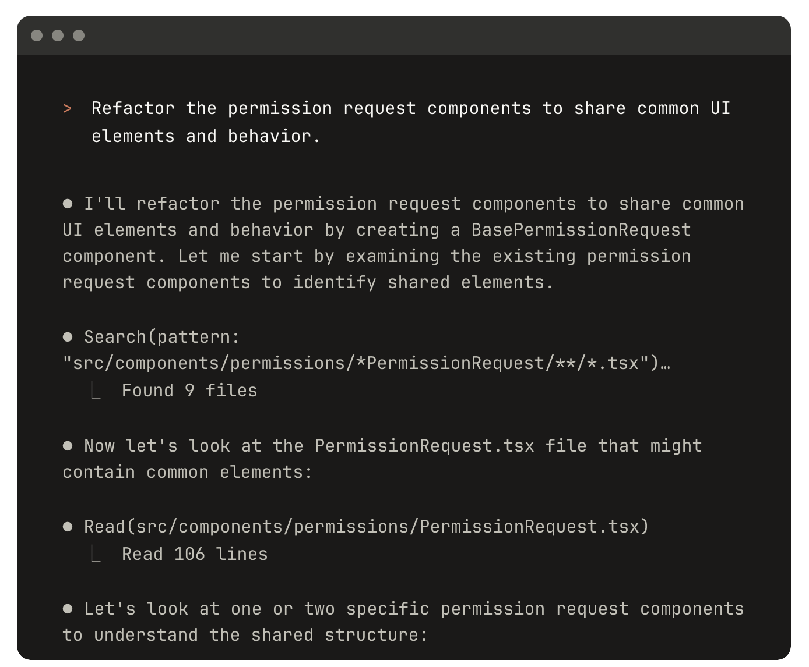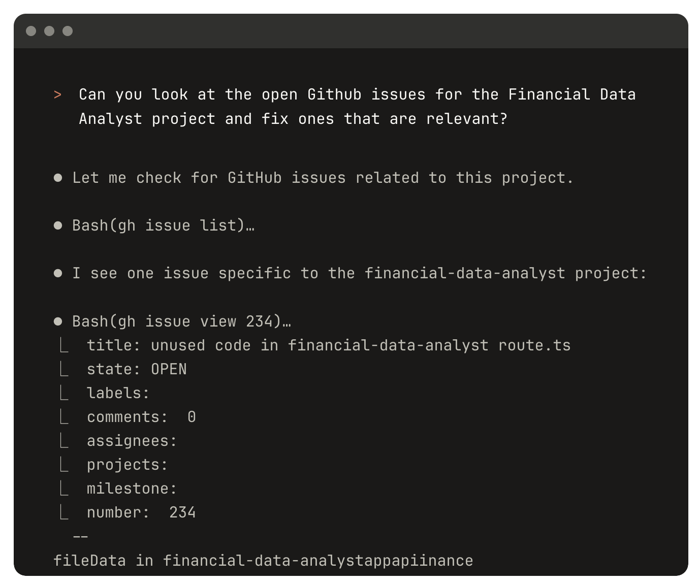

Nếu muốn học Claude Code có hệ thống, tham khảo khoá hợp tác giữa Andrew Ng và Anthropic:  
<https://www.bilibili.com/video/BV176t2zSEpr>

Tiếp theo, ta học cách dùng Claude Code. Vì dùng thẳng Claude Code chính thức chi phí thường rất cao (như hình dưới), ta chuyển sang dùng các API platform tương thích protocol Claude Code nhưng dựa mô hình lớn khác.

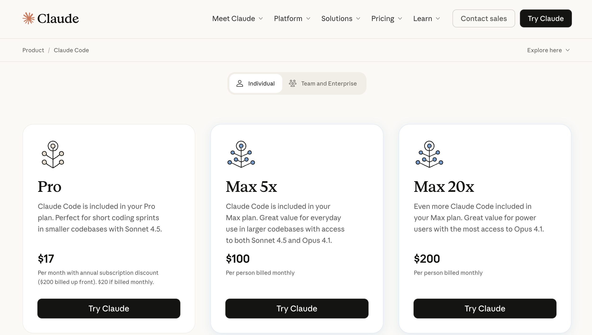

Bạn cần học các giải pháp sau (tốt nhất thử cả), cuối chọn cái hợp bạn nhất làm đường thực hành chính.

Cách 1 là dùng thẳng API "tương thích interface Anthropic". Khi Claude Code phổ biến, nhiều provider mô hình lớn bắt đầu hỗ trợ cách call style Anthropic. Provider phổ biến gồm GLM, Kimi, DeepSeek, Siliconflow... đều cung cấp API tương thích. Config cụ thể sẽ nói chi tiết sau.

Lưu ý Claude Code thường tốn nhiều token, nếu lo chi phí API call quá cao, có thể mua gói tháng GLM (~20 NDT/tháng) để kiểm soát chi phí. Nếu muốn cảm thử chi phí thực, có thể nạp 10 NDT thử nghiệm quy mô nhỏ.

Cách 2 là dùng project "Claude Code Route". Là tool open source, không chỉ hỗ trợ mọi interface API call phổ biến, mà còn cho phép config chi tiết model dùng theo scenario, và hỗ trợ đối tiếp mô hình lớn deploy local. Nhưng config tương đối phức tạp, khuyến nghị bắt đầu từ cách 1.

#### Dùng Zhipu GLM làm backend (khuyến nghị)

GLM (General Language Model) là series mô hình ngôn ngữ lớn do Zhipu AI tự dev. GLM-4.6 là version mới nhất, highlight core là hiệu suất xuất sắc về năng lực code (trong benchmark public và task thực, ngang Claude Sonnet 4, top 1 trong nội địa).

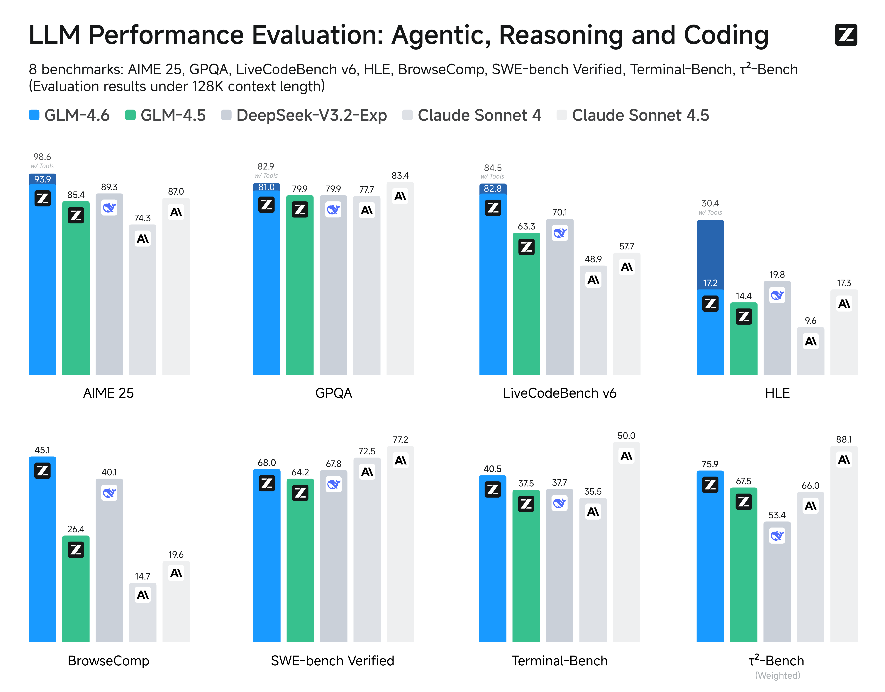

Nó mở rộng context window lên 200K, xử text dài và code lượng lớn thong thả hơn, đồng thời tăng năng lực reasoning và tool call, cân bằng tốt performance và chi phí.

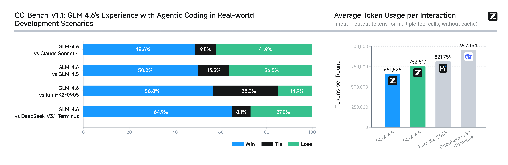

Trước khi tích hợp GLM, cần cài Claude Code trước.

Nếu thấy bước cài command line phiền, hoặc giữa chừng có error, có thể để Agent Trae giúp cài.

```python
# Cài Claude Code
npm install -g @anthropic-ai/claude-code

# Vào project
cd your-awesome-project

# Start Claude Code
claude

# Bấm Ctrl+C để thoát Claude
```

Tiếp theo, cần sửa địa chỉ API request default của Claude Code để hỗ trợ API service GLM. Có thể copy thẳng nội dung dưới, để Trae giúp tạo biến môi trường tương ứng; hoặc chọn ghi vĩnh viễn vào biến môi trường hệ thống (nếu có vấn đề, cũng để Agent giúp sửa).

Đầu tiên, lấy API Key của GLM, save theo cách tiện nhất.

Địa chỉ bản nội địa: <https://bigmodel.cn/usercenter/proj-mgmt/apikeys>  
Địa chỉ bản quốc tế: <https://z.ai/manage-apikey/apikey-list>

Nếu dùng **GLM bản nội địa**, dùng config biến sau:

```python
# Chạy lệnh sau trong Cmd
# Thay `your_zhipu_api_key` bằng API Key bạn vừa lấy
setx ANTHROPIC_AUTH_TOKEN your_zhipu_api_key
setx ANTHROPIC_BASE_URL https://open.bigmodel.cn/api/anthropic
```

Nếu dùng **GLM bản quốc tế**, dùng config sau:

```python
# Chạy lệnh sau trong Cmd
# Cũng nhớ thay `your_zai_api_key`
setx ANTHROPIC_AUTH_TOKEN your_zai_api_key
setx ANTHROPIC_BASE_URL https://api.z.ai/api/anthropic
```

Có thể nhập prompt kiểu sau thẳng vào Trae:

⚠️ Nếu bạn qua Trae giúp config "biến môi trường vĩnh viễn", sau config xong **phải restart Trae**, không thì biến môi trường trong terminal built-in của nó sẽ không update, có thể fail login hoặc lỗi kết nối mạng.

```python
Based on my environment variable settings:
setx ANTHROPIC_AUTH_TOKEN your_zai_api_key
setx ANTHROPIC_BASE_URL https://api.z.ai/api/anthropic

and my key(Replace it with your own key):
681fea485851d29060cc.13gfaendggaFOhb

please help me configure and start Claude Code
```

Bạn sẽ thấy output process kiểu sau:

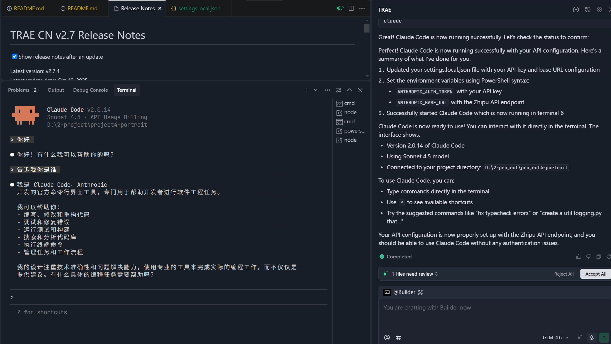

> 💡 Biến môi trường là gì?
>
> Biến môi trường bản chất là 1 nhóm "key-value" config info lưu trong OS, thường dạng "tên biến = giá trị cụ thể". Chỉ cần config trước trong terminal hoặc setting hệ thống, program có thể đọc các biến này lúc nào cũng được. Vì biến môi trường có thể ghi thẳng trong terminal mà không cần sửa code, ta thường lưu key cần để access mô hình lớn trong biến môi trường, tránh lộ. Program chỉ cần đọc biến môi trường tương ứng là call được mô hình lớn.
>
> Trên Windows, biến môi trường ngoài lưu key mô hình lớn, còn hay lưu "đường call" của command line tool.
>
> Terminal cũng là 1 program. Đôi khi muốn start 1 program external trong terminal, ví dụ gõ `claude` trong terminal để start Claude Code. Lý do gõ `claude` chạy thẳng được là terminal đọc biến môi trường hệ thống, biến PATH chứa thư mục có file executable Claude Code, terminal tìm được và execute (tương đương paste absolute path program rồi enter).
>
> 1 biến môi trường điển hình kiểu: `PATH=C:\Windows\system32;C:\Program Files\Python`. Vậy ta execute được các program này ở mọi path, ví dụ gõ `python` ở command line start Python interpreter.
>
> Muốn xem biến môi trường hệ thống hiện tại, gõ "biến môi trường" trong Windows search, trong popup "Sửa biến môi trường hệ thống" thấy mọi biến và value. Có biến lưu key mô hình lớn, có biến thêm thư mục program, tiện call ở mọi path.

Giờ bạn có thể dùng GLM mới nhất để dev Claude Code. Có thể thử chạy lại project trước, hoặc thử lại các task Trae chưa hoàn thành tốt, so sánh khác biệt trải nghiệm.

🎉 Liên tục "làm lại từ đầu" không phải tốn thời gian — mỗi lần làm lại, kỹ năng vững thêm 1 chút.

Cùng tư duy với GLM, cũng dễ dàng tích hợp các interface tương thích format Anthropic khác.

#### Dùng Kimi K2 làm backend (khuyến nghị)

Kimi K2 là mô hình ngôn ngữ lớn thế hệ mới của Moonshot AI, hiệu suất xuất sắc về hiểu code và gen. Kimi K2 hỗ trợ context window cực dài (tối đa 200K tokens), dễ dàng xử code base lớn và project phức tạp.

**Ưu thế core:**

- **Context cực dài**: 200K context window, xử cả project code 1 lần
- **Năng lực code mạnh**: gen, refactor, debug code xuất sắc
- **Hiểu tiếng Trung tốt**: hiểu nhu cầu lập trình tiếng Trung chính xác hơn
- **Tool call ổn định**: hỗ trợ function call và tool call ổn định

**Lấy API Key:**

Truy cập <https://platform.moonshot.cn/console/account> đăng ký và lấy API Key.

**Cách config:**

Doc tham khảo: <https://platform.moonshot.cn/docs/guide/agent-support>

```bash
export ANTHROPIC_BASE_URL=https://api.moonshot.cn/anthropic
export ANTHROPIC_AUTH_TOKEN=sk-YOURKEY
```

#### Dùng Minimax làm backend (khuyến nghị)

Minimax là mô hình ngôn ngữ lớn thế hệ mới của MiniMax, hiệu suất xuất sắc trong task lập trình. Mô hình Minimax nổi tiếng năng lực reasoning xuất sắc và chất lượng gen code, đặc biệt hợp scenario lập trình phức tạp.

**Ưu thế core:**

- **Năng lực reasoning mạnh**: xuất sắc về reasoning logic phức tạp và thiết kế kiến trúc code
- **Chất lượng code cao**: code gen ra cấu trúc rõ, dễ đọc
- **Hỗ trợ đa ngôn ngữ**: hỗ trợ gen và chuyển đổi code nhiều ngôn ngữ lập trình
- **Tốc độ response nhanh**: tốc độ API nhanh, hợp scenario call tần suất cao

**Lấy API Key:**

Truy cập <https://platform.minimax.io/> đăng ký và lấy API Key.

**Cách config:**

```bash
export ANTHROPIC_BASE_URL=https://api.minimax.io/anthropic
export ANTHROPIC_AUTH_TOKEN=YOUR_MINIMAX_API_KEY
export ANTHROPIC_MODEL=MiniMax-M2.7
```

#### Dùng DeepSeek làm backend (khuyến nghị)

DeepSeek là mô hình ngôn ngữ lớn open source của Deep Seek, được dev yêu chuộng vì năng lực code xuất sắc và tỉ lệ giá-trị cao. DeepSeek Coder được tối ưu chuyên cho task lập trình.

**Ưu thế core:**

- **Năng lực code nổi bật**: gen code, hiểu code, fix bug xuất sắc
- **Open source custom được**: model open source, fine-tune theo nhu cầu
- **Tỉ lệ giá-trị cao**: giá API tương đối thấp, hợp dùng tần suất cao
- **Hỗ trợ tiếng Trung tốt**: hiểu scenario lập trình tiếng Trung chính xác

**Lấy API Key:**

Truy cập <https://platform.deepseek.com/usage> đăng ký và lấy API Key.

**Cách config:**

```bash
export ANTHROPIC_BASE_URL=https://api.deepseek.com/anthropic
export ANTHROPIC_AUTH_TOKEN=YOU_DEEPSEEK_API_KEY
export API_TIMEOUT_MS=600000
export ANTHROPIC_MODEL=deepseek-chat
export ANTHROPIC_SMALL_FAST_MODEL=deepseek-chat
export CLAUDE_CODE_DISABLE_NONESSENTIAL_TRAFFIC=1
```

#### Dùng Volcano Engine Coding Plan làm backend (khuyến nghị)

Volcano Engine là platform cloud service của ByteDance, cung cấp service mô hình AI cấp doanh nghiệp. Coding Plan của Volcano Engine tối ưu chuyên cho scenario lập trình, cung cấp năng lực gen code ổn định, hiệu quả.

**Ưu thế core:**

- **Ổn định cấp doanh nghiệp**: cung cấp SLA, đảm bảo độ ổn định service
- **Tối ưu scenario code**: tối ưu chuyên cho task lập trình
- **Lựa chọn model phong phú**: hỗ trợ nhiều model — Doubao-pro, Doubao-lite...
- **Truy cập nội địa nhanh**: deploy node nội địa, tốc độ truy cập nhanh

**Lấy API Key:**

Truy cập <https://console.volcengine.com/ark/region:ark+cn-beijing/apiKey> đăng ký và lấy API Key.

**Cách config:**

```bash
export ANTHROPIC_BASE_URL=https://ark.volces.com/api/anthropic
export ANTHROPIC_AUTH_TOKEN=YOUR_VOLCANO_API_KEY
export ANTHROPIC_MODEL=doubao-pro-32k
```

#### Các API tương thích Anthropic khác

Siliconflow:

```bash
export ANTHROPIC_BASE_URL="https://api.siliconflow.cn/"
export ANTHROPIC_MODEL="moonshotai/Kimi-K2-Instruct-0905"    # Có thể tự sửa model cần
export ANTHROPIC_API_KEY="YOUR_SILICONCLOUD_API_KEY"    # Thay API Key
```

Alibaba Cloud DashScope (Aliyuncs): <https://help.aliyun.com/zh/model-studio/get-api-key>

```python
export ANTHROPIC_BASE_URL="https://dashscope.aliyuncs.com/apps/anthropic"
export ANTHROPIC_API_KEY="YOUR_DASHSCOPE_API_KEY"
```

::: details Dùng Claude Code Route làm backend (cách nâng cao)

Ở trên ta đã giải thích cách dùng API GLM chính thức thay interface Anthropic của Claude Code. Tiếp theo, xem tool Claude Code Router làm Claude Code thích ứng nhiều model API hơn thế nào.

[Claude Code Router](https://github.com/musistudio/claude-code-router) là tool router smart enhancement chuyên cho Claude Code. Tác dụng core là giúp user phân phối request AI theo nhu cầu tới các model trên platform khác, có thể custom cao. Hỗ trợ tích hợp hàng chục platform — OpenRouter, DeepSeek, Ollama, Gemini... cũng route task theo scenario tới model đặc thù — GLM-4.5, Kimi-K2, Qwen3-Coder. Ví dụ, bạn có thể giao task backend cho Ollama local tự động để tiết kiệm chi phí; task text dài/code dài giao Gemini-2.5-Pro; giải code giao DeepSeek.

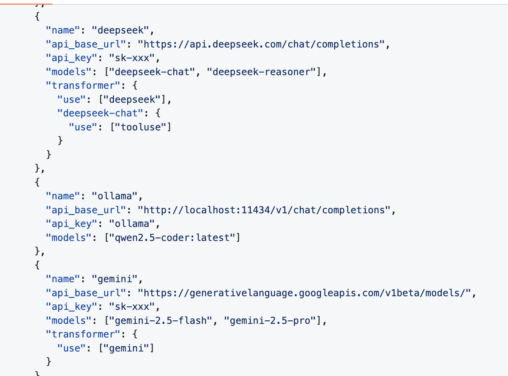

Tool còn cung cấp khả năng quản config UI/CLI tiện, và qua "converter" thích ứng format API các platform khác. Hỗ trợ tích hợp tự động hoá GitHub Actions và custom extension, giải quyết vấn đề "1 model không cover hết scenario" và "switch platform thường xuyên rất phiền", giúp user dùng tool AI linh hoạt, chi phí thấp hơn.

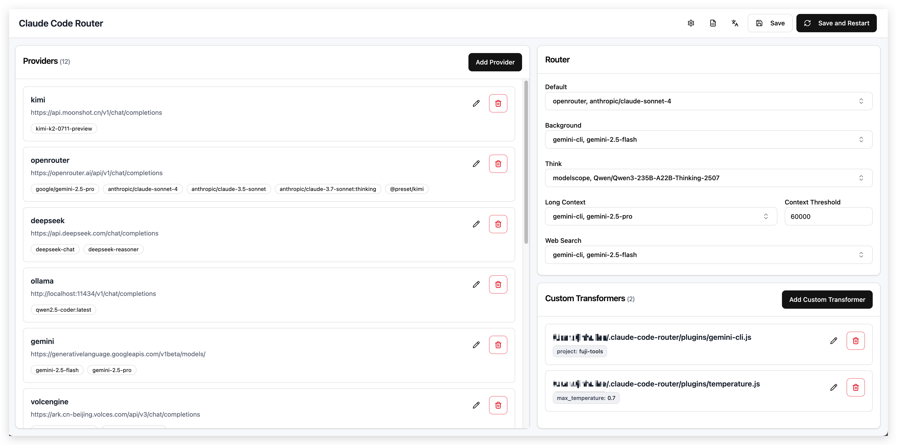

Dưới ta giới thiệu đơn giản cách cài Claude Code Router. Đại khái cần các bước sau (cũng để Trae giúp execute), chuẩn bị môi trường liên quan:

```markdown
npm install -g @anthropic-ai/claude-code
npm install -g @musistudio/claude-code-router
```

Cài xong, cần xác nhận local dùng được lệnh `ccr`. Nếu thấy output kiểu dưới, là cài thành công:

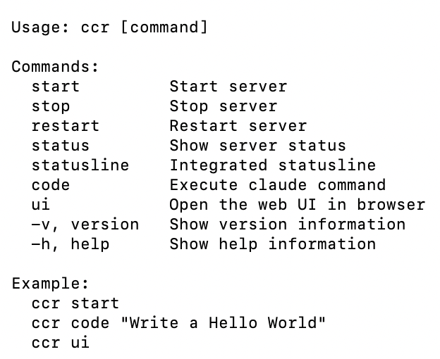

Tiếp, có 2 cách init và config model:

- Dùng UI có sẵn của CCR, mở page config nó cung cấp trong browser để thao tác;
- Sửa thẳng file config default của CCR (bản chất UI cũng sửa file config, chỉ là cung cấp giao diện trực quan hơn).

Nếu chọn dùng CCR UI, sẽ thấy giao diện kiểu sau:

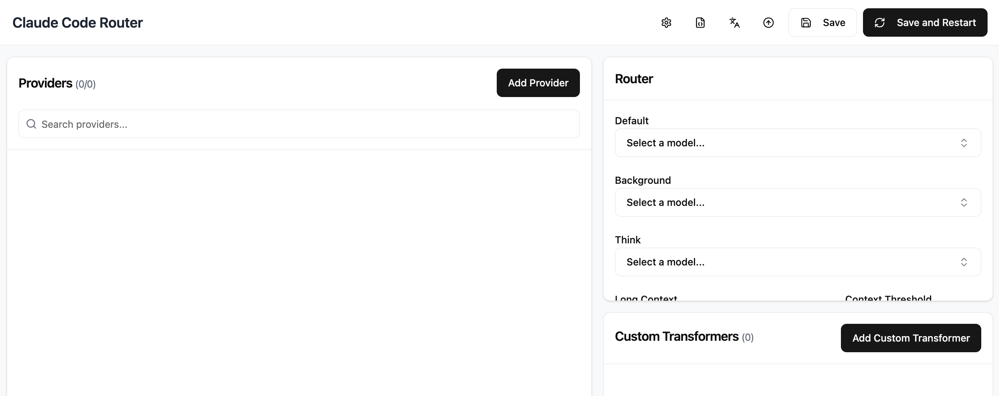

Lúc này bấm "Add Provider", sẽ thấy giao diện sau. Bạn cần:

1. Trong Name nhập tên provider model;
2. Trong API Full URL điền địa chỉ interface tương thích OpenAI của provider đó;
3. Trong API Key điền API Key platform tương ứng;
4. Trong khu Models điền tên model, bấm "Add Model" để add;
5. Cuối bấm "Save" lưu config.

(Cuộn xuống còn nhiều option nâng cao, hiện tại tạm bỏ qua.)

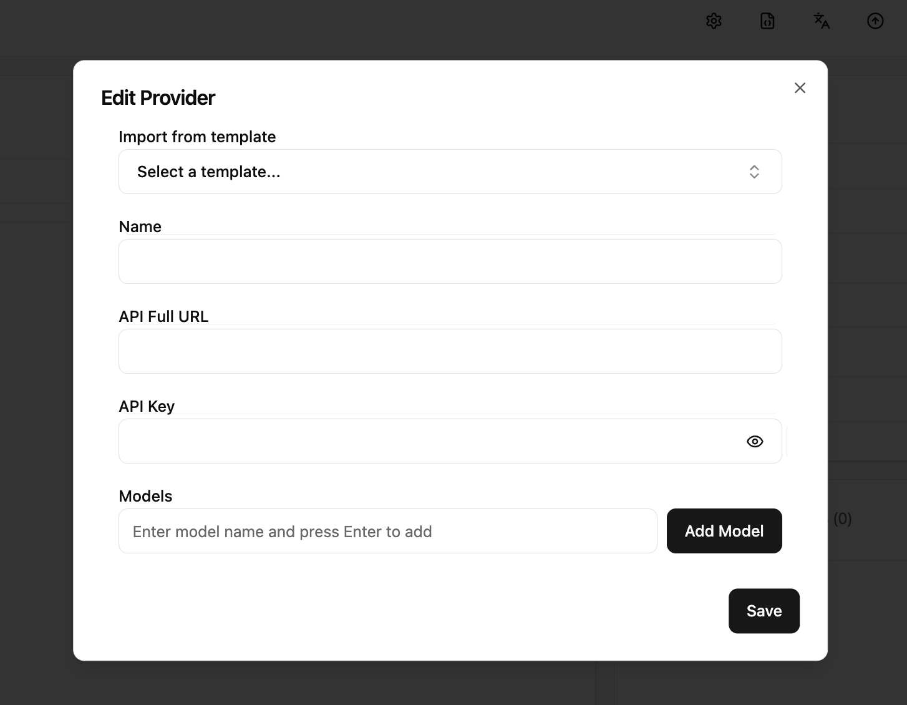

Dưới là ví dụ config DeepSeek và Kimi:

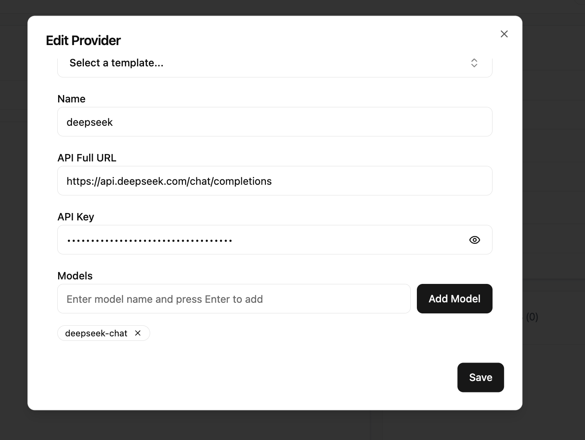

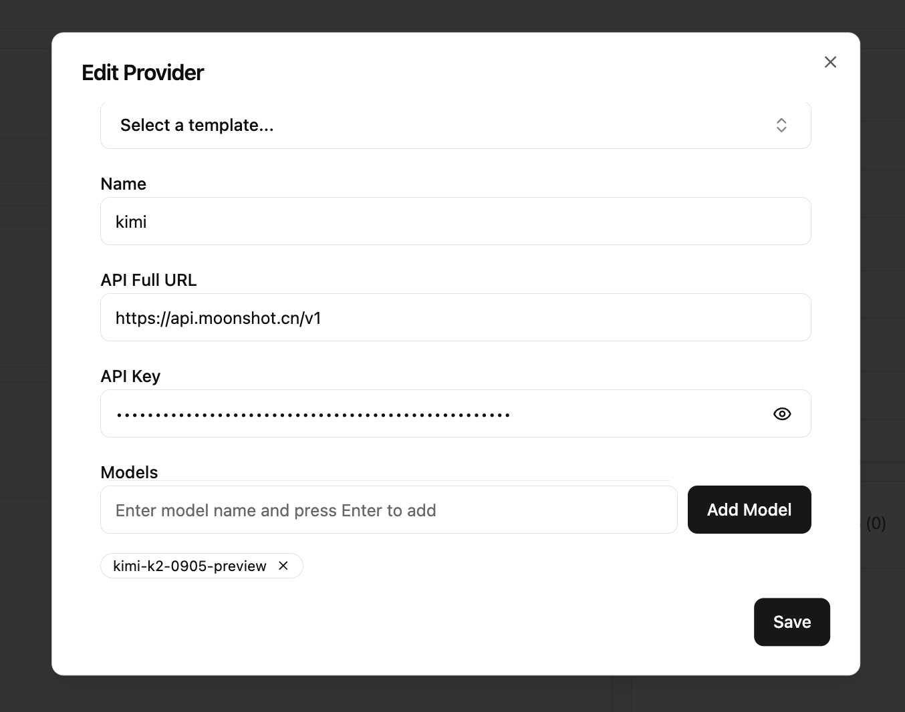

Sau lưu config model, còn cần chỉ định model default trong khu Router bên phải. Bấm dropdown tương ứng, set thành `kimi` (khuyến nghị), rồi bấm `Save and Restart` góc trên phải.

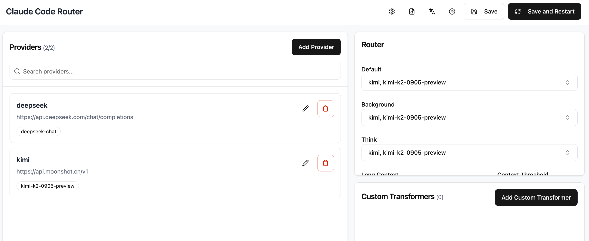

Sau đó, chỉ cần gõ `ccr code` trong terminal là start được workflow coding Claude Code qua Claude Code Router.

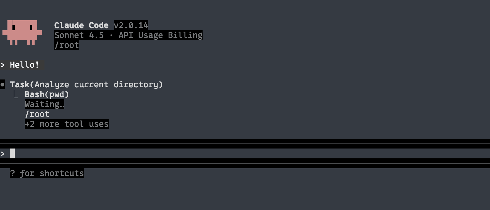

:::

#### Cách dùng nâng cao Claude Code

Nhiều người mới dùng Claude Code chỉ coi như tool chat thường. Nhưng thực ra, nó built-in nhiều năng lực phong phú để bạn dùng hiệu quả, linh hoạt hơn. Vài lệnh và ví dụ dùng phổ biến:

Doc tham khảo:

<https://docs.claude.com/en/docs/claude-code/cli-reference>  
<https://docs.claude.com/en/docs/claude-code/slash-commands>

| Lệnh | Tác dụng | Ví dụ |
| --- | --- | --- |
| claude | Start mode tương tác | `claude` |
| claude "query" | Execute task 1 lần và output kết quả | `claude "explain this project"` |
| claude -p "query" | Execute câu hỏi 1 lần, kết thúc tự thoát | `claude -p "explain this function xxxx"` |
| claude -c | Tiếp session gần nhất | `claude -c` |
| claude -r | Khôi phục session trước | `claude -r` |
| /resume | Trong chat hiện tại switch về session trước | `claude -c`, `/resume` |
| /plugin | Quản plugin, cài năng lực submit và review extension | `/plugin` |
| /init | Init project intro bằng CLAUDE.md | `/init` |
| /clear | Clear context session hiện tại, tránh info overload | `/clear` |
| /compact | Nén history session, giảm token context | `/compact` |
| /cost | Xem chi phí hiện tại | `/cost` |
| /model | Switch model dùng (dùng API tương thích thường bỏ qua) | `/model` |
| /memory | Quản file memory CLAUDE.md | |
| /help | Hiện list lệnh có sẵn | `/help` |
| exit hoặc Ctrl+C | Thoát Claude Code | `exit` hoặc `Ctrl+C` |
| /agents | Function nâng cao, sẽ nói sau | |
| /mcp | Function nâng cao, sẽ nói sau | |

**CLAUDE.md**

Tham khảo: <https://www.anthropic.com/engineering/claude-code-best-practices>

`CLAUDE.md` là file đặc biệt Claude tự đọc và add vào context khi bắt đầu chat. Vì vậy, rất hợp dùng để ghi:

- Các bash command thường dùng
- File core và util function
- Quy ước style code
- Cách test
- Quy chuẩn cộng tác repo (đặt tên branch, dùng merge hay rebase...)
- Mô tả config môi trường dev (có dùng pyenv không, compiler khuyến nghị...)
- Behavior hoặc hố cần chú ý trong project
- Bất kỳ info bạn muốn Claude "nhớ"

Bản thân `CLAUDE.md` không có yêu cầu format bắt buộc, chỉ cần ngắn gọn, dễ đọc cho người. Ví dụ:

```
# Bash commands
- npm run build: Build the project
- npm run typecheck: Run the typechecker

# Code style
- Use ES modules (import/export) syntax, not CommonJS (require)
- Destructure imports when possible (eg. import { foo } from 'bar')

# Workflow
- Be sure to typecheck when you're done making a series of code changes
- Prefer running single tests, and not the whole test suite, for performance
```

#### Nguyên lý nội bộ Claude Code

Tham khảo: <https://github.com/shareAI-lab/analysis_claude_code>

Nếu bạn tò mò vì sao Claude Code trong nhiều scenario dùng tốt hơn Trae hoặc Cursor và các Agent coding tool, xem qua cơ chế làm việc nội bộ.

Cách implement tổng thể của các CLI AI coding tool khác cũng tương tự.

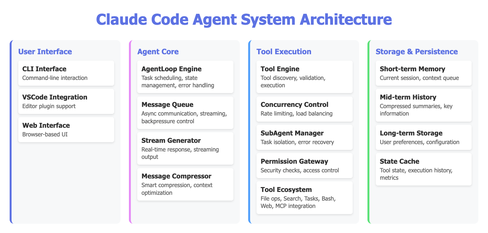

Claude Code tách task lập trình thành loop liên tục "cảm-nghĩ-hành-verify", trong đó call các tool khác để hoàn thành task. Nó bắt chước workflow dev người: liên tục "viết code → chạy → xem kết quả → cải thiện tiếp". Bên trong qua main task loop liên tục execute step. Mỗi vòng, Claude call các tool khác — đọc/ghi file, execute lệnh, search code... — rồi theo kết quả thực tế tool trả về quyết bước tiếp.

Có vài đặc tính then chốt đáng chú ý:

- **Stream Processing**: Claude vừa nghĩ vừa output kết quả, không phải đợi mọi code viết xong mới execute.
- **Intelligent Compression**: chat dài dễ làm context quá dài. Claude qua nén history thành info then chốt giảm xác suất "quên", và phân biệt long-term/short-term memory đảm bảo chạy hiệu quả.
- **Concurrency Control**: thiết kế parallel nội bộ cho nhiều task song song không cản nhau.
- **Sub-agent Management**: trong làm việc thực không chỉ tương đương 1 "role" xử mọi việc, bạn có thể quản nhiều sub agent cộng tác xử code, mỗi Agent phụ trách task khác — chuyên test, chuyên viết doc...

### Codex

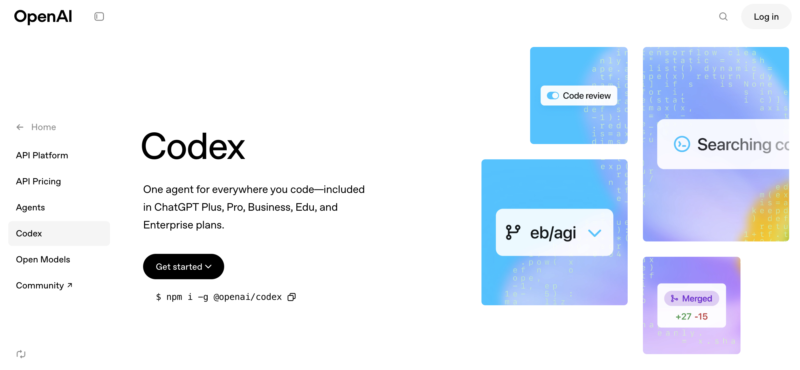

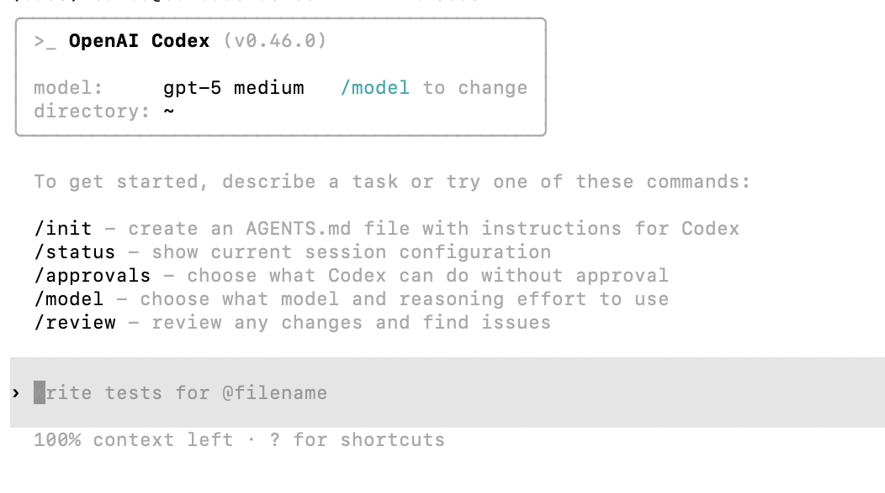

Giống Claude Code, Codex là tool AI cộng tác lập trình do OpenAI dev, có thể hiểu là "Claude Code phiên bản OpenAI". Ưu thế lớn nhất là thích ứng GPT-5 hiệu quả.

Từ trải nghiệm thực, GPT-5 hiện response nhanh hơn, tỉ lệ sai thấp hơn (xác suất hoàn thành đúng trong task multi-round phức tạp cao hơn). 1 nhược điểm là giải thích thường nghiêng "học thuật" và "kỹ thuật", đôi khi quá nghiêm, info nhiều, với newbie có thể hơi khó.

Cài Codex qua lệnh:

```
npm i -g @openai/codex
```

#### Dùng OpenAI API chính thức làm backend

Nếu dùng entry Codex chính thức của OpenAI, config rất đơn giản: khi đã có subscription OpenAI hoặc apply được API quota tương ứng, chỉ cần gõ `codex` ở command line để start program và theo prompt login.

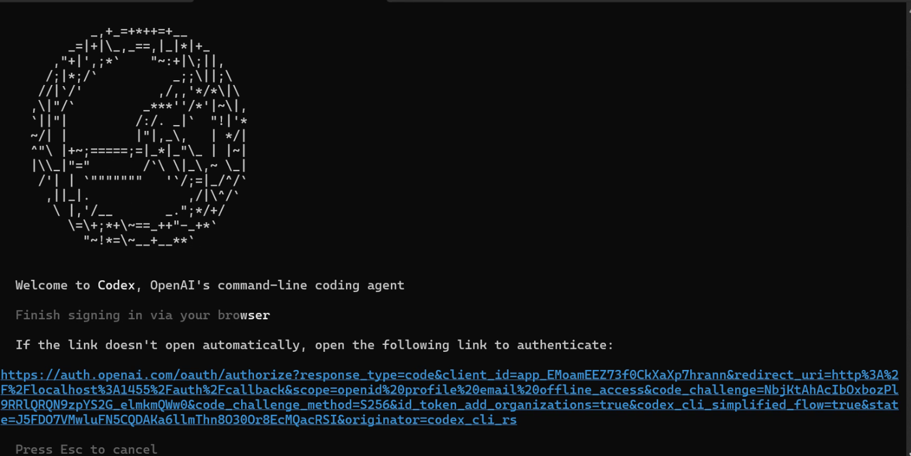

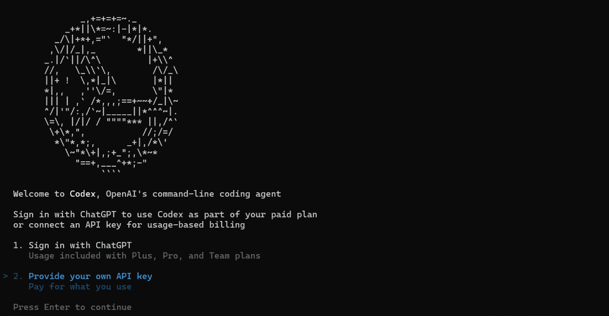

#### Dùng cách forward OpenAI API làm backend

Vì OPENAI API chính thức có thể giá cao, yêu cầu mạng nghiêm, để tránh các giới hạn này, cũng có thể qua service API gateway khác forward call.

Theo cách này, chỉ cần mua quota Codex API tương ứng trên platform forward bên 3, có thể trải nghiệm gần native OpenAI Codex.

Tham khảo: <https://open-dev.feishu.cn/wiki/PAqUwWG4IiuwTvkQ2sGcaQuPnXc>  
Địa chỉ nạp: <https://api.zyai.online/account/topup/recharge>

Lưu ý sau khi có token quota, còn cần config API Key ở local.

Trong setting nhóm key, chú ý chọn cái chuyên cho Codex.

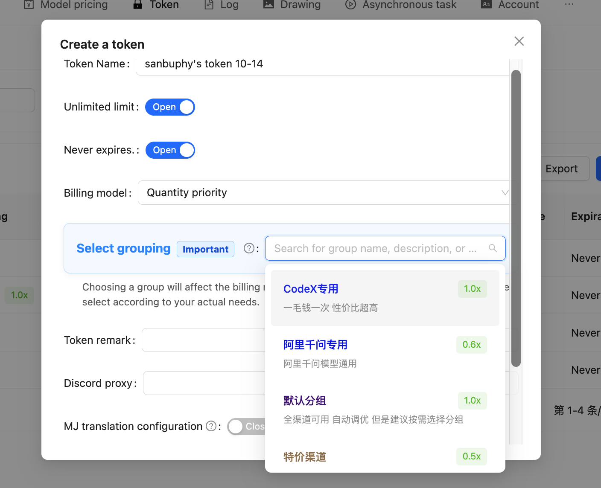

Tiếp, điền Key đã lấy vào prompt dưới, đưa nguyên đoạn cho Trae để giúp hoàn thành config:

````bash
My API key is: [Paste your obtained sk-xxxxx key here]

Please help me complete the following configuration tasks:

1. Create configuration directory
   - Create a `.codex` folder under my user directory
   - Windows path should be: `C:\Users\[My Username]\.codex`
2. Backup existing configuration (if exists)
   - Check if `.codex\config.toml` exists
   - If it exists, rename it to `config.toml.bak.[current timestamp]` (timestamp format: yyyyMMddHHmmss)
3. Create configuration file
   - Create `config.toml` in the `.codex` directory
   - Write the following complete content:
   ```toml
   preferred_auth_method = "apikey"

   [model_providers.myrelay]
   name = "My Relay Station"
   base_url = "https://api.zyai.online/v1"
   env_key = "MYRELAY_API_KEY"
   wire_api = "responses"
   request_max_retries = 4
   stream_max_retries = 10
   stream_idle_timeout_ms = 300000

   [profiles.myrelay]
   model_provider = "myrelay"
   model = "gpt-5"
   model_reasoning_effort = "medium"

   [tools]
   web_search = true

4. Set system environment variable
Variable name: MYRELAY_API_KEY
Variable value: The key I gave you

5. Confirm completion and report back:

The full path of the configuration file
Whether the environment variable was set successfully
I can use the command `codex --profile myrelay` to run it
````

Sau config, bạn start Codex dùng forward API qua `codex --profile myrelay`. Cách dùng sau giống Claude Code: chỉ nhập ý và nhu cầu vào khung chat lúc nào cũng được.

### OpenCode

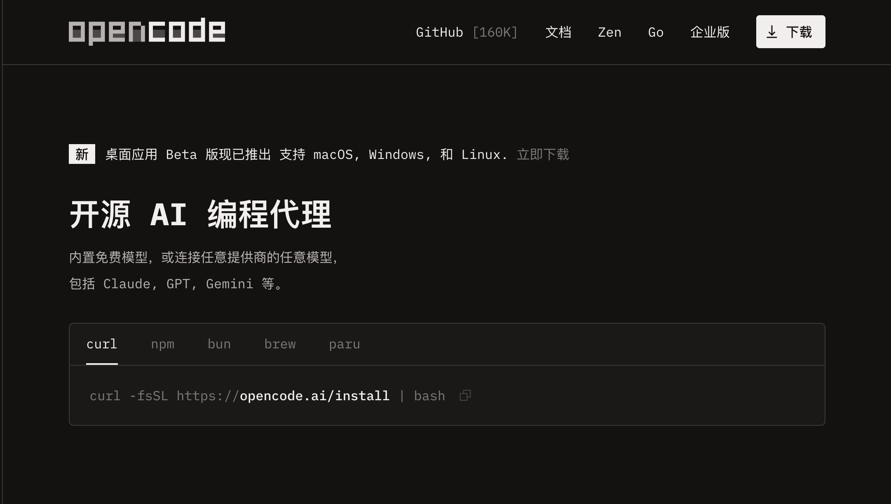


OpenCode là platform AI Coding Agent open source hướng dev, định vị giống "Claude Code multi-model". Entry tương tác chính là Terminal, đồng thời hỗ trợ integration editor (VS Code, Neovim...), tích hợp sâu code repo local, qua ngôn ngữ tự nhiên hoàn thành full flow từ hiểu code đến execute engineering.

Không phải tool AI coding bind 1 model, mà là platform AI Coding Agent mở switch tự do GPT, Claude, Gemini và cả model local. Ngay OpenAI chính thức cũng giữ OpenCode tích hợp Codex/OpenAI subscription.


Cài OpenCode qua lệnh:

```bash
# Linux / Unix
curl -fsSL https://opencode.ai/install | bash

# Windows
npm i -g opencode-ai
```

#### Dùng model free trong OpenCode

Trong OpenCode thỉnh thoảng cung cấp model free để dùng, config rất đơn giản. Ở vị trí cần dùng OpenCode, gõ `opencode` ở command line start program OpenCode vào chat panel. Gõ `/models` search keyword "free" sẽ thấy model có chữ "free".

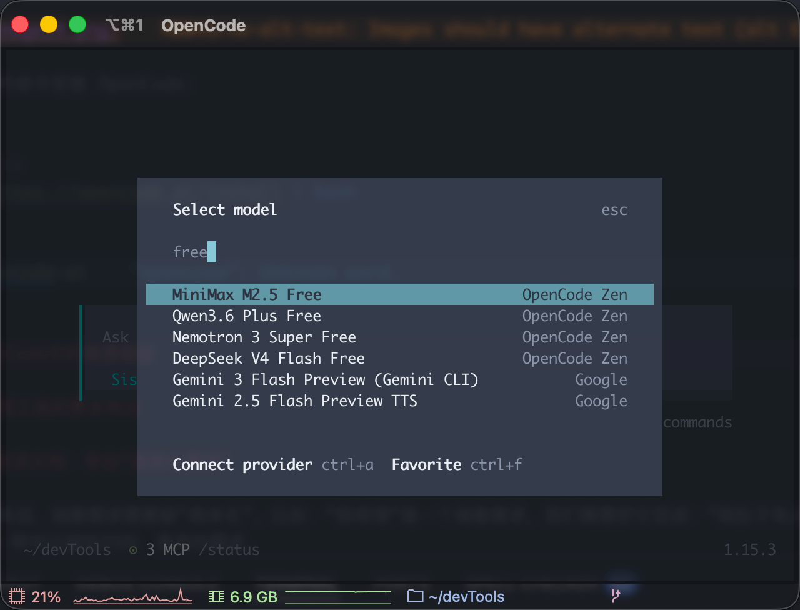

Thường, model free hoàn thành task code chậm hơn model trả phí/subscription, tuỳ thuộc model line có nghẽn không, có phải peak time hay không, và năng lực model.

#### Dùng model bên 3 làm coding model chính của OpenCode

Đây là ưu thế core của OpenCode — trong cùng điều kiện MCP, Skills, context, cho bạn switch tự do model để hoàn thành task code khác. Dưới lấy GPT-5.3 Codex chính thức của OpenAI làm ví dụ, tích hợp OpenCode làm coding model chính.

Trong chat OpenCode gõ `/connect`, chọn lệnh liên quan nhất đầu tiên rồi enter, có thể chọn auth provider model bên 3.


Ở đây chọn OpenAI làm ví dụ, enter chọn cách auth.

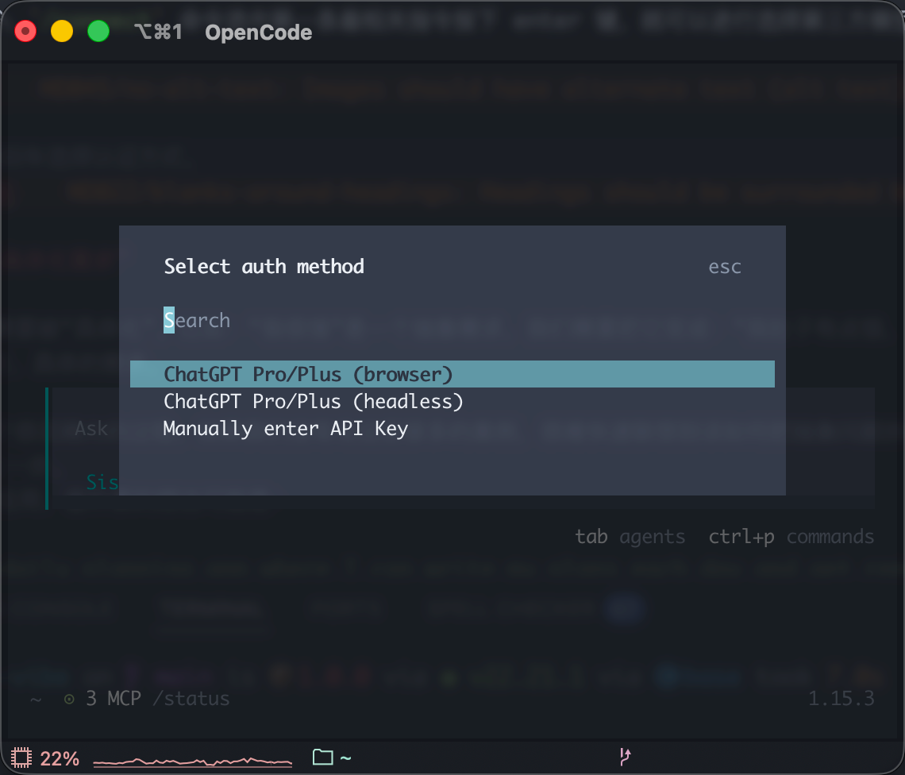

Chọn cái nào cũng được, chỉ khác cách auth. Ở đây chọn cách 1 login qua browser.

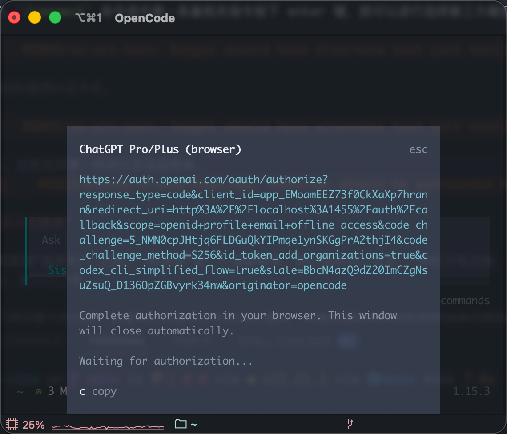

Copy link này sang browser thao tác login OpenAI bình thường, sau khi browser hiện Authorization Successful, client OpenCode tự nhảy sang giao diện chọn model OpenAI.

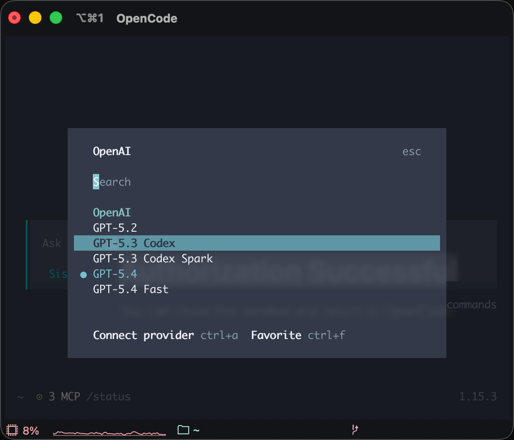

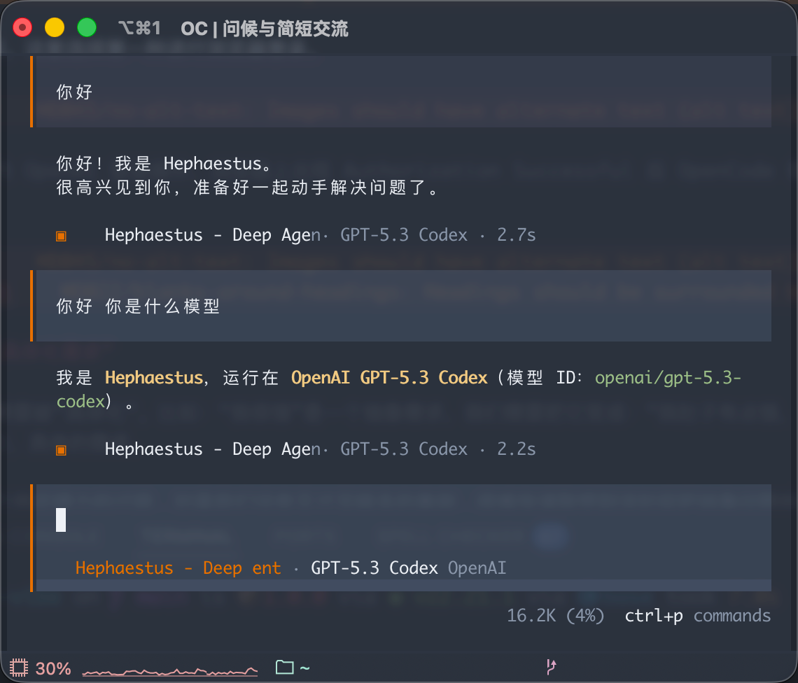

#### Cài plugin Oh My OpenAgent

OpenCode còn mạnh ở có hệ sinh thái community rất năng động, search trên Github được rất nhiều plugin liên quan OpenCode. Nếu OpenCode là tool AI cộng tác switch model tuỳ ý, thì Oh-My-OpenAgent là "hệ thống chỉ huy AI multi-Agent" chạy trên OpenCode. Nó tách 1 task phức tạp thành nhiều sub-task giao các model khác làm phần việc của mình.


Copy đoạn dưới paste vào model đã config trong OpenCode trên để cài OpenCode.

```text
Install and configure oh-my-openagent by following the instructions here:
https://raw.githubusercontent.com/code-yeongyu/oh-my-openagent/refs/heads/dev/docs/guide/installation.md
```

Dưới là đặc tính và mô tả function Oh-My-OpenAgent.

| Đặc tính | Mô tả function |
| :-------------------------------------------------------------- | :------------------------------------------------------------------------------------------------------------------------------------------------------------------------ |
| **Discipline Agents** | Sisyphus chịu trách nhiệm dispatch Hephaestus, Oracle, Librarian và Explore. Đội AI dev đầy đủ parallel work. |
| **Team Mode** (v4.0, bật chọn lọc) | Leader Agent + tối đa 8 thành viên parallel, tmux realtime visualization, tool family `team_*` chuyên. Drive `hyperplan` (5 reviewer thù địch) và `security-research` (3 hunter + 2 PoC engineer). [Doc →](docs/guide/team-mode.md) |
| **`ultrawork` / `ulw`** | 1 click trigger, mọi smart agent ra trận. Task không xong không thôi. |
| **[IntentGate](https://factory.ai/news/terminal-bench)** | Trước khi thật sự hành động, phân tích intent thật của user. Hết kiểu AI hiểu nhầm nghĩa đen rồi nói nhảm. |
| **Tool edit dựa hash** | Mỗi sửa đổi verify qua `LINE#ID` content hash, 0% sửa sai. Cảm hứng từ [oh-my-pi](https://github.com/can1357/oh-my-pi). [The Harness Problem →](https://blog.can.ac/2026/02/12/the-harness-problem/) |
| **LSP + AST-Grep** | Rename ở mức workspace, diagnose trước build, rewrite dựa AST. Cho Agent độ chính xác cấp IDE. |
| **Smart agent backend** | Bắn cùng lúc 5+ expert parallel work. Giữ context sạch, lấy thành quả lúc nào cũng được. |
| **MCP built-in** | Exa (web search), Context7 (doc chính thức), Grep.app (search source GitHub). Mặc định bật. |
| **Ralph Loop / `/ulw-loop`** | Closed loop tự reference. Không đạt 100% completion là không dừng. |
| **Cưỡng chế Todo** | Agent muốn lười? Hệ thống kéo cổ áo lôi về. Task của bạn, phải xong. |
| **Reviewer comment** | Loại comment thừa nồng mùi AI. Viết code như senior engineer dày dạn. |
| **Tích hợp Tmux** | Hỗ trợ terminal tương tác đầy đủ. Chạy REPL, dùng debugger, dùng tool TUI, mọi thứ trong session realtime. |
| **Tương thích Claude Code** | Hooks, command, skill, MCP và plugin hiện tại? Migrate mượt hết. |
| **MCP nhúng skill** | Skill mang theo MCP server cần. Bật theo nhu cầu, không làm vỡ context window. |
| **Prometheus planner** | Trước khi viết code, qua interview mode lập kế hoạch chiến lược. |
| **`/init-deep`** | Auto gen `AGENTS.md` ở mọi cấp folder project. Không chỉ tiết Token, còn tăng đáng kể hiểu của Agent. |

Sisyphus (claude-opus-4-7 / kimi-k2.6 / glm-5.1) là tổng chỉ huy chính của bạn. Phụ trách lập kế hoạch, phân task cho team expert, và push task đến hoàn thành bằng strategy parallel cực mạnh. Không bao giờ làm nửa chừng.

Hephaestus (gpt-5.5) là worker tự lập sâu của bạn. Chỉ cần đưa mục tiêu, đừng đưa cách làm cụ thể. Tự khám phá pattern code base, execute task từ đầu đến cuối độc lập, không bao giờ bắt bạn làm bảo mẫu giữa chừng. Đúng là thợ thủ công xịn.

Prometheus (claude-opus-4-7 / kimi-k2.6 / glm-5.1) là strategic planner của bạn. Qua interview mode, trước khi động 1 dòng code, qua hỏi xác định scope và xây kế hoạch execute chi tiết.

Hiểu xong, bạn dùng OpenCode đã cài Oh-My-OpenAgent hoàn thành task code.

## Thêm cách dùng CLI AI coding tool

### Dùng AI viết PRD: học "cụ thể hoá nhu cầu"

Với mô hình ngôn ngữ lớn, nhu cầu trừu tượng cần được "cụ thể hoá". Ví dụ: "Tôi đói" là nhu cầu trừu tượng, cần biến thành: "Bụng tôi hơi đói, có thể cần ăn 1 bánh đậu đỏ, kèm 1 cốc sữa đậu." — đây mới là nhu cầu cụ thể có thể execute.

Nhưng biến nhu cầu trừu tượng thành cụ thể là quá trình rất tốn sức. Nếu chưa thấy đủ nhiều case, khó liên tưởng nhanh cách tách vấn đề trừu tượng thành module chi tiết. Lúc này, cách tốt nhất là để AI giúp bước "cụ thể hoá".

Ví dụ tôi muốn dev app "lịch hằng ngày", ý tưởng giản dị nhất:

`Please help me write a daily planning app where I can write my plans each day and get reminders.`

AI thật sự có thể trên nền nhu cầu này tách task ngay rồi hoàn thành từng bước, nhưng giữa chừng dễ sai hoặc hiểu lệch. Để giảm rủi ro, để AI giúp mở rộng nhu cầu trước:

`Based on my needs, please elaborate and provide a more detailed Product Requirement Document for reference. My idea is: Please help me write a daily planner app that supports daily plan-writing and provides reminders .`

Lúc này AI có thể cho 1 PRD đầy đủ kiểu sau (đoạn dưới giữ nguyên tiếng Anh — ví dụ PRD do AI gen):

```
Product Requirements Document (PRD): "Today's Plan" App
(Document đầy đủ với version, target users, user stories, feature breakdown, non-functional requirements, roadmap — xem nguyên gốc)
```

So với câu ban đầu "giúp tôi viết app ghi lịch và nhắc mỗi ngày", giờ tài liệu này đã chi tiết hơn nhiều. Bạn có thể theo nhu cầu thật điều chỉnh, thêm bớt; với module chưa chắc, để AI cung cấp thêm option và bạn chọn, ghép thành bản cuối.

Qua cách này, ta dễ dàng biến ý trừu tượng thành mô tả cụ thể. Với dev AI, "cụ thể" là productivity: nhu cầu càng cụ thể, càng dễ ra project cấu trúc ổn định, chất lượng cao. Có thể thử cách này làm lại 1 project nhỏ trước đó, so sánh khác biệt.

Nếu thấy "prompt nhu cầu" dài quá, cách rất tự nhiên là viết riêng vào 1 file markdown làm "tài liệu nhu cầu / dev / PRD". Sau đó mỗi lần để AI viết project, chỉ cần để nó "tham khảo file này", không phải mỗi lần gõ lại prompt dài. Có thể iterate file này dần để các project sau hưởng lợi trực tiếp.

Dưới là vài scenario dùng phổ biến khác:

### Quản folder

Có thể thử dùng CLI AI coding tool quản các file trong folder hiện tại. Ví dụ bạn có đống file lộn xộn cần sắp xếp phân loại, nói với Claude Code hoặc Codex:

`Please help me organize the contents of the current folder. I want to group files with the same content together & I want to group files from the same time period together. Please help me handle this.`

### Dev project mới

Giống cách trong z.ai, Trae — cũng có thể dùng thẳng CLI AI coding tool để dev project mới từ 0. Tất nhiên, tốt nhất chuẩn bị trước 1 tài liệu nhu cầu.

Tài liệu nhu cầu càng chi tiết, hiệu quả cuối càng tốt. Có thể iterate tài liệu nhiều vòng theo ý liên tục đổi; tài liệu càng hoàn thiện, code implement càng ổn định, càng trưởng thành.

### Deploy open source project (ví dụ Dify)

Với bạn mới tiếp xúc máy tính, deploy open source project từ GitHub thường khó. Nhưng hoàn toàn có thể giao cho Claude Code, giống làm trong tutorial Dify:

<https://github.com/langgenius/dify>

Nếu muốn chạy Dify local, chỉ cần đưa link này cho Claude Code, rồi nhập:

`I want to deploy this GitHub project ``https://github.com/langgenius/dify`` . Please help me clone the project and run it.`

Nhận request, Claude Code tự hoàn thành chuỗi thao tác: pull code từ GitHub, config môi trường run, start project. Nếu bước nào sai hoặc project start không bình thường, theo prompt xử thủ công 1 chút là được. Ngoài Dify, cũng dùng Claude Code để deploy hầu hết các open source project GitHub phổ biến — chỉ cần 1 khung chat, cộng thời gian uống ly cà phê ☕️.

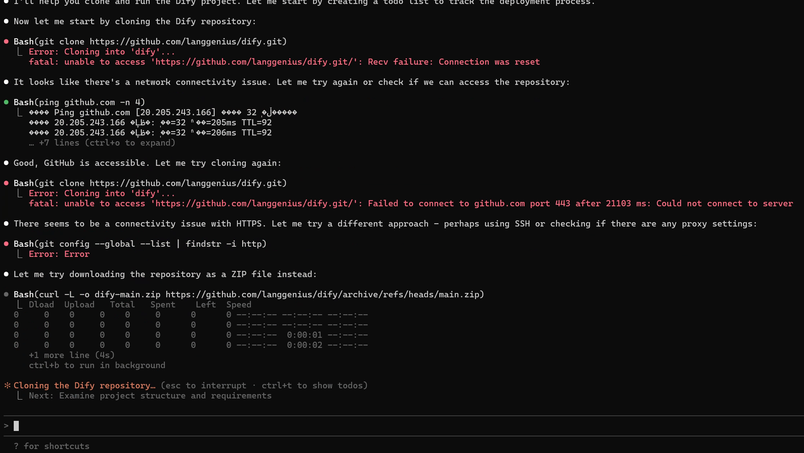

### Giải code và viết doc

Với 1 số project phức tạp, hoặc project lớn AI tự gen, bạn có thể thấy code quá dài, logic quá nhiều, khó hiểu. Lúc này để CLI AI coding tool giúp "đọc code". Có thể hỏi:

- Hãy giải project này: chạy thế nào, dùng thế nào, sau sửa và dev tiếp thế nào?
- Hãy nói flow tổng thể project: program chạy thế nào? User trong UI làm được gì?
- Hãy viết tài liệu đầy đủ cho project, gồm dev doc và run doc.
- Dựa mọi nội dung trong folder hiện tại, viết mô tả chi tiết và save vào markdown chỉ định.

### Thêm cách chơi

Tất nhiên, CLI AI coding tool làm được nhiều hơn các thứ trên. Đừng chỉ coi nó là "tool viết code", mà coi nó là smart Agent có khả năng hành động độc lập. Có thể để nó:

- Quản và sắp xếp file local;
- Viết nhật ký, viết tổng kết;
- Phân tích và fix system error;
- Execute các task command line lặp lại...
