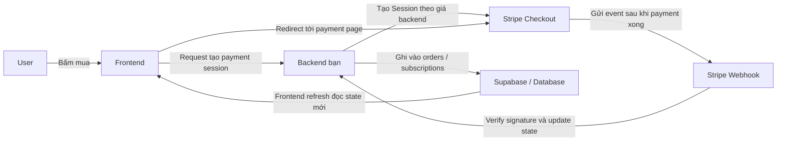
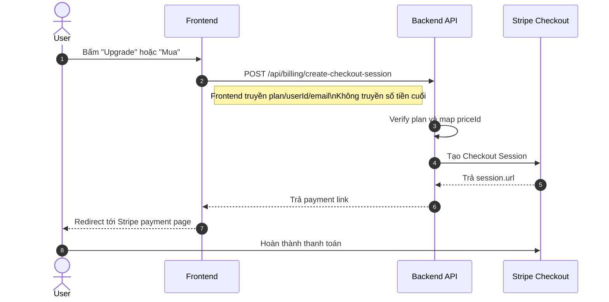
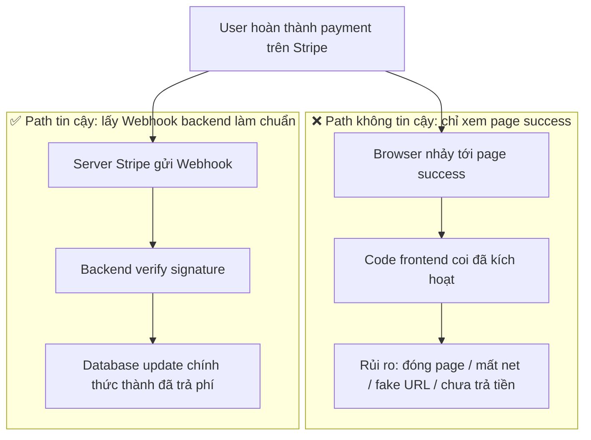
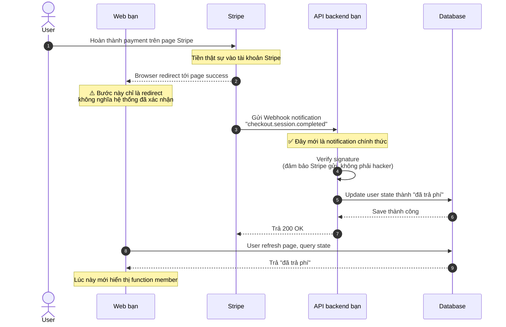
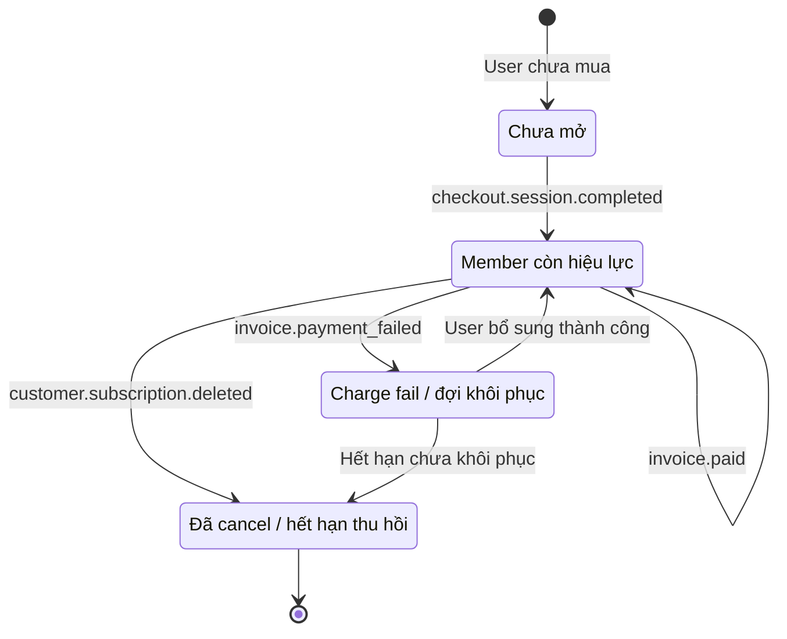
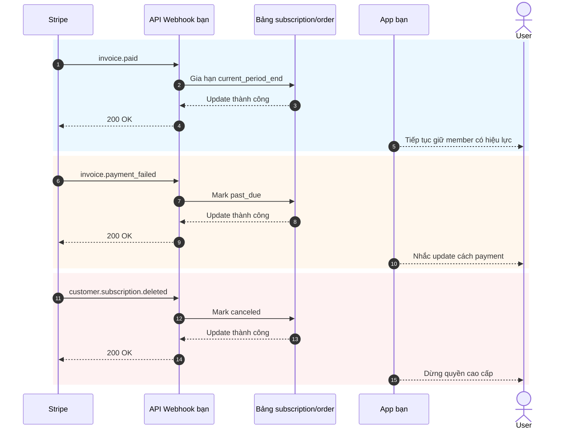

# Cách tích hợp Stripe và các hệ thống thanh toán

Khi product của bạn đã có page, login, database và backend cơ bản, vấn đề thực tế kế tiếp là: **thu phí thế nào**.

Nhiều người lần đầu làm thanh toán đặt mọi chú ý vào "cách redirect tới page payment". Nhưng cái thật sự quyết định hệ thống có ổn định không, không phải button, mà cả chuỗi thu phí: ai quyết giá, ai xác nhận thanh toán thành công, ai update database, ai thu hồi quyền.

Bài này tách thành 2 phần:

- **Phần đầu** chỉ nói tích hợp cơ bản thực dụng nhất, mục tiêu để bạn nhanh nhất tích hợp Stripe vào project.
- **Phần sau** đặt thống nhất ở phụ lục — chi tiết Webhook, event subscription, khác biệt giải pháp thanh toán theo quốc gia/khu vực.

> 💡 Khuyến nghị học xong các chương sau trước khi tiếp:
>
> - [Từ database tới Supabase](../database-supabase/)
> - [Mô hình lớn hỗ trợ viết code API và tài liệu API](../ai-interface-code/)
> - [Cách deploy ứng dụng Web](../zeabur-deployment/)

# Bạn sẽ học được

1. Hệ thống thanh toán Minimum Viable thật sự trông thế nào.
2. Cách tích hợp Stripe vào project nhanh nhất.
3. Cách viết prompt để AI giúp add hệ thống thanh toán thẳng vào.
4. Nếu không phải project Stripe overseas, các khu vực khác nên ưu tiên giải pháp gì.

---

# Phần 1: Hands-on cơ bản

## 1. Nhớ 3 nguyên tắc trước

Nếu chỉ nhớ 3 việc, nhớ 3 cái này:

1. **Giá phải do backend quyết định**, không thể tin số tiền frontend truyền lên.
2. **Cái thực sự làm quyền có hiệu lực là Webhook**, không phải page `success`.
3. **Database của bạn phải lưu payment status**, không chỉ dựa backend Stripe.

3 cái này là boundary core nhất của hệ thống thanh toán. Chỉ cần boundary không sai, sau này đổi Stripe, PayPal, Alipay, WeChat Pay — bản chất chỉ là "đổi interface, kiến trúc không đổi".

## 2. Nếu không xử ở backend, để frontend connect thẳng Stripe thì sao?

Đây là ý tự nhiên nhất nhiều người làm thanh toán lần đầu:

- Page đã có button "mua"
- Có thể để frontend tự connect Stripe không
- Vậy có cần backend không

Nếu chỉ làm demo page giả, nghĩ vậy không sao. Nhưng nếu thật sự thu tiền, **con đường này thường làm hỏng việc**.

Vấn đề thường gặp nhất:

1. **Giá dễ bị sửa**
   Request trong browser do máy user tự gửi. Người khác có thể sửa nội dung request.
2. **Info nhạy cảm dễ bị lộ**
   Key thực sự quan trọng, logic giá, logic mở quyền member, vốn không nên đặt ở frontend.
3. **Bạn không thể tin cậy xác nhận "giao dịch này có thật sự thành công"**
   User nhảy tới page success không nghĩa là database đã đồng bộ đúng.
4. **State database loạn**
   User có thể nói "tôi đã trả tiền rồi", nhưng hệ thống bạn không ghi nhận.

Vậy phân công an toàn hơn:

- Frontend: hiển thị button, kích hoạt mua, chuyển page
- Backend: quyết giá, tạo payment session, nhận Webhook, update database

::: info Đoạn này có thể nhớ thành 1 câu
**Frontend có thể chịu trách nhiệm redirect, backend phải chịu trách nhiệm định giá và xác nhận.**

Chỉ cần thu tiền thật, đừng đặt "quyết định giá cuối" và "logic kích hoạt sau khi thanh toán thành công" ở frontend.
:::

## 3. Khi nào hợp dùng Stripe trước

Nếu bạn làm các scenario sau, Stripe thường là điểm xuất phát thuận nhất:

- SaaS hướng user overseas
- Product member subscription
- Product số, template, AI credit pack
- Muốn verify nhanh thương mại hoá, không phải xử lý quá nhiều chi tiết payment local ngay từ đầu

Nếu user chính ở Trung Quốc, Stripe thường không phải lựa chọn đầu — phần này tôi đặt ở phụ lục.

## 4. Chuỗi thanh toán Minimum Viable

Xem version tối thiểu trước. Chỉ cần chuỗi này chạy thông, hệ thống thanh toán của bạn có khung xương.



Dịch sang lời người:

1. User bấm button.
2. Frontend hỏi backend xin payment link.
3. Backend dùng Stripe key tạo payment session.
4. User tới page Stripe trả tiền.
5. Stripe thông báo "thanh toán thật sự thành công" qua Webhook.
6. Backend update database.

## 5. Sequence diagram chuẩn để kích hoạt thanh toán

Nếu quen xem system diagram chuẩn hơn, xem sequence diagram:



## 6. Quick start

Nếu muốn tích hợp vào project nhanh nhất, làm theo 5 bước sau là đủ.

### 6.1 Bước 1: tạo product và price ở backend Stripe

Mục đích bước này không phải "config gì cũng được trước", mà là **bạn rốt cuộc bán gì, dự định thu phí thế nào** — định nghĩa rõ trong Stripe trước.

Trong model Stripe:

- **Product** là "bán cái gì", ví dụ `Pro Member`
- **Price** là "bán bao nhiêu tiền, theo chu kỳ nào", ví dụ `Pay tháng 9.9 USD`, `Pay năm 99 USD`

Vì sao làm bước này trước? Vì sau backend tạo Checkout Session, không phải truyền số tiền trực tiếp cho Stripe, mà truyền 1 `price_id` đã tồn tại. Stripe theo `price_id` gen payment page, số tiền, currency, chu kỳ subscription.

Nếu bỏ qua bước này, "tạo payment link" sau không làm được.

::: info Vì sao đây cần dừng lại 1 chút
Nhiều newbie thấy `Product`, `Price` thấy khó chịu, như đang học thuật ngữ nội bộ Stripe.

Thực ra, bước này làm 1 việc rất giản dị:
- Định nghĩa rõ "bán cái gì"
- Định nghĩa rõ "bán bao nhiêu tiền"
- Để backend sau có 1 `price_id` ổn định tạo payment link

Hiểu layer này, Checkout Session sau không thấy trừu tượng.
:::

Cho hệ subscription MVP, ít nhất build 2 cấp:

- 1 `Product`
- 1 hoặc nhiều `Price`

Có thể mở các page sau:

- Stripe Dashboard login: [Dashboard Login](https://dashboard.stripe.com/login)
- Doc quản product và price Stripe: [Manage products and prices](https://docs.stripe.com/products-prices/manage-prices)
- Doc quickstart Stripe Checkout: [Build a Stripe-hosted checkout page](https://docs.stripe.com/checkout/quickstart?lang=node)
- Page product Stripe Dashboard: [Product catalog](https://dashboard.stripe.com/test/products)

Khuyến nghị thao tác trong **Test mode** trước, đừng làm thẳng ở production từ đầu.

Config MVP phổ biến nhất:

- `Product`: `Pro Plan`
- `Price 1`: `pro_monthly`
- `Price 2`: `pro_yearly`

Khi thao tác ở backend, hiểu theo thứ tự:

1. Tạo 1 product `Pro Plan` trước
2. Treo 2 price dưới product này
3. Pay tháng và pay năm thực ra là 2 cách thu phí của cùng 1 product

Sau hoàn thành, ít nhất ghi lại:

- `price_id` của pay tháng
- `price_id` của pay năm
- Tên plan của bạn, ví dụ `pro_monthly`, `pro_yearly`

Nếu lần đầu vào backend Stripe, hiểu bước này thành:

- `Product` quyết định payment page bán gì
- `Price` quyết định payment page thu bao nhiêu
- Backend sau thực sự dùng chính là `price_id`

::: info Giá trị thực sự cần ghi lại
Quan trọng nhất trong page này không phải tên product, mà `price_id`.

Sau dù để AI giúp tích hợp backend, hay bạn tự troubleshoot, thường dùng nhiều:
- `STRIPE_PRICE_PRO_MONTHLY`
- `STRIPE_PRICE_PRO_YEARLY`
- 2 `price_id` tương ứng
:::

Nếu muốn để AI dẫn config backend xong, dùng prompt sau:

```text
Tôi đang dùng Stripe lần đầu, đừng sửa code vội, dẫn tôi config payment cơ bản nhất ở backend Stripe trước.

Dựa theo các tài liệu chính thức này từng bước hướng dẫn tôi:
- https://docs.stripe.com/products-prices/manage-prices
- https://docs.stripe.com/checkout/quickstart?lang=node

Tình hình tôi:
- Muốn làm payment member đơn giản nhất
- Chỉ 2 plan: pay tháng và pay năm
- Hiện chưa hiểu các từ Product, Price

Hãy:
1. Nói đơn giản nhất cho tôi Product và Price là gì.
2. Theo thứ tự "mở page nào trước → bấm chỗ nào → điền gì" dạy tôi thao tác.
3. Cuối nhắc tôi, làm xong tôi cần copy gì từ backend cho backend code dùng.
4. Nếu tôi dễ đi sai, tiện nhắc tôi nên luôn ở test mode thao tác.
```

### 6.2 Bước 2: chuẩn bị biến môi trường

Thường ít nhất chuẩn bị các biến môi trường sau:

- `STRIPE_SECRET_KEY`
- `STRIPE_WEBHOOK_SECRET`
- `STRIPE_PRICE_PRO_MONTHLY`
- `STRIPE_PRICE_PRO_YEARLY`
- `APP_URL`
- `SUPABASE_URL`
- `SUPABASE_SERVICE_ROLE_KEY`

Có thể mở các page sau:

- Doc Stripe API Keys: [API keys](https://docs.stripe.com/keys)
- Page API Keys Stripe Dashboard: [API Keys](https://dashboard.stripe.com/test/apikeys)
- Doc Stripe Webhooks: [Receive Stripe events in your webhook endpoint](https://docs.stripe.com/webhooks)
- Page Webhooks Stripe Dashboard: [Workbench Webhooks](https://dashboard.stripe.com/test/workbench/webhooks)

> ⚠️ `STRIPE_SECRET_KEY` và `SUPABASE_SERVICE_ROLE_KEY` đều chỉ được đặt ở backend.

::: info Mục đích bước biến môi trường
Bước này không phải để "fill đầy `.env` trước", mà đặt vài thứ nhạy cảm nhất của hệ payment vào backend giữ:

- Backend key Stripe
- Webhook verify key
- Map giá của bạn

Hiểu đơn giản:  
Frontend chỉ chịu trách nhiệm kích hoạt mua, mọi secret và logic giá thực sự nên giữ ở server.
:::

Bước này cũng có thể để AI sắp xếp:

```text
Hãy xem project tôi hiện đặt biến môi trường thế nào, rồi giúp tôi sắp xếp các biến môi trường Stripe cần.

Tham khảo các doc:
- https://docs.stripe.com/keys
- https://docs.stripe.com/webhooks

Tình hình tôi:
- Tôi zero base
- Không phân biệt được biến nào nên ở frontend, biến nào ở backend
- Cũng không chắc project hiện tại nên sửa `.env`, `.env.local` hay file khác

Hãy:
1. Search trong project xem biến môi trường thường viết ở đâu.
2. List các biến tối thiểu cần để tích hợp Stripe.
3. Nói đơn giản mỗi biến làm gì.
4. Nói mỗi biến nên copy từ page Stripe nào.
5. Nếu trong project có file sample env, giúp tôi điền tên biến vào.
```

### 6.3 Bước 3: backend tạo Checkout Session

Bước này không cần tự viết API, để AI tham khảo doc chính thức giúp implement.

Đưa các doc:

- Stripe Checkout quickstart: [Build a Stripe-hosted checkout page](https://docs.stripe.com/checkout/quickstart?lang=node)
- Checkout Sessions API: [Create a Checkout Session](https://docs.stripe.com/api/checkout/sessions/create)
- Subscription: [Subscriptions](https://docs.stripe.com/payments/subscriptions)

Rồi paste prompt:

```text
Hãy xem code backend project hiện tôi tổ chức thế nào, rồi giúp tôi tích hợp Stripe payment vào.

Tham khảo các doc chính thức:
- https://docs.stripe.com/checkout/quickstart?lang=node
- https://docs.stripe.com/api/checkout/sessions/create
- https://docs.stripe.com/payments/subscriptions

Mục tiêu đơn giản:
- User bấm button mua xong nhảy được tới page payment Stripe
- Plan chỉ có 2: pay tháng và pay năm
- Đừng để tôi tự quyết đặt code ở đâu, xem project trước rồi đặt vào chỗ hợp

Hãy:
1. Search project, làm rõ file entry backend, file route, cách viết biến môi trường ở đâu.
2. Tham khảo doc chính thức, tích hợp bước "tạo payment link Stripe".
3. Đừng bắt tôi tự truyền số tiền, giá dùng biến môi trường backend quyết.
4. Sau làm xong nói cho tôi đã sửa file nào.
5. Cuối nói tôi còn cần làm gì ở backend Stripe.
```

### 6.4 Bước 4: frontend chuyển sang payment page

Mục tiêu bước này rất đơn giản: button pricing page call API backend, rồi redirect tới Stripe Checkout.

Doc tham khảo:

- Doc tích hợp Stripe Checkout: [Build an integration with Checkout](https://docs.stripe.com/payments/checkout/build-integration)

Prompt cho AI:

```text
Giúp tôi nối button "mua" trong project với Stripe.

Yêu cầu:
- Không động page hiện có, chỉ sửa logic sau khi bấm button
- Bấm xong call API backend lấy payment link, rồi redirect tới Stripe
- Nếu lỗi, hiển thị message đơn giản cho user (ví dụ "Payment tạm không khả dụng, thử lại sau")

Doc tham khảo: https://docs.stripe.com/payments/checkout/build-integration
```

### 6.5 Bước 5: Webhook update database state

Đây là bước then chốt nhất.

::: info Vì sao bước này then chốt nhất
Nhiều người nghĩ "user trả tiền xong và nhảy tới page success" là xong.

Không phải.

Với hệ thống của bạn, điều thật sự quan trọng:  
**Stripe có chính thức gửi event vào Webhook không, và backend có update state database thành công không.**
:::

Cũng để AI làm theo doc Webhook chính thức Stripe, đừng tự viết tay.

Doc tham khảo:

- Stripe Webhooks: [Receive Stripe events in your webhook endpoint](https://docs.stripe.com/webhooks)
- Stripe CLI: [Stripe CLI](https://docs.stripe.com/stripe-cli)
- Stripe CLI usage: [Use the Stripe CLI](https://docs.stripe.com/stripe-cli/use-cli)

Prompt cho AI:

```text
Tiếp giúp tôi nối bước "tự kích hoạt sau khi payment thành công" Stripe.

Tham khảo các doc chính thức:
- https://docs.stripe.com/webhooks
- https://docs.stripe.com/stripe-cli
- https://docs.stripe.com/stripe-cli/use-cli

Mục tiêu:
- User trả tiền xong, không chỉ nhảy tới page success
- Mà thật sự đổi member state trong database tôi thành đã kích hoạt

Hãy:
1. Search code liên quan database và cách store user state trong project hiện tại.
2. Add Stripe webhook.
3. Payment thành công xong, đổi user tương ứng thành active, hoặc update field member state đang dùng.
4. Nếu project đã có bảng subscription, order, user, ưu tiên dùng cấu trúc hiện.
5. Sau làm xong nói tôi đã sửa file nào.
6. Tiện nói tôi test local thế nào.
```

## 7. Prompt để AI tích hợp nhanh giúp bạn

Nếu dùng Codex, Claude Code, Trae, Cursor, dán thẳng prompt sau cho nó, để nó tích hợp payment trong project bạn.

```text
Giúp tôi tích hợp Stripe payment vào project hiện tại, tôi muốn làm function payment member đơn giản chạy được nhất.

Yêu cầu của tôi:
1. Tôi zero base, hãy tự xem project trước, rồi quyết code sửa ở đâu.
2. Đừng bắt tôi tự đánh giá structure folder, route, database.
3. Tôi chỉ muốn làm version đơn giản nhất trước: 2 plan pay tháng và pay năm.
4. User bấm mua xong nhảy tới page payment Stripe.
5. Payment thành công xong, member state trong database tôi đổi thành đã kích hoạt.
6. Đừng add ngay function phức tạp (coupon, upgrade/downgrade, invoice phức tạp).

Yêu cầu output:
1. Đưa kế hoạch sửa đổi trước.
2. Rồi sửa code thẳng.
3. Cuối nói tôi test local từng bước thế nào.
4. Nếu bước nào còn cần tôi vào backend Stripe thao tác, đưa link và điểm chính.
```

Nếu muốn AI gần project bạn hơn, thêm ở đầu:

- Framework frontend
- Structure folder backend
- Tên table database
- Hệ user hiện tại là Supabase Auth hay tự build Auth

## 7.1 Debug local cũng giao cho AI

Nếu muốn AI giúp nối hết debug local, dùng đoạn sau:

```text
Tiếp giúp tôi chạy thông Stripe payment thực sự, tôi muốn từng bước theo, không muốn tự đoán.

Tham khảo doc chính thức:
- https://docs.stripe.com/webhooks
- https://docs.stripe.com/stripe-cli
- https://docs.stripe.com/stripe-cli/use-cli

Mục tiêu:
1. Nói tôi mở page Stripe nào trước.
2. Nói tôi cách lấy STRIPE_WEBHOOK_SECRET.
3. Nói tôi cách dùng stripe login và stripe listen.
4. Nói tôi cách verify checkout.session.completed đã thành công vào local webhook.
5. Nếu project hiện tại cần start frontend và backend trước, tiện nói tôi lệnh cụ thể.
6. Đừng chỉ nói nguyên lý, output theo bước thao tác thực tế.
7. Nếu tôi làm sai bước nào, nói tôi error phổ biến nhất sẽ thế nào.
```

## 8. 4 hố dễ đạp nhất

1. **Coi page `success` là payment thành công**
   Cái thực sự quyết state là Webhook, không phải redirect frontend.
2. **Để frontend truyền số tiền**
   Đem lại rủi ro giả mạo giá nghiêm trọng.
3. **Route Webhook bị `express.json()` xử trước**
   Stripe verify signature cần raw request body.
4. **Không xử idempotent**
   Webhook có thể retry, nếu mỗi lần đều add member hoặc credit lặp lại, sẽ có sự cố.

## 9. Khuyến nghị chọn giải pháp 1 câu

Nếu giờ chỉ muốn chạy thu phí trước:

| User chính | Giải pháp thử trước |
| :--- | :--- |
| SaaS overseas / user quốc tế | Stripe |
| User Trung Quốc | Alipay / WeChat Pay |
| HK hoặc team cross-border | Stripe + ví local / giải pháp FPS aggregator |

Khác biệt cụ thể tôi đặt ở phụ lục.

::: info Tư duy chọn giải pháp đơn giản nhất
Đừng ngay đầu muốn "tích hợp mọi cách payment toàn cầu 1 lần".

Thứ tự thực tế hơn:
- Theo khu vực user chính chọn 1 main payment chain
- Chạy thông MVP payment trước
- Theo nguồn user thật bổ sung payment 2, 3
:::

## 10. Tóm tắt

Đến đây, bạn đã làm chủ chuỗi thu phí cơ bản nhất nhưng quan trọng nhất:

1. Frontend kích hoạt mua.
2. Backend tạo Checkout Session.
3. User trả tiền trên page Stripe.
4. Stripe qua Webhook thông báo backend.
5. Backend update database.
6. Frontend refresh hiện member/order state mới.

Nếu chỉ muốn tích hợp nhanh payment vào project, nội dung trên là đủ. Phụ lục dưới quay lại xem khi thật sự gặp vấn đề.

---

# Phụ lục

## Phụ lục A: các object phổ biến nhất trong Stripe

Lần đầu xem doc Stripe, dễ bị các tên object làm rối. Thực ra chỉ cần hiểu các cái dưới:

| Object | Tác dụng | Hiểu thành gì |
| :--- | :--- | :--- |
| `Product` | Mô tả bán gì | Item hoặc plan member |
| `Price` | Mô tả bán bao nhiêu, chu kỳ thu phí | Pay tháng, pay năm, mua đứt |
| `Checkout Session` | Flow payment hosted Stripe | Payment page |
| `Subscription` | Quan hệ subscription chu kỳ | Auto renew member |
| `Customer` | User trả tiền | Customer profile trong Stripe |
| `Webhook` | Thông báo async | Stripe nói cho bạn "giao dịch thế nào" |

## Phụ lục B: vì sao page `success` không bằng payment thành công

Nhiều người nghĩ "user trả tiền xong, nhảy tới page success" là payment thành công. Đây là hố dễ đạp nhất.

### Kể 1 scenario thật

Giả sử bạn làm website member:
1. User bấm "mua member"
2. Nhảy tới Stripe payment page
3. User nhập credit card, bấm pay
4. Page nhảy tới `success.html` của bạn
5. Bạn viết code trong page success: "đã tới page này, mở member cho user"

**Vấn đề ở đâu?**

User có thể không trả tiền, hoặc trả nửa chừng đóng page, vẫn có thể access thẳng `success.html`.

### 2 path hoàn toàn khác



**Khác biệt then chốt:**

| | Redirect page success | Webhook notification |
| :--- | :--- | :--- |
| Ai kích hoạt | Browser user | Server Stripe |
| Giả mạo được không | Được, access URL thẳng | Không, có signature verify |
| Có nhất định payment thành công không | Không nhất định | Nhất định |
| Hệ thống bạn biết thế nào | Code frontend đoán | Stripe chính thức thông báo |

### Flow đầy đủ nên thế nào



### Điểm kẹt mỗi bước

**Bước 1: user trả tiền ở Stripe**

Đây là khoảnh khắc duy nhất chắc chắn "tiền thật sự đã trả":
- User nhập credit card, bấm confirm
- Bank trừ tiền từ card user
- Stripe xác nhận nhận được tiền

**Bước 2: browser redirect tới page success (vấn đề lớn nhất)**

Bước này hoàn toàn không tin cậy, vì:
- User gõ thẳng `yoursite.com/success` trong browser, chưa trả tiền cũng access được
- User trả nửa chừng đóng page, nhưng đã copy link success trước đó, sau mở thẳng
- Vấn đề mạng làm redirect fail, nhưng tiền đã bị trừ (user trả tiền nhưng không thấy page success)
- User bấm back, trả lại lần nữa, nhưng 2 lần đều redirect tới cùng page success

**Bước 3: Stripe gửi Webhook**

Đây là Stripe chủ động thông báo server bạn "giao dịch đã vào":
- Chỉ server Stripe có thể kích hoạt request này
- Request có signature, backend bạn verify được có thật là Stripe gửi không
- Dù page success chưa mở, user mất net, Webhook vẫn được gửi

**Bước 4: backend verify signature**

Vì sao phải verify? Tránh hacker giả mạo notification.

Giả sử không verify, hacker có thể gửi thẳng notification giả cho server bạn: "User A đã trả 1000 NDT". Hệ thống bạn sẽ mở member cho hacker.

Process verify:
- Stripe dùng key 2 bên thoả thuận gen signature cho nội dung notification
- Backend bạn dùng cùng key verify signature có match không
- Match = 100% là Stripe gửi, không match = từ chối thẳng

**Bước 5: update database**

Chỉ sau verify pass mới update database:
- Đổi state user từ "đợi trả tiền" thành "đã trả phí"
- Ghi order number, số tiền, thời gian trả
- Mở quyền member tương ứng

**Bước 6: frontend query state**

Page success đừng tự đoán "tới page này là thành công". Cách đúng:
- Khi page load, gửi request tới backend: "User này đã trả tiền chưa?"
- Backend query database, trả state thật
- Theo kết quả trả về hiện "Kích hoạt thành công" hoặc "Đợi xác nhận"

### 1 cách làm sai phổ biến

```javascript
// Sai: trong page success kích hoạt thẳng
// success.html
if (window.location.pathname === '/success') {
  // Nguy hiểm! Ai cũng access /success được
  activateMembership();
}
```

```javascript
// Đúng: mỗi refresh đều query backend
// success.html
async function checkStatus() {
  const response = await fetch('/api/user/status');
  const data = await response.json();
  
  if (data.paymentStatus === 'paid') {
    showMemberFeatures();
  } else {
    showPendingMessage();
  }
}
```

### Tóm 1 câu

**Page success chỉ là "browser redirect thành công", Webhook mới là "Stripe chính thức xác nhận thu tiền".**

Hệ thống của bạn phải lấy Webhook làm chuẩn, không thể tin redirect frontend.

## Phụ lục C: các event đáng listen nhất của hệ subscription

| Event | Ý nghĩa | Thường phải làm gì |
| :--- | :--- | :--- |
| `checkout.session.completed` | Mở subscription lần đầu thành công | Tạo record subscription local |
| `invoice.paid` | Auto renew thành công | Gia hạn validity |
| `invoice.payment_failed` | Auto charge fail | Mark trạng thái rủi ro và nhắc user |
| `customer.subscription.deleted` | Subscription cancel | Thu hồi quyền hoặc mark hết hạn sẽ hết hiệu lực |

### State diagram subscription



### Sequence diagram renew / fail / cancel



## Phụ lục D: chọn các giải pháp payment khác thế nào

### 1. Trung Quốc

User chính ở Trung Quốc, ưu tiên vẫn là **[Alipay](https://open.alipay.com/)** và **[WeChat Pay](https://pay.wechatpay.cn/)**.

**Mô hình business:**

Cả 2 đều là mode "payment gateway". Bạn cần:
- Apply giấy phép merchant (business license, corporate account)
- Tiền user trả vào thẳng tài khoản merchant của bạn
- Bạn tự phụ trách thuế, refund, đối chiếu

**Mô hình tech:**

Cả 2 đều là mode "backend tạo order + frontend kích hoạt + backend notification", tư duy giống Stripe.

**Flow tích hợp Alipay:**
1. Tạo app trên Alipay Open Platform
2. Config public/private key và callback URL
3. Backend call API order thống nhất, gen payment link hoặc QR
4. User scan hoặc nhảy tới trả tiền
5. Alipay thông báo async backend bạn, update order state

**Flow tích hợp WeChat Pay:**
- JSAPI Payment: hợp official account, mini program — user trả tiền trong WeChat
- Native Payment: PC gen QR, user scan trả tiền
- H5 Payment: trong browser mobile mở WeChat App trả

Flow: backend order → lấy `prepay_id` hoặc `code_url` → frontend kích hoạt payment → backend nhận notification xác nhận thành công

**Link tham khảo:**
- Alipay Open Platform: https://open.alipay.com/
- WeChat Pay merchant doc: https://pay.wechatpay.cn/doc/v3/merchant/

### 2. Hong Kong

Thị trường HK khá lai, combo phổ biến:

- Bank card: Visa / Mastercard
- FPS (Faster Payment System): chuyển tiền tức thời local HK
- AlipayHK / WeChat Pay HK: Alipay và WeChat phiên bản HK

**Combo khuyến nghị:**
- Dùng **[Stripe](https://stripe.com/hk)** cover card quốc tế và subscription
- Dùng **[Airwallex](https://www.airwallex.com/)** hoặc **[Adyen](https://www.adyen.com/)** bổ sung ví local và FPS

### 3. Overseas / SaaS quốc tế

#### [Stripe](https://stripe.com/)

**Mô hình business:** Payment gateway

- Bạn cần tự apply giấy phép merchant (1 số nước Stripe xử cho)
- Tiền user trả vào tài khoản Stripe, rồi settle về bank account
- Bạn tự phụ trách khai thuế

**Mô hình tech:**

- Trải nghiệm API tốt nhất, doc rõ
- Hỗ trợ Checkout (hosted page), Elements (custom form), Payment Links (no code)
- Webhook thông báo payment state
- Hỗ trợ subscription, invoice, đa currency

**Hợp ai:** SaaS overseas, indie dev, team cần custom linh hoạt

**Link tham khảo:** https://docs.stripe.com/

#### [PayPal](https://www.paypal.com/)

**Mô hình business:** Payment gateway

- Tiền user trả vào tài khoản PayPal, rồi withdraw về bank
- Bạn tự phụ trách thuế

**Mô hình tech:**

- Single payment: frontend đặt button, backend tạo/confirm order
- Subscription: tạo Product và Plan trước, rồi dùng SDK kích hoạt
- Cũng cần backend và Webhook, đừng chỉ xem callback frontend

**Hợp ai:** Business overseas cần bổ sung kênh, user quen dùng PayPal

**Link tham khảo:** https://developer.paypal.com/docs/

#### [Paddle](https://www.paddle.com/)

**Mô hình business:** Merchant of Record (MoR)

- Paddle là "Merchant of Record", về pháp lý Paddle thu tiền user
- Paddle xử thuế toàn cầu, VAT, refund, compliance cho bạn
- Tiền user trả vào Paddle, Paddle trừ thuế và fee xong settle cho bạn
- Bạn không cần đăng ký công ty ở mỗi nước hoặc xử thuế

**Mô hình tech:**

- Paddle.js: nhúng hosted checkout page frontend
- API backend: tạo transaction, đưa checkout xử
- Webhook đồng bộ subscription state

**Hợp ai:** Team SaaS không muốn xử thuế toàn cầu, đặc biệt B2B SaaS

**Link tham khảo:** https://developer.paddle.com/

#### [Lemon Squeezy](https://www.lemonsqueezy.com/)

**Mô hình business:** Merchant of Record (MoR)

- Giống Paddle, Lemon Squeezy là "Merchant of Record"
- Xử thuế toàn cầu, VAT, compliance cho bạn
- 2024 bị Stripe mua, nhưng vận hành độc lập

**Mô hình tech:**

- Hosted Checkout: đơn giản nhất, gen payment link thẳng
- Checkout Overlay: overlay nhúng vào page
- API backend: tạo checkout, kiểm soát linh hoạt

**Hợp ai:** Indie dev, product số, license software

**Link tham khảo:** https://docs.lemonsqueezy.com/

### 4. Giải pháp cấp doanh nghiệp

#### [Airwallex (Konnghui)](https://www.airwallex.com/)

**Mô hình business:** Payment gateway + global account

- Cung cấp tài khoản thu tiền toàn cầu (kiểu virtual bank account)
- Hỗ trợ thu đa currency, exchange, pay
- Bạn tự phụ trách thuế

**Mô hình tech:**

- Payment Links: gần như không cần code, gen payment link
- Hosted Payment Page: hosted page
- Drop-in / Embedded / Native API: tích hợp sâu, custom cao
- Hỗ trợ Alipay HK, FPS, WeChat Pay và các payment local

**Hợp ai:** Team HK, business cross-border, công ty cần tài khoản đa currency

**Link tham khảo:** https://www.airwallex.com/docs/

#### [Adyen](https://www.adyen.com/)

**Mô hình business:** Payment gateway

- Platform payment cấp doanh nghiệp, năm xử lý nghìn tỷ EUR
- Hỗ trợ online, offline, mobile — all-channel
- Bạn tự phụ trách thuế

**Mô hình tech:**

- Pay by Link: đơn giản nhất, gen payment link
- Drop-in / Components: tích hợp online chuẩn
- Backend kích hoạt được Alipay, Alipay HK, PayMe và các payment local

**Hợp ai:** Doanh nghiệp lớn, công ty cần payment all-channel

**Link tham khảo:** https://docs.adyen.com/

### 5. So sánh giải pháp

| Giải pháp | Mô hình business | Xử thuế | Hợp ai |
| :--- | :--- | :--- | :--- |
| Stripe | Payment gateway | Tự xử | SaaS overseas, dev |
| PayPal | Payment gateway | Tự xử | Bổ sung kênh overseas |
| Paddle | MoR | Paddle xử thay | B2B SaaS, không muốn quản thuế |
| Lemon Squeezy | MoR | LS xử thay | Indie dev, product số |
| Adyen | Payment gateway | Tự xử | Doanh nghiệp lớn |
| Airwallex | Payment gateway + account | Tự xử | Business cross-border, team HK |
| Alipay/WeChat | Payment gateway | Tự xử | User TQ |

### 6. Chọn giải pháp theo khu vực

| Thị trường của bạn | Khuyến nghị |
| :--- | :--- |
| Trung Quốc | Alipay / WeChat Pay |
| Hong Kong | Stripe + Airwallex / Adyen |
| SaaS overseas | Stripe (tự quản thuế) hoặc Paddle (MoR thay) |
| Product số overseas | Stripe / Lemon Squeezy / Paddle |
| Doanh nghiệp đa khu vực | Combo Adyen / Airwallex / Stripe |
