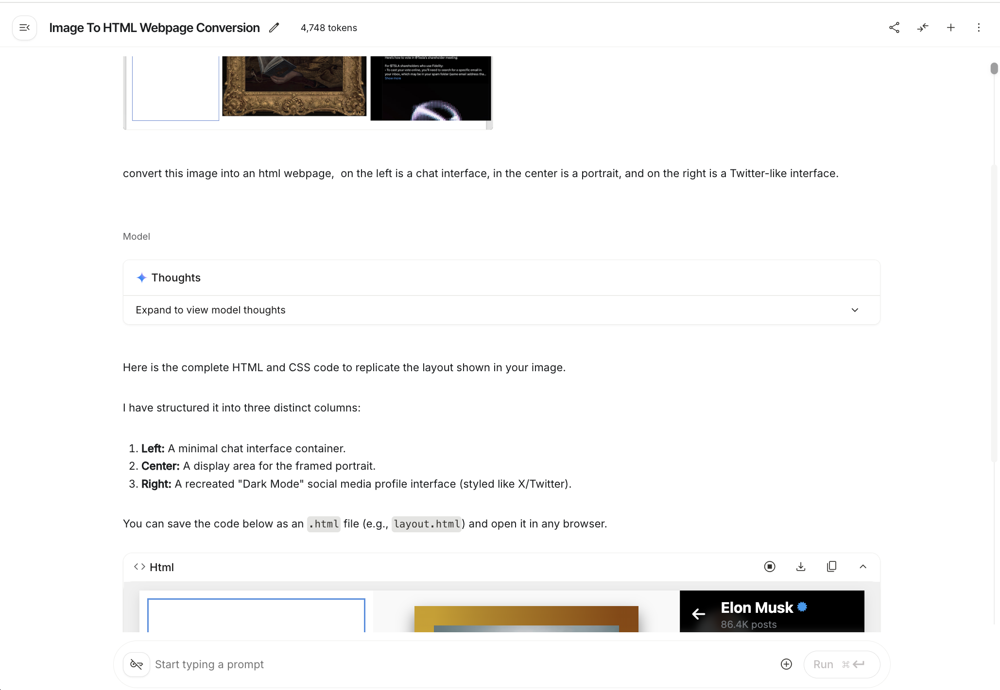
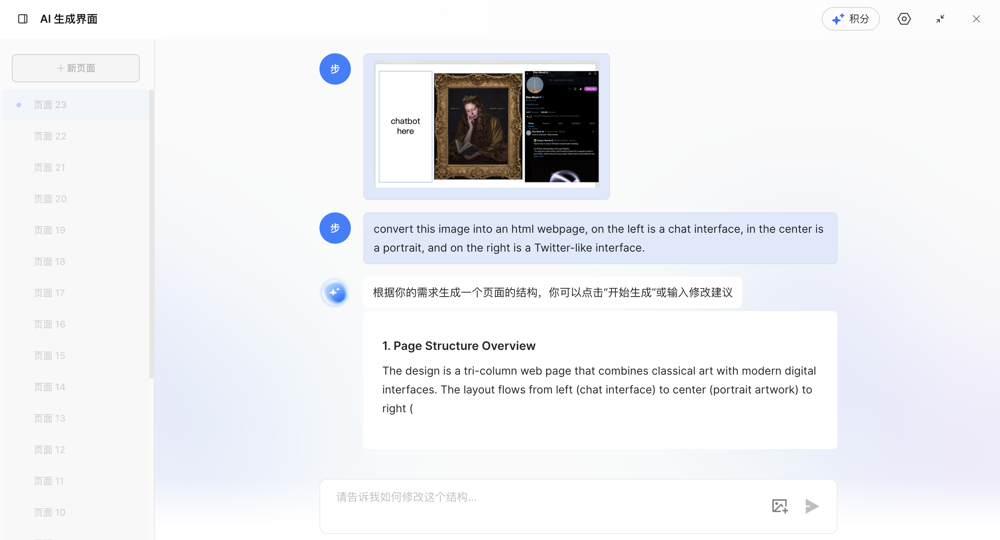
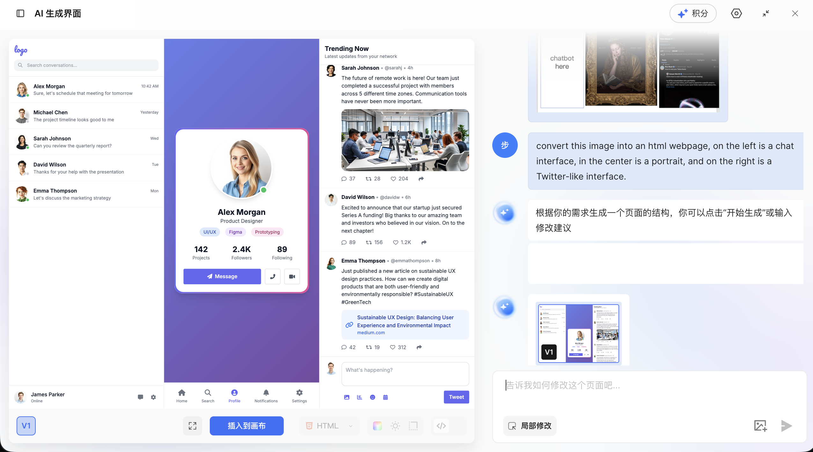
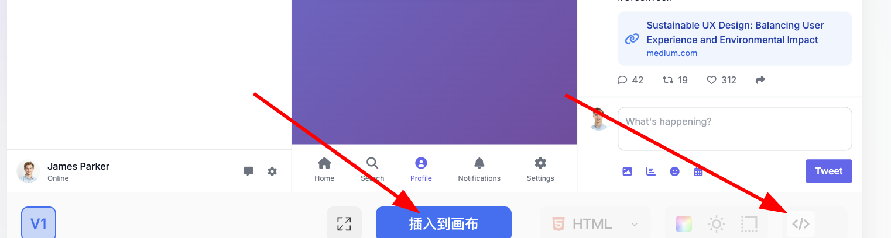
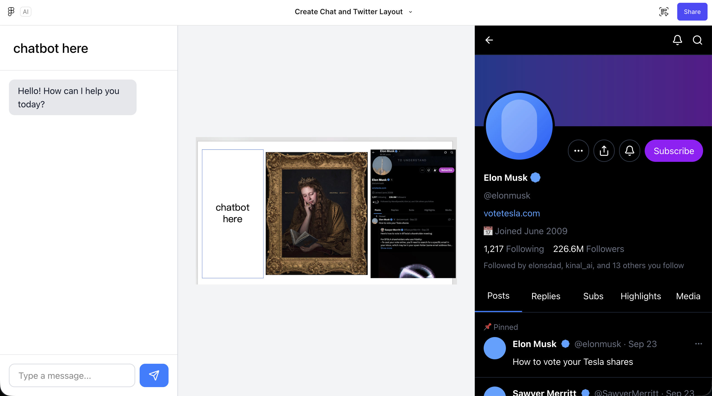
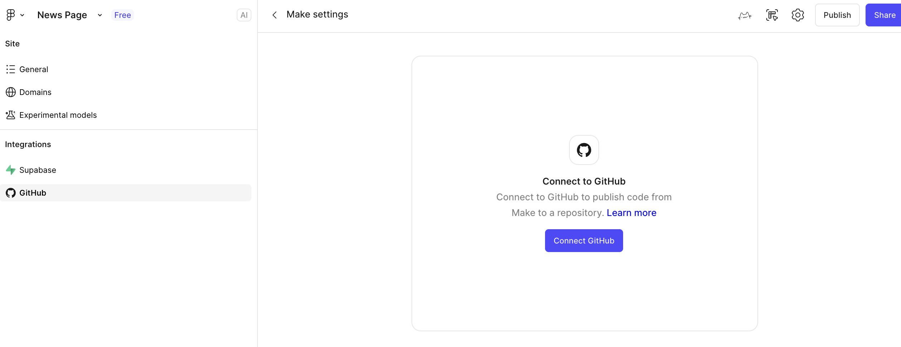

# Từ prototype design tới code project

::: tip 🎯 Câu hỏi cốt lõi
**Làm sao biến prototype trong công cụ thiết kế thành code frontend thật sự chạy được trong browser?**
:::

---

## 1. Ba path từ prototype tới code

Sau khi xong UI design bằng Figma, MasterGo và các công cụ thiết kế frontend hiện đại, một câu hỏi rất thực tự nhiên nổi lên: các bản thiết kế trông cấu trúc đầy đủ này, làm sao biến thành code frontend chạy được thật trong browser?

Nói chung, từ prototype tới code landed có 3 path điển hình:

| Path | Cách | Đặc điểm | Scenario phù hợp |
|------|------|------|----------|
| **Path 1** | Theo ảnh, dùng mô hình lớn multimodal khôi phục code trực tiếp | Linh hoạt, không cần tool đặc thù | Verify prototype nhanh, page đơn giản |
| **Path 2** | Qua năng lực bản thân platform hoặc plugin export code dùng được | Độ khôi phục cao, edit được mạnh | User Figma/MasterGo |
| **Path 3** | Platform kết hợp năng lực MCP export code dùng được | Mức tự động hoá cao, custom được | Cần workflow integrate sâu |

Bài này sẽ giới thiệu chi tiết cách implement cụ thể 3 path, giúp bạn chọn workflow hợp nhất theo nhu cầu project.

::: tip 📚 Kiến thức tiền đề
Trước bài này, khuyến nghị học [Nhập môn Figma & MasterGo](../figma-mastergo/), làm chủ thao tác cơ bản công cụ thiết kế frontend.
:::

---

## 2. Path 1: AI multimodal khôi phục code trực tiếp

Mô hình lớn có năng lực thị giác bẩm sinh có thể biến ảnh thành code. Ta chỉ cần import screenshot bản thiết kế trực tiếp vào khung chat, rồi để mô hình lớn gen code kết quả đầy đủ.

### 2.1 Flow thao tác

1. **Lấy screenshot bản thiết kế**
   - Trong Figma hoặc MasterGo, export page đã design ra PNG hoặc JPG
   - Đảm bảo screenshot có layout page đầy đủ

2. **Chọn mô hình AI multimodal**
   - Có thể dùng Gemini, Qwen, Claude và các model hỗ trợ image input
   - Đây demo bằng Gemini

3. **Viết prompt**
   ```
   Hãy theo ảnh thiết kế này gen code HTML/CSS tương ứng.
   Yêu cầu:
   - Dùng CSS layout hiện đại (Flexbox/Grid)
   - Responsive design, thích ứng size màn hình khác
   - Có mọi element UI nhìn thấy
   - Color, font size cố khôi phục bản thiết kế
   ```



4. **Lấy và save code**
   - Yêu cầu model return code HTML đầy đủ
   - Save thành 1 file `.html`, tiện test local
   - Sau có thể chuyển thành React và framework khác trong IDE local

### 2.2 Vấn đề thường gặp và giải pháp

Gen page không phải task đơn giản, trong quá trình cụ thể có thể gặp nhiều vấn đề:

| Vấn đề | Giải pháp |
|------|----------|
| Layout UI không đều | Mô tả cho AI vấn đề layout cụ thể, yêu cầu điều chỉnh margin/padding CSS |
| UI hiển thị không đủ | Check có set viewport đúng không, yêu cầu add responsive breakpoint |
| Color khôi phục không chính xác | Dùng tool color picker lấy mã color chính xác bản thiết kế, đưa cho AI |
| Font không khớp | Chỉ định tên font cụ thể hoặc yêu cầu dùng Google Fonts thay |

::: tip 💡 Mẹo nhỏ
Khuyến nghị gen code HTML trước, lấy xong rồi dùng IDE local chuyển sang framework React. Vậy có nhiều file HTML độc lập, thống nhất chuyển framework.
:::

### 2.3 MasterGo AI gen page

MasterGo cũng cung cấp function AI gen page mạnh, theo ảnh tham khảo gen thẳng code web dùng được.

#### Tìm entry function AI

Trên toolbar trên UI edit MasterGo, có thể tìm nút AI tool:


#### Flow gen

1. **Upload ảnh tham khảo**
   - Cách upload giống AI multimodal
   - Add mô tả text nhu cầu

2. **Xem kết quả gen**





3. **Lấy code**
   - Bấm nút xanh "Insert vào canvas", edit thẳng web sau gen
   - Hoặc bấm nút "code" bên phải, copy nội dung code về local



---

## 3. Path 2: Export code bằng năng lực platform hoặc plugin

### 3.1 Figma Make gen code

Figma Make là AI design tool chính thức Figma đưa ra — theo prompt hoặc ảnh tham khảo user input, khôi phục độ chính xác cao UI prototype web.

#### Đặc điểm function

- **Khôi phục độ chính xác cao**: so với AI gen code native, hiệu quả tốt hơn
- **Edit được**: kết quả gen chuyển thành file Figma Design edit được
- **GitHub integration**: hỗ trợ đồng bộ code thẳng lên GitHub

::: tip 🔑 Note quyền
Dùng full function Figma Make cần quyền Pro user. Sinh viên có thể qua xác thực giáo dục được Pro miễn phí.
:::

#### Bước thao tác

1. **Vào Figma Make**
   - Bấm nút Make ở trang chủ Figma
   - Hoặc truy cập [Figma Make](https://www.figma.com/make)

2. **Upload ảnh tham khảo**
   - Upload ảnh thiết kế bạn muốn khôi phục vào khung chat
   - Add prompt mô tả nhu cầu


3. **Xem kết quả gen**
   - Đợi chút sẽ thấy kết quả render
   - Bấm nút play góc trên phải để preview fullscreen


4. **Điều chỉnh chi tiết**
   - Bấm icon editor góc trên phải (icon chuột và thước)
   - Về UI Figma Editor quen thuộc để chỉnh chi tiết



5. **Export code**
   - Sau khi điều chỉnh ưng ý, chọn export code
   - Có thể connect trực tiếp lên GitHub save code



### 3.2 Plugin export code

Ngoài function AI native platform, Figma và MasterGo đều hỗ trợ export code qua plugin:

**Plugin Figma thường gặp:**
- **Figma to Code**: chuyển bản thiết kế thành code React, Vue, HTML
- **Anima**: gen code high-fidelity, hỗ trợ hiệu ứng interaction
- **Locofy**: tool design-to-code drive bằng AI

**Bước dùng:**
1. Mở plugin panel trong Figma (Plugins)
2. Search và cài plugin export code cần
3. Chọn element design muốn export
4. Chạy plugin, chọn framework target và format code
5. Copy hoặc download code gen ra

---

## 4. Path 3: Platform kết hợp năng lực MCP export code

### 4.1 MCP là gì?

MCP (Model Context Protocol) là protocol chuẩn mở, cho phép model AI access tool và data source bên ngoài an toàn, kiểm soát được. Trong scenario công cụ thiết kế frontend, MCP cho mô hình lớn đọc trực tiếp cấu trúc file design, style và info component, từ đó gen code chính xác hơn.

### 4.2 Nguyên lý làm việc của MCP

```
┌─────────────┐     ┌─────────────┐     ┌─────────────┐
│   AI Model   │ ←→  │  MCP Server  │ ←→  │ Design Tool  │
│  (Claude…)   │     │  (protocol)  │     │(Figma/MasterGo)│
└─────────────┘     └─────────────┘     └─────────────┘
```

**Flow:**
1. AI model qua MCP protocol gửi request tới công cụ thiết kế
2. Công cụ thiết kế return data design có cấu trúc (layer, style, component)
3. AI model hiểu cấu trúc design và gen code tương ứng
4. Code có thể export trực tiếp hoặc đồng bộ vào môi trường dev

### 4.3 Figma + MCP thực chiến

#### Chuẩn bị môi trường

1. **Cài MCP server**
   ```bash
   # Dùng npx cài Figma MCP server
   npx figma-mcp-server
   ```

2. **Config Claude Desktop hoặc AI tool khác hỗ trợ MCP**
   ```json
   {
     "mcpServers": {
       "figma": {
         "command": "npx",
         "args": ["figma-mcp-server"],
         "env": {
           "FIGMA_ACCESS_TOKEN": "your-figma-token"
         }
       }
     }
   }
   ```

3. **Lấy Figma Access Token**
   - Login Figma → Settings → Personal Access Tokens
   - Gen Token mới và save

#### Flow dùng

1. **Bật kết nối MCP trong AI tool**
   - Mở Claude Code hoặc IDE hỗ trợ MCP khác
   - Xác nhận MCP server đã connect

2. **Cung cấp link file design**
   ```
   User: Hãy giúp tôi biến design Figma này thành code React
   Link: https://www.figma.com/file/xxxxx
   
   AI: Tôi đã qua MCP connect tới Figma, đang đọc cấu trúc file design...
   ```

3. **AI tự phân tích và gen code**
   - MCP server lấy layer tree của file design
   - AI hiểu cấu trúc component và thuộc tính style
   - Gen component React/Vue có naming và cấu trúc đúng

4. **Iterate tối ưu**
   ```
   User: Hãy tách button component thành component tái dùng độc lập
   
   AI: OK, tôi đã qua MCP nhận diện Button component trong design system,
       đang gen React component có props interface...
   ```

### 4.4 Ưu thế của MCP

| Đặc tính | Cách truyền thống | Cách MCP |
|------|----------|----------|
| **Độ chính xác data** | Dựa screenshot, có thể mất chi tiết | Đọc thẳng data design gốc |
| **Nhận diện component** | AI phải đoán biên component | Lấy chính xác định nghĩa component |
| **Khôi phục style** | Dựa estimate pixel | Lấy design token chính xác |
| **Hiệu suất iterate** | Mỗi sửa phải re-screenshot | Realtime đồng bộ thay đổi design |
| **Mức tự động hoá** | Copy paste tay | Có thể ghi thẳng vào file project |

### 4.5 Tool MCP hiện có

**MCP công cụ thiết kế:**
- **Figma MCP Server**: implement MCP chính thức hỗ trợ
- **MasterGo MCP**: adapter MasterGo do community dev

**MCP môi trường dev:**
- **Claude Code**: hỗ trợ native MCP protocol
- **Cline**: plugin VS Code, hỗ trợ kết nối MCP
- **Trae**: bật function MCP qua config

::: tip 🔮 Triển vọng tương lai
Protocol MCP đang phát triển nhanh, tương lai integration giữa công cụ thiết kế và môi trường dev sẽ chặt hơn. Dự đoán sẽ có nhiều giải pháp đồng bộ design tới code 1-click hơn, rút ngắn khoảng cách giữa design và dev.
:::

---

## 5. Công việc sau khi export code

### 5.1 Test local

Sau lấy code, mở trong IDE local và test:

1. **Tạo project mới**
   ```bash
   # File HTML thì mở trực tiếp bằng browser
   open index.html
   
   # Project React/Vue
   npm install
   npm run dev
   ```

2. **Phối hợp với AI IDE**
   - Import code đã gen vào Trae hoặc AI IDE khác
   - Để AI giúp fix vấn đề layout, add function interaction

### 5.2 Xử lý vấn đề thường gặp

| Giai đoạn | Vấn đề | Giải pháp |
|------|------|----------|
| Layout | Element sai vị trí | Check thuộc tính display và position của CSS |
| Style | Color không nhất quán | Dùng dev tool browser check color thực áp |
| Responsive | Mobile hiển thị bất thường | Add breakpoint media query |
| Interaction | Button không phản hồi | Check binding event JavaScript |

---

## 6. So sánh 3 path và khuyến nghị chọn

### 6.1 So sánh path

| Khía cạnh | Path 1: AI multimodal | Path 2: năng lực platform | Path 3: MCP |
|------|------------------|------------------|-------------|
| **Độ khó lên tay** | ⭐ Đơn giản | ⭐⭐ Trung bình | ⭐⭐⭐ Phức tạp hơn |
| **Độ khôi phục chính xác** | ⭐⭐⭐ Trung bình | ⭐⭐⭐⭐ Cao | ⭐⭐⭐⭐⭐ Cao nhất |
| **Tính linh hoạt** | ⭐⭐⭐⭐⭐ Cao | ⭐⭐⭐ Trung bình | ⭐⭐⭐⭐ Cao hơn |
| **Mức tự động hoá** | ⭐⭐ Thấp | ⭐⭐⭐ Trung bình | ⭐⭐⭐⭐⭐ Cao |
| **Chi phí** | Thấp (theo API call) | Trung (có thể cần Pro) | Thấp (tool open source) |

### 6.2 Khuyến nghị chọn

**Chọn Path 1 (AI multimodal) nếu:**
- Cần verify nhanh ý tưởng
- Công cụ thiết kế không cố định, hay đổi
- Yêu cầu độ chính xác khôi phục không cao
- Budget hạn

**Chọn Path 2 (năng lực platform) nếu:**
- Team chủ yếu dùng Figma hoặc MasterGo
- Cần khôi phục code độ chính xác cao
- Designer và dev cần phối hợp thường xuyên
- Sẵn lòng đầu tư Pro

**Chọn Path 3 (MCP) nếu:**
- Theo đuổi mức tự động hoá cao nhất
- Có năng lực kỹ thuật config môi trường MCP
- Project cần iterate design-to-code thường xuyên
- Muốn xây workflow design-dev chuẩn hoá

---

## 7. Tổng kết

Qua chương này, bạn đã làm chủ 3 path core từ prototype design tới code:

1. **AI multimodal chuyển trực tiếp**: linh hoạt nhanh, hợp verify prototype
2. **Năng lực native platform**: độ khôi phục cao, hợp workflow design pro
3. **Integrate MCP protocol**: mức tự động hoá cao nhất, đại diện xu hướng tương lai

::: tip 💡 Best practice
- **Khuyến nghị newbie**: bắt đầu từ Path 1 (AI multimodal), lên tay nhanh
- **Cộng tác team**: dùng Path 2 (năng lực platform), đảm bảo nhất quán design
- **Ưu tiên hiệu suất**: thử Path 3 (MCP), xây workflow tự động hoá
- **Mix dùng**: theo giai đoạn project linh hoạt switch giữa các path
:::

---

## Tài nguyên tham khảo

- [Nhập môn Figma & MasterGo](../figma-mastergo/) - học cơ bản công cụ thiết kế
- [Cùng làm chân dung Hogwarts](../hogwarts-portraits/) - thực chiến project hoàn chỉnh
- [Tài liệu chính thức MCP](https://modelcontextprotocol.io/) - hiểu chi tiết protocol
- [Tài liệu chính thức Figma Make](https://help.figma.com/hc/en-us/sections/360007453634-Figma-Make)
- [Tutorial MasterGo AI](https://mastergo.com/tutorials)
