# Nhập môn Figma & MasterGo

::: tip 🎯 Câu hỏi cốt lõi
**Làm sao từ con số 0 dùng công cụ thiết kế hiện đại tạo prototype trang web?**
:::

---

## 1. Vì sao phải học công cụ thiết kế frontend?

Trước khi bắt đầu, ta cần hiểu một câu hỏi: vì sao phải học "công cụ thiết kế frontend"? Dù gì cũng viết thẳng HTML/CSS được, học thêm 1 phần mềm và kỹ thuật có thật sự cần không?

Thực ra, chạy page và thiết kế product tốt là 2 khái niệm khác hẳn. Code chỉ quan tâm giải quyết cách render trên browser, cách chạy trên các thiết bị khác. Công cụ thiết kế frontend giải quyết vấn đề phân bổ thông tin, sắp xếp tương tác frontend, chuyển trang ra sao, phân bổ ưu tiên thị giác. Chỉ cần dựng 1 canvas trong công cụ thiết kế, là so sánh được layout, layer info, cách tương tác trong cùng màn hình — chọn hiệu ứng phù hợp nhất.

Nếu viết code ngay hoặc dùng AI sinh page frontend đầy đủ luôn, trải nghiệm user thường không tốt. Product nghiêm túc sẽ cân nhắc độ thoải mái tương tác frontend của user, và phân bổ content các page muốn truyền. Từ góc user, layout page trước, rồi mới chuyển/sinh code.

Ngoài ra, từ góc cộng tác team, công cụ thiết kế frontend giảm chi phí hợp tác nhiều bên: designer, product, dev không còn tự brainstorm hình hoặc code spec trừu tượng nữa, mà hỗ trợ collaboration nhiều người, mọi người bàn version, thay đổi yêu cầu, feedback xoay quanh 1 canvas visual, annotate được, iterate được. Hơn nữa, công cụ thiết kế frontend hiện đại không còn chỉ là phần mềm vẽ — 1 click gen 1 phần code, quản design system và component library — công cụ thiết kế thời mới đã tự động/batch hoá nhiều lao động lặp lại (align, annotate, export, sửa style), thúc đẩy đáng kể hiệu suất dev page.

### 1.1 Sự tiến hoá của công cụ thiết kế frontend

Trong dòng thời gian, công cụ thiết kế frontend là một công nghệ tiến hoá liên tục. Từ thời Photoshop những năm 90 với bitmap edit local, tới Sketch 2010 đem workflow vector hoá, component hoá, rồi Figma sau 2016 đưa collaboration thẳng lên cloud — team thiết kế dần từ chiến đấu cá nhân sang nhiều người collab realtime. Đến 2025, AI đã thực sự nhúng vào trong các công cụ: từ "sinh page draft theo 1 câu", tới "chuyển bản thiết kế thẳng thành cấu trúc frontend chạy được", "design as code" và "human-AI co-creation" đang từ concept thành productivity dùng được.

Phần này ta sẽ chọn 2 công cụ thiết kế frontend hiện đại tiêu biểu nhất để intro: Figma và MasterGo. Một mặt, cả hai cover năng lực core UI/UX hiện đại (vector edit, component system, auto layout, code delivery), đỡ bạn từ wireframe tới high-fidelity tới handoff dev hoàn chỉnh. Mặt khác, cả hai từ 2025 đã add các function AI hữu dụng, giúp giữ nguyên prototype trong khi biến design thành chương trình chạy được thật.

## 1.2 Hành trình ra đời

Thời chưa có công cụ frontend chuyên dụng hiện đại, công việc thiết kế thị giác cả ngành UI một thời gian dài được Photoshop và các phần mềm "all-in-one" tương tự đảm nhận kèm. Designer làm chi tiết hiệu ứng thị giác tổng thể page bằng layer chồng nhau ở local, cuối cùng giao file `.psd` không nhỏ cho frontend engineer — và frontend muốn khôi phục chính xác bản thiết kế, phải tự tay làm 3 việc phiền và then chốt:

Một là "slicing": từ cấu trúc nhiều layer của `.psd`, tách từng element thị giác độc lập (button, icon, Logo, background module), rồi export thành PNG, JPG để web load trực tiếp (vì web không nhận trực tiếp layer info PSD, chỉ dựa các ảnh đã tách để hiển thị chi tiết);

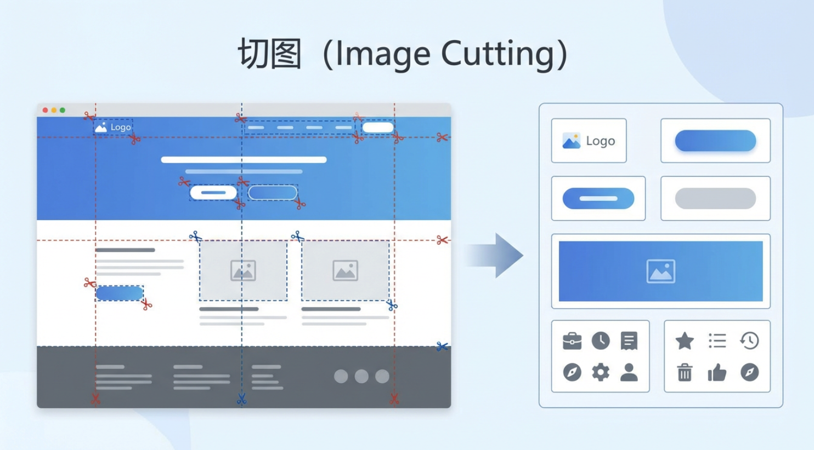

Hai là "đo kích thước": phải dùng tool đo có sẵn trong phần mềm, xác nhận từng cái width/height, khoảng cách giữa các module (margin/padding), đảm bảo mọi kích thước chính xác đến pixel;

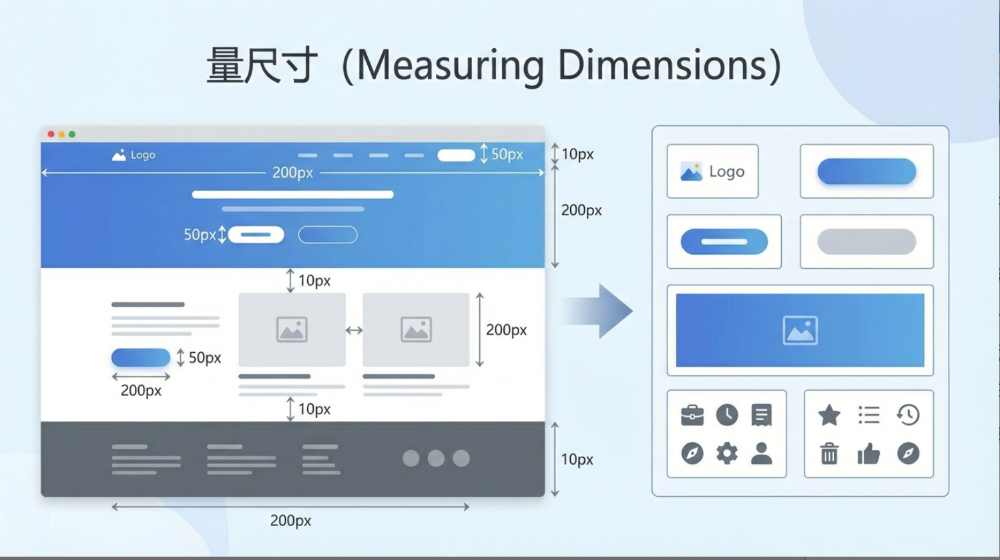

Ba là "trích annotation": phải extract các param ẩn "không thấy được nhưng phải có" từ bản thiết kế — font size, weight, line height, RGB hoặc HEX color của mỗi block. Tương đương "trích" tay các "spec thiết kế" designer không viết ra giấy.

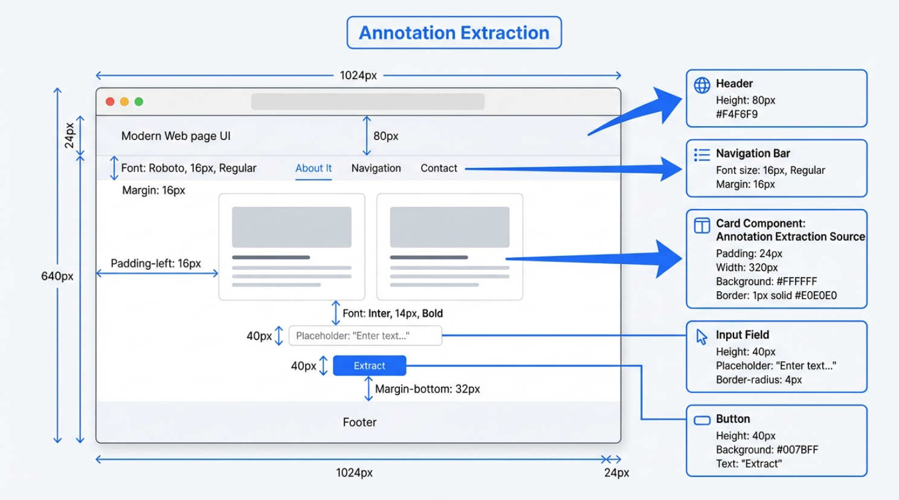

Sau đó, giai đoạn implement frontend mới thật sự bắt đầu. Dù dùng HTML/CSS/JS native hay framework như Vue, React, bản chất giống nhau. Frontend lấy "container làm tải core", theo cấu trúc và semantic của từng module trong design dựng lại structure page. Container ở đây là đơn vị có boundary layout rõ, chuyên chở và tổ chức element con — không trực tiếp hiển thị nội dung cụ thể, nhưng qua quy tắc Flex, Grid... vẽ phạm vi sắp xếp cho element bên trong. Còn "structure block" (như navbar top, sidebar, vùng list bài, footer — các function/content area mắt thường nhận ra), dựa container tồn tại; trong mỗi structure block còn lồng container nhỏ hơn để tổ chức element, ví dụ 1 item list bài có "container list item" điều khiển padding và layout, rồi bao title, summary, time, cover icon.

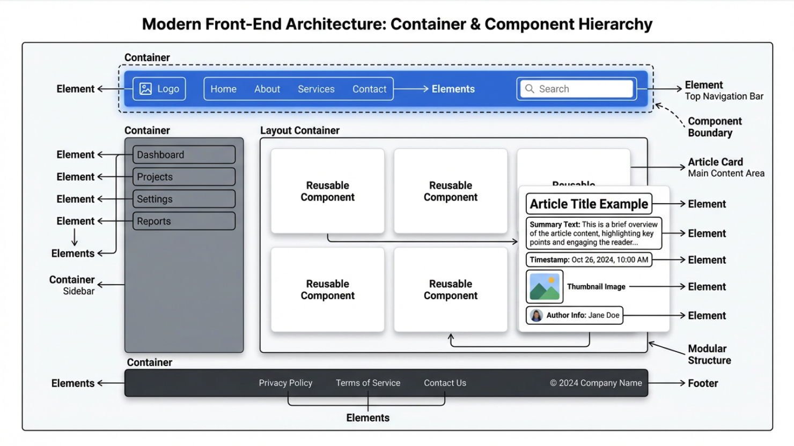

Trong framework frontend hiện đại, các "structure block (và container/element liên quan)" này thường được implement thành "component". Component có thể hiểu đơn giản: đơn vị giao diện tái sử dụng có boundary rõ, tích hợp layout container và logic. Vừa chứa container điều khiển ngoại hình và sắp xếp (như "button component" dùng container định width/height, border radius; "article card component" dùng container tổ chức vị trí title, cover), vừa đóng gói interaction logic. Phần xuất hiện lặp lại trong bản thiết kế, hình dạng giống nhau (button style thống nhất, card bài tái dùng nhiều) — trong code được abstract thành component: vừa tái dùng được ở các page/scenario khác nhau, giảm dev lặp; vừa qua rule thống nhất của container trong component, đảm bảo layout và style ở mọi chỗ dùng nhất quán cao.

Tiếp theo, frontend dùng style system khôi phục thị giác và layout. Tài nguyên PNG/JPG export ở giai đoạn slicing dùng làm ``, background của component hoặc structure block, hoặc import theo cách static asset của framework. Các value width/height/margin/padding/line-height từ giai đoạn đo size, chuyển thành thuộc tính style tương ứng. Các param từ giai đoạn trích annotation (color, font, shadow, border-radius, state hover/active) thực hiện ở CSS, CSS Modules, CSS-in-JS, Tailwind... thông qua `color`, `font-family`, `font-size`, `box-shadow`, `border-radius` và pseudo-class hoặc state class name. Lúc này, slicing, size và annotation cung cấp 1 nhóm param visual chính xác; component và structure block cung cấp đơn vị tổ chức code mang các param đó. Hai thứ kết hợp tạo thành implement UI maintain được, tái dùng được.

Nhưng, mode lấy local file làm trung tâm vốn dĩ kém hiệu quả. Version transfer qua email và cloud storage, draft mới-cũ dễ lẫn, design và dev phụ thuộc nhiều vào các phương pháp giao tiếp phức tạp trên — chi phí cộng tác và xác suất sai đều không thấp.

Mobile internet bùng nổ, độ phức tạp UI và nhu cầu tốc độ iterate tăng nhanh — Photoshop "to và đầy đủ" dần thấy nặng nề. Giai đoạn này xuất hiện Sketch. Sketch focus vào chính UI design, lột bỏ phần lớn gánh hậu kỳ thị giác. Dùng Symbols component hoá các element tái dùng cao (button, navigation, input) — 1 chỗ sửa, toàn cục đồng bộ. Kết hợp tool như Zeplin, tự sinh annotation và style snippet. Sketch đưa "tư duy component" vào workflow design. Nhưng vẫn là app desktop dựa local file, collaboration realtime phải qua cloud storage, plugin bên 3 hoặc version tool — chưa giải quyết tận gốc "nhiều người cùng sửa 1 file".

Thay đổi luật chơi thật sự là Figma. Từ 2016, nó tích hợp UI design, prototype, comment collab thẳng vào browser, hỗ trợ nhiều function hiện đại: con trỏ nhiều người realtime, comment online, version timeline, share link — giờ trông đơn giản, nhưng lúc đó là thách thức trực diện với mode Photoshop/Sketch.

Đến đây, UI design không còn là file rải rác trên máy ai nấy, mà tập trung trên 1 canvas cloud online, update realtime. Quanh canvas này, có thể tưởng tượng đi xa hơn — dùng cách tự động hoá hoặc AI mờ ranh giới giữa design và code frontend.

Ban đầu, chỉ dựa các plugin platform, bán-tự động export thông tin component, style từ bản thiết kế thành code snippet (skeleton React/Vue component, CSS variable). Core bản chất là qua plugin thực hiện extract thông tin có cấu trúc. Sau, khi năng lực platform tiến hoá, đa số platform design bắt đầu hỗ trợ function MCP (Model Context Protocol) cho mô hình lớn: protocol cung cấp 1 cơ chế chuẩn, cho mô hình lớn access file design, plugin interface, project metadata an toàn, kiểm soát được, rồi export bản thiết kế thành code tiện hơn.

Tiếp nữa, trên nền plugin và MCP, tự động hoá code frontend bước vào giai đoạn hỗ trợ native suy ra cấu trúc code thẳng từ bản thiết kế. Có thể trong công cụ design 1 click sinh skeleton project frontend, hierarchy component, style system và code result tương ứng. Cho designer và frontend engineer giải phóng khỏi việc bê chi tiết design tay, dành nhiều sức cho tối ưu UX và iterate version function.

---

## 2. Nhập môn Figma

Tiếp theo từ phần khái niệm trừu tượng tới thao tác thực tế. Vì thời gian, ta chỉ học logic thao tác cơ bản của Figma, đảm bảo dù bạn chưa dùng công cụ design nào, cũng theo được bài tập. Nếu muốn học function Figma đầy đủ, tham khảo tutorial chính thức chi tiết của Figma: https://help.figma.com/hc/en-us/sections/30880632542743-Figma-Design-for-beginners

Hoặc tham khảo tutorial sau, dựng nhanh trang portfolio cá nhân đơn giản: https://help.figma.com/hc/en-us/sections/35895585621655-Figma-Sites-collectio

Bên trái là entry tạo mới và quản tài nguyên project. Các nút góc trên phải là function thường gặp của Figma. Trong đó, Make dùng 1 câu để AI giúp gen draft UI hoặc structure đại khái trước; Design là workspace chính thật sự để vẽ UI web/App, dựng component và làm prototype; FigJam như whiteboard team, dùng dán sticky note, vẽ flow và bàn luận sớm; Buzz là tool sản xuất tài sản brand theo quy mô, dùng để batch sinh content giữ tính nhất quán brand; Site đưa các design thành web hoặc doc site truy cập được thật.

Nhìn qua, Figma function rất nhiều, không dễ vào, nhưng thực ra các tool function dạng này về bản chất đều "quen tay là biết". Đừng sợ thao tác sai lúc đầu, không cần nghĩ làm đúng 1 lần, chỉ cần chơi trước — chơi nhiều tự nhiên lên tay nhanh.

Trong tutorial này, để vào nhanh, ta sẽ giảng đơn giản function Design.

### 2.1 Tạo file Design mới

Ở trang chủ hoặc entry góc trên phải, chọn **Design**, tạo file mới — bạn vào canvas design trắng.
Giao diện chia 3 vùng: bên trái là page và layer, dùng xem và sửa quan hệ page/element; giữa là canvas, dùng xem hiệu ứng hiện tại; bên phải là properties và style, dùng sửa shape, color, style cụ thể; dưới có toolbar, dùng switch tool — gồm marquee, vẽ shape, nhập text, comment, plugin. Chọn tool xong, bấm Esc để về tool mouse mặc định.

### 2.2 Tạo Frame đầu tiên

Trước khi thật sự đặt element, cần xác định boundary rõ cho page — boundary này do Frame đảm nhận. Bạn chọn Frame tool ở toolbar dưới, hoặc bấm F, rồi kéo 1 vùng hình chữ nhật trên canvas.

1. Dùng Frame tool ở toolbar dưới, hoặc bấm `F`.
2. Kéo 1 vùng chữ nhật trên canvas, ở properties bên phải đổi width thành ví dụ `1440`, height `900`.
3. Ở layer panel bên trái, đổi tên Frame này, ví dụ `My First Page` hoặc tên project bạn.

Frame này là page container cho 1 màn UI. Sau đó các title, text, button, image đều nên đặt trong Frame này — không rải rác bất kỳ vị trí nào trên canvas. Lấy Frame làm boundary tổ chức nội dung giúp khi sau làm scroll setting, thích ứng device sizes, export hình và làm prototype — giữ cấu trúc kiểm soát được.

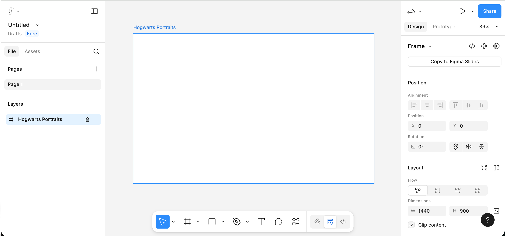

### 2.3 Đặt text và element đơn giản trong Frame

Có container rồi, học cách đặt các component cơ bản nhất: title, subtitle, button, image placeholder.

1. Chọn text tool (`T` ở toolbar dưới), bấm 1 cái trong Frame, nhập title page, ví dụ: `My Portfolio`.
   Ở properties bên phải, đổi font size lớn lên (ví dụ 96), font weight đậm hơn.
2. Dưới title, dùng text tool nhập 1 dòng mô tả đơn giản, ví dụ 1-2 câu mô tả page làm gì.
   Font size nhỏ hơn chút, line height giãn 1 chút, đọc bớt chật.
3. Vẽ button:
   Dùng rect tool vẽ 1 chữ nhật khoảng `200 × 48` dưới title, bên phải cho 1 fill color rõ, thêm chút border radius.
   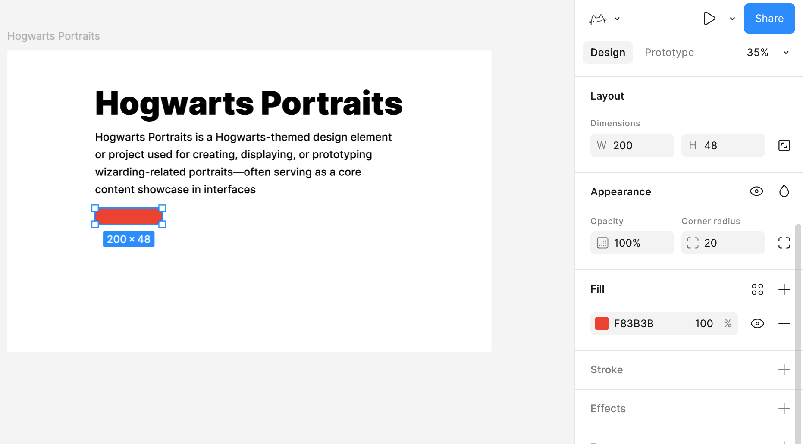
4. Dùng text tool nhập text button trên hcn, ví dụ `Get Started`. Chọn cả hcn và text, dùng align tool ở top để text căn giữa cả ngang và dọc.
5. Bên cạnh hoặc dưới button, vẽ 1 hcn xám nhạt lớn hơn làm "vùng placeholder ảnh", sau dùng để đặt ảnh demo.

Đến đây, bạn đã có 1 "draft trang chủ" rất thô nhưng cấu trúc đầy đủ: 1 title, 1 đoạn text, 1 button, 1 vùng hiển thị chính.

### 2.4 Dùng tốt Auto Layout để tích hợp element

Nếu mọi element chỉ kéo tuỳ tiện, page nhanh loạn. Khái niệm rất quan trọng trong Figma là **Auto Layout**, biến 1 nhóm element thành container có rule.

Chọn "title chính + subtitle + button", bấm **Add Auto layout** ở properties bên phải.

Lúc này 3 thứ được gói vào 1 container, bạn điều chỉnh param ở bên phải — layout element bên trong tự thích ứng theo param:

- Xếp dọc hay ngang.
- Khoảng cách giữa element bao nhiêu.
- Cả block này cách viền container bao nhiêu (padding).

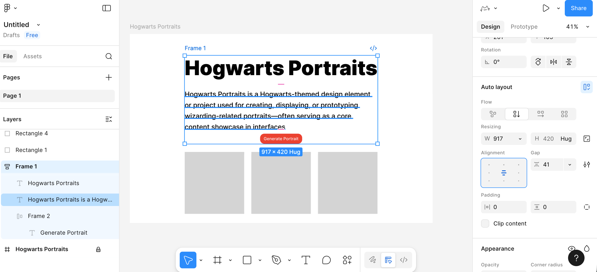

Tương tự, bên trong button cũng dùng Auto Layout được, để khi đổi text, độ dài button tự đổi.

Chọn cả hcn background button và text button, add Auto Layout, biến 2 thứ này thành 1 "button container". Rồi chọn button container, set width và height thành **Hug contents**. Vậy text luôn giữa button, text nhiều ít gì button cũng tự co giãn.

### 2.5 Biến button thành component tái dùng

Giờ ta học khái niệm mới — component. Component nghĩa là element có thể tái dùng nhiều lần, như button — chỉ cần đoán sau còn dùng nhiều lần, có thể nghĩ tới biến nó thành component. Trên nền button vừa add Auto Layout:

1. Chọn cả button container.
2. Right-click chọn Create component.
   

Cứ vậy, button từ nhóm layer thường biến thành component master. Sau, nếu cần button cùng style ở page hay Frame khác, kéo thẳng từ Assets panel bên trái ra dùng.

Lúc này mọi button dùng đều là copy đồng bộ của master. Khi bạn sửa color, border radius hay khoảng cách của master, mọi instance tự đồng bộ update.

Đến đây, bạn đã làm chủ cách dùng Figma đơn giản ban đầu. Không cần ngay lúc đầu hiểu hết function, chỉ cần làm theo dựng được page đơn giản đầu, quen các thao tác core này, rồi từ từ explore thêm năng lực trong tutorial chính thức — dùng nhiều lần chắc chắn lên tay.

---

## 3. Nhập môn MasterGo

Hiểu xong workflow cơ bản Figma, xem MasterGo. Có thể coi MasterGo đơn giản là "Figma phiên bản Trung Quốc", nhưng có khác biệt ở một số function. Tổng thể, nó kế thừa layout giao diện và ý tưởng thao tác giống Figma: cũng có canvas, layer tree và properties panel, cũng hỗ trợ component, style, auto layout và cộng tác nhiều người. Chi tiết hơn tham khảo tutorial chính thức MasterGo: https://mastergo.com/tutorials/12

### 3.1 Tạo file design mới

1. **Vào backend MasterGo**
   1. Mở web chính thức MasterGo và login.
   2. Vào sẽ thấy khu home dạng "file list / project list" để quản file design.
      

2. **Tạo file mới**
   1. Ở góc trên phải thấy nút + design file để bấm, hoặc chọn import file Figma.
   2. Bấm xong, bạn vào canvas trống — workspace design MasterGo.

3. **Hiểu các vùng giao diện cơ bản**
   Khi đã biết dùng Figma, cách dùng MasterGo gần giống, chủ yếu chia vài vùng:

   
   1. Toolbar trên: ở top canvas, bên trái là vị trí file và tên file, giữa là loạt nút function thường gặp (select, area/board, shape, text, note, comment, plugin select và AI tool), bên phải là member online hiện tại, entry share và entry control zoom/preview canvas.
   2. Panel trái: chia layer và resource. Hiện đang ở tab layer, thấy list page, và structure-hierarchy mọi layer của page đó.
   3. Vùng canvas giữa: workspace vẽ và layout cụ thể, mọi Frame, component, hình hiển thị ở đây.
   4. Panel properties phải: xem và edit properties của object đã chọn — size, position, alignment, fill, stroke, border radius. Nếu không chọn object, hiện setting liên quan canvas: background canvas, label, export option.

### 3.2 Tạo Frame đầu tiên

Trước khi đặt đồ, ta cần 1 page container để xác định boundary và size UI. Container này trong MasterGo thường gọi Frame.

**Bước:**

1. **Chọn Frame tool**
   1. Trong toolbar tìm Frame/board tool, bấm là dùng được param preset tạo nội dung thẳng vào board.
   2. Hoặc dùng shortcut (thường `F`, nếu khác thì theo UI thực tế).
2. **Kéo 1 vùng chữ nhật trên canvas**
   1. Kéo xong, bạn thấy 1 vùng có khung selected.
   2. Panel properties bên phải, thấy width và height của Frame này.
   3. Đổi width thành ví dụ `1440`, height thành `900` (size 1 thường dùng cho 1 màn web).
3. **Rename Frame**
   1. Tìm Frame này trong layer panel trái.
   2. Double-click name, đổi thành tên project, ví dụ `My First Page`, hoặc tên page bạn tự đặt.

### 3.3 Tạo content board

Có container rồi, dùng cách tương tự đã dạy trong Figma, dễ ra page hiển thị tương tự. (Bạn có thể thử copy element text từ board Figma, có thể paste import trực tiếp text component.)

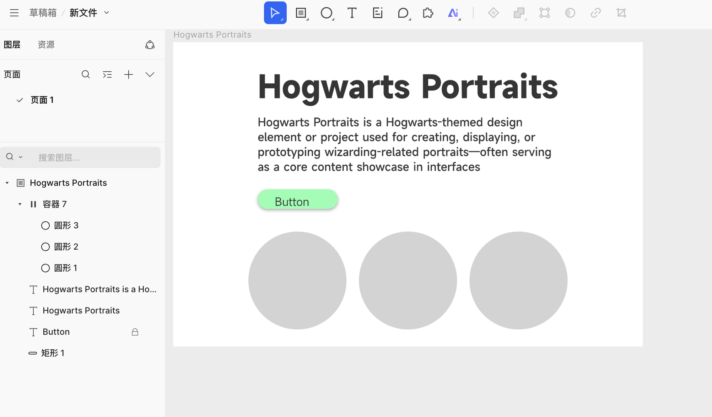

Đáng chú ý là behavior function Auto Layout hơi khác. Trong MasterGo, nếu muốn implement độ dài button đổi theo độ dài text giống Figma, cần đầu tiên tạo 1 container hoặc component trên nền element hcn tương ứng, như hình:

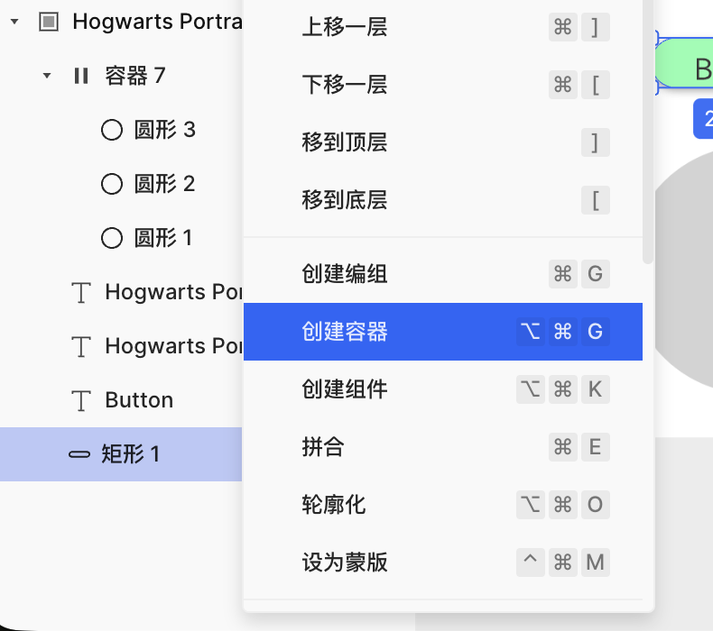

Sau tạo container thành công, đặt button hcn và text vào container parallel tương ứng, rồi tìm nút Auto Layout ở bên phải bật function tự động — implement thành công độ rộng button đổi theo độ dài text.

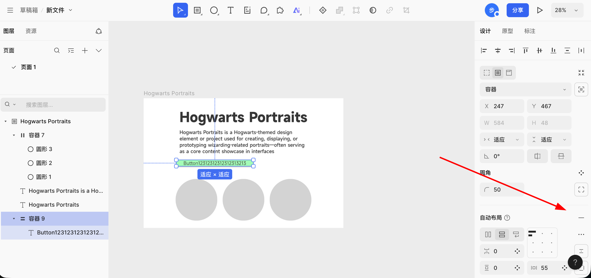

### 3.4 AI gen page

Trong MasterGo, function thú vị đáng chú ý là AI gen page. Bạn có thể dùng 1 câu hoặc kèm ảnh tham khảo, gen component MasterGo editable tương ứng, và lấy code có thể dùng ngay. Có thể dùng tiếng Trung hoặc tiếng Anh nhập nhu cầu thẳng, page sẽ return doc layout page cấu trúc rõ theo nhu cầu, hiệu quả:

Design doc gen xong, bấm Start gen, đợi chút là nhận được hiệu ứng web thực tế tương ứng:

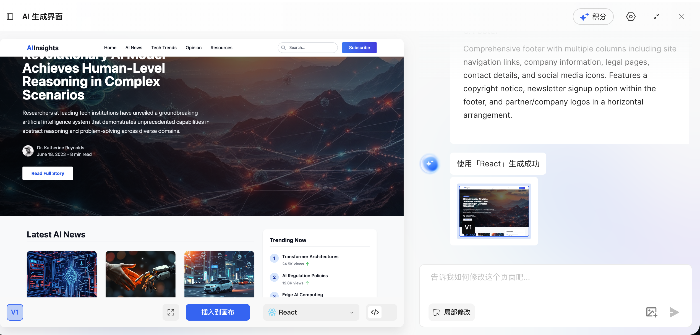

Lúc này bạn có 2 option thao tác: 1 là bấm nút xanh insert thẳng kết quả gen vào canvas, 2 là bấm function code preview, lấy thẳng code đầy đủ page hiện tại. Giao diện thao tác cụ thể:

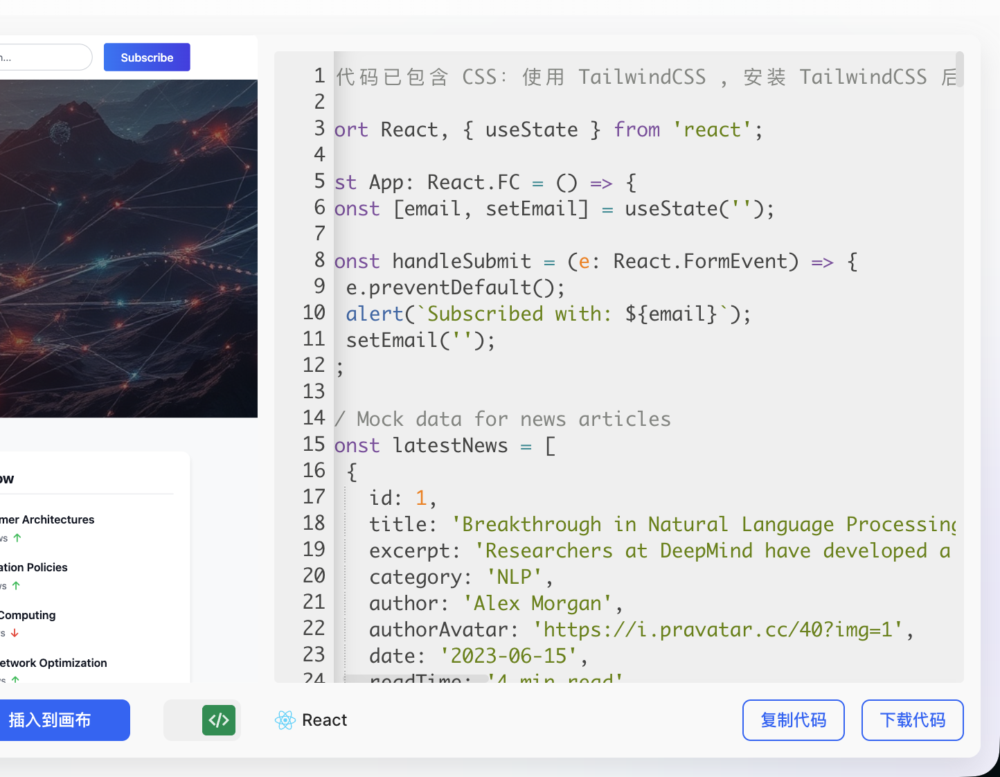

Sau insert kết quả vào canvas, bạn còn có thể adjust tinh hơn layout tổng thể, chi tiết element (font, color, spacing) cho đến khi hiệu ứng cuối hoàn toàn khớp kỳ vọng.

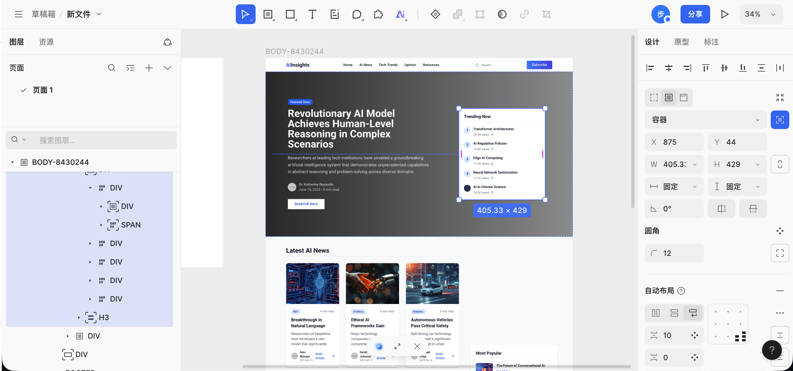

---

## 4. Bước tiếp: từ prototype tới code

Trong nội dung trên, ta đã học thao tác cơ bản Figma và MasterGo, có thể tạo prototype UI cấu trúc đầy đủ. Bước then chốt tiếp: **làm sao biến các bản design này thành code frontend thật sự chạy được trong browser?**

::: tip 📚 Tutorial sau
Cách chi tiết tham khảo [Từ prototype design tới code project](../design-to-code/), bạn sẽ học:

- **Chuyển trực tiếp bằng AI multimodal**: gửi screenshot bản design cho AI, gen thẳng code HTML/React
- **Figma Make**: dùng AI tool chính thức Figma khôi phục độ chính xác cao bản design và export code
- **MasterGo AI**: 1 click gen page editable và lấy code

Các cách có ưu nhược khác nhau, hợp scenario khác. Khuyến nghị chọn workflow phù hợp theo nhu cầu project.
:::

---

## 5. Tổng kết

Qua chương này, bạn đã làm chủ:

1. **Giá trị công cụ thiết kế frontend**: hiểu vì sao cần công cụ thiết kế, cách chúng giải quyết vấn đề phân bổ thông tin và cộng tác team.

2. **Thao tác cơ bản Figma**:
   - Tạo file Design và Frame board
   - Add text, shape và element cơ bản
   - Dùng Auto Layout implement layout tự thích ứng
   - Tạo component system tái dùng

3. **Thao tác cơ bản MasterGo**:
   - Quen layout UI tương tự Figma
   - Tạo Frame và content board cơ bản
   - Dùng function AI gen page để tạo nhanh prototype

::: tip 💡 Bước tiếp theo
Giờ bạn đã làm chủ cách dùng cơ bản công cụ thiết kế frontend, có thể thử:
- Tự design 1 page portfolio cá nhân
- Design UI prototype cho project tiếp
- Học [Từ prototype design tới code project](../design-to-code/), biến bản design thành code chạy được

Nếu đang làm project [Cùng làm chân dung Hogwarts](../hogwarts-portraits/), có thể design UI prototype trước, rồi export code kết hợp với function AI chat.
:::

<RelatedArticlesSection
  title="Bài liên quan"
  description="Khuyến nghị tiếp tục học UI design chuyên sâu và thực chiến design-to-code."
  :items="relatedArticles"
/>
