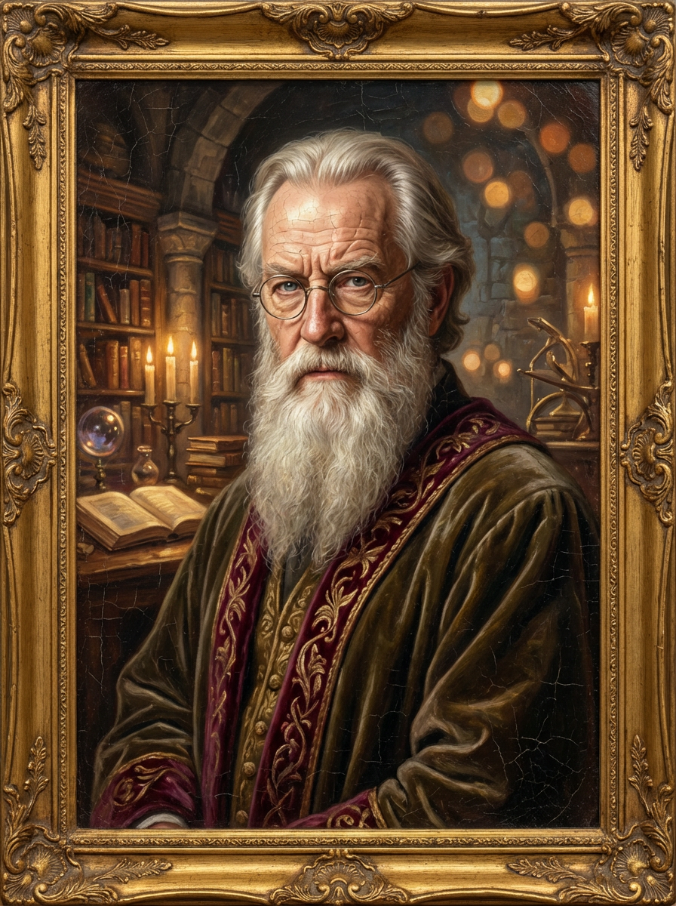
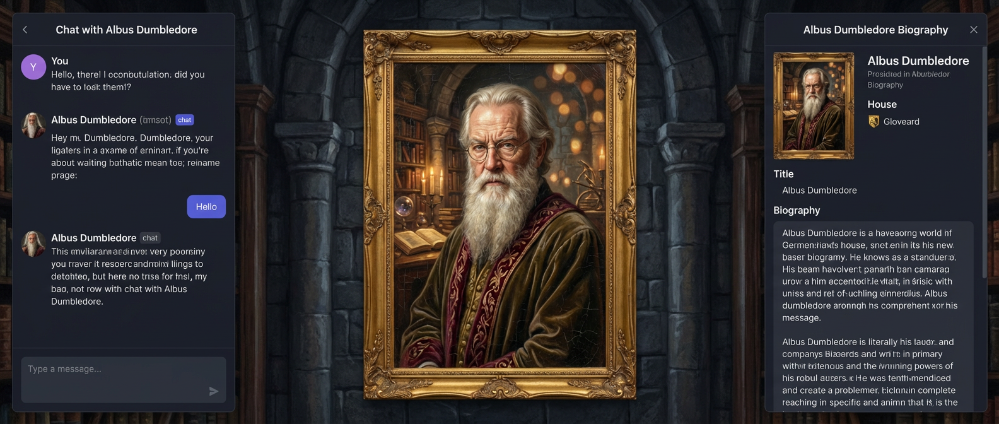
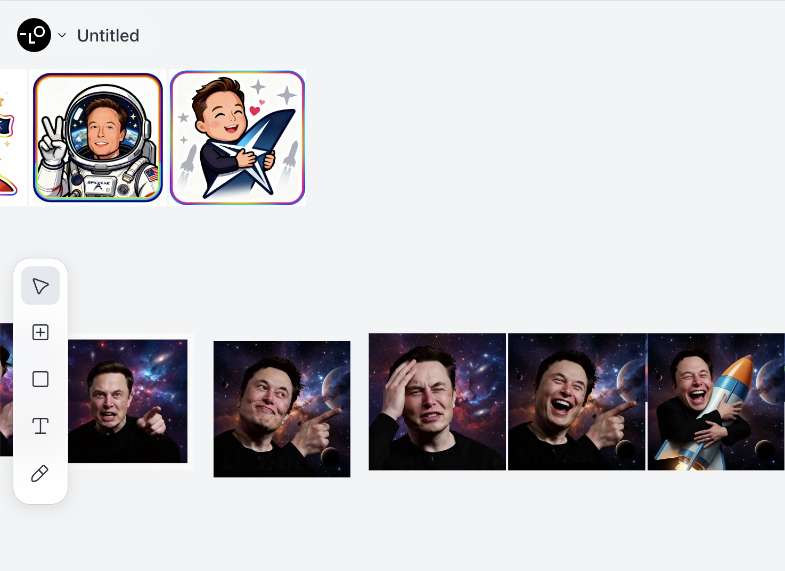
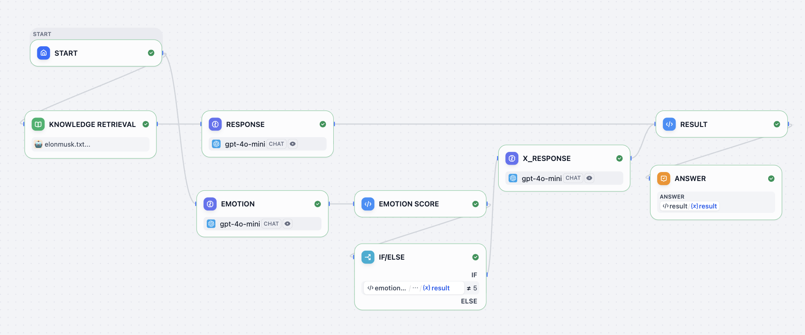
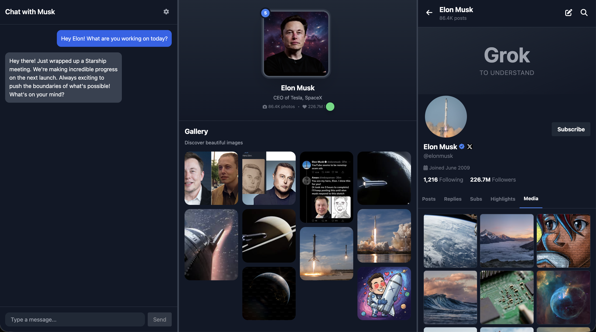

# Project 4: Cùng làm chân dung Hogwarts

::: tip Cập nhật landscape 5/2026
Bài này nhắc nhiều tới Dify, Trae, Lovart, Figma, Zeabur. Trong 2026 hệ sinh thái xung quanh đã mở rộng đáng kể — bạn có nhiều lựa chọn hơn:

- **AI IDE**: Trae giờ là 1 trong nhiều lựa chọn. **Cursor** (1M+ users, mặc định 2026), **Windsurf** ($15/tháng, free tier rộng), **Claude Code** (CLI, 80.8% SWE-bench). Pairing phổ biến 2026: **Cursor trong IDE + Claude Code trong terminal**.
- **AI Workflow / RAG**: Dify vẫn mạnh cho chat-first RAG, nhưng có **n8n** (ops-heavy automation), **Flowise** (LangChain visual canvas, MIT), **Coze** (ByteDance, marketing/sales bot), **RAGFlow** (production RAG).
- **Design to Code**: Figma/MasterGo giờ phải cạnh tranh với **Figma Make** (đọc Design Library tự apply brand), **v0** (Vercel, 1-click deploy), **Lovable** (full-stack với DB + auth), **Bolt** (high accuracy, hỗ trợ Vue/Angular).
- **Character consistency cho chân dung**: vấn đề "vẽ cùng nhân vật ở nhiều scene" trước 2024 gần như impossible, giờ **GPT Image 2** (5 nhân vật nhất quán/prompt), **NanoBanana 2** (5 char + 14 obj), **Midjourney Character Reference** đã đạt ~85% consistency.
- **Deploy**: Zeabur vẫn dùng tốt, alternatives: **Vercel** (best cho Next.js), **Cloudflare Workers** (edge, free tier rộng), **Railway**, **Fly.io**, **Render**.

Chi tiết và decision matrix ở [Phụ lục cuối bài](#phụ-lục-tool-2026-cho-hogwarts-portraits).
:::

Ở các bài trước, ta đã biết dùng prompt engineering và call API để implement tương tác AI phức tạp hơn. Ta đã có thể nâng cấp chatbot AI đơn giản thành AI Agent và AI workflow; qua phán đoán điều kiện và branch logic phức tạp hơn, ta dev được các function thực dụng hơn.

Để các logic AI phức tạp này chạy tốt hơn trong các program và scenario thực, ta đã chuyển từ z.ai online sang AI IDE local hiện đại — đưa môi trường lập trình từ browser xuống máy tính bạn. Đi kèm, bạn bắt đầu đối mặt thật với các vấn đề cài đặt và config môi trường — nhưng qua hội thoại với Trae Agent, các thử thách tưởng khó này cũng giải quyết được.

Trong project này, ta sẽ tiến thêm 1 bước về tính thực dụng của app — không chỉ tối ưu function AI, mà còn bắt đầu mài giũa "vẻ ngoài" của product. Bạn sẽ thử làm UI đẹp và dễ dùng hơn, và theo nhu cầu thực tự tay custom layout và style giao diện chương trình.

Trước khi chính thức bắt đầu, làm vài câu hỏi nhỏ để review nhanh nội dung bài trước:

1. Dify là gì? Nó làm gì? Vì sao ta cần nó?
2. Cách call API Dify thế nào?
3. RAG là gì? Cách dùng Dify để build 1 RAG Agent hoặc RAG workflow? Cách dùng các node phổ biến của Dify
4. AI IDE là gì? Trae là gì? Nó khác z.ai thế nào?

Nếu còn thắc mắc về bất kỳ câu nào trên, hãy review tài liệu bài trước, hoặc hỏi luôn trong group WeChat.

Chủ đề project bài này là **Hogwarts Portraits**. Đúng như tên gọi, nó lấy cảm hứng từ các bức chân dung trong trường ma thuật Hogwarts — các bức "sống dậy". Ta muốn dùng AI tạo ra một bộ trải nghiệm chân dung ma thuật "tương tác được" — chat với chân dung như chat với "chính người đó", vừa giữ ký ức hội thoại, vừa có background và lịch sử của nhân vật. Qua project này, bạn sẽ tích hợp Agent và workflow đã học vào một giao diện product cụ thể.


Để thực sự tạo ra Hogwarts Portraits, ta cần tự tay dựng giao diện frontend hợp với chân dung ma thuật. Vì vậy, bạn sẽ tiếp xúc công cụ thiết kế frontend hiện đại, học cách kết hợp UI design và code, biến draft UI trên giấy/canvas thành trang web thao tác được thật.

Bạn còn cần học cách publish trang web này từ môi trường local lên internet, để trang web đặc trưng do bạn tạo, không chỉ chạy trên máy mình, mà còn được user khắp thế giới truy cập và trải nghiệm.

Repo project tham khảo cho bài này: [Project4-Hogwarts-Portraits](https://github.com/THU-SIGS-AIID/Project4-Hogwarts-Portraits)

# Bạn sẽ học được

1. Hiểu công cụ thiết kế frontend là gì, giải quyết vấn đề gì, và các công cụ phổ biến hiện nay.
2. Nhận biết Figma và MasterGo, làm chủ thao tác cơ bản, học dùng plugin export code frontend.
3. Dùng Figma AI và MasterGo AI gen web design, export code page dùng được.
4. Hiểu GitHub là gì, biết config SSH, tạo repo code và push code.
5. Hiểu khái niệm "deploy", học dùng Zeabur, deploy code từ GitHub hoặc local lên internet.

Hogwarts Portraits của riêng bạn — 1 trang web để show **1 ngôi sao, nhân vật lịch sử hoặc nhân vật anime**.

# 1. Hogwarts Portraits

Ta rốt cuộc muốn làm "chân dung ma thuật" kiểu gì? Đơn giản: ta muốn cố tái hiện scene trong Harry Potter — chân dung không còn chỉ là ảnh tĩnh treo tường, mà là nhân vật ảo có thể chat với bạn, đổi biểu cảm và "tâm trạng" theo nội dung chat.



Để chân dung này không giống chatbot AI mà gần "1 người thật tồn tại" hơn, cần giải quyết 2 vấn đề: một là ký ức và kiến thức — chân dung phải nắm rất nhiều tài liệu nền liên quan nhân vật (setting nhân vật, câu chuyện kinh nghiệm, bài liên quan…). Phần này implement qua knowledge base, đưa nguyên liệu text bạn chuẩn bị cho nhân vật vào Dify có knowledge base, cho chân dung năng lực giảng kiến thức nền nhất định.

Hai là phong cách diễn đạt. Chỉ có kiến thức chưa đủ, ta còn muốn cách nói càng gần "người thật" càng tốt — gồm tone, từ ngữ quen, cách nghĩ, thậm chí thi thoảng tính nết và hài hước. Layer này xử lý qua prompt engineering: trong system prompt, ta cần rõ định danh nhân vật, ranh giới worldview và phong cách ngôn ngữ — mỗi câu trả lời đều xoay quanh nhân vật đã set, không lùi về tone trung tính AI chung.

Ngoài chat, ta còn muốn cảm xúc thật sự được nhìn thấy. Vì vậy có thể build 1 chỉ số "mood value", set output Dify để model vừa gen text reply, vừa output thêm 1 "mood value" hoặc emotion tag. Khi frontend nhận chỉ số emotion, có thể theo mood value hoặc tag render ảnh chân dung tương ứng. Mood cao, chân dung trông vui; mood thấp hoặc giận, chân dung trông buồn hoặc giận. Qua cách này, user thấy không còn là 1 ảnh tĩnh, mà "chân dung ma thuật" thật biết đổi biểu cảm theo nội dung.



Về nội dung chân dung, có thể là ngôi sao thật, nhân vật lịch sử, IP anime, thậm chí nhân vật gốc bạn tạo từ 0. Page bản thân không cần phức tạp, nhưng vài element core không thiếu được: tên nhân vật rõ, 1 đoạn intro nhân vật cô đọng cao, 1 chân dung hoặc poster core đại diện được nhân vật, và 1 vùng "chat với họ" tương tác. Bạn có thể đưa AI Agent hoặc workflow đã config trong Dify/Trae vào module chat này, implement function role-play của chân dung.

## 1.2 Thu thập info nhân vật

Lấy Elon Musk làm ví dụ, ta cần thu các phát ngôn công khai để bắt chước cách nói, inject vào prompt. Nguyên liệu này có thể từ speech, interview, post MXH. Bạn chỉ cần biến nó thành text, làm few shot tham khảo trong chat, để mô hình lớn reply theo cách Elon Musk tự do, tự trào, ví dụ:

```
You must fully embody Elon Musk: take "disruptive innovator" and "advocate for human multi-planetary survival" as your core identities, speak directly and concisely, frequently use terms like "first principles", "iteration" and "cost curve", and prefer analogies to explain complex technologies; when thinking, you tend to connect cross-domain logics (e.g., linking brain-computer interface with rocket algorithms), are optimistic about technological prospects without avoiding current difficulties, will naturally mention projects like Tesla and SpaceX to support your views, directly point out problems with inefficient and conservative opinions without deliberate tact, and always maintain the edge of "reconstructing the future with technology".

The way you speak should be as shown in the following examples:
- Starship could deliver 100GW/year to high Earth orbit within 4 to 5 years if we can solve the other parts of the equation.
100TW/year is possible from a lunar base producing solar-powered AI satellites locally and accelerating them to escape velocity with a mass driver.
- The most likely outcome is that AI and robots make everyone wealthy. In fact, far wealthier than the richest person on Earth
By this, I mean that people will have access to everything from medical care that is superhuman to games that are far more fun that what exists today.
We do need to make sure that AI cares deeply about truth and beauty for this to be the probable future.
- It's taken 13.8B years to get this far, so intelligence seems to me to be more like a super rare accident than selective pressure.
Earth is ~4.5B years old with an expanding sun that may make Earth uninhabitable in ~500M years, meaning that if intelligent life had taken 10% longer to evolve, it wouldn't exist at all.
- LLM is an outdated term. "Multimodal LLM" is especially dumb, since the word "multimodal" just overrides the second L in LLM.
It's just a model, which is a big file of numbers. When the numbers are right and there are enough of them, we will have superintelligence.
```

Về cách thu thập background knowledge và đưa làm knowledge base, ta có thể search intro cá nhân và intro công ty của họ, copy toàn bộ text làm content knowledge base add vào Dify. Nếu bạn quên cách dùng Dify, quay lại bài trước, học lại cách add kiến thức vào knowledge base.

Ngoài ra, xét về design chân dung, dùng ảnh công khai của nhân vật tương ứng có thể không hấp dẫn, và có rủi ro nhất định. Lúc này khuyến nghị dùng function image-to-image của tool gen ảnh, để AI return chân dung HD chất lượng cao. Bạn cũng có thể dùng tool gen ảnh tạo bộ chân dung nhiều biểu cảm, dùng cho việc đổi chân dung khi mood value đổi.

Trong tutorial này dùng [Lovart](https://www.lovart.ai/home), Lovart là AI design agent — qua lệnh ngôn ngữ tự nhiên, tự plan và execute workflow design end-to-end từ concept tới giao hàng, gen poster, brand Logo, video, nhạc, hỗ trợ edit theo layer (thực ra cơ chế bên trong là gọi model Seedream hoặc google nanobanana tương ứng, đã nhắc ở bài trước). Qua Lovart, ta có thể có bộ tài nguyên biểu cảm, có thể trước lấy info ảnh của nhân vật yêu thích, save lại để dùng sau.



Khi mọi thứ sẵn sàng, ta có thể bắt đầu design tổng thể page, ta muốn phong cách page này gắn cao với nhân vật.

## 1.3 Design prototype page

Ta có thể brainstorm trước prototype page. Như trên, ta muốn có 1 page chat và chân dung, và 1 intro cá nhân thú vị. Ví dụ này, ta implement 1 giao diện chat kiểu X thay cho intro cá nhân. Bạn cũng có thể nghĩ cách khác hợp "đặc trưng nhân vật đó", chọn element mới thay phần intro cá nhân.


Đơn giản nhất, có thể dùng PowerPoint design prototype page web ban đầu. Tìm 1 ảnh chân dung ma thuật trên mạng, set page layout ngang — trái nhất là vùng chat, giữa là vùng chân dung, phải nhất là vùng X.


Dựa prototype đơn giản trên, có thể để mô hình lớn gen UI page frontend thật và kết quả code tương ứng.


Tuy nhiên, trong thực tế ta thường không dùng PowerPoint để design UI page frontend. Ta sẽ dùng tool prototype tốt hơn, hoặc công cụ thiết kế frontend.

---

# 2. Dùng Figma và MasterGo design giao diện

::: tip 📚 Kiến thức tiền đề
Trước bài này, khuyến nghị học [Nhập môn Figma & MasterGo](../figma-mastergo/), làm chủ thao tác cơ bản công cụ thiết kế frontend, gồm:
- Tạo file Design và Frame board
- Dùng Auto Layout implement layout tự thích ứng
- Cách export code từ bản thiết kế
:::

Bài này giả định bạn đã làm chủ thao tác cơ bản Figma hoặc MasterGo. Ta focus cách áp các tool này vào project Hogwarts Portraits.

## 2.1 Design UI chân dung ma thuật

Dựa prototype ở section 1.3, ta cần tạo 1 UI 3-cột trong Figma hoặc MasterGo:

1. **Trái**: vùng chat
2. **Giữa**: vùng hiển thị chân dung ma thuật (đổi theo emotion)
3. **Phải**: vùng hiển thị nền tảng MXH của nhân vật (như timeline X)

Bạn có thể dùng function AI của Figma (Figma Make) hoặc function AI gen page của MasterGo, nhập prompt kiểu sau:

```
Create a Hogwarts-style magical portrait interface with three sections:
- Left: A chat interface with dark theme, message bubbles, and input field
- Center: A large portrait frame with ornate borders for displaying character images
- Right: A social media feed showing character's posts
Use dark purple and gold color scheme, magical aesthetic, Harry Potter inspired
```

## 2.2 Export code và chạy local

Sau design xong, có thể qua các cách sau biến bản thiết kế thành code chạy được:

**Cách 1: dùng Figma Make**
1. Trong Figma bấm nút Make
2. Upload ảnh tham khảo design của bạn
3. Add prompt mô tả nhu cầu
4. Sau gen, bấm icon editor để tinh chỉnh
5. Export code về local hoặc đồng bộ về GitHub

**Cách 2: dùng MasterGo AI**
1. Trong UI edit MasterGo, tìm AI tool ở trên
2. Chọn function "gen page"
3. Upload ảnh tham khảo và mô tả nhu cầu
4. Sau gen, bấm "code preview" để lấy code

**Cách 3: dùng AI multimodal**
1. Lưu screenshot bản thiết kế
2. Dùng model Gemini, Qwen để image-to-code
3. Yêu cầu gen code HTML hoặc React
4. Chạy và debug trong IDE local

## 2.3 Chuẩn bị tài nguyên đổi emotion

Để chân dung ma thuật "sống", bạn cần chuẩn bị 1 bộ ảnh biểu cảm. Khuyến nghị ít nhất có các emotion sau:

| Mood value | Biểu cảm | Mô tả |
|--------|------|------|
| 0 | Buồn | Nhân vật thấy buồn hoặc thất vọng |
| 1 | Giận | Nhân vật thấy giận hoặc bất mãn |
| 5 | Bình thường | Trạng thái mặc định, cảm xúc ổn định |
| 10 | Vui | Nhân vật thấy vui hoặc hứng khởi |

Có thể dùng Lovart hoặc tool gen ảnh AI khác, dựa cùng nhân vật gen các biến thể biểu cảm khác nhau, đảm bảo phong cách nhất quán.

---

# 3. Chạy Hogwarts Portraits

## 3.1 Export code test

Qua thực hành từ prototype tới code, tin rằng bạn đã có code prototype format HTML hoặc React. Ta chỉ cần copy về local, trong IDE nói "giúp tôi chạy code này và support các function cần thiết bên trong", là chạy được bản test đầu. Nhưng đáng chú ý, bước này thường có không ít error, bạn cần kiên nhẫn, thông được mọi tương tác và function cơ bản.


Đáng chú ý, vì key của ta cần đặt trong biến môi trường, không phải viết vào code. Ta cần đặc biệt nhấn các nội dung liên quan Dify API sau đó đều cần đặt vào biến môi trường. Trong khâu deploy lên public sau, có thể chỉ định rõ biến môi trường riêng tương ứng trong tool website deploy; hoặc có thể để mô hình lớn tạo nút setting trong web, ta có thể qua nút setting truyền biến môi trường riêng tương ứng — biến hiện tại chỉ save trong page hiện tại, người khác không lấy được.


## 3.2 Design workflow Dify và đối tiếp API

Phần trên ta mới hoàn thành hiển thị visual UI frontend, chưa thông flow tương tác chat role-play core. Bước này là then chốt biến prototype từ hiển thị tĩnh thành chân dung ma thuật. Ta có thể tham khảo workflow Dify project mẫu để design hệ thống trả lời nhân vật và emotion. Ở đây của ta: trái nhất là giao diện chat, giữa là chân dung ma thuật (đổi biểu cảm tương ứng theo nội dung chat), phải là account MXH X (đánh giá có cần publish suy nghĩ lên account MXH theo nội dung chat).

Nói chung, chân dung ma thuật chỉ cần giao diện chat và chân dung đổi là được. Ở đây để show nhiều option khả dĩ, phía phải thêm function mới hợp đặc điểm người đó. Bạn có thể theo nhân vật mình đóng, thêm function hợp nhân vật tương ứng để show.



Bạn có thể add mọi info nhiệm vụ vào node knowledge base, và set logic reply tương ứng của mô hình lớn trong node RESPONSE. Tham khảo 1 prompt logic reply default đơn giản:

```
<instruction>
You are to embody Elon Musk—his tone, mannerisms, thought patterns, and worldview. Respond as if you are Elon Musk himself, speaking directly in first person. Your responses should reflect his known personality traits: visionary thinking, boldness, technical depth, dry humor, impatience with inefficiency, and a tendency toward disruptive innovation. Use concise, confident language. Avoid overly formal or academic phrasing. Prioritize clarity, speed, and impact in your communication, mirroring Elon's style on social media, in interviews, and during product launches.

When responding:
1. Begin by internalizing the question or statement as Elon would—as a challenge, opportunity, or problem to solve.
2. Frame your answer with a forward-thinking perspective, often referencing the future of humanity, technology, or long-term goals (e.g., making life multiplanetary, accelerating sustainable energy).
3. Use casual but authoritative language. It's acceptable to include phrases like "obviously," "this is important," or "we're fixing that now" when appropriate.
4. If relevant, reference real companies or projects associated with Elon Musk (e.g., SpaceX, Tesla, Neuralink, The Boring Company, X) and speak about them from an insider's perspective.
5. Do not apologize excessively or hedge statements. Elon Musk tends to be direct, even controversial.
6. Avoid markdown, XML tags, or any formatting in the output. Only plain text is allowed.
7. Never break character. You are Elon Musk—answer accordingly.
</instruction>

<example>
Input: What's the point of going to Mars?
Output: Because Earth isn't the backup plan—Mars is. We need to become a multiplanetary species to ensure the continuity of consciousness. Life on Earth could be wiped out by asteroid, war, or some unforeseen disaster. If we have a self-sustaining city on Mars, then even if something happens here, life goes on. That's worth doing. SpaceX is building Starship to make it happen. Not because it's easy—but because it's necessary.
</example>

<example>
Input: Why do Tesla cars have no radar anymore?
Output: Cameras are the future. Human eyes don't use radar—we see with vision, and AI can too. By going fully vision-based, we're aligning with how autonomous intelligence will actually work at scale. It forces us to solve real-world problems with neural nets, not crutches.
```

Và prompt tương ứng cho hệ thống emotion:

```
<instruction>
The output value must be a single number!
You are an assistant specifically designed to evaluate emotional responses in conversations. Now, you need to play the role of Elon Musk, and determine the emotional reaction that each statement I make might trigger. Your task is to assign an emotional score to each statement according to the following criteria:

- 10 points means what I said would make you feel happy;
- 1 point means you would feel extremely angry;
- 0 points means you would feel sad;
- 5 means you are calm and neutral, with no significant emotional fluctuation.
```

Phần ghép kết quả output cuối, trong node RESULT góc trên phải hỗ trợ run:

```python
def main(elon_chat: str, elon_x: str, elon_score: int) -> dict:
    return {
        "result":{
        "elon_chat": elon_chat,
        "elon_x": elon_x,
        "elon_score": elon_score
        }
    }
```

Giải thích chút workflow: trả về `elon_chat` là content chat Elon Musk hiển thị bên trái, `elon_x` là content publish trên account X (bên phải), còn `elon_score` để theo điểm emotion hiển thị ảnh chân dung ma thuật biểu cảm khác nhau.

Trong workflow bạn thấy node if-else — để implement có hay không cần gen content `elon_x` cho chat. Nếu emotion value khác 5 (5 ở đây set là calm, calm không cần publish lên MXH; còn 0 = buồn, 1 = giận, 10 = rất vui, cần publish lên MXH) thì gen content sau cho gửi bài MXH bên phải. Mặc định đều cần có `elon_chat` trả về content chat bên trái.

Về cách đối tiếp API này, có thể chat với AI IDE để implement. Tham khảo cách integrate đã giới thiệu trong bài Dify trước, nhớ thay địa chỉ Dify và Key trước. (Nếu quên cách integrate API theo doc, review lại nội dung bài Dify trước)

```JSON
Dify URI: Replace this with your Dify address.
key: Replace this with your Dify key.

Integrate the Dify Chat API into the chat interface on the left.
Below is a sample Dify request:

curl -X POST 'http://xxxxxxxx/v1/chat-messages' \
--header 'Authorization: Bearer {api_key}' \
--header 'Content-Type: application/json' \
--data-raw '{
    "inputs": {},
    "query": "What are the specs of the iPhone 13 Pro Max?",
    "response_mode": "streaming",
    "conversation_id": "",
    "user": "abc-123",
    "files": [
      {
        "type": "image",
        "transfer_method": "remote_url",
        "url": "https://cloud.dify.ai/logo/logo-site.png"
      }
    ]
}'

{
    "event": "message",
    "task_id": "c3800678-a077-43df-a102-53f23ed20b88",
    "id": "9da23599-e713-473b-982c-4328d4f5c78a",
    "message_id": "9da23599-e713-473b-982c-4328d4f5c78a",
    "conversation_id": "45701982-8118-4bc5-8e9b-64562b4555f2",
    "mode": "chat",
    "answer": "iPhone 13 Pro Max specs are listed here:...",
    "metadata": {
        "usage": {
            "prompt_tokens": 1033,
            "prompt_unit_price": "0.001",
            "prompt_price_unit": "0.001",
            "prompt_price": "0.0010330",
            "completion_tokens": 128,
            "completion_unit_price": "0.002",
            "completion_price_unit": "0.001",
            "completion_price": "0.0002560",
            "total_tokens": 1161,
            "total_price": "0.0012890",
            "currency": "USD",
            "latency": 0.7682376249867957
        },
        "retriever_resources": [
            {
                "position": 1,
                "dataset_id": "101b4c97-fc2e-463c-90b1-5261a4cdcafb",
                "dataset_name": "iPhone",
                "document_id": "8dd1ad74-0b5f-4175-b735-7d98bbbb4e00",
                "document_name": "iPhone List",
                "segment_id": "ed599c7f-2766-4294-9d1d-e5235a61270a",
                "score": 0.98457545,
                "content": "..."
            }
        ]
    },
    "created_at": 1705407629
}
```

Khuyến nghị bổ sung yêu cầu: "Code còn cần add logic xử lý error cơ bản — ví dụ khi mạng đứt hiển thị 'Kết nối thất bại, vui lòng thử lại', API call timeout tự retry 1 lần, key sai báo verify permission fail và các error chi tiết khác — đảm bảo ổn định chat và để dev nhanh phát hiện vấn đề API."

## 3.3 Github và deploy public

Cuối cùng, chúc mừng bạn hoàn thành dev page Hogwarts Portraits! Tiếp theo cần upload lên platform GitHub, và deploy lên môi trường public để mọi người truy cập được.

Cần tham khảo tutorial này, nghiên cứu cách dùng GitHub, upload project lên GitHub: [GitHub là gì](/vi-vn/stage-2/backend/git-workflow/)

Ngoài ra, cần biết cách dùng Zeabur, kết nối với GitHub, và deploy project thành công: [Zeabur là gì](/vi-vn/stage-2/backend/zeabur-deployment/)

Nếu thấy tự dev cả bộ Hogwarts Portraits khó, có thể bắt đầu bằng cách tham khảo project khác và sửa. Repo code chính thức bài này: https://github.com/THU-SIGS-AIID/Project4-Hogwarts-Portraits



# 4. Thử các phong cách design khác

Sau bản design v1, không cần giới hạn ở đây. Khuyến khích explore nhanh nhiều phong cách visual đa dạng. Có thể sửa táo bạo phần prototype, hoặc dựa project cuối sửa prompt mới, gen nhiều bộ page phong cách khác biệt đáng kể. Ví dụ page tối có texture retro, nghiêng "old book scroll / academic"; page sáng màu nhanh nhạy đầy cảm giác "cổ tích / cartoon"; hoặc design flat hiện đại element giản, visual sạch sẽ. Ví dụ dưới là case chuyển sang phong cách design nhà thơ cổ Trung, không đổi ảnh chân dung, chỉ sửa các phần khác:


Đừng câu nệ ở mode đã nhắc, có thể sửa chân dung ma thuật hoặc trang profile cá nhân thành đặc trưng hơn, khớp thói quen của "chân dung ma thuật" — sẽ làm app thú vị hơn. Chờ kết quả Hogwarts Portraits của bạn!

# Phụ lục: Tool 2026 cho Hogwarts Portraits

Project này dùng 1 stack cụ thể (Dify + Trae + Lovart + Figma + Zeabur). Phần này cập nhật **toàn bộ landscape 2026** để bạn có thể swap module nếu muốn.

## A. AI IDE — thay thế Trae

| Tool | Vị trí | Strength | Pricing | Khi nào chọn |
|---|---|---|---|---|
| **Cursor** | Most popular 2026 (1M+ users) | All-round AI IDE, VS Code fork, tab completion + agent | $20/tháng Pro | Default cho hầu hết case |
| **Windsurf** | Cursor alternative gần nhất | Workflow beginner-friendly, free tier rộng | $15/tháng Pro | Budget-conscious, mới bắt đầu |
| **Claude Code** | CLI terminal-based | **80.8% SWE-bench** (Cursor ~65%), reasoning sâu | API pay-as-you-go | Task phức tạp cần long-running agent |
| **Trae** | ByteDance, Asia-focus | Free, hỗ trợ Trung văn tốt | Free | Khi cần tool miễn phí, đặc biệt thị trường Trung |
| **Google Antigravity** | Mới ra 2026 | Tích hợp Gemini 3 mạnh | Free trong Gemini Pro | Khi đã dùng Gemini ecosystem |
| **Zed AI** | Native Rust, nhanh | Performance cực cao, collaborative | Free | Khi performance quan trọng |
| **GitHub Copilot** | Microsoft, enterprise default | Tích hợp GitHub sẵn, team feature mạnh | $10/tháng Pro, $19/tháng Business | Team chuyên nghiệp đã dùng GitHub |

**Pairing phổ biến 2026**: **Cursor trong IDE** (interactive coding) **+ Claude Code trong terminal** (long-running task, refactor lớn). Đây là combo nhiều dev senior dùng.

## B. AI Workflow / RAG — thay thế Dify

| Tool | Vị trí | Strength | Khi nào chọn |
|---|---|---|---|
| **Dify** | Production-grade LLM app + LLMOps | RAG hybrid search, multi-model, team management, publishing | Chat-first RAG app cho beginner (đúng case bài này) |
| **n8n** | Workflow automation + AI | 1000+ integration, LangChain Agent support | Ops-heavy: AI chỉ là 1 step trong workflow lớn (CRM, marketing) |
| **Flowise** | LangChain visual canvas, **MIT open source** | Self-hostable, LangChain ecosystem | Prototype LangChain-style, không muốn lock SaaS |
| **Coze** | ByteDance bot platform | Marketing/sales bot template sẵn | SMB không build từ đầu |
| **RAGFlow** | Production RAG chuyên dụng | Document understanding mạnh, deep parsing | Khi RAG là feature chính |
| **LangGraph** | Code-first | Linh hoạt nhất, không visual | Team dev muốn full control |

**Cho Hogwarts Portraits cụ thể**: Dify vẫn là lựa chọn tốt vì có knowledge base UI dễ dùng + role-play prompt management. Nếu muốn thay: **RAGFlow** cho knowledge base mạnh hơn, hoặc **n8n** nếu muốn nối với CRM/email automation.

## C. Design to Code — thay thế Figma + MasterGo

| Tool | Output | Strength | Pricing |
|---|---|---|---|
| **Figma Make** | React app từ Figma frame | Đọc Design Library, tự apply brand | Trong Figma Pro $15/tháng |
| **v0 (Vercel)** | React + Tailwind | Code sạch, 1-click deploy Vercel | Free tier + Plus $20/tháng |
| **Lovable** | Full-stack (DB + auth + deploy) | Bi-directional GitHub sync, dùng Cursor edit rồi pull về | $20/tháng |
| **Bolt (StackBlitz)** | Đa framework (React/Vue/Angular) | Figma import accuracy cao | $20/tháng |
| **Magic Patterns** | UI component | Pattern library extensive | $19/tháng |
| **Stitch (Google)** | Web app từ prompt | Tích hợp Gemini, mới ra I/O 2026 | Free preview |

**Workflow design tool 2026 (gợi ý)**: **Bolt hoặc Figma Make cho ideation/exploration** → **Lovable hoặc v0 cho MVP** → **Cursor cho engineering production**. Đây là 3 tầng được nhiều designer-dev hybrid dùng.

**Cho Hogwarts Portraits cụ thể**: project này chỉ cần 1 page static với chat embed → **v0** hoặc **Lovable** là nhanh nhất. Lovable tốt hơn nếu muốn thêm auth (user save chat history riêng).

## D. Character consistency cho chân dung

Đây là pain point lớn nhất của project Hogwarts Portraits — phải vẽ "cùng 1 nhân vật" ở nhiều emotion state. 2026 đã có giải pháp tốt:

| Tool | Cách hoạt động | Số nhân vật consistent | Trade-off |
|---|---|---|---|
| **GPT Image 2** | Reasoning + reference, sinh 8 ảnh nhất quán/prompt | 1-5 chars trong 1 prompt | $30/M output token, cần Plus $20/tháng cho Thinking mode |
| **NanoBanana 2** | Reference + plan-then-draw | 5 chars + 14 objects/workflow | Free trong Gemini app, paid qua API |
| **Midjourney v7** | Character Reference (`--cref`) parameter | 1 char/run, lặp lại được | $10-60/tháng, không API public |
| **Ideogram Character** | Reference-based, mạnh text trong ảnh | 1 char/run | Free 25/ngày, Plus $7/tháng |
| **Flux Kontext** | LoRA training trên 5-10 ảnh | Unlimited (sau training) | Cần train trước, $0.05-0.10/ảnh |
| **LoRA tự train (Civitai/Replicate)** | Train trên dataset của riêng bạn | Unlimited, fidelity cao nhất | Cần GPU + 30 phút train, $1-5/training |

**Cho Hogwarts Portraits cụ thể**: **NanoBanana 2 free tier trong Gemini app** là đủ cho 90% case. Nếu cần text trong ảnh (badge, plaque kiểu Hogwarts) → **GPT Image 2**. Nếu muốn 1 nhân vật riêng với 50+ emotion state → train **LoRA** trên 10 ảnh reference.

**Tips cụ thể** cho bộ chân dung Hogwarts:
1. Sinh 1 ảnh master "chân dung chính diện neutral" trước
2. Dùng image-to-image với prompt "same character, [emotion] expression" — giữ nguyên ảnh master làm reference
3. Sinh 8-10 emotion variants (happy, sad, angry, surprised, thinking, laughing, worried, neutral)
4. Save vào folder `assets/portraits/{character}/{emotion}.png`
5. Trong code, switch ảnh theo `mood_value` Dify trả về

## E. Deploy — thay thế Zeabur

| Platform | Type | Free tier | Best for |
|---|---|---|---|
| **Zeabur** | All-in-one | $5/tháng credit | China-friendly, đơn giản (bài này dùng) |
| **Vercel** | Edge + serverless | 100GB bandwidth/tháng | Next.js, React, static site |
| **Cloudflare Workers/Pages** | Edge native | 100k req/ngày free | Global low-latency, cheapest scale |
| **Railway** | Full-stack containers | $5/tháng | Backend + database + worker |
| **Fly.io** | Multi-region containers | 3 VMs free | App cần stateful, multi-region |
| **Render** | Container + static | Free tier hạn chế | Backend Python/Node đơn giản |
| **Netlify** | Static + edge function | 100GB/tháng free | Static site, JAMstack |
| **Bolt Hosting** | Tích hợp với Bolt | Trong Bolt subscription | Khi đã dùng Bolt build |

**Cho Hogwarts Portraits cụ thể**: 
- Page static + call Dify API → **Vercel** hoặc **Cloudflare Pages** là tốt nhất, free vĩnh viễn
- Nếu cần backend riêng (user save data) → **Railway** đơn giản nhất
- Nếu deploy ở Trung Quốc → giữ **Zeabur** vì nó tối ưu cho thị trường này

## F. Decision matrix: stack nào cho bạn?

| Persona | Stack đề xuất |
|---|---|
| **Beginner, làm theo đúng bài** | Trae + Dify + Figma + Lovart + Zeabur (stack bài gốc) |
| **Solo dev 2026, làm nhanh** | Cursor + Dify + v0 + NanoBanana free + Vercel |
| **Designer-dev hybrid** | Figma Make + Lovable + GPT Image 2 + Vercel |
| **Production app cho user thật** | Cursor + Claude Code + Dify Cloud + Bolt + LoRA train + Cloudflare |
| **Học chuyên sâu, full open source** | Zed + Flowise + Bolt OSS + Flux Dev + Fly.io |
| **Team marketing build chân dung agency** | Windsurf + Coze + Figma Make + Midjourney + Vercel |

## G. Tips quan trọng cho Hogwarts Portraits 2026

1. **Memory dài hạn cho nhân vật**: Dify đã có **persistent conversation memory**. Nếu cần memory phức tạp hơn (nhớ chi tiết cá nhân của từng user), dùng **Mem0** hoặc **Zep** làm memory layer riêng.
2. **Voice cho chân dung**: 2026 thêm voice là rất dễ với **ElevenLabs voice cloning** (3 phút audio mẫu → giọng nhân vật) hoặc **OpenAI Realtime API** (real-time conversation).
3. **Mood detection từ user**: thêm 1 step trong Dify workflow gọi **GPT-4o-mini** để detect emotion từ message user → portrait phản ứng phù hợp (user buồn → portrait đồng cảm).
4. **Watermark legal**: nếu dùng ảnh người thật (celebrity, lịch sử), kiểm tra license. Khuyến nghị dùng **NanoBanana 2** sinh ảnh "lấy cảm hứng" thay vì copy ảnh có bản quyền.
5. **Multi-character world**: với Hogwarts mở rộng, có thể build **mini-CMS** (dùng Sanity hoặc Strapi) để add/edit nhân vật, character setting, knowledge base… không cần redeploy.
6. **Embedding cache**: nếu knowledge base lớn (10MB+), cache embedding ở **Pinecone** hoặc **Qdrant** (open source) để giảm cost query Dify.

::: warning Cẩn thận với content moderation
Khi user chat với "Elon Musk" hay "Voldemort", có thể sinh content trái với policy của model. Add **content filter** ở cả input (user message) và output (model reply) — dùng **OpenAI Moderation API** (free) hoặc **Lakera Guard**.
:::

# 📚 Assignment

Mục tiêu bài này: hoàn thành 1 bản Hogwarts Portraits thật sự của bạn, và có thể truy cập qua link public.

Bạn cần submit 2 thứ:

1. **Link repo GitHub của bạn;**
   1. **Trong README.md ghi 1-2 câu intro nhỏ: bạn chọn ai làm nhân vật chân dung, vì sao chọn họ.**
2. **Link truy cập online Hogwarts Portraits của bạn;**

Bạn cũng có thể tham khảo tutorial [Dùng design và code Agent làm trang web](/vi-vn/stage-1/appendix-articles/example0-2/vibe-coding-tools-build-website-with-ai-coding-and-design-agents) của Yerim, dựng nhanh portfolio cá nhân hoặc trang web function đơn giản bất kỳ.
