<script setup>
import { relatedArticlesMap } from '@theme/data/relatedArticles'

const relatedArticles = relatedArticlesMap['vi-vn/stage-2/frontend/lovart-assets'] ?? []
</script>

# Từ NanoBanana, dựng Agent sản xuất asset của riêng bạn

::: tip Cập nhật landscape tool sinh hình — 5/2026
Hệ sinh thái sinh hình đã thay đổi đáng kể trong 2026. Tóm tắt nhanh để bạn cập nhật trước khi đi vào bài:

- **NanoBanana 2** (tên kỹ thuật **Gemini 3.1 Flash Image**, ra 26/02/2026): sinh ảnh nhanh hơn, render text rõ, phân giải tới **4K**, giữ nhất quán nhân vật **5 character + 14 object** trong một workflow, có watermark SynthID. Đã là model mặc định trong Gemini app, Search, AI Studio, Vertex AI, Flow.
- **GPT Image 2** (OpenAI, ra 21/04/2026): **native reasoning**, 2K resolution, sinh tới **8 ảnh nhất quán** từ 1 prompt, ~**99% text accuracy** (Latin, CJK, Hindi, Bengali), 2x nhanh hơn bản trước. Có 2 chế độ — *Instant Mode* (free) và *Thinking Mode* (Plus $20/tháng). **DALL-E 2/3 bị retire ngày 12/05/2026**, GPT Image 2 thay thế.
- **Gemini Omni** (Google I/O, ra 19/05/2026): mô hình multimodal hợp nhất **text + image + audio + video** đầu tiên của top-tier AI, sinh clip 10s có audio đồng bộ. Conversational editing thay timeline truyền thống.
- **Weavy.ai → Figma Weave** (Figma mua 10/2025, ~$200M): canvas node-based browser, nối nhiều model (Flux, Ideogram, Nano-Banana, Seedream), workflow chia sẻ + version hoá theo team. Đang rebrand sang Figma Weave.

Code mẫu trong bài này vẫn dùng `gemini-2.5-flash-image` (NanoBanana v1) — chỉ cần đổi tên model thành `gemini-3.1-flash-image` là chạy bản mới. Xem so sánh đầy đủ ở [Phụ lục cuối bài](#phụ-lục-hệ-sinh-thái-tool-sinh-hình-2026).
:::

## Chương 1: Sinh ảnh đầu tiên trong 1 phút

Trước khi bàn về design, style hay prompt engineering, hãy làm việc tối thiểu nhất: sinh thử một tấm hình.

### 1.1 Làm quen NanoBanana

Trước khi đi vào design style hay prompt engineering, có một việc quan trọng hơn cần giải quyết: **xác nhận bạn thực sự sinh được một tấm hình.**

Các large model phổ biến hiện nay đã có khả năng sinh & sửa hình, loại model này thường được gọi là **generative model.**

Để rút gọn quy trình tối đa, bài này chọn một model đã có khả năng sinh và sửa hình ổn định làm ví dụ — **NanoBanana**. Đây là model sinh hình của Google, tên chính thức là **Gemini 2.5 Flash Image Preview** (bản cũ) hoặc **Gemini 3.1 Flash Image** (bản NanoBanana 2 mới), hỗ trợ sinh ảnh trực tiếp bằng ngôn ngữ tự nhiên, đồng thời cho phép chỉnh sửa dựa trên ảnh có sẵn.


Về mặt năng lực, nó không khác biệt bản chất so với các model bạn từng nghe (GPT-4o, Claude, Qwen, Midjourney…): **input là mô tả, model trả về kết quả.**


Hãy hình dung nó như một cây cọ vẽ. Trong chương này, chúng ta chỉ quan tâm một việc duy nhất:
👉 **Cây cọ này, trong tay bạn, có vẽ được nét đầu tiên hay không.**

Trong thực tế, NanoBanana có thể dùng trực tiếp qua **Google AI Studio** hoặc tích hợp vào dev workflow qua **API**. Bài này dùng cách gọi API. Hiện tại model **NanoBanana 2** đã ra mắt — bạn có thể thử model mới nhất.

### 1.2 Sinh ảnh ở mức "Hello World"

Trước khi bắt đầu, bạn chỉ cần làm 3 bước:

1. Tạo một folder mới trong Trae


2. Tạo một file Python mới


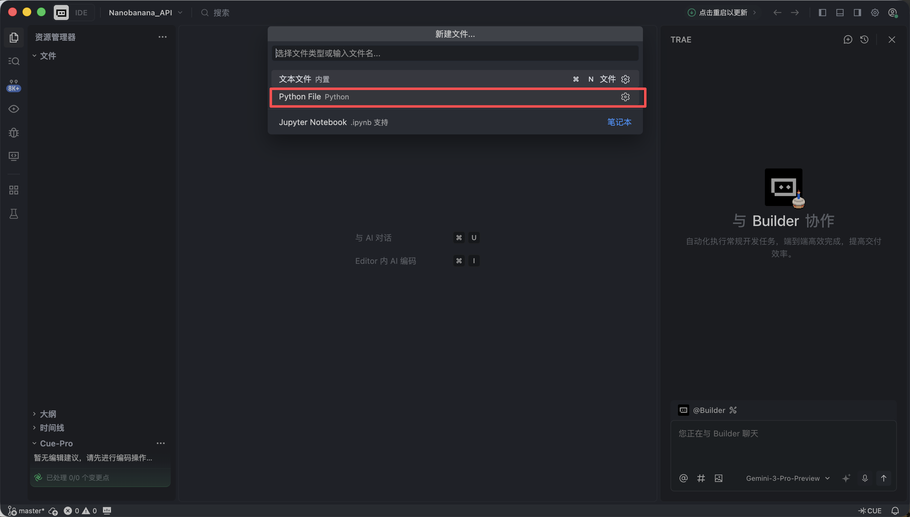


3. Paste toàn bộ code dưới đây vào

Trae sẽ tự deploy môi trường và cài dependency, không cần config thêm.

Code có dùng API Key của NanoBanana. Bài này không đi vào chi tiết flow apply key — chỉ cần bạn lấy được key và điền vào tham số tương ứng là đủ. **Ở giai đoạn này, bạn không cần hiểu từng dòng code, chỉ cần nó chạy được.**

```Python
# /// script
# dependencies = [
#  "gradio>=4.0.0",
#  "pillow>=10.0.0",
#  "requests>=2.31.0",
# ]
# ///

import gradio as gr
import requests
import base64
from PIL import Image
import io
import os
import time
import re
from typing import Optional, Dict, Any, List

# Cấu hình API
NANOBANANA_API_URL: str = "YOUR API URL"
NANOBANANA_API_KEY: str = "YOUR API KEY"
OUTPUT_DIR: str = "outputs"

# Đảm bảo thư mục output tồn tại
os.makedirs(OUTPUT_DIR, exist_ok=True)

def image_to_base64_data_uri(image: Image.Image) -> str:
    """
    Chuyển PIL image sang data URI format tương thích với OpenAI API.
    """
    buffer = io.BytesIO()
    # Convert thống nhất sang PNG để đảm bảo compat
    image.save(buffer, format="PNG")
    encoded = base64.b64encode(buffer.getvalue()).decode('utf-8')
    return f"data:image/png;base64,{encoded}"

def base64_to_image(base64_str: str) -> Optional[Image.Image]:
    """
    Chuyển base64 string thuần sang PIL Image.
    """
    try:
        image_bytes = base64.b64decode(base64_str)
        return Image.open(io.BytesIO(image_bytes))
    except Exception as e:
        print(f"Base64 decode thất bại: {e}")
        return None

def extract_base64_from_response(content: Any) -> Optional[str]:
    """
    Logic parse cốt lõi: trích xuất base64 image từ content trả về bởi API.
    Tương thích cả markdown format và structured list format.
    """
    if not content:
        return None

    base64_data = None

    # 1. Thử trích xuất structured (List)
    # Tương ứng format: [{"type": "image_url", "image_url": {"url": "data:..."}}]
    if isinstance(content, list):
        for part in reversed(content):  # Đảo ngược, ảnh mới nhất thường ở cuối
            if isinstance(part, dict):
                # Kiểm tra field image_url hoặc output_image
                img_field = part.get("image_url") or part.get("image") or part.get("output_image")
                if isinstance(img_field, dict):
                    url = img_field.get("url", "")
                    if url.startswith("data:image/") and "," in url:
                        return url.split(",", 1)[1].strip()

        # Nếu list không có ảnh structured, ghép text trong list lại để tìm markdown
        text_parts = [
            str(p.get("text", ""))
            for p in content
            if isinstance(p, dict) and p.get("type") in ["text", "input_text"]
        ]
        content_str = "".join(text_parts)
    else:
        content_str = str(content)

    # 2. Thử regex extract markdown (String)
    # Tương ứng format: "Here is your image: "
    pattern = re.compile(r"!\[.*?\]\((data:image/[^;]+;base64,[^)]+)\)", re.IGNORECASE)
    match = pattern.search(content_str)

    if match:
        data_url = match.group(1)
        if "," in data_url:
            return data_url.split(",", 1)[1].strip()

    return None

def synthesize(prompt: str, input_image: Optional[Image.Image]) -> Optional[Image.Image]:
    """
    Gọi Nanobanana API để sinh ảnh.
    """
    if not prompt or not prompt.strip():
        gr.Warning("Vui lòng nhập prompt")
        return None

    print(f">>> Bắt đầu task: {prompt[:50]}...")

    headers = {
        "Content-Type": "application/json",
        "Authorization": f"Bearer {NANOBANANA_API_KEY}"
    }

    # Xây payload theo chuẩn OpenAI Vision / Chat
    messages = []

    if input_image is not None:
        # Chế độ image-to-image / multimodal input
        print(">>> Phát hiện ảnh input, dùng chế độ multimodal")
        img_base64 = image_to_base64_data_uri(input_image)
        messages.append({
            "role": "user",
            "content": [
                {"type": "text", "text": prompt},
                {"type": "image_url", "image_url": {"url": img_base64}}
            ]
        })
    else:
        # Chế độ text-to-image thuần
        messages.append({
            "role": "user",
            "content": prompt
        })

    payload = {
        "messages": messages,
        # Dùng model đã verify ở đoạn code đầu
        "model": "gemini-2.5-flash-image",
        # Tham số optional, tuỳ API support
        "stream": False
    }

    try:
        # Tăng timeout, sinh ảnh thường chậm
        response = requests.post(NANOBANANA_API_URL, headers=headers, json=payload, timeout=120)

        # Kiểm tra HTTP status
        if response.status_code != 200:
            error_msg = f"API request thất bại: {response.status_code} - {response.text}"
            print(error_msg)
            gr.Error(error_msg)
            return None

        result = response.json()
        # Debug: in một phần response trả về, tiện debug
        print(f"API response (cắt): {str(result)[:200]}...")

        # Extract content
        content = None
        if "choices" in result and len(result["choices"]) > 0:
            content = result["choices"][0].get("message", {}).get("content")

        if not content:
            gr.Warning("Response API không có field content")
            return None

        # Dùng logic extract base64 đã verify trước đó
        base64_str = extract_base64_from_response(content)

        if base64_str:
            output_image = base64_to_image(base64_str)
            if output_image:
                return output_image

        # Nếu không extract được ảnh, có thể model từ chối hoặc chỉ trả text
        text_content = str(content) if not isinstance(content, list) else " ".join([str(x) for x in content])
        gr.Info(f"Không sinh được ảnh, model trả text: {text_content[:100]}...")
        return None

    except requests.exceptions.Timeout:
        gr.Error("Request timeout, thử lại sau")
        return None
    except Exception as e:
        import traceback
        traceback.print_exc()
        gr.Error(f"Lỗi không xác định: {str(e)}")
        return None

# Cấu hình giao diện Gradio
with gr.Blocks(title="Nanobanana Image Generator") as app:
    gr.Markdown("# 🍌 Nanobanana Text/Image to Image")
    gr.Markdown("Dựa trên model Gemini-2.5-Flash-Image, hỗ trợ text-to-image và image-to-image.")

    with gr.Row():
        with gr.Column():
            prompt_input = gr.Textbox(
                label="Prompt",
                placeholder="Ví dụ: A cyberpunk cat holding a neon sign...",
                lines=3
            )
            image_input = gr.Image(
                label="Ảnh tham chiếu (optional, cho image-to-image)",
                type="pil",
                height=300
            )
            submit_btn = gr.Button("Bắt đầu sinh", variant="primary")

        with gr.Column():
            image_output = gr.Image(label="Kết quả", format="png")

    submit_btn.click(
        fn=synthesize,
        inputs=[prompt_input, image_input],
        outputs=image_output
    )

if __name__ == "__main__":
    app.launch(share=True)
```

Khi Trae báo chạy thành công, click vào local link nó cung cấp (thường là http://127.0.0.1:7860).

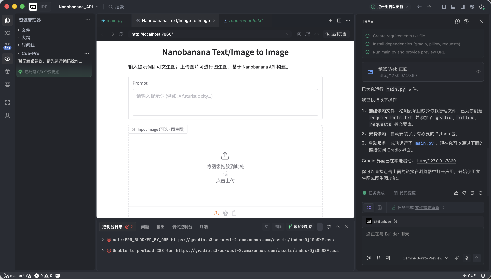

Nếu mọi thứ OK, bạn sẽ thấy một giao diện AI vẽ đã hoạt động được.

Giao diện này nhìn đơn giản nhưng đã có 2 năng lực cốt lõi nhất của các tool vẽ thương mại: text-to-image và image-to-image.

* **Trái: Vùng Input** — nơi bạn ra lệnh.
* **Prompt:** Nhập mô tả ý tưởng của bạn (khuyến nghị dùng tiếng Anh).
* **Input Image:**
  * **Chế độ text-to-image:** Để **trống**.
  * **Chế độ image-to-image:** Kéo ảnh local vào, AI sẽ dựa trên nó để sáng tác.
* **Nút Submit:** Click để gửi lệnh, bắt đầu sinh.
* **Phải: Vùng Output** — nơi điều kỳ diệu xảy ra, kết quả hiện ở đây.

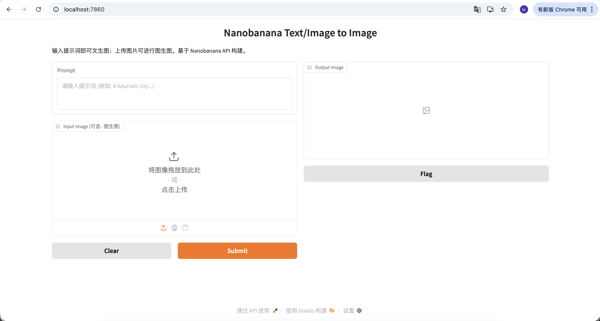

Giờ ta thử sinh tấm ảnh đầu tiên!

Ví dụ này dùng prompt:

> **A red apple**

Đây là ví dụ cố tình đơn giản, không có mô tả style hay tham số.

#### Quy trình thực tế

Sau khi chạy code, quy trình tóm gọn 3 bước:

1. Gửi mô tả text cho model
2. Model sinh ảnh tương ứng
3. Ảnh được lưu thành file local

Vài giây sau, bạn sẽ thấy kết quả ở local. Vì model sinh có tính ngẫu nhiên, cùng prompt sẽ có kết quả khác nhau — bạn có thể sinh nhiều lần và chọn ảnh ưng ý.

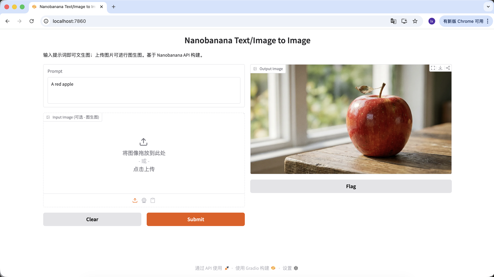

Bạn cũng có thể làm prompt phong phú hơn, thêm nhiều mô tả và ràng buộc. Ví dụ prompt sau cho ra ảnh đặc biệt hơn:

```Plain
"A hyper-realistic close-up of a fresh red apple with water droplets on its skin, sitting on a dark rustic wooden table. Cinematic dramatic lighting, rim light, shallow depth of field, bokeh background, 8k resolution, macro photography."
(Cận cảnh siêu thực một quả táo đỏ tươi với những giọt nước trên vỏ, đặt trên bàn gỗ mộc tối màu. Ánh sáng điện ảnh kịch tính, viền sáng, depth of field nông, nền bokeh, độ phân giải 8k, macro photography.)
```


Trong vùng Output Image, click download để lưu ảnh về local.


### 1.3 Các kịch bản sinh asset phổ biến của model sinh hình

Trong công việc thực tế, large model sinh hình được dùng chủ yếu để **sản xuất asset design hiệu quả**, không phải để sáng tác một tác phẩm nghệ thuật đơn lẻ.

Khi bạn quan sát các case high-engagement của các tài khoản marketing design, sẽ thấy output của họ tập trung vào 2 loại kịch bản:

* **Text-to-image (từ 0 đến 1)**
* **Image-to-image có ảnh tham chiếu (từ 1 đến N)**

#### Một, Text-to-image: lấy nhanh design material

Loại kịch bản này chú trọng hiệu suất. Khi cần lấp khoảng trống trong design (như empty state, avatar, ảnh minh hoạ), AI về bản chất đóng vai trò **một thư viện ảnh sinh tức thì.**

1. ##### Sinh material cho UI design

* Xu hướng: glassmorphism, 3D icon đất sét kiểu Dribbble
* Biểu hiện điển hình: chất liệu trong suốt, viền phát sáng, màu candy cho icon chức năng hoặc thời tiết

**Prompt mẫu:**

> A set of 3D weather icons (sun, cloud, rain), glassmorphism style, frosted glass texture, soft pastel gradient colors, soft studio lighting, isometric view, transparent background, 4k.

(Bộ icon thời tiết 3D, style glassmorphism, texture kính mờ, màu pastel gradient mềm, ánh sáng studio mềm, isometric view)


2. ##### Sinh Logo

* Xu hướng: logo tech với line tối giản, hình học kết hợp
* Biểu hiện điển hình: phối màu đen trắng, negative space design, brand identity rõ

**Prompt mẫu:**

> Minimalist vector logo design for a tech brand "Coffee Code", combining a coffee cup with coding brackets < >, flat design, solid black lines, white background, Paul Rand style, svg.

(Logo vector tối giản, kết hợp ly cà phê với ký hiệu code, flat design, line đen thuần)


3. ##### Sinh ảnh user cho landing page

* Xu hướng: landing page SaaS hay dùng avatar ảo 3D để tránh vấn đề bản quyền người thật
* Biểu hiện điển hình: biểu cảm thân thiện, tỉ lệ cartoon, thiên về style Pixar hoặc Memoji

**Prompt mẫu:**

> Close-up portrait of a friendly young tech professional, smiling, Memoji 3D style, clay render, bright colors, soft lighting, solid plain background, Pixar character design.

(Người trẻ làm công nghệ thân thiện, style Memoji 3D, render đất sét)


4. ##### Sinh ảnh minh hoạ bài viết

* Xu hướng: illustration flat trừu tượng hay thấy ở blog các công ty tech
* Biểu hiện điển hình: phối tím xanh, tỉ lệ nhân vật phóng đại, các phần tử UI bay lơ lửng

**Prompt mẫu:**

> Editorial flat illustration representing remote work, a person sitting on a giant globe using a laptop, corporate memphis art style, vibrant colors (purple and teal), vector texture.

(Illustration flat chủ đề remote work, style corporate memphis)


#### Hai, Image-to-image: giữ visual consistency

Loại kịch bản này chú trọng **khả năng mở rộng**. Khi bạn đã có một main visual ưng ý và cần sinh một bộ asset đồng nhất style.

5. ##### Bộ button hoặc asset interaction tương tự main visual

Trong game dev, sự đồng nhất của UI cực kỳ quan trọng. Giả sử bạn đã có nút **"PLAY"** ở main screen, giờ cần mở rộng ra cả bộ nút chức năng cùng style (như Pause, Settings, Home). Chỉ vẽ tay rất khó đảm bảo từng nút khớp hoàn toàn về độ bóng, phối cảnh và giá trị màu.

**Quy trình cơ bản:**

1. Lưu lại ảnh nút "PLAY" màu xanh đã có


2. Kéo nó vào vùng **Input Image** của giao diện, làm reference master cho lần sinh sau
3. Giữ nguyên mô tả style trong prompt, chỉ đổi mô tả chủ thể

Với quy trình này, chỉ cần đổi mô tả chủ thể là có được nút khác chức năng nhưng style nhất quán.

**Prompt mẫu:**

**Biến thể A: nút Pause (kiểu icon)**

> A capsule-shaped game UI button with a white pause icon (two vertical bars) inside. Same glossy blue jelly style, shiny plastic texture, white thick outline, vector illustration, high quality.

(Nút UI game hình capsule, icon pause trắng, chất jelly xanh)

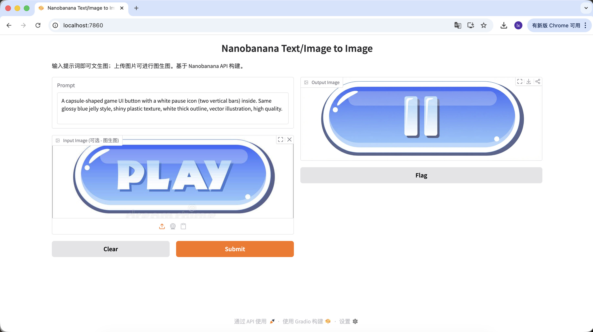

**Biến thể B: nút Settings (icon phức tạp)**

> A capsule-shaped game UI button with a white gear icon (settings symbol) inside. Same glossy blue jelly style, shiny plastic texture, white thick outline, vector illustration, high quality.

(Nút UI game hình capsule, icon bánh răng trắng, chất jelly xanh)


**Biến thể C: nút Replay (đổi hình dạng)**

Nếu cần chỉnh hình dạng nút, có thể mô tả trực tiếp shape trong prompt, model sẽ cố thay đổi structure nhưng vẫn giữ đặc trưng chất liệu.

> A round game UI button with a white circular arrow icon (replay symbol) inside. Same glossy blue jelly style, shiny plastic texture, white thick outline, vector illustration, high quality.

(Nút UI game hình tròn, icon mũi tên xoay, chất jelly xanh)


Qua bộ thao tác này, bạn không chỉ thay được chức năng và icon của nút, thậm chí đổi cả hình dạng, nhưng mọi kết quả sinh đều cực kỳ nhất quán về chất liệu, phối màu và ánh sáng. Đây chính là giá trị cốt lõi của large model trong kịch bản nhân bản asset design.

## Chương 2: Trợ lý sinh hình nghe lời hơn — lấy Lovart làm ví dụ

Ở phần 1, ta đã gọi NanoBanana trực tiếp qua code, trải nghiệm quy trình cơ bản "input → sinh". Cách này không vấn đề gì khi yêu cầu đơn giản. Nhưng khi task sinh bắt đầu chứa nhiều ràng buộc hơn, ví dụ:

* Cần nhiều ảnh đồng nhất style
* Cần lặp đi lặp lại tinh chỉnh trên kết quả đã có
* Cần thay đổi hướng sinh động dựa trên input của user

Cách gọi đơn lẻ sẽ dần không đủ dùng.

Lúc này cần đưa vào **AI Agent**. Phần này lấy **Lovart** làm ví dụ, cho bạn thấy khi model sinh hình có thêm "lớp tư duy" thì toàn bộ workflow sẽ thay đổi thế nào. Lưu ý! Đây không phải quảng cáo, chỉ giúp bạn nhanh chóng cảm nhận sự tiện của AI Agent ~

### 2.0 Làm quen Lovart: AI design agent của bạn

Lovart là một design tool Web dựa trên Agent. So với tool sinh ảnh thông thường, nó có thêm một lớp "tư duy & lập kế hoạch" trước khi sinh.

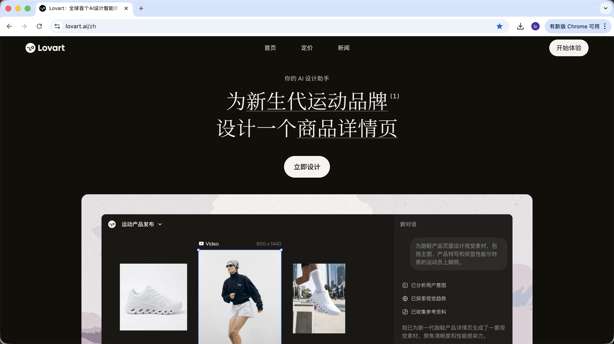

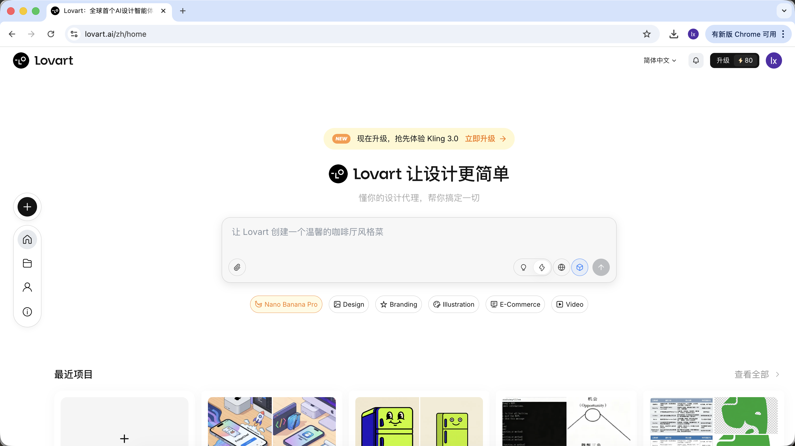

Vào Lovart, bạn cần hiểu mấy control chính sau:

#### Chọn model

Click icon khối lập phương dưới input box, có thể xem các model sinh khả dụng (như GPT Image, Flux…).

Để nhất quán với ví dụ phía trước, phần này vẫn dùng NanoBanana làm model sinh nền.


#### Chế độ tư duy

Đây là switch cốt lõi của Lovart:

* **Fast Mode (⚡)**: Gần với native API, response nhanh, hợp sinh đơn ảnh với lệnh rõ ràng
* **Thinking Mode (💡)**: Chế độ Agent, AI sẽ tách yêu cầu, viết lại prompt rồi mới thực thi


#### Khả năng kết nối mạng

Bật icon quả địa cầu, Agent có thể tìm thông tin trên mạng trong quá trình sinh (ví dụ design trend, phối màu) làm input phụ trợ.

### 2.1 Tại sao native API vẫn chưa đủ?

Dù bạn đã sinh được ảnh chất lượng tốt qua Python, native API vẫn có giới hạn trong task phức tạp. Lý do then chốt: native API về bản chất là kiểu lệnh. Khi bạn yêu cầu sinh một đối tượng cụ thể, nó thực thi trực tiếp; nhưng khi input chuyển thành "lên kế hoạch cho cả bộ asset game", nó sẽ không chủ động tách mục tiêu thành nhiều bước thực thi được.

Khác biệt cốt lõi của Lovart nằm ở cơ chế Agent. Giữa input của user và model sinh hình, nó thêm một lớp logic để hiểu và lên kế hoạch: nhận diện ý định user trước, tách task, viết lại prompt, sau cùng mới thực thi sinh.

### 2.2 Thực chiến: làm 1 bộ emoji IP trong 5 phút

Lấy ví dụ **"Làm bộ emoji IP về con vịt lập trình viên"** để xem Agent tham gia cả quy trình thế nào.

#### Khâu 1: Lập kế hoạch (khả năng tư duy của Agent)

**Vấn đề của native API:**
Bạn phải tự nghĩ ra character setting, trạng thái cảm xúc, và viết riêng prompt cho từng ảnh.

**Cách làm của Lovart:**

1. Bật 💡 **Thinking Mode**
2. Nhập 1 câu lệnh:

> Thiết kế bộ emoji IP về vịt lập trình viên, style flat, cute

AI sẽ không vẽ ngay, mà đi search trước các thiết kế vịt lập trình viên liên quan trên mạng. Output ra phương án đã được phân rã, tự sinh các scene Debug, Coffee Break, Panic… và tương ứng từng scene là một mô tả visual.


Ở bước này, AI chuyển từ "executor" sang "planner". Sau khi AI giúp bạn phân tích yêu cầu, có thể thấy nhiều style và nội dung vịt lập trình viên trong canvas của Lovart. Bạn có thể bắt đầu chọn style mình thích.


#### Khâu 2: Tính nhất quán (visual anchoring dựa trên reference)

Ảnh trong Lovart không chỉ là kết quả, mà còn tham gia vào lần sinh sau.

##### Reference đầy đủ

* Từ các bản sketch, chọn ra một "vịt chuẩn" ưng ý nhất, click ảnh tương ứng trong canvas
* Ảnh đó sẽ tự xuất hiện trong vùng chat làm Reference

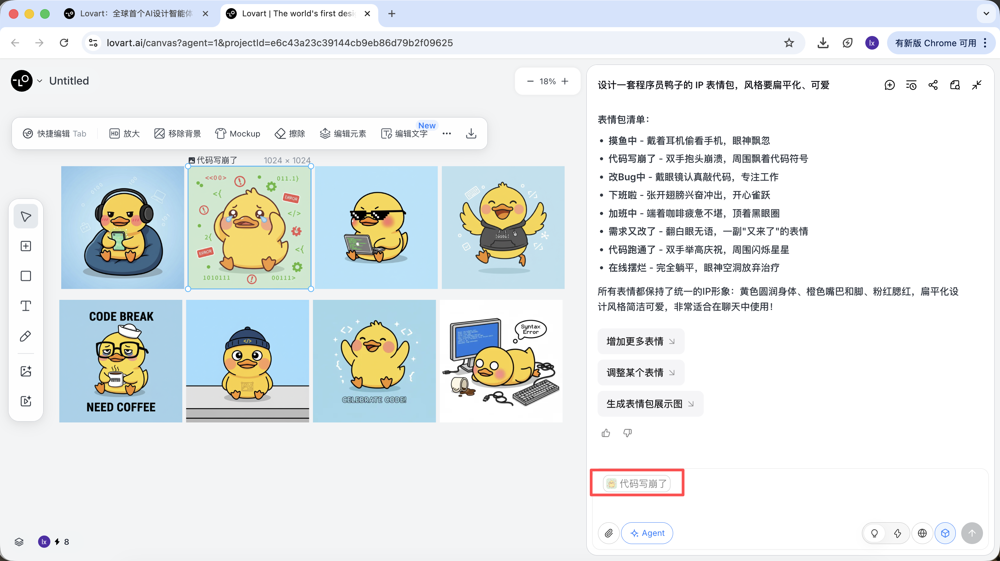

* Nhập action mới (ví dụ vui vẻ) rồi sinh

Kết quả sẽ kế thừa phối màu, tỉ lệ và chi tiết của bản master.

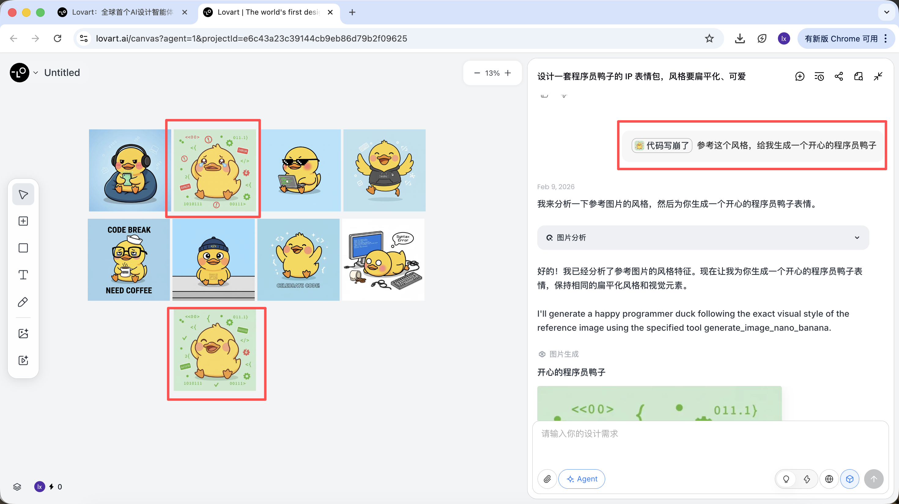

##### Reference cục bộ / kết hợp nhiều ảnh

Ngoài cả ảnh làm reference, Lovart còn hỗ trợ:

* **Chỉ chọn 1 vùng cục bộ của ảnh** (ví dụ chỉ tham chiếu cái mũ hoặc biểu cảm)

Click tab bên trái canvas, chọn nút "Mark", đánh dấu vào vùng cục bộ của ảnh target, phần nội dung này sẽ tự sync sang khung chat. Ví dụ ở đây ta có thể chọn đổi màu nền.

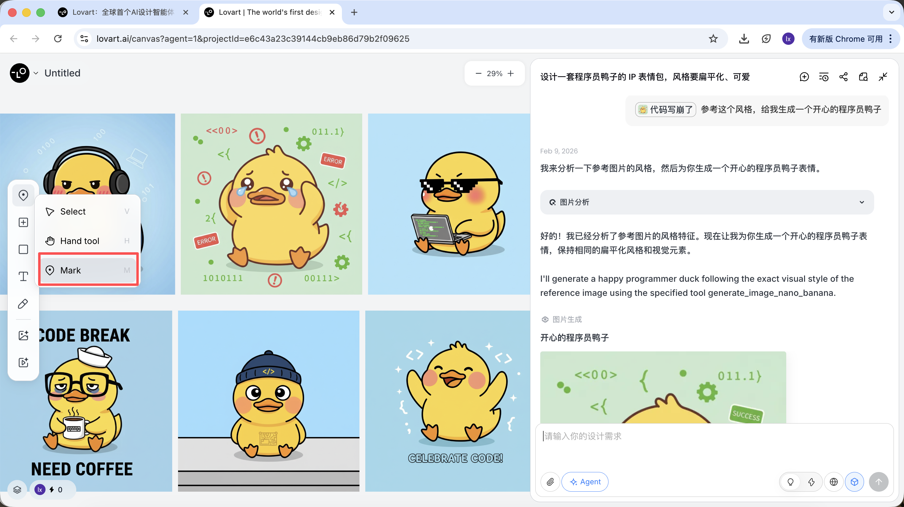


Thấy ảnh mới sinh chỉ thay đổi màu nền, đúng với yêu cầu ta nhập.

* **Tham chiếu sub-element riêng từ nhiều ảnh khác nhau**, rồi tổ hợp sinh kết quả mới

Ví dụ: bạn có thể giữ chủ thể nhân vật ở ảnh A, đồng thời thay mũ bằng kiểu ở ảnh B, Agent sẽ tự tích hợp các ràng buộc visual này ở backend.

Với ví dụ vịt lập trình viên, ta có thể chọn giữ hình tượng vịt ở ảnh đầu, đưa nó sang ảnh thứ hai làm chủ thể.


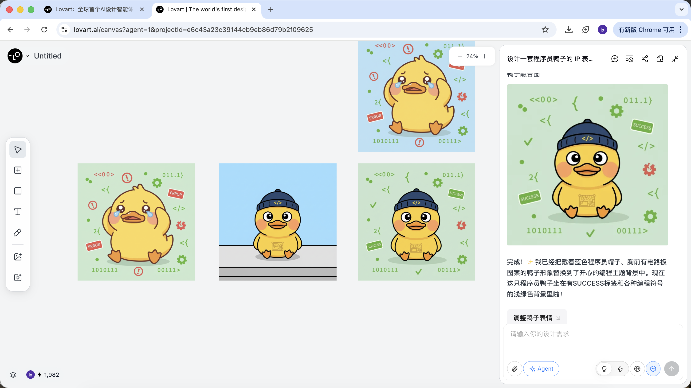

Hiệu quả cuối cùng cũng rất rõ. Bạn cũng có thể thử các tổ hợp khác!

#### Khâu 3: Triển khai (Agent tool calling)

Sinh xong, có thể thực thi trực tiếp: upscale, remove background, erase…


Đây không phải filter đơn thuần, mà là kết quả Agent tự điều phối các tool khác nhau hoàn thành.

Sau khi xác định được tone style, có thể sinh ra cả series emoji rất nhanh.


Thứ ta nhận được là asset cấp sản phẩm có thể bàn giao trực tiếp, không chỉ là 1 ảnh demo.

### 2.3 Cách dùng và phí

Lovart dùng mô hình subscription, các gói khác nhau tương ứng quota và quyền tính năng khác nhau, cụ thể xem trên website chính thức.

Bài này không recommend hay so sánh gói nào; nếu thực tế có nhu cầu, bạn có thể chọn upgrade trả phí theo điều kiện cá nhân.
Hiện hỗ trợ thanh toán qua **Alipay** và các phương thức khác.

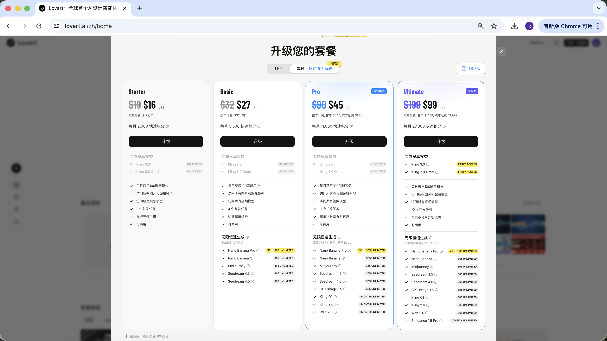

#### Tóm lại

Lovart không phải thay thế model nền, mà thông qua cơ chế Agent, đưa việc sinh hình từ "thực thi 1 lần" lên thành "workflow liên tục".

Khi task bắt đầu liên quan tới planning, tính nhất quán và bàn giao, lợi thế của loại tool này trở nên rất rõ.

## Chương 3: Tự tay làm 1 trợ lý vẽ thông minh

Ngoài dùng trực tiếp Lovart, ta cũng có thể tự implement một version giản lược của trợ lý vẽ.

Chương này lấy "tự động sinh ảnh minh hoạ cho bài viết" làm ví dụ, từ vấn đề thực tế xuất phát, dần dần dựng một Agent có khả năng tư duy.

### 3.1 Vấn đề: Tại sao gửi thẳng bài viết cho model vẽ không hiệu quả?

Khi bạn đưa thẳng 1 bài viết dài cho NanoBanana và yêu cầu nó minh hoạ, thường rất khó được kết quả lý tưởng. Lý do không phải model "vẽ kém", mà là **nó không giỏi hiểu text dài**.

Model sinh hình phù hợp xử lý mô tả visual ngắn, rõ ràng. Khi input chuyển thành 1 đoạn có structure, có trọng điểm và quan hệ context, model không thể đánh giá nội dung nào mới là phần cần thể hiện trong ảnh. Việc này thường dẫn tới kết quả đi lệch chủ đề, hoặc chỉ bắt được chi tiết rời rạc, thiếu khả năng khái quát tổng thể.

Về bản chất, image model chỉ có năng lực "thực thi", thiếu quy trình phân tích và lựa chọn text.

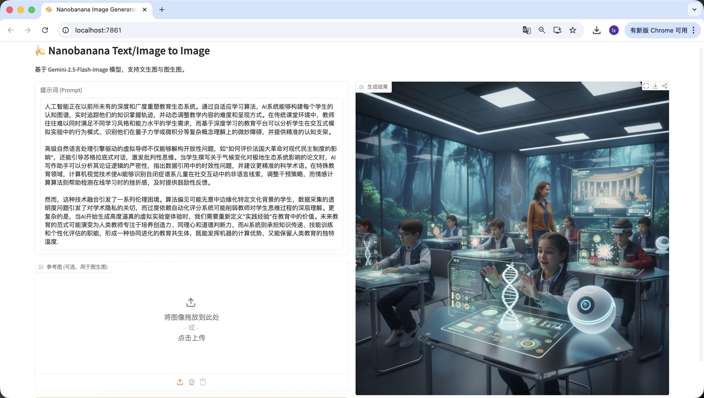

### 3.2 Hướng giải quyết: dùng Agent để tách "hiểu" khỏi "thực thi"

Để giải vấn đề này, mấu chốt không phải prompt phức tạp hơn, mà là **nghĩ kỹ trước khi vẽ**. Vì vậy, ta thêm vào quy trình sinh một "lớp tư duy" độc lập, dựa vào đó dựng một Agent đơn giản nhất dùng được.

Mục tiêu cốt lõi của Agent này chỉ có một: **làm ảnh sinh cuối cùng càng sát ý định thật sự của user càng tốt.**

Toàn bộ flow có thể tóm gọn: **input text dài → language model hiểu & đánh giá → sinh visual prompt phù hợp → image model thực thi sinh → output ảnh**

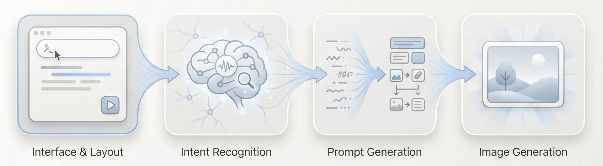

Vậy Agent ta dựng làm sao để hiểu ý định user?

Ở đây ta làm 1 **"lớp tư duy"** giản lược, set 3 loại intent khác nhau: input vô nghĩa, vẽ trực tiếp, text dài cần hiểu.

Trong Agent này, phân vai của các role có thể tóm gọn 4 điểm:

1. **Language model là quyết định cốt lõi**
   Nó chịu trách nhiệm hiểu nội dung bài viết, đánh giá ý định input của user, và phân task đến đường sinh phù hợp, quyết định bước tiếp theo "làm gì" và sinh prompt vẽ thế nào.
2. **Image model là executor**
   Image model không tham gia hiểu và đánh giá, chỉ nhận lệnh visual đã được dọn sẵn, tập trung hoàn thành render ảnh.
3. **User là người dẫn dắt có thể can thiệp**
   Ngoài nhập text trực tiếp, user còn có thể chỉnh prompt sinh thủ công trong quá trình, hoặc thêm ảnh reference để phụ trợ, từ đó dẫn dắt và tinh chỉnh kết quả cuối cùng.
4. **Gradio và backend API là lớp chứa tổng thể**
   Chúng nối interface, model call và hiển thị kết quả lại với nhau, đảm bảo cả Agent có thể chạy ổn định dưới dạng 1 Web app hoàn chỉnh.


### 3.3 Chuẩn bị thực chiến: lấy API

Nhìn có vẻ thú vị nhỉ! Để chạy được flow trên, ta chỉ cần chuẩn bị 2 loại API.

#### Tay: NanoBanana API (sinh hình)

Dùng tiếp API Key và API URL đã config ở Chương 1, không cần setup thêm.

#### Não: SiliconFlow API (tư duy text)

Ta cần 1 LLM để đảm nhận vai trò "lớp tư duy". Bài này dùng model service do SiliconFlow cung cấp: [https://cloud.siliconflow.cn](https://cloud.siliconflow.cn/)


SiliconFlow cung cấp interface tương thích OpenAI API spec, có thể call rất tiện qua HTTP request chuẩn. Ở đây ta chọn model free Qwen2.5-7B-Instruct, mọi content cần call đã viết sẵn trong Prompt phía dưới. Trước khi bắt đầu, bạn chỉ cần đăng ký tài khoản trên website và tạo 1 API Key.


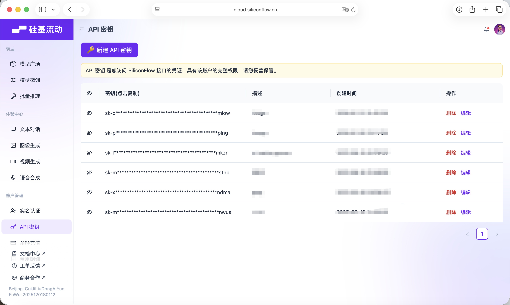

Key này sẽ dùng cho các call model phía sau.

### 3.4 Dựng Agent

Thí nghiệm này dùng Trae để viết code, bài này chọn model Gemini-3-Pro-Preview. Ý tưởng tổng: tạo project mới, copy toàn bộ Prompt dưới đây vào khung chat và nhập, dần dần thay API KEY rồi chạy code, test xong là OK.


#### Khâu 1️⃣: Khung Gradio Blocks cơ bản và layout giao diện

Ở khâu này, mục tiêu chính là dựng một "bộ mặt" cho cả Agent, hiện thực hoá frontend. Copy Prompt sau vào khung chat Trae, sau khi implement xong bạn sẽ có 1 local URL (thường là http://127.0.0.1:7860) để xem giao diện và kiểm tra kết quả.

```Plain
Block 1: Khung Gradio Blocks cơ bản và layout giao diện
1. Mục tiêu task
- Dựa trên layout Blocks của Gradio 4.0.0+, implement giao diện cơ bản cho project "LLM + Nanobanana text-to-image", tuân thủ nghiêm ngặt layout cố định trái-phải, init mọi UI component với state ban đầu đúng.

2. Yêu cầu tech stack
- Bắt buộc dùng chế độ Blocks của Gradio 4.0.0+, cấm dùng chế độ Interface;
- Dependencies: gradio>=4.0.0, pillow>=10.0.0 (chỉ import, chưa implement logic xử lý ảnh);
- Code là Python file complete có thể chạy được, bao gồm mọi import statement cần thiết.

3. Quy tắc layout giao diện (ràng buộc lõi, gồm chi tiết thực chiến)
- Layout tổng thể:
Title page: Tool LLM + Nanobanana text-to-image full workflow;
Cột trái-phải cố định: trái 60%, phải 40%, dùng gr.Row và gr.Column để control tỉ lệ.
- Component cột trái 60% (vùng workflow sinh prompt):
input_text: gr.Textbox, label "Input text (đoạn tutorial / lệnh vẽ)", lines=6, placeholder "Nhập text tutorial cần minh hoạ hoặc lệnh vẽ trực tiếp...";
identify_intent_btn: gr.Button, value="Nhận diện ý định", state ban đầu bình thường có thể click;
intent_status: gr.Textbox, label "Loại ý định / trạng thái xử lý", lines=2, interactive=False, value ban đầu "Chưa nhận diện ý định";
system_prompt: gr.Textbox, label "System Prompt (chỉ edit được với ý định minh hoạ bài viết)", lines=4, interactive=False, placeholder "Quy tắc ràng buộc LLM sinh prompt...";
confirm_prompt_btn: gr.Button, value="Xác nhận sinh prompt vẽ", interactive=False (disable ban đầu chống misclick);
generation_prompt: gr.Textbox, label "Prompt vẽ (có thể edit)", lines=3, interactive=True, value ban đầu rỗng, placeholder "Prompt vẽ tiếng Anh sinh ra sẽ hiện ở đây, hỗ trợ sửa thủ công...".
- Component cột phải 40% (vùng tính năng sinh ảnh Nanobanana):
ref_image: gr.Image, label "Ảnh reference (optional, image-to-image)", type=filepath, height=300, cho upload;
generate_btn: gr.Button, value="Sinh ảnh", interactive=False (disable ban đầu, không có prompt thì không click được);
result_image: gr.Image, label "Kết quả sinh", type=pil, height=300, rỗng ban đầu, interactive=False.

4. Yêu cầu logic tương tác
- Mọi state interactive ban đầu của component tuân thủ nghiêm cấu hình trên, sau đó update động qua function;
- State disable button cần trực quan (mờ đi), tránh user misclick.

5. Yêu cầu output
- Sinh code Python complete, chỉ implement layout giao diện và init component, không bao gồm bất kỳ logic business nào;
- Comment code rõ ràng, đặt tên component nhất quán với bản thực chiến (input_text/identify_intent_btn v.v.);
- Code chạy được ngay, structure giao diện khớp hoàn toàn với mô tả.
```

Mở http://127.0.0.1:7860 trên browser, bạn sẽ thấy Trae đã sinh ra webpage theo yêu cầu, gần đúng yêu cầu, có thể đi sang bước sinh tiếp theo.


#### Khâu 2️⃣: Module nhận diện ý định LLM (Siliconflow API)

Khi dùng VLM vẽ trong thực tế, có thể có 3 trường hợp input phổ biến:

1. Nội dung vô nghĩa, ví dụ "xin chào", "hôm nay bạn ăn cơm chưa"… không vẽ ra ảnh tương ứng được.
2. Bài viết / text dài, số chữ nhiều, ví dụ 1 bài có structure khoảng 200 chữ, cần hiểu structure và nội dung trước, mới tính được sinh ảnh nào khái quát đầy đủ đoạn text này.
3. Lệnh vẽ trực tiếp, ví dụ "vẽ cho tôi 1 con chó đang tắm"…, yêu cầu đã rất cụ thể, sinh ảnh được luôn.

Tương tự, copy Prompt sau vào khung chat Trae để implement, và bổ sung API đã lấy ở bước trước.

```Plain
Block 2: Module nhận diện ý định LLM (Siliconflow API)
1. Mục tiêu task
Trên cơ sở giao diện Gradio đã implement, thêm logic click cho nút "Nhận diện ý định", gọi Siliconflow API hoàn thành nhận diện ý định, và liên động state của component.

2. Yêu cầu tech stack
Dựa trên Gradio 4.0.0+ Blocks;
Dependencies: requests>=2.31.0, openai;
Output complete Python file chạy được, gồm giao diện Block 1 + logic module này.

3. Quy tắc business cốt lõi (tuyệt đối không lệch)
- Quy tắc phân loại ý định (chỉ 3 loại, return nghiêm số + mô tả)
1 = Nội dung vô nghĩa: chỉ tán gẫu, chào hỏi, hội thoại không liên quan, không có nhu cầu vẽ hay minh hoạ (như "xin chào", "hôm nay ăn cơm chưa");
2 = Nhu cầu minh hoạ bài viết / text dài: user nhập 1 bài viết, tutorial, đoạn, văn bản giải thích đầy đủ, content thiên về tường thuật / giải thích / giảng giải, ngầm hàm ý cần sinh ảnh minh hoạ cho content này, không cần user nói rõ "minh hoạ cho đoạn text này";
3 = Lệnh vẽ trực tiếp: user nhập lệnh vẽ ngắn, rõ ràng, không có background text dài, yêu cầu vẽ một content nào đó trực tiếp (như "vẽ 1 con mèo style Apple").
- Ràng buộc gọi LLM (theo template thực chiến)
Endpoint: https://api.siliconflow.cn/v1/chat/completions;
Model: Qwen/Qwen2.5-7B-Instruct;
temperature=0.1;
Định nghĩa code thống nhất:
python
LLM_BASE_URL = "https://api.siliconflow.cn/v1"
LLM_API_KEY = ""  # User tự thay
LLM_MODEL = "Qwen/Qwen2.5-7B-Instruct"
# Template nhận diện ý định đã verify thực chiến (cứng trong code)
INTENT_PROMPT_TEMPLATE = """Bạn cần nhận diện ý định của text input user, chỉ return 1 trong 3 loại kết quả sau (format: số + mô tả tiếng Việt):
1 = Nội dung vô nghĩa; 2 = Nhu cầu minh hoạ bài viết / text dài; 3 = Lệnh vẽ trực tiếp.

Input user: {user_input}

Kết quả nhận diện:
Chỉ trích số và mô tả trong kết quả return, cấm content thừa."""

4. Quy tắc liên động component
- Kết quả 1: intent_status hiện "1 = Nội dung vô nghĩa: không có nhu cầu vẽ", system_prompt giữ disabled, confirm_prompt_btn disable;
- Kết quả 2: intent_status hiện "2 = Nhu cầu minh hoạ bài viết / text dài: sinh ảnh minh hoạ cho input", enable system_prompt và fill default rule, kích hoạt confirm_prompt_btn;
- Kết quả 3: intent_status hiện "3 = Lệnh vẽ trực tiếp: sinh ảnh theo lệnh", system_prompt disabled và fill default rule, kích hoạt confirm_prompt_btn.

5. Xử lý exception
API exception, parse exception đều cho thông báo thân thiện, không crash, component khôi phục state ban đầu.

6. Yêu cầu output
Sinh code complete chạy được, thay LLM_API_KEY là dùng được, logic rõ ràng comment đủ, template nhận diện ý định dùng nghiêm bản thực chiến.
```

Refresh URL http://127.0.0.1:7860 trước đó, bắt đầu test xem có nhận diện đúng 3 trường hợp không.

1. Nội dung vô nghĩa, có thể thử input "xin chào", "cảm ơn"…, sẽ thấy nhận diện đúng.


2. Bài viết / text dài, ở đây ta chọn 1 đoạn text mô tả AI do Doubao sinh. Bạn cũng có thể thử đoạn paper của riêng mình.

```Plain
Trí tuệ nhân tạo đang tái định hình hệ sinh thái giáo dục với độ sâu và rộng chưa từng có. Qua adaptive learning algorithm, hệ thống AI có thể xây dựng bản đồ nhận thức của từng học sinh, real-time theo dõi quỹ đạo nắm kiến thức, và động chỉnh độ khó cùng cách trình bày content giảng dạy. Trong môi trường lớp học truyền thống, giáo viên khó đồng thời đáp ứng nhu cầu của học sinh ở nhiều phong cách học và mức năng lực khác nhau, trong khi nền tảng giáo dục dựa trên deep learning có thể phân tích hành vi của học sinh trong thí nghiệm mô phỏng tương tác, nhận diện những rào cản tinh tế trong việc hiểu các khái niệm phức tạp như cơ học lượng tử hay vi tích phân, và cung cấp giàn giáo nhận thức chính xác.

Engine NLP cao cấp dẫn dắt các tutor ảo không chỉ có thể giải cấu các câu hỏi mở như "đánh giá ảnh hưởng của Cách mạng Pháp đối với chế độ dân chủ hiện đại", mà còn dẫn dắt đối thoại kiểu Socrates, kích thích tư duy phản biện. Khi học sinh viết bài về ảnh hưởng của biến đổi khí hậu đối với hệ sinh thái cực, AI writing assistant có thể phân tích logic luận chứng có chặt chẽ không, chỉ ra vấn đề tính thời sự trong trích dẫn data, và đề xuất thuật ngữ khoa học chính xác hơn. Trong lĩnh vực giáo dục đặc biệt, computer vision giúp AI nhận diện tín hiệu phi ngôn ngữ của trẻ trong phổ tự kỷ trong tương tác xã hội, chỉnh chiến lược can thiệp, còn affective computing algorithm giúp phát hiện cảm giác thất vọng khi học online, kịp thời cho feedback khích lệ.

Tuy nhiên, sự fusion công nghệ này gây ra hàng loạt khó khăn đạo đức. Algorithmic bias có thể vô tình marginalize học sinh xuất phát từ bối cảnh văn hoá cụ thể, vấn đề minh bạch trong thu thập data dấy lên quan ngại về academic privacy, và phụ thuộc quá mức vào hệ thống chấm điểm tự động có thể làm yếu khả năng giáo viên hiểu sâu quá trình tư duy của học sinh. Phức tạp hơn, khi AI bắt đầu sinh ra trải nghiệm phòng lab ảo high-fidelity, ta cần định nghĩa lại giá trị của "kinh nghiệm thực hành" trong giáo dục. Mô hình giáo dục tương lai có thể tiến hoá thành giáo viên người tập trung nuôi dưỡng creativity, empathy và đạo đức judgment, còn hệ thống AI đảm nhận truyền tải kiến thức, training kỹ năng và đánh giá cá nhân hoá, hình thành cộng sinh giáo dục co-evolution, vừa phát huy lợi thế tính toán của máy vừa giữ được nhiệt độ độc đáo của giáo dục con người.
```

Tương tự nhận diện thành công ~


3. Lệnh vẽ trực tiếp, ở đây input "Tôi muốn vẽ 1 con mèo", cũng nhận diện chính xác.


Tới đây ta đã hoàn thành thuận lợi khâu thứ 2 — nhận diện ý định.

#### Khâu 3️⃣: Module sinh prompt vẽ (LLM call lần 2)

Sau khi nhận diện ý định, với bài viết hay text dài, có 1 bước rất quan trọng là sinh prompt cho việc vẽ, và đây chính là trọng tâm của Agent này.

```SQL
Block 3: Module sinh prompt vẽ (LLM call lần 2)
1. Mục tiêu task
Trên cơ sở nhận diện ý định, implement logic nút "Xác nhận sinh prompt vẽ", gọi LLM để tối ưu text thành visual prompt tiếng Anh phù hợp vẽ, fill vào edit box và liên động nút "Sinh ảnh".

2. Yêu cầu tech stack
Như Block 2, output code complete = Block 1 + Block 2 + module này;
Dùng chung LLM_BASE_URL, LLM_API_KEY, LLM_MODEL định nghĩa ở Block 2, không tạo key mới.

3. Quy tắc business cốt lõi (logic ráp Prompt theo thực chiến)
- Quy tắc input sinh prompt (bắt buộc tuân thủ nghiêm)
Sinh prompt vẽ không còn là string concat đơn giản, mà xây list message Chat chuẩn, structure code như sau:
python
messages=[
# System role: nội dung system_prompt cuối user xác nhận/edit trên web
{"role": "system", "content": final_system_prompt},
# User role: chứa data cần xử lý, làm rõ mục tiêu task
{"role": "user", "content": f"Hãy sinh visual prompt cho content sau:\n\n{user_input}"}
]
Ý định 2: content System lấy version cuối system_prompt user đã edit;
Ý định 3: content System lấy default rule fill khi disabled
user_input là text gốc user nhập ban đầu vào input_text.
- System Prompt preset đã verify thực chiến (cứng trong code)
python
SYSTEM_PROMPT_DEFAULT = """Bạn giờ là 1 trợ lý tạo prompt vẽ cho NanoBanana.
Cần xử lý theo content của tôi, ảnh này có tác dụng giải thích đoạn này nói gì, và để mọi người biết structure trên dưới của đoạn này tổng thể đang nói ý gì.
Bên trong có thể có giải thích như PPT (ví dụ: góc trên trái hiện ý chính, góc dưới phải hiện data).
Yêu cầu design style: tối giản, Apple Design Philosophy.
Ràng buộc: hãy trả thẳng prompt tiếng Anh dùng được cho NanoBanana, không trả bất kỳ giải thích, prefix hay lời thừa nào."""
- Ràng buộc gọi LLM
Dùng chung LLM_BASE_URL, LLM_API_KEY, LLM_MODEL với Block 2;
temperature=0.7 (đảm bảo creativity và adapt của prompt);
max_tokens=200 (giới hạn độ dài output, khớp ràng buộc prompt);
Bắt buộc dùng structure list message Chat chuẩn trên, cấm string concat.
- Ví dụ input/output (tham khảo cốt lõi)
Input ví dụ 1 (ý định minh hoạ bài viết): Text gốc: "AI thay đổi giáo dục thế nào: Khi AI phát triển, vai trò giáo viên chuyển từ người truyền tri thức sang người dẫn dắt, AI assistant phụ trợ học sinh học cá nhân hoá, hợp tác người-máy thành chuẩn trong lớp học." System Prompt cuối: SYSTEM_PROMPT_DEFAULT (không sửa) Output kỳ vọng: "Minimalist illustration, Apple Design Philosophy, 1024x1024. Top left shows 'AI + Education' core concept, bottom right shows data of teacher-student-AI collaboration, soft color palette, clean lines, no redundant elements."
Input ví dụ 2 (lệnh vẽ trực tiếp): Text gốc: "Vẽ 1 con mèo style Apple, ngồi cạnh MacBook" System Prompt cuối: SYSTEM_PROMPT_DEFAULT (state disabled) Output kỳ vọng: "Minimalist cat, Apple style, 1024x1024, sitting next to a silver MacBook, clean white background, soft shadows, geometric shapes, no extra details."
- Ràng buộc output prompt bắt buộc
Tiếng Anh thuần, không có tiếng Trung/Việt;
Bắt buộc gồm Apple Design Philosophy/Apple style + 1024x1024;
Độ dài 50-200 ký tự, validate trong code;
Không giải thích, prefix hay lời thừa, chỉ return prompt.

4. Quy tắc liên động component
Sinh thành công: fill prompt vào ô generation_prompt, kích hoạt generate_btn, intent_status thêm "Sinh prompt thành công, có thể sửa rồi sinh ảnh";
Sinh thất bại: hiện lý do cụ thể (như API call fail, độ dài không đạt), generate_btn giữ disable, ô generation_prompt rỗng;
User sửa/xoá ô generation_prompt thủ công:
Xoá thì tự disable generate_btn;
Có content thì giữ generate_btn enabled.

5. Xử lý exception
API call fail: prompt thân thiện "Sinh prompt thất bại: {lỗi cụ thể}", không crash;
Validate prompt fail: prompt rõ lý do (như "Không có Apple style", "Độ dài chỉ 40 ký tự"), cho retry;
Parse response fail: prompt "Không parse được kết quả LLM, thử lại".

6. Yêu cầu output
Code complete chạy được, thay LLM_API_KEY là dùng được;
Structure code rõ, comment đầy đủ, giao diện đẹp gọn;
Implement nghiêm structure list message Chat chuẩn, tham số và logic ví dụ nhất quán;
Gồm validate độ dài, content prompt, error prompt thân thiện.
```

Tương tự, copy text khâu 2 vào để test.

Đáng chú ý là, System Prompt preset cho việc sinh prompt vẽ ở đây là:

> Bạn giờ là 1 trợ lý tạo prompt vẽ cho NanoBanana.
> Cần xử lý theo content của tôi, ảnh này có tác dụng giải thích đoạn này nói gì, và để mọi người biết structure trên dưới của đoạn này tổng thể đang nói ý gì.
> Bên trong có thể có giải thích như PPT (ví dụ: góc trên trái hiện ý chính, góc dưới phải hiện data).
> Yêu cầu design style: tối giản, Apple Design Philosophy.
> Ràng buộc: hãy trả thẳng prompt tiếng Anh dùng được cho NanoBanana, không trả bất kỳ giải thích, prefix hay lời thừa nào.

Nếu muốn đổi sang template preset khác, có thể sửa trong prompt ở trên, hoặc sửa trực tiếp qua dialogue trong Trae.

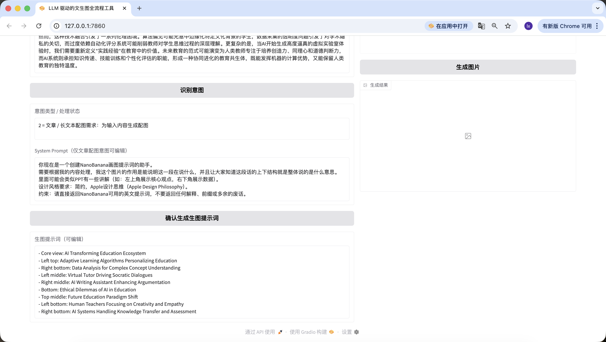

Ngoài sửa code nền, ta cũng có thể edit nhanh trên web. Ví dụ ở đây tôi thêm 1 câu "Thêm câu Pic Prompt ở đầu", thấy prompt mới sinh ra cũng có chứa nó ở đầu ~ Thiết kế này là để tiện sửa nhanh System Prompt sinh prompt, giúp chuyển style nhanh.

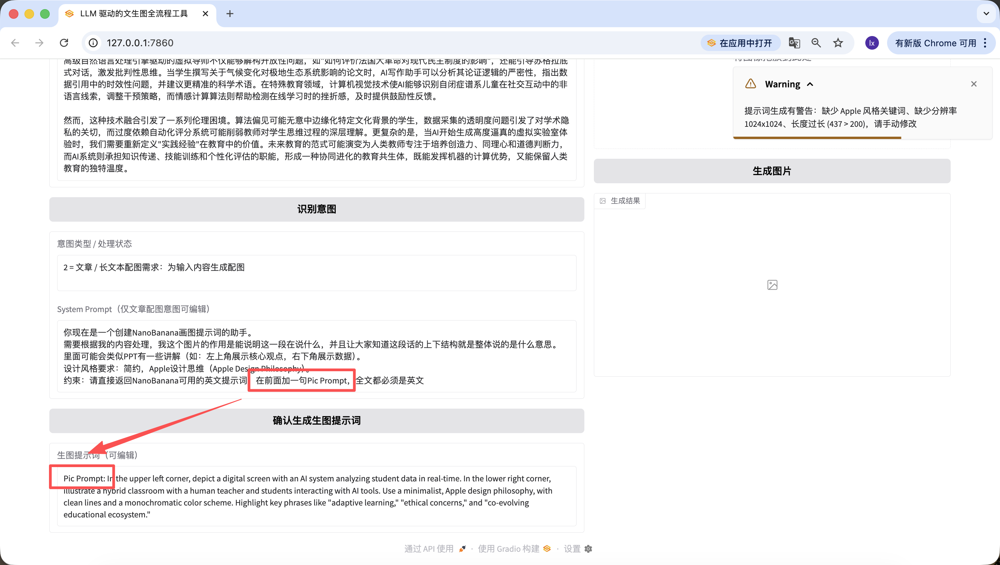

#### Khâu 4️⃣: Module Nanobanana text-to-image / image-to-image

Cuối cùng tới bước cuối, không tích hợp model sinh ảnh thì không phải Agent hoàn chỉnh!

```Bash
Block 4: Module Nanobanana text-to-image / image-to-image (bản cuối)
1. Mục tiêu task
Implement logic nút "Sinh ảnh", call Nanobanana API thật, hỗ trợ text-to-image / image-to-image, parse Base64 và hiển thị ảnh.

2. Yêu cầu tech stack
Dựa trên Gradio 4.0.0+ Blocks;
Dependencies: requests, pillow, base64, io, re;
Code complete = Block 1+2+3 + module này.

3. Cấu hình API cốt lõi (cứng theo thực chiến)
Cấu hình cứng trong code:
python
# Config API cứng trong code
NANOBANANA_API_URL = "https://api.zyai.online/v1/chat/completions"
NANOBANANA_MODEL = "gemini-2.5-flash-image"
NANOBANANA_API_KEY = ""  # User tự thay
Phương thức auth: Header Authorization: Bearer {NANOBANANA_API_KEY}.

4. Yêu cầu tiền xử lý ảnh (bắt buộc implement) Implement function image_to_base64_data_uri(ref_image_path), logic cốt lõi:
Chuyển PIL image sang PNG format;
Auto scale về 1024x1024 độ phân giải;
Chuyển transparent channel thành nền trắng;
Encode Base64, return format: data:image/png;base64,...

5. Quy tắc xây request (theo nghiêm logic nhánh bản thực chiến)
- Định nghĩa function cốt lõi Implement function generate_image(prompt, ref_image_path):
Input: prompt (content ô generation_prompt), ref_image_path (đường dẫn file ref_image upload);
Return: PIL Image (hiển thị lên result_image) hoặc error prompt.
- Nhánh logic 1: text-to-image thuần (ref_image_path rỗng)
python
messages = [{"role": "user", "content": prompt}]
- Nhánh logic 2: image-to-image (ref_image_path có giá trị)
python
# Call function preprocess ảnh trước
image_base64 = image_to_base64_data_uri(ref_image_path)
messages = [{"role": "user","content": [{"type": "text", "text": prompt},{"type": "image_url", "image_url": {"url": image_base64}}]}]

6. Yêu cầu parse response (bắt buộc tương thích 2 format) Từ choices[0].message.content extract base64 ảnh, hỗ trợ:
Field image_url trả về JSON structured;
Format Markdown;
Thống nhất extract encoding Base64, decode rồi convert thành PIL Image return.

7. Liên động component và xử lý exception
Sinh thành công: hiển thị PIL Image lên result_image, intent_status prompt "Sinh ảnh thành công";
Sinh / parse / upload fail: ở intent_status hiện prompt text rõ (như "Parse Base64 fail", "API call timeout"), không crash.

8. Yêu cầu output
Code complete chạy được, thay LLM_API_KEY và NANOBANANA_API_KEY là chạy ngay, full flow dùng được, logic nhánh khớp nghiêm bản thực chiến.
```


Quá vui! Cuối cùng ta đã sinh ra thuận lợi ảnh đầu tiên của Agent, nhìn kỹ ảnh sinh sẽ thấy nó khớp với text và prompt. Tới đây bạn đã implement xong Agent của riêng mình!


Ta cũng đã thêm function image-to-image, upload ảnh bạn thích, AI sẽ tự học style.

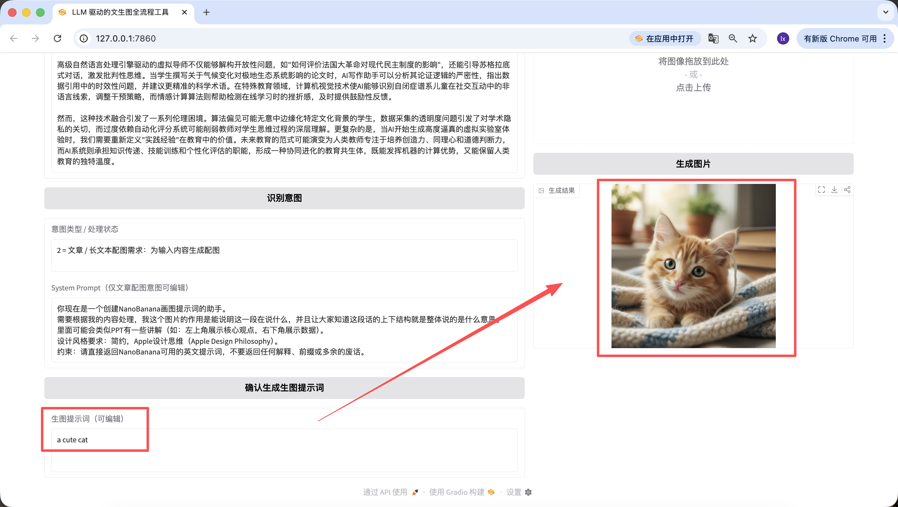

Đáng nói là prompt sinh ở bước trước cũng edit được trên web, và ta lấy prompt lúc cuối cùng click nút làm chuẩn — kể cả tôi đổi sang "a cute cat" ở đây, ảnh sinh cuối cùng cũng chỉ là 1 chú mèo dễ thương.

## Phụ lục: Hệ sinh thái tool sinh hình 2026

Trong khi bạn học bài này thì landscape đã chuyển khá mạnh — dưới đây là tổng hợp các nguồn/tool đáng dùng ngoài NanoBanana + Lovart.

### A. So sánh các model sinh hình chủ lực

| Model | Nhà cung cấp | Điểm mạnh | Pricing | Khi nào nên dùng |
|---|---|---|---|---|
| **NanoBanana 2** (Gemini 3.1 Flash Image) | Google | 4K, character consistency (5 char + 14 obj), nhanh, free trong Gemini app | Free trong Gemini, trả phí qua API/Vertex | Default cho hầu hết case, free tier rộng |
| **GPT Image 2** | OpenAI | Native reasoning, 2K, 8 ảnh nhất quán/prompt, **99% text accuracy** (hỗ trợ CJK, Hindi, Bengali) | API: $30/M output token, $8/M image input | Khi cần text trong ảnh rõ (poster, mockup, infographic) hoặc multi-image với nhân vật nhất quán |
| **Flux** (Pro/Dev) | Black Forest Labs | Photorealistic mạnh, open weight (Dev) | API ~$0.05/ảnh | Photoreal portrait, lifestyle shot, product photo |
| **Ideogram 3** | Ideogram | Text rendering tốt nhất ngành (trước GPT Image 2) | Free 25 ảnh/ngày, Plus $7/tháng | Typography-heavy: logo, poster có text dày |
| **Seedream** | ByteDance | Style consistency cao, batch generation | Qua Weavy/Volcengine API | Sinh asset hàng loạt giữ style |
| **Recraft V3** | Recraft AI | Sinh **vector SVG thật** chứ không phải raster | $20/tháng | Logo, icon, illustration cần scale |

### B. Gemini Omni — bước nhảy sang multimodal hợp nhất

Ngày 19/05/2026, Google ra **Gemini Omni** tại I/O 2026 — mô hình **đầu tiên hợp nhất text + image + audio + video** trong một model duy nhất. Khác biệt cốt lõi:

- Trước Omni: bạn sinh ảnh ở 1 tool, sinh video ở 1 tool khác, ghép audio ở tool thứ 3.
- Với Omni: 1 prompt → output là clip 10s đã có audio đồng bộ, có thể chỉnh sửa bằng hội thoại ("đổi giọng narrator thành nữ", "làm sáng nền lên").

**Phiên bản đầu**: Gemini Omni Flash — đã có trong Gemini app, YouTube Shorts, AI creative studio **Flow**. Mọi video có watermark SynthID.

**Implication cho asset workflow**: nếu trước đây bạn phải sinh ảnh sản phẩm bằng NanoBanana → animation bằng Runway/Pika → audio bằng ElevenLabs → cắt ghép CapCut, giờ có thể làm 1 mạch trong Omni. Trade-off: Flash giới hạn 10s clip, fine-grained control kém hơn pipeline truyền thống.

### C. Weavy / Figma Weave — design canvas node-based

**Weavy.ai** (đã được Figma mua 10/2025 ~$200M, đang rebrand thành **Figma Weave**) là một paradigm khác Lovart:

- **Lovart**: chat-driven, Agent tự lên kế hoạch và sinh.
- **Weavy**: **node-based canvas** (giống ComfyUI nhưng cloud + UX đẹp hơn). Mỗi node là 1 operation: generate / style transfer / upscale / inpaint / mask / color correct / composite. Bạn nối các node thành pipeline.

**Điểm mạnh**:
- Hỗ trợ nhiều model qua 1 canvas: **Flux, Ideogram, NanoBanana, Seedream** (không lock vào 1 model).
- Rerun từng step không mất các step trước → giữ visual consistency khi iterate.
- Workflow chia sẻ + template hoá ở plan team/enterprise → enforce brand guideline.

**Khi nào chọn Weavy thay vì Lovart**:
- Team design có pipeline phức tạp cần version hoá.
- Cần tự control thứ tự xử lý (sinh → upscale → relight → composite) thay vì giao toàn bộ cho Agent.
- Muốn dùng nhiều model cùng lúc cho cùng 1 project.

### D. Lovart alternatives khác

| Tool | Vị trí | Note |
|---|---|---|
| **Sovart** | Lovart alternative gần nhất | Free tier rộng, daily credit, cùng triết lý chat-driven Agent |
| **Leonardo AI** | Creative studio | Có AI Canvas cho inpaint/outpaint + custom model training |
| **Krea** | Video-focused | Sinh video từ text/image/preset style, real-time iteration tốt |
| **Magnific** | Upscaler chuyên dụng | "Hallucination Engine" tự thêm chi tiết, có Creativity Slider |
| **Open-Lovart** | Open source (MIT) | Self-hosted, alternative cho team không muốn lock vào SaaS — [GitHub](https://github.com/Anil-matcha/Open-Lovart) |

### E. Decision matrix: chọn stack nào?

| Use case | Khuyến nghị stack |
|---|---|
| **Cá nhân thử nghiệm, free** | Gemini app (NanoBanana 2 free) + Ideogram free tier (text-heavy) |
| **Solo dev / freelancer làm landing page asset** | NanoBanana API + Lovart Free + Recraft (cho icon SVG) |
| **Team marketing nội bộ** | Weavy/Figma Weave (collaboration + brand guideline) + GPT Image 2 (text accuracy) |
| **Studio design chuyên nghiệp** | Weavy + Flux + Magnific (upscale cuối) + Lovart cho ideation |
| **Sản phẩm AI tự build (như Chương 3)** | NanoBanana API (giá tốt) hoặc GPT Image 2 API (chất lượng cao hơn) + SiliconFlow/Qwen làm tư duy |
| **Cần video content** | Gemini Omni Flash (short clip + audio) hoặc Krea (longer + style control) |

### F. Tips quan trọng cho 2026

1. **Đừng lock 1 model**: model state-of-the-art thay đổi mỗi quý. Code abstraction nên cho phép swap `model` parameter dễ dàng (đúng như code trong bài — chỉ sửa 1 dòng).
2. **Watermark là chuẩn mới**: SynthID (Google) và metadata C2PA dần thành chuẩn. Nếu sản phẩm bạn xử lý ảnh AI-generated, plan trước cho việc detect/preserve watermark.
3. **Reasoning > raw quality**: GPT Image 2 với reasoning mode và NanoBanana 2 với plan-then-draw đã cho thấy: model có "lớp tư duy" cho output tốt hơn hẳn pure diffusion. Khi build Agent (như Chương 3), tận dụng reasoning model.
4. **Free tier rộng hơn trước**: Gemini app (NanoBanana 2 free), Ideogram (25/ngày free), ChatGPT free tier (Instant mode GPT Image 2). Không cần trả phí ngay để bắt đầu.
5. **CJK text rendering đã usable**: trước 2026, text tiếng Việt/Hoa/Nhật trong ảnh AI thường lỗi. GPT Image 2 đạt 99% accuracy cho CJK — có thể dùng cho poster đa ngôn ngữ thật sự.

::: warning Lưu ý compliance
Nếu bạn build tool sinh hình thương mại, kiểm tra ToS của từng provider — một số (như Midjourney) hạn chế commercial use ở tier free, một số (như NanoBanana qua Gemini app) cho phép nhưng yêu cầu disclose AI-generated.
:::

## Chương 4: Tóm lại


**Hú hồn! Cuối cùng cũng viết xong.**
Nói thật, ngay cả khi viết xong dòng cuối tôi cũng phải thở phào, chứ chưa nói đến bạn đã theo dõi từng bước tới đây. Chạy được cả bộ flow này đã rất giỏi rồi, điều đó cho thấy bạn thực sự đặt tay lên keyboard và làm từng bước. Bravo 🎉 🥳 👏

Trong quá trình viết bộ content này, tôi luôn nghĩ, rốt cuộc ta muốn để lại gì? Câu trả lời thật ra không phải tên model, tham số hay 1 công thức cố định nào, mà là để bạn dần xây dựng được cảm giác: việc nào có thể yên tâm giao cho AI hiểu và lên kế hoạch, việc nào chỉ bạn mới quyết được hướng đi. Một khi sự phân vai này đứng vững, nhiều flow sinh nhìn phức tạp ban đầu sẽ bắt đầu trở nên trôi chảy.

Nhìn lại, con đường này thực ra không phức tạp. Nghĩ kỹ vấn đề bạn muốn giải, đưa text dài cho language model tách, rồi đưa visual intent đã dọn sạch cho drawing model thể hiện, cuối cùng đóng gói cả flow thành 1 trợ lý nhỏ của riêng bạn. Đến đây, bạn không chỉ "đang dùng model" nữa, mà đang xây 1 hệ thống có thể đồng hành với bạn lâu dài trong công việc, và đây mới là điều bộ tutorial này muốn mang đến cho bạn nhất.

Nhưng bạn đã làm rất tuyệt rồi! Tin rằng học đến đây bạn đã có nắm bắt cơ bản về Vibe Coding rồi, cho bản thân 1 kỳ nghỉ nhỏ nghỉ ngơi đi!

::: tip Bước tiếp theo
Muốn đẩy "sinh asset" vào product flow thật sự? Tham khảo thêm:
- [Design to Code](../design-to-code/) — biến design thành code chạy được
- [Modern Component Library](../modern-component-library/) — dùng asset trong UI có sẵn
- [AI Interface Code](../../backend/ai-interface-code/) — viết API/back-end cho AI feature
:::

<RelatedArticlesSection
  title="Bài viết liên quan"
  description="Nếu bạn muốn đưa 'sinh asset' thật sự vào product flow, có thể học tiếp các chương sau."
  :items="relatedArticles"
/>
