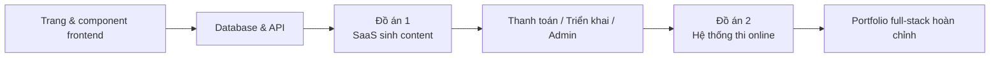

# Phát triển Trung cấp

Chào mừng bạn đến với giai đoạn **Phát triển Trung cấp**! Tại đây bạn sẽ đi sâu vào full-stack — làm chủ thành phần hoá frontend, thiết kế cơ sở dữ liệu, phát triển API backend và đưa sản phẩm lên môi trường thật.

## Bạn sẽ học được gì

### Phát triển Frontend

Làm chủ frontend hiện đại, học cách dùng component library và công cụ thiết kế:

<NavGrid>
  <NavCard
    href="/vi-vn/stage-2/frontend/lovart-assets/"
    title="Từ Lovart, dựng Agent sản xuất tài nguyên của riêng bạn"
    description="Bắt đầu từ con số 0, dùng Nanobanana và Lovart để sản xuất hàng loạt tài nguyên thiết kế chất lượng cao, đồng thời tự tay xây một Agent vẽ tranh có thể nhận diện ý định"
  />
  <NavCard
    href="/vi-vn/stage-2/frontend/figma-mastergo/"
    title="Nhập môn Figma & MasterGo"
    description="Nắm thao tác cơ bản với các công cụ thiết kế UI chuyên nghiệp, từ bản thiết kế đến quy trình phối hợp ra code"
  />
  <NavCard
    href="/vi-vn/stage-2/frontend/ui-design/"
    title="Xây ứng dụng hiện đại đầu tiên – Thiết kế UI"
    description="Học các nguyên tắc thiết kế UI nền tảng cho ứng dụng hiện đại"
  />
  <NavCard
    href="/vi-vn/stage-2/frontend/multi-product-ui/"
    title="Tham khảo UI Guidelines để thiết kế trang và button"
    description="Học các quy chuẩn thiết kế UI phổ biến, thiết kế cấp trang & button rõ ràng hơn"
  />
  <NavCard
    href="/vi-vn/stage-2/frontend/llm-skills-beautiful/"
    title="Dùng LLM và Skills khiến giao diện đẹp hơn"
    description="Thực chiến với prompt và plugin để AI tạo UI đẹp, độc đáo"
  />
  <NavCard
    href="/vi-vn/stage-2/frontend/hogwarts-portraits/"
    title="Cùng làm chân dung Hogwarts"
    description="Dự án thực chiến: kết hợp ảnh AI tạo, build một ứng dụng chân dung Hogwarts tương tác"
  />
  <NavCard
    href="/vi-vn/stage-2/frontend/design-to-code/"
    title="Từ bản thiết kế đến code dự án"
    description="Học cách chuyển bản thiết kế trong tool thiết kế thành code frontend thật chạy được trên trình duyệt"
  />
  <NavCard
    href="/vi-vn/stage-2/frontend/modern-component-library/"
    title="Dùng component library hiện đại để cập nhật giao diện"
    description="Học cách dùng component library để dựng nhanh giao diện cấp chuyên nghiệp"
  />
</NavGrid>

### Phát triển Backend

Học thiết kế API, quản trị database và chiến lược triển khai ứng dụng:

<NavGrid>
  <NavCard
    href="/vi-vn/stage-2/backend/git-workflow/"
    title="Học dùng Git & GitHub"
    description="Làm chủ các thao tác cốt lõi và quy trình cộng tác của hệ thống quản lý phiên bản Git"
  />
  <NavCard
    href="/vi-vn/stage-2/backend/database-supabase/"
    title="Từ cơ sở dữ liệu đến Supabase"
    description="Làm chủ nền tảng cơ sở dữ liệu quan hệ và học dùng Supabase — một BaaS hiện đại"
  />
  <NavCard
    href="/vi-vn/stage-2/backend/ai-interface-code/"
    title="Thiết kế và phát triển API backend"
    description="Tận dụng AI để tạo code backend và tài liệu API chuẩn, tăng hiệu suất phát triển"
  />
  <NavCard
    href="/vi-vn/stage-2/backend/zeabur-deployment/"
    title="Phát hành prototype sản phẩm"
    description="Học dùng Zeabur để triển khai nhanh ứng dụng full-stack lên cloud"
  />
  <NavCard
    href="/vi-vn/stage-2/backend/modern-cli/"
    title="Từ IDE đến công cụ AI CLI"
    description="Khám phá các công cụ CLI hiện đại, nâng cao trải nghiệm phát triển trong terminal"
  />
  <NavCard
    href="/vi-vn/stage-2/backend/stripe-payment/"
    title="Tích hợp các hệ thống thanh toán như Stripe"
    description="Thực chiến: tích hợp thanh toán Stripe vào ứng dụng để thương mại hoá"
  />
</NavGrid>

### Đồ án lớn

Các chương phía trên dạy "linh kiện". Đồ án lớn mới dạy bạn "ghép linh kiện thành một sản phẩm chạy được, demo được, đưa được lên production".

Khuyến nghị làm theo thứ tự **Đồ án 1 → Đồ án 2**:

- **Đồ án 1** đưa bạn qua luồng phổ biến nhất của SaaS hiện đại: đăng nhập, sinh nội dung, database, thanh toán, admin.
- **Đồ án 2** đưa bạn vào bài toán giống hệ thống nghiệp vụ: role-permission, ngân hàng đề, kỳ thi, log nộp bài, quản trị.

Chưa biết làm đồ án nào trước? Tham khảo bảng so sánh:

| Đồ án | Bạn luyện trọng tâm điều gì | Phù hợp với ai | Sản phẩm cuối |
|------|------|------|------|
| Đồ án 1: Website sinh content | Cấu trúc trang SaaS, login, sinh nội dung AI, thanh toán Stripe, admin | Người lần đầu làm website thương mại hoàn chỉnh | Một SaaS phôi: đăng ký, sinh nội dung, tính phí, quản trị |
| Đồ án 2: Hệ thống thi & quản trị online | Role-permission, mô hình ngân hàng đề, quy trình thi, log nộp, chấm điểm & thống kê | Người muốn làm "hệ thống nghiệp vụ" thật trọn vẹn | Nền tảng thi có phía học viên và phía admin |

Bất kể làm đồ án nào, đều nên chuẩn bị tối thiểu 3 sản phẩm bàn giao:

- Một repo dự án chạy được
- Một link demo truy cập được
- Một README và video demo ngắn

<NavGrid>
  <NavCard
    href="/vi-vn/stage-2/assignments/copywriting-platform-supabase/"
    title="Đồ án 1: SaaS full-stack đầu tay — Website sinh content"
    description="Xây từ con số 0 một xưởng content marketing AI: login, sinh nội dung, thanh toán, admin"
  />
  <NavCard
    href="/vi-vn/stage-2/assignments/exam-management-express/"
    title="Đồ án 2: Hệ thống thi & quản trị online"
    description="Xây hệ thống thi online: tự ra đề, làm bài, admin"
  />
</NavGrid>

Nếu đã làm xong 2 đồ án chính ở trên, hoặc muốn build portfolio theo hướng kỹ thuật riêng, chọn tiếp các đồ án mở rộng dưới đây:

<NavGrid>
  <NavCard
    href="/vi-vn/stage-2/assignments/modern-landing-page/"
    title="Đồ án mở rộng: Engineering cho landing page Web hiện đại"
    description="Luyện diễn đạt giá trị, đường dẫn chuyển đổi, CTA, tracking cơ bản — một trang thực sự nuốt được traffic"
  />
  <NavCard
    href="/vi-vn/stage-2/assignments/custom-dify-agent-platform/"
    title="Đồ án mở rộng: Nền tảng orchestration Agent kiểu Dify"
    description="Triển khai quản lý agent, hội thoại, log, phân quyền — một nền tảng AI tối thiểu khả dụng"
  />
  <NavCard
    href="/vi-vn/stage-2/assignments/travel-planning-agent-platform/"
    title="Đồ án mở rộng: Nền tảng orchestration Agent du lịch thông minh"
    description="Xoay quanh structured input, orchestration Agent và quản lý lịch trình lịch sử — một sản phẩm AI lập kế hoạch du lịch chạy được"
  />
  <NavCard
    href="/vi-vn/stage-2/assignments/movie-recommendation-springboot/"
    title="Đồ án mở rộng: Hệ thống gợi ý phim Spring Boot"
    description="Kết hợp Spring Boot, rating, bookmark và recommendation có giải thích — hoàn thành prototype hệ thống gợi ý đầy đủ"
  />
  <NavCard
    href="/vi-vn/stage-2/assignments/simple-grocery-microservices/"
    title="Đồ án mở rộng: TMĐT thực phẩm tươi với microservices"
    description="Luyện tách service, gateway routing, phối hợp inventory–order — trải nghiệm tư duy chuyển từ monolith sang microservices"
  />
  <NavCard
    href="/vi-vn/stage-2/assignments/traffic-data-visualization-go/"
    title="Đồ án mở rộng: Phân tích & dashboard dữ liệu giao thông bằng Go"
    description="Từ ingest dữ liệu, window aggregation, dashboard xu hướng đến cảnh báo — một sản phẩm dữ liệu hoàn chỉnh"
  />
</NavGrid>

### Mở rộng năng lực AI

<NavGrid>
  <NavCard
    href="/vi-vn/stage-2/ai-capabilities/dify-knowledge-base/"
    title="Nhập môn Dify và tích hợp knowledge base"
    description="Học dùng Dify để build ứng dụng AI và tích hợp knowledge base riêng"
  />
</NavGrid>

## Phù hợp với ai

- Lập trình viên có nền tảng, muốn học full-stack một cách hệ thống
- Người học muốn chuyển từ PM sang full-stack engineer
- Lập trình viên trung cấp muốn làm chủ công cụ và workflow hiện đại
- Founder muốn tự phát triển một sản phẩm hoàn chỉnh

## Yêu cầu đầu vào

- Đã hoàn thành giai đoạn "Người mới & prototype sản phẩm", hoặc có kiến thức tương đương
- Hiểu khái niệm cơ bản HTML/CSS/JavaScript
- Có hình dung sơ bộ về các công cụ lập trình AI

Sẵn sàng đi sâu vào full-stack? Bấm vào menu sidebar bên trái để bắt đầu!
