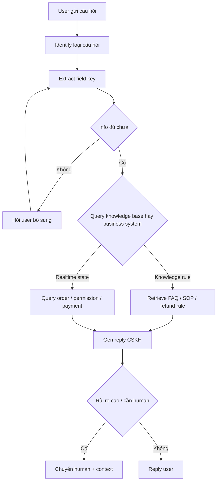
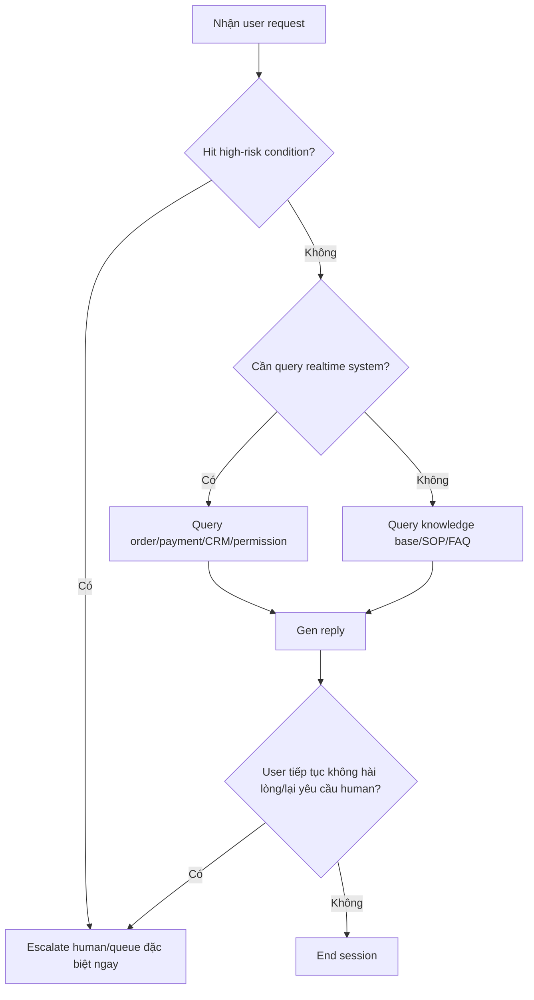

# Customer Service Agent enterprise — build với LangGraph

::: tip Cập nhật 5/2026
- **LangGraph 0.3+** stable, support đa ngôn ngữ
- **LangSmith** đã thành standard cho tracing + eval
- **Multi-agent supervisor pattern** mainstream cho complex routing
- **Streaming output** native trong LangGraph 0.3
- **VN context**: tích hợp với Zalo OA, Smax.ai cho CSKH VN
:::

Nếu bạn đã làm knowledge base Q&A, bước tiếp đáng học không phải chồng thêm prompt, mà bắt đầu hiểu: 1 Agent thực sự vào flow CSKH enterprise phải design thế nào.

Chương này chỉ làm 1 việc: dùng tư duy LangGraph bóc tách 1 hệ CSKH thông minh cấp commercial. Trọng tâm không phải chi tiết code, mà **business sense, xử lý exception, escalate human, design data và boundary go-live**.

# Quickstart

Nếu muốn bắt đầu ngay, hãy hình dung scenario:

User gửi lúc 10h đêm: "Tôi đã pay rồi, sao course vẫn không mở được?". Lúc này, 1 Agent CSKH thực sự có thể go-live không phải bịa câu trả lời ngay, mà phán đoán trước: đây có phải vấn đề permission không, cần xác nhận order number, có cần query payment system, có cần chuyển human ngay.

Nếu bạn chỉ cần nhớ 1 câu:

> Mục tiêu của Agent CSKH enterprise không phải "trả lời nhiều hơn", mà **"khi nên auto thì auto, khi không chắc thì hỏi thêm, khi rủi ro cao thì chuyển human"**.

# 1. Business side: quyết định CSKH này làm gì

Agent CSKH trong enterprise không design từ "model giỏi, có thể làm gì". Design từ "business muốn nó gánh vác công việc gì".

Cách phán đoán phổ biến nhất là xem các câu hỏi:

1. Câu hỏi nào xuất hiện tần suất cao nhất?
2. Câu hỏi nào rule rõ, phù hợp automation?
3. Câu hỏi nào rủi ro cao, không thể auto quyết định?
4. Câu hỏi nào phải connect business system, không thể chỉ knowledge base?

Nếu các câu này chưa rõ, dù dùng LangGraph, Dify hay Agent runtime khác, system dễ thành "demo thông minh, thật không dám release".

## 1.1 Coi CSKH là business process, không phải chatbot

LangGraph phù hợp CSKH không phải vì "chat hay hơn", mà vì **CSKH bản chất là vấn đề state transition**.

Ví dụ user nói:
> "Course tôi mua hôm qua vẫn không mở được, check giúp tôi?"

System CSKH trưởng thành không answer ngay, mà phán đoán:

1. Đây là payment, permission, refund hay account?
2. Order number, account, thời gian có đủ không?
3. Query knowledge base hay business system?
4. Request thường hay khiếu nại rủi ro cao?
5. Auto handle hay escalate human?



Quan trọng nhất trong diagram không phải tên node, mà **business logic**:

1. Info chưa đủ thì dừng lại
2. Câu hỏi document và realtime tách riêng
3. Câu hỏi rủi ro cao đừng cố trả lời

## 1.2 Build system với scenario business thật

Để chương này giống enterprise solution chứ không phải intro framework abstract, dùng ví dụ **online education platform**. Agent xử 4 loại câu hỏi:

1. Course không mở được, membership chưa activate
2. Order paid nhưng page status bất thường
3. Refund rule giải thích và refund progress query
4. Khiếu nại, double-charge, request human

Input user thực có thể là:

- "Hôm qua tôi đã pay, nhưng course vẫn locked."
- "Sao tôi login rồi vẫn không xem được chương nâng cao?"
- "Order đã trừ tiền, nhưng page không hiện thành công."
- "Order này có refund được không?"
- "Tôi cần human, bot này không giải quyết được."

Các input đều không structured, nên **nguyên tắc đầu tiên của CSKH enterprise không phải "trả lời nhanh", mà "hiểu task rõ trước"**.

Bạn có thể dùng 1 prompt để làm phán đoán business bước đầu:

```text
Bạn là "trợ lý phân loại và bổ sung info" trong system CSKH enterprise.

Task không phải giải quyết tất cả vấn đề ngay, mà làm trước:
1. Phán đoán loại: FAQ, query order/permission, refund/khiếu nại, escalate human rủi ro cao
2. Extract field key: account, order number, thời gian, tên product, channel
3. Nếu field thiếu, đừng đoán, đừng đưa kết luận, mà gen 1 câu hỏi follow-up ngắn nhất, tự nhiên
4. Nếu user yêu cầu rõ human, hoặc xuất hiện double-charge, khiếu nại, legal, privacy, cảm xúc mạnh → mark escalate

Output format:
- Loại câu hỏi:
- Info key:
- Có thiếu info:
- Action tiếp:
- Câu nói cho user:
```

Giá trị lớn nhất của prompt này không phải để "model trông thông minh", mà để **system có business boundary từ bước 1**.

## 1.3 CSKH thương mại quan tâm thực không chỉ reply, mà routing

Nếu bạn xem các giải pháp CSKH thương mại như Zendesk, Intercom, Salesforce, sẽ thấy: tất cả làm cùng 1 việc — **phân request theo business value và risk level trước**.

Phân tầng gần thực tế enterprise:

### High concurrency, low risk, self-service closed loop

Phù hợp ưu tiên automation, vì tần suất cao, rule rõ, ROI trực tiếp:
1. Reset password
2. Course/membership/permission đã activate chưa
3. Order paid thành công chưa
4. Invoice, download, login entry
5. Refund rule cơ bản

### Cần bổ sung info mới tiếp được

Nhiều user không nói full info lần đầu, system phải biết hỏi thêm.

Ví dụ:
- "Tôi paid nhưng course vẫn không mở."
- "Check giúp xem order có vấn đề không."
- "Sao membership chưa active?"

Badcase phổ biến: system đoán thẳng.

### Cần query system semi-auto

Câu hỏi không chỉ xem knowledge base, vì answer thực ở business system.

Ví dụ:
1. Order đã paid thành công chưa
2. Refund đã vào finance flow chưa
3. User có phải VIP không
4. Permission course nào đó đã active thật chưa

### Phải escalate human hoặc queue đặc biệt

Đây là phân ranh giới của system enterprise.

High-risk điển hình:
1. Double-charge
2. Khiếu nại + cảm xúc mạnh
3. Legal, privacy, compliance
4. Card fraud, account ban
5. High-value customer negative request



# 2. Technical side: implement function thế nào

Khi business side rõ "câu hỏi nào auto, nào human, nào query system", target technical mới rõ.

Cái cần implement không phải bot "chat hay", mà:

1. **Intent classifier** module
2. **Key info extraction** module
3. **Info gathering** module
4. **Knowledge base query** module
5. **Business system query** module
6. **Risk assessment** module
7. **Human handoff** module

## 2.1 Module flow

```typescript
type CustomerServiceState = {
  userMessage: string
  intent?: "faq" | "order" | "refund" | "risk"
  missingFields: string[]
  riskLevel?: "low" | "medium" | "high"
  knowledgeResult?: string
  businessResult?: string
  finalReply?: string
  handoffToHuman: boolean
}

function runCustomerServiceFlow(state: CustomerServiceState) {
  state = classifyIntent(state)
  state = extractFields(state)
  
  if (state.missingFields.length > 0) return askForMoreInfo(state)
  if (state.intent === "faq") state = searchKnowledgeBase(state)
  else state = queryBusinessSystems(state)
  
  state = evaluateRisk(state)
  if (state.handoffToHuman) return handoffWithContext(state)
  return generateReply(state)
}
```

Code viết minimal cố ý. Đừng care về API framework trước, hiểu 1 thứ: **bản chất Agent CSKH enterprise không phải "model trả lời 1 lần", mà "state flow qua các module"**.

### LangGraph version code

```python
from langgraph.graph import StateGraph, END
from typing import TypedDict

class CustomerServiceState(TypedDict):
    user_message: str
    intent: str
    missing_fields: list
    risk_level: str
    knowledge_result: str
    business_result: str
    final_reply: str
    handoff: bool

# Build graph
workflow = StateGraph(CustomerServiceState)

workflow.add_node("classify", classify_intent_node)
workflow.add_node("extract", extract_fields_node)
workflow.add_node("ask_more", ask_for_info_node)
workflow.add_node("kb_search", knowledge_base_node)
workflow.add_node("biz_query", business_query_node)
workflow.add_node("risk_check", risk_assessment_node)
workflow.add_node("handoff", human_handoff_node)
workflow.add_node("generate", generate_reply_node)

# Edges
workflow.set_entry_point("classify")
workflow.add_edge("classify", "extract")

# Conditional routing
def route_after_extract(state):
    if state["missing_fields"]:
        return "ask_more"
    elif state["intent"] == "faq":
        return "kb_search"
    else:
        return "biz_query"

workflow.add_conditional_edges("extract", route_after_extract, {
    "ask_more": "ask_more",
    "kb_search": "kb_search",
    "biz_query": "biz_query"
})

workflow.add_edge("kb_search", "risk_check")
workflow.add_edge("biz_query", "risk_check")

def route_after_risk(state):
    return "handoff" if state["handoff"] else "generate"

workflow.add_conditional_edges("risk_check", route_after_risk, {
    "handoff": "handoff",
    "generate": "generate"
})

workflow.add_edge("ask_more", END)
workflow.add_edge("handoff", END)
workflow.add_edge("generate", END)

app = workflow.compile()
```

## 2.2 Data, monitoring và exception handling

System CSKH thương mại thật depend data hơn nhiều chat log.

Ít nhất 3 tầng:

1. **Input side data**: nguyên văn user, channel, language, conversation gần, có lặp lại không, có yêu cầu human không
2. **Business side data**: account, order, payment status, permission, customer tier, history khiếu nại, region, package
3. **Operations side data**: auto-resolve rate, escalate rate, first response time, repeat rate, fail rate, CSAT

Nếu các data này không structured, system khó thực sự enterprise.

Equally important là exception handling. CSKH enterprise không chấp nhận model **giả vờ biết answer khi không chắc**.

4 loại badcase phổ biến:

1. Info chưa đủ vẫn cố trả lời
2. System timeout vẫn giả vờ query được result
3. User rõ ràng không hài lòng vẫn auto reply tiếp
4. Câu hỏi high-risk vẫn theo FAQ flow

Prompt cho exception + escalation:

```text
Bạn là "trợ lý phán đoán exception và escalation" trong system CSKH.

Phán đoán session hiện tại có cần escalate human hoặc downgrade không.

Khi 1 trong các điều kiện sau xảy ra, ưu tiên escalate human:
1. User yêu cầu rõ human
2. Xuất hiện double-charge, khiếu nại, legal, privacy, fraud, account ban, refund dispute
3. User cảm xúc rõ mạnh, hoặc 2 lượt liên tiếp bày tỏ không hài lòng
4. Query business system fail, timeout, trả result conflict
5. Evidence hiện tại không đủ, không đảm bảo kết luận đúng

Nếu không escalate human, vẫn phải output:
1. Risk level hiện tại
2. Có cho phép auto reply không
3. Nếu auto reply, cách reply bảo thủ nhất là gì
4. Nếu query fail, giải thích cho user thế nào

Output format:
- Risk level:
- Có escalate human:
- Lý do:
- Câu nói cho user:
```

Routing code minimal:

```typescript
function routeTicket(state: CustomerServiceState) {
  if (state.riskLevel === "high") return "human_handoff"
  if (state.missingFields.length > 0) return "ask_user"
  if (state.intent === "faq") return "knowledge_lookup"
  return "business_lookup"
}
```

Project enterprise thực phức tạp hơn, nhưng landing point thường là 4 hướng: ask info, query knowledge base, query business system, escalate human.

# 3. Kết: phán đoán đủ enterprise chưa

Agent CSKH thực sự enterprise-grade phải đạt:

1. **Service boundary rõ**: cái nào auto, cái nào không
2. **Cơ chế human handoff**: escalate không bắt user lặp lại
3. **Audit trail**: review sau biết tại sao route như vậy
4. **Canary release và rollback**: không change prompt là toàn release
5. **Operations metric**: không chỉ "giống chat thật"

Đầy đủ hơn, chuẩn bị thêm:
- **Permission layer**: role khác query data khác
- **SLA + timeout fallback**: query không được xử thế nào
- **Offline eval set**: cover câu hỏi phổ biến, edge case, high-risk
- **Human feedback loop**: feed back human result vào system

Không có các thứ này, system chỉ là demo CSKH OK demo.

# 4. Thứ tự go-live khuyến nghị

Nếu thực sự làm, đẩy theo:

1. Làm 1 scenario tần suất cao + low risk trước
2. Viết input user thật trước, rồi viết state và routing
3. Connect 1 knowledge source + 1 business system
4. Thêm human escalation, exception handling, operations metric
5. Cuối mới xét orchestration Agent phức tạp hơn

# Tổng kết

LangGraph phù hợp CSKH enterprise không vì làm reply "hoa lá", mà vì viết được **những thứ quan trọng nhất của CSKH system rõ ràng**: routing, state, follow-up question, query, escalate, tracking.

Khi bạn bắt đầu coi CSKH là 1 business process governed, không phải 1 bot biết nói chuyện, bạn mới thực sự vào design CSKH AI enterprise-grade.

# Đọc thêm

Tài liệu đáng xem cho hướng enterprise:

1. **LangChain official "Thinking in LangGraph"** — hiểu tại sao flow CSKH nên tách state trước, viết node sau
2. **Klarna case** — scenario CSKH quy mô lớn, tại sao auto rate, escalate rate, response time quan trọng hơn "tone tự nhiên"
3. **Minimal case** — multi-agent connect Zendesk, Front, Gorgias thực sự
4. **Podium case** — tại sao trace, eval, regression test không thể thiếu
5. **Zendesk / Intercom / Salesforce** — cách product thương mại xử handoff, sentiment, VIP routing, procedure handoff, operations metric
6. **CFPB chatbot guidance** — góc nhìn regulator, tại sao chatbot kém đẩy user vào "doom loops"

# References

- [LangGraph Overview](https://docs.langchain.com/oss/python/langgraph/overview)
- [Thinking in LangGraph](https://docs.langchain.com/oss/python/langgraph/thinking-in-langgraph)
- [Built with LangGraph](https://www.langchain.com/built-with-langgraph)
- [Klarna Customer Story](https://blog.langchain.dev/customers-klarna/)
- [Minimal Customer Support System](https://blog.langchain.dev/how-minimal-built-a-multi-agent-customer-support-system-with-langgraph-langsmith/)
- [Podium Customer Story](https://blog.langchain.dev/customers-podium/)
- [Zendesk AI for Service](https://www.zendesk.com/service/ai/)
- [Intercom Fin](https://www.intercom.com/fin)
- [CFPB Chatbot Guidance](https://www.consumerfinance.gov/about-us/newsroom/cfpb-issues-guidance-to-prevent-harmful-chatbot-practices/)

---

# Phụ lục: LangGraph CSKH cho VN 2026

## A. Stack đề xuất cho VN

```
Frontend channels: Zalo OA + Web chat + Facebook Messenger + Email
Orchestration: LangGraph
LLM: Claude Sonnet 5 (Tiếng Việt fluent)
Knowledge base: Dify hoặc LlamaIndex + Vector DB
Business system: KiotViet, Sapo, HubSpot API
CRM: Smax.ai cho multi-channel
Monitoring: LangSmith + Posthog
Human handoff: Live agent UI (Smax.ai có sẵn)
Notification: Zalo OA push
```

## B. VN-specific use case

1. **E-commerce CSKH**: order status, refund, shipping (GHTK, GHN), return
2. **Banking**: balance, transfer issue, card lost, dispute
3. **Insurance**: policy lookup, claim status, beneficiary
4. **Edu platform**: course access, payment, schedule
5. **Healthcare appointment**: booking, reschedule, medical record
6. **Real estate**: viewing schedule, document, contract

## C. Risk pattern cần escalate ở VN

- Khiếu nại liên quan tiền (double charge, missing refund)
- Lừa đảo (báo tài khoản bị hack)
- Privacy (yêu cầu xoá data theo NĐ13/2023)
- Cảm xúc mạnh (chửi, đe doạ)
- VIP customer negative
- Legal threat (kiện tụng, cơ quan chức năng)

## D. Integration với Zalo OA

```python
from zalo_oa import ZaloOA

zalo = ZaloOA(access_token=ZALO_TOKEN)

def send_zalo_reply(user_id: str, message: str):
    zalo.send_text(user_id, message)

def handoff_to_human_zalo(user_id: str, context: dict):
    # Transfer conversation tới human agent qua Smax.ai
    smax_client.create_handover(
        zalo_user_id=user_id,
        context=context,
        priority="high"
    )
    zalo.send_text(user_id, "Đã chuyển bạn tới chuyên viên CSKH, vui lòng đợi...")
```

## E. Eval set tiếng Việt

Build 100 case cover:
- 60 case bình thường (FAQ, order query)
- 20 case cần hỏi thêm info
- 10 case escalate (khiếu nại, cảm xúc, legal)
- 10 case edge (typo, mixed language, voice transcription error)

Test mỗi release. Track:
- **Auto resolution rate**: target >70%
- **Escalation rate**: target <20%
- **CSAT**: target >4.0/5

## F. Operations playbook

**Daily**:
- Review handoff conversations (sao escalate)
- Check eval set fail cases
- Update knowledge base với câu hỏi mới

**Weekly**:
- Review metric: auto rate, CSAT, response time
- Update prompt nếu pattern fail mới
- Add new SOP cho scenario mới

**Monthly**:
- Re-run full eval set
- Analyze user feedback
- A/B test prompt variants
- Plan feature next sprint

## Sources

- [LangGraph official docs](https://docs.langchain.com/langgraph)
- [LangSmith tracing](https://docs.smith.langchain.com/)
- [Klarna case study](https://blog.langchain.dev/customers-klarna/)
- [Smax.ai docs](https://smax.ai/docs)
