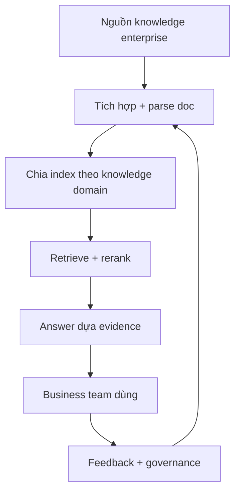
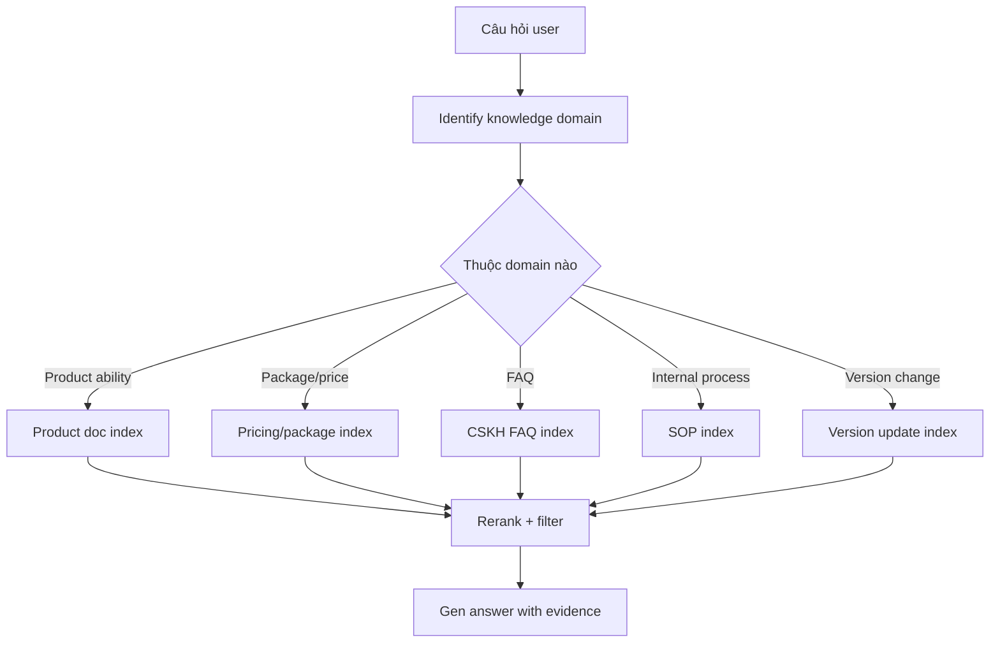

# Knowledge base enterprise — build RAG có thể go-live với LlamaIndex

::: tip Cập nhật 5/2026
- **LlamaIndex 0.12+** stable, workflow-first API
- **LlamaCloud** (managed service) cho document parsing + sync
- **LlamaParse** premier solution cho complex PDF (table, chart)
- **Multi-agent over knowledge base** mainstream pattern
- **VN context**: knowledge base tiếng Việt cần Qwen3-Embedding + hybrid search
:::

Nếu LangGraph phù hợp giải "CSKH hoặc Agent chạy thế nào", thì LlamaIndex phù hợp giải vấn đề equally important khác: **knowledge của enterprise nên được tiếp cận, tổ chức, retrieve và trả lời thế nào**.

Chương này chỉ focus knowledge base enterprise. Trọng tâm không viết nhiều code, mà hiểu **1 system knowledge thực sự vào dùng trong enterprise phải giải vấn đề gì**.

# Quickstart

Hình dung scenario đơn giản:

Đồng nghiệp sales hỏi bạn cùng vài loại câu hàng ngày: "Bản enterprise có support feature này không?", "Bản mới và cũ khác gì?", "Đoạn này gửi khách thế nào hợp?". Cái bạn cần làm: gom answer phân tán trong product doc, FAQ, changelog thành 1 trợ lý knowledge internal có thể hỏi mọi lúc, trả lời ổn.

1 câu cần nhớ:

> Knowledge base enterprise không phải "nhồi PDF cho model", mà **"biến knowledge phân tán thành 1 entry maintainable, retrievable, traceable"**.

# 1. Business side: quyết định knowledge base giải gì

Knowledge base enterprise không design từ "connect framework retrieve nào". Design từ **"team business hỏi đi hỏi lại gì hàng ngày"**.

Nếu không nghĩ rõ, dù dùng LlamaIndex, RAG framework khác, hay tự build, system dễ thành "search được, nhưng không dùng được".

## 1.1 Coi knowledge base là knowledge system, không phải upload page

Nhiều người mới làm knowledge base sẽ nghĩ tự nhiên:
> "Upload hết doc vào, là OK chứ?"

Nhưng trong môi trường enterprise thật, knowledge ít nhất có các đặc điểm:

1. **Nguồn nhiều**, không chỉ 1 đống PDF
2. **Update thường xuyên**, answer cũ nhanh outdated
3. **Mức độ tin cậy khác nhau** giữa doc
4. Có loại là doc, có loại là database hay config table
5. Có câu hỏi không thể chỉ dựa doc, cần combine realtime system

Nên knowledge base enterprise thực sự giải không phải "có doc không", mà:

1. **Đi đâu tìm**
2. **Tìm bản đáng tin nhất**
3. **Tránh nhiễu version cũ**
4. **Tìm được rồi tổ chức thành answer ổn định thế nào**



Signal quan trọng nhất từ diagram: **knowledge base enterprise không phải project 1 lần, mà là 1 vòng lặp governance liên tục**.

## 1.2 Build với scenario business thật

Cho cụ thể, set 1 scenario knowledge base enterprise phổ biến:

Bạn làm **trợ lý knowledge sản phẩm enterprise internal**, target user là CSKH, sales, implementation team.

Câu hỏi cần trả lời thường kiểu:

- "Bản enterprise có config được multi-approval flow không?"
- "Khách hỏi mình so với bản basic thêm gì về permission management?"
- "Feature này chỉ admin xem được hay member thường cũng dùng được?"
- "Tôi nhớ trước doc viết limit 100 người, giờ vẫn còn?"
- "Gen 1 đoạn update note gửi khách phù hợp?"

Câu hỏi này giống ngôn ngữ làm việc thật, không phải SQL query.

Vì vậy, bước 1 của knowledge base enterprise không phải "vectorize", mà thừa nhận trước:

> **Cách user hỏi và cách enterprise doc viết thường không cùng 1 ngôn ngữ.**

Prompt cho understanding question + knowledge routing:

```text
Bạn là "trợ lý hiểu câu hỏi và route knowledge" trong system knowledge base enterprise.

Task:
1. Phán đoán câu hỏi thuộc knowledge domain nào: product feature, pricing, FAQ, internal SOP, version update
2. Phán đoán nên query doc, FAQ, hay cần combine business system
3. Nếu câu hỏi liên quan conflict version cũ-mới, ưu tiên nhắc system focus doc version mới nhất
4. Nếu câu vượt năng lực knowledge base, đừng bịa, nói rõ cần check business system hoặc human

Output format:
- Knowledge domain câu hỏi thuộc:
- Source query đề xuất:
- Có thể liên quan version conflict không:
- Có cần business system bổ sung không:
- Hint retrieve cho system upper:
```

Value của prompt này là **làm đúng việc "đi đâu tìm knowledge" trước**.

## 1.3 Design core nhất của knowledge base enterprise: không phải retrieve, mà tách

Hiệu quả knowledge base enterprise kém, nguyên nhân phổ biến nhất không phải model yếu, mà **tất cả doc bị mix thành 1 nồi**.

Cách gần enterprise project hơn: tách theo knowledge domain trước:

1. Product feature doc
2. Package + pricing
3. CSKH FAQ
4. Internal SOP
5. Version changelog

Vì sao tốt hơn? Vì user hỏi:
> "Bản mới thêm năng lực gì?"

và user hỏi:
> "Refund rule là gì?"

Rõ ràng không nên ưu tiên query cùng tài liệu.



Đây là lý do LlamaIndex phù hợp knowledge base enterprise. Không chỉ giúp "làm vector retrieval", mà tiện hơn cho bạn **tổ chức knowledge từ nguồn, theme, rule khác nhau**.

# 2. Technical side: implement function thế nào

Khi business side rõ "câu hỏi phổ biến gì, knowledge domain nào tách, câu nào không chỉ dựa doc", target technical mới rõ.

Cái thực sự cần implement không phải "chat window to vô tận", mà:

1. **Question routing** module
2. **Document ingestion + parsing** module
3. **Multi-domain index** module
4. **Retrieve + rerank** module
5. **Evidence-grounded answer** module
6. **Version + authoritative source** module

## 2.1 Module flow

```typescript
type KnowledgeQuery = {
  question: string
  domain?: "product" | "pricing" | "faq" | "sop" | "release_notes"
  needsBusinessData?: boolean
}

function answerWithKnowledgeBase(query: KnowledgeQuery) {
  const routed = routeQuery(query)
  const docs = retrieveDocuments(routed)
  const ranked = rerankDocuments(docs, routed)
  return generateGroundedAnswer(ranked, routed)
}
```

Code cố ý không viết API framework cụ thể. Giúp bạn nắm spine của knowledge base enterprise: **route trước, retrieve, rerank, cuối answer dựa evidence**.

### LlamaIndex version

```python
from llama_index.core import VectorStoreIndex, SimpleDirectoryReader
from llama_index.core.query_engine import RouterQueryEngine
from llama_index.core.tools import QueryEngineTool

# Load doc theo domain
product_docs = SimpleDirectoryReader("./docs/product").load_data()
pricing_docs = SimpleDirectoryReader("./docs/pricing").load_data()
faq_docs = SimpleDirectoryReader("./docs/faq").load_data()
sop_docs = SimpleDirectoryReader("./docs/sop").load_data()
release_docs = SimpleDirectoryReader("./docs/release_notes").load_data()

# Build index riêng cho mỗi domain
product_index = VectorStoreIndex.from_documents(product_docs)
pricing_index = VectorStoreIndex.from_documents(pricing_docs)
faq_index = VectorStoreIndex.from_documents(faq_docs)
sop_index = VectorStoreIndex.from_documents(sop_docs)
release_index = VectorStoreIndex.from_documents(release_docs)

# Wrap thành tool
tools = [
    QueryEngineTool.from_defaults(
        query_engine=product_index.as_query_engine(),
        description="Query về product feature, capability, technical detail"
    ),
    QueryEngineTool.from_defaults(
        query_engine=pricing_index.as_query_engine(),
        description="Query về pricing, package, billing"
    ),
    QueryEngineTool.from_defaults(
        query_engine=faq_index.as_query_engine(),
        description="Câu hỏi thường gặp của khách"
    ),
    QueryEngineTool.from_defaults(
        query_engine=sop_index.as_query_engine(),
        description="Internal process, SOP, policy"
    ),
    QueryEngineTool.from_defaults(
        query_engine=release_index.as_query_engine(),
        description="Version update, changelog, new feature"
    ),
]

# Router tự chọn tool đúng theo question
router = RouterQueryEngine.from_defaults(query_engine_tools=tools)

response = router.query("Bản enterprise mới có thêm SSO không?")
print(response)
```

## 2.2 Governance, boundary và evidence

Nếu xem case gần enterprise hơn, sẽ thấy phần thực sự khó **không phải answer, mà governance**.

Knowledge base enterprise cần các "ý thức":

### Version awareness

User hỏi:
> "Tôi nhớ trước doc viết limit 100 người, giờ vẫn?"

Risk lớn nhất không phải retrieve không được, mà **retrieve được rule cũ**.

System enterprise phải:
1. Ưu tiên version mới nhất
2. Phân biệt doc lịch sử
3. Tránh doc cũ override rule hiện tại

```python
# Add metadata version trong document
from llama_index.core import Document

doc = Document(
    text=content,
    metadata={
        "version": "v3.2",
        "release_date": "2026-05-01",
        "is_current": True,
        "deprecated": False
    }
)

# Filter khi query
from llama_index.core.vector_stores.types import MetadataFilters, ExactMatchFilter

filters = MetadataFilters(filters=[
    ExactMatchFilter(key="is_current", value=True),
    ExactMatchFilter(key="deprecated", value=False)
])

query_engine = index.as_query_engine(filters=filters)
```

### Authoritative source awareness

Cùng 1 câu hỏi, FAQ, product manual, sales script, internal SOP có thể viết không hoàn toàn giống nhau.

System enterprise phải define:
1. Default theo cái nào
2. Loại doc nào chỉ internal reference
3. Loại nào public được

```python
# Score authority
AUTHORITY_SCORE = {
    "product_manual": 1.0,
    "sop": 0.95,
    "faq": 0.85,
    "sales_script": 0.7,
    "internal_wiki": 0.6
}

# Apply trong rerank
def rerank_by_authority(docs):
    return sorted(docs, key=lambda d: (
        d.metadata.get("relevance_score", 0) * 0.7 +
        AUTHORITY_SCORE.get(d.metadata.get("doc_type"), 0.5) * 0.3
    ), reverse=True)
```

### System boundary awareness

Knowledge base trả lời được:
1. Rule
2. Definition
3. Feature description
4. Process explanation

Nhưng KHÔNG nên trả lời 1 mình:
1. Customer X đã active feature chưa
2. Refund cụ thể đang ở step nào
3. Account permission hiện tại

Các câu này cần business system.

Năng lực quan trọng nhất của knowledge base trưởng thành: **biết khi nào nói**:

> "Câu này cần combine business system query, tôi chỉ confirm được rule, không confirm được state hiện tại."

# 3. Data, evaluation và exception handling

Data knowledge base enterprise thực dựa, 3 tầng:

1. **Document side data**: source, version, update time, knowledge domain, authority level
2. **Query side data**: câu hỏi user, knowledge domain hit, kết quả retrieve, evidence chain
3. **Operations side data**: câu nào hỏi nhiều, answer nào hay sửa, doc nào hay reference, câu nào hay sai

Knowledge base enterprise thật phải đặc biệt coi trọng **badcase**:

1. Reference doc cũ
2. Mix khẩu vị các phòng ban
3. Trông answer đúng, nhưng evidence không authoritative
4. Doc không có answer, vẫn cố gen kết luận
5. Đáng query business system, chỉ query doc

Prompt cho evidence constraint chặt hơn:

```text
Bạn là "trợ lý answer-with-evidence" trong system knowledge base enterprise.

Hãy strict theo reference retrieve được để answer:
1. Ưu tiên dùng tài liệu mới nhất, authoritative nhất
2. Nếu nhiều tài liệu conflict, chỉ rõ conflict, đừng tự ý hợp nhất kết luận
3. Nếu evidence không đủ, nói rõ "dựa tài liệu hiện tại không confirm được"
4. Nếu câu hỏi là realtime business state, nói rõ cần query business system

Output format:
- Kết luận core:
- Source evidence:
- Có version conflict không:
- Có cần business system bổ sung không:
- Câu cho user:
```

Module evidence-grounded answer minimal:

```typescript
function generateGroundedAnswer(docs: string[], query: KnowledgeQuery) {
  if (docs.length === 0) {
    return "Dựa tài liệu hiện tại không confirm được, cần bổ sung knowledge source hoặc chuyển human"
  }
  return llmAnswer({
    question: query.question,
    evidence: docs,
    rule: "Chỉ trả lời dựa evidence; evidence không đủ thì nói rõ không biết"
  })
}
```

Quan trọng nhất ở code không phải implementation, mà nguyên tắc: **evidence không đủ, system phải biết dừng lại**.

Tính chuyên nghiệp thật của knowledge base enterprise thể hiện ở đây: **không phải answer dài, mà answer ổn**.

## 3.1 Knowledge domain routing minimal

Nếu viết "knowledge domain routing" thành code minimal:

```typescript
function routeQuery(query: KnowledgeQuery) {
  if (query.question.includes("giá") || query.question.includes("gói")) {
    return { ...query, domain: "pricing" }
  }
  if (query.question.includes("update") || query.question.includes("bản mới")) {
    return { ...query, domain: "release_notes" }
  }
  return { ...query, domain: "product" }
}
```

Project thật không chỉ dựa keyword, nhưng ví dụ minimal này có giá trị: **key của knowledge base enterprise không phải "search hết doc", mà "tìm đúng chỗ trước"**.

# 4. Kết: phán đoán đủ enterprise chưa

Knowledge base thực sự dùng được long-term trong enterprise phải đạt:

1. **Có knowledge governance**, không chỉ upload doc
2. **Có knowledge domain split**, không phải 1 super-index
3. **Có version awareness**, không cho rule lịch sử override hiện tại
4. **Có permission control**, không phải ai cũng xem cùng content
5. **Có evaluation + traceback**, biết liên tục chỗ nào answer sai

Đầy đủ hơn:
- **Document lifecycle management**
- **Authoritative source definition**
- **Update strategy**
- **Answer evidence**
- **Fallback path khi fail**
- **User feedback loop**

Không có các thứ này, system chỉ là "doc Q&A demo".

# 5. Thứ tự go-live khuyến nghị

1. Chọn 1 narrow business object trước
2. Collect real question trước, rồi quyết connect knowledge source nào
3. Knowledge domain split trước, retrieval phức tạp sau
4. Giải vấn đề evidence và version trước, rồi nâng natural answer
5. Cuối mới integrate sâu với Agent, CSKH, CRM

# Tổng kết

LlamaIndex phù hợp nhất không phải "framework chat khác", mà **tầng access knowledge và data của enterprise**.

Khi bạn upgrade knowledge base từ "upload page" thành **"knowledge governance, routing retrieval, evidence answer, continuous update" system**, bạn mới thực sự vào design knowledge base enterprise.

# Đọc thêm

Tài liệu cho enterprise direction:

1. **Jeppesen (Boeing)** — scenario engineering knowledge, knowledge base là productivity infrastructure
2. **Microsoft + LlamaIndex** — knowledge entry enterprise thành part của enterprise AI platform
3. **LlamaIndex Customers (KPMG, Rakuten, Salesforce, Cemex)** — khác biệt go-live giữa scenario
4. **LlamaCloud** — vấn đề document ingestion, parsing, sync và long-term maintenance
5. **Use Cases + Q&A pages** — knowledge base làm nền cho customer support, enterprise search, research assistant

# References

- [LlamaIndex Use Cases](https://docs.llamaindex.ai/en/stable/use_cases/)
- [LlamaIndex Q&A Use Cases](https://docs.llamaindex.ai/en/stable/use_cases/q_and_a/)
- [LlamaIndex Customers](https://www.llamaindex.ai/customers)
- [LlamaIndex Homepage](https://www.llamaindex.ai/)
- [Jeppesen Customer Story](https://www.llamaindex.ai/customers/jeppesen-a-boeing-company-saves-2-000-engineering-hours-with-unified-chat-framework)
- [Microsoft Customer Story](https://www.microsoft.com/en/customers/story/23695-llamaindex-azure-open-ai-service)
- [LlamaCloud Documentation](https://docs.cloud.llamaindex.ai/)

---

# Phụ lục: Knowledge base enterprise cho VN 2026

## A. Stack đề xuất cho VN

```
Document parser: LlamaParse (paid, best cho table/chart) hoặc Docling (free)
Embedding: Qwen3-Embedding-4B (free, VN tốt) hoặc Cohere v4 (paid)
Vector DB: Qdrant (self-host) hoặc Pinecone (managed)
Reranker: Cohere Rerank 3 hoặc BGE Reranker v2
Framework: LlamaIndex
LLM: Claude Sonnet 5 (best tiếng Việt)
Storage doc: S3-compatible (Cloudflare R2, MinIO)
Monitoring: Langfuse + Posthog
Eval: RAGAs
```

## B. Use case knowledge base cho VN

| Industry | Knowledge base |
|---|---|
| **SaaS** | Product doc, API doc, integration guide, troubleshooting |
| **Banking** | Product term, fee schedule, regulation, internal SOP |
| **Insurance** | Policy doc, claim process, beneficiary rule |
| **Pharma** | Drug info, dosage, side effect, regulation |
| **Legal firm** | Case law, regulation, contract template |
| **Manufacturing** | Equipment manual, troubleshooting, safety SOP |
| **Healthcare** | Treatment protocol, medication, patient guide |
| **Education** | Course material, syllabus, FAQ học viên |
| **Government** | Public service doc, regulation |

## C. VN-specific tips

1. **Mix language doc**: nhiều enterprise VN có doc tiếng Anh (technical) + tiếng Việt (user-facing). Cần multilingual embedding (Qwen3, Cohere v4)
2. **Doc lưu trên Google Drive, OneDrive, internal SharePoint**: dùng LlamaCloud hoặc connector custom để sync
3. **Doc nhiều hình ảnh, table**: LlamaParse là worth $$ — accuracy cao hơn 30-50%
4. **Authority order điển hình VN**: regulation > internal SOP > product manual > FAQ > sales script
5. **Hybrid search MUST**: tiếng Việt nhiều từ Hán-Việt, BM25 + semantic cùng nhau

## D. LlamaCloud advantages cho VN team

- **Managed parsing**: không tự maintain parser logic
- **Sync from cloud storage**: Google Drive, OneDrive, S3 auto-sync
- **Version tracking**: lịch sử doc tự track
- **Multi-tenant**: phân quyền theo team, department
- **Pay-as-you-go**: phù hợp startup VN scale dần

## E. Cost estimation

Cho enterprise 1000 employee, 10,000 doc, 50K query/tháng:

| Component | Cost |
|---|---|
| LlamaParse (10K page parse/tháng) | $50-150 |
| Embedding (Qwen3 self-host) | $0 |
| Vector DB (Qdrant on $40 VPS) | $40 |
| Reranker Cohere | $20-50 |
| LLM Claude Sonnet 5 (50K queries) | $100-300 |
| **Total** | **$210-540/tháng** |

Vs hire 1 internal help desk: 15-30M VND/tháng (~$600-1200) + chỉ trả lời thời gian work.

## F. Migration từ doc → knowledge base

**Tuần 1**: inventory doc, audit chất lượng, identify doc cần update
**Tuần 2**: setup LlamaIndex + Qdrant + sample 10% doc
**Tuần 3**: test với 50 câu hỏi thật, iterate prompt + routing
**Tuần 4**: full ingestion + go-live cho 1 team pilot
**Tháng 2**: rollout team thứ 2, refine theo feedback
**Tháng 3**: full rollout, training user, eval continuous

## G. Common pitfalls

1. **Mix doc nhiều version** → fix với version metadata + filter
2. **Doc quá cũ** → cần governance lifecycle (archive >2 năm)
3. **Authority unclear** → định nghĩa explicit, document rõ ai own doc nào
4. **Mix language confusing** → tag language metadata, route theo language query
5. **PII trong doc** → mask trước index, hoặc dùng PII detection
6. **No monitoring** → setup Langfuse từ day 1
7. **One-shot evaluation** → eval continuous, regression test

## Sources

- [LlamaIndex official docs](https://docs.llamaindex.ai/)
- [LlamaCloud](https://docs.cloud.llamaindex.ai/)
- [LlamaParse demo](https://github.com/run-llama/llama_parse)
- [Anthropic Contextual Retrieval](https://www.anthropic.com/news/contextual-retrieval)
