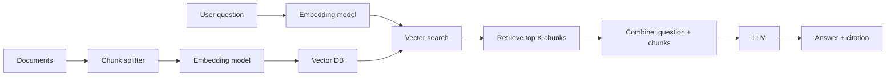
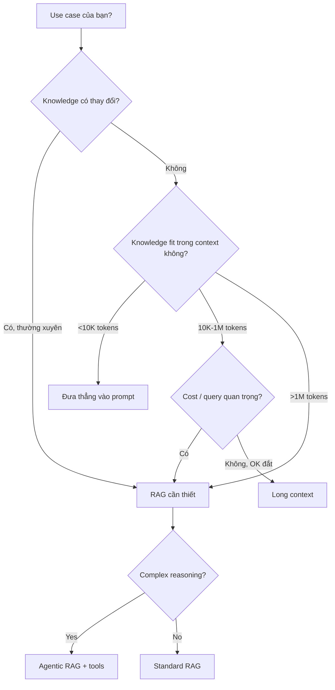

# RAG là gì và cách hoạt động

::: tip Cập nhật 5/2026
- **Context window 1M+ token** giờ phổ biến (Gemini 2.5 Pro, Claude 3.5+) — nhưng RAG vẫn cần thiết
- **Hybrid search** (dense + sparse) standard cho production
- **Reranker** giờ là must-have (Cohere Rerank 3, Jina, BGE)
- **Multi-modal RAG** breakthrough — text + image cùng knowledge base
- **Agentic RAG** thay RAG truyền thống cho complex query
- **GraphRAG** (Microsoft, 2024) — RAG dựa knowledge graph
- **VN context**: tiếng Việt embedding với Qwen 3, Cohere v4 đã rất tốt
:::

Cùng sự phổ biến của LLM, doanh nghiệp đối mặt 1 vấn đề thực: làm sao để model trả lời chính xác câu hỏi dựa vào tài liệu nội bộ, data real-time hay knowledge chuyên môn? Vì train data của model có giới hạn và lỗi thời, không cover được business knowledge đặc thù của doanh nghiệp và thông tin liên tục cập nhật.

1 cách trực quan: vì context window của model đang mở rộng, từ 8K, 128K đến vượt 1M token, sao không nhồi thẳng tài liệu liên quan vào prompt, để model gen answer dựa vào?

Nhưng, **xử lý được long context** và **có thể deliver câu trả lời đúng ổn định, hiệu quả, kiểm soát được trong scenario enterprise** là 2 việc hoàn toàn khác. Phụ thuộc mù long context dẫn đến: cost tăng vọt, attention phân tán, knowledge update lag.

Để giải các pain point này, công nghệ **Retrieval-Augmented Generation (RAG)** ra đời. RAG cho LLM retrieve external knowledge chính xác trước khi gen answer. So với việc đơn giản mở rộng context length, nó cost thấp hơn, chính xác cao hơn, control mạnh hơn — đáp ứng yêu cầu khắt khe của ứng dụng enterprise về độ chính xác facts và knowledge tươi mới. RAG thành nền tảng key build trustworthy AI app.

# Bạn sẽ học

- Giá trị core của RAG: hiểu sâu cách nó giải các pain point core của long context về cost, attention, knowledge update
- Nguyên lý hoạt động: qua case cụ thể xem cách hoàn thành closed loop từ retrieval tới generation
- Lịch sử tiến hoá technical: từ Naive RAG cơ bản đến Advanced RAG đến Modular RAG
- Chọn model RAG: nắm chiến lược đánh giá và chọn 3 model key Embedding, Rerank và LLM
- Thực hành enterprise RAG: học guide build end-to-end từ tiền xử lý data tới đánh giá go-live
- Đánh giá và tuning hiệu quả: hiểu chỉ số đánh giá core, framework mainstream và phương pháp continuous optimization
- Trend RAG: explore hướng tương lai kết hợp với Agent, multi-modal...

# Bạn sẽ thu được

Sau tutorial này, bạn sẽ build được hiểu hệ thống RAG cấp introductory, không chỉ biết "là gì" mà còn biết "tại sao". Bạn có blueprint rõ ràng, biết cách đánh giá, chọn model, design 1 hệ thống RAG hiệu quả, đáng tin, control được đáp ứng yêu cầu enterprise — nền tảng vững chắc để dev app RAG enterprise thật.

# 1. Tại sao cần RAG

**Retrieval-Augmented Generation (RAG)** là 1 trong các technical approach quan trọng nhất trong generative AI hiện tại. Ý tưởng cơ bản: trước khi LLM gen answer, retrieve thông tin liên quan câu hỏi từ knowledge base external, rồi đưa kết quả retrieve cùng câu hỏi cho model, để model trả lời dựa tài liệu thực. Knowledge base external có thể là tài liệu quy định + flow nội bộ doanh nghiệp, knowledge base sản phẩm, hoặc database ngành, regulation library...

Nhưng câu hỏi: vì LLM đã "trả lời trực tiếp" được, sao cần thêm tầng "retrieval-augmented generation"? Đặc biệt giờ context window LLM ngày càng lớn, cứ đưa hết tài liệu liên quan cho model là solve most need?

Khác biệt thực: **"đưa được 1 câu trả lời"** và **"trong môi trường business thật, liên tục, ổn định, control được, đưa câu trả lời đúng"** là 2 việc hoàn toàn khác. Nếu chỉ dựa "memory" trong parameter model, hoặc nhồi tài liệu vào long context, trong ứng dụng enterprise thật vẫn lộ ít nhất 3 loại vấn đề điển hình:

## 1.1 Vấn đề cost và efficiency

Dù context LLM mở rộng, cách "nhồi tất cả tài liệu vào" trong ứng dụng thật vẫn không khả thi. Mâu thuẫn core ở 2 điểm:

1. **Cost inference correlated với context length**: context càng dài, cost inference tăng tuyến tính, thậm chí siêu tuyến tính. 1 call với 8K Token vs 200K Token có price và response latency hoàn toàn khác cấp.

2. **Lãng phí compute resource**: hầu hết task chỉ cần ít info high relevance. Nhồi full document vào context = compute idle nặng, giảm throughput, kéo response chậm, ảnh hưởng UX.

## 1.2 Vấn đề attention và focus

LLM có thể "cover" long context, nhưng không thể tận dụng đều mọi đoạn info. Khi context đạt threshold nhất định, model có "attention bias" rõ:

1. **Attention decay**: model giảm focus với info ở đầu, giữa context, có xu hướng dựa text vừa đọc ở cuối → key info đầu bị "ignored"
2. **Information interference**: model dễ bị "lệch" bởi info không liên quan, lặp, conflict → reply có thể logic-sound nhưng off-topic, độ chính xác khó đảm bảo

Nếu thiếu retrieval filter và relevance ranking, context càng dài càng khó đảm bảo answer focus vào evidence key thật.

## 1.3 Vấn đề knowledge update và controllability

Nếu lưu hết knowledge trong parameter model, hoặc copy tay vào prompt, có 2 khiếm khuyết natural khó tránh:

1. **Knowledge update khó**: 1 khi knowledge thay đổi (policy adjust, product iterate, price update), cần re-train hoặc fine-tune — invest cao, cycle dài; hoặc maintain template prompt tay — cost cao, lỗi nhân tạo
2. **Traceability kém**: model dựa vào info cụ thể nào để answer? Khó tìm core evidence từ "parameter blackbox" hoặc prompt dài. Compliance audit, risk explanation cần "decision basis" rõ → khó thao tác

Trong các ràng buộc thực tế này, ưu thế RAG càng rõ. Cách core: trước khi model gen answer, qua retrieval định vị info liên quan, đáng tin chính xác, để model chỉ dựa knowledge cần thiết gen reply. Knowledge có thể lưu độc lập ở knowledge base external, tiện update và quản lý. Đồng thời, result gen có thể kèm citation source, tăng explainability và trustworthiness. Dù context window LLM tiếp tục mở rộng, RAG vẫn đạt management và utilization knowledge hiệu quả với cost thấp, support hệ knowledge enterprise quan sát process, track behavior được.

Từ góc business, so với LLM truyền thống chỉ dựa parameter, RAG chủ yếu solve các vấn đề thực:

1. **Timeliness**: model truyền thống thường không biết regulation mới, sản phẩm mới sau 2024. RAG đọc trực tiếp tài liệu mới nhất, sync với business mới nhất, không cần re-train
2. **Specialization**: LLM tổng quát thường "hiểu không sâu, nói không chuẩn" trong domain vertical như y tế, hoá chất, finance. Sau tích hợp tài liệu chuyên môn doanh nghiệp và industry standard, reply gần thực hơn
3. **Hallucination**: bằng yêu cầu answer dựa fragment retrieve được, kèm citation source, giảm xác suất bịa
4. **Explainable và auditable**: model thuần parameter thường khó answer "đây từ regulation nào?". RAG cho mỗi answer trace back tới điều khoản cụ thể, document, case lịch sử
5. **Cost compute và efficiency**: nhồi knowledge vào parameter = model lớn, cost inference cao. RAG "retrieve on demand" giúp dùng model nhỏ hơn, cost thấp hơn, vẫn chính xác

Vì vậy, với doanh nghiệp muốn dùng LLM dài hạn, ổn định, controlled trong scenario business thật, **RAG không phải option có hay không, mà là technology nền tảng gần như không thể thiếu** khi build hệ knowledge enterprise chất lượng cao.

# 2. RAG là gì

**RAG (Retrieval-Augmented Generation)** core idea: cho LLM khi answer câu hỏi, không chỉ dựa static knowledge học ở train phase, mà còn real-time call info mới nhất, đáng tin từ knowledge base external.

Trong hệ RAG điển hình, câu hỏi user không trực tiếp đưa cho LLM, mà:
1. Module retrieval tìm fragment relevant nhất từ knowledge base
2. Combine fragment với prompt gốc thành context đầy đủ
3. Input cho LLM gen answer

Cách "retrieve trước, gen sau" này giúp model reasoning dựa tài liệu reference thật, không chỉ "memory" trong parameter.

## Workflow RAG điển hình



### Indexing phase (offline)

System xử lý tài liệu nội bộ doanh nghiệp, paper, report... chia thành fragment semantic (chunks), dùng vector model tạo vector representation cho mỗi fragment và build index. Sau khi nhận câu hỏi user, có thể nhanh tìm "fragment semantic gần nhất" trong vector space:

1. Document chia thành chunks (1 chunk = 1 đoạn news, 1 đoạn explain, 1 đoạn analysis)
2. Mỗi chunk qua embedding model → high-dimensional vector → lưu vào vector index
3. Index support retrieve dựa similarity sau

### Retrieval + generation phase (online)

User hỏi → system retrieve content liên quan từ index → đưa cùng câu hỏi + text retrieve cho LLM gen answer.

**Ví dụ**: user hỏi "Sự kiện Sam Altman bị OpenAI sa thải rồi rehire trong 3 ngày, bạn nghĩ sao?"

1. **Input – Query**: text câu hỏi của user
2. **Vector search**: tìm 3 chunks news/analysis liên quan trong vector DB
3. **Relevant Documents**: 3 chunks về drama OpenAI
4. **Combined Prompt**: "Câu hỏi: ... Hãy trả lời dựa thông tin: Chunk 1, Chunk 2, Chunk 3..."
5. **LLM Generate**: model dựa info gen answer chi tiết, có insight

**Không có RAG**: model nói "tôi không có info sau training cutoff..."
**Có RAG**: model phân tích sâu dựa news mới nhất

# 3. RAG hoạt động thế nào

## 3.1 Document vectorization phase

**Bước 1: chunk document**

Document dài cần chia thành chunk nhỏ semantic-complete. Strategy phổ biến:

- **Fixed size**: cắt theo số token (vd 512 token/chunk), overlap 50-100 token
- **Semantic**: cắt theo paragraph, heading
- **Recursive**: thử theo separator rank (paragraph → sentence → word)
- **Semantic chunking**: dùng embedding similarity để boundary giữa chunks (latest 2024+)

**Bước 2: embedding**

Mỗi chunk → high-dimensional vector qua embedding model:

```python
from sentence_transformers import SentenceTransformer

model = SentenceTransformer('Qwen/Qwen3-Embedding-0.6B')
chunks = ["Apple công ty được founded năm 1976", "Steve Jobs là founder Apple"]
embeddings = model.encode(chunks)  # [n_chunks, embedding_dim]
```

**Bước 3: store trong vector DB**

```python
import chromadb

client = chromadb.Client()
collection = client.create_collection("my_kb")
collection.add(
    documents=chunks,
    embeddings=embeddings.tolist(),
    metadatas=[{"source": "wiki/apple"}, {"source": "wiki/steve_jobs"}],
    ids=["chunk_1", "chunk_2"]
)
```

## 3.2 User query, retrieve và reply phase

**Bước 1: vectorize query**

```python
query = "Apple công ty được thành lập khi nào?"
query_vector = model.encode([query])
```

**Bước 2: similarity search**

```python
results = collection.query(
    query_embeddings=query_vector.tolist(),
    n_results=3
)
# Lấy top 3 chunks similarity cao nhất
```

**Bước 3: build prompt và gen**

```python
context = "\n\n".join(results['documents'][0])
prompt = f"""Dựa thông tin sau, trả lời câu hỏi.

Thông tin:
{context}

Câu hỏi: {query}

Trả lời:"""

answer = llm.generate(prompt)
```

### Ví dụ query 1: "Apple công ty được founded khi nào?"

Top 3 chunks retrieve có chunk "Apple được founded 1976" → similarity score 0.95. LLM gen: "Apple Inc. được founded ngày 1/4/1976 bởi Steve Jobs, Steve Wozniak và Ronald Wayne."

### Ví dụ query 2: "Ăn apple có lợi ích gì?"

Top 3 chunks về "apple fruit nutrition", về company Apple Inc. có similarity thấp → không retrieve. LLM dựa chunks về fruit gen: "Apple chứa fiber, vitamin C, antioxidant..."

### Ví dụ query 3: "Hôm nay thời tiết thế nào?"

Không chunk nào relevant → tất cả similarity score thấp. LLM aware này, reply: "Tôi không có info về thời tiết hôm nay trong knowledge base."

# 4. Lịch sử tiến hoá RAG

## 4.1 Gen 1: Naive RAG (basic retrieval-augmented)

Workflow đơn giản:
```
Query → Embedding → Vector search → Top K chunks → LLM → Answer
```

**Strength**: implement đơn giản, baseline tốt
**Weakness**: 
- Chunk fix size không semantic
- Embedding model trung bình
- Không filter noise
- 1 vòng retrieve (không refine)
- Không xử lý multi-hop question

## 4.2 Gen 2: Advanced RAG (precision retrieval + context optimization)

Add nhiều optimization step:

**Pre-retrieval**:
- **Query rewriting**: LLM rewrite query rõ hơn trước search
- **Query expansion**: gen multiple paraphrase, search cả
- **HyDE** (Hypothetical Document Embedding): LLM gen 1 "hypothetical answer", search dùng embedding answer đó (thường gần document hơn query)

**Retrieval**:
- **Hybrid search**: dense (semantic) + sparse (keyword BM25)
- **Parent-child retrieval**: retrieve chunk con nhưng inject parent context
- **Reranking**: rerank top 20 → top 5 với reranker model

**Post-retrieval**:
- **Compress context**: LLM nhỏ tóm tắt chunks trước đưa LLM lớn
- **Filter noise**: remove chunks không liên quan dù similarity cao

## 4.3 Gen 3: Modular RAG

Module-hoá pipeline, các module có thể swap/combine:

- **Search module**: keyword, dense, hybrid, knowledge graph
- **Memory module**: chat history, user preference
- **Fusion module**: merge multiple search result
- **Routing module**: route query tới sub-RAG khác nhau
- **Predict module**: gen multi-step plan
- **Task adapter**: adapt cho task khác (QA, summarization, dialog)

**Pattern phổ biến**:
- **Self-RAG**: model tự quyết khi nào retrieve, evaluate quality output
- **Corrective RAG**: nếu retrieve kém, fallback web search
- **Adaptive RAG**: chọn complexity pipeline theo query
- **Agentic RAG**: agent có nhiều tool, quyết retrieve hay không

# 5. Từ Demo tới RAG enterprise-grade

## 5.1 Chọn model

### 5.1.1 Embedding model

Trách nhiệm: convert text → vector. Quyết định chất lượng retrieval.

**Tiêu chí chọn**:
- **Vietnamese support**: model nào hiểu tiếng Việt tốt
- **Dimension**: 384-1536 typical (cao hơn = chính xác hơn nhưng tốn storage)
- **Max sequence length**: 512-8192 token
- **Cost**: per token nếu API, free nếu open-source local

**Khuyến nghị 2026 cho tiếng Việt**:

| Model | Provider | Dim | VN quality | Cost |
|---|---|---|---|---|
| **Qwen3-Embedding** (0.6B/4B/8B) | Alibaba (open) | 1024 | ⭐⭐⭐⭐⭐ | Free local |
| **Cohere Embed v4** | Cohere | 1024 | ⭐⭐⭐⭐⭐ | $0.10/M token |
| **Voyage 3** | Voyage AI | 1024 | ⭐⭐⭐⭐ | $0.10/M |
| **OpenAI text-embedding-3-large** | OpenAI | 3072 | ⭐⭐⭐⭐ | $0.13/M |
| **BGE-M3** | BAAI (open) | 1024 | ⭐⭐⭐⭐ | Free local |
| **Sentence-Transformers Vietnamese** | Community | 768 | ⭐⭐⭐ | Free |

### 5.1.2 Rerank model

Trách nhiệm: rerank top K retrieve theo relevance thật. **Bump precision đáng kể**.

| Model | Strength |
|---|---|
| **Cohere Rerank 3** | Best overall, multilingual |
| **Jina Reranker v2** | Open source, good Vietnamese |
| **BGE Reranker v2** | Free, decent |
| **MS MARCO** | Lightweight |

### 5.1.3 LLM

| Model | Best for |
|---|---|
| **Claude Sonnet 5** | Production quality, long context |
| **GPT-4o** | Multi-modal, function calling |
| **Gemini 2.5 Pro** | Long context 2M+ token |
| **Qwen2.5 / Llama 3.3** | Self-host, free, decent VN |
| **DeepSeek V3** | Free tier rộng, code-focused |

**Tiếng Việt**: Claude Sonnet 5 và Gemini 2.5 Pro hiểu tiếng Việt tốt nhất hiện tại.

## 5.2 Framework run

| Framework | Best for | Setup |
|---|---|---|
| **LangChain** | Mature, big community, flexible | Complex setup |
| **LlamaIndex** | Document Q&A focused | Easier than LangChain |
| **Haystack** | Production-ready, modular | Enterprise-grade |
| **Dify** | Visual, no-code | Web UI |
| **RAGFlow** | Production RAG đầu tư | Self-host, mature |
| **DSPy** | Programmatic, optimizable | Cho researcher |

## 5.3 Evaluate effect

### 5.3.1 Introductory example: evaluate RAG bằng LLM

```python
def evaluate_answer(query, answer, ground_truth, llm):
    eval_prompt = f"""
    Câu hỏi: {query}
    Đáp án mong đợi: {ground_truth}
    Đáp án thực tế: {answer}
    
    Đánh giá:
    1. Đúng hay sai? (đúng/sai)
    2. Đầy đủ thế nào? (1-10)
    3. Có hallucination không? (có/không)
    
    Output JSON: {{"correct": ..., "completeness": ..., "hallucination": ...}}
    """
    return llm.generate(eval_prompt)
```

### 5.3.2 Chỉ số đánh giá core

| Metric | Đo gì | Range |
|---|---|---|
| **Faithfulness** | Answer có dựa context retrieve không (không hallucinate) | 0-1 |
| **Answer Relevance** | Answer có relevant câu hỏi không | 0-1 |
| **Context Precision** | % chunks retrieve thực sự relevant | 0-1 |
| **Context Recall** | % info cần có trong context | 0-1 |
| **Answer Correctness** | Đúng vs ground truth | 0-1 |
| **Latency** | Response time | ms |
| **Cost per query** | Cost token + infra | $ |

### 5.3.3 Framework đánh giá

- **RAGAs**: Python lib, dễ dùng nhất
- **DeepEval**: pytest-style, integrate CI/CD
- **TruLens**: tracing + eval
- **Promptfoo**: YAML config, A/B test

```python
# RAGAs example
from ragas import evaluate
from ragas.metrics import faithfulness, answer_relevancy, context_precision

result = evaluate(
    dataset=test_dataset,
    metrics=[faithfulness, answer_relevancy, context_precision]
)
print(result)
```

### 5.3.4 Benchmark đánh giá

- **MS MARCO**: passage retrieval
- **Natural Questions**: open-domain QA
- **HotpotQA**: multi-hop QA
- **VietnameseSQuAD**: Vietnamese reading comprehension
- **ZaloAI QA**: VN community benchmark

# 6. Nghiên cứu sâu: học từ contest và open source

## 6.1 Semantic cache: optimize high-frequency query

Pattern: cache không phải text exact match mà semantic similarity. Query "Apple founded khi nào" và "khi nào Apple được thành lập" → hit cùng cache entry.

Tool: **GPTCache**, **Redis Vector Cache**.

## 6.2 Unstructured data processing

Document enterprise đa format: PDF, Word, Excel, HTML, scan image. Cần parser thống nhất:

- **Unstructured.io**: open source, hỗ trợ 30+ format
- **LlamaParse**: paid, accuracy cao cho table/chart
- **Docling** (IBM, 2024): mới ra, fast và accurate
- **Marker**: PDF → markdown chất lượng cao

## 6.3 Enterprise document QA: precise + traceable

Best practice:
- **Page-level chunking** giữ context layout
- **Hierarchical metadata**: file → chapter → section → chunk
- **Citation inline**: answer kèm [1], [2] với link tới source
- **Confidence score**: chỉ trả lời nếu confidence > threshold
- **Fallback**: "Không tìm thấy thông tin trong knowledge base" thay vì hallucinate

## 6.4 AIOps scenario: xử lý multi-modal data

Server log + chart + alert text. RAG cần:
- Embed log + chart cùng space
- Time-aware retrieval (log gần đây weight cao hơn)
- Aggregate multiple data source

## 6.5 Multi-source data fusion: structured + unstructured

E.g. RAG cho e-commerce CSKH:
- **Structured**: order DB (id, status, tracking)
- **Unstructured**: FAQ, policy doc, chat history

Pattern: structured trả về exact match, unstructured rerank theo semantic.

# 7. Wide exploration: tương lai RAG

## 7.1 GraphRAG: relationship network reshape deep retrieval

Microsoft Research, 2024. Build knowledge graph từ document → retrieve dựa graph traversal.

**Advantage**:
- Multi-hop reasoning ("X làm việc tại công ty Y, Y do Z founded → liên hệ X-Z")
- Theme/cluster understanding
- "Global summary" question (e.g. "Topic chính trong dataset là gì?")

**Tool**: Microsoft GraphRAG, Neo4j + LangChain.

## 7.2 Multimodal RAG

Knowledge base text + image + audio cùng vector space.

**Use case**: 
- Search "biểu đồ tăng trưởng Q4" → return chart từ PDF
- Voice query → audio + transcript

**Tool**: CLIP embedding, ColPali (image understanding).

## 7.3 Late Chunking: giữ full context cho long document

Idea: embed full document trước, chunk sau (vs chunk trước, embed sau).

Bảo vệ context dài hơn, semantic richer.

## 7.4 Từ RAG tới RAG-in-Agent era

Future: RAG không còn standalone, mà là 1 tool trong Agent.

```
User → Agent
        ├─ Tool: web search
        ├─ Tool: RAG knowledge base
        ├─ Tool: SQL query
        └─ Tool: code interpreter
```

Agent quyết khi nào dùng tool nào, multi-step reasoning.

Pattern: **Self-RAG**, **Adaptive RAG**, **Multi-agent RAG**.

# 8. Tổng kết

RAG = retrieve external knowledge + generate answer. Giải pain point:
- Knowledge update tươi mới
- Cost compute thấp
- Explainable, auditable
- Reduce hallucination

3 generation:
1. **Naive RAG**: chunks + dense search + LLM
2. **Advanced RAG**: + hybrid + rerank + query rewrite + post-process
3. **Modular RAG**: pipeline composable, adaptive

Enterprise checklist:
- ✅ Document parsing chính xác
- ✅ Chunking strategy phù hợp
- ✅ Embedding model VN-friendly
- ✅ Hybrid search + rerank
- ✅ Prompt engineering với citation
- ✅ Evaluation framework
- ✅ Monitoring + iterate

2026 trend:
- Long context không thay RAG (cost, control)
- Hybrid search + rerank thành standard
- GraphRAG cho complex query
- Multimodal RAG cho image-heavy domain
- Agentic RAG cho autonomous workflow

# References

- [Retrieval-Augmented Generation for Large Language Models: A Survey](https://arxiv.org/abs/2312.10997)
- [Microsoft GraphRAG paper](https://arxiv.org/abs/2404.16130)
- [RAGAs evaluation framework](https://github.com/explodinggradients/ragas)
- [LangChain RAG cookbook](https://python.langchain.com/docs/use_cases/question_answering/)
- [LlamaIndex documentation](https://docs.llamaindex.ai/)

---

# Phụ lục: RAG 2026 cho VN

## A. Stack đề xuất cho VN

```
Document parser: Docling (IBM) + Unstructured.io
Chunking: Semantic chunking với LangChain
Embedding: Qwen3-Embedding-4B (free, VN tốt) hoặc Cohere Embed v4 (paid, best)
Vector DB: Qdrant (self-host) hoặc Pinecone (managed)
Reranker: Cohere Rerank 3 hoặc BGE Reranker v2
LLM: Claude Sonnet 5 (production) hoặc Qwen2.5 (self-host)
Framework: LlamaIndex hoặc LangChain
Evaluation: RAGAs
Monitoring: Langfuse self-host
```

## B. Tips tiếng Việt

1. **Hybrid search cực quan trọng** vì tiếng Việt có Hán-Việt + đồng nghĩa nhiều
2. **Đừng dùng OpenAI ada-002** cho tiếng Việt — quá cũ
3. **Test với query thật user**, không chỉ benchmark academic
4. **Normalize text**: remove dấu trùng, lowercase tuỳ context
5. **Vietnamese tokenizer**: ưu tiên model hiểu word boundary tiếng Việt

## C. Use case RAG cho VN business

| Industry | RAG use case |
|---|---|
| **E-commerce** | Product Q&A, return policy, size guide |
| **Banking** | Product detail, fee schedule, regulation |
| **Insurance** | Policy term, claim process, coverage detail |
| **Legal** | Legal precedent, regulation lookup |
| **Healthcare** | Patient info, treatment protocol, drug info |
| **Manufacturing** | Equipment manual, troubleshooting, SOP |
| **Edu** | Course material, textbook Q&A |
| **Customer support** | FAQ, ticket history |

## D. Cost estimation

Cho 10,000 query/ngày:
- **Embedding** (Qwen3 local): $0
- **Vector DB** (Qdrant on $20 VPS): $20/tháng
- **LLM** (Claude Sonnet 5, avg 2K context): ~$50-200/tháng
- **Reranker** (Cohere): ~$10-30/tháng
- **Total**: ~$80-250/tháng

Vs no-RAG with long context: $500-2000/tháng for same quality.

## E. Pitfall thường gặp

1. **Chunk quá nhỏ** → mất context, miss multi-sentence answer
2. **Chunk quá lớn** → noise nhiều, attention dilute
3. **No reranker** → top K có nhiều junk
4. **No metadata** → không filter được (theo date, source, author)
5. **No evaluation** → không biết tốt/xấu
6. **One-size-fits-all**: 1 pipeline cho mọi query type
7. **Ignore freshness**: knowledge base outdated nhưng vẫn dùng

## F. Decision tree: khi nào dùng RAG vs alternative



## Sources

- [Anthropic: Contextual Retrieval](https://www.anthropic.com/news/contextual-retrieval)
- [Cohere: Best embeddings 2026](https://cohere.com/blog/embeddings)
- [LangChain documentation](https://python.langchain.com/)
- [Microsoft GraphRAG](https://microsoft.github.io/graphrag/)
- [DeepLearning.AI RAG courses](https://learn.deeplearning.ai/)
