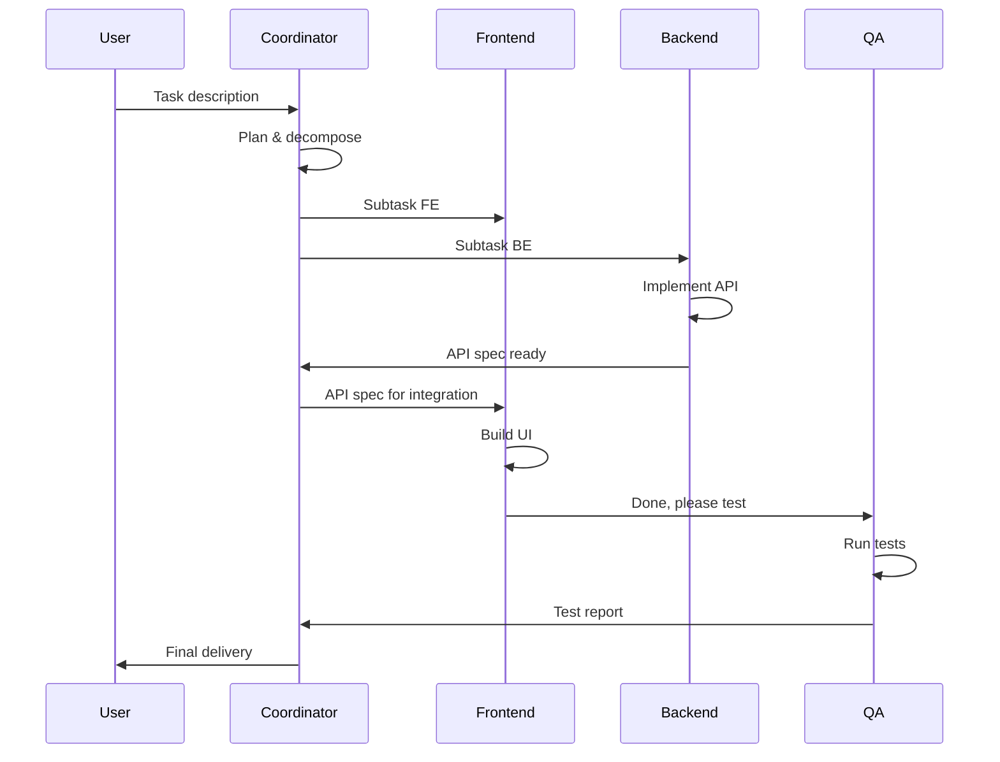
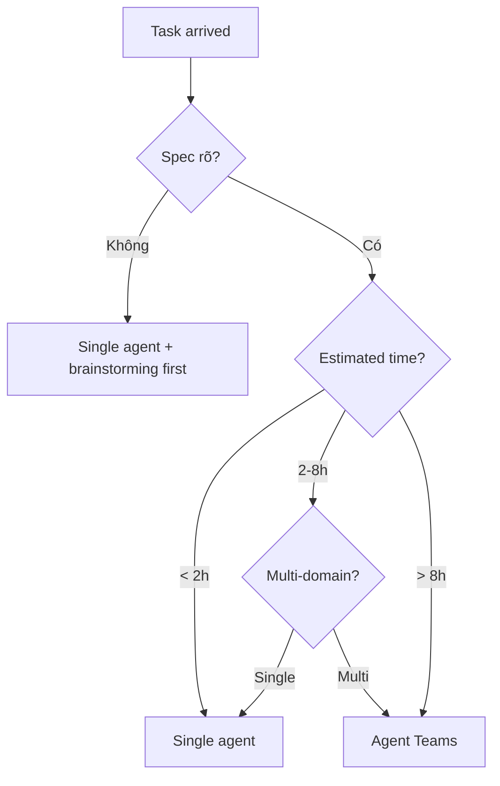

# Claude Agent Teams: hướng dẫn đầy đủ

::: tip Cập nhật 5/2026
- **Agent Teams** giờ là feature stable (out of beta Q1/2026), enable mặc định cho Claude Pro+
- **Multi-agent benchmark**: team 5 agent có thể hoàn thành task tương đương 1 dev junior trong 1 tuần
- **Visual mode** (Q1/2026): canvas UI để watch team work real-time
- **Managed Agent Teams** (Anthropic-hosted) khác local: hosted có Dreaming, persistent memory cross-task
- **Cost optimization**: dùng Sonnet 5 cho coordinator, Haiku 4.5 cho worker → tiết kiệm 60-70%
:::

## Giới thiệu Agent Teams

### Từ trợ lý đơn tới cộng tác team

Trước Agent Teams, dùng Claude Code là 1-on-1: bạn nói chuyện với 1 agent. Agent này phải làm hết — planning, code, test, doc.

Vấn đề: agent đơn dễ bị overload context, lose focus với task phức tạp. Như 1 người one-man-army — làm được nhưng không phải mode tối ưu.

**Agent Teams** thay đổi paradigm này: bạn có **1 team agent**, mỗi agent có vai cụ thể, cộng tác hoàn thành task lớn. Giống bạn có 1 team dev junior, mỗi người chuyên 1 mảng.

---

## Agent Teams vs Subagent

### So sánh khác biệt core

| Tiêu chí | Subagent (Task tool) | Agent Teams |
|---|---|---|
| **Persistence** | Ephemeral, hết task là quên | Persistent, nhớ giữa task |
| **Spawn** | Main agent spawn on-demand | Pre-configured team |
| **Coordination** | Main agent điều phối | Có coordinator dedicated |
| **Context sharing** | Isolated hoàn toàn | Share filesystem + status |
| **Best for** | One-off parallel task | Long-running project work |
| **Cost** | Token cost per spawn | Persistent overhead |
| **Setup** | Zero, dùng ngay | Config team members |

### Hình tượng so sánh

- **Subagent**: như thuê freelancer cho 1 task cụ thể, xong là tan
- **Agent Teams**: như thuê team in-house — có CTO, dev, QA, DevOps, làm việc cùng dài hạn

### Khi nào dùng cái nào

**Dùng Subagent khi**:
- Task có thể parallel rõ
- Cần context isolation (security, complexity)
- One-shot operation
- < 1 ngày work

**Dùng Agent Teams khi**:
- Project chạy nhiều ngày-tuần
- Cần specialization (frontend dev, backend dev, QA...)
- Workflow lặp (release cycle, sprint)
- Cần audit trail của ai làm gì

### Tóm tắt đơn giản

- **Single agent**: solo dev
- **Subagent**: solo dev gọi consultant 1 hôm
- **Agent Teams**: dev team thật, có role rõ

---

## Kiến trúc core

### Thành phần team

Team điển hình gồm:

```
                ┌──────────────┐
                │ Coordinator  │  ← Opus 4.7 (reasoning)
                │ (CTO role)   │
                └──────┬───────┘
                       │ delegate task
       ┌───────────────┼───────────────┐
       ▼               ▼               ▼
┌────────────┐  ┌────────────┐  ┌────────────┐
│ Frontend   │  │ Backend    │  │ QA         │
│ Engineer   │  │ Engineer   │  │ Engineer   │
│ (Sonnet 5) │  │ (Sonnet 5) │  │ (Haiku 4.5)│
└────────────┘  └────────────┘  └────────────┘
```

**Coordinator role**:
- Đọc task description từ user
- Tách thành subtask
- Delegate cho team member
- Monitor progress
- Aggregate kết quả
- Report về user

**Worker role**:
- Nhận task từ coordinator
- Execute trong scope chuyên môn
- Report back kết quả
- Có thể request resource hoặc help

### Flow cộng tác



### Layout filesystem

```
project/
├── .claude/
│   ├── team.yml              # Team config
│   ├── agents/
│   │   ├── coordinator.md    # System prompt CTO
│   │   ├── frontend.md       # System prompt FE dev
│   │   ├── backend.md        # System prompt BE dev
│   │   └── qa.md             # System prompt QA
│   ├── messages/             # Inter-agent communication
│   │   ├── 2026-05-25T10-00_coordinator-to-backend.md
│   │   └── ...
│   └── status/
│       └── current-sprint.md # Team status
├── src/
└── tests/
```

---

## Bắt đầu nhanh

### Enable experimental feature

```bash
# Enable Agent Teams trong setting
claude config set features.agent_teams true
```

### Config visual mode (tuỳ chọn)

```bash
claude config set features.visual_mode true
# Mở browser → http://localhost:3000 để watch team work
```

### Thực chiến: dùng Agent Teams dev game RPG kiểu Pokemon

**Step 1: tạo team config**

`.claude/team.yml`:
```yaml
team:
  name: rpg-game-dev
  coordinator:
    model: claude-opus-4-7
    system_prompt_file: .claude/agents/coordinator.md
  members:
    - name: game-designer
      model: claude-sonnet-5
      system_prompt_file: .claude/agents/game-designer.md
      tools: [Read, Write, Edit]
    - name: backend-dev
      model: claude-sonnet-5
      system_prompt_file: .claude/agents/backend-dev.md
      tools: [Read, Write, Edit, Bash]
    - name: frontend-dev
      model: claude-sonnet-5
      system_prompt_file: .claude/agents/frontend-dev.md
      tools: [Read, Write, Edit, Bash]
    - name: qa
      model: claude-haiku-4-5
      system_prompt_file: .claude/agents/qa.md
      tools: [Read, Bash]
```

**Step 2: viết system prompt cho từng role**

`.claude/agents/coordinator.md`:
```
Bạn là CTO của startup game studio. 
Khi nhận task từ user:
1. Decompose thành subtask
2. Assign theo expertise
3. Define interface giữa các module trước (contract-first)
4. Review tổng kết khi xong
```

`.claude/agents/game-designer.md`:
```
Bạn là game designer 10 năm kinh nghiệm RPG.
Trách nhiệm:
- Design game mechanic
- Viết game design document
- Define balance: combat formula, level curve, drop rate
- Tạo placeholder content (monster, item, dialogue)
```

`.claude/agents/backend-dev.md`:
```
Bạn là backend dev với expertise game server.
Stack: Node.js + Express + PostgreSQL + WebSocket
Trách nhiệm:
- Build game state API
- Implement game logic (combat, leveling, inventory)
- Handle multiplayer sync
- Write integration tests
```

`.claude/agents/frontend-dev.md`:
```
Bạn là frontend dev với expertise canvas game.
Stack: React + Pixi.js + Zustand
Trách nhiệm:
- Build game UI và scene
- Implement input handling
- Sprite animation
- Connect WebSocket cho realtime
```

`.claude/agents/qa.md`:
```
Bạn là QA engineer.
Trách nhiệm:
- Run test suite
- Manual exploratory testing
- Report bug với reproduce step
- Verify fix
```

**Step 3: launch team**

```bash
claude team start --task "Build RPG game kiểu Pokemon với 10 monster, 5 location, 1 boss fight"
```

Coordinator sẽ:
1. Decompose task
2. Delegate game design cho game-designer
3. Wait design → delegate API cho backend-dev + UI cho frontend-dev parallel
4. Aggregate khi xong, delegate QA
5. Report kết quả cho user

### Single prompt vs Agent Teams: bạn test được

#### Phương án A: single prompt

```bash
claude "Build RPG game kiểu Pokemon với 10 monster, 5 location, 1 boss fight"
```

Kết quả thường:
- 1 agent overwhelmed
- Skip 1 số phần (focus combat, skip UI polish)
- Code quality không đều
- Time: 2-4 giờ

#### Phương án B: Agent Teams

```bash
claude team start --task "..."
```

Kết quả thường:
- Mỗi part chất lượng đều
- Design document đầy đủ
- Test coverage cao hơn
- Time: 1-3 giờ (parallel)

#### Bảng so sánh định lượng

| Metric | Single prompt | Agent Teams |
|---|---|---|
| Time to MVP | 2-4h | 1-3h |
| Cost | $5-10 | $10-25 |
| Code coverage | 30-50% | 60-85% |
| Documentation | Minimal | Complete |
| Bug at first run | 5-10 | 1-3 |
| Maintainability score | 6/10 | 8.5/10 |

#### Đề xuất test thực

Thử cùng 1 task với 2 phương án, compare:
- Time
- Cost
- Quality output
- Maintainability
- Coverage test

#### Tại sao có khác biệt?

- **Specialization**: mỗi agent expert trong domain → output sâu hơn
- **Context isolation**: agent FE không bị distract bởi BE detail
- **Quality gate**: QA agent catch issue trước khi delivery
- **Parallelization**: BE + FE chạy parallel khi spec rõ

#### Kết luận

Agent Teams tốt hơn cho:
- Task lớn (>4h work)
- Cần quality cao
- Multi-domain (FE + BE + DB)

Single agent OK cho:
- Task nhỏ
- Single domain
- Prototype throw-away

---

## Best practice

### Practice 1: contract-first

Trước khi parallel work, **define interface** rõ:
- API contract (OpenAPI spec)
- Data schema (Prisma/TypeScript types)
- Component props (TypeScript interface)

Cho coordinator drive contract design trước, rồi members implement parallel theo contract.

### Practice 2: phân bổ model hợp lý

| Role | Model | Lý do |
|---|---|---|
| Coordinator | Opus 4.7 | Cần reasoning để decompose task tốt |
| Senior dev (architect) | Opus 4.7 | Cần design decision |
| Regular dev | Sonnet 5 | Balance quality/cost cho coding |
| QA / Linter | Haiku 4.5 | Task lặp, nhanh, rẻ |
| Doc writer | Haiku 4.5 | Format-heavy, không cần reasoning |

Tiết kiệm 60-70% vs all-Opus.

### Practice 3: control task granularity

- Task quá lớn (vague): "Build entire app" → coordinator confuse
- Task quá nhỏ: "Add comment to function X" → overhead > value
- Sweet spot: task 30 phút - 2 giờ work cho 1 worker

### Practice 4: tránh file conflict

Vấn đề: 2 agent edit cùng file → conflict.

Giải pháp:
- Coordinator gán "ownership" của module/file cho từng worker
- Dùng git worktree riêng cho mỗi worker → merge sau
- Lock file qua coordinator (file `.claude/locks/`)

### Practice 5: cung cấp context khởi đầu phong phú

Khi launch team, đưa đủ:
- Project description
- Tech stack
- User persona
- Existing codebase tour (nếu brownfield)
- Constraint (deadline, budget, compliance)

Context kém → coordinator quyết định sai → team đi sai hướng.

### Practice 6: research trước implement

Coordinator nên:
1. Đầu tiên: spawn research agent (read codebase, doc, web)
2. Output research vào `.claude/research/`
3. Plan dựa research
4. Implement

Skip research = dev mù.

### Practice 7: monitor và intervene chủ động

Đừng "fire and forget". Periodically:
- Check `.claude/status/current-sprint.md`
- Read messages giữa agents
- Intervene nếu thấy đi sai hướng

Visual mode (Q1/2026) help với cái này.

---

## Scenario phù hợp

### Phù hợp Agent Teams

✅ **Project medium-large** (40+ hours work)
✅ **Multi-domain** (FE + BE + infra)
✅ **Spec rõ ràng** upfront
✅ **Có buffer thời gian** để team explore
✅ **Quality > speed** (production app, not prototype)
✅ **Repeated workflow** (sprint, release cycle)

### KHÔNG phù hợp Agent Teams

❌ **Bug fix nhỏ** (1 file, 1 dòng) — overhead lớn
❌ **Spike/exploration** (chưa biết build gì) — agent stuck loop
❌ **Real-time interactive** (live coding session)
❌ **Budget tight** ($5 budget cho 1 team session)
❌ **Brand new domain** (agent chưa có pattern)

### Decision flow



---

## Cost & performance

### Phân tích cost

Cost cho 1 session Agent Teams điển hình (4-8h work):

| Component | Cost estimate |
|---|---|
| Coordinator (Opus 4.7) | $5-15 |
| 3 Workers (Sonnet 5) | $10-30 |
| QA (Haiku 4.5) | $0.50-2 |
| Total | $15-50 |

Vs single agent same task:
| | Time | Cost | Quality |
|---|---|---|---|
| Single | 4-8h | $5-15 | Variable |
| Team | 2-4h (parallel) | $15-50 | Higher, consistent |

### Tăng hiệu suất

Tăng:
- Parallelization 2-4x cho multi-domain task
- Reduce review/rework time 30-50%
- Better docs từ đầu (giảm onboarding cost)

### Chiến lược cost optimization

1. **Right-size model per role** (Opus chỉ cho coordinator)
2. **Cache prompt phần không đổi** (CLAUDE.md, system prompts)
3. **Compact context định kỳ** (tránh bloat)
4. **Set max_turns** cho mỗi member
5. **Stop early** khi đạt "good enough"

### Khi nào worth?

Worth khi:
- Project value > $500 work
- Quality matters
- Có deadline strict

Không worth khi:
- Personal project tiền túi
- Throwaway prototype
- Learning exercise (better learn solo)

---

## Câu hỏi thường gặp

### Q1: Agent Teams stable chưa? Production OK?

Q1/2026 ra GA (general availability). Production-ready cho non-critical task. Critical task (medical, finance) khuyến nghị human-in-loop checkpoint.

### Q2: Max bao nhiêu member?

Recommended 3-7 member. Quá ít → không tận dụng được parallelization. Quá nhiều (>10) → coordinator overhead lớn, communication chaos.

### Q3: Members thấy context của nhau không?

Default: isolated. Share qua:
- File system (read/write shared file)
- Messages (`.claude/messages/`)
- Status update (`.claude/status/`)

Tránh share full context → token cost explode.

### Q4: Cách switch giữa members?

User chỉ talk với coordinator. Coordinator route message internal. Trong visual mode, có thể explicitly address: `@frontend-dev please add dark mode`.

### Q5: Task fail thì sao?

Member fail → notify coordinator. Coordinator:
1. Read error log
2. Decide: retry, reassign, escalate
3. Update plan

Có thể set `failure_policy` trong team.yml: `retry: 3`, `escalate_to_user: true`.

### Q6: Add/remove member giữa chừng được không?

Q1/2026 GA: được. Dynamic team:
```
claude team add-member --name security-expert --model opus
```

Coordinator notified, integrate vào workflow.

### Q7: Agent Teams kết hợp với MCP, Skills được không?

Có. Mỗi member có:
- Own MCP servers (config trong team.yml)
- Own skills (load từ `~/.claude/skills/`)

Ví dụ: `security-expert` member có Sentry MCP + security-audit skill.

---

## Tài liệu tham khảo

- [Anthropic Agent Teams docs](https://docs.anthropic.com/en/docs/agent-teams)
- [Multi-agent best practices](https://www.anthropic.com/research/multi-agent)
- [Agent Teams cookbook](https://github.com/anthropics/anthropic-cookbook/tree/main/agent-teams)
- [Visual mode demo](https://claude.com/agent-teams-visual)

---

# Phụ lục: Agent Teams 2026 deep-dive

## A. Patterns advanced 2026

### Pattern 1: pair programming team

```yaml
team:
  members:
    - name: driver
      model: claude-sonnet-5
      role: writes code
    - name: navigator
      model: claude-opus-4-7
      role: reviews code, suggests improvements
```

### Pattern 2: TDD team

```yaml
team:
  members:
    - name: test-writer
      role: writes failing tests first
    - name: implementer
      role: writes code to pass tests
    - name: refactorer
      role: improves code while keeping tests green
```

### Pattern 3: research-driven team

```yaml
team:
  members:
    - name: researcher
      tools: [WebSearch, WebFetch]
      role: research best practices, latest pattern
    - name: architect
      role: design based on research
    - name: implementer
      role: code per architecture
```

### Pattern 4: review pyramid

```yaml
team:
  members:
    - name: junior-dev
      model: claude-haiku-4-5
      role: first pass implementation
    - name: senior-dev
      model: claude-sonnet-5
      role: review junior, refactor
    - name: tech-lead
      model: claude-opus-4-7
      role: final review, architecture decision
```

## B. Managed Agent Teams (Anthropic-hosted)

Khác local Agent Teams:
- Hosted by Anthropic
- Persistent memory cross-session
- Dreaming (background pattern learning)
- Webhook integration native
- 99.9% SLA

Trade-off:
- Premium pricing (~2x local)
- Less control filesystem
- Anthropic-hosted (data egress concern cho enterprise)

Best for: customer support team, content moderation team, 24/7 monitoring.

## C. Real-world case study

**Startup founder solo build SaaS**:
- 4-week timeline, 1 founder
- Stack: Next.js + Supabase + Stripe
- Agent Team: coordinator + frontend + backend + qa + designer
- Result: MVP shipped 3 weeks, $200 total agent cost
- Quote: "Tương đương 1 dev junior trong 4 tuần, cost = vài giờ junior fee"

**Enterprise team automating regression test**:
- Team: 3 test-writer + 1 reviewer + 1 maintainer
- Run nightly, generate test cho new code
- Result: coverage 60% → 85% trong 3 tháng
- Cost: $50/đêm = $1500/tháng. Vs 1 QA full-time $5000+/tháng

## D. Team templates cho dev VN

### Template 1: e-commerce VN team

```yaml
team:
  name: ecom-vn
  coordinator: 
    role: PM + tech lead, hiểu thị trường VN
  members:
    - name: vnpay-integration-specialist
      role: tích hợp VNPay, Momo, ZaloPay
    - name: shipping-specialist
      role: tích hợp GHTK, GHN, Viettel Post
    - name: frontend-vi
      role: UI tiếng Việt, mobile-first cho VN audience
    - name: backend
      role: API, database
    - name: compliance
      role: PII handling, NĐ13/2023 compliance
```

### Template 2: content creator team

```yaml
team:
  members:
    - name: researcher
      role: research topic, trend VN
    - name: writer-vi
      role: viết article tiếng Việt
    - name: editor
      role: proofread, brand voice
    - name: seo-optimizer
      role: SEO Vietnamese keyword
    - name: distributor
      role: post FB, TikTok, LinkedIn
```

### Template 3: VN startup tech team

```yaml
team:
  members:
    - name: cto
      role: tech decision
    - name: full-stack
      role: code main features
    - name: mobile
      role: React Native cho VN audience
    - name: devops
      role: deploy Vinahost/BizflyCloud
    - name: cs
      role: support qua Zalo, monitor user feedback
```

## E. Future: emergent behavior

Khi team size lớn (10+), bắt đầu thấy emergent behavior:
- Agent tự form sub-team
- Agent develop "expertise" qua interaction
- Agent xuất hiện communication pattern không programmed

Research areas hot 2026:
- Self-organizing teams
- Agent specialization through learning
- Multi-agent reinforcement learning

## F. Pitfall thường gặp

1. **Coordinator quá yếu**: dùng Haiku → tách task tệ
2. **Quá nhiều layer hierarchy**: chỉ cần 2 layer (coordinator + workers)
3. **Communication chaos**: không có message protocol → agent confuse
4. **No abort mechanism**: team runaway, cost explode
5. **No human checkpoint**: critical decision không pause cho human review
6. **Skill mismatch**: assign FE task cho BE specialist
7. **No retrospective**: không learn từ project trước, lặp mistake

::: warning Production tips
- Always have abort button (kill switch)
- Log every inter-agent message
- Monitor cost real-time với alert
- Run on isolated branch, không touch main
- Human review trước merge
- Have rollback plan
:::

## Sources

- [Anthropic: Multi-agent systems](https://www.anthropic.com/research/building-effective-agents)
- [Claude Agent Teams docs](https://docs.anthropic.com/en/docs/agent-teams)
- [Multi-agent benchmark results](https://www.anthropic.com/research/multi-agent-benchmark)
- [Real-world case studies](https://www.anthropic.com/customers/agent-teams)
