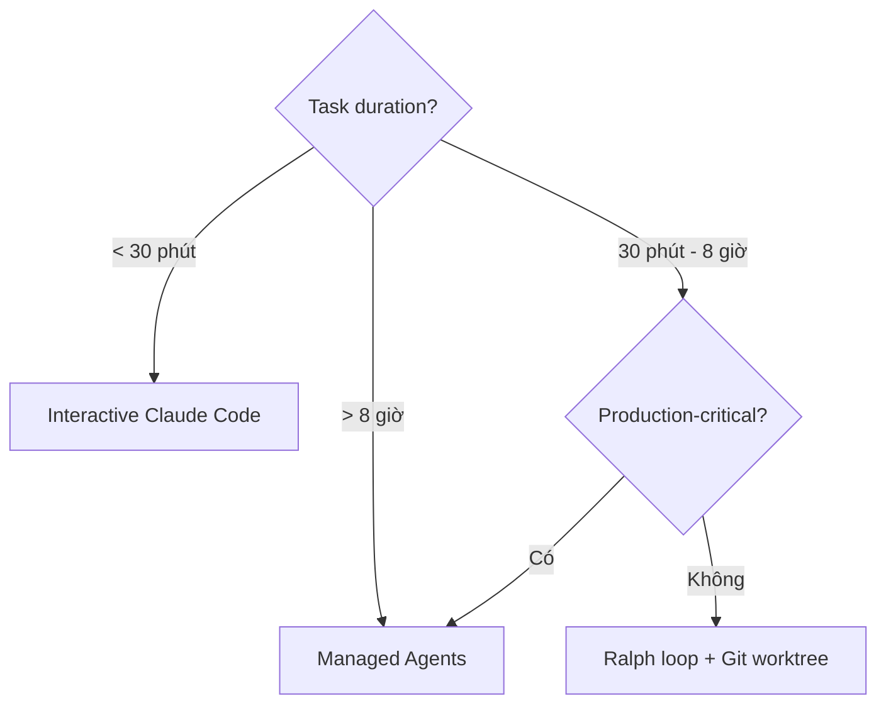

# Cách để Claude Code làm việc dài hạn

::: tip Cập nhật 5/2026
- **Claude Sonnet 5** chạy stable hơn cho task dài (32h continuous trong 1 benchmark)
- **Managed Agents API** thay nhu cầu "while loop" — Anthropic host agent chạy 24/7
- **Checkpoint mode** tự save state, rollback dễ
- **Background agents** trên Claude.ai web — bạn đóng tab, agent vẫn chạy
- **Ralph Wiggum pattern** vẫn relevant cho self-hosted scenario
:::

## Mở đầu

Trợ lý coding AI truyền thống là "đối thoại" — bạn nói 1 câu, nó trả 1 câu, rồi dừng. Nhưng với task dev thật, mode này không đủ.

Hãy tưởng tượng scenario: bạn muốn Claude giúp refactor cả project, nhưng nó viết vài file rồi nói "tôi xong rồi"; bạn muốn Claude tiếp tục fix bug tới khi test pass hết, nhưng nó chạy 1 lần là dừng; bạn muốn Claude "chạy qua đêm", nhưng sáng ra phát hiện nó đã dừng từ lâu.

Mùa hè 2025, 1 dev Úc tên **Geoffrey Huntley** (cũng là 1 shepherd — chăn cừu) viết 1 bash script chỉ 5 dòng. Script đơn giản: liên tục restart Claude Code và feed cùng task. Anh ấy đặt tên "Ralph Wiggum" — lấy từ nhân vật trong The Simpsons cứ thử mãi không bỏ cuộc.

Script đơn giản này gây sốc Silicon Valley. Trong 2 tuần, project liên quan trên GitHub đạt 7,000+ stars. Người ta dùng nó qua đêm gen được 6 project hoàn chỉnh, dùng $297 API cost làm được job $50,000. Có người dùng 3 tháng build cả 1 ngôn ngữ lập trình.

Chương này giải core: làm sao để Claude Code như dev thật, làm việc liên tục tới khi task xong thực sự.

---

## Nguyên lý core: tại sao AI "dừng sớm"?

Trước khi giới thiệu các phương pháp, hiểu gốc rễ vấn đề.

### "Phán đoán hoàn thành" của AI không tin được

LLM (Large Language Model) có 1 khiếm khuyết cơ bản: nó không thể đánh giá chính xác công việc của mình có thực sự xong không.

Standard hoàn thành của con người khách quan — mọi test pass, function đầy đủ dùng được, chất lượng code đạt. Nhưng AI chỉ đánh giá dựa "cảm giác". Có thể nó cảm "trông gần xong" rồi dừng, hoặc cảm "output đủ" rồi dừng, hoặc không biết tiếp làm gì thì dừng.

Đây là lý do ta cần 1 hệ thống external đánh giá task có thực sự xong không, không phụ thuộc "cảm giác" AI.

### Ý tưởng core giải pháp

Core giải pháp: cho AI làm trong 1 "loop".

Mỗi lần nó muốn thoát, hệ thống external check 3 câu — thực sự xong chưa? Đạt standard khách quan chưa? Còn sót gì không? Nếu chưa, inject lại task, tiếp tục round sau.

Ý tưởng này có nhiều cách implement, từ bash script đơn giản đến hệ orchestration phức tạp, bản chất giống nhau.

---

## Phương pháp 1: While True Bash Loop (cách nguyên thuỷ)

Đây là cách implement đơn giản, trực tiếp nhất. Bản chất là viết infinite loop, mỗi lần loop restart Claude Code và feed cùng task description.

Implement đơn giản nhất chỉ 5 dòng:

```bash
#!/bin/bash
while true; do
    cat PROMPT.md | claude
done
```

### Nguyên lý hoạt động

Workflow script này trực tiếp. Bước 1 đọc task description từ PROMPT.md. Bước 2 start Claude Code và truyền task. Bước 3 Claude bắt đầu làm và output kết quả. Bước 4 Claude xong thì thoát. Bước 5 loop tự restart, quay về bước 1, tạo infinite loop — trừ khi bạn Ctrl+C ngắt tay.

### Ưu nhược điểm

Ưu: cực kỳ đơn giản, ai cũng hiểu được, không cần config, dùng ngay, phù hợp thử nghiệm nhanh.

Nhược cũng rõ: không phán đoán task có thực sự xong, có thể infinite spin, không có cơ chế bảo vệ an toàn, lãng phí API call.

### Ví dụ dùng thực tế

Tạo file PROMPT.md mô tả task. Ví dụ refactor module xác thực user:

```markdown
# Task: refactor module xác thực user

Yêu cầu:
1. Extract tất cả logic auth ra class AuthService riêng
2. Add unit test, coverage > 80%
3. Update doc liên quan

Khi tất cả test pass và doc update xong, output: TASK HOÀN THÀNH
```

Tạo script loop và chạy:

```bash
chmod +x ralph.sh
./ralph.sh
```

---

## Phương pháp 2: thêm điều kiện thoát thông minh

Script ở phương pháp 1 không biết khi nào dừng. Cải tiến: cho Claude output 1 marker đặc biệt khi xong, script detect marker → exit.

```bash
#!/bin/bash
OUTPUT_FILE="/tmp/claude-output.log"

while true; do
    cat PROMPT.md | claude 2>&1 | tee "$OUTPUT_FILE"
    
    # Check marker hoàn thành
    if grep -q "TASK HOÀN THÀNH" "$OUTPUT_FILE"; then
        echo "✅ Task xong, thoát loop"
        break
    fi
    
    # Safety: max 50 iteration
    ITERATION=$((ITERATION + 1))
    if [ $ITERATION -ge 50 ]; then
        echo "⚠️ Đạt max iteration, force exit"
        break
    fi
    
    echo "🔄 Iteration $ITERATION, tiếp tục..."
    sleep 5
done
```

Cải tiến quan trọng:
- Check marker `TASK HOÀN THÀNH` để exit graceful
- Max iteration để tránh cost runaway
- Sleep giữa iteration để tránh rate limit

---

## Phương pháp 3: external validator

Marker dựa vào AI tự đánh giá → không reliable. Cải tiến: external validator (thường là script test) đánh giá khách quan.

```bash
#!/bin/bash

run_validator() {
    # Validator: tất cả test pass + coverage > 80%
    npm test 2>&1 || return 1
    COVERAGE=$(npx jest --coverage --json | jq '.coverageMap.summary.lines.pct')
    if (( $(echo "$COVERAGE > 80" | bc -l) )); then
        return 0
    fi
    return 1
}

ITERATION=0
while true; do
    ITERATION=$((ITERATION + 1))
    echo "🔄 Iteration $ITERATION"
    
    # Cho Claude thông tin về trạng thái hiện tại
    {
        echo "# Task hiện tại"
        cat PROMPT.md
        echo ""
        echo "# Trạng thái"
        echo "Lần iteration: $ITERATION"
        if [ -f /tmp/last-test-output.log ]; then
            echo "## Test output lần trước:"
            tail -50 /tmp/last-test-output.log
        fi
    } | claude
    
    # Validate
    if run_validator > /tmp/last-test-output.log 2>&1; then
        echo "✅ Validator pass, task xong!"
        break
    fi
    
    if [ $ITERATION -ge 50 ]; then
        echo "⚠️ Max iteration, dừng"
        break
    fi
done
```

Ưu điểm:
- Validator khách quan (test pass)
- AI có context kết quả lần trước (test output)
- Tự terminate khi đạt mục tiêu

---

## Phương pháp 4: parallel với git worktree

Nếu task có thể chia nhỏ, dùng git worktree để parallel:

```bash
#!/bin/bash

TASKS=("refactor-auth" "add-tests" "update-docs")

for TASK in "${TASKS[@]}"; do
    # Tạo worktree riêng cho mỗi task
    git worktree add ../$TASK -b feature/$TASK
    
    # Chạy agent ở worktree đó
    (
        cd ../$TASK
        cat ../main/PROMPTS/$TASK.md | claude
    ) &
done

wait
echo "✅ Tất cả task parallel xong"
```

Lợi ích:
- Speed-up 3x cho 3 task
- Isolation: task fail không ảnh hưởng nhau
- Merge dễ qua PR riêng

---

## Phương pháp 5: orchestrator level production

Cho production, dùng tool orchestrator dedicated:

### claude-runner (community tool)

```yaml
# claude-runner.yml
tasks:
  - name: refactor-auth
    prompt_file: prompts/refactor-auth.md
    validator: npm test -- auth
    max_iterations: 30
    timeout: 7200  # 2h
    
  - name: add-tests
    prompt_file: prompts/add-tests.md
    validator: npm test && npm run coverage:check
    depends_on: [refactor-auth]
    
notification:
  slack_webhook: ${SLACK_WEBHOOK}
  on: [success, failure]
```

### Managed Agents (Anthropic official)

```python
from anthropic import ManagedAgent

agent = ManagedAgent(
    name="overnight-refactor",
    prompt="Refactor entire codebase to use TypeScript strict mode...",
    tools=["Read", "Edit", "Bash"],
    max_runtime_hours=8,
    success_criteria="npm test passes && npm run typecheck passes",
    notification_email="dev@company.com"
)

await agent.start()
# Anthropic chạy 24/7, gửi email khi xong
```

---

## Pattern thực chiến

### Pattern 1: overnight refactor

Quy trình:
1. 6PM: bắt đầu Ralph loop với task refactor
2. Đi ngủ
3. Sáng: check kết quả, merge PR
4. Cost: $20-100 cho 8 tiếng

### Pattern 2: continuous bug fixing

```bash
while true; do
    BUGS=$(gh issue list --label bug --state open --json number,title)
    if [ -z "$BUGS" ]; then
        echo "✅ Không còn bug, dừng"
        break
    fi
    
    BUG_NUM=$(echo "$BUGS" | jq -r '.[0].number')
    {
        echo "Fix bug #$BUG_NUM"
        gh issue view $BUG_NUM
    } | claude
    
    # Auto-create PR nếu test pass
    if npm test; then
        gh pr create --title "Fix #$BUG_NUM" --body "..."
        gh issue close $BUG_NUM
    fi
done
```

### Pattern 3: generate dataset

```bash
for i in {1..1000}; do
    {
        echo "Generate test case #$i for product search."
        echo "Output format: JSON với fields {query, expected_results, edge_case_type}"
    } | claude > "dataset/case-$i.json"
done
```

### Pattern 4: research & write

```bash
TOPICS=("MCP" "Skills" "Subagents" "Hooks" "Workflows")
for TOPIC in "${TOPICS[@]}"; do
    {
        echo "Research $TOPIC in Claude Code."
        echo "Write 3000-word article."
        echo "Save to articles/$TOPIC.md"
    } | claude
done
```

---

## Best practice và pitfall

### Best practice

1. **Always have max iteration**: tránh cost runaway
2. **External validator > self-validation**: AI tự đánh giá không reliable
3. **Checkpoint trong Git**: commit sau mỗi iteration để rollback dễ
4. **Monitor cost real-time**: setup alert khi vượt budget
5. **Run trong sandbox**: dùng Docker hoặc separate user account
6. **Log everything**: stdout + stderr + cost per iteration
7. **Notify khi xong**: webhook/email/Slack
8. **Có abort mechanism**: dễ Ctrl+C an toàn

### Pitfall thường gặp

1. **Cost explosion**: 1 lần fail trong loop có thể consume $100+ trong vài giờ
2. **Infinite loop trên unsolvable task**: validator kiểm chưa đủ chặt
3. **Race condition**: parallel task ghi cùng file
4. **API rate limit**: chạy quá nhanh bị throttle
5. **Context drift**: sau nhiều iteration context có thể bị corrupt
6. **State pollution**: file system thay đổi từ iteration trước ảnh hưởng sau
7. **Test flakiness**: test non-deterministic làm validator unreliable

---

## Cost estimation

| Task | Iterations typical | Cost (Sonnet 5) |
|---|---|---|
| Bug fix nhỏ | 1-5 | $0.50 - $2 |
| Feature mới medium | 10-30 | $5 - $30 |
| Refactor module | 20-50 | $15 - $80 |
| Overnight refactor codebase | 100-500 | $50 - $300 |
| Generate 1000 dataset entries | 1000 | $20 - $100 |
| Build app from scratch | 50-200 | $30 - $200 |

**Tip tiết kiệm**:
- Dùng Haiku 4.5 cho task lặp lại đơn giản (rẻ 10x)
- Cache prompt phần không đổi
- Stop early khi đạt "good enough" thay vì "perfect"

---

## Tool ecosystem 2026

| Tool | Description | Best for |
|---|---|---|
| **Ralph (bash)** | 5-line original | Quick experiment |
| **claude-runner** | YAML orchestrator | Multi-task pipeline |
| **Anthropic Managed Agents** | Hosted, 24/7 | Production agent |
| **smol-developer** | Self-driving dev agent | Build app from spec |
| **GPT Engineer** | Similar but multi-model | Cross-model flexibility |
| **OpenDevin** | Open source autonomous dev | Self-hosted production |
| **agent-zero** | Educational, transparent | Learning agent loop |

---

# Phụ lục: Long-running tasks 2026

## A. Anthropic Managed Agents

Q1/2026 release. Khác biệt vs DIY loop:

| Feature | DIY Loop | Managed Agents |
|---|---|---|
| Infra | Self-host | Anthropic-hosted |
| Uptime | Phụ thuộc machine bạn | 99.9% SLA |
| Cost | API + machine | API + premium hosting fee |
| Memory | Phải tự manage | Built-in persistent |
| Multi-agent | DIY orchestration | Native support |
| Webhook | DIY | Built-in |
| Best for | Hobbyist, experiment | Production team |

## B. Background Agents (Claude.ai web)

Mới: trong Claude.ai web, bạn có thể start "background agent" rồi đóng tab. Agent chạy server-side, push notification khi xong. Phù hợp:
- Research task dài
- Document writing
- Data analysis
- Code review

## C. Khi nào dùng cái nào



## D. Pattern hay 2026

1. **Pre-flight check**: trước khi loop chạy, validate environment, dependencies, credentials đầy đủ
2. **Progressive prompting**: iteration đầu prompt general, sau narrow xuống dựa kết quả
3. **Self-critique step**: mỗi N iteration cho agent review code mình viết
4. **Human-in-loop checkpoint**: mỗi 10 iteration pause cho human review
5. **A/B prompting**: chạy parallel 2 prompt variant, compare output

## E. Tips dev VN

1. **Đừng để chạy qua đêm lần đầu**: test 30 phút trước, expand thời gian dần
2. **Setup billing alert ở Anthropic console**: avoid surprise bill
3. **Dùng VPS local (Vinahost, BizflyCloud) nếu data nhạy cảm**: không upload code lên Anthropic
4. **Document iteration log**: lưu lại để analyze pattern, optimize prompt
5. **Community VN**: join Discord/Zalo group share kinh nghiệm chạy agent dài

::: warning Cost warning
Long-running agent có thể consume **$100-500/ngày** nếu config sai. Always:
- Set `max_iterations` strict
- Set budget alert ở Anthropic console
- Monitor real-time qua dashboard
- Có abort script ready
:::

## Sources

- [Geoffrey Huntley: Ralph Wiggum](https://ghuntley.com/ralph/)
- [Anthropic: Managed Agents](https://www.anthropic.com/news/managed-agents)
- [Claude Background Agents](https://support.claude.com/en/articles/background-agents)
- [smol-developer](https://github.com/smol-ai/developer)
- [OpenDevin](https://github.com/OpenDevin/OpenDevin)
