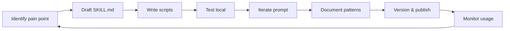

# Claude Code Skills: hướng dẫn đầy đủ

::: tip Cập nhật 5/2026
- **Anthropic Skills API** ra tháng 10/2025 — Skills giờ là first-class feature, không chỉ folder convention
- **Skills marketplace** (skills.sh) có **800+ skill** community + 50+ official từ Anthropic/Vercel
- **find-skills tool** giờ install global qua `npx skills add`, search bằng ngôn ngữ tự nhiên
- **Skills hoạt động trên cả Claude Code, Claude.ai, Anthropic API** — write once, run anywhere
- Skills khác MCP: **Skills = local logic + prompt + script**, **MCP = external service connection**. Combine cả 2 cho hiệu quả tối đa
:::

## Giới thiệu Skills

**Claude Code Skills** là 1 tính năng đóng gói kiến thức chuyên môn, workflow và best practice thành "skill package reusable".

Hãy tưởng tượng: Skills giống như trang bị "sách kỹ năng" cho Claude — khi bạn cần nó hoàn thành task cụ thể, không cần giải thích yêu cầu lặp đi lặp lại, mà execute trực tiếp theo skill standard đã define.

### Tại sao cần Skills?

Trước khi có Skills, dùng Claude Code có 1 số vấn đề:

- **Lệnh lặp lại**: mỗi lần phải giải thích "code phải theo style gì", "commit message viết thế nào"
- **Knowledge không tích luỹ**: experience của member team không share được
- **Standard không thống nhất**: người khác dùng Claude, kết quả có thể hoàn toàn khác
- **Hiệu suất thấp**: task phổ biến mỗi lần phải giải thích từ đầu

Skills giải các vấn đề này, biến Claude thành "member team có kinh nghiệm" — biết quy chuẩn project, workflow và best practice của bạn.

---

## Tại sao học Skills bây giờ?

**Skills đang thành kỹ năng bắt buộc của AI engineer**:

- **Cộng đồng nhiệt**: repo liên quan trên GitHub star tăng nhanh, ví dụ OpenSkills 7.2k stars, Obsidian Skills tăng 6.6k stars trong 9 ngày
- **Support official**: Anthropic maintain official Skills repo, Vercel ra Agent Skills và find-skills tool
- **Thực dụng cao**: từ code review, thao tác Git tới làm video, gen PPT, cover nhiều scenario. Platform skills.sh đã có skill hot 60K+ subscriber
- **Tăng hiệu suất**: config 1 lần, dùng nhiều lần, biến Claude thành "digital employee" thật
- **Dev công nhận**: nhiều tech community recommend, được coi là tool quan trọng tăng hiệu suất coding AI

---

## Bắt đầu nhanh

### Bước 1: cài find-skills (cực kỳ khuyến nghị)

Trước khi dùng Skills, khuyến nghị cài `find-skills` — đây là "thần khí search skill" trong lĩnh vực AI Agent, hiện đã có 60K+ subscriber.

**find-skills là gì?**

Đơn giản, find-skills giống "search box App Store" của AI Agent. Khi bạn cần làm 1 task nhưng local không có Skill tương ứng, nó tự động search và đề xuất Skill phù hợp nhất.

**Cài find-skills**:

```bash
npx skills add vercel-labs/skills@find-skills -g -y
```

Cài xong, bạn có thể nói thẳng nhu cầu cho Claude, nó tự dùng find-skills search skill liên quan.

**Ví dụ dùng**:

```
Tôi cần optimize performance 1 React component, tìm giúp skill nào dùng được
```

Claude qua find-skills search, rồi báo bạn skill nào tìm được, bạn có thể chọn cài.

**Tại sao khuyến nghị cài find-skills trước?**

Chưa có find-skills:
- Search tay skill trên GitHub
- Copy, cài, config từng cái
- Debug thích nghi liên tục

Có find-skills:
- 1 câu mô tả nhu cầu
- AI tự động search skill match nhất
- 1 click cài, dùng được ngay

**Lưu ý user Windows**: bản official support Windows hạn chế, community có bản Windows adapted, support CMD và PowerShell, kèm function search tiếng Trung.

**Link liên quan**:
- [Skills website](https://skills.sh/) - browse mọi skill available
- [find-skills repo](https://github.com/vercel-labs/agent-skills) - source official

### Cài và trải nghiệm Skill đầu tiên

Sau cài find-skills, dùng nó search và cài Skill thú vị đầu tiên — Remotion video creation tool.

#### Bước 1: dùng find-skills search Remotion

Trong Claude Code nhập:

```
Tìm giúp skill liên quan Remotion, tôi muốn làm video
```

Claude qua find-skills search, đề xuất `remotion-dev/skills`.

#### Bước 2: cài Remotion Skills

```
Cài skill remotion-dev/skills cho tôi
```

Claude tự cài.

#### Bước 3: dùng nó làm cái vui!

```
Dùng Remotion làm 1 video animation đơn giản:
- 5 giây
- Hiện text "Hello AI" với animation fade-in
- Background gradient blue-to-purple
```

Claude sẽ:
1. Dùng kiến thức Remotion Skills
2. Tạo project Remotion
3. Viết code component
4. Sinh video

### Skill thứ 2: dùng find-skills giải "frontend xấu và lag"

#### Bước 1: mô tả vấn đề bằng ngôn ngữ tự nhiên

```
Page React tôi load chậm và xấu, có skill nào giúp optimize không?
```

#### Bước 2: Claude dùng find-skills search

Claude tự search, đề xuất:
- `react-performance` - optimize performance React
- `tailwind-design-system` - design system Tailwind
- `lighthouse-audit` - audit performance Lighthouse

#### Bước 3: cài và dùng

```
Cài 3 skill trên, rồi audit page và đưa đề xuất optimize
```

### So sánh 2 Skills

| Tiêu chí | Remotion Skills | Frontend Optimize Skills |
|---|---|---|
| Mục đích | Sinh video | Optimize performance + UI |
| Cách trigger | Nhắc "video", "animation" | Nhắc "slow", "ugly", "optimize" |
| Output | File mp4 | Code optimized + report |

### Skill thứ 3: dùng frontend-slides làm PPT đẹp nhanh

#### Giới thiệu

`frontend-slides` là skill dùng tech frontend làm slide đẹp.

#### Cài frontend-slides

```bash
# Tạo thư mục skill
mkdir -p ~/.claude/skills/frontend-slides

# Download file (hoặc copy từ GitHub)
# 1. Truy cập https://github.com/zarazhangrui/frontend-slides
# 2. Download SKILL.md và STYLE_PRESETS.md
# 3. Cho vào thư mục ~/.claude/skills/frontend-slides/
```

#### Scenario dùng

- Làm pitch deck cho khách
- Slide tech sharing
- Slide thuyết trình đại học/conference

#### Style visual built-in

frontend-slides có sẵn nhiều style preset:
- Apple style (minimal, white)
- Cyberpunk (dark, neon)
- Notion style (clean, function-focused)
- TED style (image-heavy, presentation)

#### Effect output

Output là HTML slides chạy được trong browser, có:
- Animation chuyển slide
- Code highlight syntax
- Embed chart, image
- Export PDF được

#### Tại sao khuyến nghị?

- Nhanh: 30 phút làm xong 20 slide
- Đẹp: hơn template PowerPoint mặc định
- Linh hoạt: sửa CSS/HTML là được
- Version controllable: file text, Git tracked được

### So sánh 3 Skills

| Skill | Lĩnh vực | Output | Khi nào dùng |
|---|---|---|---|
| Remotion | Video | mp4 | Cần video marketing/demo |
| Frontend Optimize | Web | Code + report | Page lag, audit performance |
| frontend-slides | Presentation | HTML slides | Làm pitch deck, slide tech |

### Sau khi cài thì dùng thế nào

Skill cài xong, Claude tự nhận diện và trigger theo nhu cầu của bạn. Cũng có thể call thẳng:

```
/skill remotion-dev
Làm video intro cho startup tôi
```

## Skills là gì?

### Định nghĩa technical

Skill là 1 folder gồm:
- `SKILL.md` - prompt + metadata
- Script (Python, Node.js, Bash) - logic execution
- Doc - kiến thức và pattern
- Asset - template, image, sample

**Cấu trúc folder điển hình:**

```
~/.claude/skills/my-skill/
├── SKILL.md           # Bắt buộc - prompt + frontmatter metadata
├── scripts/
│   ├── do-thing.sh    # Script được Claude execute
│   └── helper.py
├── docs/
│   ├── overview.md
│   └── patterns.md
└── assets/
    ├── template.html
    └── icon.svg
```

### SKILL.md format

```markdown
---
name: my-skill
description: Mô tả skill này làm gì
triggers:
  - "keyword 1"
  - "keyword 2"
  - "pattern câu hỏi"
version: 1.0.0
author: Your Name
---

# My Skill

## What it does
Skill này giúp Claude làm [task X] theo cách [Y].

## When to activate
- Khi user nói "..."
- Khi project có file "..."

## How to use it
1. Check pre-conditions (run `scripts/check.sh`)
2. If condition met, generate output theo template trong `assets/template.html`
3. Format output theo style trong `docs/style-guide.md`

## Pattern và best practice
[Detail về cách approach problem]
```

## Skill vs MCP vs CLAUDE.md

| Tiêu chí | Skill | MCP | CLAUDE.md |
|---|---|---|---|
| **Scope** | User-wide hoặc project | Per-project | Per-project |
| **Logic** | Có script execute | Connect external service | Chỉ instruction |
| **Cài đặt** | Folder + SKILL.md | `.claude/mcp.json` + npm package | File markdown |
| **Sharing** | npm/git package | Git config | Git commit |
| **Use case** | Workflow + knowledge | External tool integration | Project context |
| **Cost** | Free (chạy local) | Free (trừ API external) | Free |

**Combo phổ biến**:
- CLAUDE.md cho context project
- MCP cho external integration (GitHub, DB, Notion)
- Skills cho workflow lặp lại (TDD, code review, deploy)

## Build skill custom của bạn

### Use case: skill "deploy-vn-startup"

Giả sử team bạn deploy lên Vercel + Supabase + Cloudflare. Mỗi lần dev mới onboard phải hỏi flow. Build skill:

```bash
mkdir -p ~/.claude/skills/deploy-vn-startup
cd ~/.claude/skills/deploy-vn-startup
```

**SKILL.md**:

```markdown
---
name: deploy-vn-startup
description: Deploy app full-stack lên Vercel + Supabase + Cloudflare R2 (VN startup stack)
triggers:
  - "deploy app"
  - "deploy lên production"
  - "push lên Vercel"
---

# Deploy VN Startup Stack

## Pre-deploy checklist
Run `scripts/check-env.sh` để verify env var đầy đủ:
- VERCEL_TOKEN
- SUPABASE_URL, SUPABASE_ANON_KEY, SUPABASE_SERVICE_KEY
- R2_ACCESS_KEY, R2_SECRET_KEY, R2_BUCKET

## Deploy flow
1. Run test: `npm test` (must pass)
2. Build: `npm run build` (must succeed)
3. Run migration: `scripts/migrate.sh`
4. Deploy: `vercel --prod`
5. Smoke test: `scripts/smoke-test.sh`
6. Update Notion changelog page

## Rollback
Nếu smoke test fail:
1. Revert deployment: `vercel rollback`
2. Revert migration: `scripts/migrate-rollback.sh`
3. Notify team Slack qua MCP
```

**scripts/check-env.sh**:

```bash
#!/bin/bash
required_vars=(VERCEL_TOKEN SUPABASE_URL SUPABASE_ANON_KEY SUPABASE_SERVICE_KEY R2_ACCESS_KEY R2_SECRET_KEY R2_BUCKET)
for var in "${required_vars[@]}"; do
  if [ -z "${!var}" ]; then
    echo "❌ Missing: $var"
    exit 1
  fi
done
echo "✅ All env vars set"
```

Bây giờ team mọi người nói "deploy app" → Claude tự follow flow chuẩn.

## Skill marketplace 2026

| Marketplace | Type | Note |
|---|---|---|
| **skills.sh** | Official aggregator | 800+ skill, có search + rating |
| **vercel-labs/agent-skills** | Vercel official | Best practice cho Next.js stack |
| **OpenSkills** | Community | 7.2k stars, đa lĩnh vực |
| **obsidian-skills** | Note-taking focus | Obsidian, Notion integration |
| **anthropic-skills** | Anthropic official | High-quality, well-tested |
| **smithery.ai** | MCP + Skills | Cross-platform marketplace |

## Top 10 skill khuyên cài cho dev 2026

1. **find-skills** (Vercel) - search engine cho skill
2. **superpowers** (obra) - engineering discipline (TDD, brainstorm, code review)
3. **anthropic-skills/general** - basic productivity skills
4. **frontend-slides** - làm pitch deck
5. **mermaid-diagram** - sinh diagram
6. **api-doc-generator** - gen OpenAPI/Swagger spec
7. **sql-formatter** - format SQL query
8. **regex-builder** - build regex từ ví dụ
9. **changelog-writer** - sinh changelog từ git history
10. **code-reviewer** - PR review automated

## Best practice 2026

### 1. Curate skill list

Đừng cài >20 skill — quá nhiều skill làm Claude bị confuse khi pick. Bắt đầu với 5-7 skill core cho workflow chính, add khi cần.

### 2. Skill cho team vs cá nhân

- **Team skill** (commit `.claude/skills/` vào Git): style code, deploy flow, security checklist
- **Personal skill** (`~/.claude/skills/`): productivity tool, learning aid

### 3. Version skill

Treat skill như code:
- Semver version trong `SKILL.md` frontmatter
- Changelog khi update
- Test skill trên 1 project trước khi rollout team-wide

### 4. Mô tả trigger rõ

Trigger keyword quá rộng → Claude trigger sai. Quá hẹp → không trigger được. Sweet spot: 3-5 trigger cụ thể cho 1 skill.

### 5. Document hoá pattern

Trong `SKILL.md`, ghi rõ:
- Khi nào skill apply (positive case)
- Khi nào không apply (negative case)
- Common mistakes khi dùng skill

## Câu hỏi thường gặp

### Q1: Skills có replace MCP không?

Không. Skills và MCP bổ sung nhau:
- Skill: cho logic local + workflow
- MCP: cho external service connection

Project production thường dùng cả 2.

### Q2: Skill có dùng được trên Cursor / Windsurf không?

Hiện tại skill folder format chỉ work với Claude Code. Tuy nhiên:
- Skill content (prompt) có thể copy vào Cursor Rules
- Anthropic đang đẩy chuẩn cross-platform — kỳ vọng 2026 H2

### Q3: Cost của skill?

- **Local execution**: free
- **Token cost**: skill tăng context size (load SKILL.md vào prompt), nhưng nhỏ vs benefit
- **Lazy loading**: chỉ load skill khi trigger match

### Q4: Build skill mất bao lâu?

- Skill đơn giản (chỉ prompt + 1 script): 30 phút
- Skill phức tạp (multi-script, asset, doc): 2-4 giờ
- Skill production-ready (test, doc, versioning): 1-2 ngày

### Q5: Skill có replace dev senior không?

Không. Skill encode được pattern và workflow, nhưng:
- Decision making vẫn cần senior
- Edge case xử lý cần judgement
- New problem ngoài skill scope cần creative

Skill = augment, không phải replace.

## Tài liệu tham khảo

- [Skills official site](https://skills.sh/)
- [vercel-labs/agent-skills](https://github.com/vercel-labs/agent-skills)
- [Anthropic Skills documentation](https://docs.anthropic.com/en/docs/skills)
- [obra/superpowers](https://github.com/obra/superpowers) - example skill suite
- [OpenSkills](https://github.com/openskills) - community marketplace
- [Smithery](https://smithery.ai/) - MCP + Skills marketplace

---

# Phụ lục: Skills 2026 deep-dive

## A. Anthropic Skills API (Q4/2025)

Anthropic ra Skills API → Skills giờ là feature first-class, work trên:
- Claude Code (CLI)
- Claude.ai (web app)
- Anthropic API (programmatic)

**Workflow upload skill**:
```bash
# Cài Anthropic CLI
npm install -g @anthropic-ai/cli

# Upload skill
anthropic skills upload ./my-skill --visibility team

# List skill team
anthropic skills list --team mycompany
```

**Skill visibility**:
- `private`: chỉ bạn dùng
- `team`: team org dùng
- `public`: cộng đồng dùng

## B. Skill phát triển workflow



**Iteration nhanh**:
1. Save SKILL.md
2. Trong Claude Code: `/skill reload my-skill`
3. Test với prompt trigger
4. Refine

## C. Skill marketplace VN — opportunity

Hiện chưa có nhiều skill cho VN context. Cơ hội build:

| Skill name | Mô tả | Audience |
|---|---|---|
| `vn-payment-integration` | Tích hợp VNPay, Momo, ZaloPay theo flow chuẩn | E-commerce dev VN |
| `vn-shipping-api` | Wrap GHN, GHTK, Viettel Post API | Logistics dev |
| `vn-tax-invoice` | Sinh hoá đơn điện tử theo chuẩn TT78/2014 | Finance dev |
| `vietnamese-text-processing` | Tokenize, normalize tiếng Việt (toàn dấu vs không dấu) | NLP dev |
| `vn-legal-compliance` | Check PII, data residency theo NĐ13/2023 | Compliance team |
| `vn-marketing-vi` | Brand voice Vietnamese, hashtag, content style | Marketing |
| `vn-startup-stack` | Vercel + Supabase + Cloudflare deploy flow (VN-friendly) | Startup founder |

Build và publish 1 trong list trên = contribution lớn cho dev community VN.

## D. Skill vs Plugin

Đôi khi confusion về Skill vs Plugin:

| Feature | Skill | Plugin |
|---|---|---|
| Format | Folder `~/.claude/skills/` | Folder `~/.claude/plugins/` |
| Scope | Knowledge + workflow | Tool/command + UI extension |
| Trigger | Automatic via keyword | Explicit `/command` |
| Distribution | npm, git clone, marketplace | `/plugin install` |
| Examples | TDD methodology, deploy flow | New slash command, custom UI |

Trong thực tế, **plugin có thể chứa skill bên trong** — plugin là wrapper distribution, skill là content.

## E. Tương lai Skills

Theo Anthropic roadmap 2026:
- **Skill composition**: skill có thể require/extend skill khác
- **Skill testing framework**: unit test cho skill
- **Skill analytics**: track usage, success rate, user satisfaction
- **Cross-model skill**: skill work với GPT, Gemini, Claude (chuẩn open)
- **Skill A/B testing**: thử nhiều version skill, pick best

::: tip
Skill là 1 trong các pattern quan trọng nhất 2026 — dev biết build skill sẽ có competitive advantage. Đầu tư time học sớm.
:::

## Sources

- [Anthropic: Introducing Skills](https://www.anthropic.com/news/skills)
- [Vercel Labs Skills](https://github.com/vercel-labs/agent-skills)
- [skills.sh marketplace](https://skills.sh/)
- [Awesome Claude Skills](https://github.com/affaan-m/everything-claude-code)
