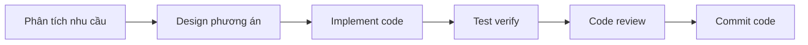
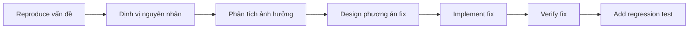
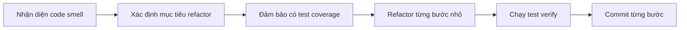

# Workflow phát triển hỗ trợ AI

Ở các chương trước, ta đã học cách dùng AI IDE để viết code, dùng Git quản lý version code, design và implement API. Nhưng khi đối mặt task dev thật, bạn có thể gặp các vấn đề:

- "Project này có cả nghìn file, tôi bắt đầu từ đâu?"
- "Sếp bảo thêm function mới, nhưng tôi không quen phần code này"
- "Bug này không biết ở đâu, code quá nhiều"
- "Cần refactor đống code này, nhưng sợ sửa hỏng"

Bản chất các vấn đề này là: **làm sao trong scenario dev thật, dùng tool AI hiệu quả hoàn thành công việc?**

Trong bài này, ta học cách thiết lập 1 workflow phát triển hỗ trợ AI có hệ thống, để bạn ở mọi scenario dev đều có thể dùng tool AI hiệu quả. Sẽ qua các case cụ thể, demo cách dùng AI ở scenario dev feature mới, fix bug, refactor code...

> 💡 **Kiến thức tiền đề**
> 
> Trước khi học bài này, khuyến nghị bạn hiểu trước:
> - [Nền tảng AI IDE](../../../stage-1/introduction-to-ai-ide/) - nắm cơ bản cách dùng AI IDE
> - [Workflow Git và GitHub](../../../stage-2/backend/git-workflow/) - hiểu quản lý version code
> - [LLM hỗ trợ viết code API](../../../stage-2/backend/ai-interface-code/) - hiểu khái niệm cơ bản dev hỗ trợ AI

::: info 📚 Bạn sẽ học
1. Hiểu vị trí của AI trong flow dev và boundary năng lực
2. Nắm chiến lược dev hỗ trợ AI cho các loại project khác nhau
3. Biết dùng Claude Code ở scenario dev feature mới, fix bug, refactor code
4. Build knowledge base project, tăng hiệu suất cộng tác với Claude Code
5. Nắm các kỹ thuật thực dụng tăng hiệu suất cộng tác AI
:::

# 1. Hiểu boundary năng lực AI

Trước khi bắt đầu dev hỗ trợ AI, ta cần hiểu AI làm được gì, không làm được gì. Vậy mới thiết lập được cách cộng tác đúng.

## 1.1 AI giỏi gì

Hãy tưởng tượng AI như 1 trợ lý rất thông minh nhưng cần lệnh rõ. Nó có thể theo mô tả của bạn sinh nhanh khung code, cũng có thể trong vài giây đọc xong vài nghìn dòng code tìm phần bạn cần. Lỗi syntax rõ, lỗ hổng security phổ biến, nó cũng giúp bạn phát hiện. Các công việc lặp như rename variable hàng loạt, format code, gen comment doc, giao cho nó hợp nhất.

Tóm lại, AI giỏi các công việc có rule rõ, có thể auto hoá.

## 1.2 AI không giỏi gì

Nhưng AI cũng có giới hạn. Nó không hiểu business logic của bạn — trừ khi bạn nói chi tiết, nó không biết flow đơn hàng công ty bạn chạy thế nào. Quyết định kiểu chọn công nghệ, design kiến trúc cần cân nhắc lợi-hại, nó cũng không làm được vì cần kinh nghiệm bạn và hiểu project.

Quy chuẩn đặc biệt team bạn, ví dụ "mọi API phải add log", "error code phải dùng enum", AI cũng không biết, cần bạn config hoặc nói rõ.

Quan trọng nhất, code AI sinh ra không dùng trực tiếp được, bạn phải review và test. Có thể viết code trông đúng nhưng thực tế có vấn đề, có thể bỏ sót 1 số edge case.

## 1.3 Cộng tác với AI thế nào

Hiểu boundary năng lực AI, cách cộng tác rõ ra: bạn lo nghĩ rõ làm gì, ra quyết định, gác chất lượng; AI lo execute coding cụ thể, tìm info, phát hiện vấn đề rõ.

Giống bạn cộng tác với 1 dev junior — bạn bảo anh ấy làm gì, anh ấy implement, rồi bạn review code. Khác biệt: tốc độ execute của AI nhanh hơn nhiều, nhưng judgement kém hơn người.

# 2. Chiến lược dev cho các loại project khác nhau

Các loại project khác nhau, cách dev và chiến lược dùng AI cũng khác. Chọn chiến lược phù hợp tăng đáng kể hiệu suất dev.

## 2.1 Project mới hoàn toàn (từ 0)

**Đặc điểm project:**
- Không có bao tải lịch sử, design tự do
- Cần lập structure project và quy chuẩn code
- Phù hợp iterate nhanh và thử-sai

**Workflow khuyến nghị:**

**Bước 1: plan structure project**

Trước khi code, để AI giúp plan structure project và chọn công nghệ:

```
Tôi muốn làm 1 app quản lý task, function gồm:
- Đăng ký và login user
- Tạo, sửa, xoá task
- Phân loại task và tag
- Reminder task

Giúp tôi:
1. Đề xuất tech stack phù hợp
2. Design directory structure project
3. Plan structure bảng database
```

**Bước 2: dựng framework cơ sở**

Theo plan, để AI tạo structure project cơ sở:

```
Theo plan vừa rồi, giúp tôi:
1. Tạo directory structure project
2. Init file config (package.json, .env...)
3. Tạo code server cơ sở
```

**Bước 3: implement từng function**

Theo priority, implement từng module function:

```
Giờ implement function đăng ký user, yêu cầu:
- Đăng ký bằng email và password
- Password mã hoá lưu
- Verify email
```

**Điểm chính:**
- Lập quy chuẩn code từ đầu, để AI sinh code theo quy chuẩn
- Mỗi function module xong là test verify
- Update doc project kịp thời

## 2.2 Project trưởng thành (đã có nhiều code)

**Đặc điểm project:**
- Code lượng lớn, có quy chuẩn lịch sử
- Cần giữ nhất quán style code
- Sửa cần xét phạm vi ảnh hưởng

**Workflow khuyến nghị:**

**Bước 1: hiểu structure project**

Trước khi sửa code, để AI giúp hiểu project:

```
Đây là 1 project e-commerce, tôi cần thêm function coupon.
Giúp tôi:
1. Phân tích structure tổng thể project
2. Tìm code liên quan đơn hàng
3. Xem function tương tự khác implement thế nào
```

**Bước 2: tìm code tham khảo**

Để AI tìm implement tương tự trong project làm tham khảo:

```
Tìm xem các promotion khác trong project (như giảm theo điều kiện, discount) implement thế nào
```

**Bước 3: bắt chước style hiện có**

Để AI tham khảo style code hiện có để implement function mới:

```
Tham khảo cách implement giảm theo điều kiện, giúp tôi implement function coupon
Giữ cùng style code và structure directory
```

**Điểm chính:**
- Hiểu trước rồi mới động tay, tránh phá kiến trúc hiện có
- Giữ nhất quán style code
- Sau khi sửa phải test function liên quan

## 2.3 Prototype nhanh (verify ý tưởng)

**Đặc điểm project:**
- Đuổi tốc độ, không quá quan tâm chất lượng code
- Dùng verify ý tưởng product hoặc phương án kỹ thuật
- Có thể bị bỏ hoặc viết lại

**Workflow khuyến nghị:**

**Mô tả nhu cầu thẳng, implement nhanh:**

```
Làm 1 app todo đơn giản, yêu cầu:
- Add, xoá, mark complete task được
- Data lưu local
- UI đơn giản, dùng được là OK
```

**Iterate nhanh:**

```
Thêm function search
Đổi sang dark theme
Thêm phân loại task
```

**Điểm chính:**
- Không cần quá để ý chất lượng code và quy chuẩn
- Verify ý tưởng nhanh, adjust hướng kịp thời
- Nếu prototype thành công, sau cần refactor

## 2.4 Project maintenance (chủ yếu fix bug)

**Đặc điểm project:**
- Code đã ổn định, chủ yếu fix vấn đề
- Cần định vị vấn đề nhanh
- Sửa phải cẩn thận, tránh đưa vấn đề mới

**Workflow khuyến nghị:**

**Bước 1: định vị vấn đề**

```
User feedback: bấm button "Submit order" rồi page treo
Console báo lỗi: TypeError: Cannot read property 'id' of undefined

Giúp tôi:
1. Phân tích nguyên nhân có thể
2. Tìm code liên quan
3. Đề xuất phương án fix
```

**Bước 2: fix cẩn thận**

```
Theo phân tích vừa rồi, giúp tôi fix bug này
Yêu cầu:
1. Sửa tối thiểu
2. Add comment giải thích
3. Đề xuất cách test
```

**Điểm chính:**
- Hiểu vấn đề trước rồi mới sửa
- Code review kỹ
- Đảm bảo không break function khác

# 3. Scenario dev typical

## 3.1 Dev feature mới

**Flow chuẩn:**



**Ví dụ thực: thêm function comment**

**Bước 1: phân tích nhu cầu**

```
Tôi muốn thêm function comment cho blog, giúp tôi phân tích nhu cầu:
1. Cần hỗ trợ những function gì? (post comment, reply, like, report...)
2. Cần xét những vấn đề gì? (anti-spam, kiểm duyệt content...)
3. Có thể tham khảo design hệ comment nào?
```

**Bước 2: design phương án**

```
Dựa phân tích nhu cầu trên, giúp tôi design phương án:
1. Structure bảng database
2. Design interface API
3. Component frontend
4. Permission control
```

**Bước 3: implement code**

```
Theo phương án design, implement từng:
1. Bảng database và Model
2. Interface API (CRUD comment)
3. Page list và post comment frontend
4. Reply, like function
```

**Bước 4: test verify**

```
Giúp tôi test function comment:
1. Viết unit test
2. Test API
3. Test UX frontend
4. Test edge case (comment trống, content quá dài, content nhạy cảm...)
```

## 3.2 Fix bug

**Flow chuẩn:**



**Ví dụ thực: fix bug data đơn hàng không đồng bộ**

**Bước 1: thu thập info**

```
Vấn đề: trang chi tiết đơn hàng đôi khi hiện data sai
Hiện tượng:
- Trạng thái đơn hàng hiện "chờ thanh toán" nhưng thực tế đã paid
- Refresh page thấy data đúng
- Xảy ra với 1 số user (~5%)

Giúp tôi phân tích nguyên nhân có thể
```

**Bước 2: định vị code**

```
Tìm code liên quan trang chi tiết đơn hàng:
1. Lấy data đơn hàng thế nào?
2. Có cache không? Cache invalidation thế nào?
3. Có race condition không?
```

**Bước 3: implement fix**

```
Đã định vị vấn đề: cache không invalidate kịp thời khi trạng thái đơn hàng đổi
Giúp tôi fix:
1. Sau khi đổi trạng thái đơn hàng tự động invalidate cache liên quan
2. Add request retry cho frontend
3. Add giải thích trong code
```

**Bước 4: add regression test**

```
Add regression test cho bug này:
1. Test cache invalidation
2. Test concurrent update scenario
3. Test xử lý frontend retry
```

## 3.3 Refactor code

**Flow chuẩn:**



**Ví dụ thực: refactor xử lý đơn hàng**

**Bước 1: nhận diện vấn đề**

```
Tôi cảm thấy code xử lý đơn hàng phức tạp, giúp tôi phân tích:
1. Có code smell gì? (function quá dài, code lặp, coupling quá cao...)
2. Có thể optimize chỗ nào?
3. Đề xuất phương án refactor
```

**Bước 2: chuẩn bị test**

```
Đảm bảo code hiện có test coverage:
1. Check test hiện có
2. Add unit test cho function chính
3. Chạy tất cả test confirm pass
```

**Bước 3: refactor từng bước**

```
Refactor từng bước theo phương án design:
Bước 1: extract function thanh toán thành lớp riêng
Bước 2: tách logic tính giá ra
Bước 3: simplify chuyển trạng thái đơn hàng
Mỗi bước xong chạy test confirm function chưa bị phá
```

**Bước 4: commit code**

```
Refactor xong, giúp tôi:
1. Tổng hợp thay đổi đã làm
2. Sinh commit message
3. Đề xuất sub-task review code
```

# 4. Build project knowledge base

## 4.1 Tại sao cần knowledge base project?

Khi cộng tác với Claude Code, AI cần hiểu background project mới cộng tác hiệu quả. Build 1 knowledge base project có thể:

- Cho AI hiểu nhanh project
- Đảm bảo style code nhất quán
- Giảm chi phí giao tiếp lặp
- Tích luỹ best practice của team

## 4.2 Cấu thành knowledge base

**Cấu thành cơ bản:**

```
project/
├── CLAUDE.md              # File hướng dẫn project
├── docs/
│   ├── architecture.md    # Doc kiến trúc
│   ├── api.md             # Doc API
│   ├── coding-standards.md # Quy chuẩn code
│   └── faq.md             # Q&A phổ biến
└── .claude/
    ├── settings.json      # Config Claude Code
    └── rules/             # Rule cụ thể
        ├── frontend.md
        ├── backend.md
        └── testing.md
```

## 4.3 Viết CLAUDE.md hiệu quả

CLAUDE.md là entry chính knowledge base project, AI mỗi lần khởi động đều đọc file này.

**Template đề xuất:**

```markdown
# [Tên project]

## Tổng quan project
Mô tả ngắn function chính và user mục tiêu của project

## Tech stack
- Frontend: React + TypeScript + Tailwind CSS
- Backend: Node.js + Express + PostgreSQL
- Deploy: Docker + AWS

## Structure project
\`\`\`
src/
├── components/  # Component reusable
├── pages/       # Component page
├── api/         # API call
└── utils/       # Util function
\`\`\`

## Lệnh phổ biến
\`\`\`bash
npm run dev      # Khởi động dev
npm run test     # Chạy test
npm run build    # Build production
\`\`\`

## Quy chuẩn code
- Dùng function component, không dùng class component
- Tên file dùng kebab-case
- Function quan trọng phải có comment
- All API gọi phải xử lý error

## Pattern phổ biến
- State management: dùng Zustand
- API call: dùng React Query
- Form xử lý: dùng React Hook Form

## Q&A
**Q: Cách add 1 API mới?**
A: Tham khảo src/api/example.ts...

**Q: Cách add 1 page mới?**
A: Tham khảo src/pages/example/...
```

## 4.4 Maintain knowledge base

**Cập nhật định kỳ:**
- Project có thay đổi lớn thì update doc kịp thời
- Quy chuẩn code mới add ngay
- Q&A phổ biến tích luỹ vào FAQ

**Member team cùng maintain:**
- Khuyến khích member contribute kiến thức
- Commit thay đổi qua PR
- Review định kỳ chất lượng doc

# 5. Tips tăng hiệu suất cộng tác

## 5.1 Đặt nhu cầu rõ

**❌ Mô tả không tốt:**
```
Giúp tôi làm 1 page user
```

**✅ Mô tả tốt:**
```
Giúp tôi làm 1 page profile user, gồm:
1. Hiện avatar, username, email
2. Cho phép sửa nickname và personal intro
3. Hiện thống kê (số bài đăng, follower, following)
4. Style tham khảo Twitter profile page
5. Adapt mobile

Tech stack: React + TypeScript + Tailwind CSS
```

## 5.2 Cung cấp đủ context

**Cung cấp:**
- Background project và tech stack
- Mô tả nhu cầu và yêu cầu cụ thể
- Reference code hoặc design hiện có
- Yêu cầu UX mong đợi
- Yêu cầu performance hoặc compatibility

## 5.3 Iterate từng bước

Đừng cố hoàn thành nhu cầu phức tạp 1 lần, có thể tách thành nhiều bước:

```
Bước 1: design data structure và API
Bước 2: implement function core
Bước 3: add xử lý lỗi
Bước 4: optimize UX
Bước 5: viết test
```

## 5.4 Review code kịp thời

Code AI sinh ra phải:
- Đọc kỹ logic
- Check security và performance
- Verify edge case
- Chạy test verify

## 5.5 Tích luỹ best practice

Tích luỹ vào knowledge base project:
- Sau lần thử nghiệm thành công
- Sau giải quyết vấn đề phức tạp
- Sau phát hiện cách dùng mới

# 6. Câu hỏi thường gặp

## Q1: Phụ thuộc AI quá nhiều có vấn đề gì?

**Vấn đề:** kỹ năng cơ bản có thể bị giảm, năng lực giải quyết vấn đề độc lập kém đi.

**Khuyến nghị:** AI là tool hỗ trợ, không phải thay thế. Vẫn cần:
- Hiểu nguyên lý cơ bản
- Suy nghĩ độc lập về phương án
- Đọc và hiểu code AI sinh
- Code phức tạp tự viết tay

## Q2: Code AI sinh có dùng trực tiếp được không?

**Không thể dùng trực tiếp**, phải:
- Review chất lượng code
- Test function
- Check security
- Đảm bảo khớp quy chuẩn project

## Q3: Cách xử lý mâu thuẫn giữa code AI sinh và code hiện có?

**Cách xử lý:**
- Cung cấp đủ context code hiện có
- Yêu cầu AI giữ nhất quán style
- Phát hiện mâu thuẫn thì kịp thời chỉ ra cho AI

## Q4: Member team không thân với AI thì sao?

**Đề xuất:**
- Tổ chức workshop nội bộ
- Xếp dev có kinh nghiệm dẫn
- Bắt đầu từ task đơn giản
- Chia sẻ thành công và bài học

# 7. Tổng kết

Workflow phát triển hỗ trợ AI là 1 quá trình tiến hoá liên tục. Quan trọng nhất là:

1. **Hiểu boundary AI**: biết AI làm được gì, không làm được gì
2. **Chọn chiến lược phù hợp**: project khác dùng workflow khác
3. **Build knowledge base project**: cho AI hiểu hơn project bạn
4. **Cộng tác hiệu quả**: nhu cầu rõ, đủ context, iterate từng bước
5. **Maintain chất lượng code**: review kỹ, test đầy đủ

Nhớ: AI là 1 trợ lý đắc lực, nhưng key vẫn là chuyên môn kỹ thuật và tư duy engineering của bạn. Dùng AI đúng cách, đẩy hiệu suất dev lên tầm cao mới!

---

# Phụ lục: Workflow AI 2026 update

## A. Best practice workflow 2026

**Stack workflow phổ biến 2026 cho dev:**

| Phase | Tool 2026 | Khi nào dùng |
|---|---|---|
| **Ideation / brainstorm** | Claude Code + Superpowers brainstorming skill | Trước khi viết spec |
| **Architecture design** | Cursor + Claude.md detailed | Khi cần design system |
| **Quick prototype** | Bolt.new / v0 / Lovable | Cần demo trong vài giờ |
| **Full-stack build** | Cursor (IDE) + Claude Code (terminal) | Production app |
| **Refactor large codebase** | Claude Code subagents parallel | >50 file cần update |
| **Bug fix from production** | Claude Code + Sentry MCP + Plan Mode | Incident response |
| **Code review** | Claude Code skill `code-reviewer` + GitHub MCP | Trước merge PR |
| **Documentation** | Claude Code + obsidian/notion MCP | Cập nhật doc post-feature |
| **Deploy** | Claude Code + Vercel/Cloudflare MCP | Continuous deploy |

## B. Pattern workflow phổ biến 2026

### Pattern 1: "Explore → Plan → Execute" (Anthropic recommended)

1. **Explore** (5-15 phút): Claude Code Plan Mode + Read source — không edit
2. **Plan** (5-10 phút): Document phương án vào `.claude/plans/feature-X.md`
3. **Execute** (varies): Out plan mode, implement theo plan
4. **Verify** (5-15 phút): chạy test + manual check

### Pattern 2: "Spec-Driven Development"

1. Viết spec đầy đủ trong `specs/feature-X.md`
2. Claude Code generate code từ spec
3. Test driven bằng spec (acceptance criteria → test)
4. Update spec khi nhu cầu đổi (single source of truth)

### Pattern 3: "Parallel Subagent Workflow"

Cho task lớn (migration, refactor):
1. Main Claude: phân tích phạm vi, lập plan tách
2. Spawn 3-5 subagent parallel, mỗi cái xử 1 phần
3. Main Claude: aggregate kết quả, conflict resolution
4. Run full test suite verify

### Pattern 4: "Pair-Programming Mode"

1. Dev viết test trước (red)
2. Claude Code implement code đến khi pass (green)
3. Dev review + refactor (blue)
4. Lặp

## C. Anti-pattern cần tránh 2026

1. **"Vibe coding mọi thứ"**: dùng AI cho task production-critical không có spec/test → tech debt nhanh
2. **"YOLO mode" all the time**: dùng `--dangerously-skip-permissions` 24/7 → risk break codebase
3. **"AI viết tất cả"**: dev không hiểu code AI sinh → khi bug không debug được
4. **"Context bloat"**: nhồi cả codebase vào context → token cost cao, AI confuse
5. **"No checkpoints"**: không commit Git/checkpoint giữa các iteration → khó rollback
6. **"Ignore CLAUDE.md"**: không maintain CLAUDE.md → AI gen code không match team style

## D. Metric đo lường workflow AI hiệu quả

Track các metric này để đánh giá ROI của workflow AI:

| Metric | Target tốt | Cách đo |
|---|---|---|
| Time to first PR | <2 ngày | Từ task assign tới PR opened |
| Rework rate | <20% | % PR phải sửa sau review |
| Test coverage | >80% | Coverage tool report |
| Bug post-deploy | <5/sprint | Sentry/issues tracking |
| AI cost / feature | <$10 | Claude API usage / Anthropic billing |
| Dev satisfaction | >8/10 | Quarterly survey |

## E. Roadmap learning cho dev VN 2026

**Tuần 1-2**: Setup tool basics
- Cài Claude Code, Cursor
- Config CLAUDE.md cho 1 project
- Practice 11 kỹ thuật core

**Tuần 3-4**: MCP và tích hợp
- Setup GitHub MCP, Postgres MCP
- Build 1 MCP server custom
- Tích hợp Sentry/Datadog vào workflow

**Tháng 2**: Workflow nâng cao
- Cài Superpowers, áp dụng TDD skill
- Practice Plan Mode + subagents
- Build skill custom cho team

**Tháng 3**: Production excellence
- Audit security MCP server
- Setup hooks (PreToolUse, PostToolUse)
- Train team về workflow chung

::: tip
Đừng học hết 1 lần — pick 1 pattern, áp dụng đủ lâu để hình thành thói quen, rồi add cái mới. Dev AI hiệu quả là craft cần luyện, không phải feature mở 1 lần.
:::

## Sources

- [Anthropic: Claude Code best practices](https://www.anthropic.com/engineering/claude-code-best-practices)
- [Anthropic: How we build software with Claude Code](https://www.anthropic.com/engineering/how-anthropic-teams-use-claude-code)
- [The Pragmatic Engineer: AI dev workflow](https://newsletter.pragmaticengineer.com/p/ai-coding-tools)
