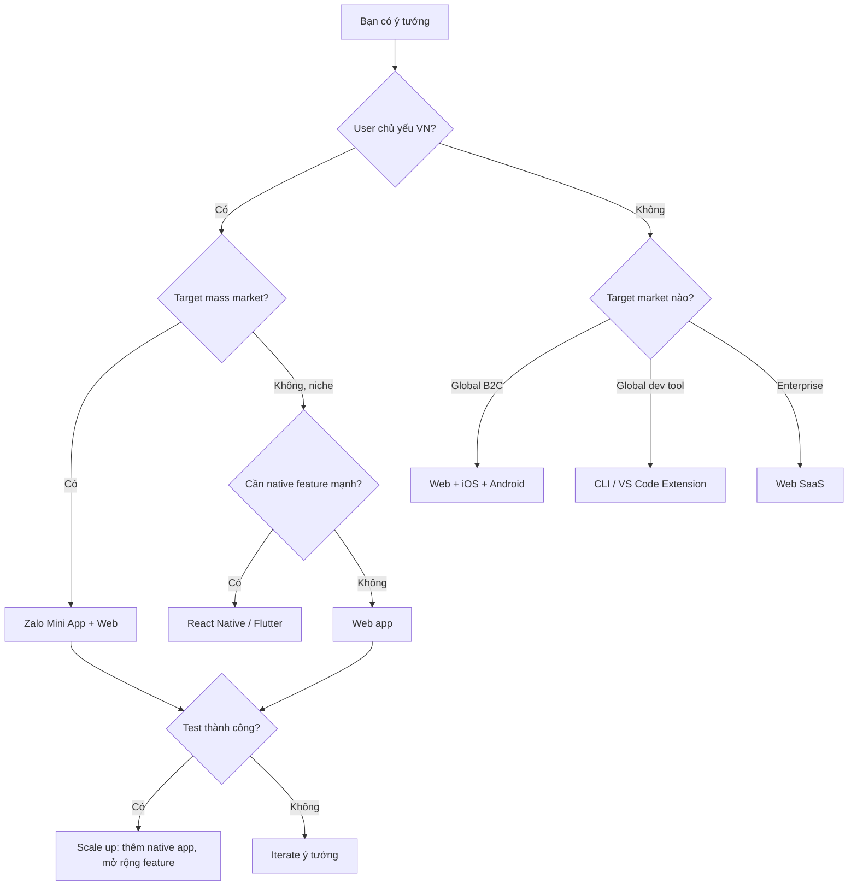

# Cách chọn platform phù hợp cho app của bạn

::: tip Adapt cho thị trường VN 2026
Bài gốc viết cho thị trường Trung Quốc (WeChat, Douyin...). Tôi đã adapt sang VN context:
- **WeChat Mini Program** → **Zalo Mini App** (VN equivalent, 75M+ user)
- **Alipay Mini Program** → **MoMo Mini App** / **VNPay**
- **Douyin/Xiaohongshu** → **TikTok / Lemon8**
- **HarmonyOS** → vẫn cover (Huawei có market VN)
- Bổ sung: trend AI native app, edge AI, no-code platform

Chi tiết VN-specific ở [Phụ lục cuối bài](#phụ-lục-platform-cho-thị-trường-vn-2026).
:::

Bạn có 1 ý tưởng, muốn biến nó thành sản phẩm thật. Nhưng đối mặt nhiều lựa chọn platform — Zalo Mini App, iOS App, Android App, website, browser extension, desktop program... bạn nên bắt đầu từ đâu?

::: tip 💡 Điều hướng nhanh
Nếu đã biết đặc điểm các platform, có thể nhảy thẳng tới [Phần 2](#_2-tự-hỏi-3-câu) để bắt đầu flow quyết định, hoặc xem [Phần 7 decision flowchart](#_7-tổng-kết-flow-quyết-định).
:::

Bài này giúp bạn làm rõ tư duy, theo scenario cụ thể, tìm platform phù hợp nhất.

## 1. Nhận diện các platform

Trước khi bàn "chọn cái nào", hiểu "có những cái gì". Dưới là phân loại platform mainstream hiện tại:

### 1.1 Platform mobile

#### iOS native App

App trên iPhone tải từ App Store là iOS native App. Đặc điểm: tốc độ mở nhanh, dùng mượt, call được tất cả function điện thoại (camera, GPS, health data...). Nhưng dev phải dùng Mac, và phải qua Apple review để publish.

**Case phổ biến**: Zalo, Facebook, TikTok, Shopee, Lazada, MoMo, MoMo, VNPay, Viettel Money

#### Android native App

App trên Android tải từ Play Store hoặc bạn bè share APK install. Tương tự iOS nhưng user Android nhiều hơn (~85% VN market share), channel phân phối đa dạng hơn. Nhược: nhiều dòng Android, dev phải adapt nhiều screen và OS version.

**Case phổ biến**: tất cả app phổ biến VN đều có Android version. Đặc biệt: Tasker, Termux, AirDroid (power user tool)

#### Zalo Mini App

App nhỏ trong Zalo (giống WeChat Mini Program ở Trung). User scan QR hoặc search trong Zalo, không cần download install. Lợi: ngưỡng user thấp — 75M+ user VN có Zalo, mở 1 click. Nhược: function hạn chế, chỉ chạy trong Zalo, ra khỏi Zalo không dùng được.

**Case phổ biến**: Tiki Mini App, Lazada Mini App, AhaMove, Be Mini App, các shop nhỏ B2C, booking lịch hẹn

#### PWA (Progressive Web App)

Nghe technical, thực ra là "website cài được như App". Mở website trên mobile browser, popup "Add to Home Screen", tap → có icon trên desktop, mở lên như App. Lợi: 1 set code chạy cả mobile và PC. Nhược: nhiều người không biết tính năng này.

**Case phổ biến**: Twitter Lite, Starbucks, Pinterest, Uber, Spotify Web Player. VN: VnExpress PWA, Tinhte PWA, 1 số e-commerce PWA

### 1.2 Platform desktop

#### Electron desktop program

Bạn có thể dùng hàng ngày: VS Code, Slack, Discord, Notion, Figma — đều viết bằng Electron. Đặc điểm: dùng tech web (HTML, CSS, JavaScript) viết desktop software, 1 set code chạy Windows, Mac, Linux. Nhược: installer khá lớn, runtime tốn RAM hơn.

**Case phổ biến**: VS Code, Slack, Discord, Notion, Figma, Cursor, WhatsApp Desktop, Zalo Desktop

#### Qt desktop app

Nếu dùng VirtualBox, OBS, KiCad — có thể là Qt. Viết bằng C++, performance tốt, ổn định cao, đặc biệt phù hợp scenario industrial. Nhưng ngưỡng học cao, cần biết C++.

**Case phổ biến**: VirtualBox, Autodesk Maya, Telegram Desktop, OBS Studio, các tool industrial HMI

#### Native desktop app

Các "heavy" software thường viết native. Windows dùng C# hoặc C++, Mac dùng Swift. Performance tốt nhất, trải nghiệm mượt nhất, nhưng Windows và Mac version phải dev riêng, cost cao.

**Case phổ biến**: Microsoft Office, Adobe Photoshop, Final Cut Pro, AutoCAD

### 1.3 Platform Web

#### Website

Page mở trong browser khi gõ URL. Lợi: mọi device đều truy cập được (mobile, PC, tablet), không cần install, search engine search được. Nhược: phải online, offline không dùng được.

**Case phổ biến**: Shopee.vn, Lazada.vn, Vietnamnet, Báo Mới, GitHub, ChatGPT

#### Browser extension

Đã cài Adblock, translate tool, password manager chưa? Đó là browser extension. Sống trong browser, đọc và sửa nội dung page bạn đang xem được. Ví dụ: cài extension dịch, mở page tiếng Anh là dịch 1 click. Lợi: nhẹ, start theo browser. Nhược: chỉ làm việc trong browser, và extension Chrome/Edge/Firefox không thông nhau.

**Case phổ biến**: AdBlock Plus, Immersive Translate, 1Password, Grammarly, Tampermonkey, Dark Reader

### 1.4 Platform khác

#### VS Code extension

Nếu bạn là dev, đa số đã dùng VS Code. VS Code extension là "add-on" cho nó. Lợi: user dev rất precise. Nhược: chỉ hữu ích cho dev.

**Case phổ biến**: Prettier, GitLens, GitHub Copilot, ESLint, Live Server, Vietnamese Language Pack

#### NFT smart contract

NFT bạn có thể đã nghe — các "digital avatar" bán hàng triệu USD. NFT bản chất là "ownership certificate" trên blockchain, chứng minh 1 digital item thuộc về bạn. Smart contract là program chạy trên blockchain, dùng tạo và quản lý NFT. Lợi: không thể tamper, tradeable. Nhược: ngưỡng technical cao, market biến động lớn.

**Case phổ biến**: BAYC, CryptoPunks, NBA Top Shot. VN: 1 số art project, Sky Mavis Origin (Axie creator)

### 1.5 Có lựa chọn nào khác?

Ngoài các cái trên, còn 1 số "đường giữa" và nhiều khả năng khác:

#### Framework cross-platform

::: details Click xem chi tiết framework cross-platform

**React Native / Flutter**: muốn cùng lúc làm iOS và Android nhưng không muốn viết 2 set code? 2 framework này cho phép viết 1 set, tự gen App 2 platform. Nhiều công ty dùng: Airbnb, Instagram, Discord (RN), Google Pay, Alibaba (Flutter). VN: VinID dùng Flutter, Tiki app dùng RN partial.

**Tauri**: "lightweight version" của Electron. Cũng dùng web tech viết desktop, nhưng installer nhỏ hơn, run nhanh hơn. Nhược: ecosystem chưa mature.

**Capacitor / Ionic**: đã có website, muốn nhanh biến thành App? 2 tool này "wrap" website thành App, user tải từ App Store install.

Bản chất các framework này tìm balance giữa "native" và "Web" — hiệu suất dev cao hơn, nhưng performance và trải nghiệm hơi compromise.
:::

#### Ecosystem mini-app VN

::: details Click xem chi tiết mini-app VN

**Zalo Mini App**: 75M+ user. Ngôn ngữ chính cho B2C bot, booking, e-commerce nhỏ ở VN.

**MoMo Mini App**: 30M+ user, mạnh ở payment/fintech, financial service.

**VNPay Mini App**: integrated với VNPay ecosystem, mạnh ở merchant tool.

**Shopee Mini Program (limited)**: trong Shopee app, brand có thể có mini space.

**Lazada LazMall**: tương tự, cho enterprise brand.
:::

#### Ecosystem HarmonyOS

**HarmonyOS App (Huawei)**: Huawei phone, tablet, watch, IoT đều chạy. Dev bằng ArkTS (giống TypeScript), 1 set code multi-device. Nếu user bạn dùng Huawei (~5-8% market VN, focus Tier 2-3 cities), hoặc muốn IoT linkage, HarmonyOS là option.

#### Tool dev khác

::: details Click xem chi tiết tool dev khác

**CLI tool**: dev dùng terminal hàng ngày. Tạo 1 CLI tool có thể automation việc lặp, gen code template, deploy project. Ví dụ `create-react-app`, `git`, `npm`. Phù hợp dev efficiency tool, DevOps automation.

**JetBrains plugin**: ngoài VS Code, nhiều dev dùng IntelliJ IDEA, PyCharm, WebStorm. Nếu tool của bạn target Java, Python, frontend dev, marketplace JetBrains đáng xét.

**Cursor / Windsurf extension**: ecosystem mới của AI coding tool. Nếu muốn làm function AI-assisted coding, ecosystem extension của các IDE mới này đang grow nhanh.
:::

#### Bot cộng đồng

::: details Click xem chi tiết bot cộng đồng

**Telegram Bot**: user overseas nhiều, API friendly. Phù hợp notification push, automation task, community management. Nhiều crypto project, dev community dùng Telegram. VN: nhiều group cộng đồng tech dùng.

**Discord Bot**: cộng đồng game, dev mainstay. Music play, game data query, server management. Nếu user là gamer hoặc dev overseas, Discord Bot là must-have.

**Zalo OA Bot**: trong VN context, **Zalo OA + bot** quan trọng hơn Telegram/Discord. CSKH, marketing, e-commerce VN đều cần.
:::

#### Tool design và productivity

::: details Click xem chi tiết tool design

**Figma plugin**: designer dùng Figma hàng ngày. Plugin có thể automation design flow, gen code, manage design system. Phù hợp tool design, frontend dev aid.

**Notion plugin**: qua Notion API có thể automation workflow, sync data, gen report. Phù hợp knowledge management, project management tool.
:::

#### Spatial computing

**visionOS app (Apple Vision Pro)**: kỷ nguyên mới của spatial computing. Phù hợp 3D content display, immersive experience, education, virtual collaboration. Ngưỡng technical cao, nhưng nếu muốn explore frontier, đây là hướng tương lai.

---

## 2. Tự hỏi 3 câu

Trước khi chọn platform, trả lời 3 câu core:

<el-card shadow="hover" style="margin: 20px 0; border-radius: 12px; border-left: 4px solid #409EFF;">
  <template #header>
    <div style="display: flex; align-items: center; gap: 8px;">
      <span style="font-size: 20px;">🎯</span>
      <span style="font-weight: bold; font-size: 16px;">Câu 1: user của bạn ở đâu?</span>
    </div>
  </template>
  <div style="line-height: 1.8; color: #606266;">
    <ul>
      <li>User có cần dùng mọi lúc mọi nơi? (mobile ưu tiên)</li>
      <li>User có quen làm mọi thứ trong Zalo? (Zalo Mini App)</li>
      <li>User có dùng lâu trong scenario office? (desktop program)</li>
      <li>User có cần tìm bạn qua search engine? (website)</li>
    </ul>
  </div>
</el-card>

<el-card shadow="hover" style="margin: 20px 0; border-radius: 12px; border-left: 4px solid #67C23A;">
  <template #header>
    <div style="display: flex; align-items: center; gap: 8px;">
      <span style="font-size: 20px;">⚡</span>
      <span style="font-weight: bold; font-size: 16px;">Câu 2: app của bạn cần năng lực gì?</span>
    </div>
  </template>
  <div style="line-height: 1.8; color: #606266;">
    <ul>
      <li>Có cần call camera, microphone, GPS, hardware?</li>
      <li>Có cần dùng offline?</li>
      <li>Có cần push notification?</li>
      <li>Có cần xử lý nhiều data local?</li>
    </ul>
  </div>
</el-card>

<el-card shadow="hover" style="margin: 20px 0; border-radius: 12px; border-left: 4px solid #E6A23C;">
  <template #header>
    <div style="display: flex; align-items: center; gap: 8px;">
      <span style="font-size: 20px;">💰</span>
      <span style="font-weight: bold; font-size: 16px;">Câu 3: budget và timeline của bạn?</span>
    </div>
  </template>
  <div style="line-height: 1.8; color: #606266;">
    <ul>
      <li>Bạn có Mac dev iOS không? Có team Android không?</li>
      <li>Cần launch trong bao lâu? (1 tuần / 1 tháng / 6 tháng)</li>
      <li>Budget bao nhiêu? (cá nhân / startup / enterprise)</li>
      <li>Có team dev không hay solo?</li>
    </ul>
  </div>
</el-card>

## 3. Scenario thường gặp và đề xuất

### Scenario 1: thử ý tưởng nhanh (1-2 ngày)

**Cảnh**: bạn có ý tưởng, muốn test xem có ai dùng không, chưa muốn invest nhiều.

**Đề xuất**: **Web app (Next.js / SvelteKit)**
- Deploy lên Vercel free
- 1 link share là user dùng được
- Iterate trong vài giờ
- SEO bonus

**Stack đề xuất**: Next.js + Tailwind + Supabase + Vercel

### Scenario 2: target user phổ thông VN (consumer)

**Cảnh**: app cho mass market VN — booking, e-commerce nhỏ, dịch vụ địa phương.

**Đề xuất**: **Zalo Mini App** + website làm SEO
- 75M user Zalo có sẵn, không cần download
- Tích hợp Zalo OA cho marketing
- Payment qua Zalo Pay native
- Website cho SEO Google

### Scenario 3: cần năng lực native (camera, AR, offline)

**Cảnh**: app cần dùng heavy hardware feature.

**Đề xuất**: **React Native** hoặc **Flutter**
- 1 codebase cho cả iOS và Android
- Access native API qua plugin
- Community lớn, nhiều plugin

**Khi nào dùng native riêng**: nếu cần performance tối đa (game, AR/VR, video editing) hoặc dùng feature mới nhất của iOS/Android.

### Scenario 4: tool dev hoặc productivity

**Cảnh**: tool cho dev hoặc power user.

**Đề xuất**:
- **VS Code extension** nếu target dev
- **CLI tool** nếu cần automation
- **Electron app** nếu cần UI rich
- **Browser extension** nếu enhance web experience

### Scenario 5: app enterprise B2B

**Cảnh**: tool cho doanh nghiệp, multi-user, complex workflow.

**Đề xuất**: **Web app SaaS**
- Browser-based, không cần install
- Easy update, no version fragmentation
- Multi-tenant
- SSO integration easy

**Stack**: Next.js / React + Node.js / Go + Postgres + Stripe/VNPay

### Scenario 6: game

**Cảnh**: bạn muốn làm game.

**Đề xuất**:
- **Casual mobile game**: Unity (cross-platform, mature) hoặc Godot (free, lightweight)
- **Web game**: PixiJS, Phaser hoặc Three.js cho 3D
- **PC game**: Unity hoặc Unreal Engine
- **Hyper-casual cho TikTok**: HTML5 game embed

### Scenario 7: experiment với AI

**Cảnh**: prototype AI app.

**Đề xuất**: **Streamlit / Gradio** (Python) → fastest cho AI demo
- Setup vài giờ
- Built-in UI cho text, image, audio
- Deploy Hugging Face Spaces free
- Sau scale up qua Next.js + API riêng

## 4. So sánh chi phí dev

| Platform | Setup time | Time to MVP | Cost dev |
|---|---|---|---|
| Web app | 1h | 1-2 tuần | Free (chỉ domain) |
| Zalo Mini App | 1h | 1-2 tuần | Free + Zalo verification |
| PWA | 30 phút | 1 tuần | Free |
| React Native / Flutter | 1 ngày | 2-4 tuần | Apple $99/năm + Google $25 |
| iOS native | 1 ngày | 1-2 tháng | Apple $99/năm + Mac |
| Android native | 1 ngày | 1-2 tháng | Google $25 |
| Electron | 1h | 2-3 tuần | Free + code signing $100-500/năm |
| Qt | 1 ngày | 1-3 tháng | Free (LGPL) hoặc commercial $5000+ |
| VS Code extension | 30 phút | 1 tuần | Free |
| Browser extension | 30 phút | 1 tuần | Free + Chrome dev account $5 one-time |
| NFT smart contract | 1 ngày | 1-2 tuần | Gas fee $50-500 |

## 5. Distribution và discovery

| Platform | Cách user tìm bạn |
|---|---|
| Website | Google SEO, social share, ads |
| Zalo Mini App | Zalo OA marketing, QR code, ads in Zalo |
| iOS App | App Store search, ASO |
| Android App | Play Store search, ASO, sideload |
| PWA | Search, share link |
| Browser extension | Chrome Web Store search |
| VS Code extension | Marketplace search |
| Desktop app | Website download, GitHub release |

## 6. Maintenance & update

| Platform | Update frequency | User update friction |
|---|---|---|
| Web app | Real-time | Zero (just refresh) |
| Zalo Mini App | Need re-review (1-3 days) | Auto on next open |
| PWA | Real-time | Zero (service worker auto-update) |
| iOS App | Apple review 24-48h | User tap update |
| Android App | Google review few hours | User tap update or auto |
| Electron | Auto-updater built-in | User accept update |
| Desktop native | Manual download | User download installer |
| Browser extension | Chrome auto-update | Zero |

## 7. Tổng kết: flow quyết định



**Nguyên tắc vàng**: bắt đầu **đơn giản nhất** có thể test idea. Đừng build native app cho ý tưởng chưa validated. Web/Zalo Mini App đầu tiên → user feedback → scale up.

---

# Phụ lục: Platform cho thị trường VN 2026

## A. Landscape platform VN cuối 2025

**Market share OS mobile VN** (theo StatCounter Q4/2025):
- Android: ~85%
- iOS: ~14%
- Others: <1%

**Top 10 app phổ biến VN**:
1. Zalo (98% smartphone user)
2. Facebook (95%)
3. TikTok (80%)
4. YouTube (90%)
5. Shopee (75%)
6. Lazada (50%)
7. MoMo (60%)
8. Grab (55%)
9. Viettel Money (40%)
10. Be / Gojek (30%)

**Insight**: Zalo là entry-point dominant cho mass market VN. Build Zalo Mini App = unlock 75M+ user instant.

## B. Zalo Mini App ecosystem 2026

**Tại sao Zalo Mini App quan trọng cho VN**:
- 75M+ MAU
- Tích hợp Zalo Pay native (payment frictionless)
- Zalo OA cho marketing reach
- Việt-hoá tốt (UI, support tiếng Việt)
- Approval review thường 1-3 ngày
- Free hosting trên Zalo platform

**Use case phù hợp Zalo Mini App**:
- Booking dịch vụ (salon, sửa xe, đặt vé)
- E-commerce nhỏ (shop riêng)
- Loyalty / membership card
- Booking lịch hẹn
- Local service finder
- Mini game viral

**Use case KHÔNG phù hợp**:
- App phức tạp (banking, trading)
- Cần performance cao (game 3D, AR)
- Cần background process
- Need access full hardware

## C. So sánh native app vs cross-platform cho VN 2026

| Tiêu chí | iOS/Android native | React Native | Flutter | Zalo Mini App |
|---|---|---|---|---|
| Dev cost | Cao nhất | Trung | Trung | Thấp nhất |
| Performance | Tốt nhất | Tốt | Rất tốt | Trung |
| User acquisition | Khó (App Store) | Khó | Khó | Dễ (Zalo) |
| Update time | 1-3 ngày review | 1-3 ngày | 1-3 ngày | 1-3 ngày |
| VN team availability | High | High | Medium | High |
| Setup payment VN | Phải tích hợp riêng | Phải tích hợp riêng | Phải tích hợp riêng | Built-in ZaloPay |
| Best for | Brand app lớn | MVP nhanh | App phức tạp | SMB, niche |

## D. Stack đề xuất cho VN dev 2026

### Stack 1: "VN-first" startup

```
Frontend: Zalo Mini App + PWA backup
Backend: Node.js + Express + Supabase (PostgreSQL)
Payment: ZaloPay + MoMo + VNPay
Shipping: GHTK / GHN API
Auth: Zalo OAuth + email
Hosting: Vercel (frontend) + Hetzner (backend)
Analytics: Posthog self-host (free)
```

### Stack 2: "international + VN" startup

```
Frontend: React Native (iOS + Android + Web)
Backend: Node.js / Bun + Hono
Database: Supabase
Payment: Stripe (global) + VNPay (VN)
Auth: Supabase Auth
Hosting: Vercel + Fly.io
i18n: Vietnamese + English + Thai
```

### Stack 3: "AI-native" app

```
Frontend: Next.js 14 + Tailwind + shadcn/ui
AI Layer: Anthropic Claude + Gemini
Vector DB: Qdrant / Pinecone
Backend: Edge functions (Vercel / Cloudflare)
Payment: Stripe subscription
Hosting: Cloudflare Workers
```

## E. Trend 2026 đáng chú ý

1. **AI-native apps trên rise**: ChatGPT, Claude, Perplexity là pattern mới. Build app với LLM là first-class citizen, không phải feature thêm.

2. **Edge AI**: model local trên device (Apple Intelligence, Google AI Edge). Giảm latency, privacy tốt hơn.

3. **No-code/low-code mature**: Bubble, Glide, Adalo cho non-dev build app. v0, Lovable cho AI gen full app.

4. **Mini App as platform**: Zalo (VN), WeChat (CN), Line (JP/TW), KakaoTalk (KR), Telegram Mini Apps (global) — pattern "super app" lan rộng.

5. **PWA renaissance**: với iOS 17.4+ EU mở cửa, PWA dần khả thi cho Apple ecosystem.

6. **Cross-platform AI agents**: agent build 1 lần, deploy mọi channel (Slack, Discord, Zalo, web, mobile).

## F. Decision matrix update cho VN dev 2026

| Use case VN | Stack 2026 |
|---|---|
| **Shop online riêng** | Zalo Mini App + Shopify/Haravan storefront |
| **CSKH automation** | Zalo OA + Smax.ai bot + n8n workflow |
| **Local service booking** | Zalo Mini App + Supabase + GHTK |
| **Personal blog / portfolio** | Next.js + Vercel + GitHub Pages |
| **Internal team tool** | Web SaaS (Next.js + Supabase + Vercel) |
| **AI chatbot for biz** | Streamlit/Gradio prototype → Next.js production |
| **Game indie** | Godot + itch.io (PC) / Unity (mobile) |
| **Dev tool** | CLI + VS Code extension + web docs |
| **Browser extension cho VN** | Chrome extension (Manifest V3) |
| **Newsletter / community** | Beehiiv/Substack + Discord/Zalo group |

## G. Mistake thường gặp khi chọn platform

1. **"Tôi muốn làm cả iOS + Android + Web từ đầu"** → over-engineering. Validate 1 platform trước.
2. **"Build Zalo Mini App rồi mới làm Web"** → ngược lại: Web SEO, brand trust. Zalo cho user acquisition.
3. **"React Native nhanh hơn native"** → đúng cho MVP, sai cho long-term performance app.
4. **"Flutter cho mọi thứ"** → Flutter ecosystem still smaller than RN cho VN libraries.
5. **"VS Code extension là dễ"** → marketplace cạnh tranh khủng, cần USP rõ.
6. **"NFT là tương lai"** → vẫn là volatile market, không cho most use case.
7. **"Native = always better"** → cho 80% use case, web/cross-platform đủ tốt.

## H. Câu hỏi tự assess

Trước khi commit platform, trả lời:

1. **User persona**: ai dùng? Tuổi gì? Tech-savvy không? Dùng device gì?
2. **MVP scope**: feature tối thiểu để validate? Bao lâu build được?
3. **Distribution**: làm sao user biết về bạn? SEO? Ads? Word-of-mouth?
4. **Monetization**: free + ads? Subscription? Transaction fee? Premium?
5. **Team**: 1 mình hay team? Có expertise gì sẵn?
6. **Timeline**: launch khi nào? Quarterly milestone?
7. **Pivot risk**: nếu ý tưởng không work, switch dễ không?

Có câu trả lời rõ → platform tự lộ ra.

::: tip
Đừng chọn platform **vì hot**. Chọn vì **fit nhu cầu**. NFT hot 2021, AI hot 2024, AR hot ?, nhưng platform đúng cho startup bạn vẫn có thể là web SaaS đơn giản từ 2010.
:::

## Sources

- [StatCounter: OS market share VN 2025](https://gs.statcounter.com/os-market-share/mobile/vietnam)
- [Zalo Mini App developer docs](https://mini.zalo.me/)
- [Anthropic: Building AI-first apps](https://www.anthropic.com/engineering/building-ai-first)
- [React Native vs Flutter 2026](https://medium.com/@reactnative/comparison)
- [Vercel: Web vs native debate](https://vercel.com/blog/web-vs-native)
