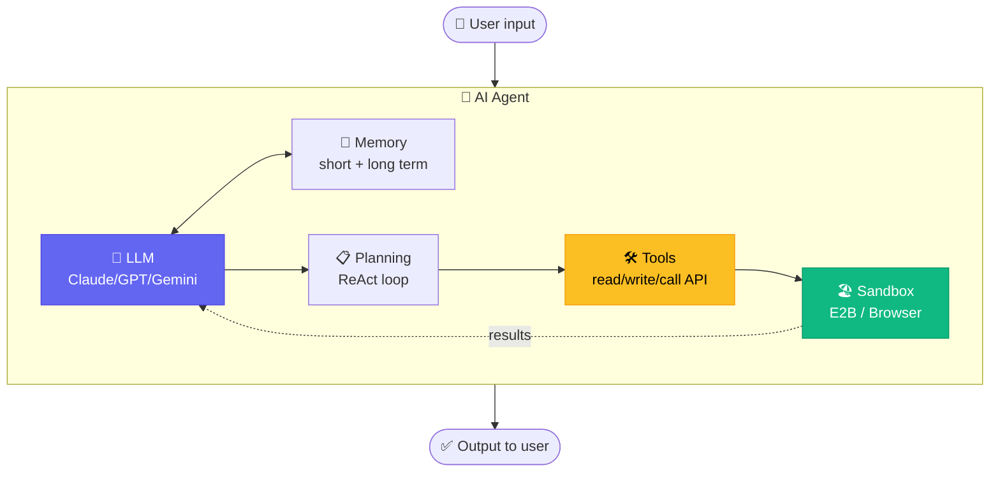
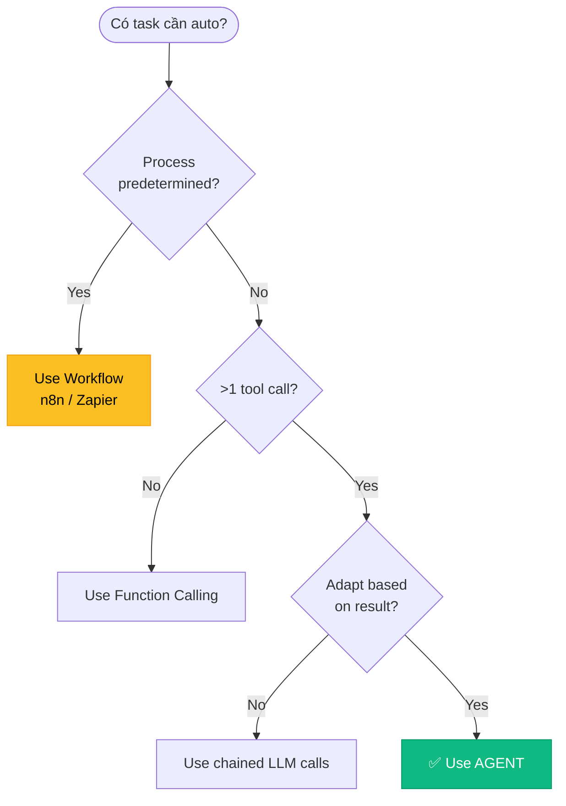

# Chapter 1 — AI Agent Foundation 101

<p style="font-size: 48px; line-height: 1; margin: 0 0 12px;">🧠</p>

> **"AI agent ≠ chatbot. Agent biết tự lập kế hoạch, gọi tool, quan sát kết quả, lặp lại."**

::: tip 🎯 Bạn sẽ học
- 🤔 **AI Agent là gì** — 5 thành phần (LLM + Tools + Memory + Planning + Sandbox)
- 🆚 **Agent vs Chatbot vs Workflow vs Function Calling** — phân biệt rõ
- 🔄 **Agent Loop** chi tiết (ReAct, Reflexion patterns)
- 🛠️ **Frameworks landscape 2026** — Claude Code SDK, LangGraph, CrewAI
- 🧪 **Hands-on**: build first ReAct agent trong 30 phút (working code)
:::

> ⚠️ **Note**: Đây là chapter FOUNDATION. Bạn cần nắm vững trước khi đi tiếp Ch2-Ch6.

---

## 01 AI Agent là gì? — 5 thành phần

::: tip 🧩 Công thức đơn giản
**AGENT = LLM + Tools + Memory + Planning + Sandbox**

Không có 4 thành phần còn lại → chỉ là **LLM raw** (ChatGPT chat).
:::

### 5 thành phần chi tiết

**1. 🧠 LLM (Large Language Model) — "Bộ não"**
- Claude Sonnet 4.6 / Opus 4.7 / GPT-5.4 / Gemini 3 Pro
- Quyết định: nghĩ gì, làm gì tiếp theo
- KHÔNG đủ một mình — chỉ generate text

**2. 🛠️ Tools — "Tay chân"**
- Function agent có thể GỌI: read_file, write_file, search_web, send_email, call_api
- Mỗi tool có: tên, mô tả, input schema, output
- Agent xem mô tả → quyết định khi nào gọi tool nào

**3. 🧠 Memory — "Trí nhớ"**
- **Short-term**: conversation history trong context window
- **Long-term**: vector DB (Mem0, Zep), graph DB, structured data
- **Episodic**: cross-session continuity (Letta, MemGPT)

**4. 📋 Planning — "Kế hoạch"**
- Trước khi action, agent **lập kế hoạch** từng bước
- Pattern: **ReAct** (Thought → Action → Observation), **Plan-and-Execute**, **Reflexion**

**5. 🏖️ Sandbox — "Hộp cát"**
- Môi trường isolated để agent execute code an toàn
- E2B microVM, Browserbase, Daytona
- Tránh agent destroy production data

### Diagram



---

## 02 Agent vs Chatbot vs Workflow vs Function Calling

::: warning ⚠️ KHÔNG nhầm lẫn — 4 khái niệm khác nhau

| Feature | Chatbot | Function Calling | Workflow | **AI Agent** |
|------|------|------|------|------|
| **LLM** | ✅ | ✅ | Optional | ✅ |
| **Tools** | ❌ | ✅ (1 tool/turn) | ✅ (predefined) | ✅ (dynamic) |
| **Memory** | Context only | Context only | State machine | Persistent |
| **Planning** | ❌ | ❌ | Static graph | **Dynamic** |
| **Loop** | ❌ Single turn | ❌ Single turn | Fixed flow | **Yes — until done** |
| **Adaptability** | None | Low | Medium | **High** |
| **Ví dụ** | ChatGPT chat | Weather bot | n8n flow | Claude Code, Devin |
:::

### Khi nào dùng cái nào?

**Chatbot** — khi:
- User chỉ cần hỏi-đáp
- Không cần action thực tế
- Ví dụ: FAQ bot, knowledge Q&A

**Function Calling** — khi:
- 1 action đơn giản predictable
- Không cần loop
- Ví dụ: "Lấy thời tiết Hà Nội" → call weather API → return

**Workflow** — khi:
- Process xác định trước (A → B → C → D)
- Cần determinism + reliability
- Ví dụ: order → check stock → charge → ship → email (n8n)

**Agent** — khi:
- Task phức tạp, **không biết trước bao nhiêu bước**
- Cần adapt theo kết quả từng step
- Ví dụ: "Audit codebase cho security issues" — agent tự decide grep gì, đọc file nào, report ra sao

---

## 03 Agent Loop chi tiết — ReAct Pattern

::: tip 🔄 ReAct = REasoning + ACTing
Pattern phổ biến nhất 2026 cho production agent.
:::

### Loop 4 bước (lặp lại đến khi xong)

```
1. 💭 THOUGHT
   "Tôi cần làm gì tiếp theo?"
   LLM reason về task hiện tại

2. 🔧 ACTION
   "Gọi tool X với input Y"
   LLM emit tool call

3. 👁️ OBSERVATION
   "Tool trả về kết quả Z"
   System execute tool + return result vào context

4. 🔁 LOOP BACK to THOUGHT
   "Đã đủ thông tin chưa? Cần bước tiếp?"
   Tiếp tục đến khi LLM emit final answer
```

### Interactive demo

<AgentLoopDemo />

→ Click "Run step" để xem từng iteration agent reasoning.

### Pattern variations 2026

| Pattern | Khi dùng | Trade-off |
|------|------|------|
| **ReAct** ⭐ | Default 90% case | Simple, hiệu quả, dễ debug |
| **Plan-and-Execute** | Long-horizon task | Plan trước, execute sau — ít wasted token |
| **Reflexion** | Critical task (medical, legal) | Self-critique → improve accuracy 5-15% (tốn 3x token) |
| **Tree-of-Thoughts** | Math, reasoning hard | Explore multiple paths — chỉ research, ít production |

---

## 04 Khi nào BUILD agent vs KHÔNG build?

::: tip ✅ BUILD agent khi
- Task phức tạp, **không biết trước bao nhiêu bước**
- Cần **adapt** theo kết quả từng bước
- **Multi-tool** orchestration (DB + API + web search)
- **Long-running** task (>5 phút, không thể 1 LLM call duy nhất)
- Value per task > $0.10 (worth token cost)
:::

::: warning ❌ KHÔNG build agent khi
- Task đơn giản → dùng function calling
- Process xác định trước → dùng workflow (n8n)
- Realtime < 1s latency → agent quá chậm
- Value per task < $0.01 → cost > revenue
- Cần 100% deterministic → agent có variability
:::

### Decision tree



---

## 05 Frameworks Landscape 2026

::: tip 🛠️ 6 frameworks chính

| Framework | Maker | Best for | Status 2026 |
|------|------|------|------|
| **Claude Code SDK** | Anthropic | Claude-first agent, MCP integration | ✅ Active, production |
| **LangGraph** | LangChain | Production multi-agent (Klarna, Uber, LinkedIn) | ✅ v1.0 stable |
| **CrewAI** | CrewAI Inc | Quick prototype, role-based | ✅ 150+ enterprise |
| **OpenAI Agents SDK** | OpenAI | OpenAI-native | ✅ v0.17 stable (replaces Swarm) |
| **A2A Protocol** | Google → Linux Foundation | Cross-vendor agent comm | ✅ 150+ orgs |
| ~~AutoGen~~ | Microsoft | — | ❌ Maintenance mode |
:::

### Pick framework — quick guide

```
Bạn cần?
├── Claude-first + MCP integration → Claude Code SDK
├── Production multi-agent, observability → LangGraph
├── Prototype nhanh, role-based metaphor → CrewAI
├── OpenAI ecosystem → OpenAI Agents SDK
└── Cross-vendor agent ↔ agent → A2A Protocol
```

→ Chi tiết frameworks ở **[Chapter 4 Multi-Agent](./4-multi-agent.md)** và **[Chapter 6 MCP](./6-mcp-ecosystem.md)**.

---

## 06 🧪 Hands-on Lab — Build First ReAct Agent trong 30 phút

::: tip 🎯 Goal
30 phút: build 1 agent reasoning + tool use thật, dùng Anthropic Claude API. Output: agent giải bài toán "Today's weather in Hà Nội + suggest outfit".
:::

### Prerequisites checklist

```
□ Anthropic API key ($5 minimum top-up — anthropic.com/api)
□ Python 3.10+ HOẶC Node.js >= 18
□ 30 phút tập trung
```

### Step 1. Setup (5 phút)

**Python option**:
```bash
mkdir first-agent && cd first-agent
python -m venv venv && source venv/bin/activate  # Mac/Linux
pip install anthropic requests python-dotenv
echo "ANTHROPIC_API_KEY=sk-ant-..." > .env
```

**TypeScript option**:
```bash
mkdir first-agent && cd first-agent
npm init -y
npm install @anthropic-ai/sdk dotenv
npm install -D typescript tsx @types/node
echo "ANTHROPIC_API_KEY=sk-ant-..." > .env
```

### Step 2. Code first agent (15 phút)

**Python — `agent.py`**:

```python
import os
import json
import requests
from anthropic import Anthropic
from dotenv import load_dotenv

load_dotenv()
client = Anthropic()

# === DEFINE TOOLS ===
TOOLS = [
    {
        "name": "get_weather",
        "description": "Get current weather for a city. Returns temperature, condition, humidity.",
        "input_schema": {
            "type": "object",
            "properties": {
                "city": {"type": "string", "description": "City name, e.g., 'Hanoi'"}
            },
            "required": ["city"]
        }
    },
    {
        "name": "suggest_outfit",
        "description": "Suggest clothing based on weather conditions.",
        "input_schema": {
            "type": "object",
            "properties": {
                "temp_celsius": {"type": "number"},
                "condition": {"type": "string", "description": "sunny/rainy/cloudy/cold"}
            },
            "required": ["temp_celsius", "condition"]
        }
    }
]

# === IMPLEMENT TOOLS ===
def get_weather(city):
    # Mock — real: call weather API
    weather_data = {
        "Hanoi": {"temp": 28, "condition": "humid", "humidity": 75},
        "HCMC": {"temp": 32, "condition": "sunny", "humidity": 65},
        "Da Nang": {"temp": 30, "condition": "cloudy", "humidity": 70},
    }
    return weather_data.get(city, {"error": f"No data for {city}"})

def suggest_outfit(temp_celsius, condition):
    if temp_celsius < 20:
        return {"outfit": "warm jacket + jeans + boots", "reason": "cold weather"}
    elif temp_celsius < 28:
        return {"outfit": "long sleeve + jeans", "reason": "mild weather"}
    else:
        if condition == "sunny":
            return {"outfit": "t-shirt + shorts + cap", "reason": "hot + sunny"}
        else:
            return {"outfit": "t-shirt + light pants + umbrella", "reason": "hot + possibly rain"}

# === EXECUTE TOOL ===
def execute_tool(tool_name, tool_input):
    if tool_name == "get_weather":
        return get_weather(tool_input["city"])
    elif tool_name == "suggest_outfit":
        return suggest_outfit(tool_input["temp_celsius"], tool_input["condition"])
    return {"error": f"Unknown tool: {tool_name}"}

# === AGENT LOOP (ReAct) ===
def run_agent(user_query, max_iterations=10):
    messages = [{"role": "user", "content": user_query}]

    for iteration in range(max_iterations):
        print(f"\n🔄 Iteration {iteration + 1}")

        # 1. LLM THINKS + decides action
        response = client.messages.create(
            model="claude-sonnet-4-6",
            max_tokens=1024,
            tools=TOOLS,
            messages=messages
        )

        # Check stop condition
        if response.stop_reason == "end_turn":
            final_text = response.content[0].text
            print(f"✅ Final answer: {final_text}")
            return final_text

        # 2. EXECUTE tool calls
        tool_results = []
        for block in response.content:
            if block.type == "tool_use":
                print(f"  🔧 Action: {block.name}({block.input})")
                result = execute_tool(block.name, block.input)
                print(f"  👁️  Observation: {result}")

                tool_results.append({
                    "type": "tool_result",
                    "tool_use_id": block.id,
                    "content": json.dumps(result)
                })

        # 3. Append to messages — LOOP
        messages.append({"role": "assistant", "content": response.content})
        messages.append({"role": "user", "content": tool_results})

    return "Max iterations reached"

# === RUN ===
if __name__ == "__main__":
    query = "What's the weather in Hanoi today, and what should I wear?"
    result = run_agent(query)
```

### Step 3. Run + observe (5 phút)

```bash
python agent.py
```

**Expected output**:
```
🔄 Iteration 1
  🔧 Action: get_weather({'city': 'Hanoi'})
  👁️  Observation: {'temp': 28, 'condition': 'humid', 'humidity': 75}

🔄 Iteration 2
  🔧 Action: suggest_outfit({'temp_celsius': 28, 'condition': 'humid'})
  👁️  Observation: {'outfit': 't-shirt + jeans', 'reason': 'mild weather'}

🔄 Iteration 3
✅ Final answer: Today in Hanoi it's 28°C and humid. I suggest wearing a t-shirt with jeans...
```

→ Bạn vừa build agent THỰC SỰ! 3 thành phần đã có:
- ✅ LLM (Claude Sonnet 4.6)
- ✅ Tools (get_weather, suggest_outfit)
- ✅ Loop (ReAct pattern)

(Còn 2 thành phần Memory + Sandbox sẽ học ở Ch2-Ch6.)

### Step 4. Experiment (5 phút)

Thử các query khác:
```python
run_agent("Compare weather in Hanoi and HCMC, recommend best city for outdoor activity today")
run_agent("I'm going to Da Nang tomorrow, what should I pack?")
```

→ Quan sát: agent **tự decide** cần gọi tool nào, theo thứ tự nào. **Đó là agent.**

### 🐛 Common errors + fixes

| Error | Fix |
|------|------|
| `Authentication 401` | Check `.env` có ANTHROPIC_API_KEY đúng |
| `Tool not found` | Tool name trong TOOLS phải match với execute_tool |
| Infinite loop | Set `max_iterations=10` cap |
| Wrong tool called | Cải thiện `description` trong tool definition |

---

## 07 🏗️ Mini-Project — Build Helpdesk Agent cho VN SME

::: warning 🎯 Assignment

**Goal**: Build agent xử lý support ticket cho 1 SME VN (giả định F&B / fashion / retail).

**Requirements**:
1. **4 tools tối thiểu**:
   - `lookup_order(order_id)` — check order status
   - `check_inventory(product_name, size)` — check stock
   - `process_refund(order_id, reason)` — initiate refund (require human approval flag)
   - `escalate_to_human(reason)` — handover khi không xử lý nổi
2. **Memory**: log conversation per customer (simple JSON file OK)
3. **Multi-turn**: support follow-up questions trong 1 conversation
4. **Vietnamese language**: customer chat tiếng Việt, agent reply tiếng Việt
5. **Safety**: refund > 1M VND → require escalate

**Acceptance criteria**:
- [ ] Agent loop work (ReAct pattern)
- [ ] 4 tools implemented (có thể mock data)
- [ ] Handle 5 scenarios:
  - Customer hỏi đơn hàng status
  - Customer hỏi còn size không
  - Customer xin refund nhỏ (auto-approve)
  - Customer xin refund lớn (escalate)
  - Customer chửi → escalate ngay
- [ ] Documentation: prompt, tools, decisions

**Time estimate**: 1 weekend (8-12 giờ)

**Stretch goals** 🚀:
- Connect Smax.ai webhook → deploy production
- Add memory persistent với Supabase
- Multi-language (VN + EN)
- Pricing: $5-15K freelance cho SME thật
:::

---

## 08 🎓 Knowledge Check — 10 câu Agent Foundation

::: details 1. AI Agent KHÁC chatbot ở?
**A.** Agent dùng GPT-4, chatbot dùng GPT-3
**B.** Agent có Tools + Memory + Planning + Loop, chatbot chỉ chat ✅
**C.** Agent thu phí, chatbot free
**D.** Không khác

**Đáp án: B** — Agent = LLM + Tools + Memory + Planning + Sandbox. Chatbot chỉ là LLM raw. Đó là khác biệt cốt lõi.
:::

::: details 2. Pattern phổ biến nhất 2026 cho agent loop?
**A.** Tree-of-Thoughts
**B.** Plan-and-Execute
**C.** ReAct (Reasoning + Acting) ✅
**D.** Reflexion

**Đáp án: C** — **ReAct** là default 90% production case. Thought → Action → Observation → loop. Anthropic, OpenAI, LangGraph đều dùng ReAct làm base.
:::

::: details 3. Khi nào KHÔNG nên dùng agent?
**A.** Task phức tạp multi-step
**B.** Process xác định trước (workflow) ✅
**C.** Cần adapt theo result
**D.** Multi-tool orchestration

**Đáp án: B** — Process xác định trước → dùng workflow (n8n / Zapier). Agent thừa cost + variability. Reserve agent cho task UNPREDICTABLE.
:::

::: details 4. 5 thành phần của AI Agent?
**A.** LLM + Frontend + Backend + DB + API
**B.** LLM + Tools + Memory + Planning + Sandbox ✅
**C.** Model + Prompt + Response + History + UI
**D.** Brain + Body + Mind + Soul + Heart

**Đáp án: B** — **LLM + Tools + Memory + Planning + Sandbox**. Mỗi thành phần có vai trò riêng. Thiếu 1 = không phải agent.
:::

::: details 5. Framework production-grade 2026 cho multi-agent?
**A.** AutoGen (đã maintenance mode)
**B.** LangGraph ✅
**C.** OpenAI Swarm (đã deprecated)
**D.** Tự build

**Đáp án: B** — **LangGraph v1.0** stable, dùng bởi Klarna, Uber, LinkedIn. CrewAI cho prototype/agency. AutoGen vào maintenance mode, OpenAI Swarm deprecated (replaced by Agents SDK).
:::

::: details 6. Sandbox cần thiết vì?
**A.** Performance
**B.** Bảo vệ production data khi agent execute code/action ✅
**C.** Compress data
**D.** Caching

**Đáp án: B** — Sandbox (E2B microVM, Browserbase) **isolated environment** để agent execute code an toàn. Tránh agent destroy production data, hoặc bị prompt injection attack.
:::

::: details 7. Tool description nên viết thế nào?
**A.** Ngắn 1 từ
**B.** Mô tả rõ: name + purpose + input schema + expected output ✅
**C.** Viết tiếng Việt
**D.** Chỉ tên tool đủ

**Đáp án: B** — Tool description **rõ ràng** → LLM hiểu khi nào gọi tool nào. Mơ hồ → agent gọi nhầm tool hoặc quên tool. Pattern: name + description + JSON schema.
:::

::: details 8. Memory short-term vs long-term?
**A.** Same thing
**B.** Short = context window LLM, Long = vector DB / persistent storage ✅
**C.** Short = RAM, Long = SSD
**D.** Short = English, Long = code

**Đáp án: B** — **Short-term** = conversation trong context window (limited tokens). **Long-term** = persistent storage (Mem0, Zep, Supabase vector). Cross-session continuity cần long-term.
:::

::: details 9. Max iterations cap quan trọng vì?
**A.** Tăng tốc
**B.** Tránh infinite loop khi agent stuck ✅
**C.** Giảm bug
**D.** Tăng accuracy

**Đáp án: B** — Set `max_iterations` cap (vd 10) → tránh agent loop infinite khi không recover được error. Nếu hit cap → return "Max iterations reached" thay vì burn money.
:::

::: details 10. Agent loop bao gồm 3 bước chính nào?
**A.** Read → Process → Write
**B.** Thought → Action → Observation ✅
**C.** Input → Compute → Output
**D.** Plan → Code → Test

**Đáp án: B** — **ReAct loop**: Thought (LLM nghĩ) → Action (call tool) → Observation (đọc kết quả) → loop lại Thought. Đến khi LLM emit final answer (stop_reason = end_turn).
:::

**Score**:
- 8-10/10 ✅ Foundation vững — sẵn sàng Chapter 2 (Claude Code Deep)
- 5-7/10 ⚠️ Re-read sections 1-5
- <5/10 ❌ Redo Hands-on Lab + actually build agent

---

## 09 🇻🇳 Cơ hội cho VN dev/founder

::: tip 🚀 Bạn vừa build agent — giờ có thể làm gì?

**1. Freelance global rate $200-500/ngày**
- VN dev biết build agent + MCP = bill rate Pháp/Đức (€550-900/ngày)
- Marketplace: Toptal, Arc.dev, Lemon.io, WIP.co
- Cần: English communication + portfolio 3-5 agent projects

**2. Build product cho SME VN**
- AI Sale Agent (Smax.ai + n8n) — 100K+ SME VN chưa có
- AI Customer Care — Yody, Let's Sushi đã +15-300% growth
- Pricing: $5-15K/project + $300-1K/tháng support

**3. Build MCP cho VN platforms — blue ocean**
- MISA, KiotViet, Sapo, Pancake, Base.vn — chưa có official MCP
- Open-source build trust → paid hosted tier
- Target: $1K MRR within 6 tháng

→ Chi tiết business model: [Ch5 Workflow Agent](./5-workflow-agent.md) + [Ch6 MCP](./6-mcp-ecosystem.md)
:::

---

## 10 Lộ trình tiếp theo

Bạn vừa hiểu **WHAT là agent** + build first agent. Chương tiếp:

| Chapter | Bạn học gì tiếp |
|------|------|
| **[Ch2 Claude Code Deep](./2-claude-code-deep.md)** | Sub-agent orchestrator-worker pattern (giảm 40% cost) |
| **[Ch3 Computer Use](./3-computer-use.md)** | Agent click màn hình như người (72.5% OSWorld) |
| **[Ch4 Multi-Agent](./4-multi-agent.md)** | 4 patterns: orchestrator, debate, hierarchical, swarm |
| **[Ch5 Workflow Agent](./5-workflow-agent.md)** | n8n + Smax.ai cho VN SME (AI Sale Agent) |
| **[Ch6 MCP Ecosystem](./6-mcp-ecosystem.md)** | Standard protocol — build MCP cho VN platform |

::: warning 💡 Mantra cuối Ch1
> *"Year 2023: LLM chat bots.*
> *Year 2024: LLM function calling.*
> *Year 2025-2026: LLM **tự lái** — plan, execute, recover. Đó là **AGENT**.*
>
> *Bạn vừa build first agent của mình. Welcome to the era."*
:::
