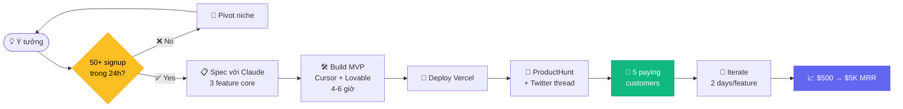

# Chapter 1 — Vibe Coding Solo

<p style="font-size: 48px; line-height: 1; margin: 0 0 12px;">💻</p>

> **"I just see stuff, say stuff, run stuff, and copy-paste stuff, and it mostly works."**
> — *Andrej Karpathy (Feb 6, 2025) — coiner của "vibe coding"*

::: tip 🎯 Bạn sẽ học
- Vibe Coding là gì + tại sao biến non-dev thành dev
- Pipeline ship product solo: idea → MVP → launch trong tuần
- 5 case 2025-2026: Pieter Levels, Lovable, Sabrine Matos, CigarSnap, Base44
- Stack vibe coding chuẩn 2026
- Cơ hội VN: dev VN freelance global €550-900/ngày
:::

---

## 01 Karpathy coined "vibe coding"

T2/2025 — **Andrej Karpathy** (cofounder OpenAI, ex-Tesla AI head) tweet:

> *"There's a new kind of coding I call 'vibe coding,' where you fully give in to the vibes, embrace exponentials, and forget that the code even exists."*

**Collins Word of the Year 2025**: "vibe coding".

### Định nghĩa thực dụng

**Vibe coding** = lập trình bằng cách:
1. **Tả ý tưởng** với AI (natural language)
2. **Accept code AI gen** (không deep-read từng dòng)
3. **Run + observe** (xem nó chạy)
4. **Lặp lại** (chỉnh prompt nếu sai)

→ Khác với "traditional coding" ở: **bạn không cần biết cú pháp** từng dòng.

### Stat T1/2026

- **63% vibe coding user là non-developer** (TechTimes Q1/2026)
- Product manager, founder, designer, domain expert đang ship full-stack app

---

## 02 Pieter Levels — solo indie hacker $3.1M/năm

### Profile

| Item | Số |
|------|------|
| Tên | **Pieter Levels** (@levelsio) |
| Quê | Hà Lan, sống Bali / Hà Lan |
| Background | 10 năm "build in public", 70+ failed startups |
| X followers | **~600K** |
| Nhân viên | **0** |

### Portfolio (T5/2026)

| Product | Status | ARR/MRR |
|------|------|------|
| **PhotoAI** | AI portrait/headshot | **$1.65M ARR** ($132K MRR T11/2025) |
| **InteriorAI** | AI interior design | ~$300K ARR |
| **NomadList** | Remote community | ~$500K ARR |
| **RemoteOK** | Remote job board | ~$300K ARR |
| **fly.pieter.com** | Browser flight game (vibe-coded) | **$0 → $1M ARR / 17 ngày** |
| **Total** | | **~$3.1M ARR** |

### fly.pieter.com — case demo

| Cột mốc | Số |
|------|------|
| Launch | T3/2025 |
| 17 ngày sau | **$1M ARR** ($87K MRR) |
| Tweet build-in-public | 4.8M view |
| Stack | three.js + raw JS + Cursor |
| Thời gian build | **3 ngày** |
| Người làm | **1 (Pieter)** |

### Quote định nghĩa

> *"Without AI it would have taken me 10-100x more time. AI really is a creativity and speed maximizer for me, making me just way more creative and more fast."*
> — *Pieter Levels*

---

## 03 Lovable — $0 → $400M ARR / 24 tháng

### Profile

**Lovable** = no-code AI app builder (Sweden).

### Numbers

| Metric | Số |
|------|------|
| Launch | T6/2023 |
| $100M ARR milestone | **Faster than OpenAI, Cursor, Wiz** — bất kỳ software company nào trước đó |
| ARR cuối 2025 | **~$400M** |
| User base | **>1M user** (cả paid + free) |

### Sabrine Matos case (Brazil)

- **Non-technical**, không background dev
- Build **safety/background-check app** với Lovable
- **$456K ARR trong 45 ngày**
- Source: [TechTimes T5/2026](https://www.techtimes.com/articles/317077/20260524/vibe-coding-non-developers-63-users-now-have-no-coding-background-breaches-follow.htm)

> **Bài học**: Lovable + niche cụ thể + ship fast = solo founder không cần dev background.

---

## 04 CigarSnap — 15 feature trong 48 giờ

### Story

| Item | Số |
|------|------|
| Founder | Matt Cretzman (solo) |
| Niche | Cigar identification + community |
| Build time | **48 giờ** |
| Feature shipped | **15** |
| Stack | Claude (prompt sequencing) → Replit Agent (execution) |

### 15 feature trong 48 giờ

1. AI cigar identification (computer vision)
2. Digital humidor
3. Tasting journal
4. Smoke session tracker
5. Social feed
6. Achievement / badge
7. Subscription billing (Stripe)
8. Referral engine
9. Push notification
10. User profile
11. Friends / following
12. Comment system
13. Photo upload + CDN
14. Search + tag
15. Admin dashboard

> **Bài học**: với AI orchestration (Claude → Replit Agent), 1 solo có thể ship MVP 15 feature trong cuối tuần.

---

## 05 Base44 — $80M exit / 6 tháng

### Story

| Item | Số |
|------|------|
| Founder | **Maor Shlomo** (Israel, solo) |
| Product | No-code AI app builder (Lovable competitor) |
| Launch | T2/2025 |
| User tháng đầu | **250K** |
| Revenue tháng đầu | **~$1.5M** |
| **Exit** | **$80M acquisition** trong **6 tháng** |

> **Bài học**: Solo founder + AI tool builder + execution velocity = pattern mới 2025-2026.

---

## 06 Pipeline Vibe Coding — 5 bước

::: tip 💻 Workflow chuẩn 2026
```
1. Idea ──→ 2. Setup ──→ 3. Vibe ──→ 4. Polish ──→ 5. Ship
   (Claude)   (template)  (Cursor)    (manual)     (Vercel)
   30 phút    1 giờ       4-8 giờ     2-4 giờ      1 giờ
```
Tổng: **1-3 ngày** cho 1 MVP shipable.
:::

### Bước 1. Idea + spec (Claude / ChatGPT)

```
Tôi muốn build [type] app cho [audience]:
- 3 core feature
- Tech stack đề xuất (cho solo, ship fast)
- Estimate time-to-MVP
- Edge case + risk

Format: Markdown.
```

### Bước 2. Setup từ template

| Stack | Template repo |
|------|------|
| **Next.js + Supabase + Stripe** | shadcn-ui / saas-starter |
| **SvelteKit + Pocketbase** | sveltekit-starter |
| **Astro + Cloudflare D1** | starlight-template |
| **PHP raw** (Pieter style) | pieter-template |

```bash
npx create-next-app@latest my-app --template saas-starter
cd my-app && npm install
```

### Bước 3. Vibe coding với Cursor / Claude Code

**Loop**:
1. Open Cursor / Claude Code
2. Prompt 1 feature ("Add user auth with Clerk")
3. Accept code
4. Test (npm run dev)
5. Prompt fix nếu bug
6. Lặp lại cho feature kế tiếp

**Best practice**:
- 1 prompt = 1 feature (không over-load)
- Đọc summary AI trước khi accept (không deep-read)
- Git commit mỗi feature work

### Bước 4. Manual polish

- Empty state
- Error message
- Loading state
- Edge case (null, max length, network fail)
- Mobile responsive
- Accessibility basic

### Bước 5. Ship

| Layer | Tool |
|------|------|
| Deploy | **Vercel** (1-click) |
| DB | Supabase / Neon |
| Auth | Clerk / Supabase Auth |
| Payment | Stripe Checkout |
| Analytics | Plausible / Vercel Analytics |
| Domain | Cloudflare / Mat Bao |

---

## 07 Prompt pack — Vibe Coding workflow

::: tip 📝 5 prompt template

**1. Idea → spec (Claude)**
```
Đề xuất MVP spec cho [idea]:
- 3 core feature (must-have only)
- User flow chính (5-7 step)
- Tech stack: Next.js + Supabase + Stripe + Clerk
- DB schema (table + key column)
- API endpoints (REST)
- Estimate time per feature

Format: Markdown với section.
```

**2. Feature implementation (Cursor / Claude Code)**
```
Add [feature description] to [page/file].
Constraints:
- TypeScript strict
- Use existing components (don't import new lib)
- Match existing style (Tailwind utility class)
- Handle error case: [list]
- Include loading state

Reference: [similar file].
```

**3. Bug fix prompt**
```
This error occurs when [trigger]:
[paste error stack]

Current code: [paste relevant function]

Hypothesis: [your guess if any]

Fix without changing API contract. Add test if applicable.
```

**4. Refactor prompt**
```
Refactor [file] to:
- Extract [X] into separate util
- Reduce nested if/else with early return
- Add JSDoc for public function

Keep behavior identical. No new feature.
```

**5. Build-in-public tweet (Claude)**
```
Viết tweet thread 5-7 tweet share progress day [N] of [product]:
- Hook tweet: 1 surprising number / fact
- 3-4 progress tweet với screenshot reference
- Closing CTA: "Try it / Follow build / Wait list"

Tone: Pieter Levels-ish, direct, no fluff.
Length: mỗi tweet < 280 ký tự.
```
:::

---

## 08 Common pitfalls

::: warning 🚨 7 sai lầm vibe coder mới

**1. Over-prompt trong 1 lần** → AI confused. Chia nhỏ feature.

**2. Không git commit thường xuyên** → khi AI gen sai, rollback khó. Commit mỗi feature.

**3. Skip testing** → app shipped đầy bug. Test critical path tối thiểu.

**4. Trust 100% code AI** → AI vẫn hallucinate API, lib. Verify critical logic.

**5. Quên security basic** → SQL injection, XSS, auth bypass. Hỏi AI audit security trước launch.

**6. Pricing quá thấp** → khó scale. Test $19-49/tháng từ đầu.

**7. Không build audience trước** → launch ra hư vô. Build Twitter trước Day 1.
:::

---

## 09 🇻🇳 Dev VN — playbook

### 🎯 3 paths khả thi

| Path | Goal | Income tiềm năng |
|------|------|------|
| **Freelance global** | Sell hour to global client với AI tool | $30-80/giờ ($550-900/ngày như France benchmark) |
| **Solo SaaS** | Build own product (như Pieter Levels) | $500-5K MRR sau 6-12 tháng |
| **Agency** | Build cho client SME VN | $1K-10K/project |

### 💰 Stack cost cho VN dev

| Item | Cost/tháng |
|------|------|
| Cursor Pro | $20 |
| Claude Pro / Max | $20-100 |
| Vercel Pro | $20 |
| Supabase Pro | $25 |
| Stripe (no monthly) | $0 |
| Domain | $1 |
| **Total** | **~$90-200/tháng** |

→ Lương VN dev $1-3K/tháng → tool cost 5-20% income. Affordable.

### 🌐 VN dev community

- **F8 community** (Sơn Đặng) — đông nhất
- **Hỏi Dân IT** (FB group + podcast)
- **Bytecode VN** (Discord)
- **IndieHackers VN** (FB group)
- **Vietnam Tech Twitter** (#vntech)

### 🏆 Indie VN founder đáng follow

- **Khánh Đào** — RoomGPT (interior AI)
- **Hieu Doan** — DevSign (design tool)
- **Various solo VN** trên IndieHackers + WIP.co

---

## 10 Bài tập

::: tip ✍️ 3 cấp độ

**Level 1 — 1 tuần**
- Idea: 1 niche AI gen tool (Chapter 4 Generate có 20 niche)
- Spec với Claude (1 giờ)
- Build MVP với Cursor (4-6 giờ)
- Deploy Vercel (30 phút)
- Post Twitter (build-in-public)

**Level 2 — 1 tháng**
- MVP live + 5 paying customer ($50-500 MRR)
- Daily build-in-public
- Pitch ProductHunt week 3-4

**Level 3 — 6 tháng**
- $1-5K MRR
- 100+ paying customer
- 5K+ Twitter follower
:::

---

## 11 🎥 Watch & Learn — 5 video tutorial

<ChapterVideos :videos="[
  { id: 'oFtjKbXKqbg', title: 'Pieter Levels — Programming, Viral AI Startups, Digital Nomad (Lex Fridman #440)', channel: 'Lex Fridman', duration: '4:00:00', why: '4h với Levelsio — stack Vanilla PHP + jQuery + SQLite, ship 40+ startup solo, build PhotoAI + fly.pieter.com. Mỗi giờ có gem.' },
  { id: 'XuSFUvUdvQA', title: 'Anthropic\'s 7-Hour Claude Code Course in 27 Minutes', channel: 'Compilation Channel', duration: '27:00', why: 'Bản nén masterclass 7h Anthropic cuối 2025 — plan mode, slash commands, parallel sessions. Solo founder ship nhanh.' },
  { id: 'gh2_PhgZGsM', title: 'Claude Code for Beginners Tutorial [Full Course]', channel: 'freeCodeCamp.org', duration: '4:00:00', why: 'Full course từ cài đặt đến advanced — phù hợp người mới muốn build app đầu tiên solo.' },
  { id: 'reUL6JUe3N4', title: 'Giải Thích Về CLAUDE SKILLS — Hướng Dẫn Cho Người Mới', channel: 'Làm Bạn Với AI', duration: '20:00', why: '🇻🇳 Tiếng Việt — Foundational concept Skills (instruction reusable). Học bằng tiếng mẹ đẻ.' },
  { id: 'goOZSXmrYQ4', title: 'My COMPLETE Agentic Coding Workflow to Build Anything', channel: 'Cole Medin', duration: '40:00', why: 'Cole Medin (185K subs) — thought leader \'context engineering\'. PRP framework + 15 Claude Code commands reusable.' }
]" />

---

## 12 🔬 Deep Dive Techniques 2026

::: tip 🚀 6 advanced techniques cho solo vibe coder

**1. One-Prompt-One-Feature Decomposition**
- Mỗi feature = 1 prompt riêng, không nhồi nhiều feature
- Khi nào: mọi MVP, đặc biệt prototype đa feature
- CigarSnap 15 features đã làm theo cách này
- Tool: Lovable, Bolt.new, Cursor Composer

**2. Vibe-to-Prod Boundary (Theanna pattern)**
- **Vibe code** = prototype with intent
- **Prod** cần: architecture review, security audit, monitoring, customer feedback loop
- Khi nào: sau khi đạt 50-100 user paying
- Tool: Cursor (refactor) + Claude Code (test + security)

**3. Stripe-First Build Order**
- Ship pricing + Stripe checkout TRƯỚC khi xây feature đẹp
- Levelsio và Sabrine đều áp dụng
- Khi nào: bất kỳ SaaS solo nào
- Tool: Lovable built-in Stripe; ShipFast template Marc Lou

**4. Mobile-First Multi-Stack**
- Build mobile (Replit Agent 3) trước, web (Lovable/Cursor) sau — đảo ngược pattern cũ
- Khi nào: consumer app target Gen Z/mobile-heavy
- Tool: Replit Agent 3 (autonomous 200 phút) → Lovable cho web

**5. Audience-First Marketing Loop (Levelsio model)**
- Build in public X/LinkedIn — Sabrine + Maor đều tăng organic từ posts daily
- Khi nào: solo không có budget marketing
- Tool: Sharing journey + revenue numbers theo cadence weekly

**6. 40-45% Vulnerability Mitigation Pass**
- Code do Bolt/Lovable/v0 tạo có **vulnerability rate 40-45%**
- Trước launch public → chạy Claude Code "security review" mode
- Khi nào: trước go-live, mỗi major release
- Tool: Claude Code 2.1.0+ với hook PreToolUse cho security gates
:::

---

## 13 📚 More Case Studies (2025-2026)

### Case A: Sabrine Matos / Plinq — **$456K ARR / 3 tháng** với Lovable

| Item | Số |
|------|------|
| Background | Growth marketer Brazil, **zero coding background**. Mất người quen vì bạo lực gia đình → build platform tra cứu criminal record |
| Stack | Lovable (full-stack) + public criminal record APIs Brazil + Stripe |
| **3-month ARR** | **$456K** (R$2.2M) |
| User tháng đầu | **10,000** |
| Tình huống nguy hiểm đã prevent | **200+** |
| Growth | **300% MoM**, đang raise R$1.5-2M seed |

> *"I built everything on Lovable — website, desktop app, backend workflows — all without engineering degree."* — Sabrine Matos
> Source: [Lovable blog](https://lovable.dev/blog/how-sabrine-matos-built-plinq)

### Case B: Marc Lou / TrustMRR — **$1.03M revenue 2025, 0 nhân viên**

| Item | Số |
|------|------|
| Background | Solo indie hacker Pháp, ship **28 startup**. Nổi tiếng ShipFast ($120K/month) |
| Stack | Cursor + AI coding + ShipFast template + Stripe |
| **TrustMRR build time** | **1 ngày** |
| **2025 total revenue** | **$1,032,000** across ShipFast + CodeFast + DataFast |
| Employees | **0** |

> *"AI makes everything easier: writes code, improves my broken English, brainstorms video ideas."* — Marc Lou
> Source: [Marc Lou newsletter](https://newsletter.marclou.com/p/i-made-usd-1m-as-a-solopreneur)

### Case C: Theanna — Solo founder non-tech, **$203K ARR đang lên**

| Item | Số |
|------|------|
| Background | Non-tech female founder, vibe code daily, document journey to $1M ARR công khai |
| Stack | Cursor + Claude Code + Lovable cho prototype |
| **ARR T3/2026** | **$203K** đang đi lên |
| Insight | Document "80% công việc thật không phải code mà là architecture, customer feedback, security" |

> *"Vibe coding makes you faster, but it doesn't make you smarter about what to build."* — Theanna
> Source: [Theanna.io](https://theanna.io/building-theanna/vibe-coding-what-actually-shipping-product-looks-like)

---

## 14 🛠️ Tool Updates (Q1-Q2 2026)

| Tool | Update | Date | Key impact |
|------|------|------|------|
| **Lovable** | Series B $330M @ $6.6B valuation; **$200M ARR sau 12 tháng** | T12/2025 | Fastest-growing startup history; pivot focus "lovable" production-grade UI |
| **Bolt.new** | Multi-Agent Workflows — 1 agent DB, 1 UI → full-stack stable | Q1/2026 | Ổn định hơn cho enterprise |
| **Cursor 3.0** | **Agents Window** — chạy up to **8 agents parallel**; BugBot fixer; automation Slack/Linear/GitHub/PagerDuty | T4/2026 | Multi-agent parallel cho dev |
| **Replit Agent 3** | **200 phút autonomous**, self-healing code, generate sub-agents. Effort-based pricing | Q1/2026 | Pricing alert: users report **$1,000/week** vs trước $180-200/month |
| **Vibe coding market** | $4.7B 2026, **63% users non-developers**, YC F25: 95% code AI-generated | 2026 | Market mainstream |

---

## 15 📊 Architecture Diagram — Solo Founder Workflow



**Giải thích flow:**
1. **Validate trước build** — 50 signup trong 24h là threshold tối thiểu (Marc Lou pattern)
2. **Spec rồi mới build** — Claude phá spec thành tasks, tránh scope creep
3. **Ship trong 1 weekend** — không cầu toàn (Pieter Levels: "ship fast, ship ugly")
4. **5 paying < 50 free** — 5 người trả tiền > 50 người dùng free
5. **Iterate based on REAL feedback**, không phải gut feeling

---

## 16 🧪 Hands-on Lab — Build SaaS đầu tiên trong 1 giờ

::: tip 🎯 Goal
Trong 60 phút: ship 1 landing page + waitlist form live trên Vercel. Tối thiểu 1 user signup.
:::

### Prerequisites checklist

```
□ Node.js >= 18 cài máy
□ GitHub account
□ Vercel account (free tier OK)
□ Cursor IDE đã cài (https://cursor.com)
□ Claude Pro hoặc Lovable Free ($0 tier)
```

### Step 1. Setup project (5 phút)

```bash
# Tạo Next.js app với template Vercel
npx create-next-app@latest my-saas \
  --typescript --tailwind --app --no-src-dir
cd my-saas

# Cài dependencies cần thiết
npm install @vercel/postgres resend
```

### Step 2. Spec với Claude (5 phút)

Mở Cursor, gõ Cmd+L (chat), paste:

```
Tôi muốn build SaaS landing page cho [TÊN PRODUCT của bạn].

Yêu cầu:
1. Hero section với headline + CTA
2. 3 benefits cards
3. Email waitlist form (lưu vào Postgres)
4. Success message sau khi submit
5. Mobile responsive

Stack: Next.js 15 App Router + Tailwind + shadcn-ui

Cho tôi:
- File structure
- Code app/page.tsx
- Code app/api/waitlist/route.ts
- Schema DB
```

### Step 3. Implement với Cursor (30 phút)

Accept Claude code → save → run `npm run dev` → check `localhost:3000`.

**Working code skeleton:**

```tsx
// app/page.tsx
'use client'
import { useState } from 'react'

export default function Home() {
  const [email, setEmail] = useState('')
  const [status, setStatus] = useState<'idle' | 'loading' | 'success'>('idle')

  async function handleSubmit(e: React.FormEvent) {
    e.preventDefault()
    setStatus('loading')
    const res = await fetch('/api/waitlist', {
      method: 'POST',
      body: JSON.stringify({ email })
    })
    if (res.ok) setStatus('success')
  }

  return (
    <main className="max-w-2xl mx-auto pt-20 px-4">
      <h1 className="text-5xl font-bold">Your AI SaaS in 60 min</h1>
      <p className="text-xl mt-4 text-gray-600">Vibe coded with Claude + Cursor</p>

      <form onSubmit={handleSubmit} className="mt-8 flex gap-2">
        <input
          type="email"
          required
          value={email}
          onChange={(e) => setEmail(e.target.value)}
          placeholder="you@example.com"
          className="flex-1 px-4 py-2 border rounded"
        />
        <button
          disabled={status === 'loading'}
          className="px-6 py-2 bg-black text-white rounded"
        >
          {status === 'success' ? '✅ Đã đăng ký' : 'Join waitlist'}
        </button>
      </form>
    </main>
  )
}
```

```ts
// app/api/waitlist/route.ts
import { sql } from '@vercel/postgres'

export async function POST(req: Request) {
  const { email } = await req.json()
  await sql`INSERT INTO waitlist (email, created_at) VALUES (${email}, NOW())`
  return Response.json({ ok: true })
}
```

### Step 4. Deploy Vercel (10 phút)

```bash
git init && git add -A && git commit -m "init"
gh repo create my-saas --public --source=. --push

# Deploy
npx vercel --prod
# Follow CLI prompts — link to GitHub repo, set up Postgres
```

### Step 5. Get first user (10 phút)

- Post Twitter: "Just shipped [product]. Signup: [URL]"
- Post Threads + LinkedIn
- DM 5 bạn bè test

### 🐛 Common errors + fixes

| Error | Fix |
|------|------|
| `Module not found '@vercel/postgres'` | `npm install @vercel/postgres` |
| Postgres connection fail trong dev | Setup `.env.local` với `POSTGRES_URL` (Vercel cho free) |
| CORS error khi submit form | Check route handler có return `Response.json()` |
| Vercel deploy fail | Check `package.json` engines >= 18 |

---

## 17 🏗️ Mini-Project — "Ship 1 product trong 7 ngày"

::: warning 🎯 Assignment

**Mục tiêu**: Cuối 7 ngày, có **5 paying customer** ($1+ mỗi người).

**Deliverables**:
1. Live URL (deployed Vercel/Netlify)
2. Stripe checkout work
3. 5+ real signups (không phải bạn tự test)
4. 1 Twitter thread build-in-public 7 ngày
5. Post-mortem: 500 từ "What I learned"

**Rubric đánh giá** (mỗi tiêu chí 1-5 điểm):

| Tiêu chí | 1đ | 3đ | 5đ |
|------|------|------|------|
| **Ship velocity** | >14 ngày | 7-10 ngày | <7 ngày |
| **Stripe integration** | Không có | Có nhưng buggy | Work + webhook |
| **Niche specificity** | Generic AI | Có niche | Niche rất cụ thể (vd "AI ảnh CV cho dev VN") |
| **Distribution** | 0 share | Twitter post | Thread + reach 1K+ |
| **Paying customers** | 0 | 1-3 | 5+ |
| **Post-mortem quality** | Không có | Có nhưng generic | Concrete lessons + numbers |

**Total score**: ≥18/30 = pass. ≥25/30 = excellent.

**Stretch goals** 🚀:
- Land 1 user trả >$50 (sign of real PMF)
- Get featured trên IndieHackers
- Hit ProductHunt top 5 daily
:::

---

## 18 🎓 Knowledge Check

Test bạn đã hiểu chapter này:

::: details 1. Pattern Vibe Coding chính là gì?
**A.** Học syntax → viết code chuẩn → debug
**B.** Mô tả ý tưởng → AI gen code → run + observe → iterate ✅
**C.** Plan kỹ → architect → code carefully
**D.** Pair với senior dev → review từng dòng

**Đáp án: B** — Vibe Coding (Karpathy Feb 2025) là "describe intent, accept code, run, iterate". Không deep-read từng dòng.
:::

::: details 2. Pieter Levels có bao nhiêu nhân viên cho PhotoAI?
**A.** 5 dev + 1 designer
**B.** 0 — solo founder ✅
**C.** Outsource team Pakistan
**D.** Có 1 co-founder

**Đáp án: B** — 0 employees. PhotoAI = 14K dòng raw PHP, $1.65M ARR ($132K MRR T11/2025).
:::

::: details 3. Lovable đạt $400M ARR trong bao lâu?
**A.** 5 năm
**B.** 3 năm
**C.** 24 tháng từ launch ✅
**D.** 5 năm

**Đáp án: C** — Lovable từ launch (T6/2023) đến $400M ARR mất ~24 tháng. Fastest-growing European startup history.
:::

::: details 4. Sabrine Matos (Brazil) build Plinq bằng gì?
**A.** React + Node.js custom
**B.** Lovable no-code ✅
**C.** WordPress
**D.** Webflow

**Đáp án: B** — Sabrine zero coding background, dùng Lovable build full-stack. $456K ARR trong 3 tháng.
:::

::: details 5. Code Bolt/Lovable/v0 có % vulnerability rate?
**A.** 5-10%
**B.** 20-25%
**C.** 40-45% ✅
**D.** Gần 0%

**Đáp án: C** — Research 2026 cho thấy 40-45% code AI-gen có vulnerability. Bắt buộc chạy Claude Code "security review mode" trước launch.
:::

::: details 6. Replit Agent 3 autonomous bao lâu?
**A.** 30 phút
**B.** 60 phút
**C.** 200 phút ✅
**D.** 8 tiếng

**Đáp án: C** — Replit Agent 3 (Q1 2026) chạy autonomous **200 phút**, self-healing code, generate sub-agents.
:::

::: details 7. Pattern "build in public" hiệu quả vì?
**A.** Tăng SEO
**B.** Tạo audience trước khi cần bán (free CAC) ✅
**C.** Tạo pressure ship
**D.** Tất cả đều đúng

**Đáp án: D** — Tất cả đúng. Nhưng quan trọng nhất là B: Pieter Levels có 700K followers → CAC ~$0 khi launch.
:::

::: details 8. Marc Lou ship bao nhiêu startup trong 2 năm?
**A.** 5
**B.** 16 ✅
**C.** 50
**D.** 100

**Đáp án: B** — Marc Lou ship 16+ startup, total $1.03M revenue 2025, 0 nhân viên.
:::

::: details 9. Stripe vs Lemon Squeezy: chọn cái nào cho founder VN bán global?
**A.** Stripe luôn
**B.** Lemon Squeezy (Merchant of Record handle VAT/tax) ✅
**C.** Tự build VNPay
**D.** PayPal Business

**Đáp án: B** — Lemon Squeezy là Merchant of Record → outsource VAT/GST/sales tax globally. Founder VN không cần thuê accountant quốc tế.
:::

::: details 10. Theanna ($203K ARR) chia sẻ điều gì quan trọng?
**A.** Vibe coding magic
**B.** "Vibe coding makes you faster, but doesn't make you smarter about WHAT to build" ✅
**C.** Cần học CS fundamentals
**D.** AI sẽ thay dev

**Đáp án: B** — Theanna's lesson: AI tools accelerate execution, nhưng quyết định WHAT to build vẫn là human judgment + customer interview.
:::

**Score**:
- 8-10/10 ✅ Ready cho Chapter 2 (Claude Code Deep)
- 5-7/10 ⚠️ Re-read sections 11-15
- <5/10 ❌ Watch lại 5 videos + redo lab

---

## 19 Đọc tiếp

- 🤖 [Chapter 2 — Claude Code Deep](./2-claude-code-deep.md) — autonomous coding 30+ giờ
- 🖱️ [Chapter 3 — Computer Use](./3-computer-use.md) — agent click màn hình
- 🧩 [Chapter 4 — Multi-Agent](./4-multi-agent.md) — orchestrator-worker
- 🧰 [Chapter 7 — Toolkit](./toolkit-2026.md)
- 🗓️ [Chapter 9 — Roadmap 30 ngày](./roadmap-30-days.md)

::: tip 💻 Lời cuối
> *"Năm 2020, ship 1 SaaS = team 5 người + 6 tháng.*
> *Năm 2026, ship 1 SaaS = 1 người + 1 cuối tuần.*
>
> *Câu hỏi không phải "có làm được không?"*
> *Mà **"bạn ship cái gì cuối tuần này?"**"*
:::
