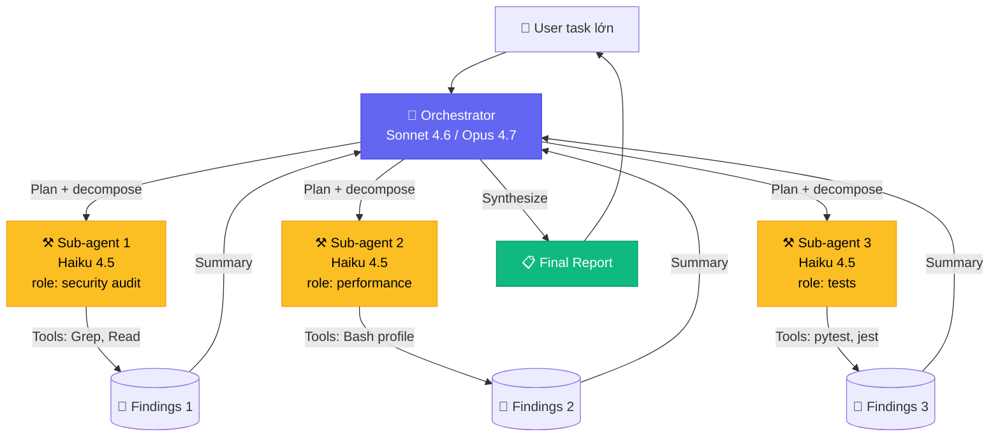

# Chapter 2 — Claude Code Deep

<p style="font-size: 48px; line-height: 1; margin: 0 0 12px;">🧠</p>

> **"30 tiếng autonomous coding. 11,000 dòng code. Không can thiệp."**
> — *Claude Sonnet 4.5, T9/2025*

::: tip 🎯 Bạn sẽ học
- Claude Code architecture: agent loop + tool + MCP
- Sub-agent orchestrator-worker pattern (như Anthropic Research)
- Case: Jaana Dogan (60 phút giải bài toán team Google làm cả năm)
- Cost economics: Uber CTO burn $500-2K/dev/tháng
- Workflow chuẩn cho VN dev + freelance global rate
:::

---

## 01 Claude Code là gì?

**Claude Code** = terminal-native autonomous coding agent của Anthropic.

### Architecture

```
┌─────────────────────────────────┐
│         Claude Sonnet 4.6         │
│         (or Opus 4.7)             │
└─────────────────┬─────────────────┘
                  │
        ┌─────────┴─────────┐
        │   Agent loop      │
        │  (ReAct pattern)   │
        └─────────┬─────────┘
                  │
   ┌──────────────┼──────────────┐
   │              │              │
┌──▼────┐   ┌────▼─────┐   ┌────▼─────┐
│ Tools  │   │  Memory  │   │   MCP    │
│ (Bash, │   │ (history │   │ servers  │
│  Read, │   │ + plan)  │   │ (3rd-    │
│  Edit, │   └──────────┘   │  party)  │
│  Grep, │                  └──────────┘
│  ...) │
└────────┘
```

### Tier pricing (T5/2026)

| Tier | Cost/tháng | Use case |
|------|------|------|
| **Pro** | $20 | Personal dev, light usage |
| **Max** | $100-200 | Pro dev, heavy use |
| **API pay-as-you-go** | $3/$15 per MTok (Sonnet 4.6) | Custom integration |
| | $5/$25 per MTok (Opus 4.7) | Heavy task, mission-critical |

---

## 02 Sonnet 4.5 — moment "30 tiếng autonomous"

### Story

T9/2025, Anthropic release Sonnet 4.5. **Demo lớn nhất**: 1 instance Claude Code:

| Metric | Số |
|------|------|
| Autonomous coding time | **30+ giờ liên tục** |
| Code generated | **~11,000 dòng** |
| Human intervention | **0** |
| Task | Build full-stack app từ scratch |

### Vì sao đột phá?

Trước Sonnet 4.5:
- GPT-4 / Claude 3.5 autonomous: 1-4 giờ trước "context drift" hoặc fail
- 4-8 giờ là max human-trust threshold

Sau Sonnet 4.5:
- **30+ giờ continuous** — model maintain context, plan recover khi error
- Anthropic gọi đây là "agentic" model thật sự

---

## 03 Sonnet 4.6 + Opus 4.7 (T5/2026)

| Model | Release | Strength | Best for |
|------|------|------|------|
| **Sonnet 4.5** | T9/2025 | Balance giá/perf, 30h autonomous | Daily coding |
| **Sonnet 4.6** | T2/2026 | OSWorld 72.5% (≈ human baseline) | Daily coding upgrade |
| **Opus 4.7** | T3/2026 | Best reasoning, complex architecture | Critical task, mission-critical |
| **Haiku 4.5** | T1/2026 | Fast + cheap ($1/$5/MTok) | Sub-agent worker, bulk task |

---

## 04 Case 1 — Jaana Dogan / Google Gemini API team

### Story

**Jaana Dogan** = senior engineer Google Gemini API team. Cô làm việc về **distributed agent orchestration system** suốt 2024.

T2/2025: cô thử Claude Code.

| Item | Số |
|------|------|
| Bài toán | Distributed agent orchestration |
| Team Google iterate | **Cả năm 2024** |
| Claude Code solo | **60 phút** |
| Output | Working prototype |

> *"Claude Code giải 60 phút bài toán team Gemini iterate cả năm."*
> — *Jaana Dogan*

→ **Bài học**: kể cả senior engineer ở top-tier company cũng được Claude Code 10x. Không phải replace, mà augment.

---

## 05 Case 2 — Uber CTO burn AI budget 4 tháng

### Story

T4/2026 — Uber CTO public report:

| Metric | Số |
|------|------|
| Claude Code adoption | **32% → 84%** trong 5,000-engineer org |
| Per-engineer API cost | **$500-$2,000/tháng** |
| Total annual budget 2026 | **Hết trong 4 tháng** |
| Lý do | Adoption tăng + agentic workflows tốn token |

### Quote

> *"Burned through entire 2026 AI budget in 4 months."*
> — *Uber CTO*

→ **Bài học**: Agent coding cost không free. Cost-control là kỹ năng quan trọng (xem section 08).

---

## 06 Sub-agent orchestrator-worker pattern

::: tip 🎯 Pattern chuẩn 2026

```
┌────────────────────────┐
│  ORCHESTRATOR AGENT     │ (Sonnet 4.6 / Opus 4.7)
│  (Lead, plan, synth)    │
└──────────┬─────────────┘
           │
   ┌───────┼───────┐
   │       │       │
┌──▼──┐ ┌──▼──┐ ┌──▼──┐
│ Sub │ │ Sub │ │ Sub │   (Haiku 4.5 — cheap, fast)
│ #1  │ │ #2  │ │ #3  │
└─────┘ └─────┘ └─────┘
 ↓        ↓        ↓
 Tool    Tool    Tool
```

**Cách hoạt động**:
1. Orchestrator nhận task lớn
2. Phân chia thành 3-5 subtask song song
3. Spawn sub-agent (Task tool) cho mỗi subtask
4. Sub-agent có **fresh context window** (không bị bloat)
5. Sub-agent return summary cho orchestrator
6. Orchestrator synthesize → output cuối

**Anthropic Research case** (T4/2025):
- Beat single-agent Claude Opus 4 by **90.2%** trên internal eval
- **Cost**: 15x token vs single chat
:::

### Code example (Claude Code SDK)

```typescript
// Orchestrator spawns sub-agents
import { Anthropic } from '@anthropic-ai/sdk';

const orchestrator = new Anthropic();

const task = "Audit codebase for security issues + write report";

// Spawn 3 sub-agents in parallel
const subagents = await Promise.all([
  orchestrator.messages.create({
    model: 'claude-haiku-4-5',
    system: 'You audit SQL injection vulnerabilities.',
    messages: [{ role: 'user', content: 'Scan /src/db/' }],
    tools: [readFile, grep],
  }),
  orchestrator.messages.create({
    model: 'claude-haiku-4-5',
    system: 'You audit XSS vulnerabilities.',
    messages: [{ role: 'user', content: 'Scan /src/components/' }],
    tools: [readFile, grep],
  }),
  orchestrator.messages.create({
    model: 'claude-haiku-4-5',
    system: 'You audit auth bypass.',
    messages: [{ role: 'user', content: 'Scan /src/auth/' }],
    tools: [readFile, grep],
  }),
]);

// Synthesize with Sonnet orchestrator
const report = await orchestrator.messages.create({
  model: 'claude-sonnet-4-6',
  system: 'You synthesize security audit reports.',
  messages: [{
    role: 'user',
    content: `Combine 3 audit findings:\n${subagents.map(s => s.content[0].text).join('\n\n')}`
  }],
});
```

---

## 07 Pattern thực hành — 5 case

### Pattern 1: Code Review

```
Orchestrator: review pull request #123
├─ Sub 1 (Haiku): check style + lint
├─ Sub 2 (Haiku): check security 
├─ Sub 3 (Haiku): check test coverage
└─ Synthesize: post comment to PR
```

### Pattern 2: Ticket triage

```
Orchestrator: triage 50 GitHub issue
├─ Sub 1: classify bug vs feature
├─ Sub 2: assess priority
├─ Sub 3: suggest assignee
└─ Output: triaged spreadsheet
```

### Pattern 3: Doc gen

```
Orchestrator: generate API doc for service
├─ Sub 1: extract endpoint from /routes/
├─ Sub 2: parse comment + types
├─ Sub 3: gen example request/response
└─ Output: OpenAPI spec + Markdown
```

### Pattern 4: Migration

```
Orchestrator: migrate React 17 → 19
├─ Sub 1: update import + lifecycle
├─ Sub 2: fix deprecated API
├─ Sub 3: update test
└─ Output: PR with changeset
```

### Pattern 5: Research

```
Orchestrator: investigate "Why is checkout slow?"
├─ Sub 1: profile DB query
├─ Sub 2: profile network
├─ Sub 3: profile frontend render
└─ Synthesize: root cause + fix proposal
```

---

## 08 Cost control — 5 lever

::: tip 💰 5 cách giảm cost Claude Code

**1. Prompt caching (Anthropic native)**
- Cache prompt prefix → giảm 90% input cost
- Use khi: same system prompt + same context, varied query

**2. Batch processing (50% discount)**
- API batch endpoint: 50% off, 24h SLA
- Use khi: không cần realtime (bulk task)

**3. Haiku for sub-agents**
- Orchestrator: Sonnet/Opus
- Sub-agents: Haiku (5x rẻ hơn)
- Total cost: 30-50% so với all-Sonnet

**4. Context window discipline**
- Đừng dump whole codebase
- Use Grep/Glob first → only Read needed file
- Sub-agent fresh context tránh bloat

**5. Eval before scale**
- Test prompt với 10 sample trước khi run 1000
- Catch hallucination/error early
:::

### Cost cheat sheet (T5/2026)

| Model | Input ($/MTok) | Output ($/MTok) |
|------|------|------|
| Haiku 4.5 | $1 | $5 |
| Sonnet 4.6 | $3 | $15 |
| Opus 4.7 | $5 | $25 |
| Opus 4.7 Fast | $30 | $150 (6x) |

→ **Rule of thumb**: 1 typical Claude Code task ~$0.10-2 tuỳ scope.

---

## 09 MCP integration (briefly — chi tiết Chapter 6)

Claude Code có **MCP-native**. Setup 1 MCP server:

```json
// ~/.claude.json
{
  "mcpServers": {
    "github": {
      "command": "npx",
      "args": ["-y", "@modelcontextprotocol/server-github"],
      "env": { "GITHUB_TOKEN": "ghp_..." }
    },
    "supabase": {
      "command": "npx",
      "args": ["-y", "@modelcontextprotocol/server-postgres"],
      "env": { "DATABASE_URL": "..." }
    }
  }
}
```

→ Claude Code dùng tool `mcp__github__*`, `mcp__supabase__*` để ops trực tiếp.

→ Chi tiết MCP ecosystem: [Chapter 6 — MCP](./6-mcp-ecosystem.md)

---

## 10 Workflow chuẩn — VN dev

### Daily workflow

```
☀️ Sáng (1h):
  - Triage GitHub issue → label, priority
  - Run security audit weekly

🌞 Trưa-chiều (4-6h):
  - Feature ship với Claude Code
  - Sub-agent cho large refactor
  
🌙 Tối (1h):
  - Doc update
  - Commit + push
  - Tweet build-in-public
```

### Weekly workflow

```
Mon: Sprint planning + ticket prioritization
Tue-Fri: Feature ship 
Sat: Refactor + tech debt
Sun: Off / read AI news
```

---

## 11 🇻🇳 VN dev — go global với Claude Code

### Rate freelance global benchmark

| Region | Rate/day Claude Code dev |
|------|------|
| **France** (benchmark) | **€550-900/ngày** |
| **US** | $600-1,500/ngày |
| **UK** | £400-700/ngày |
| **Germany** | €500-800/ngày |
| **Singapore** | S$500-1,000/ngày |

→ **VN dev biết Claude Code có thể bill $200-500/ngày freelance** (vs $30-80/giờ local).

### Skills cần để bill rate global

1. ✅ **English communication** (verbal + written) — required
2. ✅ **Claude Code + MCP** proficiency — differentiator
3. ✅ **Codebase navigation** — biết dùng Grep/Glob/Read
4. ✅ **Architecture sense** — biết khi nào orchestrator, khi nào single agent
5. ✅ **Cost awareness** — không burn client budget vô tội vạ

### Nơi tìm gig

- **Toptal** — top freelance, vetted
- **Arc.dev** — remote-first
- **Lemon.io** — Vietnam-friendly
- **WIP.co, IndieHackers** — solo founder hire
- **Twitter / X** — direct outreach to founder

### Setup hợp đồng + payment

- **Stripe Atlas + LLC US** — chuyên nghiệp, dễ invoice
- **Wise** — receive USD/EUR
- **Hợp đồng**: PDF với scope + milestone + IP clause
- **Tax VN**: TNCN > 100M/năm

---

## 12 Bài tập

::: tip ✍️ 3 cấp độ

**Level 1 — 1 tuần**
- Setup Claude Code Pro tier ($20)
- Pick 1 OSS repo → contribute 3 PR với Claude Code
- Test 2 MCP server (GitHub + Postgres)

**Level 2 — 1 tháng**
- Implement orchestrator-worker pattern cho 1 internal task
- Đo cost vs time saved
- Write tutorial / case study về workflow

**Level 3 — 3 tháng**
- Land 1 freelance gig $200+/ngày dùng Claude Code
- Build 5 internal MCP server cho team
- Eval framework: measure agent task success rate
:::

---

## 13 🎥 Watch & Learn — 5 video tutorial

<ChapterVideos :videos="[
  { id: 'ASAaKhK1B5w', title: 'Even Anthropic Engineers Use This Claude Code Workflow', channel: 'IndyDevDan', duration: '28:00', why: 'Cách team internal Anthropic dùng Claude Code: plan mode, parallel sub-agents, slash commands. 1 engineer Anthropic chi $1000/tháng credits.' },
  { id: 'goOZSXmrYQ4', title: 'My COMPLETE Agentic Coding Workflow to Build Anything', channel: 'Cole Medin', duration: '40:00', why: 'Cole Medin = thought leader \'context engineering\'. PRP framework + 15 Claude Code commands reusable.' },
  { id: 'Phr7vBx9yFQ', title: 'Claude Code Tutorial #8 — Subagents', channel: 'IndyDevDan', duration: '18:00', why: 'IndyDevDan có playlist Claude Code 1-10+, episode 8 deep dive subagent. Phong cách thực dụng, không hype.' },
  { id: 'gv0WHhKelSE', title: 'Claude Code best practices | Code w/ Claude', channel: 'Anthropic', duration: '30:00', why: 'Anthropic official guide từ event Code w/ Claude (22/5/2025). Cover CLAUDE.md, hooks, memory hierarchy.' },
  { id: '6uwR5yoQ1VY', title: 'Khóa Học Claude Code Thực Chiến — Beginner đến Pro', channel: 'Vietnamese AI Course', duration: '15:00', why: '🇻🇳 Vietnamese walkthrough Claude Code beginner → advanced với demo cụ thể.' }
]" />

---

## 14 🔬 Deep Dive Techniques 2026

::: tip 🧠 8 advanced techniques cho Claude Code power user

**1. Orchestrator-Worker với Cost Optimization**
- 1 Opus 4.7 orchestrator + 4 Sonnet 4.6 workers = **giảm 40% cost** vs 5 Opus
- Token cost cắt 5-10x mà output gần như y hệt
- Khi nào: task có thể decompose parallel subtasks
- Tool: Claude Code Task tool spawn subagent

**2. Plan Mode trước mỗi complex task**
- Chuyển sang plan mode → Claude map step-by-step trước khi code
- **Tăng 2-3x success rate** trên task phức tạp
- Khi nào: task estimate >30 phút work
- Tool: `/plan` command hoặc explicit "switch to plan mode"

**3. CLAUDE.md <500 lines rule**
- Analysis 165+ repos: file <500 lines được Claude đọc đủ; >1000 lines bị ignore phần sau
- Target ideal: **60-400 lines**
- Khi nào: mọi project setup
- Tool: Keep CLAUDE.md concise; split rules vào `.claude/rules/*.md` auto-load

**4. PreToolUse Hooks cho Security Gates**
- PreToolUse = hook DUY NHẤT có thể BLOCK action
- Dùng cho: file protection (không touch `.env`), mandatory review, secret scanning
- Khi nào: project có code production / secrets / sensitive data
- Tool: `settings.json` với hook chạy script <1s; phức tạp hơn → skill

**5. Hot-Reload Skills (T1/2026)**
- Skills tạo/sửa trong `~/.claude/skills` hoặc `.claude/skills` activate ngay
- Không cần restart session
- Khi nào: đang iterate skill workflow
- Tool: Claude Code 2.1.0+; skill = folder gồm instructions + scripts + assets

**6. Just-in-Time Context Loading**
- Thay vì nhồi data vào context window, giữ lightweight identifiers
- Claude dùng tools để load on-demand
- Khi nào: codebase lớn (>100K LOC) hoặc dataset lớn
- Tool: Custom MCP servers + tool definitions

**7. Parallel Sessions với Git Worktrees**
- Mỗi Claude session = 1 worktree riêng
- Run **4-8 sessions parallel** trên feature khác nhau
- Khi nào: migration lớn, refactor đa module
- Tool: `git worktree add`; Claude Code background agents (2.1.0+)

**8. Sub-Agent dùng Sonnet thay Opus cho 90% việc**
- Sonnet 4.6 đủ tốt cho code gen, file manipulation, test execution
- Chỉ dùng Opus cho planning/review
- Khi nào: cost-conscious team (FinOps cảnh báo $500-2000/engineer/month)
- Tool: `.claude/agents/*.md`, set `model: sonnet`
:::

---

## 15 📚 More Case Studies (2025-2026)

### Case A: Jaana Dogan (Google Gemini Principal) — **1 giờ vs 1 năm**

| Item | Số |
|------|------|
| Background | **Principal Engineer Google** chịu trách nhiệm Gemini API |
| Stack | Claude Code với prompt 3-paragraph, no internal Google data |
| Build time | **1 giờ** |
| Match với | **1 năm work của team Google** |
| Public confession | 3/1/2026 trên X |

> *"This industry has never been a zero-sum game, so giving competitors credit where it's due makes sense. Impressive work."* — Jaana Dogan

> **Caveat**: output "not production grade, a toy version, but useful starting point" — set expectation đúng.
> Source: [The Decoder](https://the-decoder.com/google-engineer-says-claude-code-built-in-one-hour-what-her-team-spent-a-year-on/)

### Case B: Uber — **Burn 2026 AI budget trong 4 tháng**

| Item | Số |
|------|------|
| Engineers | **5,000** |
| Claude Code adoption | Q4 2025: 32% → T2/2026: 63% → T3/2026: **84%** |
| AI-generated code committed | **70%** |
| **Backend updates LIVE = AI viết, no human in loop** | **11%** |
| **Budget 2026 burned in** | **4 tháng** |
| Cost/engineer/month | **$500-$2,000** |

> CTO Praveen Neppalli Naga: engineers "loved it, used it constantly" — cost cho parallel agent execution, refactoring, automated testing.
> **Tone caveat**: COO Uber đang question ROI. Không phải pure success — FinOps cảnh báo.
> Source: [Startup Fortune](https://startupfortune.com/uber-burned-its-entire-2026-ai-budget-in-four-months-and-claude-code-is-why-finance-teams-should-be-worried/)

### Case C: Rakuten Kenta Naruse — vLLM **7 giờ autonomous**

| Item | Số |
|------|------|
| Engineer | Kenta Naruse, ML Engineer Rakuten |
| Project | vLLM open-source 12.5M lines code đa ngôn ngữ |
| Stack | Claude Code single run, no human intervention |
| **Autonomous time** | **7 giờ liên tục** |
| Output | Activation vector extraction method |
| **Numerical accuracy** | **99.9%** so với reference |
| **Time to market Rakuten** | 24 ngày → **5 ngày (-79%)** |

> *"Time to market significantly brought down because Claude Code gives super powers to make executions much faster."* — Manoj Desai (Manager AI Empowerment)
> Source: [Anthropic Rakuten case](https://claude.com/customers/rakuten) | [Rakuten blog](https://rakuten.today/blog/rakuten-accelerates-development-with-claude-code)

---

## 16 🛠️ Tool Updates (Q1-Q2 2026)

| Tool | Update | Date | Key impact |
|------|------|------|------|
| **Claude Sonnet 4.6** | Default Claude.ai Free + Pro. 1M context beta. $3/$15 per MTok | 17/2/2026 | Instruction following + computer use + consistency improved |
| **Claude Opus 4.7** | **87.6% SWE-bench Verified** (vs 80.8% 4.6), 70% CursorBench (vs 58%). 1M context standard | 16/4/2026 | New "xhigh" effort level. **Updated tokenizer increase token counts** — migration warning |
| **Claude Code 2.1.0** | Hot-reload skills, scoped hooks (PreToolUse/PostToolUse/Stop), session portability, multilingual output (20 ngôn ngữ) | 7/1/2026 | Voice mode + skill ecosystem |
| **Claude Code v2.1.76** | Scheduled tasks via loop command (cron-style), background agents with worktree isolation, voice mode, remote control phone/web | 3/2026 | Long-running task unattended |
| **Claude Agent SDK** | Available publicly — programmable agent loop powering Claude Code | 2026 | Python + TypeScript |
| **Self-hosted Sandboxes + MCP Tunnels** | Public beta self-hosted sandbox; research preview MCP tunnels | 5/2026 | Tool execution in your infrastructure |
| **Devin 2.0** | Pricing crashed **$500/month → $20/month** minimum. Pay-as-you-go $2.25/ACU | 2026 | Devin 2.0 hoàn thành 83% nhiều junior-level tasks per ACU |
| **Cursor** | **$2B ARR, 1M paying customers, 1M DAU** | T2/2026 | Switched June 2025: request-based → credit-based pricing |
| **MCP** | Donated to **Linux Foundation** T12/2025; 10K+ active public MCP servers; 97M monthly SDK downloads | T1/2026 | OpenAI joined MCP Apps Extension co-creation T1/2026 |

---

## 17 📊 Architecture Diagram — Orchestrator-Worker Pattern



**Cost optimization key insights:**
- Orchestrator = **Sonnet 4.6** ($3/$15 per MTok) — task hard
- Workers = **Haiku 4.5** ($1/$5 per MTok) — task focused, fast, cheap
- **Saving 40%** so với all-Sonnet
- Mỗi sub-agent có **fresh context** → tránh bloat
- Single summary return → orchestrator parse được

---

## 18 🧪 Hands-on Lab — First Orchestrator-Worker với Claude Code SDK

::: tip 🎯 Goal
60 phút: build security audit tool dùng 1 orchestrator + 3 workers parallel scan codebase.
:::

### Prerequisites checklist

```
□ Anthropic API key ($5 minimum top-up)
□ Node.js >= 18
□ TypeScript hoặc Python kinh nghiệm cơ bản
□ Claude Code Pro ($20/tháng) — optional nhưng recommend
□ Git repo có code thật để audit
```

### Step 1. Setup environment

```bash
mkdir security-audit-agent && cd security-audit-agent
npm init -y
npm install @anthropic-ai/sdk dotenv
npm install -D typescript tsx @types/node

# Setup TypeScript
npx tsc --init

# Create .env
echo "ANTHROPIC_API_KEY=sk-ant-..." > .env
echo ".env" > .gitignore
```

### Step 2. Code orchestrator-worker

```typescript
// src/audit.ts
import Anthropic from '@anthropic-ai/sdk';
import * as fs from 'fs';
import * as path from 'path';
import 'dotenv/config';

const client = new Anthropic();

interface AuditResult {
  worker: string;
  findings: string[];
  recommendations: string[];
}

// Worker: chuyên 1 loại audit
async function spawnWorker(
  role: string,
  targetDir: string
): Promise<AuditResult> {
  const files = fs
    .readdirSync(targetDir, { recursive: true })
    .filter((f) => typeof f === 'string' && /\.(ts|tsx|js)$/.test(f))
    .slice(0, 20); // sample 20 file

  const codeSample = files
    .map((f) => {
      const p = path.join(targetDir, f as string);
      const content = fs.readFileSync(p, 'utf-8').slice(0, 2000);
      return `--- ${f} ---\n${content}`;
    })
    .join('\n\n');

  const response = await client.messages.create({
    model: 'claude-haiku-4-5', // worker dùng Haiku (rẻ)
    max_tokens: 1024,
    system: `You are a specialist security auditor for ${role}.
Return ONLY JSON: { "findings": ["..."], "recommendations": ["..."] }`,
    messages: [
      {
        role: 'user',
        content: `Audit these files for ${role} issues:\n\n${codeSample}`
      }
    ]
  });

  const text = (response.content[0] as any).text;
  const json = JSON.parse(text.match(/\{[\s\S]*\}/)?.[0] || '{}');

  return {
    worker: role,
    findings: json.findings || [],
    recommendations: json.recommendations || []
  };
}

// Orchestrator: spawn parallel + synthesize
async function orchestrate(targetDir: string) {
  console.log(`🧠 Orchestrator: starting audit of ${targetDir}`);

  // Spawn 3 workers in parallel
  const [sqlAudit, xssAudit, authAudit] = await Promise.all([
    spawnWorker('SQL injection', targetDir),
    spawnWorker('XSS vulnerabilities', targetDir),
    spawnWorker('Authentication bypass', targetDir)
  ]);

  // Synthesize với Sonnet (orchestrator)
  const synthResponse = await client.messages.create({
    model: 'claude-sonnet-4-6',
    max_tokens: 2048,
    system:
      'You synthesize security audit reports into a clear actionable summary.',
    messages: [
      {
        role: 'user',
        content: `Combine these 3 audits into 1 prioritized report (Markdown):

SQL: ${JSON.stringify(sqlAudit)}
XSS: ${JSON.stringify(xssAudit)}
Auth: ${JSON.stringify(authAudit)}`
      }
    ]
  });

  return (synthResponse.content[0] as any).text;
}

// Run
const targetDir = process.argv[2] || './';
orchestrate(targetDir).then((report) => {
  fs.writeFileSync('audit-report.md', report);
  console.log('✅ Report saved → audit-report.md');
});
```

### Step 3. Run

```bash
# Audit chính dir hiện tại
npx tsx src/audit.ts ./src

# Hoặc audit project khác
npx tsx src/audit.ts /path/to/your/project/src
```

### Step 4. Verify output

Open `audit-report.md` — bạn nên thấy:
- Top 3-5 vulnerability tìm được
- Severity (high/medium/low)
- Recommendation cụ thể cho mỗi finding
- Cost: ~$0.30-0.80 cho audit 20 file

### 🐛 Common errors + fixes

| Error | Fix |
|------|------|
| `Authentication error 401` | Check `.env` có ANTHROPIC_API_KEY đúng |
| `Rate limit` | Anthropic free tier limit. Top-up $5+ |
| `JSON parse fail` | Worker không return JSON đúng → improve system prompt với example |
| Token bill quá cao | Reduce `slice(0, 2000)` xuống 1000 |

---

## 19 🏗️ Mini-Project — Code Review Bot cho team bạn

::: warning 🎯 Assignment

**Mục tiêu**: Build tool review PR tự động cho team (5-10 dev).

**Requirements**:
1. GitHub Action trigger khi có PR mới
2. Spawn 4 sub-agents parallel:
   - Style/lint checker
   - Security audit
   - Performance review
   - Test coverage check
3. Post comment summary lên PR
4. Approve/request-changes dựa trên severity

**Acceptance criteria**:
- [ ] Setup `.github/workflows/ai-review.yml`
- [ ] Code orchestrator dùng Claude SDK
- [ ] 4 sub-agents return structured JSON
- [ ] PR comment có markdown rendering tốt
- [ ] Cost monitoring: alert khi >$5/PR
- [ ] Skip review cho PR nhỏ (<50 lines)

**Time estimate**: 1 weekend (8-12 giờ)

**Stretch goals** 🚀:
- Add tags auto: `bug`, `feature`, `refactor`
- Auto-assign reviewer theo file changes
- Cost dashboard cho team
:::

---

## 20 🎓 Knowledge Check

::: details 1. Claude Code 2.1.0 thêm feature gì quan trọng?
**A.** Internet browsing
**B.** Hot-reload skills + scoped hooks ✅
**C.** Image generation
**D.** Voice cloning

**Đáp án: B** — Claude Code 2.1.0 (T1/2026) thêm hot-reload skills + PreToolUse/PostToolUse/Stop scoped hooks + session portability.
:::

::: details 2. CLAUDE.md nên giới hạn bao nhiêu dòng?
**A.** <100
**B.** <500 ✅
**C.** <2000
**D.** Không giới hạn

**Đáp án: B** — Analysis 165+ repos: <500 dòng được Claude đọc đầy đủ; >1000 bị ignore phần sau. Ideal 60-400 dòng.
:::

::: details 3. Multi-agent vượt single agent bao nhiêu % trên Anthropic Research eval?
**A.** +30%
**B.** +60%
**C.** +90.2% ✅
**D.** +200%

**Đáp án: C** — Anthropic Research multi-agent (lead Opus + 3-5 sub Sonnet) beat single Opus 4 bằng **+90.2%** trên internal eval. Nhưng cost ~15x token.
:::

::: details 4. Khi nào KHÔNG nên dùng multi-agent?
**A.** Task có >5 parallel subtasks
**B.** Sequential task (A → B → C) ✅
**C.** Cost không phải vấn đề
**D.** Cần specialists khác domain

**Đáp án: B** — Sequential task không lợi từ parallel. 15x token cost không có ROI. Dùng single agent đơn giản hơn.
:::

::: details 5. Jaana Dogan (Google Gemini API team) Claude Code làm việc gì trong 1 giờ?
**A.** Học Python
**B.** Build distributed orchestrator system match work cô làm 1 năm ✅
**C.** Debug Gemini API
**D.** Write documentation

**Đáp án: B** — Jaana Dogan: "Claude Code solved in 60 minutes what my team at Gemini iterated on for a year." Đáng chú ý nhất là Google insider thừa nhận Claude Code mạnh.
:::

::: details 6. Uber CTO burn 2026 AI budget trong bao lâu?
**A.** 12 tháng
**B.** 6 tháng
**C.** 4 tháng ✅
**D.** 2 năm

**Đáp án: C** — Uber: Claude Code adoption Q4 2025 32% → T3/2026 84%. **70% code committed = AI-generated**. Burn budget trong 4 tháng. Cost $500-2000/engineer/month.
:::

::: details 7. PreToolUse hooks có khả năng gì duy nhất?
**A.** Modify tool input
**B.** BLOCK tool execution ✅
**C.** Log tool calls
**D.** Auto-retry on fail

**Đáp án: B** — PreToolUse là hook DUY NHẤT có thể BLOCK action. Dùng cho file protection (không touch .env), mandatory review, secret scanning.
:::

::: details 8. Pattern "Just-in-Time Context Loading" là gì?
**A.** Cache prompt prefix
**B.** Giữ lightweight identifiers + load on-demand qua tools ✅
**C.** Pre-load entire codebase
**D.** Stream context từ DB

**Đáp án: B** — Anthropic engineering practice: giữ lightweight pointers, Claude dùng tools (Read/Grep) để load on-demand. Tránh nhồi data vào context window.
:::

::: details 9. Sub-Agent dùng Sonnet hay Haiku cho 90% việc?
**A.** Sonnet (tốt hơn)
**B.** Opus (mạnh nhất)
**C.** Haiku 4.5 (đủ tốt + rẻ 5x) ✅
**D.** GPT-5 (rẻ hơn)

**Đáp án: C** — Haiku 4.5 đủ tốt cho code gen, file manipulation, test execution. Chỉ dùng Opus/Sonnet cho planning/review.
:::

::: details 10. Rakuten Kenta Naruse implement vLLM feature autonomous bao lâu?
**A.** 1 tuần
**B.** 1 ngày
**C.** 7 giờ ✅
**D.** 30 phút

**Đáp án: C** — Rakuten: Claude Code single run **7 giờ autonomous**, no human intervention. Implement activation vector extraction trong vLLM với **99.9% numerical accuracy**. Time to market: 24 ngày → 5 ngày (-79%).
:::

**Score**:
- 8-10/10 ✅ Ready cho Chapter 3 (Computer Use)
- 5-7/10 ⚠️ Re-read sections 6-12
- <5/10 ❌ Redo lab + watch lại 5 videos

---

## 21 Đọc tiếp

- 💻 [Chapter 1 — Vibe Coding Solo](./1-agent-foundation.md) (back)
- 🖱️ [Chapter 3 — Computer Use](./3-computer-use.md) — agent click màn hình
- 🧩 [Chapter 4 — Multi-Agent](./4-multi-agent.md) — pattern advanced
- 🔌 [Chapter 6 — MCP](./6-mcp-ecosystem.md) — extension ecosystem
- 🧰 [Chapter 7 — Toolkit](./toolkit-2026.md)

::: tip 🧠 Lời cuối
> *"Claude Code không thay thế dev. Nó **thay thế** dev không biết dùng Claude Code.*
>
> *Như IDE không thay thế programmer năm 1990. Nhưng programmer 2026 không dùng IDE = dead.*
>
> *2030 sẽ là **dev không dùng agent = dead**."*
:::
