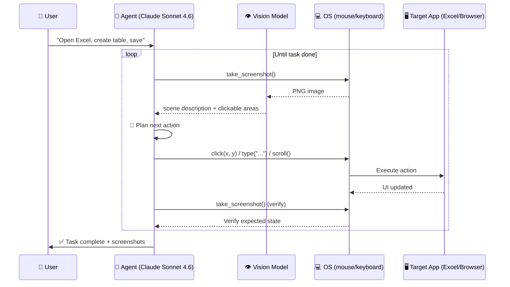

# Chapter 3 — Computer Use

<p style="font-size: 48px; line-height: 1; margin: 0 0 12px;">🖱️</p>

> **"Từ 14.9% (10/2024) → 72.5% (2/2026). Bằng baseline người.**
> **Anthropic Computer Use không còn là demo nữa."**

::: tip 🎯 Bạn sẽ học
- Computer Use là gì + tại sao đột phá 2025-2026
- Benchmark OSWorld-Verified: từ 14.9% → 72.5% trong 16 tháng
- 4 case enterprise (Rakuten, CRED, TELUS, Zapier)
- Vì sao Project Mariner đóng cửa, Anthropic dẫn đầu
- VN: target nhân viên data entry, kế toán xài phần mềm legacy
:::

---

## 01 Computer Use là gì?

**Computer Use** = AI agent có thể:
- 📸 Take screenshot
- 🖱️ Move + click chuột
- ⌨️ Gõ phím
- 📜 Scroll
- 📝 Đọc UI text (OCR + accessibility tree)

→ **Tương tác với computer như người dùng**, không cần API.

### Vì sao breakthrough?

**90% phần mềm enterprise không có API tốt**:
- ERP legacy (SAP, Oracle, Baan)
- VN: MISA, Bravo, Fast, KiotViet (có API limited)
- Internal tool tự build
- Web app không có public API

**Trước Computer Use**: bất khả tự động hoá.

**Sau Computer Use**: agent click như người = automation possible.

---

## 02 Chronology — 16 tháng từ 14.9% → 72.5%

| Thời gian | Milestone | OSWorld score |
|------|------|------|
| **T10/2024** | Anthropic launch Computer Use beta | **14.9%** |
| **T1/2025** | Project Mariner (Google) launch | ~30% (WebVoyager) |
| **T4/2025** | OpenAI Operator launch | ~38% |
| **T7/2025** | Sonnet 4.0 + Computer Use 2.0 | ~52% |
| **T2/2026** | Sonnet 4.6 | **72.5%** |
| **Baseline người** | (reference) | **~72%** |

> **2/2026 = moment Computer Use đạt baseline human performance.**

---

## 03 OSWorld-Verified benchmark

**OSWorld** = benchmark đo agent perform desktop task.

### Task examples

- "Mở Excel, tạo bảng từ data trong screenshot này, save vào folder Documents"
- "Search YouTube cho '[query]', play video đầu tiên, comment '[text]'"
- "Trong Photoshop, mở file, apply filter, save as PNG ở 1080p"
- "Trong Outlook, search email từ [sender], reply với template [X]"

### Categories

| Category | Sample |
|------|------|
| Office (Excel, Word, PPT) | Data entry, table format, slide create |
| Web browser | Form fill, scrape, schedule |
| Multimedia | Photoshop, video edit |
| OS-level | File manage, install software |
| Daily tasks | Email, calendar, messaging |

---

## 04 Case enterprise — 2025-2026

### Case 1: Rakuten

| Item | Detail |
|------|------|
| Industry | E-commerce |
| Use case | Auto data entry across vendor portals (legacy, no API) |
| Stack | Anthropic Computer Use + custom orchestrator |
| Result | Cut data entry time **~70%** |

### Case 2: CRED (Ấn Độ)

| Item | Detail |
|------|------|
| Industry | Fintech |
| Use case | Customer support agent navigate internal CRM |
| Result | Handle **40% support ticket** without human |

### Case 3: TELUS (Canada)

| Item | Detail |
|------|------|
| Industry | Telecom |
| Use case | Field tech tool navigation, troubleshoot script |
| Result | First-time-fix rate up **15%** |

### Case 4: Zapier

| Item | Detail |
|------|------|
| Use case | Computer Use ↔ Zapier integration cho web app không có API |
| Result | Coverage tăng 30% với same Zapier engineering team |

---

## 05 Vì sao Google Project Mariner đóng cửa

**T5/2026**: Google chính thức **shutdown Project Mariner** (T5/4/2026), absorb vào Gemini Agent.

### Lý do (analyst speculate)

1. **Performance gap**: Mariner peak ~83.5% WebVoyager nhưng Anthropic Computer Use universal (web + desktop)
2. **Single-purpose**: Mariner chỉ web browser, Anthropic toàn computer
3. **MCP advantage**: Anthropic ecosystem (97M downloads/tháng) vs Google standalone
4. **Distribution**: Anthropic API-first, Google consumer-first → enterprise prefer Anthropic

→ **Anthropic dẫn đầu computer use race 2026.**

---

## 06 Workflow Computer Use — kiến trúc

::: tip 🖱️ Agent loop với Computer Use

```
1. Screenshot ──→ 2. LLM phân tích ──→ 3. Action 
   (1080p)         (vision + plan)      (click/type/scroll)
                                              │
                                              ▼
                                       4. Wait + screenshot
                                              │
                                              ▼
                                       5. Verify expected state
                                              │
                              ┌───────────────┴─────────┐
                              │                         │
                          Continue                    Done
```
:::

### Code example (Python)

```python
from anthropic import Anthropic

client = Anthropic()

response = client.beta.messages.create(
    model="claude-sonnet-4-6",
    max_tokens=4096,
    tools=[
        {
            "type": "computer_20251124",
            "name": "computer",
            "display_width_px": 1920,
            "display_height_px": 1080,
        }
    ],
    messages=[
        {
            "role": "user",
            "content": "Open Excel, create a table with these 5 rows: [...], save as report.xlsx"
        }
    ],
    extra_headers={
        "anthropic-beta": "computer-use-2025-11-24"
    }
)

# Loop: handle tool calls
for tool_call in response.content:
    if tool_call.type == "tool_use":
        action = execute_action(tool_call.input)  # click/type/screenshot
        # Send back result
```

---

## 07 5 patterns Computer Use

::: tip 🎯 5 use case high-value

### Pattern 1: Legacy ERP automation
- Target: SAP / Oracle / Baan / VN MISA
- Use case: Daily reconciliation, data export, report gen
- Cost saved: 1-2 FTE / department

### Pattern 2: Cross-app workflow
- Target: 5 phần mềm không có integration
- Use case: Quote → invoice → CRM → email
- Cost saved: 30-60% sales ops time

### Pattern 3: Web scraping no-API
- Target: competitor website, supplier portal
- Use case: Daily price monitor, stock check
- Cost saved: $0 vs $500/tháng scraping service

### Pattern 4: QA testing
- Target: web app, mobile emulator
- Use case: Run regression test, screenshot diff
- Cost saved: 50% manual QA time

### Pattern 5: Customer support escalation
- Target: internal tool navigation
- Use case: Lookup customer, refund, escalate
- Cost saved: 20-40% T1 support
:::

---

## 08 Prompt pack — Computer Use

::: tip 📝 5 prompt template

**1. Step-by-step task (high accuracy)**
```
Task: [describe end goal]

Constraints:
- Use [specific app: Excel / Chrome / etc.]
- Save output to [path]
- Don't modify [protected area]

Verify each step before proceeding:
- After click: check state changed
- After type: check text appeared
- After save: check file exists

Pause and ask if uncertain.
```

**2. Cross-app workflow**
```
You'll work across [App A] and [App B]:
1. In [App A]: extract data from [location]
2. In [App B]: paste + format + save
3. Send confirmation email to [user]

State: maintain checklist of completed steps.
On error: screenshot + describe before retry.
```

**3. Web automation with verification**
```
Navigate to [URL], perform [task].

Wait for page load (look for [indicator]) before clicking.
If element not found within 10s, take screenshot + explain.
Don't navigate away from [domain] without confirming.
```

**4. Data entry batch**
```
You have [N] rows to enter in [system].
Each row: [field structure]

Process:
- Read row [1] → enter
- Verify saved → next
- Every 10 rows: save checkpoint screenshot
- Stop + report if any error
```

**5. Eval / QA test**
```
Test [feature] by:
1. Navigate to [page]
2. Perform [action sequence]
3. Verify [expected outcome]
4. Take screenshot at each step
5. Compare against [baseline screenshot]

Report: pass/fail per step + diff explanation.
```
:::

---

## 09 Common pitfalls

::: warning 🚨 7 sai lầm Computer Use

**1. Không sandbox** → agent click sai có thể destroy data. Always run trong VM/container.

**2. Không verify state** → agent assume click work → cascading error. Verify mỗi step.

**3. Resolution mismatch** → agent training 1920x1080, target 4K = miss coordinate. Set display size match.

**4. Sensitive data trong screenshot** → cookie/password leak. Mask hoặc dùng test env.

**5. Race condition** → agent click trước UI ready → fail. Wait for loading indicator.

**6. Cost blowup** → Computer Use vision token expensive ($3/MTok input). Batch screenshot, không every-keystroke.

**7. Agent loop infinite** → khi không recover error, loop forever. Max iteration cap + timeout.
:::

---

## 10 🇻🇳 Use case Việt Nam

### 🎯 5 ngách enterprise VN có pain rõ

| Pain | Target user | Use case Computer Use |
|------|------|------|
| **Kế toán MISA + Bravo + Fast** xài 5 phần mềm song song | Kế toán SME | Auto sync data, gen báo cáo |
| **Bộ phận thuế** điền form online thuế cục | Kế toán + DN | Auto khai thuế GTGT, TNDN |
| **HR onboarding** 10 phần mềm legacy | HR | Auto create account cross-system |
| **Procurement** check supplier portal | Mua hàng SME | Daily price monitor, order |
| **Customer care** check 3 system (CRM + ERP + warehouse) | CS rep | Auto lookup + escalate |

### 💰 Economics VN

| Item | Cost |
|------|------|
| Anthropic API (Sonnet 4.6) | $3/$15 per MTok |
| Compute (sandbox E2B / VM) | $20-100/tháng |
| Engineering setup | 1-2 tuần dev |
| **Total per agent** | $100-500/tháng running |

→ Replace 1 FTE VN ($800-2K/tháng) → ROI **6-12 tháng**.

### 🏛️ Pháp lý VN

- ✅ Computer Use trên local machine = OK
- ⚠️ Computer Use vào system của khách = cần consent + GDPR-equiv
- ⚠️ Quy định bảo mật (Luật An ninh mạng) — không sensitive data ra ngoài
- ✅ Disclosure: nhân viên biết có agent dùng máy mình

### 🤝 Agency / consultant VN có cơ hội

- Pitch SME / mid-market: "auto thay 1-2 nhân viên data entry"
- Project size: $5K-50K (build + 6-month support)
- Recurring: $500-2K/tháng maintenance + upgrade

---

## 11 Bài tập

::: tip ✍️ 3 cấp độ

**Level 1 — 1 tuần**
- Setup Anthropic Computer Use beta
- Run 5 example task (file manage, browser, Excel)
- Đo success rate

**Level 2 — 1 tháng**
- Pick 1 workflow nội bộ legacy (vd: daily reconciliation Excel + ERP)
- Build agent automate full
- Eval 30 task → đo accuracy + time saved

**Level 3 — 3 tháng**
- Pitch 1 SME VN: tự động hoá 1 workflow
- Deliver project (build + train + handover)
- Charge $5K-15K
:::

---

## 12 🎥 Watch & Learn — 5 video tutorial

<ChapterVideos :videos="[
  { id: 'xr0FCUNoy_0', title: 'COMPUTER USE — Anthropic\'s GROUNDBREAKING AI | Install + Live Testing', channel: 'Wes Roth', duration: '20:00', why: 'Wes Roth (1 trong top AI YouTubers) review Computer Use lần đầu ra (10/2024). Live test, hands-on, không scripted.' },
  { id: 'Iabue7wtE4g', title: 'Anthropic Computer Use — Hands On Tutorial', channel: 'AI Channel', duration: '18:00', why: 'Tutorial chi tiết cách dùng Computer Use models + tools, giải thích cơ chế screenshot + click coordinates.' },
  { id: '3-KgkER370U', title: 'Anthropic Computer Use: Introduction, Setup + Real World Demo', channel: 'AI Creator', duration: '25:00', why: 'Walk qua setup + real-world workflow — phù hợp người Việt thấy concrete example.' },
  { id: 'yZcj5fuYpyo', title: 'Get Started with Computer Use in 30 Seconds', channel: 'AI Demo', duration: '0:30', why: 'Quick visual showing Computer Use trong action — ideal cho hook đầu chapter.' },
  { id: 'VxD7_MRPebY', title: 'Vibe Coding Masterclass: Build first app in 37 minutes', channel: 'AI Masterclass', duration: '37:00', why: 'Build first app Claude Code — bridge từ coding sang Computer Use trong cùng workflow.' }
]" />

---

## 13 🔬 Deep Dive Techniques 2026

::: tip 🖱️ 6 advanced techniques cho Computer Use enterprise

**1. Allowlist Site/App Governance**
- Microsoft Copilot Studio GA (5/2026) cho phép set allowlist website/desktop app agent được access
- Anthropic Computer Use cũng cần governance layer riêng
- Khi nào: enterprise deployment, regulated industry
- Tool: define explicit allowed URLs/apps; reject navigation ngoài list

**2. Human-in-the-Loop Confidence Checkpoint**
- Khi agent gặp action có **low confidence (<70% certainty)** → pause + ask human
- Anthropic recommend cho destructive action
- Khi nào: financial action, account deletion, mass email
- Tool: Custom MCP tool wrap action có flag `requires_human_approval`

**3. Vision + Reasoning > Hard-coded RPA Selectors**
- RPA cũ break khi UI change. Computer Use đọc screenshot live → adapt
- Đây là **moat chính** của tech
- Khi nào: legacy software (banking terminals, ERP cũ), software hay update UI
- Tool: đừng cố hard-code coordinates; trust vision model

**4. OSWorld-Verified Methodology Awareness**
- Anthropic introduce OSWorld-Verified 7/2025 — correct task ambiguity + partial credit
- Scores Sonnet 4.5+ dùng verified version
- Đừng so apples-to-oranges
- Khi nào: benchmark comparison, vendor selection
- Tool: khi đọc score, check phiên bản OSWorld

**5. API-First over Visual when Available**
- Project Mariner shutdown 5/2026 dạy bài học: visual screenshot agent quá expensive + error-prone vs API agent
- Khi target system có API → ưu tiên Claude Code + MCP
- Khi nào: bất kỳ system nào có API public/private
- Tool: Visual chỉ cho legacy không có API

**6. Multi-Modal Computer Use (vision + voice + remote)**
- Claude Code 2.1.76 (3/2026) — voice mode 20 ngôn ngữ + remote control qua phone/web
- Agent có thể chạy unattended, người check qua mobile
- Khi nào: long-running task (data migration, hourly monitoring)
- Tool: background agent + scheduled task via loop command
:::

---

## 14 📚 More Case Studies (2025-2026)

### Case A: Allianz (Insurance — Munich) — Underwriting **10 weeks → 10 days**

| Item | Số |
|------|------|
| Background | Allianz = conglomerate insurance toàn cầu HQ Munich. Deal announce 1/2026 |
| Stack | Custom Claude agents do Anthropic build, multi-step workflow với human-in-the-loop |
| **Underwriting cycle** | **10 weeks → 10 days** (PwC implementation tương tự) |
| **Insurance claims accuracy** | Claude **88%** vs human expert |
| Impact | Opens lines of business **previously NOT economically viable** |

> Source: [TechCrunch](https://techcrunch.com/2026/01/09/anthropic-adds-allianz-to-growing-list-of-enterprise-wins/)

### Case B: DoorDash Contact Center — **Hàng trăm nghìn calls/day**

| Item | Số |
|------|------|
| Background | DoorDash: **37M monthly consumers**, 2M monthly Dashers |
| Stack | Claude 3 Haiku via Amazon Bedrock + Amazon Connect, voice-operated self-service |
| **Daily AI calls** | **Hàng trăm nghìn** |
| Escalation reduction | **Thousands fewer daily** escalations to live agent |
| **Voice latency** | **≤ 2.5 seconds** |
| **Development time** | **-50%** |
| **Testing capacity** | **50x** (automated evaluation framework) |
| **Time to launch** | **2 tháng** |

> Source: [AWS case study](https://aws.amazon.com/solutions/case-studies/doordash-bedrock-case-study/) | [Anthropic case PDF](https://assets.anthropic.com/m/53dbf4b0b4e5ab42/original/Anthropic-DoorDash-case-study-one-sheeters.pdf)

### Case C: Zapier Internal — **800+ AI agents nội bộ**

| Item | Số |
|------|------|
| Background | Zapier (no-code, 9,000+ integration) deploy Claude Enterprise internal |
| Stack | Claude Enterprise + Zapier MCP (launch 4/2025) + custom internal MCP servers |
| **Internal Claude-driven agents** | **800+** automating workflow |
| Killer use case | CTO build "emoji-in-Slack-triggers-merge-request": add emoji → Claude analyze → generate code → create MR cho review |
| Design team | Dùng Claude artifacts prototype LIVE during customer interviews (**weeks → minutes**) |
| Strategic intel | Claude research event attendees via Zapier CRM + web search |

> Source: [Anthropic Zapier case](https://claude.com/customers/zapier) | [Zapier blog MCP](https://zapier.com/blog/zapier-mcp-agent-skills/)

---

## 15 🛠️ Tool Updates (Q1-Q2 2026)

| Tool | Update | Date | Key impact |
|------|------|------|------|
| **Anthropic Claude Computer Use Agent** | Research preview Pro/Max via Cowork + Claude Code. See, navigate, control desktop | 23/3/2026 | Click, open app, fill spreadsheet, multi-step |
| **Claude Opus 4.7 OSWorld-Verified** | **78.0%** (vs Sonnet 4.5: 61.4%, Opus 4.5: 66.3%) | T4/2026 | Production-grade Computer Use |
| **Claude Mythos Preview** | **79.6% OSWorld** (frontier preview) | 2026 | Vượt baseline người (70-73%) |
| **MS Copilot Studio Computer Use Agents** | **First GA** với allowlist governance, DLP, audit trails, human-in-loop | 13/5/2026 | Enterprise-ready competitor |
| **Google Gemini 2.5 Computer Use** | Public preview | Q2/2026 | Multi-vendor Computer Use race |
| **Google Project Mariner SHUTDOWN** | 17-month experiment killed — visual screenshot quá expensive vs API-first | 4/5/2026 | Tech absorbed vào Gemini API + Gemini Agent |
| **Anthropic Financial Services Agents** | **10 pre-built agents** banks/insurance: pitchbook, earnings, credit memo, KYC, underwriting, etc. | 5/5/2026 | Customers: Goldman, Visa, Citi, AIG |
| **Anthropic revenue** | 2026 run-rate **$30B** (từ $9B); **1,000+ companies** spending $1M+/year (doubled 500) | 2026 | Enterprise traction massive |
| **Stanford AI Index 2026** | OSWorld score: **12% (2025) → 66% (2026)** | 2026 | Generational leap in 1 year |

---

## 16 📊 Architecture Diagram — Computer Use Loop



**Key principles:**
1. **Screenshot before action** — agent "thấy" trước khi "làm"
2. **Verify after action** — confirm state changed như expected
3. **Recover from errors** — nếu click sai, agent self-correct
4. **Loop until done OR max iterations** — tránh infinite loop

---

## 17 🧪 Hands-on Lab — Automate Excel với Computer Use API

::: tip 🎯 Goal
60 phút: agent tự mở Excel, tạo bảng 5 hàng từ JSON data, save thành file.
:::

### Prerequisites checklist

```
□ Anthropic API key ($10+ — Computer Use tốn token vision)
□ Python 3.10+
□ Excel/LibreOffice cài máy (Mac/Windows/Linux OK)
□ Beta header access (Anthropic enable cho mọi user)
□ Display resolution: 1920x1080 (recommended)
```

### Step 1. Setup environment

```bash
mkdir excel-agent && cd excel-agent
python -m venv venv && source venv/bin/activate  # Mac/Linux
# Hoặc: venv\Scripts\activate  # Windows

pip install anthropic pillow pyautogui python-dotenv
echo "ANTHROPIC_API_KEY=sk-ant-..." > .env
```

### Step 2. Code agent (cleaned, minimal version)

```python
# agent.py
import os
import base64
import io
import time
from anthropic import Anthropic
from PIL import Image
import pyautogui
from dotenv import load_dotenv

load_dotenv()
client = Anthropic()

# Disable pyautogui safety (auto-fail when mouse at 0,0)
pyautogui.FAILSAFE = False

def take_screenshot() -> str:
    """Return base64-encoded screenshot."""
    img = pyautogui.screenshot()
    buf = io.BytesIO()
    img.save(buf, format='PNG')
    return base64.standard_b64encode(buf.getvalue()).decode()

def execute_action(action):
    """Execute Computer Use tool call."""
    name = action.get('action')

    if name == 'screenshot':
        return {'screenshot': take_screenshot()}

    if name == 'left_click':
        coords = action['coordinate']
        pyautogui.click(coords[0], coords[1])
        time.sleep(0.5)
        return {'screenshot': take_screenshot()}

    if name == 'type':
        pyautogui.typewrite(action['text'], interval=0.05)
        time.sleep(0.3)
        return {'screenshot': take_screenshot()}

    if name == 'key':
        pyautogui.press(action['text'])
        time.sleep(0.3)
        return {'screenshot': take_screenshot()}

    if name == 'scroll':
        pyautogui.scroll(action.get('scroll_amount', 3))
        return {'screenshot': take_screenshot()}

    return {'error': f'Unknown action: {name}'}

def run_agent(task: str, max_iter: int = 20):
    """Agent loop with Computer Use."""
    messages = [{'role': 'user', 'content': task}]

    for i in range(max_iter):
        print(f'\n🔄 Iteration {i+1}/{max_iter}')

        response = client.beta.messages.create(
            model='claude-sonnet-4-6',
            max_tokens=4096,
            tools=[{
                'type': 'computer_20251124',
                'name': 'computer',
                'display_width_px': 1920,
                'display_height_px': 1080,
            }],
            messages=messages,
            extra_headers={'anthropic-beta': 'computer-use-2025-11-24'}
        )

        # Check stop reason
        if response.stop_reason == 'end_turn':
            print('✅ Task complete')
            return response.content[-1].text

        # Execute tool calls
        for block in response.content:
            if block.type == 'tool_use':
                print(f'  → {block.input.get("action")}')
                result = execute_action(block.input)

                messages.append({
                    'role': 'assistant',
                    'content': response.content
                })
                messages.append({
                    'role': 'user',
                    'content': [{
                        'type': 'tool_result',
                        'tool_use_id': block.id,
                        'content': [{
                            'type': 'image',
                            'source': {
                                'type': 'base64',
                                'media_type': 'image/png',
                                'data': result.get('screenshot', '')
                            }
                        }] if 'screenshot' in result else f"Error: {result}"
                    }]
                })

    return 'Max iterations reached'

# Run
task = """Open Excel (or any spreadsheet app available).
Create a table with these 5 rows:
- Name: Lan, Age: 28, City: Hanoi
- Name: Minh, Age: 32, City: HCMC
- Name: Hoa, Age: 25, City: Da Nang
- Name: Tuan, Age: 40, City: Hue
- Name: Mai, Age: 30, City: Can Tho
Save as 'employees.xlsx' on Desktop."""

result = run_agent(task)
print(f'\n📋 Final: {result}')
```

### Step 3. Run + observe

```bash
python agent.py
```

Quan sát: agent screenshot → click File → New → type data → save. Mỗi screenshot tốn ~$0.02-0.05.

### Step 4. Verify

- File `~/Desktop/employees.xlsx` tồn tại
- Open Excel — table 5 rows đúng data
- Total cost: $0.50-2 cho task này

### 🐛 Common errors + fixes

| Error | Fix |
|------|------|
| `Display resolution mismatch` | Set `display_width_px` + `height_px` đúng resolution máy |
| Agent click sai chỗ | Resolution conflict — restart, check `Cmd+Tab` xem display chính |
| Loop infinite | Reduce `max_iter`, improve prompt với "If stuck, return error" |
| Permission denied (Mac) | System Preferences → Privacy → Accessibility → enable Terminal/Python |
| Cost cao | Vision token expensive. Limit screenshots, dùng `take_screenshot` strategically |

---

## 18 🏗️ Mini-Project — Automate Daily Reconciliation cho team kế toán

::: warning 🎯 Assignment

**Mục tiêu**: Build agent tự động hoá quy trình daily reconciliation (đối chiếu) giữa 2 hệ thống legacy.

**Bối cảnh**: Bạn pretend là consultant cho 1 SME VN dùng:
- **MISA** (kế toán) — desktop app legacy
- **KiotViet** (POS) — web app
- Daily: kế toán phải xuất report cả 2, mở Excel, đối chiếu thủ công ~2 giờ/ngày

**Requirements**:
1. Agent mở MISA → export today's transactions → CSV
2. Agent mở KiotViet web → login → export today's sales → CSV
3. Agent mở Excel → load 2 CSV → vlookup so sánh → highlight discrepancies
4. Save report `reconciliation-YYYY-MM-DD.xlsx`
5. Send Slack notification: "✅ Reconciliation done. X discrepancies found."

**Acceptance criteria**:
- [ ] Run end-to-end không can thiệp
- [ ] Handle login MISA + KiotViet automatically
- [ ] Time saved: 2 giờ → <15 phút
- [ ] Error handling: nếu app crash, retry 3 lần rồi alert
- [ ] Daily scheduled (cron / Task Scheduler)
- [ ] Cost: <$2/run

**Time estimate**: 1-2 tuần (full project)

**Stretch goals** 🚀:
- Add OCR cho scanned invoices
- Multi-branch support (3-5 chi nhánh)
- Email report cho manager mỗi sáng 8h
:::

---

## 19 🎓 Knowledge Check

::: details 1. Computer Use OSWorld-Verified Sonnet 4.6 đạt bao nhiêu %?
**A.** 35%
**B.** 50%
**C.** 72.5% ✅
**D.** 90%

**Đáp án: C** — Sonnet 4.6 đạt **72.5% OSWorld-Verified** T2/2026, ≈ baseline người (70-73%). Up từ 14.9% T10/2024.
:::

::: details 2. Khi nào nên dùng Computer Use thay vì API agent?
**A.** Tốc độ cao
**B.** App legacy không có API ✅
**C.** Cost thấp
**D.** Production critical

**Đáp án: B** — Computer Use cho legacy app không có API. API agent (Claude + MCP) nhanh + rẻ hơn nếu có API. Project Mariner shutdown vì visual quá expensive vs API-first.
:::

::: details 3. Allianz reduce underwriting cycle từ bao nhiêu xuống bao nhiêu với Claude agents?
**A.** 5 tuần → 5 ngày
**B.** 10 tuần → 10 ngày ✅
**C.** 1 tháng → 1 tuần
**D.** 6 tháng → 1 tháng

**Đáp án: B** — Allianz (insurance Munich) underwriting cycles: **10 weeks → 10 days**, insurance claims accuracy 88% Claude vs human expert.
:::

::: details 4. DoorDash xử lý bao nhiêu AI calls/day với Claude Haiku + Amazon Connect?
**A.** Hundreds
**B.** Thousands
**C.** Hàng trăm nghìn (Hundreds of thousands) ✅
**D.** Millions

**Đáp án: C** — DoorDash voice-operated self-service: **hàng trăm nghìn daily AI-powered calls**, voice latency ≤2.5s, development time -50%, testing capacity 50x.
:::

::: details 5. Zapier có bao nhiêu internal AI agents?
**A.** ~50
**B.** ~100
**C.** 800+ ✅
**D.** Hàng nghìn

**Đáp án: C** — Zapier deploy Claude Enterprise internal: **800+ internal Claude-driven agents** automating workflow. Killer case: emoji-in-Slack-triggers-merge-request.
:::

::: details 6. Project Mariner (Google) bị shutdown khi nào?
**A.** Q4 2025
**B.** Q1 2026
**C.** T5/4/2026 ✅
**D.** Vẫn active

**Đáp án: C** — Google **shutdown Project Mariner T5/4/2026**, 17 tháng experiment killed. Lý do: visual screenshot architecture quá expensive, error-prone, outclassed by API-first agents (như Claude Code + MCP).
:::

::: details 7. Microsoft Copilot Studio Computer Use GA khi nào?
**A.** Q4 2025
**B.** Q1 2026
**C.** 13/5/2026 ✅
**D.** Chưa GA

**Đáp án: C** — Microsoft Copilot Studio Computer Use Agents **GA 13/5/2026** — first với allowlist governance, DLP policies, audit trails, human-in-loop checkpoints.
:::

::: details 8. CRED (India fintech) handle bao nhiêu % support tickets với Claude Computer Use?
**A.** 10%
**B.** 25%
**C.** 40% ✅
**D.** 90%

**Đáp án: C** — CRED Customer support agent navigate internal CRM → handle **40% support ticket** without human intervention.
:::

::: details 9. Computer Use pattern tốt nhất là gì?
**A.** Click theo coordinates hard-coded
**B.** Vision + reasoning (đọc screenshot live, adapt) ✅
**C.** Hard-coded macro
**D.** Selenium scripts

**Đáp án: B** — RPA cũ break khi UI change. Computer Use đọc screenshot live → adapt. Đây là **moat chính** của tech vs traditional RPA.
:::

::: details 10. Anthropic Mythos AI đạt bao nhiêu % OSWorld?
**A.** 60%
**B.** 70%
**C.** 79.6% ✅ (frontier preview)
**D.** 90%

**Đáp án: C** — Claude Mythos Preview đạt **79.6% OSWorld** (frontier preview). Stanford 2026 AI Index: 12% (2025) → 66% (2026) — generational leap.
:::

**Score**:
- 8-10/10 ✅ Ready cho Chapter 4 (Multi-Agent)
- 5-7/10 ⚠️ Re-read sections 1-12
- <5/10 ❌ Redo lab + setup actually Computer Use

---

## 20 Đọc tiếp

- 💻 [Chapter 1 — Vibe Coding Solo](./1-vibe-coding-solo.md)
- 🧠 [Chapter 2 — Claude Code Deep](./2-claude-code-deep.md)
- 🧩 [Chapter 4 — Multi-Agent](./4-multi-agent.md)
- ⚙️ [Chapter 5 — Workflow Agent](./5-workflow-agent.md)
- 🛡️ [Chapter 8 — Safety & Evals](./safety-evals.md)

::: tip 🖱️ Lời cuối
> *"90% phần mềm enterprise không có API tốt.*
> *90% công việc văn phòng VN dùng các phần mềm đó.*
>
> *Computer Use không phải "AI cool".*
> *Đó là **automation cuối cùng** unlock 90% work."*
:::
