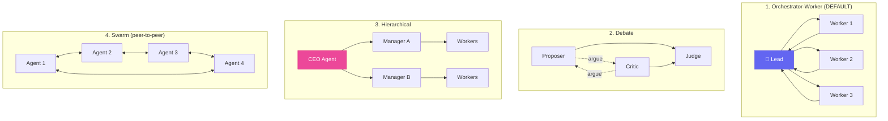

# Chapter 4 — Multi-Agent

<p style="font-size: 48px; line-height: 1; margin: 0 0 12px;">🧩</p>

> **"Anthropic Research multi-agent vượt Claude Opus 4 đơn lẻ +90.2%.**
> **Nhưng tốn 15x token. Multi-agent đáng giá không?"**

::: tip 🎯 Bạn sẽ học
- 4 pattern multi-agent: orchestrator-worker, debate, hierarchical, swarm
- Anthropic Research case (+90.2% trên internal eval)
- Devin + Goldman Sachs: hundreds of instance song song
- Frameworks 2026: LangGraph, CrewAI, Claude Code SDK, A2A protocol
- Cost reality + khi nào dùng / không dùng
:::

---

## 01 Tại sao multi-agent?

### Single-agent limitation

| Bottleneck | Single-agent |
|------|------|
| Context window | Bloat dần — performance drop |
| Sequential | Phải làm xong A → B → C |
| Cognitive load | 1 model lo nhiều domain → confused |

### Multi-agent unlock

- ✅ **Parallel** — 3 task cùng lúc → 3x faster
- ✅ **Specialized** — mỗi sub-agent role rõ
- ✅ **Fresh context** — sub-agent không bị bloat
- ❌ **15x token cost** — đắt!
- ❌ **Coordination overhead** — orchestrator + comm protocol

---

## 02 Anthropic Research case (T4/2025)

### Story

Anthropic build internal **multi-agent research system**: dùng cho company research task (technical analysis, market scan, competitive intel).

### Architecture

```
┌────────────────────────────────┐
│   LEAD AGENT (Sonnet)            │
│   Plan + spawn + synthesize       │
└─────────────────┬────────────────┘
                  │
   ┌──────────────┼──────────────┐
   │              │              │
┌──▼──────┐ ┌────▼──────┐ ┌────▼──────┐
│ Worker 1 │ │ Worker 2  │ │ Worker 3  │
│ Research │ │ Verify    │ │ Citation  │
│ topic A  │ │ claims    │ │ check     │
└─────────┘ └───────────┘ └───────────┘
   │              │              │
   ▼              ▼              ▼
 [Tool]        [Tool]         [Tool]
 (Search,     (Browse,        (Sources
  Read)        Read)           DB)
```

### Result

| Metric | Single agent | Multi-agent |
|------|------|------|
| Eval score | baseline | **+90.2%** |
| Token cost | 1x | **~15x** |
| Latency | 1x | 1.5-3x (parallel sub) |
| Coordination overhead | 0 | 10-20% |

### Quote

> *"Multi-agent systems can consume approximately 15x more tokens than standard chat interactions."*
> — *Anthropic*

---

## 03 Devin + Goldman Sachs — hybrid workforce

### Story

T7/2025: Goldman Sachs deploy **Devin (Cognition)** alongside **12,000 human engineer**.

| Item | Số |
|------|------|
| Human engineer | **12,000** |
| Devin instances (peak) | **Hundreds** |
| Task type | Real engineering ticket |
| Speed gain | **3-4x faster** trên complex task |
| Pricing Devin | $20-500/tháng (Devin 2.0 slashed) |

### Bài học

> **"Devin = employee #1 trong hybrid workforce."**
> — *Goldman CIO*

Pattern: **multi-instance Devin** parallel = multi-agent ở enterprise scale.

### Cognition AI growth

| Metric | Số |
|------|------|
| ARR Sept 2024 | $1M |
| ARR June 2025 | **$73M** (73x trong 9 tháng) |
| Valuation T4/2026 | **$25B** |

---

## 04 4 multi-agent patterns

::: tip 🎯 Pattern 1: Orchestrator-Worker

```
       LEAD AGENT
       (plan + synth)
            │
   ┌────────┼────────┐
   │        │        │
WORKER 1  WORKER 2  WORKER 3
(role A)  (role B)  (role C)
```

**Khi dùng**:
- Task có thể parallel breakdown
- Mỗi subtask có domain khác
- Cần synthesis cuối

**Example**: Research + audit + report generation
:::

::: tip 🎯 Pattern 2: Debate

```
AGENT A ←──────→ AGENT B
(propose)        (critique)
         │
         ▼
   JUDGE AGENT
   (decide)
```

**Khi dùng**:
- Decision cần multi-perspective
- Cần debug LLM bias
- Critical judgment

**Example**: Code review (proposer vs critic), legal contract review
:::

::: tip 🎯 Pattern 3: Hierarchical

```
       CEO AGENT
       (strategy)
          │
   ┌──────┴──────┐
   │             │
MANAGER A    MANAGER B
   │             │
 [W1,W2]      [W3,W4]
```

**Khi dùng**:
- Task lớn cần multi-level breakdown
- Tổ chức mô phỏng company

**Example**: Build product full-cycle (research → design → code → marketing)
:::

::: tip 🎯 Pattern 4: Swarm (peer-to-peer)

```
AGENT 1 ←──→ AGENT 2
   ↕              ↕
AGENT 4 ←──→ AGENT 3
```

**Khi dùng**:
- Task không có hierarchy rõ
- Emergent behavior needed
- Research / simulation

**Example**: Multi-agent reinforcement learning, simulation
:::

---

## 05 Anthropic principles cho sub-agent

::: warning ⚠️ 5 nguyên tắc Anthropic publish (T4/2025)

**1. Mỗi subagent cần objective rõ**
- Không "help me" vague
- Có: "Audit /src/auth for SQL injection, return list with line numbers"

**2. Output format defined**
- Subagent return JSON structured, không free text
- Orchestrator parse + synthesize được

**3. Tool guidance**
- Tell subagent dùng tool nào, khi nào
- Không để subagent figure out

**4. Task boundary clear**
- Subagent know task khi nào done
- Có exit condition (max iteration, success criteria)

**5. Fresh context window**
- Mỗi subagent có context riêng
- Không peer-to-peer comm channel
- Single summary return cho orchestrator
:::

---

## 06 Frameworks 2026 — landscape

### LangGraph — production powerhouse

| Item | Detail |
|------|------|
| Approach | Graph node + shared state |
| Production use | Klarna, Uber, LinkedIn agents |
| Strength | Best LangSmith observability, time-travel checkpoint |
| Stars (T5/2026) | Surpassed CrewAI early 2026 |
| Best for | Mission-critical production agent |

### CrewAI — easiest learning curve

| Item | Detail |
|------|------|
| Approach | Role-based DSL (Crew + Task + Agent) |
| Strength | **20 lines to start**, intuitive |
| Adoption | 60% Fortune 500, Insight Partners backing, 44K+ stars |
| Best for | Prototype, agency, demo |

### AutoGen — maintenance mode (T2/2026)

| Item | Detail |
|------|------|
| Status | Microsoft moved to maintenance mode |
| Replacement | Microsoft Agent Framework |
| Implication | Đừng start new project với AutoGen |

### OpenAI Swarm → Agents SDK

| Item | Detail |
|------|------|
| Approach | Lightweight handoff-based |
| Strength | Simple, OpenAI-native |
| Best for | OpenAI ecosystem |

### Anthropic Claude Code SDK

| Item | Detail |
|------|------|
| Approach | Orchestrator-worker via Task tool |
| Strength | MCP-native, Claude Code integration |
| Best for | Claude-first stack |

### A2A protocol (Google, donated to Linux Foundation)

| Item | Detail |
|------|------|
| Status | Open standard, donated T6/2025 |
| Supporters | 150+ — Atlassian, Salesforce, ServiceNow, SAP, Workday |
| Protocol | HTTP + SSE + JSON-RPC 2.0 + Agent Cards |
| Best for | Cross-vendor agent communication |

---

## 07 Code example — orchestrator pattern (Claude Code SDK)

```typescript
import { Anthropic } from '@anthropic-ai/sdk';

const client = new Anthropic();

// Lead agent (Sonnet) plans + synthesizes
async function leadAgent(task: string) {
  // Step 1: Plan
  const plan = await client.messages.create({
    model: 'claude-sonnet-4-6',
    system: 'You break tasks into 3 parallel subtasks.',
    messages: [{ role: 'user', content: task }],
  });
  
  const subtasks = parsePlan(plan); // ["audit X", "audit Y", "audit Z"]
  
  // Step 2: Spawn workers in parallel (Haiku for cheap)
  const workerResults = await Promise.all(
    subtasks.map(subtask =>
      client.messages.create({
        model: 'claude-haiku-4-5',
        system: `You complete this specific subtask: ${subtask}`,
        messages: [{ role: 'user', content: subtask }],
        tools: [readFile, grep, bash],
      })
    )
  );
  
  // Step 3: Synthesize
  const synthesis = await client.messages.create({
    model: 'claude-sonnet-4-6',
    system: 'Combine subtask results into coherent report.',
    messages: [{
      role: 'user',
      content: `Original task: ${task}\n\nResults:\n${workerResults.map(r => r.content[0].text).join('\n\n---\n\n')}`
    }],
  });
  
  return synthesis.content[0].text;
}

await leadAgent("Audit /src/ for security issues, suggest fixes, write report");
```

---

## 08 Khi nào dùng / không dùng multi-agent

::: tip ✅ Dùng multi-agent khi
- Task có sub-task parallel rõ
- Cost không phải vấn đề (15x token)
- Cần specialist (security audit + performance audit + UX audit)
- Domain breadth lớn (research scope rộng)
:::

::: warning ❌ Không dùng multi-agent khi
- Task sequential (A phải xong trước B)
- Budget constraint chặt
- Single domain (chỉ 1 lĩnh vực)
- Latency-sensitive (real-time chat agent)
- Coordination overhead > task value
:::

### Quick decision

```
Câu hỏi 1: Task có > 3 sub-task parallel không?
   NO  → Single agent
   YES → câu 2

Câu hỏi 2: Budget cho phép 15x token?
   NO  → Single agent
   YES → câu 3

Câu hỏi 3: Có need specialist khác domain?
   NO  → Single agent (chỉ chia task)
   YES → ✅ Multi-agent
```

---

## 09 Cost economics

### Real numbers (T5/2026)

| Setup | Token / task | Cost (Sonnet 4.6) | Time |
|------|------|------|------|
| Single Sonnet | 50K | **$0.75** | 30s |
| Orchestrator + 3 Haiku worker | 200K (15K orch + 60K × 3 worker) | **$1.05** | 20s (parallel) |
| Orchestrator + 5 Sonnet worker | 500K | **$7.50** | 30s |
| Anthropic Research full | 750K | **~$11** | 60-120s |

### ROI calculation

**Nếu task value > $10**: multi-agent OK
**Nếu task value < $1**: single agent
**Nếu run hàng nghìn task/ngày**: cost compound — optimize prompt cache + Haiku for sub

---

## 10 Common pitfalls

::: warning 🚨 6 sai lầm multi-agent

**1. Multi-agent cho task sequential** → cost 15x mà không gain. Single agent đủ.

**2. Sub-agent context overlap** → information redundant, cost lãng phí. Define boundary rõ.

**3. Output format không consistent** → orchestrator không parse được. Schema strict.

**4. Quên timeout** → 1 sub-agent stuck → orchestrator wait forever. Set max time.

**5. Cost monitoring không có** → bill shock cuối tháng. Per-task cost track.

**6. Eval không cover multi-agent** → không biết output quality. Test với sample.
:::

---

## 11 🇻🇳 Application VN

### Use case multi-agent cho VN

| Use case | Pattern | Stack |
|------|------|------|
| **Multi-channel CS** (Messenger + Zalo + web) | Orchestrator-Worker | Smax.ai + Anthropic |
| **Tax compliance audit** | Hierarchical | Claude + MCP for VN tax DB |
| **Multi-product e-com Shopee/Tiki/Lazada** | Swarm | n8n + Claude per channel |
| **Investment research VN stock** | Debate | LangGraph + market data |

### Smax.ai = multi-agent micro

Mỗi kênh (Messenger, Zalo, web, IG) = 1 sub-agent:
- Context riêng (kênh + customer history)
- Tool riêng (CRM, inventory, shipping)
- Orchestrator: human agent handover

**Yody case**: +15-20% close rate = multi-agent ở dạng dễ access cho VN SME.

### Cost ở VN context

- VN dev rate: $20-50/giờ
- Multi-agent system build: 2-4 tuần
- Cost end-product: $200-1K/tháng API
- Project price (consultant): $5K-30K

→ ROI rõ cho VN SME có volume conversation > 1K/tháng.

---

## 12 Bài tập

::: tip ✍️ 3 cấp độ

**Level 1 — 1 tuần**
- Implement orchestrator-worker basic
- Task: "Audit OSS repo for X, Y, Z" parallel
- Compare cost vs single agent

**Level 2 — 1 tháng**
- Use CrewAI hoặc LangGraph
- Build 1 production multi-agent (3+ worker)
- Add observability (LangSmith)

**Level 3 — 3 tháng**
- Pitch SME VN: multi-channel agent
- Deliver (Smax.ai + n8n hybrid)
- Charge $10K+
:::

---

## 13 🎥 Watch & Learn — 5 video tutorial

<ChapterVideos :videos="[
  { id: 'kQmXtrmQ5Zg', title: 'Building Agents with MCP — Full Workshop (Anthropic)', channel: 'AI Engineer', duration: '2:00:00', why: 'Workshop chính thức Anthropic (Mahesh Murag) — đi qua single agent → orchestrator-worker → debate. Baseline.' },
  { id: 'M30gp1315Y4', title: 'One Agent Is NOT ENOUGH: Agentic Coding BEYOND Claude Code', channel: 'IndyDevDan', duration: '25:00', why: 'Lập luận rõ: \'một agent là CEILING\'. Khi nào step up sang multi-agent với evidence từ real workflow.' },
  { id: '-1K_ZWDKpU0', title: 'Claude Code\'s Agent Teams Are Insane — Multi-Agent Coding Live', channel: 'IndyDevDan', duration: '20:00', why: 'Demo live Claude Code Agent Teams (T2/2026). Parallel execution + observability hooks.' },
  { id: 'rwqGQEzXF-o', title: 'How to Build Multi AI Agents with LangGraph', channel: 'AI Builder', duration: '30:00', why: 'Build supervisor pattern với LangGraph — framework production-grade nhất 2026.' },
  { id: 'I90xJlzAUW0', title: 'CrewAI Tutorial: Multiple Agents Working Together', channel: 'Tech with Tim', duration: '25:00', why: 'CrewAI dễ tiếp cận hơn LangGraph — role-based metaphor. Tốt cho người mới.' }
]" />

---

## 14 🔬 Deep Dive Techniques 2026

::: tip 🧩 8 advanced techniques cho multi-agent production

**1. Orchestrator-worker là default pattern 2026** — KHÔNG phải "swarm" hay "debate"
- Anthropic Research, Claude Code Agent Teams, OpenAI Agents SDK đều dùng pattern này
- Lý do: dễ debug, handoff rõ ràng, scale lý thuyết parallel

**2. Tỉ lệ token 15x là chi phí thật**
- Anthropic Research dùng **~15x token** so với single chat
- ROI rõ chỉ khi: (a) breadth-first task >5 independent threads, (b) total info vượt context single agent, (c) latency thấp > cost

**3. Context isolation là benefit thật, KHÔNG phải "agent debate ra ý hay hơn"**
- Mỗi sub-agent có context window riêng → tránh context pollution
- Đây là lý do thật khiến multi-agent thắng single agent

**4. Specialized sub-agents > general sub-agents**
- Spawn 1 "search agent" + 1 "code agent" + 1 "review agent" với system prompts khác nhau
- Đừng spawn 5 generic agents

**5. Hand-off > shared memory**
- A2A protocol (donated Linux Foundation T6/2025) định nghĩa: agents trao đổi qua Tasks structure, không share state
- Dễ debug hơn nhiều "shared scratchpad" mà AutoGen 0.x dùng

**6. Maintenance mode warning ⚠️**
- **AutoGen** đã vào maintenance mode (Microsoft chuyển team sang Magentic)
- **OpenAI Swarm** deprecated, thay bằng OpenAI Agents SDK (v0.17.1 T5/2026)
- Học 2026: **LangGraph, CrewAI, hoặc Claude Code SDK** — đừng học framework đang chết

**7. Observability là phần khó nhất**
- disler's `claude-code-hooks-multi-agent-observability` repo = reference implementation
- Cần trace TaskCreate / TaskUpdate / SendMessage events qua hook system
- Không observability = không debug được khi 1/5 agents fail

**8. Debate/consensus patterns hiếm khi worth it cho production**
- Research (Du et al.): debate tăng accuracy **5-15%** cho reasoning tasks
- Token cost **~3x**
- Production: orchestrator-worker + single critic agent > full debate
:::

---

## 15 📚 More Case Studies (2025-2026)

### Case A: Anthropic Research — **+90.2% vs single Opus 4**

| Item | Số |
|------|------|
| Architecture | Lead agent Opus 4 + 3-5 Sonnet 4 sub-agents parallel |
| **Beat single Opus 4** | **+90.2%** trên internal eval cho complex research |
| **Token cost** | **~15x** vs normal chat |
| **Time saving** | **Up to 90%** reduction cho complex query (parallel tool calls) |

> Source: [Anthropic engineering](https://www.anthropic.com/engineering/built-multi-agent-research-system) | [The AI Engineer](https://theaiengineer.substack.com/p/how-anthropic-built-multi-agent-deep)

### Case B: Devin × Goldman Sachs — **12K engineers + hundreds Devin instances**

| Item | Số |
|------|------|
| Launch | T7/2025 pilot, expansion ongoing |
| Goldman programming team | **12,000 người** |
| Devin instances deployed | **Hundreds** (scaling lên thousands) |
| CIO Marco Argenti target | Hybrid workforce → equivalent **14,400 dev output** từ 12K người (20% gain) |
| Goldman ambition | Up to **3-4x productivity** |
| Use cases | Legacy code, refactoring, debugging — supervised by humans |

> Source: [Fortune](https://fortune.com/2025/07/14/goldman-sachs-ai-powered-software-engineer-devin-new-employee-increase-productivity-fears-of-job-replacement/) | [CNBC](https://www.cnbc.com/2025/07/11/goldman-sachs-autonomous-coder-pilot-marks-major-ai-milestone.html)

### Case C: Cognition AI — **$1M → $155M ARR / 11 tháng, $25B valuation** (T4/2026)

| Cột mốc | Số |
|------|------|
| T6/2025 | **$73M ARR** (từ $1M T9/2024) |
| T7/2025 | Acquire Windsurf (AI-native IDE). Combined ARR +30% in 7 weeks post-close |
| Post-Windsurf | **$155M ARR** (T7/2025) |
| T9/2025 | **$400M raise** led by Founders Fund @ $10.2B valuation |
| **T4/2026** | **In talks at $25B valuation** |
| Customers | Goldman Sachs, Santander, Nubank + thousands |

> Source: [Cognition blog](https://cognition.ai/blog/funding-growth-and-the-next-frontier-of-ai-coding-agents) | [SiliconAngle](https://siliconangle.com/2026/04/23/cognition-creator-ai-software-engineer-devin-talks-raise-hundreds-millions-25b-valuation/)

---

## 16 🛠️ Tool Updates (Q1-Q2 2026)

| Tool | Update | Date | Key impact |
|------|------|------|------|
| **Claude Code Agent Teams GA** | Anthropic ship official Agent Teams. Multi-agent orchestration native | T2/2026 | Không cần framework ngoài |
| **OpenAI Agents SDK v0.17.x** | Stable release: handoffs, guardrails, tracing, Responses API | T3/2026 | Swarm chính thức deprecated |
| **A2A Protocol** | **150+ organizations** support: Google, Microsoft, AWS, Salesforce, SAP, ServiceNow, IBM | T4/2026 | Azure AI Foundry + Bedrock AgentCore + Google Cloud native |
| **LangGraph v1.0** | Default runtime cho LangChain agents. Stateful workflows + durable execution + human-in-the-loop stable | Late 2025 | Production-grade |
| **CrewAI Enterprise** | **150+ enterprise customers** (PwC, IBM, Capgemini, NVIDIA), powering **1.4B agentic automations** | 2026 | $3.2M revenue T7/2025 với 29-person team |

Source: [Linux Foundation A2A 150+ orgs](https://www.linuxfoundation.org/press/a2a-protocol-surpasses-150-organizations-lands-in-major-cloud-platforms-and-sees-enterprise-production-use-in-first-year)

---

## 17 📊 Architecture Diagram — 4 Multi-Agent Patterns



**Decision matrix:**
| Pattern | Khi nào dùng | Cost overhead |
|------|------|------|
| **Orchestrator-Worker** ⭐ | 90% production use case | Standard (15x token) |
| **Debate** | Critical decision, multi-perspective | 3x extra |
| **Hierarchical** | Big task multi-level (research → design → code → marketing) | 2-3x |
| **Swarm** | Emergent behavior, simulation | Highest, không predictable |

---

## 18 🧪 Hands-on Lab — Multi-Agent với LangGraph

::: tip 🎯 Goal
60-90 phút: build supervisor agent với 3 specialized workers (research, code, writer) dùng LangGraph.
:::

### Prerequisites checklist

```
□ Python 3.10+
□ Anthropic API key ($10+)
□ LangChain/LangGraph kinh nghiệm cơ bản
□ Familiar với agent loop
```

### Step 1. Setup

```bash
mkdir multi-agent-lab && cd multi-agent-lab
python -m venv venv && source venv/bin/activate

pip install langgraph langchain-anthropic langchain-core python-dotenv
echo "ANTHROPIC_API_KEY=sk-ant-..." > .env
```

### Step 2. Code supervisor + 3 workers

```python
# supervisor.py
import os
from typing import Annotated, TypedDict, Literal
from langchain_anthropic import ChatAnthropic
from langchain_core.messages import HumanMessage, AIMessage
from langgraph.graph import StateGraph, END
from langgraph.prebuilt import create_react_agent
from dotenv import load_dotenv

load_dotenv()

# === State ===
class TeamState(TypedDict):
    messages: Annotated[list, lambda x, y: x + y]
    next_agent: str  # which worker to call next
    final: str

# === Models ===
# Supervisor: Sonnet (smart routing)
supervisor_llm = ChatAnthropic(model='claude-sonnet-4-6', temperature=0)
# Workers: Haiku (cheap)
worker_llm = ChatAnthropic(model='claude-haiku-4-5', temperature=0)

# === Worker tools (simplified — usually real APIs) ===
def search_web(query: str) -> str:
    """Mock: simulate web search."""
    return f"[Search results for '{query}']: Top 3 results about {query}..."

def write_code(spec: str) -> str:
    """Mock: simulate code generation."""
    return f"```python\n# {spec}\nprint('Hello')\n```"

# === Workers ===
researcher = create_react_agent(worker_llm, tools=[search_web])
coder = create_react_agent(worker_llm, tools=[write_code])

def writer_node(state):
    """Final writer — combine + format."""
    msg = worker_llm.invoke([HumanMessage(content=f"""
Based on this conversation, write a clear final report:
{state['messages']}
Format: Markdown with sections.
""")])
    return {'messages': [msg], 'final': msg.content}

# === Supervisor (router) ===
def supervisor_node(state):
    """Decide which worker to call next or finish."""
    msg = supervisor_llm.invoke([HumanMessage(content=f"""
You are a supervisor managing 3 workers:
- 'researcher': searches information
- 'coder': writes code
- 'writer': writes final report

Conversation so far:
{state['messages']}

Decide who to call next. Respond ONLY with: 'researcher', 'coder', 'writer', or 'FINISH'.
""")])

    next_a = msg.content.strip().lower()
    if 'finish' in next_a:
        return {'next_agent': 'FINISH', 'messages': []}

    for w in ['researcher', 'coder', 'writer']:
        if w in next_a:
            return {'next_agent': w, 'messages': []}

    return {'next_agent': 'writer', 'messages': []}  # default

def researcher_node(state):
    """Researcher worker — uses search tool."""
    last_msg = state['messages'][-1].content if state['messages'] else ''
    result = researcher.invoke({
        'messages': [HumanMessage(content=f'Research: {last_msg}')]
    })
    return {'messages': result['messages']}

def coder_node(state):
    """Coder worker — uses code gen tool."""
    last_msg = state['messages'][-1].content if state['messages'] else ''
    result = coder.invoke({
        'messages': [HumanMessage(content=f'Code for: {last_msg}')]
    })
    return {'messages': result['messages']}

# === Routing ===
def route(state) -> Literal['researcher', 'coder', 'writer', '__end__']:
    next_a = state['next_agent']
    if next_a == 'FINISH':
        return '__end__'
    return next_a

# === Build graph ===
workflow = StateGraph(TeamState)
workflow.add_node('supervisor', supervisor_node)
workflow.add_node('researcher', researcher_node)
workflow.add_node('coder', coder_node)
workflow.add_node('writer', writer_node)

workflow.set_entry_point('supervisor')
workflow.add_conditional_edges('supervisor', route, {
    'researcher': 'researcher',
    'coder': 'coder',
    'writer': 'writer',
    '__end__': END,
})

# After workers, back to supervisor
for w in ['researcher', 'coder']:
    workflow.add_edge(w, 'supervisor')
workflow.add_edge('writer', END)

graph = workflow.compile()

# === Run ===
task = """Build a Python TODO list app with these requirements:
1. Research the best Python framework for CLI apps
2. Write the code
3. Create a final report explaining the architecture"""

result = graph.invoke({'messages': [HumanMessage(content=task)]})
print('\n=== FINAL ===')
print(result.get('final', result['messages'][-1].content))
```

### Step 3. Run

```bash
python supervisor.py
```

Quan sát console: supervisor calls researcher → researcher returns → supervisor calls coder → coder returns → supervisor calls writer → DONE.

### Step 4. Cost check

- ~3-5 supervisor calls (Sonnet) ~$0.10
- ~3-5 worker calls (Haiku) ~$0.05
- Total: ~$0.15-0.30/task. **40% cheaper** vs all-Sonnet.

### 🐛 Common errors + fixes

| Error | Fix |
|------|------|
| `Recursion limit` | Add max_iter check, force writer node after 5 supervisor calls |
| Supervisor always pick same worker | Improve prompt with example routing |
| Token cost explosion | Switch to all-Haiku, only Sonnet for synthesis |
| Tools fail | Mock tools first, add real APIs gradually |

---

## 19 🏗️ Mini-Project — Multi-channel Customer Support Agent

::: warning 🎯 Assignment

**Mục tiêu**: Build multi-agent system handle CS tickets từ 3 channels (Email, Slack, Web chat).

**Requirements**:
1. **Supervisor**: route ticket → channel-specific worker
2. **Email worker**: parse email, draft reply (formal tone)
3. **Slack worker**: parse Slack thread, draft reply (casual tone)
4. **Web chat worker**: real-time response (short, friendly)
5. **Common knowledge base**: tất cả workers query same KB
6. **Escalation worker**: human handoff khi confidence <70%

**Acceptance criteria**:
- [ ] LangGraph supervisor + 4 workers
- [ ] Tone consistency check per channel
- [ ] KB integration (vector DB hoặc simple JSON)
- [ ] Escalation logic + Slack notification cho human
- [ ] Cost: <$0.10/ticket
- [ ] CSAT survey integration

**Time estimate**: 1-2 tuần

**Stretch goals** 🚀:
- Multi-language (VN + EN)
- Sentiment analysis trigger escalation
- Analytics dashboard (tickets/day, deflection rate, CSAT)
:::

---

## 20 🎓 Knowledge Check

::: details 1. Multi-agent vs single-agent cost ratio điển hình?
**A.** 2x
**B.** 5x
**C.** 15x ✅
**D.** 100x

**Đáp án: C** — Multi-agent system consume ~15x more tokens than standard chat (per Anthropic). Cần ROI rõ để justify.
:::

::: details 2. Pattern default 2026 cho production multi-agent?
**A.** Debate
**B.** Swarm
**C.** Orchestrator-Worker ✅
**D.** Hierarchical

**Đáp án: C** — Orchestrator-worker là default. Dễ debug, handoff rõ ràng, scalable. Anthropic Research, Claude Code Agent Teams, OpenAI Agents SDK all dùng pattern này.
:::

::: details 3. Devin × Goldman Sachs deploy bao nhiêu instances?
**A.** Hàng chục
**B.** Hàng trăm ✅
**C.** Hàng nghìn
**D.** 50

**Đáp án: B** — Goldman: **hundreds Devin instances** alongside 12K engineer team. CIO Marco Argenti target equivalent 14,400 dev output (20% gain).
:::

::: details 4. AutoGen hiện status?
**A.** Active development
**B.** Most popular framework
**C.** Maintenance mode ✅
**D.** Acquired by Anthropic

**Đáp án: C** — **AutoGen vào maintenance mode**. Microsoft chuyển team sang Magentic. Đừng start new project với AutoGen 2026.
:::

::: details 5. A2A Protocol được donate cho?
**A.** OpenAI Foundation
**B.** Linux Foundation ✅
**C.** Apache Foundation
**D.** GitHub

**Đáp án: B** — Google donate **A2A Protocol** cho **Linux Foundation T6/2025**, 150+ organizations support T4/2026 (Atlassian, Salesforce, ServiceNow, SAP, Workday, etc.).
:::

::: details 6. Anthropic principle quan trọng nhất cho sub-agent?
**A.** Cùng model với orchestrator
**B.** Có objective clear + output format defined ✅
**C.** Vô hạn context window
**D.** Cùng prompt cho mọi sub-agent

**Đáp án: B** — Anthropic 5 principles: (1) objective rõ, (2) output format defined (JSON), (3) tool guidance, (4) task boundary clear, (5) fresh context window per sub-agent.
:::

::: details 7. Khi nào sub-agent dùng cùng model với orchestrator?
**A.** Luôn luôn
**B.** Khi sub-agent task simple (Haiku đủ) — KHÔNG nên ✅
**C.** Khi cost không phải vấn đề
**D.** Sub-agent dùng Haiku để giảm 40% cost

**Đáp án: D** — Orchestrator Sonnet + workers Haiku = giảm 40% cost vs all-Sonnet. Output gần như y hệt cho 90% case.
:::

::: details 8. LangGraph vs CrewAI: chọn nào cho production?
**A.** CrewAI luôn (easier)
**B.** LangGraph cho production-grade ✅
**C.** Cả 2 đều giống
**D.** AutoGen tốt hơn

**Đáp án: B** — **LangGraph** cho production (Klarna, Uber, LinkedIn). **CrewAI** cho prototype + agency. CrewAI dễ hơn (20 dòng to start) nhưng LangGraph mature hơn cho mission-critical.
:::

::: details 9. Pattern nào KHÔNG nên dùng?
**A.** Orchestrator-Worker cho parallel tasks
**B.** Multi-agent cho sequential task (A → B → C) ✅
**C.** Hierarchical cho big task
**D.** Debate cho critical decision

**Đáp án: B** — Sequential task không lợi từ parallel. 15x token cost không có ROI. Single agent đủ.
:::

::: details 10. Cognition AI valuation T4/2026?
**A.** $5B
**B.** $10B
**C.** $25B ✅ (in talks)
**D.** $100B

**Đáp án: C** — Cognition (Devin) growth: $1M ARR (T9/2024) → $73M (T6/2025) → $155M post-Windsurf → **$25B valuation talks T4/2026**. 73x trong 9 tháng.
:::

**Score**:
- 8-10/10 ✅ Ready cho Chapter 5 (Workflow Agent)
- 5-7/10 ⚠️ Re-read sections 1-13
- <5/10 ❌ Redo LangGraph lab

---

## 21 Đọc tiếp

- 💻 [Chapter 1 — Vibe Coding Solo](./1-vibe-coding-solo.md)
- 🧠 [Chapter 2 — Claude Code Deep](./2-claude-code-deep.md)
- 🖱️ [Chapter 3 — Computer Use](./3-computer-use.md)
- ⚙️ [Chapter 5 — Workflow Agent](./5-workflow-agent.md)
- 🔌 [Chapter 6 — MCP](./6-mcp-ecosystem.md)
- 🛡️ [Chapter 8 — Safety & Evals](./safety-evals.md)

::: tip 🧩 Lời cuối
> *"Multi-agent không phải always tốt hơn.*
> *15x token = phải có ROI rõ.*
>
> *Quy tắc đơn giản:*
> *- Task value > $10 → orchestrator-worker*
> *- Task value < $1 → single agent*
> *- Task có **parallel breakdown rõ** → multi-agent*
> *- Task **sequential** → single agent, kể cả khi to."*
:::
