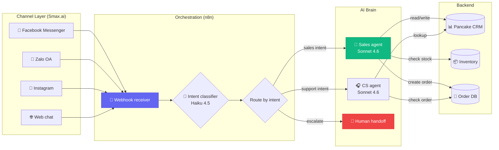

# Chapter 5 — Workflow Agent

<p style="font-size: 48px; line-height: 1; margin: 0 0 12px;">⚙️</p>

> **"300% ROI cho marketing team. 35% time saved cho HR.**
> **Lindy + n8n + Vapi — operator không code thay 5 nhân viên."**

::: tip 🎯 Bạn sẽ học
- 5 lớp workflow agent: n8n, Make, Smax.ai, Lindy, Sema4.ai
- Voice agent: ElevenLabs Conversational, Vapi, Retell
- Case VN: Yody (+15-20%), Let's Sushi (+300%), Biluxury
- Pattern cho non-dev / agency VN
- Cost economics + revenue model
:::

---

## 01 n8n — open-source workflow $40M ARR

### Numbers (T5/2026)

| Metric | Số |
|------|------|
| ARR | **$40M** (T7/2025) |
| Series B | **$180M led by Accel + Nvidia, $2.5B valuation** (T10/2025) |
| Enterprise customer | **3,000+** (Vodafone, Delivery Hero, Microsoft) |
| Active user | **230K** |
| GitHub stars | **183K+** (topped 2025 JS Rising Stars) |

### Vì sao n8n win

- **Open-source fair-code** (self-host free)
- **AI nodes native** — Claude, GPT, Gemini, custom LLM
- **400+ integration** (Slack, Notion, Airtable, HubSpot...)
- **Privacy-first** — không lock data ở vendor cloud
- **Pricing fair**: Cloud từ $20/tháng

### Cloud tier (T5/2026)

| Tier | Cost/tháng | Best for |
|------|------|------|
| Starter | $20 | Solo, 5K execution |
| Pro | $50 | Small team, 50K execution |
| Enterprise | Custom (avg $13.3K/year) | Production, SLA |

---

## 02 Smax.ai — VN dominant chatbot platform

### Profile

**Smax.ai** = VN AI sales bot platform. Focus: Messenger + Zalo + Instagram + web.

### Numbers VN case

#### Yody (fashion brand VN)

| Metric | Số |
|------|------|
| Sales close rate | **+15-20%** |
| Operating cost | **÷3** (slashed) |
| Setup time | ~2 tuần |

#### Let's Sushi (restaurant chain)

| Metric | Số |
|------|------|
| Total revenue surge | **+133%** |
| Online order | **+300%** |
| Channel | Facebook Messenger primary |

#### Biluxury (fashion, $5.3M brand)

| Metric | Số |
|------|------|
| User using Smax | ✅ |
| Use case | Multi-channel sales + support |

### Pricing (T5/2026)

| Tier | Cost/tháng | Channels |
|------|------|------|
| Starter | **$25** | 1 channel |
| Growth | **$49** | 3 channel |
| Pro | **$89** | Unlimited channel |
| Enterprise | Custom | + custom integration |

### Stack typical

```
Customer message (Messenger/Zalo/web)
        │
        ▼
Smax.ai router → AI agent (Claude/GPT)
        │
        ▼
Tool calls: CRM (Pancake) + inventory + shipping
        │
        ▼
Reply customer + log activity
        │
        ▼
Handover human if uncertain
```

---

## 03 Lindy — no-code agent builder

### Profile

**Lindy** = US-based no-code agent platform.

| Item | Detail |
|------|------|
| Apps supported | **2,300+** |
| Agent Builder | Visual flow + tool config |
| Lindy Build | Build agent từ description natural language |
| Computer Use | ✅ included Lindy Build |

### Pricing

| Tier | Cost/tháng |
|------|------|
| Free | $0 |
| Pro | **$49.99** |
| Business | **$299.99** |

### Use case typical

- **Lead qualifier**: scrape LinkedIn + email + qualify trước khi sale rep tiếp
- **Calendar assistant**: schedule + reschedule + reminder
- **Internal CS**: answer common question từ knowledge base
- **Outreach**: cold email + LinkedIn DM + follow-up

---

## 04 Vapi / ElevenLabs Conversational / Retell — voice agent

### Comparison T5/2026

| Tool | Latency | Cost/min | Strength | Best for |
|------|------|------|------|------|
| **ElevenLabs Conversational AI** | <100ms | $0.08-0.24 all-in | **11K+ voice, 70+ ngôn ngữ, sub-100ms** | Multi-language brand |
| **Vapi** | ~150ms | $0.05 orch + provider | **Provider-agnostic, 62M monthly call, 99.99% SLA** | Custom stack, scale |
| **Retell AI** | ~620ms | $0.07+ flat | **HIPAA included, no-code builder + SDK** | Healthcare, regulated |
| **Bland** | ~400ms | Variable | Phone-first | Outbound call campaign |

### Pipeline voice agent

```
Caller speaks ──→ STT (Cartesia/Deepgram) ──→ LLM (Claude/GPT) 
   ──→ Tool call (CRM lookup, schedule) ──→ TTS (ElevenLabs) ──→ Speaker
```

### Use case voice agent

- **Receptionist**: book appointment, answer FAQ
- **Outbound sale**: cold call qualify
- **Customer support**: T1 voice support
- **Survey / feedback**: post-purchase NPS call
- **Notification**: appointment reminder

---

## 05 Sema4.ai — enterprise SAFE platform

### Profile

| Item | Detail |
|------|------|
| Status | Acquired Robocorp |
| Funding | **$55.5M raised** |
| Customer | Emerson, Koch |
| Platform | SAFE (Sema4 Agent Framework Enterprise) |

### Use case

- **Finance**: invoice processing, AP/AR automation
- **HR**: onboarding cross-system
- **IT**: ticket triage + remediation
- **Sales**: lead enrichment

→ Enterprise tier, ít startup fit.

---

## 06 5 use case workflow agent

::: tip 🎯 5 use case high-ROI

### 1. Multi-channel sales (Smax.ai pattern)
- Channel: Messenger + Zalo + web + IG
- Agent: greet → qualify → product → close → handover
- ROI: +15-20% close (Yody case)

### 2. Voice receptionist (Vapi pattern)
- 24/7 phone answering
- Book appointment, FAQ, escalate
- ROI: 50-80% call deflection

### 3. Lead enrichment + outreach (Lindy pattern)
- Scrape LinkedIn → enrich → personalize email → send → follow-up
- ROI: 5-10x SDR throughput

### 4. Internal HR onboarding (Sema4.ai pattern)
- Create account ở 10 system (Slack, Notion, GitHub, Jira, payroll)
- Send welcome + checklist
- ROI: 35% HR time saved

### 5. Customer support T1 (multi-channel)
- Answer FAQ, lookup order, refund
- Escalate khi cần
- ROI: 40-60% ticket deflection
:::

---

## 07 Prompt pack — workflow agent

::: tip 📝 5 prompt template

**1. Sales agent system prompt (Smax.ai-style)**
```
You are [BRAND] sales assistant on Messenger.

Goal: qualify lead + close sale.

Process:
1. Greet warmly (1 line, mention brand)
2. Ask 2 qualifying question (need + budget)
3. Suggest 2-3 products matching
4. Offer promo if hesitate
5. Send checkout link
6. If price objection: escalate human

Tone: friendly, Vietnamese, casual.
Knowledge base: [link]
Inventory: [link]

Handover to human if:
- Customer angry/upset
- Question outside product
- Refund / complaint
```

**2. Voice receptionist (Vapi prompt)**
```
You are receptionist for [BUSINESS].

Greeting: "Xin chào! [Business name] xin nghe. Anh/chị cần gì ạ?"

Capabilities:
- Book appointment (slot: [available])
- Answer FAQ from [knowledge]
- Take message

Don't:
- Quote price (transfer to sales)
- Make refund (transfer to manager)

If unclear after 2 try: "Để tôi chuyển sang nhân viên hỗ trợ."

Tone: warm, professional, clear.
Speak slowly for elderly customer.
```

**3. Lead enrichment (Lindy / n8n)**
```
Input: LinkedIn URL list (CSV)

For each URL:
1. Scrape: name, title, company, industry
2. Enrich: company size, funding, tech stack (BuiltWith)
3. Score: 1-5 based on ICP fit
4. If score >= 4:
   - Gen personalized email opener
   - Add to CRM "Hot Lead"
5. Output: Google Sheet with all data
```

**4. HR onboarding (n8n flow)**
```
Trigger: new employee in HR system

Steps:
1. Create Slack account, invite to #general + team channel
2. Create GitHub user, add to org + repo
3. Create Notion account, share onboarding doc
4. Send welcome email with checklist + manager intro
5. Schedule Day-1 meeting with manager
6. Notify IT to prep equipment

Error handling: if any step fail, send Slack alert to HR
```

**5. CS triage (n8n + AI)**
```
Trigger: new ticket / email / chat

AI classifier:
- Intent: question / complaint / refund / praise
- Priority: P1 (urgent) / P2 (normal) / P3 (low)
- Topic: billing / product / shipping / other

Route:
- P1 → notify on-call human
- P2 + question → answer from knowledge base
- P3 → queue for tomorrow
- Complaint → escalate manager

Log: every action to CRM
```
:::

---

## 08 Pattern thực hành — VN

### Pattern 1: Smax.ai + ChatGPT/Claude API

```
Smax.ai (multi-channel router)
    │
    ├── Messenger ──→ AI sales agent
    ├── Zalo OA ──→ AI sales agent
    ├── Instagram ──→ AI sales agent
    └── Web chat ──→ AI sales agent
            │
            ▼
       Pancake CRM (data sync)
            │
            ▼
       Shopify / WooCommerce (inventory)
```

### Pattern 2: n8n + Claude + VN tools

```
Trigger: new order in Shopify VN
    │
    ▼
n8n flow:
1. Send confirmation Zalo
2. Update Misa kế toán (invoice)
3. Notify warehouse Slack
4. Schedule delivery Ahamove
5. Follow-up review after 3 days

LLM (Claude) used for:
- Personalize Zalo message
- Generate invoice memo
- Draft review request
```

### Pattern 3: Vapi voice + VN business

```
Inbound call (số hotline)
    │
    ▼
Vapi voice agent (giọng Việt qua ElevenLabs)
    │
    ├── Book appointment ──→ Google Calendar
    ├── Order status ──→ check Misa / Pancake
    ├── FAQ ──→ knowledge base
    └── Complaint ──→ transfer human
```

---

## 09 🇻🇳 Cơ hội cho VN agency / consultant

### Service offer pattern

| Service | Project price | Recurring |
|------|------|------|
| **Smax.ai setup** cho SME | $1-3K | $89/tháng + maintenance |
| **n8n workflow** custom | $3-10K | $200-500/tháng support |
| **Voice agent** (Vapi) | $5-15K | $300-1K/tháng API |
| **Full automation** suite | $10-50K | $1-5K/tháng |

### Target market VN

| Industry | Pain | Solution |
|------|------|------|
| **F&B chain** (restaurant) | Multi-branch order chaos | n8n + Pancake + voice agent |
| **Fashion retail** | Multi-channel order | Smax.ai (Yody pattern) |
| **Real estate** | Lead qualify chậm | Lindy + voice + CRM |
| **Edu / center** | Student inquiry | Voice + Messenger agent |
| **Healthcare clinic** | Appointment book | Vapi + Google Calendar |

### Skills cần để bán service

1. **n8n proficiency** (1-2 tháng học)
2. **API integration** sense (work with Misa, Pancake, KiotViet)
3. **Prompt engineering** cho LLM
4. **Voice agent basic** (Vapi flow)
5. **Sales / pitch** to SME owner

### Income model VN agency

| Year | Project / year | Revenue |
|------|------|------|
| Y1 | 5 project × $5K avg | **$25K + $10K recurring** |
| Y2 | 15 project × $8K | **$120K + $40K recurring** |
| Y3 | 30 project × $10K | **$300K + $100K recurring** |

→ Possible build agency VN $400K/năm sau 3 năm.

---

## 10 Common pitfalls

::: warning 🚨 7 sai lầm workflow agent

**1. Over-promise "AI thay nhân viên"** → khách thất vọng. Promise "AI giảm 40-60% workload".

**2. Skip knowledge base** → agent hallucinate. Đầu tư KB rõ ràng.

**3. Không handover human khi cần** → khách upset. Always có escalation path.

**4. Voice agent giọng robot** → trust thấp. Dùng ElevenLabs quality voice + emotion tag.

**5. Quên rate limit + cost monitor** → bill shock. Set budget alert.

**6. Không A/B test prompt** → performance flat. Iterate weekly.

**7. Không có analytics** → không cải thiện được. Track: conversation count, success rate, escalation rate, CSAT.
:::

---

## 11 Bài tập

::: tip ✍️ 3 cấp độ

**Level 1 — 1 tuần**
- Setup n8n cloud Starter
- Build 1 workflow: "auto reply Slack mention với Claude"
- Setup Smax.ai trial cho 1 page Facebook test

**Level 2 — 1 tháng**
- Build 5 n8n workflow cho own SaaS
- Build 1 Smax.ai sales agent cho 1 brand SME (free / pro bono)
- Đo metric: response time, deflection rate

**Level 3 — 6 tháng**
- Pitch 3 SME VN, close 1 project $5-10K
- Setup recurring $500/tháng support
- Build portfolio + case study
:::

---

## 12 🎥 Watch & Learn — 5 video tutorial

<ChapterVideos :videos="[
  { id: 'GuaKeDS6UKU', title: 'n8n Quick Start: Build Your First AI Agent [2026]', channel: 'n8n Official', duration: '20:00', why: 'Up-to-date n8n flow builder UX 2026, native AI Agent node. Starting point cho người chưa từng dùng n8n.' },
  { id: 'HuKiMqqELGo', title: 'Master AI Agents 2025 in Mins with n8n!', channel: 'Cole Medin', duration: '30:00', why: 'Cole Medin = reference cho n8n + AI agent. Cover memory, tool calling, multi-step workflow.' },
  { id: 'mQt1hOjBH9o', title: 'I Built the ULTIMATE n8n RAG AI Agent Template', channel: 'Cole Medin', duration: '35:00', why: 'RAG pattern thực tế trong n8n. Template open-source. Dùng cho 90% workflow agent business case.' },
  { id: 'VNdF3B6-tyQ', title: 'Build a Voice Agent in 15 Minutes Using VAPI (2026)', channel: 'Vapi Tutorials', duration: '15:00', why: 'Vapi đạt 1 BILLION calls (T5/2026). Tutorial latest UI: STT → LLM → TTS pipeline.' },
  { id: 'x5q02lmUhVM', title: 'Build a Personal AI Voice Agent with ElevenLabs (n8n)', channel: 'n8n Community', duration: '25:00', why: 'ElevenLabs Conversational AI + n8n. Pattern Smax.ai/AIECOS dùng — voice + workflow integration.' }
]" />

> 🇻🇳 **Vietnamese coverage**: Smax.ai chưa có YouTube channel official với tutorial dài. Hỏi Dân IT (@hoidanit), 200Lab cover dev tools tổng quát. Recommend join community AIECOS để Q&A tiếng Việt.

---

## 13 🔬 Deep Dive Techniques 2026

::: tip ⚙️ 7 advanced techniques cho workflow + voice agent

**1. Workflow agent ≠ chat agent**
- Workflow: có **trigger** (webhook, schedule, event) + **deterministic path** với AI node
- Chat: user-driven, conversational loop
- Khi tư vấn khách: "Bạn cần AI tự chạy theo lịch/trigger, hay user phải chat với nó?"

**2. Voice agent cần latency budget <800ms turn-around**
- Vapi đạt **99.99% SLA**
- Stack chuẩn:
  - Deepgram STT (~100ms)
  - GPT-4o-mini / Claude Haiku (~300ms first token)
  - ElevenLabs Turbo TTS (~200ms)
- Vượt 1s → user thấy "chậm"

**3. n8n MCP node thay đổi cuộc chơi**
- n8n có **MCP Server Trigger** và **MCP Client Tool** nodes
- Expose n8n workflow như MCP tool cho Claude Desktop / Cursor dùng
- Pattern: "n8n = backend, Claude = brain" cực mạnh cho solo operator

**4. Smax.ai vs n8n: bổ sung, không cạnh tranh**
- **Smax.ai** = channel layer (Facebook, Zalo OA, TikTok, Shopee)
- **n8n** = logic layer
- **AIECOS stack chuẩn**: Smax (channel) → n8n webhook (orchestration + LLM + DB) → CRM/ERP API
- Đừng cố làm tất cả trong Smax flow builder

**5. Cost control LLM trong workflow**
- 1 workflow chạy 1,000 lần/ngày × 5 LLM calls/run = **5,000 calls/ngày**
- **Routing rules**:
  - Haiku/4o-mini cho classification/extraction
  - Sonnet/4o cho generation
- → Tiết kiệm **60-80% cost**
- Pattern n8n: IF node check task complexity → branch LLM model

**6. Memory & state là điểm fail #1**
- Voice agent quên context giữa turn = khách cúp máy
- Workflow agent quên customer history = robot không nhớ tên
- Pattern: dùng **Postgres / Supabase / Redis** cho persistent memory
- KHÔNG dùng LLM context window (cost cao + bị reset)

**7. Human handoff là feature, không phải bug**
- Yody, Let's Sushi đều có human handoff khi bot không xử lý nổi
- "Escalation path" rõ ràng: trigger Slack notification, gán cho human agent
:::

---

## 14 📚 More Case Studies (2025-2026)

### Case A: n8n — **$7.2M → $40M ARR / $2.5B valuation** trong 12 tháng

| Thời điểm | ARR / Valuation |
|------|------|
| 2024 | $7.2M ARR, ~$350M valuation (Series B) |
| **T10/2025** | **$180M Series C @ $2.5B valuation** led by Accel (+ NVIDIA, Sequoia, HV Capital) |
| T3/2025 | **230,000+ active users**, $40M+ ARR |

> **Lesson VN**: workflow automation + AI agent là segment thật, không phải hype.
> Source: [PitchBook](https://pitchbook.com/news/articles/ai-agent-startup-n8n-lands-2-5b-valuation-with-180m-series-c)

### Case B: Vapi — **1 BILLION calls cumulative + Amazon Ring win** (T5/2026)

| Item | Số |
|------|------|
| Series B | **$50M @ $500M valuation** T5/2026 led by Peak XV |
| Developers | **1+ million** |
| Unique agents created | **2.7M+** |
| **Amazon Ring** | Chose Vapi over **40 competing voice AI platforms** |
| Enterprise customers | Kavak, Instawork, New York Life, Intuit |
| **SLA** | **99.99% trên 62M monthly calls** |

> Source: [TechCrunch](https://techcrunch.com/2026/05/12/vapi-hits-500m-valuation-as-amazon-ring-chose-its-ai-platform-over-40-rivals/) | [Globe Newswire](https://www.globenewswire.com/news-release/2026/05/12/3292882/0/en/vapi-raises-50m-series-b-as-it-reaches-1-billion-calls-powering-the-next-generation-of-enterprise-voice-ai.html)

### Case C: Smax.ai × Yody / Let's Sushi / Biluxury (Vietnam)

| Brand | Result |
|------|------|
| **Yody** (fashion VN) | +15-20% close rate, **3x cost reduction**, no team expansion |
| **Let's Sushi** (F&B Hanoi) | Featured by **Meta** as success story. **+300% online orders** post-deployment |
| **Biluxury** (menswear, $5.3M) | Smax revolutionize digital customer engagement |

> **Lesson VN operator**: case study local chứng minh ROI rõ — dùng làm pitch cho khách VN.
> Source: [Smax.ai](https://smax.ai/en/index.html) | [Meta × Smax × Let's Sushi case](https://swngproductions.com/work/meta-x-smax-x-lets-sushi-video-case-study/)

---

## 15 🛠️ Tool Updates (Q1-Q2 2026)

| Tool | Update | Date | Key impact |
|------|------|------|------|
| **Vapi** | $50M Series B + **1B calls milestone** | T5/2026 | Voice agent production-grade. Latency + SLA không còn vấn đề |
| **n8n native AI Agent node 2.0** | Memory, tool calling, MCP support tích hợp sẵn | Q1/2026 | Không cần Custom Node nữa |
| **ElevenLabs Conversational AI 2.0** | 70+ ngôn ngữ, low-latency, enterprise security tier | Q1/2026 | Production-ready cho multi-lingual |
| **Pancake (VN)** | Ra mắt **MCP support beta** | T4/2026 | Claude/n8n đọc inbox + gửi reply trực tiếp |
| **Lindy AI** | **1,600+ app integrations**, model-agnostic. Total **$49.9M funding** | 2026 | No-code agent over apps |
| **Sema4.ai** | Tăng trưởng silent, mention nhiều trong enterprise procurement | Q2/2026 | Enterprise workflow agent |

---

## 16 📊 Architecture Diagram — Smax + n8n + LLM cho AI Sale Agent



**Architecture insights:**
- **Smax.ai = channel layer** (KHÔNG làm logic phức tạp ở đây)
- **n8n = orchestration + business logic** (webhook receive → classify → route → call AI → action)
- **Claude/GPT = brain** (chỉ cho high-value reasoning)
- **CRM/DB = state** (persistent memory ngoài context window LLM)
- **Human escalation = mandatory** cho complex case

---

## 17 🧪 Hands-on Lab — Build AI Sale Agent với n8n + Claude + Smax.ai (VN)

::: tip 🎯 Goal
90 phút: build sale bot trên Facebook Messenger, dùng Smax.ai channel + n8n logic + Claude brain. Bot trả lời câu hỏi product + chốt đơn đơn giản.
:::

### Prerequisites checklist

```
□ Smax.ai trial account (free 14 ngày — smax.ai/en/index.html)
□ Facebook Page đã có (test page OK)
□ n8n Cloud Starter ($20/tháng) HOẶC n8n self-host (Docker free)
□ Anthropic API key
□ 1 sản phẩm mẫu để test (vd "Áo thun cotton, 200K VND")
```

### Step 1. Setup Smax.ai + connect FB Page

1. Sign up smax.ai → connect Facebook Page
2. Tạo "First Flow" → trigger "Khi nhận message"
3. Add action "Call webhook" → URL n8n (Step 3)

### Step 2. Setup n8n (Cloud hoặc Docker)

```bash
# Self-host Docker (free)
docker run -it --rm \
  --name n8n \
  -p 5678:5678 \
  -v n8n_data:/home/node/.n8n \
  n8nio/n8n

# Open http://localhost:5678
```

### Step 3. n8n workflow

Tạo workflow mới:

**Node 1: Webhook trigger**
- Method: POST
- Path: `/smax-message`
- Copy URL → paste vào Smax.ai action

**Node 2: HTTP Request (Claude API)**

```json
{
  "method": "POST",
  "url": "https://api.anthropic.com/v1/messages",
  "headers": {
    "x-api-key": "{{$env.ANTHROPIC_KEY}}",
    "anthropic-version": "2023-06-01",
    "content-type": "application/json"
  },
  "body": {
    "model": "claude-haiku-4-5",
    "max_tokens": 512,
    "system": "Bạn là sale agent cho shop áo thun cotton. Sản phẩm: 'Áo thun cotton' 200K VND, size S/M/L/XL, màu trắng/đen. Mục tiêu: tư vấn size + chốt đơn. Trả lời ngắn gọn, thân thiện, tiếng Việt.",
    "messages": [
      {
        "role": "user",
        "content": "={{ $json.body.message_text }}"
      }
    ]
  }
}
```

**Node 3: Send reply back to Smax**

```json
{
  "method": "POST",
  "url": "https://api.smax.ai/v1/conversation/{{$json.body.conversation_id}}/send",
  "headers": {
    "Authorization": "Bearer {{$env.SMAX_TOKEN}}"
  },
  "body": {
    "text": "={{ $node['Claude'].json.content[0].text }}"
  }
}
```

### Step 4. Test

1. Open Facebook Messenger → message vào test page: "Có áo size M không?"
2. Quan sát n8n execution log → Claude response → Smax send reply
3. Bot reply: "Dạ shop có áo size M trắng và đen ạ! Anh/chị muốn lấy màu nào?"

### Step 5. Add escalation logic

Thêm IF node sau Claude:
- **Condition**: response.content contains "không rõ" OR "chuyển nhân viên"
- **True branch**: Send Slack notification cho human agent + reply user "Em đang chuyển sang nhân viên hỗ trợ ạ"
- **False branch**: Send bot reply

### 🐛 Common errors + fixes

| Error | Fix |
|------|------|
| Smax webhook không trigger | Check Smax Flow đang ACTIVE + FB Page subscribe webhook |
| n8n không nhận request | Self-host: dùng ngrok expose `localhost:5678`. Cloud: dùng URL n8n |
| Claude API 401 | Check x-api-key header. Top-up Anthropic $5+ |
| Response chậm | Switch Haiku → Sonnet chỉ cho query phức tạp. Cache common QA |
| Bot trả lời không liên quan | Improve system prompt với example conversation |

---

## 18 🏗️ Mini-Project — Full AI Sale Agent cho 1 SME VN

::: warning 🎯 Assignment

**Mục tiêu**: Deploy production-grade AI Sale Agent cho 1 SME VN thật (pet-friendly: dùng demo brand nếu chưa có client).

**Bối cảnh**: Bạn là consultant cho 1 shop fashion VN — 50-100 order/ngày qua Messenger. Owner muốn AI handle 70% inquiry để nhân viên focus chốt đơn lớn.

**Requirements**:
1. **3 channels**: Facebook Messenger + Zalo OA + Instagram DM
2. **Product catalog**: 20+ SKU với ảnh, giá, mô tả (export từ Pancake/KiotViet/Sapo)
3. **Conversation flows**:
   - Greet + qualify (need + budget)
   - Product recommendation (vector search)
   - Size advice
   - Stock check
   - Promo upsell
   - Checkout link gen
   - Escalate human (complaint, refund, price negotiate)
4. **Analytics dashboard**:
   - Conversation count / day
   - Conversion rate (chat → order)
   - Top product asked
   - Escalation rate
5. **Cost monitoring**: alert >$50/ngày

**Acceptance criteria**:
- [ ] 3 channel work end-to-end
- [ ] Conversation tự nhiên (test 20 conversation với người thật)
- [ ] Close rate > 15% (industry benchmark)
- [ ] Escalation rate < 20%
- [ ] Cost < 5% revenue
- [ ] Documentation cho client team training

**Time estimate**: 2-3 tuần

**Stretch goals** 🚀:
- TikTok Shop integration (livestream → DM funnel)
- Voice agent (Vapi) cho phone order
- Multi-shop support (1 platform, N shop)
- White-label cho agency

**Pricing benchmark** (cho agency):
- Setup: **$3-5K** (1 lần)
- Recurring: **$300-1K/tháng** support
- Revenue share: 1-2% sales attributed to bot
:::

---

## 19 🎓 Knowledge Check

::: details 1. Smax.ai vs n8n: pattern đúng cho AIECOS stack?
**A.** Smax handle all logic
**B.** Smax = channel layer, n8n = logic layer ✅
**C.** n8n = channel, Smax = logic
**D.** Tự build cả 2

**Đáp án: B** — Smax channel + n8n orchestration + Claude/GPT brain + CRM state. Đừng cố nhét logic phức tạp vào Smax flow builder.
:::

::: details 2. Voice agent cần latency tối đa bao nhiêu để feel natural?
**A.** <2s
**B.** <800ms turn-around ✅
**C.** <100ms
**D.** Latency không quan trọng

**Đáp án: B** — Vapi 99.99% SLA, stack chuẩn: Deepgram STT (~100ms) + Claude Haiku (~300ms first token) + ElevenLabs Turbo (~200ms) = ~800ms total.
:::

::: details 3. n8n MCP node làm được gì?
**A.** Chỉ call MCP tools
**B.** Expose n8n workflow như MCP server cho Claude/Cursor ✅
**C.** Convert MCP → REST
**D.** Cả A và B

**Đáp án: D** — n8n có **MCP Server Trigger** (expose workflow) và **MCP Client Tool** (call MCP tools). Pattern "n8n = backend, Claude = brain" cực mạnh.
:::

::: details 4. Vapi đạt bao nhiêu cumulative calls?
**A.** 100M
**B.** 500M
**C.** 1 BILLION ✅
**D.** 10 billion

**Đauán: C** — Vapi đạt **1 BILLION calls** cumulative T5/2026. $50M Series B @ $500M valuation, Amazon Ring chose Vapi over 40 competitors.
:::

::: details 5. Yody (VN fashion) đạt close rate boost bao nhiêu với Smax.ai?
**A.** +5-10%
**B.** +15-20% ✅
**C.** +50%
**D.** +100%

**Đáp án: B** — Yody: **+15-20% sales close rate**, **3x cost reduction**, no team expansion needed.
:::

::: details 6. Let's Sushi đạt growth gì với Smax.ai chatbot?
**A.** +50% revenue
**B.** +133% revenue, +300% online orders ✅
**C.** +20% subscribers
**D.** -50% support tickets

**Đáp án: B** — Let's Sushi (F&B Hanoi): featured by Meta, **+133% revenue, +300% online orders**.
:::

::: details 7. n8n raise gần nhất là?
**A.** $50M Series A
**B.** $100M Series B
**C.** $180M Series C @ $2.5B ✅
**D.** $500M Series D

**Đáp án: C** — n8n **$180M Series C @ $2.5B valuation T10/2025** led by Accel (+ NVIDIA, Sequoia, HV Capital). $40M ARR.
:::

::: details 8. Cost control LLM trong workflow nên áp dụng pattern nào?
**A.** Dùng GPT-4o cho mọi task
**B.** IF node check complexity → branch Haiku (simple) vs Sonnet (complex) ✅
**C.** Dùng model nhỏ nhất luôn
**D.** Cache mọi response

**Đáp án: B** — Routing rules giảm 60-80% cost: Haiku/4o-mini cho classification/extraction, Sonnet/4o cho generation. Pattern n8n: IF node check task complexity → branch LLM model.
:::

::: details 9. Memory & state failure mode #1 là gì?
**A.** Database crash
**B.** Voice agent quên context giữa turn → khách cúp máy ✅
**C.** API rate limit
**D.** Token cost

**Đáp án: B** — Voice agent quên context = khách cúp máy. Workflow agent quên customer history = robot không nhớ tên. **Dùng Postgres/Supabase/Redis cho persistent memory**, KHÔNG dùng LLM context window.
:::

::: details 10. Human handoff là?
**A.** Bug cần fix
**B.** Feature, không phải bug ✅
**C.** Last resort
**D.** Sign of failure

**Đáp án: B** — Yody, Let's Sushi đều có human handoff. **"Escalation path" rõ ràng**: trigger Slack notification, gán cho human agent. Là feature, không phải failure.
:::

**Score**:
- 8-10/10 ✅ Ready cho Chapter 6 (MCP Ecosystem)
- 5-7/10 ⚠️ Re-read sections 1-12
- <5/10 ❌ Redo lab end-to-end với Smax thật

---

## 20 Đọc tiếp

- 💻 [Chapter 1 — Vibe Coding Solo](./1-vibe-coding-solo.md)
- 🖱️ [Chapter 3 — Computer Use](./3-computer-use.md)
- 🧩 [Chapter 4 — Multi-Agent](./4-multi-agent.md)
- 🔌 [Chapter 6 — MCP](./6-mcp-ecosystem.md)
- 🧰 [Chapter 7 — Toolkit](./toolkit-2026.md)
- 🛡️ [Chapter 8 — Safety](./safety-evals.md)

::: tip ⚙️ Lời cuối
> *"Workflow agent ≠ chatbot xưa.*
> *Workflow agent = **operator ảo** plan + execute + escalate.*
>
> *Cho VN: lớp dễ access nhất.*
> *Không cần code. Cần hiểu business process.*
>
> *Yody, Let's Sushi đã prove. Còn 100,000 SME VN khác chưa làm."*
:::
