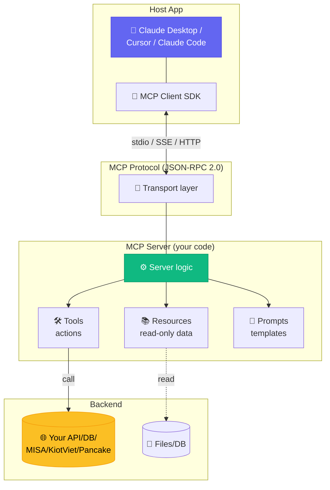

# Chapter 6 — MCP Ecosystem

<p style="font-size: 48px; line-height: 1; margin: 0 0 12px;">🔌</p>

> **"Anthropic open MCP tháng 11/2024.**
> **Chưa đầy 18 tháng: 97M downloads/tháng, 78% enterprise adoption.**
> **Đây là cách AI 'cắm' vào hệ thống doanh nghiệp."**

::: tip 🎯 Bạn sẽ học
- MCP là gì + tại sao Anthropic "win the standard"
- 78% enterprise có ≥1 MCP agent production
- A2A protocol (Google donate Linux Foundation) — protocol song song
- 🇻🇳 Cơ hội build MCP cho stack VN (MISA, KiotViet, Sapo, Pancake, Base)
- Cách build MCP server đơn giản
:::

---

## 01 MCP là gì?

**Model Context Protocol** = open standard cho LLM agent kết nối với external tool / data source.

### Vấn đề trước MCP

Mỗi LLM vendor có cách riêng:
- OpenAI: function calling
- Anthropic: tool use
- Google: function declarations
- Cursor: own integration
- Windsurf: own integration
- Claude Code: own integration

→ **N×M problem**: N LLM × M tool = chaos integration.

### MCP giải quyết

```
Before MCP:
LLM A ──→ custom adapter ──→ Tool 1
LLM A ──→ custom adapter ──→ Tool 2
LLM B ──→ custom adapter ──→ Tool 1
LLM B ──→ custom adapter ──→ Tool 2
(N × M)

After MCP:
LLM A ──┐
LLM B ──┼──→ MCP standard ──→ Tool 1
LLM C ──┘                    Tool 2
                              Tool 3
(N + M)
```

### Components

```
┌─────────────┐    MCP    ┌──────────────┐
│   LLM       │ ────────→ │  MCP server   │
│  (client)   │           │              │
└─────────────┘ ←──────── │  - Tools     │
                          │  - Resources  │
                          │  - Prompts   │
                          └──────────────┘
                                  │
                                  ▼
                          [Underlying service]
                          GitHub / Slack / DB / etc.
```

---

## 02 Stat khủng (T5/2026)

| Metric | Số |
|------|------|
| **MCP SDK downloads/tháng** | **97 triệu** (T3/2026) |
| Growth in 18 months | **970x** (từ 100K tháng đầu) |
| **MCP servers registered** | **17,468** (cross-registry census) |
| Official registry | **5,800+** |
| **78%** enterprise có ≥1 MCP agent production | WorkOS report |
| **67%** CTO name MCP default agent-integration | (vs A2A 23%, ACP 8%) |

---

## 03 Adoption — ai đã adopt MCP?

### LLM vendor

| Vendor | Status |
|------|------|
| **Anthropic** | ✅ Creator, native |
| **OpenAI** | ✅ T4/2025 (ChatGPT Apps SDK) |
| **Google** | ✅ T3/2026 (Gemini API + Vertex AI Agent Builder) |
| **Microsoft / Copilot** | ✅ Partial (compete với own protocol) |

### IDE / coding tool

| Tool | MCP support |
|------|------|
| **Cursor** | ✅ |
| **Windsurf** | ✅ |
| **Zed** | ✅ |
| **JetBrains** | ✅ |
| **Claude Code** | ✅ Native |
| **Vercel AI SDK** | ✅ |

### Framework

| Framework | MCP integration |
|------|------|
| **LangChain / LangGraph** | ✅ |
| **CrewAI** | ✅ |
| **OpenAI Agents SDK** | ✅ |

---

## 04 A2A protocol — competitor / complement

### Google A2A (Agent-to-Agent)

| Item | Detail |
|------|------|
| Announce | T4/9/2025 |
| Donated to | **Linux Foundation T6/2025** |
| Supporters | **150+** — Atlassian, Salesforce, ServiceNow, SAP, Workday |
| Protocol | HTTP + SSE + JSON-RPC 2.0 + Agent Cards |
| Use case | Agent ↔ agent comm (different vendor) |

### MCP vs A2A — không xung đột

| | **MCP** | **A2A** |
|------|------|------|
| Mục đích | LLM ↔ tool/data | Agent ↔ agent |
| Standard owner | Anthropic | Google → Linux Foundation |
| Mature stage (T5/2026) | Established (78% enterprise) | Early adoption |
| Best for | Single agent + many tool | Multi-vendor agent network |

→ **Học MCP trước, A2A sau** (khi cần cross-vendor agent).

---

## 05 MCP server ecosystem

### Top MCP server (T5/2026)

| Category | Server | Use |
|------|------|------|
| **Dev tools** | github, postgres, sqlite, filesystem, git | Code + data ops |
| **Cloud** | aws, gcp, cloudflare, vercel | Infra automation |
| **Productivity** | slack, notion, linear, jira, asana | Work management |
| **Customer / CRM** | hubspot, salesforce, intercom | Sales/CS ops |
| **Communication** | gmail, outlook, calendar | Schedule + email |
| **Analytics** | google-analytics, amplitude, mixpanel | Data analysis |
| **Design** | figma, canva | Design ops |
| **Browser** | playwright, puppeteer | Web automation |

### Gateway / aggregator

- **Smithery** — central registry + browser
- **Obot** — enterprise MCP gateway
- **Webrix** — multi-tenant MCP proxy
- **mcp.so** — community discovery

---

## 06 Build MCP server — quickstart

::: tip 🛠️ Setup 5 phút

### Option 1: Use existing SDK

```bash
# Python
pip install mcp

# TypeScript
npm install @modelcontextprotocol/sdk
```

### Option 2: From template

```bash
npx create-mcp-server my-server
cd my-server
npm install
```

### Minimal server (TypeScript)

```typescript
import { Server } from '@modelcontextprotocol/sdk/server/index.js';
import { StdioServerTransport } from '@modelcontextprotocol/sdk/server/stdio.js';

const server = new Server({
  name: 'my-vn-tools',
  version: '1.0.0',
}, {
  capabilities: { tools: {} },
});

// Define a tool
server.setRequestHandler('tools/list', async () => ({
  tools: [
    {
      name: 'check_misa_invoice',
      description: 'Check invoice status in MISA accounting',
      inputSchema: {
        type: 'object',
        properties: {
          invoice_id: { type: 'string' },
        },
        required: ['invoice_id'],
      },
    },
  ],
}));

server.setRequestHandler('tools/call', async (req) => {
  if (req.params.name === 'check_misa_invoice') {
    // Call MISA API
    const result = await callMisaAPI(req.params.arguments.invoice_id);
    return { content: [{ type: 'text', text: JSON.stringify(result) }] };
  }
});

const transport = new StdioServerTransport();
await server.connect(transport);
```

### Use in Claude Code / Cursor

```json
// ~/.claude.json (or Cursor config)
{
  "mcpServers": {
    "vn-tools": {
      "command": "node",
      "args": ["/path/to/my-vn-tools/dist/server.js"],
      "env": { "MISA_API_KEY": "..." }
    }
  }
}
```

Restart Claude Code → tool `mcp__vn-tools__check_misa_invoice` xuất hiện ✅
:::

---

## 07 🇻🇳 Blue ocean — MCP cho stack VN

### Hiện trạng

| VN stack | MCP server hiện có? |
|------|------|
| **MISA** (kế toán) | ❌ Chưa ai làm |
| **KiotViet** (POS retail) | ❌ |
| **Sapo** (e-commerce + POS) | ❌ |
| **Pancake** (Messenger CRM) | ❌ |
| **Haravan** (e-commerce) | ❌ |
| **Base.vn** (HR + work management) | ❌ |
| **Zalo OA** | ❌ |
| **Misa AMIS** (full ERP SME) | ❌ |
| **VNG / VNPay / MoMo** (payment) | ❌ |
| **Bravo, Fast** (kế toán) | ❌ |

→ **100% blue ocean**. Cơ hội build "MCP for VN stack" early winner.

### Project idea — MCP for VN

#### Idea 1: `mcp-misa`
- Tool: check invoice, create voucher, gen báo cáo VAT
- Target: agency làm CS / accounting cho VN SME
- Revenue: open-source + service consult

#### Idea 2: `mcp-kiotviet`
- Tool: check stock, create order, customer lookup
- Target: F&B / retail dùng KiotViet (cực đông VN)
- Revenue: license $50-200/tháng per business

#### Idea 3: `mcp-pancake`
- Tool: list conversation, send message, update customer tag
- Target: VN agency dùng Pancake cho clients
- Revenue: subscription

#### Idea 4: `mcp-zalo-oa`
- Tool: send Zalo OA broadcast, manage subscriber, schedule message
- Target: Marketer VN dùng Zalo OA
- Revenue: open-source build trust, paid pro tier

#### Idea 5: `mcp-vn-payment` (VNPay + MoMo + ZaloPay)
- Tool: check transaction, refund, generate QR
- Target: e-com developer VN
- Revenue: free (open-source) → fame → consulting

### Go-to-market

| Step | Action |
|------|------|
| 1 | Build MCP open-source (GitHub) |
| 2 | Submit to Smithery + mcp.so |
| 3 | Twitter / Reddit / LinkedIn launch post |
| 4 | Reach out 10 VN dev community (F8, IndieHackers VN) |
| 5 | Speak at AI meetup VN |
| 6 | Build paid tier (hosted, support) |

→ **Become "MCP-for-VN" go-to person** — establish authority + lead inflow.

---

## 08 Use case enterprise — MCP-driven workflow

::: tip 🏢 Use case VN enterprise

### CS multi-system
**Stack**: Claude + mcp-pancake + mcp-misa + mcp-shopify
- Customer message qua Pancake
- Agent: check order trong Shopify, check invoice MISA
- Reply customer với full context
- Update CRM Pancake

### Sales lead enrichment
**Stack**: Claude + mcp-hubspot + mcp-builtwith + mcp-google
- Lead nhập HubSpot
- Agent: enrich từ BuiltWith (tech stack) + Google (company info)
- Score lead, route to sale rep

### Inventory rebalance
**Stack**: Claude + mcp-kiotviet + mcp-sapo (multi-store)
- Daily check stock cross store
- Agent: suggest transfer giữa stores
- Auto-create transfer order

### HR onboarding
**Stack**: Claude + mcp-base.vn + mcp-slack + mcp-google
- New employee → create account Base.vn + Slack + Google Workspace
- Send welcome email + checklist
:::

---

## 09 Common pitfalls

::: warning 🚨 6 sai lầm MCP server dev

**1. Tool tên không rõ** → agent không pick. Dùng namespace `service_action` (vd `misa_invoice_check`)

**2. Schema lỏng** → agent gen sai input. Validate strict với Zod / Pydantic

**3. Output không token-efficient** → bloat context. Paginate, truncate, filter

**4. Không error message rõ** → agent retry vô tận. Return error code + suggest fix

**5. Skip auth / security** → MCP server leak data. Per-user auth + audit log

**6. Không test với eval** → tool work với happy path, fail edge. Test 20+ scenario
:::

---

## 10 Roadmap MCP cho VN dev

::: tip 🗺️ 6 tháng → MCP expert + service business

**Tháng 1**: Học MCP cơ bản
- Build 3 hello-world server (filesystem, HTTP, DB)
- Read Anthropic doc + best practices

**Tháng 2**: First VN MCP
- Pick 1 VN stack (MISA hoặc KiotViet)
- Build full MCP server cho 1 use case
- Launch GitHub open-source

**Tháng 3**: Distribution
- Submit registry (Smithery + mcp.so)
- Blog post, Twitter thread, demo video
- Talk at meetup

**Tháng 4**: Second + third MCP
- Add Pancake hoặc Zalo OA
- Cross-promote với first MCP

**Tháng 5**: Service business
- Pitch 3 SME VN: full MCP-driven automation
- Charge $5-15K project

**Tháng 6**: Recurring + scale
- Hosted tier ($50-200/tháng per server per business)
- Speak at conf, build authority
:::

---

## 11 Bài tập

::: tip ✍️ 3 cấp độ

**Level 1 — 1 tuần**
- Setup MCP SDK (TS hoặc Python)
- Build hello-world: tool `echo`
- Connect Claude Code, test

**Level 2 — 1 tháng**
- Pick 1 VN service (MISA / KiotViet / Pancake)
- Build MCP server với 5 tool
- Open-source GitHub + Smithery

**Level 3 — 6 tháng**
- 3 production MCP server cho VN stack
- 5 paying customer (subscription)
- $1-3K MRR
:::

---

## 12 🎥 Watch & Learn — 5 video tutorial

<ChapterVideos :videos="[
  { id: 'kQmXtrmQ5Zg', title: 'Building Agents with MCP — Full Workshop (Anthropic)', channel: 'AI Engineer', duration: '2:00:00', why: 'Workshop từ Mahesh Murag (Anthropic). MCP architecture (Host ↔ Client ↔ Server), JSON-RPC, lifecycle. Foundation tuyệt đối.' },
  { id: 'CQywdSdi5iA', title: 'The Model Context Protocol (Discussion)', channel: 'Anthropic', duration: '45:00', why: 'Theo Chu, David Soria Parra, Alex Albert (MCP maintainers) discuss \'why\' thay vì \'how\'.' },
  { id: 'TqC1qOfiVcQ', title: 'Claude Agent SDK [Full Workshop]', channel: 'AI Engineer', duration: '1:30:00', why: 'Thariq Shihipar (Anthropic engineer) dạy build agent bằng Agent SDK — engine sau Claude Code. MCP native trong SDK.' },
  { id: 'mbQsnrxHPwE', title: 'MCP & n8n Automation: Ultimate Guide for MCP AI Agents', channel: 'Cole Medin', duration: '30:00', why: 'Integration MCP + n8n. Pattern cho VN operator: build MCP server cho KiotViet/MISA → Claude/n8n call.' },
  { id: 'Z19uVK7fJHg', title: 'How to Turn n8n into Streaming AI Agent as MCP Server', channel: 'Cole Medin', duration: '25:00', why: 'Reverse pattern — expose n8n workflow như MCP server. VN agency có thể bán dịch vụ này.' }
]" />

---

## 13 🔬 Deep Dive Techniques 2026

::: tip 🔌 8 advanced techniques cho MCP server dev

**1. MCP có 3 primitives: Tools, Resources, Prompts**
- KHÔNG chỉ "tools"
- **Resources** = read-only data
- **Prompts** = templated workflows
- Hầu hết tutorials chỉ dạy Tools — học cả 3 để build server đúng spec

**2. MCP servers là JSON-RPC 2.0 over stdio / SSE / HTTP**
- KHÔNG phải REST API
- Dev VN hay nhầm là REST khi build server đầu
- Spec mới (**2025-11-25**) chuẩn hoá Streamable HTTP transport

**3. MCP Registry là canonical**
- **registry.modelcontextprotocol.io** (launch T9/2025, ~2,000 server entries)
- Anthropic donate MCP cho **Agentic AI Foundation under Linux Foundation** (T12/2025)
- OpenAI + Block co-founders; AWS, Google, Microsoft, Cloudflare, GitHub, Bloomberg supporting

**4. MCP vs A2A: complementary, KHÔNG cạnh tranh**
- **MCP**: agent ↔ tool/resource (vertical)
- **A2A**: agent ↔ agent (horizontal)
- Production 2026 dùng cả hai: orchestrator (A2A với workers) + mỗi agent dùng MCP với tools

**5. Build MCP cho VN platforms = biz model 2026** 🇻🇳
- **MISA, KiotViet, Sapo, Pancake, Base.vn, Haravan, Getfly** chưa có official MCP
- Agency VN có thể build wrapper (READ-only safe, WRITE behind approval)
- Bán SaaS / consulting
- Market size: **10,000+ SMEs VN** dùng các platform này

**6. Security trong MCP servers là điểm yếu lớn**
- MCP servers chạy với permission của user
- Nếu server có lỗ hổng prompt injection → attacker exfiltrate data
- Anthropic publish **"Code execution with MCP"** Q1 2026 — pattern execute trong sandbox

**7. Code execution với MCP > raw tool calls**
- Anthropic engineering blog Q1 2026: thay vì để LLM gọi tool 50 lần, generate 1 code snippet gọi nhiều MCP tools tuần tự
- **Tiết kiệm 70%+ tokens** cho complex multi-step

**8. Sampling là feature ít người biết**
- MCP server có thể **request LLM sampling từ client** (Claude Desktop gọi LLM thay cho server)
- Pattern này: server không cần API key LLM riêng — dùng credentials của user
:::

---

## 14 📚 More Case Studies (2025-2026)

### Case A: MCP adoption — **97M monthly downloads + every major AI vendor**

| Item | Số |
|------|------|
| **Monthly SDK downloads** (Python + TypeScript) | **97M** |
| GitHub stars | **81,000+** |
| Supported by | Anthropic, OpenAI, Google, Microsoft, AWS — **every major AI vendor** |
| Active public MCP servers | **10,000+** (per Anthropic) |

> Source: [Digital Applied](https://www.digitalapplied.com/blog/mcp-97-million-downloads-model-context-protocol-mainstream) | [MCP 2026 Roadmap](https://blog.modelcontextprotocol.io/posts/2026-mcp-roadmap/)

### Case B: MCP Registry growth — **0 → ~2,000 entries trong 6 tháng**

| Cột mốc | Detail |
|------|------|
| T9/2025 | Official MCP Registry launch |
| **T3/2026** | **~2,000 server entries** |
| First-party catalogs | AWS, Azure, Google Cloud — only their own servers |
| Anthropic curate | **~1,000 server official directory** |

> Source: [MCP Registry](https://registry.modelcontextprotocol.io/) | [Gentoro blog](https://www.gentoro.com/blog/what-is-anthropics-new-mcp-registry/)

### Case C: Anthropic donate MCP to Agentic AI Foundation (T12/2025)

| Item | Detail |
|------|------|
| Founders | OpenAI, Block co-founders |
| Supporting members | AWS, Google, Microsoft, Cloudflare, GitHub, Bloomberg |
| Lý do donate | Enterprise muốn protocol neutral, không thuộc 1 vendor |
| T3/2026 | **2026 MCP Roadmap published** — enterprise readiness top priority (auth, multi-tenancy, audit) |

> Source: [MCP 2026 Roadmap](https://blog.modelcontextprotocol.io/posts/2026-mcp-roadmap/)

---

## 15 🛠️ Tool Updates (Q1-Q2 2026)

| Tool | Update | Date | Key impact |
|------|------|------|------|
| **MCP Specification 2025-11-25** | Streamable HTTP transport stable. SSE deprecated | T11/2025 | New transport standard |
| **Linux Foundation governance** | Anthropic donate MCP to Agentic AI Foundation | T12/2025 | Neutral, no single vendor |
| **Code execution with MCP** | Anthropic engineering blog publishes pattern | Q1/2026 | Sandboxed code execution > raw tool calls |
| **Enterprise readiness** | MCP authorization spec (OAuth 2.1), multi-tenant, audit logging | Q2/2026 | Roadmap published |
| **MCP Specification 2026-07-28 (RC)** | Release candidate testing | T7/2026 | Next major version |
| **Pancake VN MCP beta** 🇻🇳 | Cho phép Claude đọc inbox | T4/2026 | First VN platform với MCP |

---

## 16 📊 Architecture Diagram — MCP Client-Server



**3 primitives của MCP** (đa số tutorial chỉ dạy 1):
- **Tools** — actions agent có thể call (write, modify, side effect)
- **Resources** — read-only data (file contents, DB rows, API responses)
- **Prompts** — templated workflows (predefined prompt chains)

**Transport options**:
- `stdio` — local server, simplest (process spawn)
- `SSE` (deprecated 2026) — HTTP streaming
- `Streamable HTTP` — new standard (spec 2025-11-25)

---

## 17 🧪 Hands-on Lab — Build MCP server đầu tiên (KiotViet wrapper)

::: tip 🎯 Goal
90 phút: build MCP server cho KiotViet (POS VN) — expose 3 tools: list_products, check_stock, create_order. Connect vào Claude Code, test query "Còn áo size M không?".
:::

### Prerequisites checklist

```
□ Node.js >= 18 (TypeScript)
□ Claude Code Pro ($20) HOẶC Claude Desktop (free)
□ KiotViet API access (đăng ký dev account free: developers.kiotviet.vn)
□ TypeScript kinh nghiệm cơ bản
□ Familiar với JSON-RPC concept
```

### Step 1. Setup

```bash
mkdir mcp-kiotviet && cd mcp-kiotviet
npm init -y
npm install @modelcontextprotocol/sdk zod
npm install -D typescript @types/node tsx

# tsconfig
cat > tsconfig.json <<'EOF'
{
  "compilerOptions": {
    "target": "ES2022",
    "module": "ESNext",
    "moduleResolution": "Bundler",
    "esModuleInterop": true,
    "strict": true,
    "outDir": "dist",
    "rootDir": "src"
  },
  "include": ["src/**/*"]
}
EOF

mkdir src
```

### Step 2. Code MCP server

```typescript
// src/index.ts
import { Server } from '@modelcontextprotocol/sdk/server/index.js';
import { StdioServerTransport } from '@modelcontextprotocol/sdk/server/stdio.js';
import {
  CallToolRequestSchema,
  ListToolsRequestSchema,
} from '@modelcontextprotocol/sdk/types.js';
import { z } from 'zod';

// === Mock KiotViet API (replace với real API) ===
const MOCK_PRODUCTS = [
  { id: 1, name: 'Áo thun cotton trắng', price: 200000, sizes: { S: 5, M: 0, L: 3, XL: 8 } },
  { id: 2, name: 'Áo thun cotton đen', price: 200000, sizes: { S: 2, M: 10, L: 4, XL: 1 } },
  { id: 3, name: 'Quần jean nam', price: 450000, sizes: { '28': 3, '30': 7, '32': 5, '34': 2 } },
];

async function kvListProducts() {
  // Real: fetch('https://public.kiotapi.com/products', { headers: { Retailer, Authorization }})
  return MOCK_PRODUCTS;
}

async function kvCheckStock(productId: number, size: string) {
  const p = MOCK_PRODUCTS.find(p => p.id === productId);
  if (!p) return { error: 'Product not found' };
  return {
    product: p.name,
    size,
    stock: (p.sizes as any)[size] ?? 0,
    available: ((p.sizes as any)[size] ?? 0) > 0
  };
}

async function kvCreateOrder(productId: number, size: string, quantity: number, customerName: string) {
  // Real: POST /orders
  return {
    success: true,
    order_id: `ORD-${Date.now()}`,
    product_id: productId,
    size,
    quantity,
    customer: customerName,
    total: 200000 * quantity
  };
}

// === MCP Server setup ===
const server = new Server(
  { name: 'mcp-kiotviet', version: '1.0.0' },
  { capabilities: { tools: {} } }
);

// === List available tools ===
server.setRequestHandler(ListToolsRequestSchema, async () => ({
  tools: [
    {
      name: 'list_products',
      description: 'List all products in KiotViet inventory with prices and available sizes',
      inputSchema: { type: 'object', properties: {} }
    },
    {
      name: 'check_stock',
      description: 'Check stock for specific product + size',
      inputSchema: {
        type: 'object',
        properties: {
          product_id: { type: 'number', description: 'Product ID from list_products' },
          size: { type: 'string', description: 'Size code (S/M/L/XL or numeric for jeans)' }
        },
        required: ['product_id', 'size']
      }
    },
    {
      name: 'create_order',
      description: 'Create new order in KiotViet POS system',
      inputSchema: {
        type: 'object',
        properties: {
          product_id: { type: 'number' },
          size: { type: 'string' },
          quantity: { type: 'number', minimum: 1 },
          customer_name: { type: 'string' }
        },
        required: ['product_id', 'size', 'quantity', 'customer_name']
      }
    }
  ]
}));

// === Handle tool calls ===
server.setRequestHandler(CallToolRequestSchema, async (req) => {
  const { name, arguments: args } = req.params;

  try {
    if (name === 'list_products') {
      const products = await kvListProducts();
      return {
        content: [{ type: 'text', text: JSON.stringify(products, null, 2) }]
      };
    }

    if (name === 'check_stock') {
      const { product_id, size } = args as any;
      const result = await kvCheckStock(product_id, size);
      return {
        content: [{ type: 'text', text: JSON.stringify(result, null, 2) }]
      };
    }

    if (name === 'create_order') {
      const { product_id, size, quantity, customer_name } = args as any;
      const result = await kvCreateOrder(product_id, size, quantity, customer_name);
      return {
        content: [{ type: 'text', text: JSON.stringify(result, null, 2) }]
      };
    }

    return {
      content: [{ type: 'text', text: `Unknown tool: ${name}` }],
      isError: true
    };
  } catch (err: any) {
    return {
      content: [{ type: 'text', text: `Error: ${err.message}` }],
      isError: true
    };
  }
});

// === Start ===
const transport = new StdioServerTransport();
await server.connect(transport);
console.error('mcp-kiotviet server running on stdio');
```

### Step 3. Build + connect to Claude Code

```bash
# Build
npx tsx src/index.ts  # test run, Ctrl+C để exit

# Hoặc compile cho production
npx tsc
```

Connect Claude Code (`~/.claude.json`):

```json
{
  "mcpServers": {
    "kiotviet": {
      "command": "npx",
      "args": ["tsx", "/absolute/path/to/mcp-kiotviet/src/index.ts"]
    }
  }
}
```

Restart Claude Code → tools `mcp__kiotviet__list_products`, `mcp__kiotviet__check_stock`, `mcp__kiotviet__create_order` xuất hiện ✅

### Step 4. Test query

In Claude Code:

```
> Còn áo thun cotton size M màu trắng không?
```

Claude sẽ:
1. Call `list_products` → thấy ID 1 (Áo thun cotton trắng)
2. Call `check_stock(product_id=1, size="M")` → return `{ stock: 0, available: false }`
3. Reply: "Dạ rất tiếc, Áo thun cotton trắng size M đã hết hàng. Anh/chị muốn xem size khác hoặc màu đen ạ?"

### 🐛 Common errors + fixes

| Error | Fix |
|------|------|
| `Server not found in mcp config` | Path absolute trong `~/.claude.json`, restart Claude Code |
| Tool không xuất hiện | Check stderr log: `console.error` → logged correctly? |
| JSON-RPC parse error | Output stdout phải PURE JSON, đừng `console.log` (dùng `console.error`) |
| TypeScript module error | Set `"module": "ESNext"` + `"moduleResolution": "Bundler"` |
| Real KiotViet API 401 | Get API key + Retailer code from KiotViet dev portal |

---

## 18 🏗️ Mini-Project — Build MCP server cho 1 VN platform thật

::: warning 🎯 Assignment

**Mục tiêu**: Pick 1 VN platform chưa có MCP server, build production-grade wrapper, open-source GitHub, submit Smithery.

**Pick 1**:
- **MISA AMIS** (kế toán + HR ERP)
- **KiotViet** (POS retail + F&B)
- **Sapo** (e-commerce + POS)
- **Pancake** (Messenger CRM)
- **Haravan** (e-commerce)
- **Base.vn** (HR + work management)
- **VNPay/MoMo/ZaloPay** (payment)

**Requirements**:
1. **3+ tools** (vd: list, get, create, update — READ-only safe, WRITE behind approval)
2. **TypeScript implementation** với Zod validation
3. **README.md** tốt: usage example + screenshots
4. **GitHub repo** open-source (MIT license)
5. **Submit Smithery + mcp.so** registries
6. **Demo video** 2-3 phút (Loom hoặc YouTube)
7. **Blog post** giới thiệu (LinkedIn / Medium)

**Acceptance criteria**:
- [ ] MCP spec compliance (test với MCP Inspector tool)
- [ ] Authentication handled properly
- [ ] Rate limiting (avoid API ban)
- [ ] Error messages clear cho LLM understand
- [ ] CI/CD: GitHub Actions test + publish npm package
- [ ] Documentation tiếng Việt + English

**Time estimate**: 1-2 tuần

**Stretch goals** 🚀:
- Multi-tenant support (1 server, N business)
- Audit log + analytics
- Hosted version ($50-200/tháng/business)
- Bán SaaS từ project này

**Business model nếu serious**:
- Open-source build trust (Y1)
- Paid hosted tier (Y2)
- Enterprise white-label (Y3)
- Target: 10 paying customers × $100/tháng = $1K MRR within 6 tháng

**Cộng đồng support**: AIECOS community Discord/Facebook group cho feedback + co-marketing.
:::

---

## 19 🎓 Knowledge Check

::: details 1. MCP có bao nhiêu primitives?
**A.** 1 (Tools only)
**B.** 2 (Tools + Resources)
**C.** 3 (Tools + Resources + Prompts) ✅
**D.** 5 (Tools, Resources, Prompts, Sampling, Roots)

**Đáp án: C** — 3 primitives: **Tools** (actions), **Resources** (read-only data), **Prompts** (templated workflows). Đa số tutorial chỉ dạy Tools.
:::

::: details 2. MCP protocol dùng?
**A.** REST API
**B.** GraphQL
**C.** JSON-RPC 2.0 ✅
**D.** gRPC

**Đáp án: C** — MCP servers là **JSON-RPC 2.0** over stdio / SSE / Streamable HTTP. Dev VN hay nhầm là REST khi build server đầu.
:::

::: details 3. MCP donate cho?
**A.** Apache Foundation
**B.** Anthropic giữ
**C.** Agentic AI Foundation under Linux Foundation ✅
**D.** Microsoft

**Đáp án: C** — Anthropic donate MCP cho **Agentic AI Foundation under Linux Foundation T12/2025**. Founders: OpenAI, Block. Supporting: AWS, Google, Microsoft, Cloudflare, GitHub, Bloomberg.
:::

::: details 4. MCP monthly SDK downloads T3/2026?
**A.** 1M
**B.** 10M
**C.** 97M ✅
**D.** 500M

**Đáp án: C** — **97M monthly SDK downloads** T3/2026, từ 100K month 1. Growth 970x trong 18 tháng.
:::

::: details 5. MCP vs A2A protocol?
**A.** Cùng mục đích, A2A thắng
**B.** MCP: tool/data, A2A: agent-agent ✅
**C.** A2A là phiên bản 2 của MCP
**D.** Cả 2 deprecate

**Đáp án: B** — MCP và A2A complementary, không cạnh tranh: **MCP** = agent ↔ tool/resource (vertical), **A2A** = agent ↔ agent (horizontal). Production dùng cả hai.
:::

::: details 6. Transport mới nhất của MCP (spec 2025-11-25)?
**A.** stdio
**B.** Streamable HTTP ✅
**C.** WebSocket
**D.** gRPC

**Đáp án: B** — Spec 2025-11-25 chuẩn hoá **Streamable HTTP transport**. SSE deprecated.
:::

::: details 7. % enterprise có ≥1 MCP agent production?
**A.** 20%
**B.** 45%
**C.** 78% ✅
**D.** 95%

**Đáp án: C** — **78% enterprise** có ≥1 MCP agent in production (WorkOS report). 67% CTOs name MCP default agent-integration standard.
:::

::: details 8. Code execution với MCP tiết kiệm bao nhiêu token cho multi-step?
**A.** 20%
**B.** 50%
**C.** 70%+ ✅
**D.** Không tiết kiệm

**Đáp án: C** — Anthropic engineering Q1/2026: code execution với MCP > raw tool calls cho multi-step. **Tiết kiệm 70%+ tokens** thay vì 50 raw tool calls.
:::

::: details 9. Sampling trong MCP là gì?
**A.** Random select tools
**B.** Server request LLM sampling từ client ✅
**C.** Cache responses
**D.** Performance profiling

**Đáp án: B** — **Sampling** = MCP server request LLM sampling từ client (Claude Desktop gọi LLM thay cho server). Server không cần API key LLM riêng — dùng credentials của user.
:::

::: details 10. Build MCP cho VN platform là?
**A.** Niche nhỏ
**B.** Blue ocean opportunity 2026 ✅
**C.** Bão hoà
**D.** Không khả thi

**Đáp án: B** — **100% blue ocean**. MISA, KiotViet, Sapo, Pancake, Base.vn, Haravan, Getfly **CHƯA có official MCP**. Market size: 10,000+ SMEs VN dùng platforms này.
:::

**Score**:
- 8-10/10 ✅ Chapter 6 mastered — sẵn sàng build MCP biz model
- 5-7/10 ⚠️ Re-read sections 1-13
- <5/10 ❌ Redo lab, build real MCP server

---

## 20 Đọc tiếp

- 💻 [Chapter 1 — Vibe Coding Solo](./1-agent-foundation.md)
- 🧠 [Chapter 2 — Claude Code Deep](./2-claude-code-deep.md)
- 🧩 [Chapter 4 — Multi-Agent](./4-multi-agent.md)
- ⚙️ [Chapter 5 — Workflow Agent](./5-workflow-agent.md)
- 🧰 [Chapter 7 — Toolkit](./toolkit-2026.md)
- 🗓️ [Chapter 9 — Roadmap 30 ngày](./roadmap-30-days.md)

::: tip 🔌 Lời cuối
> *"MCP là **kết nối kiểu USB-C cho AI agent**.*
> *Trước MCP: mỗi vendor 1 cổng.*
> *Sau MCP: 1 cổng cắm khắp nơi.*
>
> *VN chưa có ai build MCP cho local stack.*
> *Ai làm trước = win the category.*
>
> *Cánh cửa **đang mở**. Đi vào hay xem người khác vào — chọn đi."*
:::
