# Chapter 2 — AI Music $3M

<p style="font-size: 48px; line-height: 1; margin: 0 0 12px;">🎵</p>

> **"Tôi không biết hát. Tôi viết thơ. Suno hát thay tôi.**
> **Hallwood Media trả $3 triệu cho deal."**
> — *Telisha Jones (Xania Monet)*

::: tip 🎯 Bạn sẽ học
- Pipeline tạo nhạc AI từ A→Z với Suno v5.5
- Tại sao 2025 là **năm RIAA settle với AI music** (Warner + UMG)
- Distribution Spotify cho AI artist (legal sau T9/2025)
- Monetization: streaming + sync license + brand deal
- Ngách Việt: bolero AI, indie AI, rap AI tiếng Việt
:::

---

## 01 Telisha Jones — Xania Monet

### Profile

| Item | Số |
|------|------|
| Tên thật | Telisha Jones |
| Quê | Mississippi, US |
| Background | **Nhà thơ**, không phải singer |
| Bút danh AI | **Xania Monet** |
| Tool | Suno v4.5 → v5 |

### Result

| Cột mốc | Số |
|------|------|
| **Record deal** | **$3M** với Hallwood Media (CEO: Neil Jacobson, ex-Interscope) |
| Single chart | "How Was I Supposed to Know?" — #30 **Billboard Adult R&B Airplay** (AI artist đầu tiên) |
| Monthly Spotify | **1.4M listeners** |
| Total US streams | **44M+** |
| Other chart | **#1 Billboard Emerging Artists**, "Let Go, Let God" trên Hot Gospel |

### Quote tranh cãi

> *"Xania Monet không làm bất cứ điều gì. Đây là gian lận."*
> — *Kehlani (singer Mỹ)*

Đây chính là quote điển hình cho cuộc tranh cãi 2025-2026 về AI music: **AI artist có "đáng" được royalty không?**

---

## 02 David Vieira — Aventhis

### Profile

| Item | Số |
|------|------|
| Genre | **Outlaw country** |
| Tool stack | Riffusion (~66%) + Suno (~27%) + human lyrics |
| Stance | Công khai dùng AI |

### Result

| Metric | Số |
|------|------|
| **1M+ monthly Spotify listeners** | ✅ Verified Spotify artist |
| Top track | "Mercy On My Grave" — **2.4M+ streams** |
| Throughput | **3 album (57 tracks) trong 4 tháng** |

> **Insight**: Aventhis chứng minh AI music có thể chạy **content-velocity model** — release dày như podcast, không như nghệ sĩ truyền thống (album mỗi 2-3 năm).

---

## 03 Pipeline Suno v5.5 — 6 bước

::: tip 🎵 Workflow chuẩn 2026
```
1. Lyrics ──→ 2. Genre/mood ──→ 3. Suno gen ──→ 4. Refine ──→ 5. Master ──→ 6. Distribute
   (LLM)        (prompt)         (multi take)     (extend/edit)  (Landr/eL)    (DistroKid)
   30 phút      5 phút           1-2 giờ          30-60 phút     15 phút       1 ngày
```
:::

### Bước 1. Lyrics (LLM / human)

**Option A**: tự viết — best storytelling, độc đáo
**Option B**: LLM gen → human edit — fast, vẫn nghệ thuật

Prompt LLM mẫu:
```
Viết lyrics tiếng Việt cho bài [genre: bolero / indie / rap]
Chủ đề: [theme]
Cấu trúc: verse 1 → chorus → verse 2 → chorus → bridge → chorus
Mỗi verse 4-8 dòng, chorus 4 dòng
Vần: [aabb / abab / free]
```

### Bước 2. Genre/mood prompt cho Suno

Suno có 2 mode:
- **Simple Mode**: 1 prompt mô tả
- **Custom Mode**: tách lyric + style description

Prompt Custom Mode mẫu:
```
Style: bolero Việt Nam, slow tempo 70 BPM, acoustic guitar + 
piano + light strings, male voice, melancholy, 90s style
Lyrics: [paste lyrics]
```

### Bước 3. Generate (Suno v5.5)

- Mỗi prompt → **2 version**
- Generate **5-10 lần** với prompt khác nhau → chọn version best
- **Personas / Voices** (v5.5): tạo voice persona riêng cho consistency album

### Bước 4. Refine

- **Extend**: kéo dài bài từ 2 phút → 4-8 phút
- **Replace section**: thay verse cụ thể
- **Cover**: chuyển bài cũ sang genre mới
- **Stems**: tách vocal / drum / bass / instrument để mix tự do

### Bước 5. Master

| Tool | Chi phí | Use case |
|------|------|------|
| **LANDR** | $4-9/track | Cloud mastering tự động |
| **eMastered** | $10/track | Tốt cho pop |
| **Suno built-in mastering** | $0 (Pro tier) | Đủ cho release |
| **Pro engineer thủ công** | $50-300/track | Khi deal lớn |

### Bước 6. Distribute

| Platform | Cost | Pay-out |
|------|------|------|
| **DistroKid** | $23/năm | 100% royalty |
| **TuneCore** | $15-50/năm/album | 100% royalty |
| **CD Baby** | $9.95/single | 91% royalty |
| **Amuse** | Free tier | 80%-100% |

**Quy trình**: Track master + cover art + metadata → DistroKid → Spotify / Apple Music / Amazon / YouTube Music / TikTok / Tidal (~7 ngày).

---

## 04 Spotify policy T9/2025 — đọc kỹ

::: warning ⚠️ Quy tắc Spotify cho AI music
1. ✅ **AI music OK** — không bị remove
2. ❌ **AI clone giọng người thật bị remove**
3. ✅ **AI music phải disclose qua DDEX standard** — distributor xử lý
4. ❌ Spam (75M track đã bị remove trong 12 tháng) → đừng upload 100 track/ngày
:::

→ **The Velvet Sundown** (AI band 330K monthly listeners không disclose) là case study cảnh báo. Không disclose = risk reputation, không bị remove ngay.

---

## 05 Legal landscape 2025-2026 — chronology

| Thời gian | Sự kiện | Tác động |
|------|------|------|
| Q1/2025 | RIAA kiện Suno + Udio | Major label vs AI music open war |
| T10/2025 | **UMG settle với Udio** — co-launch licensed platform 2026 | Royalty $0.002-0.005/track |
| T11/2025 | **Warner settle với Suno** — multi-million $ | Suno chính thức hợp pháp với Warner catalog |
| ⏳ Hè 2026 | **Sony vs Suno + Udio** — ruling chờ | Sẽ định luật chơi cho 5 năm tới |

→ Tóm lại: **AI music đã hợp pháp** (với royalty), nhưng còn 1 ruling lớn nữa.

---

## 06 Prompt pack — Suno v5.5

::: tip 📝 5 prompt template cho từng genre

**1. Bolero Việt Nam**
```
Style: Vietnamese bolero, slow 65-75 BPM, classical guitar + 
piano + soft strings, male baritone, nostalgic, 80s-90s 
Saigon era. Vintage tape reverb.
```

**2. Indie folk Việt**
```
Style: Vietnamese indie folk, acoustic guitar + harmonica + 
upright bass, female alto, intimate vocal recording, 
lo-fi production, Mr. Siro-inspired.
```

**3. V-Pop hiện đại**
```
Style: modern V-Pop, 110-120 BPM, electronic drums + synth pad 
+ R&B harmony, female mezzo, English+Vietnamese mix vocal, 
Sơn Tùng / Min / Erik production style.
```

**4. Vietnamese rap**
```
Style: Vietnamese rap, 90-100 BPM trap beat, 808 bass + hi-hat + 
melodic synth, male voice with autotune, Da LAB / 
Đen Vâu lyrical flow, conscious topic.
```

**5. Karaoke MV instrumental**
```
Style: karaoke instrumental, melody-led, full arrangement, 
no vocal, [genre: ballad/bolero/V-Pop], 3:30-4:00 duration, 
fade-out ending.
```
:::

---

## 07 Monetization paths

::: tip 💰 5 cách kiếm tiền từ AI music

**1. Streaming royalty (Spotify, Apple Music)**
- ~$3-5 / 1,000 stream
- Cần consistent release để tích luỹ
- Aventhis: 3 album / 4 tháng → 1M monthly listener

**2. Sync license (TV, ad, YouTube)**
- $50-5,000 / sync
- Platform: Musicbed, Artlist, Epidemic
- Genre fit: cinematic, ambient, corporate

**3. Brand deal / commission**
- AI music cho TVC: $500-5,000 / track
- Karaoke MV cho quán: $100-500 / track

**4. Suno Personas as a service**
- Tạo "voice persona" cho artist khác
- Charge $200-1,000 / persona setup

**5. Cover production**
- Chuyển nhạc Việt cũ sang genre mới
- Sell lại cho cover singer / TikToker
:::

---

## 08 Common pitfalls

::: warning 🚨 5 sai lầm

**1. Clone giọng celeb** — Spotify cấm, có thể bị kiện. Dùng Persona riêng.

**2. Spam upload** — 50 track/ngày = bị flag spam. Tối đa 2-3 track/tuần.

**3. Skip mastering** — bài Suno raw kêu "AI-ish". LANDR $4 fix 80% vấn đề.

**4. Không có thumbnail / cover art riêng** — Spotify algo ưu tiên cover art tốt. Dùng Midjourney + cover template.

**5. Không build identity/persona** — release 1 track / persona quá khó tích lũy fanbase. Aventhis kiên định "outlaw country", Xania Monet kiên định "R&B + spiritual".
:::

---

## 09 🇻🇳 Cơ hội cho musician Việt Nam

### 🎯 5 ngách Việt chưa ai claim

| Ngách | Lý do hấp dẫn | Stack |
|------|------|------|
| **Bolero AI Saigon era** | Audience 40+ huge, Spotify VN growing | Suno + LANDR + DistroKid |
| **Indie folk tiếng Việt** | Mr. Siro audience đông, AI gen được | Suno + ElevenLabs voice clone |
| **Rap conscious VN** | Da LAB / Đen Vâu format AI gen được | Suno custom + lyric LLM |
| **Karaoke MV instrumental** | Quán karaoke VN cần track mới | Suno instrumental + Veo MV |
| **Lullaby trẻ em tiếng Việt** | Cha mẹ trẻ tìm trên Spotify | Suno gentle voice + simple lyric |

### 💰 Economics cho musician VN

| Item | Cost |
|------|------|
| Suno Pro | **$10/tháng** |
| LANDR mastering | $4 / track |
| DistroKid | $23/năm |
| Cover art (MJ/Flux) | $0 (đã có MJ sub) |
| **Total** | **<$15/tháng + per-track $5** |

→ Release 4 track/tháng = $20 chi phí. Cần ~5,000 stream/tháng để hoà vốn.

### 📜 Tax + pháp lý VN

- Thu nhập từ Spotify > **100M VND/năm** → khai thuế TNCN
- Suno license: dùng cho commercial OK (Pro tier)
- Lyrics có copyright → nếu cover bài VN cũ phải xin phép VCPMC

### 🤝 Cộng đồng nên join

- **Group Facebook "Suno AI Việt Nam"** — share prompt
- **"AI Music Producer VN"** — feedback loop
- **TikTok #ainhacviet**, **#sunoviet** — distribution

---

## 10 Bài tập

::: tip ✍️ 3 bài tập

**Level 1 — 1 ngày**
- Viết lyric Việt 1 bài 2:30 (bolero / indie tuỳ chọn)
- Gen 10 version Suno → chọn 1
- Master LANDR → upload SoundCloud / YouTube

**Level 2 — 2 tuần**
- Release 4 track cùng persona (1 artist name)
- Cover art consistent (MJ same style ref)
- Upload DistroKid → đo monthly listener sau 4 tuần

**Level 3 — 3 tháng**
- Build artist identity: 1 persona, 1 visual identity, 12 track
- Target: 10K monthly Spotify listener
- Pitch 1 sync deal (Musicbed / Epidemic)
:::

---

## 11 🎥 Watch & Learn — 5 video tutorial

<ChapterVideos :videos="[
  { id: 'sIx3LNV51bQ', title: 'Suno V4.5 vs V4: Complete Tutorial 2025', channel: 'AI Music Tutorial', duration: '15:00', why: 'So sánh side-by-side V4 vs V4.5 — bài học prompt structure tốt nhất. Nền tảng trước khi học V5.' },
  { id: '5OUpLRNdE9I', title: 'Suno V5 Tutorial for Beginners 2025', channel: 'Suno Community', duration: '12:00', why: 'Walkthrough V5 beginner-friendly: 44.1kHz studio audio, Personas, Hoooks feature.' },
  { id: 'cDCSWPW1Vic', title: 'How to Make Suno AI Music Sound REALISTIC (Mixing)', channel: 'Music Producer AI', duration: '14:00', why: 'Mixing post-production. Đây là chỗ Xania Monet/Aventhis vượt 95% AI artists. Stem export → DAW workflow.' },
  { id: '4He-MET8fik', title: 'How to Make AI Music Videos From Suno Songs', channel: 'AI Creator Hub', duration: '10:00', why: 'Music video creation — full content pipeline audio → visual cho viral Spotify.' },
  { id: 'LCEmiRjPEtQ', title: 'Andrej Karpathy: Software Is Changing (Again)', channel: 'Y Combinator', duration: '39:00', why: 'Nền lý thuyết \'Software 3.0\' — apply trực tiếp cho vibe creating music.' }
]" />

---

## 12 🔬 Deep Dive Techniques 2026

::: tip 🎵 7 advanced techniques cho AI music producer

**1. GMIV Framework cho prompt structure**
- **G**enre (1-2 primary) → **M**ood (1 anchor) → **I**nstruments (2-4 specific) → **V**ocals (gender, register, delivery)
- Dùng kèm structure tags `[Verse]`, `[Chorus]`, `[Bridge]`, `[Drop]`
- Khi nào: mỗi lần generate mới, vượt qua "generic Suno sound"

**2. Suno V5.5 "Voices" — clone giọng riêng**
- Verification bằng phrase ngẫu nhiên, voice private chỉ creator dùng
- Tránh được copyright/voice-clone issue
- Khi nào: build artist persona signature voice (Xania Monet style)
- Tool: Suno Pro/Premier

**3. "Custom Models" — train cá nhân hoá V5.5**
- Train version V5.5 trên catalog riêng → model "biết" style của bạn
- Khi nào: có 20+ track signature, muốn scale consistency
- Tool: Suno Premier; cần dataset organized

**4. Stem export → DAW remix (Suno Studio)**
- V5 split 1 track thành **12 stems** time-aligned WAV
- Đưa vào Logic/Ableton remix riêng
- Khi nào: master/mix cho Spotify, tweak từng instrument
- Tool: Suno Studio (Premier — first AI-native DAW)

**5. Riffusion + Suno hybrid (Aventhis pattern)**
- "Mercy On My Grave" = **66% Riffusion + 27% Suno** (per AI-detection analysis)
- Suno cho vocal, Riffusion cho ambient/texture
- Khi nào: outpace 95% AI artist (chỉ dùng 1 engine)
- Tool: Suno + Riffusion + DAW mixdown

**6. ElevenLabs v3 audio tags cho vocal interjections**
- Tag system: `[excited]`, `[whispers]`, `[sighs]` embed trong script
- 70+ languages, multi-speaker dialogue
- Khi nào: spoken intro/outro/skit, rap với emotional variance
- Tool: ElevenLabs Creator $22/mo, V3 cost 80% fewer credits

**7. DDEX AI labeling — compliance để không bị Spotify gỡ**
- Spotify (T9/2025) yêu cầu disclosure theo DDEX standard
- Deezer phát hiện **44% upload là AI**, **85% trong đó fraudulent** → demonetized
- Khi nào: trước khi distribute (LEGAL must-do)
- Tool: Distributor (DistroKid, TuneCore) → AI disclosure metadata fields
:::

---

## 13 📚 More Case Studies (2025-2026)

### Case A: Breaking Rust — AI country đầu tiên **#1 Billboard Country Digital Song Sales**

| Item | Số |
|------|------|
| Creator | Aubierre Rivaldo Taylor (2025) |
| Release | EP "Resilient" T10/2025 |
| Singles | "Walk My Walk", "Livin' on Borrowed Time" |
| Performer | **Không có human** — fully generative |
| Chart | **#1 Billboard Country Digital Song Sales** (~3K units sold) |
| | #9 Emerging Artists chart debut |
| Monthly Spotify | **2.4M listeners** |
| Reaction | Washington Post: "AI country hit triggers Nashville angst" |

Source: [Wikipedia](https://en.wikipedia.org/wiki/Breaking_Rust) + [NPR](https://www.npr.org/2025/11/10/nx-s1-5604320/)

### Case B: Sienna Rose — **4.3M monthly Spotify listeners** (AI-suspected)

| Item | Số |
|------|------|
| Genre | Outlaw-country |
| AI status | Spotify flagged likely AI-generated per investigative reports |
| Stack | Suno-based |
| Monthly listeners | **4.3M** — vượt hầu hết artist non-AI cùng thể loại |

Source: [Plain English investigation](https://python.plainenglish.io/i-investigated-the-top-3-ai-generated-artists-going-viral-on-spotify-5dcff825998b)

### Case C: Luo Yonghao AI avatar — **$7.65M GMV trong 6+ giờ livestream**

| Item | Số |
|------|------|
| KOL | Luo Yonghao (top China) + Xiao Mu (co-host) |
| Platform | Baidu Youxuan livestream commerce, 15/6/2025 |
| Stack | Baidu generative AI, 13K-item knowledge base, 97K words product descriptions, 8.3K avatar movements |
| GMV | **55M RMB ($7.65M)** |
| Viewers | **13M+ trong 6 giờ** |
| | Outperform livestream "thật" Luo 1 tháng trước |

> **Cross-relevance**: voice clone monetization model — bài học cho VN creator.
> Source: [CNBC](https://www.cnbc.com/2025/06/19/ai-humans-in-china-just-proved-they-are-better-influencers.html)

---

## 14 🛠️ Tool Updates (T2-T5/2026)

| Tool | Update | Date | Key impact |
|------|------|------|------|
| **Suno V5** | Studio 44.1kHz, Personas, Hoooks, 12-stem export | T9/2025 | Đầu tiên AI music tool production-grade |
| **Suno V5.5** | Voices (clone), Custom Models, My Taste | T3/2026 | Voices private; resolve voice-clone legal risk |
| **Suno × Warner** | Landmark licensing — settle lawsuit T11/2025 | 25/11/2025 | New 2026 models trained on Warner catalog; Suno acquired Songkick |
| **Suno 2026 changes** | Free tier no download; paid tier có caps | T1/2026 | Paid users có download caps; pay-per-download upgrade |
| **Udio × UMG** | First AI music license — settle lawsuit | 29/10/2025 | New platform 2026, trained on authorized data, fingerprinting |
| **Sony lawsuit** | Sony chưa settle với Suno/Udio | Active 2026 | Pivotal ruling mùa hè 2026 (fair-use precedent) |
| **Spotify AI policy** | 75M AI tracks removed/12 tháng; DDEX standard mandatory | T9/2025 → T4/2026 | Disclosure required |
| **Deezer detection** | 44% daily uploads = AI; 85% AI tracks demonetized | Active 2025 | Patent-pending detection tool licensed |
| **ElevenLabs v3** | $500M raise T2/2026 @ $11B; ~50% consumer pricing cut | T2/2026 | Voice cho persona dialogue tốt hơn, rẻ hơn |

---

## 15 📊 Architecture Diagram — Suno Pipeline → Spotify

```mermaid
flowchart LR
    Lyrics[📝 Lyrics<br/>Claude / human]
    Lyrics --> Prompt[🎨 Style prompt<br/>GMIV framework]
    Prompt --> Suno[🎵 Suno V5.5<br/>2 versions / prompt]
    Suno --> Best{Pick best}
    Best --> Extend[⏱️ Extend / Replace<br/>4-8 min]
    Extend --> Stems[🎚️ Stem export<br/>12 tracks]
    Stems --> Master[✨ Master<br/>LANDR / Suno]
    Master --> Cover[🎨 Cover art<br/>Midjourney]
    Cover --> Distro[📤 DistroKid<br/>$23/năm]
    Distro --> Spotify((🎧 Spotify<br/>Apple Music<br/>TikTok))

    style Lyrics fill:#fbbf24,stroke:#f59e0b,color:#000
    style Suno fill:#6366f1,stroke:#4f46e5,color:#fff
    style Spotify fill:#10b981,stroke:#059669,color:#fff
```



**GMIV Framework** (prompt structure):
- **G**enre (1-2 primary)
- **M**ood (1 emotional anchor)
- **I**nstruments (2-4 specific)
- **V**ocals (gender, register, delivery)

→ Vượt 95% AI artist khác (chỉ dùng generic "happy pop song" prompt).

---

## 16 🧪 Hands-on Lab — Release 1 Bolero AI tiếng Việt

::: tip 🎯 Goal
60 phút: gen + master + upload 1 bài bolero AI tiếng Việt lên SoundCloud (preview cho Spotify chính thức sau).
:::

### Prerequisites checklist

```
□ Suno Pro ($10/tháng) — commercial license
□ SoundCloud free account
□ LANDR mastering ($4/track) hoặc BandLab Mastering (free)
□ Cover art: Midjourney ($30) hoặc DALL-E (in ChatGPT $20)
□ Optional: DistroKid ($23/năm) cho Spotify
```

### Step 1. Write lyrics tiếng Việt (15 phút)

Prompt Claude:
```
Viết lyrics tiếng Việt cho bài bolero, chủ đề: "Mưa Sài Gòn nhớ em".

Structure:
- Verse 1: 8 dòng (giới thiệu)
- Chorus: 4 dòng (hook nostalgic)
- Verse 2: 8 dòng (phát triển)
- Chorus: 4 dòng (lặp)
- Bridge: 4 dòng (twist)
- Chorus: 4 dòng

Style:
- Vần: aabb
- Tone: melancholy, classical Saigon 80s
- Avoid: rap, hip-hop references
- Include: hình ảnh mưa, café, đèn vàng, áo bà ba
```

### Step 2. Suno generation (15 phút)

**Custom Mode**:
```
Style:
Vietnamese bolero, slow 65 BPM, classical guitar + soft piano + light strings,
male baritone voice, melancholy, 80s Saigon era,
vintage tape reverb, intimate vocal recording.

Lyrics:
[paste lyrics từ step 1]
```

→ Gen **5-10 lần** với prompt variations. Pick **best 1**.

**Pro tip Suno V5.5**:
- **Personas**: lưu voice persona cho artist consistency album
- **Extend**: nếu bài <2 phút, extend lên 3-4 phút
- **Replace section**: nếu 1 verse weak, generate lại riêng

### Step 3. Master với LANDR (5 phút)

- Upload track → LANDR cloud
- Pick style: "Warm" cho bolero
- Pick intensity: Medium
- Download mastered MP3 320kbps + WAV 24-bit

Cost: $4/track (or BandLab Mastering free tier).

### Step 4. Cover art (10 phút)

Midjourney prompt:
```
Vintage Saigon street at night, raining gently, soft yellow lamp light,
empty wooden chair in foreground, melancholy mood,
oil painting style, 70s Vietnamese album cover aesthetic,
--ar 1:1 --v 8 --stylize 300
```

→ Crop 3000x3000px (Spotify requirement).

### Step 5. Upload + tag

**SoundCloud** (free, immediate):
- Track title: "Mưa Sài Gòn nhớ em [AI bolero]"
- Description: "AI music experiment with Suno V5.5. All rights reserved."
- Tags: `aimusic, bolero, vietnamesemusic, sunoai`
- **MANDATORY**: Mark "Made with AI" disclosure

**Spotify** (qua DistroKid, $23/năm):
- Upload track + cover art
- DDEX AI flag checkbox (LEGAL must)
- Wait 7-14 ngày live

### Step 6. Share

- TikTok: short clip 30s + lyrics + hashtag #aibolero
- Threads/X: build-in-public — "Released my first AI bolero today"

### 🐛 Common errors + fixes

| Error | Fix |
|------|------|
| Suno vocal sounds robotic | Improve voice description in prompt + use Personas |
| Vietnamese pronunciation wrong | Try "Vietnamese accent, native diction" in prompt; or train Persona |
| LANDR over-compresses | Lower intensity to "Subtle" |
| Spotify takes track down | Check DDEX AI flag set + no celebrity voice clone |
| Cost runaway | Stay free tier: Suno Free (5/day) + BandLab Master free |

---

## 17 🏗️ Mini-Project — Release 4 Track AI Persona trong 2 Tuần

::: warning 🎯 Assignment

**Goal**: Build artist identity + release 4 track consistent → Spotify + TikTok grow.

**Requirements**:
1. **Define persona**:
   - Artist name (Vietnamese)
   - Genre niche (bolero / V-Pop / indie folk Việt)
   - Visual identity (cover art style)
   - Voice signature (use Suno Persona)
2. **4 track concept** (album/EP coherent):
   - Track 1: Lead single
   - Track 2: Slow B-side
   - Track 3: Up-tempo
   - Track 4: Closing ballad
3. **Production**:
   - All 4 mastered LANDR
   - Cover art consistent (cùng style, cùng artist)
   - Cohesive lyrics theme
4. **Distribution**:
   - Spotify + Apple Music (via DistroKid)
   - TikTok 30s clip mỗi track
   - YouTube lyric video (Veo + ElevenLabs)

**Acceptance criteria**:
- [ ] 4 track live trên Spotify
- [ ] DDEX AI flag set đúng
- [ ] Total monthly listeners >1,000 sau 4 tuần
- [ ] 1 TikTok clip >10K view
- [ ] Branded artist page (Linktree)
- [ ] Documented: lessons learned + numbers

**Time estimate**: 2 tuần

**Stretch goals** 🚀:
- 10K monthly Spotify listener
- 1 sync license deal (Musicbed / Epidemic)
- Cover by VN cover singer (license sync)
- Pitch 1 brand (cà phê, bia) cho commission

**Cost breakdown**:
- Suno Premier ($30/tháng): unlimited gen
- LANDR (4 tracks × $4 = $16)
- DistroKid ($23/năm)
- Midjourney ($30/tháng): cover art
- **Total: ~$80** cho 4 track + 1 năm distribution
:::

---

## 18 🎓 Knowledge Check

::: details 1. Telisha Jones (Xania Monet) đạt deal record bao nhiêu?
**A.** $300K
**B.** $1M
**C.** $3M ✅
**D.** $30M

**Đáp án: C** — **$3M record deal** với Hallwood Media. AI artist đầu tiên trên Billboard Adult R&B Airplay (#30). 1.4M monthly Spotify listeners.
:::

::: details 2. GMIV framework cho Suno prompt là?
**A.** Genre Mood Instruments Vocals ✅
**B.** Goal Method Input Verify
**C.** Generate Master Improve Validate
**D.** Genre Music Intro Verse

**Đáp án: A** — **GMIV** = Genre (1-2 primary) + Mood (1 anchor) + Instruments (2-4 specific) + Vocals (gender, register, delivery). Vượt 95% AI artist khác.
:::

::: details 3. Suno V5.5 "Voices" feature là?
**A.** Voice changer
**B.** Clone giọng riêng + private ✅
**C.** Auto-tune
**D.** Vocal removal

**Đáp án: B** — **Voices** = verification process bằng phrase ngẫu nhiên, voice private chỉ creator dùng. Tránh được copyright/voice-clone issue.
:::

::: details 4. Suno × Warner settle khi nào?
**A.** T6/2025
**B.** T9/2025
**C.** T11/2025 ✅
**D.** Chưa settle

**Đáp án: C** — **T11/2025**: Warner settle với Suno, multi-million $ + licensing terms. Suno acquire Songkick from Warner. New 2026 models trained on Warner catalog.
:::

::: details 5. Breaking Rust đạt thành tựu gì?
**A.** #1 Billboard Country Digital Song Sales ✅
**B.** Grammy
**C.** Spotify Wrapped #1
**D.** TikTok viral

**Đáp án: A** — Breaking Rust = AI country đầu tiên **#1 Billboard Country Digital Song Sales** (~3K units bán). 2.4M monthly Spotify listeners. Washington Post 28/12/2025: "AI country hit triggers Nashville angst".
:::

::: details 6. Aventhis dùng mix engine nào?
**A.** 100% Suno
**B.** 100% Udio
**C.** ~66% Riffusion + ~27% Suno ✅
**D.** 100% human composition

**Đáp án: C** — Aventhis "Mercy On My Grave" = **66% Riffusion + 27% Suno** (per Uhmbrella AI-detection analysis). Suno cho vocal, Riffusion cho ambient/texture. **1M+ monthly Spotify listeners**.
:::

::: details 7. Spotify policy T9/2025 cho AI music?
**A.** Ban hoàn toàn
**B.** OK + disclose qua DDEX ✅
**C.** Free for all
**D.** Cần label sign

**Đáp án: B** — Spotify (T9/2025): AI music OK, **disclose qua DDEX standard**, distributor handle. Cấm clone giọng người thật. 75M tracks removed/12 tháng vì spam.
:::

::: details 8. Suno V5 split track thành bao nhiêu stems?
**A.** 4 stems
**B.** 8 stems
**C.** 12 stems ✅
**D.** Vô hạn

**Đáp án: C** — Suno V5 split 1 track thành tối đa **12 individual stems** time-aligned WAV. Đưa vào Logic/Ableton để remix.
:::

::: details 9. Luo Yonghao (TQ) AI avatar livestream đạt GMV bao nhiêu?
**A.** $500K
**B.** $1M
**C.** $7.65M ✅
**D.** $50M

**Đáp án: C** — **$7.65M GMV (55M RMB)** trong 6+ giờ livestream. 13M+ viewers. Stack: Baidu generative AI + 13K-item KB + 97K words product descriptions + 8.3K avatar movements.
:::

::: details 10. Deezer phát hiện bao nhiêu % daily uploads là AI?
**A.** 10%
**B.** 25%
**C.** 44% ✅ (85% trong đó fraudulent)
**D.** 90%

**Đáp án: C** — Deezer detection: **44% daily uploads = AI**, **85% trong số đó fraudulent** → demonetized. Patent-pending detection tool licensed cho platforms khác.
:::

**Score**:
- 8-10/10 ✅ Ready cho Chapter 3 (Virtual Influencer)
- 5-7/10 ⚠️ Re-read sections 6-12
- <5/10 ❌ Redo lab — actually release 1 track

---

## 19 Đọc tiếp

- 🎬 [Chapter 1 — Solo Studio](./1-solo-studio.md) (back)
- 👤 [Chapter 3 — Virtual Influencer](./3-virtual-influencer.md) — combine AI music + AI persona
- 📜 [Chapter 8 — Ethics 2026](./ethics-2026.md) — RIAA settle chronology
- 🗓️ [Chapter 9 — Roadmap 30 ngày](./roadmap-30-days.md) — ship 1 album AI tiếng Việt

::: tip 🎵 Lời cuối
> *"Telisha Jones là **nhà thơ**, không phải singer. Suno cho cô ấy giọng.*
> *Aventhis là **storyteller**, không phải nhạc sĩ. AI cho anh ấy nhạc.*
>
> *Bạn không cần phải biết nhạc lý. Bạn cần biết **một câu chuyện** đáng kể."*
:::
