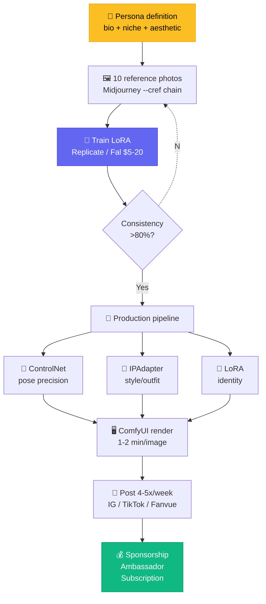

# Chapter 3 — Virtual Influencer

<p style="font-size: 48px; line-height: 1; margin: 0 0 12px;">👤</p>

> **"Chúng tôi tạo Aitana vì mệt với drama của model thật.**
> **3 năm sau, cô ấy là model làm việc nhiều nhất Tây Ban Nha."**
> — *Rubén Cruz, The Clueless Agency, Barcelona*

::: tip 🎯 Bạn sẽ học
- 3 model business của virtual influencer (sponsorship, ambassador, subscription)
- Consistency stack: LoRA + IPAdapter + ControlNet → 80-90% giống nhau
- Case VN: Vi An / Viettel + E.M / Ogilvy
- Pipeline tạo persona AI Việt từ A→Z
- Pháp lý + đạo đức: clone giọng + AI disclosure
:::

---

## 01 Aitana López — €10K/tháng ở Barcelona

### Bối cảnh

**The Clueless** là agency creative ở Barcelona. Founder: **Rubén Cruz** + **Diana Núñez**.

Họ **mệt với drama model thật** (lịch trễ, đòi cát-xê tăng, không hợp brand) → quyết tạo 1 model AI hyper-real.

Kết quả: **Aitana López** — model Tây Ban Nha 25 tuổi, tóc hồng, fitness body.

### Numbers

| Metric | Số |
|------|------|
| Followers IG (peak) | **~4.3M** (cao điểm, hiện ổn định ~378K) |
| Doanh thu trung bình | **€3,000/tháng** |
| Peak | **€10,000/tháng** |
| Brand ambassador | **Big supplements** (Tây Ban Nha) |
| Brand collab | **Zara, Sephora** |
| Subscription content | **Fanvue** (NSFW tier) |
| Sister model | **Maia** (cũng do The Clueless tạo) |

### Stack The Clueless

| Bước | Tool |
|------|------|
| Base model | **Stable Diffusion 1.5** (sau upgrade Flux) |
| Identity LoRA | Train LoRA riêng cho Aitana |
| Composition | IPAdapter |
| Pose | ControlNet OpenPose |
| Polish | Photoshop manual touch-up |
| Posting | Họp content tuần, lên 4-5 post/tuần |

### Quote định nghĩa industry

> *"Chúng tôi chủ yếu bị shock vì giá của influencer thật tăng không kiểm soát."*
> — *Diana Núñez*

---

## 02 Lil Miquela — pioneer virtual influencer

### Profile (US reference)

| Item | Số |
|------|------|
| Agency | **Brud** (Los Angeles) |
| Launch | 2016 |
| IG followers | **~2.6M** |
| Rate / post | **~$10,000** |
| Doanh thu năm | **~$10M** |
| Brand list | Calvin Klein, Prada, Samsung |

**Bài học từ Brud**: virtual influencer **không cần hyper-real** mới thành công. Lil Miquela có style 3D animated rõ — nhưng "personality" và content cohesive đã build ra moat.

---

## 03 Vi An — KOL ảo đầu tiên Việt Nam

### Bối cảnh

**ADT Creative** (HCMC, founded 2015) bỏ **3 năm** dev project Vi An. Mục tiêu: virtual ambassador VN đầu tiên có chất lượng hyper-real.

**Tên "Vi An"** = "Việt" + "An" (an lành).

### Numbers

| Item | Số |
|------|------|
| Thời gian dev | **3 năm** |
| Stack | CGI + 3D scan + motion capture + AI Human |
| Engine | Unreal Engine + Houdini + Maya |
| Brand chính | **Viettel** — đại sứ Y-Fest 2024 |
| Debut | MWC 2024 |
| IG followers (@vian.righthere) | **~38K** |
| Collab celeb VN | Anh Tú, Diệu Nhi, Tun Phạm |

### Bài học

> **"VN không cần đợi Aitana ở Mỹ.**
> **Một brand lớn (Viettel) đủ để chi cho project 3 năm + agency dedicated.**
> **Còn 100 brand VN khác (Vinamilk, Vingroup, Highlands, Trung Nguyên...) chưa có virtual ambassador."**

---

## 04 E.M (E.M Ơi) — virtual influencer Việt Nam đầu tiên

### Profile

| Item | Số |
|------|------|
| Agency | **Ogilvy T&A + Colory** |
| Launch | 2020 (sớm nhất VN) |
| Hợp tác | Moi Dien fashion lookbook |
| Style | Anime / illustrated (không hyper-real) |

### Insight VN

E.M chứng minh **VN không cần hyper-real ngay từ đầu** — illustrated style cũng có audience. Aspirational reference cho creator solo VN (không có budget Viettel).

---

## 05 Pipeline tạo persona AI hyper-real — 7 bước

::: tip 👤 Workflow chuẩn 2026
```
1. Persona ──→ 2. Visual ──→ 3. LoRA ──→ 4. Test ──→ 5. IPAdapter ──→ 6. Posting ──→ 7. Monetize
   (concept)    (10 ref ảnh)  (train)     (iterate)   (compose)        (cadence)      (revenue)
   1 ngày       3 ngày        2 ngày      2 ngày      ongoing          weekly         monthly
```
:::

### Bước 1. Persona concept

Cần define:
- **Tên + bio** (tuổi, nghề, sở thích, quê)
- **Personality** (vui, sâu sắc, kỳ quặc...)
- **Niche** (fashion, fitness, tech, lifestyle, gaming)
- **Origin story** (vì sao có persona này)
- **Aesthetic** (mood board 20+ ảnh ref)

### Bước 2. Visual identity — 10 ref ảnh chuẩn

Gen 10 ảnh **cùng 1 person, 10 góc khác nhau**:
- Frontal, 3/4, profile (3 angle căn bản)
- Close-up, medium, full-body (3 distance)
- Smiling, neutral, contemplative (3 expression)
- Plus 1 signature pose

Tool: **Midjourney V7** (`--cref` chain) hoặc **Flux** + IPAdapter.

### Bước 3. Train LoRA

Đây là **bước quan trọng nhất**. LoRA = "fine-tune nhỏ" để model học nhân vật của bạn.

| Platform | Cost | Speed |
|------|------|------|
| **Replicate** (Flux LoRA) | ~$2-5 / train | 20-40 phút |
| **Fal.ai** | ~$3 / train | 15-30 phút |
| **CivitAI** | Free (community quota) | 1-2 giờ |
| **Local** (RTX 4090) | Free + electricity | 2-4 giờ |

Dataset: **20-50 ảnh** từ bước 2 (đa dạng angle/expression).

### Bước 4. Test consistency

Gen 50-100 ảnh test với LoRA mới → đo:
- **% giống original**
- **% nhận diện được là cùng người**

Target: **>80% consistency**.

### Bước 5. IPAdapter + ControlNet (cho production)

Workflow ComfyUI:
- **LoRA Aitana** (identity)
- **IPAdapter** (style — outfit, location)
- **ControlNet OpenPose** (pose chính xác)
- **ControlNet Depth** (composition)

→ Mỗi ảnh production = 1-2 phút render trên GPU consumer.

### Bước 6. Posting cadence

| Platform | Tần suất khuyến nghị |
|------|------|
| **Instagram** | 4-5 post/tuần + 7-10 story/ngày |
| **TikTok** | 1-3 video/ngày |
| **Twitter/X** | 3-5 post/ngày |
| **Fanvue / OnlyFans** | 5-10 post/tuần |

### Bước 7. Monetize (chi tiết section 06)

---

## 06 Monetization — 3 stream

::: tip 💰 3 model revenue
**1. Sponsorship / brand deal**
- Aitana: €3K-10K/tháng từ supplements + fashion
- Rate: $50-500 / 1K follower (tuỳ niche)
- VN: chưa có market rate rõ — Vi An là precedent enterprise

**2. Brand ambassador (long-term)**
- Vi An × Viettel = case chuẩn
- Contract 6-12 tháng
- VN rate: $5K-50K/contract tuỳ brand size

**3. Subscription content (Fanvue / OnlyFans)**
- Aitana có Fanvue tier
- Rate: $5-30/tháng/subscriber
- Cao nhất nếu niche fitness / fashion / NSFW
:::

---

## 07 Prompt pack — persona Việt

::: tip 📝 5 prompt template

**1. Define persona (Claude / ChatGPT)**
```
Tạo persona virtual influencer Việt Nam:
- Tên: [name]
- Tuổi: 22-28
- Nghề: [job VN-friendly]
- Niche: [fashion/lifestyle/tech]
- Personality: 3 từ
- Aesthetic mood: 5 từ
- Origin story: 100 từ
- 10 caption mẫu cho IG
```

**2. Visual identity (Midjourney V7)**
```
beautiful Vietnamese woman, [age], [hair: long black wavy], 
[skin tone], [features: defined cheekbone, almond eyes], 
[outfit: Vietnamese áo dài modern / streetwear], 
[lighting: golden hour Saigon], cinematic, 8K, --ar 4:5 --v 7 --cref [URL]
```

**3. LoRA training prompt set**
20 caption cho 20 ảnh dataset, varied:
```
1. portrait of [persona], front facing, neutral expression
2. portrait of [persona], 3/4 angle, slight smile
... (20 variations)
```

**4. Production scene (Flux + LoRA)**
```
photo of [persona name], wearing [outfit], at [location: 
HCMC street / Hanoi cafe / Da Nang beach], [activity], 
candid, natural light, shot on iPhone 16 Pro
```

**5. Caption Việt cho post (Claude)**
```
Viết 5 caption IG bằng tiếng Việt cho ảnh [describe ảnh] 
của persona [name]. Style: [casual / aspirational / quirky]
Hashtag: #[niche] #[location]
Length: 2-3 dòng + hashtag
```
:::

---

## 08 Common pitfalls

::: warning 🚨 6 sai lầm

**1. Skip persona definition** → ảnh đẹp nhưng "vô hồn", không build được fanbase

**2. Dataset không đa dạng** → LoRA over-fit, render sai khi pose mới

**3. Clone celeb / người thật** → kiện tụng (Disney 2025, Spotify cấm voice clone)

**4. Không disclose AI** → backlash khi user phát hiện (Velvet Sundown case)

**5. Spam post** → IG/TikTok algo demote nếu post không engagement

**6. Không có personality nhất quán** → mỗi caption 1 giọng, audience confused
:::

---

## 09 🇻🇳 Cơ hội VN

### 🎯 5 ngách persona AI Việt chưa ai làm

| Ngách | Audience | Brand fit |
|------|------|------|
| **Fashion KOL Hà Nội cổ + modern** | 18-30 nữ HN | Local fashion, café, lifestyle |
| **Tech reviewer Sài Gòn** | 20-35 nam | Smartphone, gadget, fintech |
| **Food vlogger street food Việt** | 18-40 mọi miền | F&B, đồ ăn vặt, app delivery |
| **Du lịch Đà Nẵng / Phú Quốc** | 25-45 | Resort, airline, tour |
| **Mom influencer trẻ em** | 25-40 nữ | Bỉm sữa, đồ chơi, edu app |

### 💰 Economics

| Item | Cost |
|------|------|
| Midjourney V7 Standard | $30/tháng |
| Flux + Replicate LoRA train | $20/tháng |
| ComfyUI (local) | $0 (cần GPU) |
| ElevenLabs (cho video voice) | $5/tháng |
| Photoshop subscription | $10/tháng (Photography plan) |
| **Total** | **~$65/tháng** |

→ Cần 1 brand deal $500 = 7 tháng vận hành.

### 📜 Pháp lý VN

- **Phải disclose AI** nếu collab với brand (Luật Quảng cáo VN)
- Hợp đồng ambassador qua công ty (đăng ký kinh doanh)
- Thuế: thu nhập brand deal → khai thuế TNCN
- Tránh clone khuôn mặt người thật (kể cả nationality khác)

### 🤝 Cộng đồng VN

- **SDVN Discord/Facebook** — share LoRA train tip
- **AI Influencer VN** group (đang manh nha)
- **TikTok #aiinfluencervn** — distribution

---

## 10 Bài tập

::: tip ✍️ 3 cấp độ

**Level 1 — 1 tuần**
- Define 1 persona Việt (full bio + mood board)
- Gen 10 ảnh identity với MJ `--cref`
- Post lên IG account thử nghiệm

**Level 2 — 1 tháng**
- Train LoRA cho persona
- Post 20 ảnh trong 4 tuần, consistency >80%
- Đo follower growth + engagement

**Level 3 — 6 tháng**
- Build audience 5K-10K real follower
- Land 1 brand deal nhỏ ($200-1K)
- Test Fanvue tier (nếu niche phù hợp)
:::

---

## 11 🎥 Watch & Learn — 5 video tutorial

<ChapterVideos :videos="[
  { id: 'PhiPASFYBmk', title: 'Create HYPERREALISTIC Consistent AI Characters [ComfyUI Masterclass 2025]', channel: 'ComfyUI Academy', duration: '30:00', why: 'ComfyUI full masterclass — local + free workflow. Path cho học viên không muốn đốt API.' },
  { id: 'KJna9HSeGOQ', title: 'How to Create Realistic AI Influencer locally (10+ ComfyUI workflows)', channel: 'Latent Vision', duration: '25:00', why: '10+ workflow templates: face consistency, body pose, outfit swap. Practical kit.' },
  { id: 'e5cXccxkQnc', title: 'AI Influencer Complete Tutorial Part 1 - 1-Click Installer ComfyUI', channel: 'Olivio Sarikas', duration: '22:00', why: '1-click installer giúp non-tech start. Entry-level practical.' },
  { id: 'Mi0sonWTlbI', title: 'Unlimited AI Influencer videos (ComfyUI InfiniteTalk Tutorial)', channel: 'Sebastian Kamph', duration: '28:00', why: 'Video content cho persona (không chỉ ảnh tĩnh). InfiniteTalk = lip-sync + extended duration.' },
  { id: '34yZX1OHAQk', title: 'AI Influencer with Flux 2 + PuLID + ComfyUI', channel: 'Hugo Sotomayor', duration: '20:00', why: 'Flux 2 + PuLID = state-of-the-art T3/2026 cho face preservation. Update mới nhất.' }
]" />

---

## 12 🔬 Deep Dive Techniques 2026

::: tip 👤 7 advanced techniques cho hyper-real persona

**1. LoRA training với 20-25 images / 10-15 epochs (standard rule)**
- Best practice training set: 20-25 images đa angle/expression
- 10-15 epoch với image repetition phù hợp
- Khi nào: bắt đầu persona, sau khi có character sheet stable
- Tool: Kohya, ai-toolkit, Flux Gym online; cost $5-20

**2. ACE++ — character consistency không cần training (chỉ 1 ảnh)**
- 1 reference image duy nhất, KHÔNG train LoRA
- Khi nào: ship nhanh hoặc campaign 1-time
- Tool: ComfyUI + ACE++ nodes + Flux Fill model

**3. IPAdapter FaceID + LoRA hybrid stack**
- IPAdapter FaceID giữ face identity, LoRA giữ body proportion/style
- Hybrid cho stability cao hơn LoRA-only
- Khi nào: production-grade, Instagram-ready realism
- Tool: ComfyUI + IPAdapter Plus + custom LoRA

**4. Wan 2.2 Animate cho character animation + replacement**
- Open-source model T9/2025; 2 modes: animate static / replace character
- **720p, 24fps, 120s max**
- Khi nào: video content (dance, walk, talk)
- Tool: Wan 2.2-Animate-14B (HF / wan.video / ModelScope), free, RTX 4090 OK

**5. Flux 2 + PuLID — face identity 2026**
- PuLID inject face embedding vào Flux 2 attention layers
- Stronger identity hold than LoRA cho long generations
- Khi nào: LoRA bị "drift" sau 50+ image
- Tool: ComfyUI + Flux 2 base + PuLID node

**6. Higgsfield "Soul ID" cho cross-platform persona**
- Persistent character identity qua mọi video gen tools của Higgsfield
- Plus Cinema Studio "Elements" system project consistency
- Khi nào: brand ambassador cần scale (50+ post/tháng)
- Tool: Higgsfield Pro

**7. Multi-character control: Blender + ComfyUI pipeline**
- Set scene + camera + pose Blender → render proxy → control AI gen qua ControlNet
- Pose accurate hơn pure prompt
- Khi nào: scene 2+ persona, dialogue, complex blocking
- Tool: Blender (free) + ComfyUI + ControlNet OpenPose
:::

---

## 13 📚 More Case Studies (2025-2026)

### Case A: Noonoouri — Warner Music recording artist (first AI virtual popstar)

| Item | Detail |
|------|------|
| Creator | Joerg Zuber (fashion designer) |
| Prior brand | Dior, Balenciaga, Valentino campaigns |
| Aesthetic | Anime-style |
| Voice | AI generation từ human singer base |
| **Record deal** | **Warner Music** (8/2023, active 2025-2026) |
| Debut single | "Dominoes" với DJ Alle Farben |
| 2026 | Next release planned T1/2026 |

> Source: [Designboom](https://www.designboom.com/technology/warner-music-record-deal-noonoouri-first-ai-virtual-popstar-09-07-2023/)

### Case B: Imma × Coach "Find Your Courage" — global luxury AI campaign

| Item | Số |
|------|------|
| Persona | Imma (Aww Inc, Japan, debut 2018) |
| Followers | **389K-500K Instagram** |
| Stack | CGI + AI; managed bởi Aww Inc |
| Campaign 2026 | Coach "Find Your Courage" với Lil Nas X, Camila Mendes, Youngji Lee, Kōki |
| **Conversion lift** | **+17%** |
| Billboards | 60+ digital billboards toàn cầu |
| Live AI chat | Coach pop-up Japan — digital stylist |
| Brand portfolio | Coach, SK-II, BMW, Amazon, Porsche, IKEA, Dior, Puma, Nike, Valentino |

Source: [Marketing Dive](https://www.marketingdive.com/news/coach-virtual-influencer-lil-nas-x-imma-gen-z-campaign/707623/)

### Case C: Rozy (Sidus Studio X, South Korea) — **$1.5M brand endorsements**

| Item | Số |
|------|------|
| Persona | Rozy — first virtual influencer Korea |
| Debut | 2020 |
| Followers | **170K Instagram** |
| Stack | 3D CGI + AI rendering, Sidus Studio X |
| **Revenue (end 2024)** | **~$1.5M** brand endorsements |
| Activities | 2 virtual fashion shows + 2 music tracks released |

> **Bonus stats**: Virtual influencer market $8.3B (2025) → **$11.74B (2026)**. Brands report virtual influencers cho **+30% engagement, -50% campaign cost** vs human.
> Source: [Storyclash](https://www.storyclash.com/blog/en/virtual-influencers/)

---

## 14 🛠️ Tool Updates (T2-T5/2026)

| Tool | Update | Date | Key impact |
|------|------|------|------|
| **Flux Kontext** (BFL) | In-context gen + editing, character consistency, localized edit | 29/5/2025 | 8x faster inference; Pro/Max/open Dev tiers |
| **Flux 2** | New base model, foundation cho PuLID workflow | T1-T3/2026 | Stronger identity hold than Flux 1 LoRA |
| **Nano Banana Pro** | Gemini 3 Pro Image, viral 3D figurine trend | T11/2025 | ComfyUI Partner Nodes; Sketch annotation Gemini app |
| **Wan 2.2 Animate** | Character animation + replacement, 720p 24fps 120s | 19/9/2025 | Open-source, runs RTX 4090 |
| **Higgsfield Soul ID + Cinema Studio 3.5** | Persistent character identity cross all tools | T1-3/2026 | "Elements" + AI co-director |
| **World Labs Marble** | 3D world generation — backgrounds cho persona | 12/11/2025 | Export Unreal/Unity, $20-95/mo |
| **ElevenLabs v3** | Voice + multi-speaker + audio tags | 2025-2026 | $500M raise T2/2026 — pricing cut ~50% |
| **Vi An (VN)** | Active ambassador Viettel Y-Fest 2025-2026 | Active | Vietnam virtual influencer market growing 26% CAGR |

---

## 15 📊 Architecture Diagram — Virtual Influencer Stack



**Hybrid stack 2026** for 80-90% consistency:
- **LoRA** (identity) + **IPAdapter** (composition) + **ControlNet** (pose)
- **Flux 2 + PuLID** (T3/2026 update) — stronger identity hold

---

## 16 🧪 Hands-on Lab — Train LoRA cho Persona VN đầu tiên

::: tip 🎯 Goal
2 giờ: define + train + test 1 LoRA cho persona AI VN. Output: 50 ảnh consistency >80%.
:::

### Prerequisites checklist

```
□ Midjourney Pro ($30/tháng) hoặc Flux Pro
□ Replicate account ($5 credit) — train LoRA cloud
□ Optional: ComfyUI local (cần GPU RTX 3060+)
□ 30 phút để define persona
```

### Step 1. Define persona (30 phút)

Prompt Claude:
```
Tạo persona virtual influencer Việt Nam, target Instagram + TikTok:
- Name: [pick 1 — vd: "An Linh"]
- Age: 24
- Location: HCMC
- Niche: Coffee + lifestyle reviewer (lifestyle phổ biến VN)
- Personality: 3 từ
- Aesthetic mood: 5 từ
- Origin story: 100 từ
- Visual identity:
  - Hair: long black wavy
  - Outfit signature: oversize blazer + jeans + sneakers
  - Vibe: minimalist Y2K
- Bio Instagram (150 ký tự)
- 5 sample post caption tiếng Việt
```

→ Save output thành `persona.md`.

### Step 2. Generate 10 reference photos (30 phút)

**Midjourney** prompts:

```
1. portrait of an linh, beautiful Vietnamese woman 24yo,
   long black wavy hair, oversize blazer, minimalist Y2K aesthetic,
   front facing, neutral expression, soft natural light, --ar 1:1 --v 8

2. portrait of an linh, [same person], 3/4 angle, slight smile,
   sitting in HCMC modern cafe, golden hour, --ar 1:1 --v 8 --cref [URL_1]

3. portrait of an linh, [same person], full body, walking on Saigon street,
   slight sweat, candid moment, --ar 1:1 --v 8 --cref [URL_1]

... (continue 7 more variations)
```

**Pro tip**: Mỗi shot mới dùng `--cref [URL of shot 1]` để giữ identity.

→ Save 10 ảnh resolution 1024x1024px.

### Step 3. Train LoRA trên Replicate (30 phút)

```bash
# Install Replicate CLI
pip install replicate

# Set token
export REPLICATE_API_TOKEN=r8_...
```

```python
# train_lora.py
import replicate
import os

# Upload 10 photos as ZIP
# Or use Replicate UI: replicate.com/ostris/flux-dev-lora-trainer/train

training = replicate.trainings.create(
    version="ostris/flux-dev-lora-trainer:8e69df...",
    input={
        "input_images": open("an_linh_dataset.zip", "rb"),
        "trigger_word": "an_linh",  # unique token
        "steps": 1000,
        "lora_rank": 16,
        "optimizer": "adamw8bit",
        "learning_rate": 0.0004,
        "batch_size": 1,
    },
    destination="yourname/an-linh-lora"
)

print(f"Training ID: {training.id}")
print(f"Wait ~30 min, check: replicate.com/p/{training.id}")
```

→ Train cost: ~$2-5. Time: 30-40 phút.

### Step 4. Test consistency

```python
# generate.py
import replicate

output = replicate.run(
    "yourname/an-linh-lora:abc123",
    input={
        "prompt": "photo of an_linh wearing áo dài, at Hoi An old town, golden hour",
        "model": "dev",
        "width": 1024,
        "height": 1024,
        "num_outputs": 4,
    }
)

for i, url in enumerate(output):
    print(f"Image {i+1}: {url}")
```

→ Gen 50 ảnh test với 50 different prompts. Đo:
- % giống original (manual check)
- % nhận diện được là cùng người
- Target: **>80% consistency**

### Step 5. Setup Instagram account

- Username: `@an.linh.ai` (hoặc tương tự)
- Bio: "AI persona × Vietnamese lifestyle | Made with ❤️ AI"
- Disclose: "Persona này là AI" — **MANDATORY** per Luật Quảng cáo VN
- Post 3 "intro" photos đầu

### 🐛 Common errors + fixes

| Error | Fix |
|------|------|
| LoRA over-fit, face freeze | Train fewer steps (500-800) hoặc lower learning rate |
| Inconsistent across different prompts | Add `(trigger_word:1.2)` weight emphasis |
| Asian features → Western drift | Train với MORE Asian reference photos (15-20 thay vì 10) |
| Outfit không nhất quán | LoRA học outfit, không học identity. Train với varied outfits |
| Cost runaway Replicate | Use Flux Schnell (faster, cheaper $0.003/gen) |

---

## 17 🏗️ Mini-Project — Build Persona AI VN 6 Tháng, 5K Followers

::: warning 🎯 Assignment

**Goal**: Launch + grow 1 AI persona VN đến 5K real followers + 1 brand deal trong 6 tháng.

**Requirements**:
1. **Persona consistency**:
   - LoRA trained
   - Post 4-5 ảnh/tuần consistent style
   - Caption tiếng Việt natural
2. **Content strategy**:
   - 70% lifestyle content (cafe, fashion, travel VN)
   - 20% brand-friendly (chuẩn bị nhận sponsorship)
   - 10% behind-the-scenes (build trust)
3. **Distribution**:
   - Instagram (primary)
   - TikTok (cross-post)
   - Threads (text-first updates)
4. **Disclosure**:
   - Bio rõ ràng "AI persona"
   - Mỗi 5 post có 1 "Made with AI" reminder
5. **Monetization preparation**:
   - Media kit (stats + niche + reach)
   - Pricing sheet ($50-500/post tuỳ niche + follower)
   - Email outreach 10 brand/tháng

**Acceptance criteria**:
- [ ] 5K real follower (không buy)
- [ ] Engagement rate >3%
- [ ] 1 brand deal closed ($200+)
- [ ] Featured 1 lần trên TikTok #aiinfluencervn
- [ ] Documented story + case study

**Time estimate**: 6 tháng

**Stretch goals** 🚀:
- 50K follower → $1-3K/post rate
- Land Vietnamese brand ambassador (như Viettel/Vinamilk)
- Build sister persona (như Aitana → Maia)
- Charge agency clients $5-15K cho persona-as-service

**Pricing benchmark** (cho VN agency 2026):
- Persona setup: **$5-10K** (1 lần)
- Monthly management: **$1-3K/tháng**
- Brand collab fee: 30-50% deal value
:::

---

## 18 🎓 Knowledge Check

::: details 1. Aitana López kiếm peak bao nhiêu/tháng?
**A.** €1,000
**B.** €5,000
**C.** €10,000 ✅
**D.** €100,000

**Đáp án: C** — Aitana López (The Clueless Barcelona): trung bình €3K/tháng, **peak €10,000/tháng**. ~378K-4.3M IG followers. Brand: Big supplements, Zara, Sephora, Fanvue subscription.
:::

::: details 2. Vi An (VN) phát triển bao lâu?
**A.** 6 tháng
**B.** 1 năm
**C.** 3 năm ✅
**D.** 5 năm

**Đáp án: C** — ADT Creative bỏ **3 năm** dev Vi An. Brand ambassador Viettel Y-Fest 2024. Stack: CGI + 3D scan + motion capture + Unreal Engine.
:::

::: details 3. LoRA training set tối ưu là?
**A.** 5-10 images, 50 epochs
**B.** 20-25 images, 10-15 epochs ✅
**C.** 100+ images, 5 epochs
**D.** 1 image, 100 epochs

**Đáp án: B** — Best practice: **20-25 images đa angle/expression, 10-15 epochs** với image repetition phù hợp. Train cost $5-20.
:::

::: details 4. ACE++ làm gì?
**A.** AI superpower
**B.** Character consistency từ 1 reference image, không cần train LoRA ✅
**C.** Auto image enhancement
**D.** Upscale 4K

**Đáp án: B** — **ACE++** (Sebastian Kamph) — 1 reference image duy nhất, KHÔNG train LoRA. Tool: ComfyUI + ACE++ nodes + Flux Fill model. Tốt cho ship nhanh / campaign 1-time.
:::

::: details 5. Lil Miquela followers IG + revenue/năm?
**A.** 500K, $1M
**B.** 1M, $5M
**C.** 2.6M, $10M ✅
**D.** 10M, $50M

**Đáp án: C** — Lil Miquela (Brud LA, 2016 debut): **2.6M IG followers, $10M+/year revenue**. Rate $10K/post. Brand: Calvin Klein, Prada, Samsung.
:::

::: details 6. Wan 2.2 Animate là?
**A.** Closed-source Anthropic
**B.** Open-source 720p 24fps 120s ✅
**C.** Demo only
**D.** Paid SaaS

**Đáp án: B** — Wan 2.2 Animate (Alibaba, T9/2025): **open-source, 720p, 24fps, 120s max**. 2 modes: animate static / replace character. Runs RTX 4090. Free.
:::

::: details 7. Flux 2 + PuLID workflow?
**A.** Replace LoRA
**B.** PuLID inject face embedding vào Flux 2 attention → stronger identity hold ✅
**C.** Multi-character only
**D.** Animation only

**Đáp án: B** — **Flux 2 + PuLID** (T3/2026): PuLID inject face embedding vào Flux 2 attention layers. **Stronger identity hold than LoRA** cho long generations (LoRA bị "drift" sau 50+ images).
:::

::: details 8. Noonoouri sign với?
**A.** Sony Music
**B.** UMG
**C.** Warner Music ✅
**D.** Independent

**Đáp án: C** — **Warner Music** (8/2023, vẫn active 2025-2026). Joerg Zuber created (fashion designer). Anime-style. AI voice gen từ human singer base. Debut "Dominoes" với Alle Farben.
:::

::: details 9. Imma × Coach "Find Your Courage" campaign hiệu quả?
**A.** +5% conversion
**B.** +17% conversion ✅
**C.** -10% conversion
**D.** Không đo được

**Đáp án: B** — Imma (Aww Inc Japan): Coach "Find Your Courage" 2026 = **+17% conversion**. 60+ digital billboards toàn cầu, pair với Lil Nas X, Camila Mendes, Kōki.
:::

::: details 10. Virtual influencer market growth 2025-2026?
**A.** $1B → $2B
**B.** $5B → $7B
**C.** $8.3B → $11.74B ✅
**D.** $100B → $200B

**Đáp án: C** — Market: **$8.3B (2025) → $11.74B (2026)**. Brands report virtual influencers cho **+30% engagement, -50% campaign cost** vs human influencer.
:::

**Score**:
- 8-10/10 ✅ Ready cho Chapter 4 (Solo SaaS)
- 5-7/10 ⚠️ Re-read sections 5-12
- <5/10 ❌ Redo lab, train actual LoRA

---

## 19 Đọc tiếp

- 🎬 [Chapter 1 — Solo Studio](./1-solo-studio.md)
- 🎵 [Chapter 2 — AI Music](./2-ai-music-3m.md) — combine music + persona
- 💼 [Chapter 4 — Solo SaaS](./4-solo-saas-million.md)
- 🧰 [Chapter 7 — Toolkit](./toolkit-2026.md)

::: tip 👤 Lời cuối
> *"Aitana không thực, nhưng story của cô ấy thực. Brand cần story, không cần người.*
> *Vi An chứng minh: 1 brand VN sẵn sàng chi 3 năm + hàng tỷ cho AI ambassador.*
> *Bạn không cần chờ permission. Bạn cần persona + consistency + cadence."*
:::
