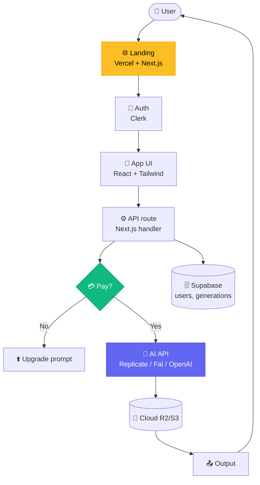

# Chapter 4 — Solo SaaS $1M

<p style="font-size: 48px; line-height: 1; margin: 0 0 12px;">💰</p>

> **"14,000 dòng PHP raw mixed với inline HTML, CSS trong style tag, JS trong script tag.**
> **0 nhân viên. $132K MRR. $1.65M ARR."**
> — *Pieter Levels (@levelsio), tweet 4.8M view*

::: tip 🎯 Bạn sẽ học
- Cách build solo SaaS trên top AI gen API (Flux, Replicate, Fal)
- Tại sao "ship before perfect" + build-in-public = competitive moat
- 3 case từ $0 → $1M-$401M ARR
- Niche AI gen chưa được phục vụ (đặc biệt VN-friendly)
- Tax + payment stack cho founder VN go-global
:::

---

## 01 Pieter Levels — Indie hacker $1.65M ARR solo

### Profile

| Item | Số |
|------|------|
| Tên | **Pieter Levels** (@levelsio) |
| Quê | Hà Lan, sống Bali / Hà Lan |
| Background | 10 năm "build in public", 70+ failed startups |
| X followers | **~600K** |
| Số nhân viên | **0** |

### Portfolio (T5/2026)

| Product | Status | ARR / MRR |
|------|------|------|
| **PhotoAI** | AI headshot/portrait generator | **$132K MRR ≈ $1.65M ARR** (T11/2025) |
| **InteriorAI** | AI interior design | ~$300K ARR |
| **NomadList** | Remote work community | ~$500K ARR (legacy) |
| **RemoteOK** | Remote job board | ~$300K ARR (legacy) |
| **fly.pieter.com** | Browser flight game (vibe-coded) | $87K MRR in 17 ngày, $1M ARR cao điểm |
| **Total portfolio** | ~5 product active | **~$3M ARR** |

### Tech stack (notoriously simple)

- **PHP raw** (~14K dòng cho PhotoAI)
- **Inline HTML + CSS + JS** (không React, không Next.js)
- **MySQL**
- **Replicate API** (cho Flux + Stable Diffusion)
- **Stripe** (payment)
- **Hetzner** (cheap server)

### Quote định nghĩa

> *"Without AI it would have taken me 10-100x more time. AI really is a creativity and speed maximizer."*
> — *Pieter Levels*

> *"Ship fast. Ship ugly. Ship in public."*
> — *Pieter Levels (motto)*

---

## 02 Maor Shlomo — Base44, $80M exit 6 tháng

### Profile

| Item | Số |
|------|------|
| Tên | **Maor Shlomo** |
| Quê | Israel |
| Product | **Base44** — no-code AI app builder |
| Solo founder | ✅ |

### Result

| Metric | Số |
|------|------|
| Launch | T2/2025 |
| Users (4 tuần đầu) | **250K** |
| Revenue tháng đầu | **~$1.5M** |
| **Exit acquisition** | **$80M trong 6 tháng** |

### Bài học

> **"Một solo founder, 6 tháng, $80M exit. Không phải fluke — là pattern mới 2025-2026."**

Stack Base44 = wrap LLM + UI builder + Vercel deploy. **Không công nghệ mới**. Cái mới: **execution velocity + niche timing**.

---

## 03 Matthew Gallagher — Medvi, $401M năm 1

### Profile

| Item | Số |
|------|------|
| Tên | **Matthew Gallagher** |
| Product | **Medvi** (healthcare-adjacent) |
| Setup cost | **$20K** + 2 tháng |
| Year 1 revenue | **$401M** 🤯 |
| Projected | $1.8B/năm |

### Stack

- **ChatGPT / Claude / Grok** — code
- **Midjourney + Runway** — ad creative
- **ElevenLabs + custom agent** — customer service
- **0 engineer thuê** (chỉ contractor outsource phần custom)

### Bài học — "Billion-dollar one-person company"

Sam Altman đã predict này. Medvi là **case đầu tiên** thực sự gần $1B từ solo founder.

> *"Cảnh báo: $401M ≠ profit. Doanh thu top-line. Vẫn cực ấn tượng cho solo."*

---

## 04 Pattern chung của 3 case

::: tip 🎯 5 yếu tố lặp lại

**1. Wrap 1 API tốt + niche cụ thể**
- Pieter: Flux + portrait
- Maor: LLM + app builder
- Matthew: nhiều LLM + healthcare niche

**2. Ship sớm, ship xấu**
- PhotoAI là 14K dòng PHP "raw"
- Base44 first version "đủ chạy"
- Không over-engineer

**3. Build in public**
- Pieter có 600K follower X 10 năm
- Maor share progress mỗi tuần
- Audience trước product

**4. Niche underserved**
- AI headshot (Pieter) — corporate cần ảnh, không có ai làm pro
- No-code AI builder (Maor) — non-dev muốn build app
- Healthcare booking (Matthew) — fragmented market

**5. Tỉ lệ chi phí cực thấp**
- 0 nhân viên
- $50-500/tháng cloud
- $0-200/tháng tool
:::

---

## 05 Pipeline build solo AI SaaS — 6 bước

### Bước 1. Pick niche

Framework: **3 câu hỏi**:
1. **Bạn có pain gì lặp lại?** (vd: ảnh hồ sơ visa)
2. **Audience là ai?** (vd: người Việt đi nước ngoài)
3. **AI gen tool nào solve được?** (Flux + LoRA)

### Bước 2. Validate trong 24h

- Tạo landing page (Webflow / Framer / Carrd) — 2 giờ
- Mô tả product + form đăng ký waitlist
- Post lên Twitter / Reddit / Facebook group
- Đo: **đăng ký waitlist trong 24h**?

Target: **>20 signup trong 24h** = niche khả thi.

### Bước 3. MVP trong 7 ngày

Stack đơn giản:
- **Frontend**: Next.js / SvelteKit / **PHP raw** (theo Levels)
- **Auth**: Clerk (free tier)
- **DB**: Supabase / Postgres
- **AI API**: Replicate / Fal.ai / OpenAI
- **Payment**: Stripe
- **Deploy**: Vercel / Cloudflare Pages

### Bước 4. Pricing

| Model | Khi dùng |
|------|------|
| **Pay-per-use** | Generation product (mỗi ảnh $0.05-0.20) |
| **Subscription** | Recurring use ($9-49/tháng) |
| **One-time** | Lifetime deal launch ($29-99) |
| **Hybrid** | Sub + credit top-up |

PhotoAI: $9-39/tháng + credit. Base44: $29-99/tháng + usage.

### Bước 5. Launch sequence

| Day | Action |
|------|------|
| -7 | Build waitlist tweet thread (build-in-public) |
| 0 | Launch ProductHunt + Hacker News + Reddit + Twitter |
| 1-7 | Daily build-in-public update (số signup, MRR) |
| 14 | Post-launch iteration based on feedback |
| 30 | Đo $MRR + retention |

### Bước 6. Iterate

- **Weekly**: pricing test
- **Bi-weekly**: feature ship
- **Monthly**: review churn + add referral

---

## 06 Niche AI gen có cơ hội (T5/2026)

::: tip 🎯 20 niche cụ thể

**Image gen**
1. AI headshot doanh nhân (PhotoAI dominate global, VN trống)
2. AI ảnh thẻ visa / hộ chiếu (VN cực hot)
3. AI ảnh cưới (background Đà Nẵng, Hội An)
4. AI product photo cho seller TikTok Shop / Shopee
5. AI interior design (VN căn hộ chung cư)
6. AI logo + brand identity (SME VN)
7. AI ảnh CV / LinkedIn profile

**Video gen**
8. AI TVC mock-up cho SME pitch
9. AI ad UGC cho TikTok Shop (cực hot 2026)
10. AI karaoke MV instrumental
11. AI explainer cho B2B SaaS
12. AI mini-series tiếng địa phương

**Audio**
13. AI dubbing tiếng Việt cho video tiếng nước ngoài
14. AI bolero / V-Pop production
15. AI audio book tiếng Việt
16. AI voice clone cho podcast (own voice)

**3D**
17. AI 3D asset cho Roblox creator VN
18. AI 3D model cho e-commerce (xoay 360)

**Multimodal**
19. AI brand identity full pack (logo + ad + voice)
20. AI yearbook / portfolio cho học sinh sinh viên
:::

---

## 07 Prompt pack — solo founder workflow

::: tip 📝 5 prompt thực hành

**1. Niche validation (Claude / ChatGPT)**
```
Tôi muốn build AI SaaS niche [TOPIC]. 
Phân tích:
1. TAM (total addressable market) global vs Việt Nam
2. Top 3 competitor + giá + USP
3. 5 pain point của target user
4. 3 angle marketing khác biệt
5. Pricing model phù hợp + giá đề xuất
```

**2. Landing page copy (Claude)**
```
Viết landing page copy cho [product name]:
- Headline (1 dòng, dưới 12 từ)
- Subheadline (2 dòng)
- 3 benefit (mỗi cái 1 dòng, focused trên outcome)
- CTA primary + secondary
- Social proof placeholder
- FAQ 5 câu
Tone: [direct / playful / aspirational]
```

**3. Cold post launch (Twitter / Reddit)**
```
Viết 5 tweet variation launch product [name]:
- Tweet 1: hook story (vì sao tôi build)
- Tweet 2: feature demo (1 dòng + screenshot)
- Tweet 3: pricing + free tier
- Tweet 4: ask for feedback
- Tweet 5: numbers (signup, day-1 MRR)
Tone: Pieter Levels-style — direct, no fluff
```

**4. Pricing test (Claude)**
```
Phân tích 3 pricing model cho [product]:
A: $9/mo unlimited
B: $0 + $0.10/generation
C: $29/mo + 100 credit/mo + $0.05/extra

Cho mỗi model:
- LTV estimate
- Churn risk
- Volume needed để $10K MRR
- VN/global appeal
```

**5. Customer email (Claude)**
```
Viết email cho user vừa hủy subscription [product]:
- Acknowledge feedback
- Ask 1 câu hỏi cụ thể: "Cái gì làm bạn hủy?"
- Offer 50% off 3 tháng nếu thử lại
- Sign-off ngắn
Tone: human, không corporate
Length: <100 từ
```
:::

---

## 08 Common pitfalls

::: warning 🚨 7 sai lầm

**1. Over-engineer trước khi validate** → 3 tháng dev, 0 user

**2. Pricing quá thấp** → khó scale, dễ burnout

**3. Không build audience trước** → launch ra hư vô

**4. Chọn niche quá rộng** → "AI design tool" thua "AI headshot for LinkedIn"

**5. Quên billing edge case** → user lạm dụng free tier → margin âm

**6. Không có churn tracking** → MRR tăng giả, churn ăn hết

**7. Skip API cost optimization** → margin < 50% là alarm
:::

---

## 09 🇻🇳 Founder VN — playbook

### 🎯 Lợi thế VN

| Yếu tố | VN | US/EU |
|------|------|------|
| **Cost engineer** | $800-3K/tháng | $8-15K/tháng |
| **Cloud cost** | Như nhau ($50-500) | Như nhau |
| **Time to ship** | Như nhau (AI tool) | Như nhau |
| **Lifestyle cost** | $500-1.5K/tháng | $3-8K/tháng |
| **Margin runway** | **3-5x** | 1x |

→ VN founder có thể **sống được trên $2K MRR** trong khi US cần $10K+.

### 💰 Payment stack VN

| Layer | Tool | Note |
|------|------|------|
| **Customer charge** | **Stripe Atlas** | Cần công ty Mỹ (Delaware) — $500 setup |
| | **Paddle** | Merchant of record, không cần company US |
| | **Lemon Squeezy** | Acquired by Stripe 2025, similar to Paddle |
| **Founder pay-out** | **Wise** | Phổ biến nhất VN |
| | **Payoneer** | Tốt cho marketplace |
| | **PayPal** | Phí cao, bị limit dễ |
| **VN tax** | Khai thuế TNCN > 100M VND/năm | 5% kinh doanh + 5% TNCN |

### 📜 Pháp lý

- **Hộ kinh doanh cá thể**: thuế khoán, dễ setup, giới hạn quy mô
- **Công ty TNHH 1 thành viên**: cho scale lớn, mua hoá đơn được
- **Stripe Atlas + LLC Mỹ**: chuyên nghiệp, cần kế toán quốc tế ($200-500/tháng)
- **Hoá đơn điện tử**: bắt buộc nếu có công ty VN (Misa, Viettel SInvoice, VNPT)

### 🤝 Community VN

- **WIP.co** — solo founder global, nhiều VN
- **IndieHackers VN group** (Facebook)
- **Built in Saigon** podcast
- **Vietnam Tech Twitter** (#vntech)

---

## 10 Bài tập

::: tip ✍️ 3 cấp độ

**Level 1 — 1 tuần**
- Pick 1 niche từ list 20
- Validate: landing page + 50 signup
- Dùng Carrd + Tally form

**Level 2 — 1 tháng**
- Build MVP (Next.js + Supabase + Replicate)
- Launch ProductHunt
- Target: **5 paying customer**

**Level 3 — 6 tháng**
- $1K MRR
- 100 paying customer
- Build in public ≥50 follower/tuần
:::

---

## 11 🎥 Watch & Learn — 5 video tutorial

<ChapterVideos :videos="[
  { id: 'oFtjKbXKqbg', title: 'Pieter Levels: Programming, Viral AI Startups, Digital Nomad', channel: 'Lex Fridman', duration: '3:50:00', why: '3.5 giờ với chính founder $250K/month MRR, 0 employees. \'12 startups in 12 months\' và vibe coding workflow.' },
  { id: '9Wjec3wh4p8', title: 'Pieter Levels — Indie Hacking is Dead. Now what?', channel: 'The Bootstrapped Founder', duration: '1:00:00', why: '2025 interview — Pieter argue indie hacking chuyển từ \'dead\' sang \'the new normal\' trong era AI.' },
  { id: 'RnDJf2K8y1w', title: 'Building a SaaS in 24 hours — PART 1', channel: 'Marc Lou', duration: '30:00', why: 'Marc Lou livebuild eLearning với ShipFast — raw workflow của founder $50K+/month MRR.' },
  { id: '1CDBbEVBtBU', title: 'I built a startup in 31 hours (SaaS)', channel: 'Marc Lou', duration: '25:00', why: 'ZenVoice case (Stripe invoicing) — $2,000 trong 5 ngày sau launch.' },
  { id: 'pXALDuq-kq0', title: 'Cursor vs Claude Code vs Windsurf (tiếng Việt)', channel: '200Lab', duration: '20:00', why: 'Tool comparison 3 tool chính cho vibe coding stack, dạy bằng tiếng Việt.' }
]" />

---

## 12 🔬 Deep Dive Techniques 2026

::: tip 🚀 8 advanced techniques cho solo founder $1M

**1. Boilerplate-first approach (Marc Lou pattern)**
- Đừng start from scratch. ShipFast = Next.js + MongoDB + Auth.js + Stripe + Mailgun + ChatGPT
- Set up boilerplate riêng sau project 3-4
- Marc Lou ship **21 product** với pattern này

**2. Single-account separation cho multi-product**
- Mỗi app → Stripe account riêng
- Suspension/payout delay 1 account không kill app khác
- Best practice từ indie hacker stack guide

**3. Lemon Squeezy vs Stripe quyết định**
- **Stripe**: nếu tự xử lý tax compliance (US-focused)
- **Lemon Squeezy**: outsource VAT/GST/sales tax globally (Merchant of Record)
- Founder VN bán toàn cầu → **recommend Lemon Squeezy**

**4. Webhook + retry scheduler trong tuần 1-3**
- Solo founder thường skip → revenue leakage
- Build Stripe webhook + smart retry based on failure codes
- **2-5% MRR thường mất** do failed payments → recover được

**5. Soul ID-style consistency cho landing page**
- Maor Shlomo (Base44) hit 250K user trong 6 tháng nhờ landing page consistent
- Dùng MJ v7 + reference image lock face/style cross assets

**6. AI replaces FUNCTIONS, not employees** (Matthew Gallagher pattern)
- Medvi $401M năm 1 với 1-2 người
- Map từng business function (CS, marketing, code, finance) → AI tool tương ứng
- Không hire trừ khi >$10K/month per function chi phí AI

**7. Build in public = free CAC**
- Pieter Levels: 700K X followers → organic CAC ~$0
- Marc Lou: $92K trong 2 ngày (CodeFast launch) từ 135K followers
- Solo founder phải invest **30% time** vào content + audience

**8. Profit margin > top-line**
- Base44 $189K profit/tháng T5/2025 (**16.2% margin**)
- Đó là metric Wix nhìn để pay $80M, không phải revenue
- Track gross margin từ ngày 1
:::

---

## 13 📚 More Case Studies (2025-2026)

### Case A: Maor Shlomo / Base44 → **Wix $80M cash** (T6/2025)

| Item | Số |
|------|------|
| Founder | Solo + 8 employees |
| Tuổi product | **6 tháng** |
| Users | **250K** (10K trong 3 tuần đầu) |
| Profit T5/2025 | **$189K** (16.2% margin) |
| **Exit** | **$80M cash + $90M earnout milestones** |

> **Insight**: "Solo" ≠ zero employee — 1 founder + small team. Acquisition <1 năm sau launch.
> Source: [TechCrunch](https://techcrunch.com/2025/06/18/6-month-old-solo-owned-vibe-coder-base44-sells-to-wix-for-80m-cash/)

### Case B: Matthew Gallagher / Medvi → **$1.8B run-rate** (T1/2026)

| Item | Số |
|------|------|
| Founded | T9/2024 với **$20K seed** |
| Year 1 revenue | **$401M** (2025) |
| **Projected year 2** | **$1.8B** (2026) |
| Team size | **1-2 người + ~250K users** |
| Profit margin | **~16.2%** |
| Stack | ChatGPT + Claude + Grok cho code + marketing + CS |
| Niche | Direct-to-consumer GLP-1 telehealth |

> **Insight**: AI replaces full corporate functions. Proof point cho Sam Altman 2024 prediction "1-person billion-dollar company".
> Source: [Inc](https://www.inc.com/leila-sheridan/the-no-employee-billion-dollar-startup-how-ai-is-changing-the-face-of-solopreneurship/91326517)

### Case C: Pieter Levels / fly.pieter.com → **$1M ARR trong 2 tháng** (T3/2025)

| Item | Số |
|------|------|
| Build time | **3 giờ** với Cursor + Grok |
| Stack | Three.js + Cursor + Grok 2 |
| Day 1 MRR | **$57K** |
| MRR T3/2025 | **$75K** |
| **$1M ARR** | **12 March 2025** |
| In-game upgrade | $29.99 F-16 |

> **Insight**: Distribution-led (Elon Musk RT amplified). Game không cần "production-grade code" — chỉ cần fun + viral hook.
> Source: [404 Media](https://www.404media.co/this-game-created-by-ai-vibe-coding-makes-50-000-a-month-yours-probably-wont/)

---

## 14 🛠️ Tool Updates (T2-T5/2026)

| Tool | Update | Date | Key impact |
|------|------|------|------|
| **Bolt v2** | $40M ARR/6 tháng. Team Templates, Editable Netlify URLs, Opus 4.6, Figma import | T10/2025 → 2026 | Move sang enterprise-grade production |
| **Lovable** | **$20M ARR trong 2 tháng** đầu 2026 — fastest growth European startup history | T2026 | Native Supabase = moat cho non-tech VN founder |
| **v0 → v0.app rebrand** | Vercel position lại từ UI gen → full-stack platform | T1/2026 | Compete trực tiếp Lovable + Bolt |
| **Claude Code MCP v2.1.76** | Enhanced MCP elicitation, lazy loading tools | 14/3/2026 | Self-hosted sandbox public beta (Cloudflare/Daytona/Modal/Vercel) |
| **Agent SDK credit billing** | Anthropic tách Agent SDK + `claude -p` ra monthly credit riêng | 15/6/2026 | Solo founder cần monitor — không unlimited |
| **T3 Code** (Theo) | Open-source AI coding tool free | T1/2026 | Alternative cho Cursor/Claude Code |

Source: [NxCode comparison](https://www.nxcode.io/resources/news/v0-vs-bolt-vs-lovable-ai-app-builder-comparison-2025) | [Claude Agent SDK docs](https://code.claude.com/docs/en/agent-sdk/overview)

---

## 15 📊 Architecture Diagram — Solo SaaS Stack



**5-layer stack 2026** (proven by Pieter Levels, Marc Lou, Sabrine Matos):
| Layer | Tool | Cost |
|------|------|------|
| Frontend | Next.js + Tailwind + Vercel | Free hobby |
| Auth | Clerk | Free <10K MAU |
| DB | Supabase | Free <500MB |
| AI API | Replicate / Fal | $0.003-0.20/gen |
| Payment | Stripe / Lemon Squeezy | 2.9% + $0.30 |

→ **<$50/month MVP cost**. Need ~50 paying $20/month to break-even.

---

## 16 🧪 Hands-on Lab — Wrap Flux API in Next.js + Stripe in 60 phút

::: tip 🎯 Goal
60 phút: build "AI Headshot for LinkedIn" SaaS, deployed Vercel, Stripe checkout work, 1 user test thật.
:::

### Prerequisites checklist

```
□ Node.js >= 18, GitHub account
□ Replicate account ($10 credit)
□ Stripe account (test mode OK)
□ Vercel free tier
□ Clerk free tier
□ Cursor IDE
```

### Step 1. Bootstrap (10 phút)

```bash
npx create-next-app@latest headshot-saas \
  --typescript --tailwind --app
cd headshot-saas

# Install deps
npm install @clerk/nextjs stripe replicate @vercel/postgres
```

### Step 2. Code core (30 phút) — paste vào Cursor

```typescript
// app/api/generate/route.ts
import Replicate from 'replicate'
import { auth } from '@clerk/nextjs'

export async function POST(req: Request) {
  const { userId } = auth()
  if (!userId) return Response.json({ error: 'Unauthorized' }, { status: 401 })

  const { photoUrl, style } = await req.json()

  const replicate = new Replicate({ auth: process.env.REPLICATE_API_TOKEN })

  const output = await replicate.run(
    'black-forest-labs/flux-1.1-pro',
    {
      input: {
        prompt: `professional LinkedIn headshot, ${style}, sharp focus, studio lighting, business attire`,
        image: photoUrl,
        strength: 0.6,
        num_outputs: 4,
      },
    }
  )

  return Response.json({ images: output })
}
```

```typescript
// app/api/checkout/route.ts
import Stripe from 'stripe'

const stripe = new Stripe(process.env.STRIPE_SECRET_KEY!)

export async function POST(req: Request) {
  const { plan } = await req.json()

  const session = await stripe.checkout.sessions.create({
    payment_method_types: ['card'],
    line_items: [
      {
        price_data: {
          currency: 'usd',
          product_data: { name: `Headshot AI ${plan}` },
          unit_amount: plan === 'pro' ? 1900 : 900, // $19 or $9
        },
        quantity: 1,
      },
    ],
    mode: 'payment',
    success_url: `${process.env.NEXT_PUBLIC_URL}/dashboard?success=1`,
    cancel_url: `${process.env.NEXT_PUBLIC_URL}/pricing?cancel=1`,
  })

  return Response.json({ url: session.url })
}
```

```typescript
// app/page.tsx
import { SignInButton, SignedIn, SignedOut, UserButton } from '@clerk/nextjs'

export default function Home() {
  return (
    <main className="max-w-3xl mx-auto pt-20 px-4">
      <h1 className="text-5xl font-bold">AI Headshot for LinkedIn</h1>
      <p className="text-xl mt-4 text-gray-600">
        Upload 1 selfie. Get 10 pro headshots in 60 seconds. $9 starter / $19 pro.
      </p>

      <div className="mt-8">
        <SignedOut>
          <SignInButton>
            <button className="px-6 py-3 bg-black text-white rounded">
              Get started — $9
            </button>
          </SignInButton>
        </SignedOut>
        <SignedIn>
          <UserButton />
          <a href="/dashboard" className="ml-4 underline">Go to dashboard →</a>
        </SignedIn>
      </div>
    </main>
  )
}
```

### Step 3. Env + deploy (10 phút)

```bash
# .env.local
NEXT_PUBLIC_CLERK_PUBLISHABLE_KEY=pk_test_...
CLERK_SECRET_KEY=sk_test_...
STRIPE_SECRET_KEY=sk_test_...
REPLICATE_API_TOKEN=r8_...
NEXT_PUBLIC_URL=http://localhost:3000

# Test locally
npm run dev

# Deploy
git init && git add -A && git commit -m "init"
npx vercel --prod
```

### Step 4. Test full flow (10 phút)

1. Sign up via Clerk
2. Stripe checkout (test card: `4242 4242 4242 4242`, exp `12/30`, CVC `123`)
3. Upload selfie
4. Wait ~30s → 4 headshots gen
5. Download

### 🐛 Common errors + fixes

| Error | Fix |
|------|------|
| Clerk Unauthorized | Check `<ClerkProvider>` wrap root layout |
| Stripe checkout 500 | Set webhook signing secret `STRIPE_WEBHOOK_SECRET` |
| Replicate timeout | Use Edge runtime: `export const runtime = 'edge'` |
| Cost runaway | Set monthly limit on Replicate dashboard, alert at $10 |
| Vercel deploy fail | Check `package.json` engines node >=18 |

---

## 17 🏗️ Mini-Project — Ship 1 Niche AI Image SaaS, 5 Paying Customer

::: warning 🎯 Assignment

**Goal**: Ship + launch 1 niche AI image gen SaaS, **5+ paying customer trong 30 ngày**.

**Niche options** (pick 1):
- **Visa photo AI** cho người Việt đi nước ngoài
- **Wedding photo enhance** AI cho VN couple
- **Product photo for Shopee sellers** (background remove + lifestyle)
- **CV/LinkedIn headshot** cho dev VN
- **AI 3D figurine** (theo Nano Banana viral trend Q4/2025)

**Requirements**:
1. **Landing page + waitlist** in 24h
2. **Validation**: 50+ signup trong 1 tuần OR pivot
3. **MVP build** Week 2: auth + payment + gen + dashboard
4. **Launch** Week 3: ProductHunt + Twitter + Reddit
5. **Iterate** Week 4: based on user feedback, ship 1 feature
6. **Documentation**: cost breakdown, conversion funnel, lessons

**Acceptance criteria**:
- [ ] Live URL
- [ ] Stripe checkout work
- [ ] 5+ paying customer ($1+ each)
- [ ] 100+ free user funnel
- [ ] Cost <$50/month overhead
- [ ] 1 Twitter thread build-in-public (7 ngày)
- [ ] Post-mortem 500 từ

**Time estimate**: 30 ngày

**Stretch goals** 🚀:
- $500+ MRR Day 30
- 1 viral post (50K+ impressions)
- Get featured Indie Hackers homepage
- Land enterprise client ($500+ MRR single)

**Niche margin benchmark**:
- Generic AI image: 30-40% margin (compressed market)
- **VN-specific niche** (visa, áo dài wedding): **60-80% margin** (less competition)
- Charge: $9-29/tháng VN, $19-49 global
:::

---

## 18 🎓 Knowledge Check

::: details 1. Pieter Levels portfolio total ARR T5/2026?
**A.** $300K
**B.** $1M
**C.** ~$3M ✅
**D.** $30M

**Đáp án: C** — Pieter Levels portfolio: PhotoAI **$1.65M ARR** ($132K MRR) + InteriorAI ~$300K + NomadList ~$500K + RemoteOK ~$300K + fly.pieter.com $1M cao điểm = **~$3M ARR total, 0 employees**.
:::

::: details 2. Sabrine Matos (Brazil) Plinq ARR/3 tháng?
**A.** $45K
**B.** $156K
**C.** $456K ✅
**D.** $1.2M

**Đáp án: C** — Sabrine non-tech, build Plinq (criminal record check) với Lovable. **$456K ARR trong 3 tháng**, 10K users tháng đầu, 300% MoM growth. Đang raise R$1.5-2M seed.
:::

::: details 3. Maor Shlomo / Base44 exit bao nhiêu?
**A.** $20M Series A
**B.** $80M cash acquisition by Wix ✅
**C.** $1B valuation
**D.** IPO

**Đáp án: B** — Base44: solo + 8 employees, **6 tháng tuổi**, 250K users, $189K profit T5/2025 (16.2% margin) → **$80M cash + $90M earnout milestones** từ Wix.
:::

::: details 4. Matthew Gallagher / Medvi đạt revenue năm 1?
**A.** $4M
**B.** $40M
**C.** $401M ✅
**D.** $1.8B

**Đáp án: C** — Medvi (T9/2024 founded với $20K seed): **$401M revenue năm 1 (2025)**, projected $1.8B năm 2 (2026), team **1-2 người + ~250K users**, profit margin ~16.2%.
:::

::: details 5. fly.pieter.com đạt $1M ARR trong bao lâu?
**A.** 6 tháng
**B.** 3 tháng
**C.** 17 ngày ✅
**D.** 2 năm

**Đáp án: C** — fly.pieter.com: **build trong 3 giờ** với Cursor + Grok, **$1M ARR đạt 12 March 2025 (17 ngày)**. Day 1 MRR $57K, T3/2025 $75K MRR, $29.99 F-16 upgrade in-game.
:::

::: details 6. Lovable đạt $20M ARR trong bao lâu?
**A.** 3 năm
**B.** 12 tháng
**C.** 2 tháng đầu 2026 ✅
**D.** 5 năm

**Đáp án: C** — Lovable: **$20M ARR trong 2 tháng** đầu 2026 — fastest growth European startup history. $400M ARR sau 24 tháng total. Native Supabase = moat.
:::

::: details 7. Marc Lou pattern key insight?
**A.** Build perfect product first
**B.** Boilerplate-first + ship 21 product ✅
**C.** Get VC funding
**D.** Hire 50 engineers

**Đáp án: B** — Marc Lou ship 21+ product với **ShipFast template** (Next.js + MongoDB + Auth + Stripe + Mailgun + ChatGPT). $1.03M revenue 2025, 0 employees.
:::

::: details 8. Stripe vs Lemon Squeezy cho VN founder?
**A.** Stripe luôn
**B.** Lemon Squeezy (Merchant of Record, outsource VAT/tax) ✅
**C.** Cả 2 đều same
**D.** Tự build VNPay

**Đáp án: B** — **Lemon Squeezy = Merchant of Record** → outsource VAT/GST/sales tax globally. Founder VN không cần thuê accountant quốc tế. Stripe cần self-handle tax (US-focused).
:::

::: details 9. Code AI gen (Bolt/Lovable/v0) có vulnerability rate?
**A.** 0-5%
**B.** 15-20%
**C.** 40-45% ✅
**D.** 95%

**Đáp án: C** — Research 2026: code AI-gen có **vulnerability rate 40-45%**. Trước launch public: chạy Claude Code "security review" mode với hooks PreToolUse.
:::

::: details 10. Build-in-public CAC saving?
**A.** Không impact
**B.** 10% saving
**C.** Organic CAC ~$0 cho audience built ✅
**D.** Increase CAC

**Đáp án: C** — Pieter Levels: 700K X followers → **organic CAC ~$0**. Marc Lou: $92K trong 2 ngày (CodeFast launch) từ 135K followers. Solo founder phải invest 30% time vào content + audience.
:::

**Score**:
- 8-10/10 ✅ Ready cho Chapter 5 (Sora 2 & TikTok)
- 5-7/10 ⚠️ Re-read sections 5-12
- <5/10 ❌ Build actual SaaS với code lab

---

## 19 Đọc tiếp

- 🎬 [Chapter 1 — Solo Studio](./1-solo-studio.md) — pipeline ad
- 👤 [Chapter 3 — Virtual Influencer](./3-virtual-influencer.md) — combine product
- 📱 [Chapter 5 — Sora 2 & TikTok](./5-sora-2-tiktok.md) — viral distribution
- 🧰 [Chapter 7 — Toolkit](./toolkit-2026.md)
- 🗓️ [Chapter 9 — Roadmap 30 ngày](./roadmap-30-days.md) — execute now

::: tip 💰 Lời cuối
> *"Pieter Levels không phải genius. Anh ấy ship 70+ project failed trước khi PhotoAI work.*
>
> *Cái khó nhất không phải code (AI làm hộ).*
> *Là **kiên trì ship khi 60 project đầu fail**."*
:::
