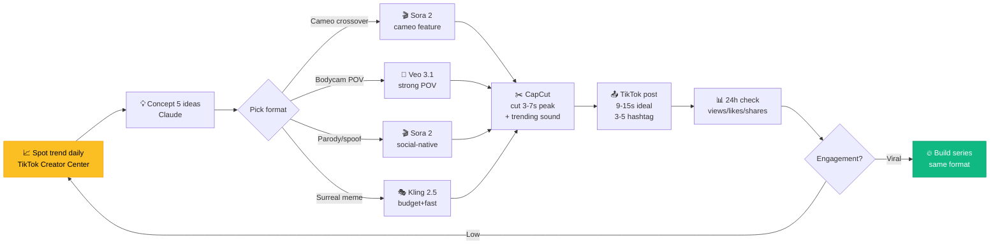

# Chapter 5 — Sora 2 & TikTok

<p style="font-size: 48px; line-height: 1; margin: 0 0 12px;">📱</p>

> **"Sora 2 launch 30/9/2025. 5 ngày sau #1 App Store. 6 ngày sau Jake Paul có 1 tỷ view."**
> — *TechCrunch / Social Media reports*

::: tip 🎯 Bạn sẽ học
- Sora 2 launch metrics + tại sao là moment "AI video phổ biến"
- Cameo feature: cho phép celeb/creator grant AI likeness
- 4 format viral Q4/2025: cameo, bodycam, parody, meme
- Higgsfield wrapper aggregate Sora + Veo + Kling
- VN: cách dùng Sora hợp pháp + format VN-friendly
:::

---

## 01 Sora 2 — moment phổ biến hóa AI video

### Launch metrics

| Metric | Số |
|------|------|
| Launch date | **30/9/2025** |
| Downloads (5 ngày đầu) | **>1M** |
| App Store rank | **#1 trong < 1 tuần** |
| Android day-1 | **470K downloads** |
| **Nhanh hơn ChatGPT** | ✅ (ChatGPT cần 5 ngày cho 1M user) |

### Tính năng đột phá so với Sora 1

| Feature | Sora 1 (2024) | Sora 2 (2025-26) |
|------|------|------|
| Physics | Cơ bản | **First-class** (object collision, gravity) |
| Audio sync | ❌ | ✅ **Dialogue + SFX 10-25s** |
| **Cameo** | ❌ | ✅ Cho phép grant likeness |
| App native | ❌ (web only) | ✅ **TikTok-style feed** |
| Duration | 5-10s | **10-25s** (longer arc) |

---

## 02 Cameo — cú đột phá UX

**Cameo** = feature cho phép user **grant likeness của mình** cho người khác dùng. Mở khoá viral mechanics chưa từng có.

### Jake Paul case

| Item | Số |
|------|------|
| Cameo grant date | T10/2025 |
| Total view trong 6 ngày | **>1 tỷ** (TikTok + IG + Sora app) |
| Number of UGC clips | **~50K** (gen bởi fan) |
| Cost cho Jake Paul | $0 (chỉ grant likeness) |
| **Revenue tiềm năng** | OpenAI đang test creator share |

### Vì sao breakthrough?

> **Cameo + Sora feed = "TikTok mà bất kỳ ai cũng có thể quay film với celeb."**

Trước Sora 2:
- Muốn quay với celeb = phải book + trả $$$$
- Muốn parody = phải quay actor lookalike

Sau Sora 2:
- Celeb grant cameo → fan gen unlimited clip
- Viral mechanics tự nhiên (fan tạo content, celeb không cần làm gì)

---

## 03 4 format viral Q4/2025

::: tip 🔥 Format thắng cuộc

### Format 1: **Cameo crossover**
Celeb A + Celeb B trong scene không thể có IRL.
- Trump + Elon ngồi cafe
- Jake Paul + Mike Tyson chơi cờ
- Ronaldo + Messi cùng đội

### Format 2: **Bodycam style**
Góc nhìn POV (point-of-view) như police bodycam — feel "real".
- Bodycam của shop owner gặp khách hàng kỳ lạ
- Bodycam delivery driver
- Bodycam người lạ vào nhà

### Format 3: **Parody / spoof**
- Reality TV parody (Survivor, Bachelor)
- Commercial parody
- Movie scene reimagined

### Format 4: **Meme / surreal**
- Animal doing human things (cat ở văn phòng)
- Object có ý chí riêng
- Physics-breaking moment
:::

---

## 04 Higgsfield — wrapper Sora + Veo + Kling

**Higgsfield** không phải model riêng. Là **wrapper** aggregate 4 model top + thêm **physics-based camera presets**.

### Camera preset

| Preset | Hiệu ứng |
|------|------|
| **Dolly** | Camera trượt mượt forward/back |
| **Orbit** | Xoay quanh subject |
| **Bullet time** | Pause world, xoay 360° (Matrix style) |
| **Hand-held** | Shake natural |
| **Crane** | Bay từ trên xuống |
| **Whip pan** | Lia nhanh chuyển scene |

### Pricing (T5/2026)

| Tier | Cost | Sora 2 access |
|------|------|------|
| Free | $0 | ❌ (chỉ legacy) |
| Pro | $9/tháng | Limited |
| Cinema | $39/tháng | Full Sora + Veo + Kling |
| **DoP** | **$99/tháng** | Unlimited + priority queue |

### Vì sao dùng Higgsfield thay vì Sora app trực tiếp?

1. **Aggregator**: 1 sub thay 4 sub (Sora + Veo + Kling + Runway)
2. **Camera control**: preset > prompt cho cinematic shot
3. **No queue**: Sora app peak có queue 30 phút, Higgsfield faster
4. **Asset library**: lưu prompt, lookbook, brand kit

---

## 05 Pipeline TikTok viral với Sora 2

::: tip 📱 Workflow 1 ngày → viral
```
1. Trend spot ──→ 2. Concept ──→ 3. Gen ──→ 4. Edit ──→ 5. Post
   (TikTok/X)      (Claude)      (Sora/Veo)  (CapCut)    (TikTok)
   30 phút          15 phút        1-2 giờ     30 phút     5 phút
```
:::

### Bước 1. Trend spot

| Source | Tần suất check |
|------|------|
| **TikTok Creator Center** (#sora2, #aivideo) | Daily |
| **X (Twitter)** account: @rowancheung, @minchoi, @hahn1010 | Daily |
| **Reddit r/aivideo, r/StableDiffusion** | Daily |
| **Higgsfield trending page** | Weekly |

Tìm: format đang viral + chưa quá bão hoà.

### Bước 2. Concept (Claude / ChatGPT)

```
Hôm nay format viral trên TikTok là [FORMAT].
Đề xuất 5 concept VN-ised cho format này.
Mỗi concept:
- Logline 1 câu
- Setting địa phương (Saigon / Hanoi / Đà Nẵng)
- Character (1-2 người, không clone celeb thật)
- Twist hài / bất ngờ
- Caption Việt + hashtag
```

### Bước 3. Gen (Sora 2 / Veo 3.1 / Kling)

| Format | Model best fit |
|------|------|
| Cameo crossover | **Sora 2** (có cameo feature) |
| Bodycam | **Veo 3.1** (POV strong) |
| Parody | **Sora 2** (social-native) |
| Meme | **Kling 2.5** (budget, fast) |

### Bước 4. Edit (CapCut)

- Cắt 10-25s clip → giữ **3-7s peak moment**
- Thêm sound trending (TikTok music lib)
- Caption to (bold, 36pt)
- Hashtag pinned

### Bước 5. Post

| Best time post (VN) | 6-7h sáng, 12h trưa, 19-21h tối |
|------|------|
| Hashtag | 3-5 hashtag, mix viral + niche |
| Caption | Hook 5 từ đầu cực mạnh |
| Duration ideal | **9-15 giây** (TikTok algo prefer) |

---

## 06 Prompt pack — Sora 2 / Veo 3.1

::: tip 📝 5 prompt template cho 4 format

**1. Cameo crossover (Sora 2)**
```
Selected cameos: [Person A] and [Person B]
Setting: [location detail]
Action: [interaction, 2-3 beats]
Camera: medium shot, slight handheld
Audio: dialogue with [tone], background ambient
Duration: 15s
Style: cinematic, golden hour, natural skin
```

**2. Bodycam POV (Veo 3.1)**
```
First-person POV bodycam footage, [setting: 
gas station / convenience store / parking lot]. 
[Subject] approaches camera, says: "[dialogue 1 line]". 
Cam shakes slightly, audio includes ambient noise + 
voice. 12s. Realistic, no music.
```

**3. Parody commercial (Sora 2)**
```
Spoof commercial for [fake product name], 
[product type: skincare / fitness / tech]. 
Spokesperson with exaggerated enthusiasm, 
cheesy 90s infomercial aesthetic. 
Includes obvious flaw / absurd benefit. 
Duration 20s with voiceover + product shot.
```

**4. Surreal meme (Kling 2.5)**
```
[Animal: cat / dog / hamster] performing 
[human activity: office work / cooking / driving] 
in [setting]. Realistic but absurd. 
Smooth camera, natural lighting, 10s.
```

**5. VN local trend (Sora 2 / Veo)**
```
A Vietnamese [character: street food vendor / 
xe ôm / cafe owner] in [HCMC street / Hanoi 
old quarter / Đà Nẵng beach]. [Activity with 
local detail]. Sound includes Vietnamese ambient 
+ optional dialogue "[Vietnamese 1 line]". 15s. 
Documentary style, handheld.
```
:::

---

## 07 Common pitfalls

::: warning 🚨 6 sai lầm TikTok AI creator

**1. Clone celeb thật không có permission** → bị remove, có thể bị kiện (Sora app khoá cameo nếu phát hiện)

**2. Format outdated** → mỗi format có shelf life 2-4 tuần, phải spot trend mới

**3. Caption tiếng Anh khi target VN** → reach thấp, algo demote

**4. Hashtag spam (20+ hashtag)** → TikTok algo demote, dùng 3-5 quality

**5. Skip native music trending** → algo demote post không dùng trending sound

**6. Post lẻ tẻ** → cần consistency 1-3 post/ngày trong 30 ngày để algo "đẩy"
:::

---

## 08 🇻🇳 Creator VN — playbook

### 🎯 5 angle VN-friendly

| Angle | Format | Hashtag |
|------|------|------|
| **Street food parody** | Parody commercial | #anvat #tiktokvietnam |
| **Xe ôm bodycam** | Bodycam | #xeom #saigon |
| **Lịch sử Việt re-imagined** | Cameo crossover (vua chúa) | #lichsuviet |
| **Café Sài Gòn vintage** | Cinematic short | #cafesaigon |
| **Meme động vật Việt** | Surreal meme | #meovietnam |

### 💰 Monetization TikTok VN

| Stream | Note |
|------|------|
| **TikTok Creator Fund VN** | Có nhưng pay-out thấp ($0.01-0.05 / 1K view) |
| **TikTok Shop** | Cao nhất! UGC video bán hàng — tommycetty $60K trong 10 ngày |
| **Brand deal direct** | Sau khi reach 10K+ follower |
| **Repost lên YouTube Shorts** | Pay-out cao hơn TikTok |
| **Course / digital product** | Khi build audience đủ lớn |

### 📜 Pháp lý + đạo đức

- ✅ Không clone celeb VN (Sơn Tùng, Ngọc Trinh...) — vi phạm Luật Quảng cáo + có thể kiện
- ✅ Disclose AI khi audience không expect (per TikTok policy mới T11/2025)
- ✅ Watermark "AI generated" nếu format mơ hồ (bodycam giả real)
- ❌ Không deepfake cảnh chính trị
- ❌ Không deepfake nội dung 18+

### 📱 Tool stack VN-friendly

| Layer | Tool | Cost VN |
|------|------|------|
| Trend spot | TikTok Creator Center | Free |
| Concept | ChatGPT free / Claude | Free / $20 |
| Gen | Higgsfield Cinema | $39/tháng |
| Edit | CapCut Pro | $7.99/tháng |
| Analytics | TikTok Insights | Free |

→ **Total ~$55/tháng** = lương 1 ngày VN dev.

---

## 09 Bài tập

::: tip ✍️ 3 cấp độ

**Level 1 — 1 ngày**
- Spot 1 trend Q4/2025
- Concept 3 VN angle (Claude)
- Gen 1 clip 15s với Sora 2 / Veo
- Post TikTok + đo view sau 24h

**Level 2 — 1 tháng**
- Post 30 clip trong 30 ngày (1/ngày)
- Mỗi tuần thử 1 format khác
- Target: 1 clip đạt >100K view

**Level 3 — 3 tháng**
- Build channel 10K+ follower
- Land 1 brand deal nhỏ ($200-1K)
- Test TikTok Shop UGC (nếu phù hợp niche)
:::

---

## 10 🎥 Watch & Learn — 5 video tutorial

<ChapterVideos :videos="[
  { id: 'ur18In04XXA', title: 'Sora 2 *hits* different', channel: 'Wes Roth', duration: '15:00', why: 'Reaction ngày Sora 2 launch (5/10/2025). Physics improvements vs Sora 1, audio sync, cameo.' },
  { id: 'gScBQmq06fQ', title: 'VEO 3.1 is UNLEASHED...', channel: 'Wes Roth', duration: '12:00', why: '16/10/2025 — Veo 3.1 launch: 60s video, native audio, Ingredients to Video. Counter Sora 2.' },
  { id: 'ODKPlMsSe1E', title: 'I Tested Sora 2 and Veo 3.1 Head-to-Head', channel: 'Wes Roth', duration: '18:00', why: 'Side-by-side prompt test — strength/weakness mỗi tool trước khi chọn stack.' },
  { id: 'KRGHOmD0lUk', title: 'Create Cinematic AI Video in Sora 2 (Full Tutorial)', channel: 'Curious Refuge', duration: '25:00', why: 'Caleb Ward workflow chi tiết — prompt structure, shot list, editing cho cinematic output.' },
  { id: 'rQgaQ1p4tKU', title: 'My AI Videos Hit 1M+ Views (Veo3 + Sora 2 Demo)', channel: 'PJ Ace', duration: '10:00', why: 'PJ Ace 300M+ views portfolio — combine Veo 3 + Sora 2 (Popeyes, IM8, Kalshi).' }
]" />

---

## 11 🔬 Deep Dive Techniques 2026

::: tip 🎬 8 advanced techniques cho Sora 2 + TikTok viral

**1. Cameo opt-in revenue play (Jake Paul model)**
- Paul = first celeb NIL cameo user
- Cho phép user gen video về mình → **1B views/6 ngày + $57M media value**
- Risk: lose brand control. Reward: distributed reach miễn phí
- Khi nào: creator VN có audience >100K

**2. Health & wellness dominance trên TikTok Shop (tommycetty rule)**
- Top performers: health/wellness (Relaxin, Goalie)
- 9 ngày: **$55K GMV ~$3K/day** không cần viral
- Lý do: high LTV, repeat purchase, low return

**3. GMV Max post-T8/2025**
- TikTok shift sang "pay-to-play" — organic viral content cần ad spend
- Budget plan: **15-20% revenue** back vào GMV Max ads

**4. Ban wave 4-6 tháng**
- TikTok mass ban content style oversaturated
- Mitigation: rotate 3-4 format, diversify accounts, không depend single

**5. Higgsfield Cinema Studio 2.0 = single source-of-truth**
- Tích hợp Sora 2 + Kling 3.0 + Veo 3.1 trong 1 interface
- **Soul ID** character consistency cross 100+ clip
- $29.40/month Ultimate = 1200 credits = ~17 Veo 3.1 video quality/tháng

**6. Cost per 4-sec generation 2026**
| Tool | Cost / 4-sec |
|------|------|
| Veo 3.1 | ~$1.60 |
| Sora 2 | ~$0.40 |
| Kling v2.1 | ~$0.45 |
→ Bulk testing → Kling. Hero shot → Sora 2/Veo 3.1. Combine cả 3 cùng video.

**7. Sora 2 audio supremacy**
- Dialogue + SFX unmatched (Sora 2)
- Veo 3.1 native audio nhưng SFX kém
- Kling không audio → post-prod ElevenLabs

**8. Storyboard mode + Ingredients to Video pattern**
- Sora 2 storyboard + Veo 3.1 Ingredients (up to 3 ref images)
- Workflow chuẩn cho 60-90s ads
:::

---

## 12 📚 More Case Studies (2025-2026)

### Case A: Jake Paul / Sora 2 Cameo — **1B views/6 ngày, $57M media value**

| Item | Số |
|------|------|
| Creator | Jake Paul (early OpenAI investor) |
| **Sora videos cross IG + TikTok** | **6,500+** |
| **Views 6 ngày** | **1B+** |
| **Media value** | **$57M** |
| Strategy | Threatened sue → next day announce opt-in. Calculated controversy. |

> **Insight**: Established creator + cameo opt-in = unlimited UGC. Risk: brand dilution nếu UGC negative.
> Source: [Scientific American](https://www.scientificamerican.com/article/jake-pauls-deepfake-gambit-sparks-debate-over-sora-cameos-and-digital/)

### Case B: tommycetty / TikTok Shop AI affiliate (T1/2026)

| Item | Số |
|------|------|
| **10-day earning** | **$60K** |
| **Best single day Jan 6** | **$22K sales = $4K profit** (20% commission) |
| **9-day consistent (Jan 3-11)** | **$55K GMV** ~$3K/day không viral |
| Stack | AI UGC (Sora 2/Veo 3.1) + TikTok Shop affiliate + health/wellness niche |
| Cost reduction | Production $200-500/video → $5-15/video |

> **Insight**: Consistent $3K/day baseline > 1 viral spike.
> Source: [Hooc.ai](https://hooc.ai/blog/en/tiktok-creator-reveals-60k-in-10-days-using-ai-tiktok-shop-strategy)

### Case C: Sora 2 launch traction (T9-T10/2025)

| Item | Số |
|------|------|
| **#1 US iOS App Store** | **48h, 164K+ downloads** (invite-only!) |
| **1M downloads** | **<5 ngày** |
| 72h post-launch | OpenAI reverse course → opt-in cho copyrighted characters do Hollywood pressure |

> **Insight**: Demand cho AI video tool consumer-facing massive. Invite-only friction không stop growth.
> Source: [OpenAI Sora release notes](https://help.openai.com/en/articles/12593142-sora-release-notes)

---

## 13 🛠️ Tool Updates (T2-T5/2026)

| Tool | Update | Date | Key impact |
|------|------|------|------|
| **Sora 2 storyboard mode** | Multi-shot narrative control 1 generation | T11/2025 | Supersedes external scene-chaining tools |
| **Veo 3.1 vertical** | 9:16 vertical từ reference images | 13/1/2026 | Direct play TikTok/Reels/Shorts native |
| **Kling 3.0** | Higgsfield đã integrate, compete Sora 2 cinematic | Q1/2026 | Bỏ Kling 2.5/2.6 |
| **Higgsfield Max $20K Challenge** | Creator competition program | Q2/2026 | Submission rolling — học viên build portfolio + shot $20K |
| **TikTok GMV Max enforcement** | "Pay-to-play" cho TikTok Shop | T8/2025 → 2026 dominant | Pure organic gần như dead |

Sources: [TechCrunch Veo 3.1 vertical](https://techcrunch.com/2026/01/13/googles-update-for-veo-3-1-lets-users-create-vertical-videos-through-reference-images/) | [Higgsfield blog](https://higgsfield.ai/blog/2K5Utymp5nNQ74jjHDmNK7)

---

## 14 📊 Architecture Diagram — TikTok Viral Pipeline



**4 viral formats Q4/2025 (validated)**:
1. **Cameo crossover** — Sora 2 (Jake Paul = 1B views/6 ngày)
2. **Bodycam POV** — Veo 3.1 (real feel)
3. **Parody/spoof commercial** — Sora 2
4. **Surreal meme** — Kling 2.5

---

## 15 🧪 Hands-on Lab — Build 1 Viral-Format Clip với Sora 2

::: tip 🎯 Goal
60 phút: gen + edit + post 1 clip 15s theo 1 trong 4 viral format. Target: >1K view trong 24h.
:::

### Prerequisites checklist

```
□ ChatGPT Plus ($20/tháng) — Sora 2 access
□ Higgsfield Cinema ($39/tháng) optional — wrapper Sora+Veo+Kling
□ CapCut Pro ($7.99/tháng)
□ TikTok account (account >7 ngày tuổi để algo trust)
□ 1 hour focus block
```

### Step 1. Spot 1 trend (10 phút)

Sources:
- **TikTok Creator Center** → trending sounds tab
- **#sora2** + **#aivideovn** + **#aivideo** trên TikTok
- **X**: follow @rowancheung, @minchoi, @hahn1010
- **Reddit** r/aivideo

→ Save 3 trends → pick 1 chưa quá bão hoà (300-3000 video tag = sweet spot).

### Step 2. Concept VN-ised (10 phút)

Claude prompt:
```
Hôm nay TikTok trend là [FORMAT — vd: "bodycam shopkeeper meeting weird customer"].

Đề xuất 5 concept VN-ised:
1. Logline 1 câu
2. Setting địa phương VN
3. Character (1-2 người, không clone celeb thật)
4. Twist hài / bất ngờ
5. Caption Việt + hashtag #aivideovn #sora2

Format: bảng Markdown.
```

→ Pick best concept.

### Step 3. Gen với Sora 2 (20 phút)

**Sora 2 prompt** (cameo crossover example):
```
Selected cameo: [your own face — if you have cameo enabled]
Setting: Saigon cafe at night, golden lamp light, rain outside window
Action:
- You sit reading book (2s)
- Stranger sits across, asks "Em là người mới đến HCMC à?"
- You look up, smile awkwardly (2s)
- Stranger leans in, whispers something funny (2s)
Camera: medium shot, slight handheld
Audio: dialogue Vietnamese, soft jazz background
Duration: 15s
Style: cinematic, film grain
```

→ Gen 3-5 lần, pick best.

### Step 4. Edit CapCut (15 phút)

Timeline:
```
[0-1s] Hook frame: Close-up face với caption huge "Hôm qua tôi gặp..."
[1-13s] Main clip 12s Sora gen
[13-15s] Outro frame: Caption "Bạn có gặp tình huống tương tự?"

Audio:
- Sora generated audio (đã có)
- Add: trending TikTok sound mới (lower volume 20% để giữ dialogue chính)

Captions:
- Bold sans-serif 36pt
- Tiếng Việt
- Animated burst effect
- Position: top center
```

Export: 1080x1920 (9:16 vertical), MP4, 30fps.

### Step 5. Post TikTok (5 phút)

```
Caption (200 ký tự max):
"Trải nghiệm gặp người lạ ở Saigon 🥹 [comment your story below]

#sora2 #aivideovn #saigon #cafesaigon"

Best post time VN:
- 6-7h sáng (commute)
- 12h trưa (lunch)
- 19-21h tối (prime time)
```

→ Post + check engagement 24h sau.

### 🐛 Common errors + fixes

| Error | Fix |
|------|------|
| Sora 2 queue 30 phút | Try Higgsfield Cinema (faster + multi-model) |
| Cameo bị block | Cameo cần grant trước. Setup Sora app → Profile → "Allow cameo" |
| Vietnamese dialogue robot-sounding | Add "natural Vietnamese accent" prompt; or generate audio riêng với ElevenLabs Vietnamese voice |
| TikTok algo demote | Check: native music trending? Vietnamese hashtag? Length 9-15s? |
| Reach thấp | Post-post: engage comment 30 phút đầu để boost algo |

---

## 16 🏗️ Mini-Project — 30-Day TikTok Challenge, 10K Followers

::: warning 🎯 Assignment

**Goal**: 30 ngày, 30 clip, 10K real followers + 1 viral (>100K view).

**Requirements**:
1. **Niche statement** (vd: "AI lịch sử Việt re-imagined", "Bodycam xe ôm Saigon")
2. **Posting cadence**: 1 clip/ngày × 30 ngày
3. **Format rotation**:
   - Tuần 1: thử 4 viral format (1 mỗi format)
   - Tuần 2-4: double down format winner
4. **Hook engineering**: A/B test 3 hook style (question, statement, action)
5. **Hashtag strategy**: 3-5 hashtag mix viral + niche
6. **Analytics tracking**: log view, like, share, follower growth daily

**Acceptance criteria**:
- [ ] 30 clip posted (gap không quá 1 ngày)
- [ ] 10K real follower (không buy)
- [ ] 1 clip > 100K view
- [ ] Average engagement rate >5%
- [ ] 1 brand DM hỏi collab
- [ ] Documented playbook (lessons)

**Time estimate**: 30 ngày, 2h/ngày

**Stretch goals** 🚀:
- 50K follower → unlock TikTok Creator Fund VN
- 1 clip > 1M view
- Land TikTok Shop affiliate (như tommycetty $60K/10 ngày)
- Sell course "How I grew 10K AI followers" — $99

**Cost budget**:
- ChatGPT Plus (Sora 2) $20
- CapCut Pro $8
- Higgsfield Cinema $39 (optional)
- **Total: ~$30-70/tháng**
:::

---

## 17 🎓 Knowledge Check

::: details 1. Sora 2 đạt 1M downloads trong bao lâu?
**A.** 30 ngày
**B.** 5 ngày ✅
**C.** 1 tháng
**D.** 6 tháng

**Đáp án: B** — Sora 2 (launch 30/9/2025): **1M downloads <5 ngày** (nhanh hơn ChatGPT lúc launch). Android day-1: 470K downloads. #1 US iOS App Store trong 48h.
:::

::: details 2. Jake Paul Sora 2 cameo đạt bao nhiêu views/6 ngày?
**A.** 100M
**B.** 500M
**C.** 1 BILLION ✅
**D.** 100K

**Đáp án: C** — Jake Paul cameo: **1B+ views trong 6 ngày** cross IG + TikTok. $57M media value. ~6,500 Sora videos UGC.
:::

::: details 3. 4 viral format Q4/2025 đúng?
**A.** Stitch, Duet, Slideshow, Live
**B.** Cameo crossover, Bodycam, Parody, Surreal meme ✅
**C.** Dance, Lipsync, Cooking, Travel
**D.** Tutorial, Reaction, Story, Tag

**Đáp án: B** — 4 format thắng Q4/2025: **Cameo crossover** (Sora 2), **Bodycam POV** (Veo 3.1), **Parody commercial** (Sora 2), **Surreal meme** (Kling 2.5).
:::

::: details 4. Higgsfield Cinema làm gì?
**A.** Own video model
**B.** Wrapper aggregate Sora + Veo + Kling + Wan với camera presets ✅
**C.** Edit software
**D.** Music gen

**Đáp án: B** — Higgsfield = **wrapper** aggregate 4 model top + physics-based camera presets (Dolly, Orbit, Bullet time, Hand-held, Crane, Whip pan).
:::

::: details 5. tommycetty đạt earning bao nhiêu / 10 ngày TikTok Shop?
**A.** $5K
**B.** $20K
**C.** $60,000 ✅
**D.** $500K

**Đáp án: C** — tommycetty: **$60,000 trong 10 ngày** TikTok Shop affiliate. Best single day Jan 6: $22K sales = $4K profit (20% commission). Health/wellness niche.
:::

::: details 6. Cost per 4-sec gen 2026 — Kling vs Sora 2 vs Veo?
**A.** All ~$1
**B.** Kling $0.45, Sora 2 $0.40, Veo $1.60 ✅
**C.** All free
**D.** Veo $0.10, others $5

**Đáp án: B** — Kling v2.1 ~$0.45, Sora 2 ~$0.40, Veo 3.1 ~$1.60 per 4-sec. Bulk testing → Kling. Hero shot → Sora 2/Veo 3.1.
:::

::: details 7. TikTok GMV Max sau T8/2025?
**A.** Pure organic still work
**B.** "Pay-to-play" enforcement — cần ad budget ✅
**C.** Free for creators
**D.** Removed

**Đáp án: B** — Sau T8/2025: TikTok shift "**pay-to-play**" — organic viral content cần ad spend backing. Budget plan: **15-20% revenue** back vào GMV Max ads.
:::

::: details 8. Sora 2 storyboard mode release?
**A.** Launch ngày
**B.** T11/2025 ✅
**C.** Chưa có
**D.** Q3 2026

**Đáp án: B** — **T11/2025**: Sora 2 storyboard mode — multi-shot narrative control trong 1 generation. Supersedes external scene-chaining tools.
:::

::: details 9. Veo 3.1 vertical update khi nào?
**A.** T9/2025
**B.** T1/2026 (13 Jan) ✅
**C.** T6/2026
**D.** Chưa có

**Đáp án: B** — **13/1/2026**: Veo 3.1 tạo vertical 9:16 từ reference images. Direct play TikTok/Reels/Shorts native format.
:::

::: details 10. Project Mariner (Google) shutdown khi nào và lý do?
**A.** Still running
**B.** T5/4/2026 — visual screenshot too expensive vs API-first ✅
**C.** T1/2026 — bankruptcy
**D.** T12/2025 — security issue

**Đáp án: B** — Project Mariner shutdown **T5/4/2026**. 17-month experiment killed because visual screenshot architecture too compute-intensive, error-prone, outclassed by API-first agents (Claude Code + MCP). Tech absorbed Gemini API + Gemini Agent.
:::

**Score**:
- 8-10/10 ✅ Ready cho Chapter 6 (Faceless Empire)
- 5-7/10 ⚠️ Re-read sections 1-13
- <5/10 ❌ Redo lab actually post TikTok

---

## 18 Đọc tiếp

- 🎬 [Chapter 1 — Solo Studio](./1-solo-studio.md)
- 💰 [Chapter 4 — Solo SaaS](./4-solo-saas-million.md)
- 🤖 [Chapter 6 — Faceless Empire](./6-faceless-empire.md) — YouTube + Etsy + TikTok Shop
- 📜 [Chapter 8 — Ethics 2026](./ethics-2026.md)

::: tip 📱 Lời cuối
> *"Jake Paul có 1 tỷ view trong 6 ngày — chỉ vì bật cameo.*
> *Tốc độ phổ biến hoá Sora 2 chứng minh: **lớp viral AI video đã mở.***
>
> *Câu hỏi không phải "có nên thử không?" — mà **"bạn sẽ là creator nào trong 5,000 người đầu tiên?"**"*
:::
