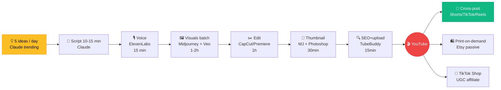

# Chapter 6 — Faceless Empire

<p style="font-size: 48px; line-height: 1; margin: 0 0 12px;">🤖</p>

> **"$60,000 trong 10 ngày. 1 video kiếm $10,000 commission. Tôi không bao giờ lên hình."**
> — *tommycetty, TikTok Shop AI creator*

::: tip 🎯 Bạn sẽ học
- 3 model "không lên hình" kiếm tiền AI: YouTube + Etsy + TikTok Shop
- Pipeline tự động hoá content 7 ngày/tuần với AI
- Số thực: $117M / faceless YouTube channels 2024-25
- Niche VN-friendly: print-on-demand, micro-stock, UGC ad
- Cách scale từ 1 channel → empire 10 channel
:::

---

## 01 Vì sao "faceless"?

::: tip 🎭 3 lý do
**1. Không sợ camera** — Introvert, không thoải mái lên hình
**2. Easier scale** — Không bị "stuck với 1 face brand"
**3. Tự động hoá > personality** — AI gen content 24/7, không cần con người
:::

**Faceless** ≠ ẩn danh. Đó là **"voice-first hoặc visual-first, không phải face-first."**

---

## 02 Faceless YouTube — $117M ad revenue (2024-25)

### Numbers thị trường

| Stat | Số |
|------|------|
| Total ad revenue faceless YouTube 2024-25 | **~$117M** |
| RPM trung bình | **$15-40** (cao gấp 2-3x channel có mặt) |
| Top channel có 1M+ subscriber | **>500 channel** |
| Niche dominant | True crime, history, science, sleep, finance |

### Case Court Case Channel

| Metric | Số |
|------|------|
| Niche | True crime court cases (US) |
| 1 video cost | **$250** (production) |
| Best video earning | **$20,000** (5M view) |
| Channel ARR | **~$500K-1M** |

### Stack chuẩn faceless YT

| Bước | Tool | Time |
|------|------|------|
| 1. Script | Claude / ChatGPT | 30 phút |
| 2. Voice | ElevenLabs v3 | 15 phút |
| 3. Visuals | Midjourney / Flux + Veo / Kling | 1-2 giờ |
| 4. Edit | CapCut / Descript / Premiere | 1 giờ |
| 5. Thumbnail | Midjourney + Photoshop | 30 phút |
| 6. Upload + SEO | TubeBuddy / VidIQ | 15 phút |

**Total: ~4 giờ / video. 1 người làm 3 video/tuần = full-time.**

---

## 03 Etsy AI passive — $3.3M total sales (Digital Curio case)

### Niche dominant trên Etsy 2025-26

| Niche | RPM / Sale |
|------|------|
| **Wall art (Midjourney print)** | $5-50 / sale, 100-1000 sale/tháng |
| **Pet portrait commission** | $20-80 / sale, custom |
| **Wedding invite template** | $5-15 / sale |
| **Coloring book PDF** | $3-10 / book |
| **Children's book illustration** | $10-30 / book |
| **Logo / brand kit** | $20-100 / commission |

### Pipeline Etsy seller

```
1. Niche research (Etsy + EverBee) ──→ 2. Gen 20-50 design 
   ──→ 3. Mock-up listing ──→ 4. SEO title + tag 
   ──→ 5. Print-on-demand (Printful / Printify) ──→ 6. Profit
```

### Case "Digital Curio"

- Niche: wall art prints
- Total sales: **~$3.3M** trên Etsy
- Số design active: ~5,000
- Tool: Midjourney + Photoshop
- Người: 1 người + 1 contractor part-time

---

## 04 TikTok Shop UGC — $60K trong 10 ngày

### tommycetty case (US)

| Item | Số |
|------|------|
| Account | TikTok Shop affiliate |
| Total earning 10 ngày | **$60,000** |
| Best single video | **$10,000** commission (1 video) |
| Format | UGC product review với AI avatar |
| Stack | Sora 2 / Veo + ElevenLabs + CapCut |

### Pipeline UGC ad

```
1. Pick product TikTok Shop (hot, commission %)
   ──→ 2. Gen avatar speak product
   ──→ 3. Add B-roll (product shot)
   ──→ 4. Add hook + CTA
   ──→ 5. Post 5-10 video/ngày
```

### Vì sao UGC ad effective?

- TikTok user **distrust polished ad** → UGC feel authentic
- Algo **boost UGC review** trên feed shopping
- Commission **5-20% / sale** → 1 viral video = $1K-10K

---

## 05 Pipeline tự động hóa content empire

::: tip 🤖 Stack scale từ 1 → 10 channel

**Layer 1: Idea generation** (Claude)
- Daily prompt: 5 video idea cho [niche] dựa trên trending Google + YouTube

**Layer 2: Script writing** (Claude / GPT-5)
- Template script 10-15 phút per video

**Layer 3: Voice** (ElevenLabs)
- 1 voice persona / channel
- Batch process 5-7 video/lần

**Layer 4: Visuals** (Midjourney + Veo)
- 1 style guide / channel
- Batch gen 50-100 image / week

**Layer 5: Edit** (CapCut auto-edit / Descript)
- Template timeline reusable
- AI auto-cut + caption

**Layer 6: Publish** (Buffer / Hootsuite)
- Schedule 1 video/ngày/channel
- Cross-post TikTok + Reels + Shorts

**Layer 7: Analytics** (TubeBuddy)
- Weekly review: top video, churn, RPM
:::

---

## 06 Niche VN-friendly cho faceless content

::: tip 🇻🇳 10 niche VN có cơ hội

**YouTube (Vietnamese / English)**

1. **Lịch sử Việt Nam re-told** — bằng AI animation
2. **Story bí ẩn / huyền thoại** Việt
3. **Top 10 món ăn vùng miền** (animated)
4. **Career stories** dev VN ở nước ngoài
5. **Crypto / finance giải thích tiếng Việt**

**Etsy (English, target US/EU)**

6. **Print Việt Nam culture** (áo dài, Hội An, Sapa)
7. **Lunar Year card / decoration**
8. **Coloring book con vật Đông Á**
9. **Vietnamese calligraphy print**

**TikTok Shop**

10. **UGC review hàng VN cho TikTok Shop VN** (đồ ăn vặt, mỹ phẩm, thời trang)
:::

---

## 07 Prompt pack — content automation

::: tip 📝 5 prompt template

**1. Faceless YouTube script (Claude)**
```
Viết script video YouTube faceless 10 phút, niche [niche].
Topic: [specific topic]
Structure:
- Hook 30s (curiosity gap)
- Intro 60s (context + promise)
- 3 main section, mỗi section 2:30
- CTA 30s (subscribe + next video)

Tone: [educational / mysterious / casual]
Audience: [VN / EN]
Format: 1 dòng / paragraph để dễ voice gen
```

**2. ElevenLabs voice setup**
- Chọn voice từ library (hoặc clone own voice)
- Set: stability 0.5, similarity 0.75, style 0.3
- Output: MP3 32kbps cho draft, 192kbps cho final

**3. Etsy listing copy (Claude)**
```
Viết Etsy listing cho design [describe design]:
- Title 140 ký tự (SEO + benefit + niche keyword)
- Description 13 dòng (benefit-first, FAQ ending)
- 13 tag (mix broad + specific keyword)
- Pricing đề xuất theo competitor
- 5 mock-up ý tưởng
```

**4. TikTok Shop UGC script (Claude)**
```
Viết script UGC review 30s cho product [name, $price] 
trên TikTok Shop:
- Hook 3s: "Wait..." moment
- Demo 15s: 2-3 benefit thực
- CTA 7s: "Link in bio" + scarcity
- B-roll suggest 5 cảnh

Tone: authentic, surprised, casual
Audience: [VN / US]
```

**5. Thumbnail generator (Midjourney)**
```
YouTube thumbnail, [niche], dramatic composition, 
high contrast, 1-2 word text overlay area, 
emotional face (if applicable), [color palette], 
16:9, eye-catching, --ar 16:9 --v 7
```
:::

---

## 08 Common pitfalls

::: warning 🚨 7 sai lầm faceless creator

**1. Generic AI voice** → audience nhận ra ngay = trust thấp. Custom voice + emotion tag

**2. Lazy thumbnail** → CTR thấp, video không reach. Đầu tư A/B test thumbnail

**3. Quá nhiều niche cùng lúc** → 1 channel = 1 niche. Multi-niche = burn out + algo confused

**4. Không A/B test format** → stick 1 format dù không work. Mỗi tuần thử 1 variation

**5. Skip SEO** → upload xong xuôi quên optimize title/tag. Dùng TubeBuddy / VidIQ

**6. Volume > Quality** → 10 video shitty/ngày = hư brand. 3 video tốt/tuần tốt hơn

**7. Quên monetization plan** → tích luỹ 100K view mà chưa setup AdSense / affiliate / shop
:::

---

## 09 🇻🇳 Empire builder VN — playbook

### 🎯 Lý do VN có lợi thế

| Yếu tố | VN | US/EU |
|------|------|------|
| Cost contractor | $5-15/giờ | $30-80/giờ |
| English level đủ | ✅ (Gen Z VN) | N/A |
| Niche underserved | ✅ (VN content thiếu) | Bão hoà |
| Time zone | UTC+7 (gen content trong khi US ngủ) | UTC-8 to +1 |

→ **VN content creator có thể serve global audience với cost 1/5.**

### 💰 Economics 1 channel

| Item | Cost / tháng |
|------|------|
| Midjourney Standard | $30 |
| ElevenLabs Creator | $22 |
| Veo / Kling | $30-50 |
| CapCut Pro | $7.99 |
| TubeBuddy + VidIQ | $15-30 |
| **Total** | **~$110/tháng** |

→ Cần ~3,000-5,000 view/ngày để hoà vốn (RPM $15). Channel mature thường 50K-200K view/ngày.

### 🏗️ Scale từ 1 → 10 channel

| Tháng | Channel count | Effort |
|------|------|------|
| 1-3 | 1 channel (manual, learn) | Full-time owner |
| 4-6 | 2-3 channel | Hire 1 VA / contractor |
| 7-12 | 5 channel | Hire 2-3 VA + 1 editor |
| 13-24 | 10 channel | Build team 5-7 người |

### 🏛️ Cấu trúc công ty VN

- **Hộ kinh doanh cá thể** cho 1-2 channel ($10K-30K MRR)
- **Công ty TNHH** khi >3 channel hoặc thu nhập >$5K/tháng
- **Stripe Atlas / LLC US** nếu serve US audience + nhận AdSense USD

### 🤝 Community VN

- **YouTube Creators Vietnam** (Facebook group)
- **VN Affiliate Marketing community**
- **Etsy Vietnam Sellers** (Telegram + FB)

---

## 10 Bài tập

::: tip ✍️ 3 cấp độ

**Level 1 — 1 tháng**
- Pick 1 niche faceless YouTube
- Upload 10 video (1/3 ngày)
- Mỗi video < 4 giờ production
- Target: 1,000 subscriber

**Level 2 — 6 tháng**
- 1 channel YouTube + 1 Etsy shop
- $500-1K MRR tổng
- Hire 1 VA part-time

**Level 3 — 12 tháng**
- 3-5 channel cross-niche
- $5K+ MRR
- Team 2-3 người
:::

---

## 11 🎥 Watch & Learn — 5 video tutorial

<ChapterVideos :videos="[
  { id: 'g4FJHwMchlo', title: 'How to Start a Faceless YouTube Channel With AI 2025', channel: 'AI Creator Hub', duration: '25:00', why: 'Step-by-step workflow: script (ChatGPT) → voice (ElevenLabs) → visual (MJ) → edit (CapCut).' },
  { id: 'AKJUoLbVxes', title: 'I locked myself for 90 days to build this SaaS', channel: 'Marc Lou', duration: '20:00', why: 'Marc shows execution discipline. Pattern apply được cho faceless empire 90 ngày.' },
  { id: 'dan3QfN3CDU', title: 'Karpathy Vibe Coding Full Tutorial with Cursor (Zero Coding)', channel: 'Tech with Tim', duration: '40:00', why: 'Foundation cho faceless creator automate content pipeline (script writer, thumbnail agent).' },
  { id: 'UvAVnacqz-8', title: 'Higgsfield AI Supercomputer: Viral Videos From 1 Prompt', channel: 'Higgsfield Official', duration: '12:00', why: 'Single-prompt video cho TikTok/Reels/Shorts — exactly cho faceless empire scale.' },
  { id: '8AWEPx5cHWQ', title: 'Cursor Vibe Coding Tutorial - For COMPLETE Beginners', channel: 'Tech with Tim', duration: '45:00', why: 'Build automation pipeline cho faceless content. Easy follow cho học viên VN biết English.' }
]" />

---

## 12 🔬 Deep Dive Techniques 2026

::: tip 🤖 8 advanced techniques cho faceless empire

**1. Cost-per-video economics (Noah Morris benchmark)**
- 1 court case video = **$250 production → $20K+ revenue** từ 5M views
- Target ROI **50-80x**
- Niche CPM thấp → increase volume hoặc switch niche

**2. Multi-channel portfolio (Matt Par / Noah Morris pattern)**
- Noah: **~20 channels, 2.5M+ combined subs**
- Matt Par: **12+ channels, 2M+ subs, 1B+ views**
- Solo người không scale 1 channel mass — clone playbook cross niches

**3. 6-12 tháng loss-make timeline**
- Average faceless channel operate at **loss 6-12 tháng** trước break-even
- Budget: $200-500/video × 30-50 videos trước AdSense significant
- Treat as business investment

**4. AI tool stack chuẩn cho faceless YT 2026**
| Item | Cost |
|------|------|
| ElevenLabs Creator | $22/mo |
| Midjourney v7 Pro | $30/mo |
| Veo 3.1 Fast | $0.15/sec |
| CapCut Pro | $8/mo (sau free) |
| TubeBuddy Legend | $30/mo |
| **Total** | **~$90/mo** |
→ Break-even ~50K monthly views

**5. Etsy AI digital products economics**
- Top sellers: **$5K-30K/month** từ printable downloads
- Wild Oak Stickers: 291K sales, **$1.16M revenue**
- AI lets scale **10 designs → 1000 designs** cùng tuần

**6. Hook + retention curve cho faceless**
- First 15s quyết định **80% retention**
- A/B test 3-5 thumbnail per video → pick winner
- CTR target **>6%** cho monetized channels

**7. TikTok Shop UGC affiliate (tommycetty pattern)**
- **$35K-60K trong 10 ngày** khả thi với AI UGC + affiliate
- Health/wellness category
- AI giúp scale **5-10 video/day** production

**8. YouTube Shorts → Long-form funnel**
- Tạo Shorts (Veo 3.1 vertical) để discover audience
- Redirect sang long-form 10-15 phút (CPM cao 5-15x)
- Shorts CPM thấp, long-form niche CPM cao
:::

---

## 13 📚 More Case Studies (2025-2026)

### Case A: Noah Morris / NexLev (court case channel network)

| Item | Số |
|------|------|
| Network | **~20 faceless channels** |
| Combined subs | **2.5M+** |
| 1 video cost | **$250** |
| Best video earning | **$20K+** từ 5M views |
| **ROI** | **80x** |
| Stack | AI script + ElevenLabs voiceover + stock footage + freelance editor |

> **Insight**: Niche depth (court cases) > breadth. Specialized audience = higher CPM.
> Source: [Unkoa](https://www.unkoa.com/faceless-youtube-10000-month-2025/)

### Case B: tommycetty / TikTok Shop affiliate (đã ref Ch 5)

| Item | Số |
|------|------|
| 10-day earning | **$60K** |
| Best day | **$22K** |
| 9-day consistent | **$55K** ~$3K/day |

> **Insight**: AI UGC cho phép production 5-10 video/day. Affiliate model = không cần inventory.
> Source: [Hooc.ai](https://hooc.ai/blog/en/tiktok-creator-reveals-60k-in-10-days-using-ai-tiktok-shop-strategy)

### Case C: Fern + The Infographics Show benchmark (2026)

| Channel | Revenue/tháng |
|------|------|
| **Fern** | **$80K+** |
| **The Infographics Show** | **$100K-300K** |

| Item | Detail |
|------|------|
| Established | 2024-2025 |
| Stack | Script-heavy, animated infographic, AI-augmented research → human script |
| Moat | Strong scripts |

> **Insight**: Quality > volume khi target top-tier. AI augments không replaces creative direction.
> Source: [Miraflow](https://miraflow.ai/blog/faceless-youtube-channel-explosion-ai-million-subscriber-creators-2026)

---

## 14 🛠️ Tool Updates (T2-T5/2026)

| Tool | Update | Date | Key impact |
|------|------|------|------|
| **Veo 3.1 vertical** | Native vertical Shorts/TikTok | 13/1/2026 | Không cần re-format — game-changer faceless creator |
| **ElevenLabs Studio 3.0** | Multi-character dialogue + emotion control | Q1/2026 | Cho narrative-driven (court case, mystery, documentary) |
| **Midjourney v7.x** | Character consistency improved cross frames | 2026 | Critical cho serialized faceless content |
| **CapCut AI auto-cut + caption** | Tiếng Việt stable | 2026 update | Học viên VN dùng trực tiếp |
| **TubeBuddy AI thumbnail testing** | A/B test 3-5 thumbnails auto + traffic split | 2026 | Critical cho faceless scale |

Source: [TechCrunch Veo 3.1](https://techcrunch.com/2026/01/13/googles-update-for-veo-3-1-lets-users-create-vertical-videos-through-reference-images/)

---

## 15 📊 Architecture Diagram — Faceless YT Production Pipeline



**Per-video time + cost**:
| Step | Time | Cost |
|------|------|------|
| Script | 30 min | ChatGPT $20/mo |
| Voice | 15 min | ElevenLabs $22/mo |
| Visuals | 1-2h | MJ $30 + Veo $0.15-0.40/sec |
| Edit | 1h | CapCut $7.99/mo |
| Thumbnail | 30 min | MJ included |
| SEO | 15 min | TubeBuddy $30/mo |
| **Total** | **~4h/video** | **~$90/month + per-video Veo cost** |

→ Break-even ~50K monthly views (RPM $15).

---

## 16 🧪 Hands-on Lab — Build 1 Faceless YouTube Video End-to-End

::: tip 🎯 Goal
4 giờ: ship 1 video YouTube faceless 10 phút, niche bạn pick. Upload + SEO + ready to publish.
:::

### Prerequisites checklist

```
□ ElevenLabs Creator ($22/tháng) — voice clone hoặc library
□ Midjourney Standard ($30/tháng) — visuals
□ Veo 3.1 access (Gemini Advanced $19.99) — motion clips
□ CapCut Pro ($7.99/tháng)
□ TubeBuddy hoặc VidIQ ($15-30/tháng) — SEO
□ YouTube channel (đã setup banner + about)
```

### Step 1. Pick niche + topic (15 phút)

5 niche template VN-friendly:
1. **Lịch sử Việt re-told** — animated với AI visuals
2. **Top 10 món ăn vùng miền** — animated food
3. **Crypto/finance giải thích tiếng Việt**
4. **Career stories dev VN ở nước ngoài**
5. **Bí ẩn lịch sử / huyền thoại Việt**

Pick niche → Claude prompt:
```
Tôi làm faceless YouTube channel niche [NICHE].
Đề xuất 10 topic video viral potential:
- Mỗi topic: title <60 ký tự (SEO friendly)
- Mỗi topic: hook 1 câu (curiosity gap)
- Search volume estimate (high/med/low)
- Competition (high/med/low)

Format: bảng Markdown.
```

→ Pick 1 topic (high search, med competition).

### Step 2. Script 10 phút (30 phút)

Claude prompt:
```
Viết script video YouTube faceless 10 phút, niche [niche], topic [topic].

Structure:
- Hook 30s (curiosity gap, "Bạn sẽ không tin nổi...")
- Intro 60s (context + promise: "Trong 10 phút tới, tôi sẽ kể bạn...")
- 3 main section, mỗi section 2:30 (clear sub-topic)
- CTA 30s (subscribe + next video)

Tone: storytelling, educational
Audience: VN, age 25-40
Format: 1 câu / dòng để voice gen
```

→ Save `script.txt` (~1500 từ).

### Step 3. Voice gen (15 phút)

ElevenLabs:
- Pick voice (library "Antoni" male VN, hoặc clone own voice)
- Settings: stability 0.5, similarity 0.75, style 0.3
- Generate per paragraph → check pronunciation
- Export: WAV 192kbps (10 phút audio = ~30MB)

### Step 4. Visuals batch gen (1-2 giờ)

**Midjourney prompt template** (consistent style):
```
[Subject], [scene description], cinematic documentary style,
muted color palette, 1970s film aesthetic, soft lighting,
--ar 16:9 --v 8 --stylize 200 --style raw
```

Gen ~20-30 still images cho 10 phút video (mỗi shot 20-30s).

**Veo 3.1 motion** cho 5-10 key shot:
- Animate still image → 5s motion clip
- Cost: ~$0.75-1.50 per shot

### Step 5. Edit CapCut (1 giờ)

Timeline:
```
Track 1 (video): images + Veo motion clips
Track 2 (audio): ElevenLabs voice
Track 3 (BGM): royalty-free background music (lower 20%)
Track 4 (SFX): transitions, emphasis (sparingly)

Transitions: dissolve, crossfade (subtle, not jarring)
Captions: bottom center, white + black outline, animated burst
Subtitle: auto-gen tiếng Việt + tiếng Anh
```

Export: 1080p 16:9 MP4 H.264, 10 Mbps bitrate.

### Step 6. Thumbnail + SEO (45 phút)

**Thumbnail** (MJ):
```
YouTube thumbnail, [niche], dramatic composition,
high contrast, big text overlay area, emotional face (if applicable),
[color palette: red+yellow viral], 16:9, eye-catching,
--ar 16:9 --v 8 --stylize 500
```

Crop trong Photoshop/CapCut, add big text overlay (3-5 từ).

**SEO** (TubeBuddy):
- Title: SEO keyword + emotional hook + curiosity (<60 ký tự)
- Description: 200 từ với keyword density 2-3%
- Tags: 15-25 tags mix broad + long-tail
- Custom thumbnail upload
- End screen + cards setup

### Step 7. Upload + publish

- Schedule peak time VN (19-21h)
- Pin comment with related video
- Share Twitter/Facebook trong 30 phút đầu để boost algo

### 🐛 Common errors + fixes

| Error | Fix |
|------|------|
| Voice generic AI-sounding | Clone own voice (30s upload) + add emotion tags `[serious]` `[excited]` |
| MJ images không consistent style | Save 1 style ref image → `--sref [URL]` cho mọi shot |
| Veo cost cao | Limit motion clips 5-8 key shots, rest dùng MJ still + Ken Burns effect (CapCut zoom) |
| Audio sync drift | Adjust voice generation: pause tags `[pause]` thay vì silent gap |
| Thumbnail CTR thấp | A/B test 3 thumbnail (TubeBuddy A/B feature) trong 48h |

---

## 17 🏗️ Mini-Project — 30 Days, 10 Videos, 1K Subscribers

::: warning 🎯 Assignment

**Goal**: 30 ngày → upload 10 video → đạt 1K subscriber → unlock YouTube Partner Program.

**Requirements**:
1. **Niche stick** — 30 ngày không đổi
2. **Posting cadence**: 1 video / 3 ngày × 10 video
3. **Quality bar**: mỗi video <4 giờ production
4. **SEO** mọi video: title + description + tags optimized
5. **Cross-post**: 1 Short / video lên TikTok + Reels
6. **Analytics tracking**: CTR, retention, subscriber/video

**Acceptance criteria**:
- [ ] 10 video published
- [ ] 1K subscriber (YouTube Partner threshold)
- [ ] 1 video > 10K view
- [ ] Total watch hours > 4000 (YPP threshold)
- [ ] Average retention > 40%
- [ ] AdSense setup ready

**Time estimate**: 30 ngày

**Stretch goals** 🚀:
- 5K subscriber (sponsor friendly)
- 1 video viral (>100K view)
- Land 1 sponsor ($200-500)
- Setup Etsy shop (print-on-demand niche-related)
- Setup TikTok Shop affiliate

**Revenue benchmark sau 6 tháng** (RPM $15-40):
- 100K monthly views → $1.5-4K/tháng
- 500K monthly views → $7.5-20K/tháng (Fern, Infographics Show level)

**Time-saving tips**:
- Batch script: 3-4 video trong 1 buổi
- Batch voice gen: 3-4 video trong 1 buổi
- Reuse style references → consistency + faster gen
- Template CapCut project (drag + replace)
:::

---

## 18 🎓 Knowledge Check

::: details 1. Court Case Channel best video earning?
**A.** $200
**B.** $2K
**C.** $20,000 ✅
**D.** $200K

**Đáp án: C** — Court Case Channel: 1 video cost **$250 production**, best video earning **$20,000+ from 5M views**. ROI ~80x. Network 20 channels, 2.5M+ combined subs.
:::

::: details 2. Average RPM faceless YouTube 2024-25?
**A.** $1-5
**B.** $5-15
**C.** $15-40 ✅
**D.** $100+

**Đáp án: C** — Faceless YT RPM **$15-40** (2-3x cao hơn channel có face). Total industry ad revenue 2024-25: **~$117M**.
:::

::: details 3. Digital Curio (Etsy AI prints) total sales?
**A.** $33K
**B.** $330K
**C.** $3.3M ✅
**D.** $33M

**Đáp án: C** — Digital Curio Etsy: niche wall art prints, **~$3.3M total sales**. ~5,000 design active. Tool: Midjourney + Photoshop. 1 người + 1 contractor part-time.
:::

::: details 4. tommycetty TikTok Shop best single video earning?
**A.** $1K
**B.** $5K
**C.** $10,000 ✅ (1 video commission)
**D.** $100K

**Đáp án: C** — tommycetty: **$10,000 commission từ 1 video** (Dec 2025). Total $60K trong 10 ngày. Format: UGC product review với AI avatar.
:::

::: details 5. Faceless YT stack standard 2026?
**A.** Just ChatGPT
**B.** Midjourney + ElevenLabs + Veo + CapCut + TubeBuddy ~$90/mo ✅
**C.** Full Adobe Premiere Pro
**D.** Custom AI build

**Đáp án: B** — Stack chuẩn 2026: **MJ ($30) + ElevenLabs Creator ($22) + Veo Fast ($0.15/sec) + CapCut Pro ($8) + TubeBuddy ($15-30)** = ~$90/tháng. Break-even ~50K monthly views.
:::

::: details 6. Noah Morris (NexLev) operate bao nhiêu channels?
**A.** 1
**B.** 5
**C.** ~20 channels, 2.5M+ subs ✅
**D.** 100+

**Đáp án: C** — Noah Morris: **~20 faceless channels**, 2.5M+ combined subs. Niche depth (court cases) > breadth. Specialized audience = higher CPM.
:::

::: details 7. First 15s quyết định bao nhiêu % retention?
**A.** 20%
**B.** 50%
**C.** 80% ✅
**D.** 100%

**Đáp án: C** — First 15s = **80% retention** quyết định. CTR target >6% cho monetized channels. A/B test 3-5 thumbnail per video (TubeBuddy).
:::

::: details 8. Fern + Infographics Show monthly revenue?
**A.** $5-10K
**B.** $80K (Fern) + $100-300K (Infographics) ✅
**C.** $1-5M
**D.** Không có data

**Đáp án: B** — **Fern $80K+/tháng**, **The Infographics Show $100-300K/tháng**. Quality > volume khi target top-tier. Strong scripts = moat.

→ AI augments creative direction, không replaces.
:::

::: details 9. Veo 3.1 vertical update (T1/2026) impact faceless YT?
**A.** Không impact
**B.** Direct play TikTok/Reels/Shorts không cần re-format — game-changer ✅
**C.** Chỉ vertical 9:16
**D.** Replace YouTube

**Đáp án: B** — Veo 3.1 vertical (13/1/2026): native 9:16 từ reference images. **Game-changer faceless creator** — không cần re-format cho Shorts/TikTok/Reels.
:::

::: details 10. YouTube Shorts → Long-form funnel CPM ratio?
**A.** Same
**B.** Shorts CPM thấp, long-form niche CPM cao **5-15x** ✅
**C.** Shorts cao hơn
**D.** Không có funnel

**Đáp án: B** — Pattern: tạo Shorts (Veo 3.1 vertical) discover audience → redirect long-form 10-15 phút (**CPM cao 5-15x**). Niche long-form monetize tốt hơn nhiều.
:::

**Score**:
- 8-10/10 ✅ Module Vibe Generate mastered
- 5-7/10 ⚠️ Re-read sections 1-12
- <5/10 ❌ Build actual faceless channel với 5 video real

---

## 19 Đọc tiếp

- 🎬 [Chapter 1 — Solo Studio](./1-solo-studio.md)
- 💰 [Chapter 4 — Solo SaaS](./4-solo-saas-million.md)
- 📱 [Chapter 5 — Sora 2 & TikTok](./5-sora-2-tiktok.md)
- 🧰 [Chapter 7 — Toolkit](./toolkit-2026.md)
- 🗓️ [Chapter 9 — Roadmap 30 ngày](./roadmap-30-days.md)

::: tip 🤖 Lời cuối
> *"Faceless không có nghĩa là vô hồn.*
> *Bạn vẫn có **voice** (script), **eye** (taste), **heart** (story).*
>
> *Chỉ là **không cần camera**. AI làm phần đó."*
:::
