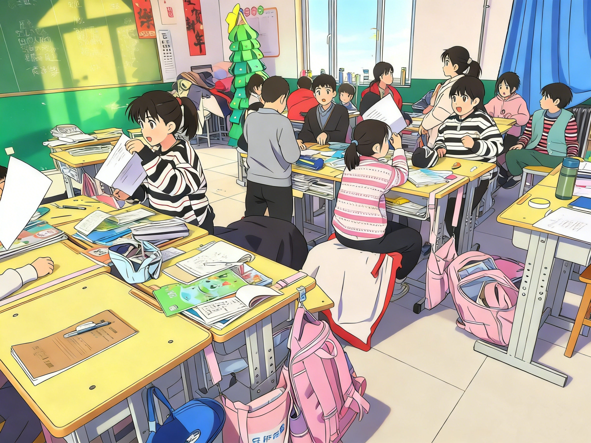
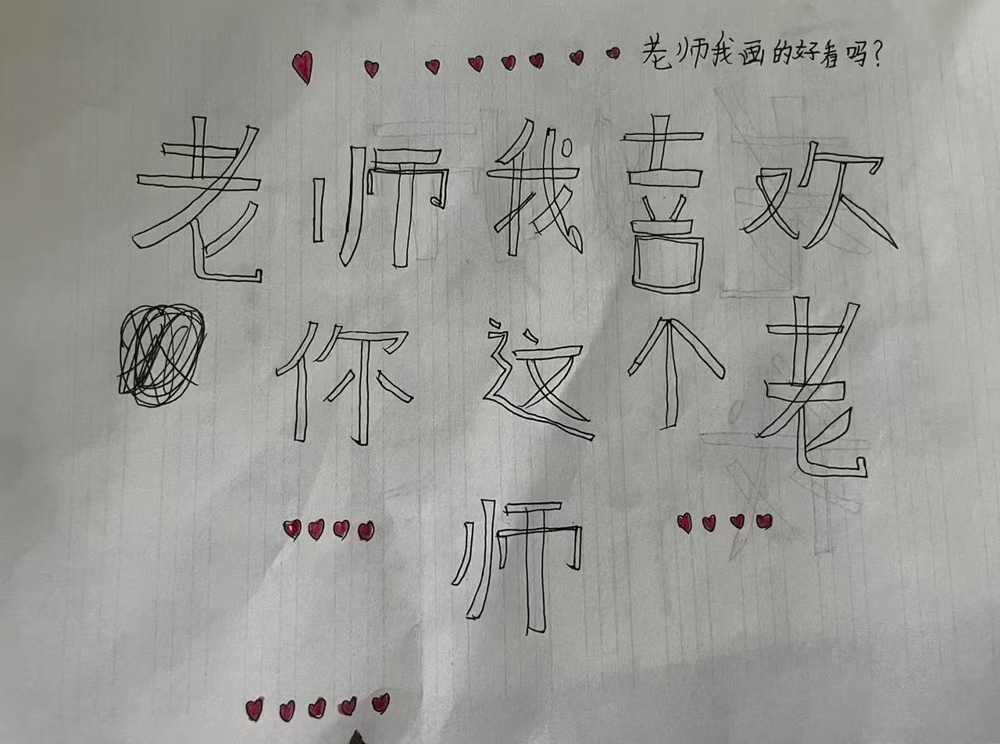

# Bỏ lương cao, thầy giáo nông thôn cùng học sinh "dùng AI đuổi ruồi"

👨‍🏫

::: tip 📖 Story này từ Trung Quốc
Câu chuyện của thầy Hạo — giáo viên thỉnh giảng vùng nông thôn Trung Quốc. Bỏ job operation lương cao về quê dạy lớp 3, rồi cùng học sinh tiểu học **viết phần mềm thật** để giải bài toán "ruồi đậu vào màn hình cảm ứng làm gián đoạn tiết học". **Story chứng minh: Vibe Coding không giới hạn tuổi tác, kể cả học sinh lớp 3 cũng làm được product có user thật.**
:::

**Người kể: thầy Hạo, giáo viên tiểu học**

---

## 01 Bỏ phố về quê: "thế giới của các em quá nhỏ"

> *"Điều kiện ở làng có hạn, các em khó có cơ hội nhìn ra thế giới bên ngoài. Thế giới của các em rất nhỏ — nhỏ tới chỉ còn cuốn sách giáo khoa cũ và bùn đất dưới chân."*

Thầy Hạo từng làm operation, phân tích dữ liệu kinh doanh, code cũng biết — thu nhập tháng cả vạn. Trong mắt người xung quanh, chàng trai trẻ thoát ly nông thôn này được xem là **"ổn"**.

Nhưng anh **bỏ job đáng ngưỡng mộ, về quê dạy lớp 3** — chỉ để dẫn các em vùng nông thôn nhìn thấy thế giới rộng hơn.

Anh muốn cho các em thấy: trên đời có thứ tên là **"trí tuệ nhân tạo"** — nó biết vẽ, biết làm thơ, còn trả lời được mọi câu hỏi vu vơ trong đầu các em.

## 02 Khi AI lần đầu xuất hiện trong lớp học

Đẩy chuyện này không suôn sẻ. Lúc đầu muốn cho các em mang điện thoại tới trường tiếp xúc AI — ý này bị lãnh đạo trường phản đối quyết liệt:

> *"Bạn để các em chép đáp án à! Không đúng việc!"*

Anh không bỏ cuộc. Cứ 3 ngày 2 buổi nghĩ cách thuyết phục. Cuối cùng cả hai lùi một bước:

::: tip 🎯 Thoả thuận đạt được
- ✅ Học AI được
- ❌ Không vi phạm quy định trường
- ❌ Học sinh **không tự mang điện thoại** vào lớp
:::

Vậy là **thầy Hạo tự bỏ tiền túi**, mua vài điện thoại cũ second-hand, đăng nhập tài khoản AI chatbot của mình lên cho các em dùng (tương đương VN: ChatGPT, Claude, Gemini, hoặc DeepSeek free tier).

Các em lần đầu chạm vào **"công nghệ cao"**. Nhanh chóng học:

- 🔍 Search tài liệu
- 💃 Học múa qua AI
- 🎨 Chơi text-to-image

AI lần đầu **mở cánh cửa thế giới mới** cho các em.

## 03 "Đặc sản" lớp học nông thôn: ruồi và chạm nhầm

Lớp học giờ có **màn hình điện tử đa phương tiện** — nâng đáng kể hiệu suất giảng dạy. Nhưng có một pain không ai giải:

> 🪰 **Ruồi.**

Màn hình nóng và phát sáng → ruồi đặc biệt thích đậu vào. Màn hình không phân biệt được:

| Thao tác | Phản ứng màn |
|------|------|
| Tay thầy chạm | Đúng ý |
| Ruồi đậu | Chạm nhầm, slide nhảy lung tung |
| Ruồi đi qua | Video pause |
| Ruồi đông | Tắt máy giữa chừng |

Một tiết 40 phút, mất 20 phút trên bục **đuổi ruồi**. Lớp học ngon lành bị xé vụn.

Đột nhiên một hôm, một em **giơ tay**:

> *"Thầy ơi, mình có thể cùng làm một chương trình, 'nhốt' ruồi ở ngoài được không?"*

## 04 Trận chiến với ruồi: "chat" với AI để thắng

Cùng học sinh lớp 3 viết chương trình **chống chạm nhầm yêu cầu kỹ thuật cao** — trước đây không dám nghĩ tới. Nhưng giờ khác rồi: **có AI hỗ trợ, mọi thứ thành khả thi**.

Đúng lúc có một bộ tutorial **Vibe Coding miễn phí**. Thầy Hạo cùng các em "chơi" luôn:

- 👦 **Các em đưa idea**
- 👨‍🏫 **Thầy phụ trách "phiên dịch"** — đút lời các em vào AI
- 🤖 **AI chặn các "chướng ngại"** như pointer, handle, message queue tầng đáy

Các em hỏi rất hay:

> 🧒 *"Ơ, máy tính có thể phân biệt được giờ chuột đang bấm hay màn hình đang tự nhảy không?"*

> 🧒 *"Có thể cho màn hình một 'lớp phủ trong suốt' không — ruồi đậu vào không phản ứng, nhưng tôi dùng chuột vẫn thao tác được?"*

**Trúng trọng điểm!** AI giải thích:
- Phải phân biệt `RawInput`
- Phải nhận diện `ExtraInfo`

Các em không hiểu thuật ngữ, nhưng qua **quan sát data + thảo luận nhóm**, phát hiện giá trị `ExtraInfo` của input khác nhau đúng là khác nhau.

Cứ vậy, **thầy Hạo và các em "chat" với AI** cứng đầu ra **"Khoá chạm phiên bản lớp 3"**. Nguyên lý đơn giản:

> Qua nhận diện đặc trưng tín hiệu input → chính xác chặn tín hiệu chạm của màn hình → chỉ giữ thao tác chuột.

**Result**: dù ruồi mở party trên màn hình thế nào, slide vẫn **vững như Thái Sơn**. 🪰❌

Phần mềm này không phải product thương mại cao siêu, nhưng **thật sự giải quyết pain thực** trong lớp học nông thôn. Quan trọng hơn:

> *"Lần đầu các em tham gia sáng tạo, lần đầu dùng công nghệ trả lời vấn đề cuộc sống."*

## 05 Từ viết 1 dòng code tới gõ 1 cánh cửa

Ấn tượng sâu nhất của thầy Hạo là **ngày Tết Dương lịch**. Anh hỏi AI:

> *"Làm sao đưa các em qua một ngày lễ có ý nghĩa?"*

AI không gợi ý mở tiệc, không gợi ý biểu diễn. Mà nói:

> *"Thay vì hoan hỷ trong lớp, hãy đến thăm các cụ neo đơn trong làng."*

Vậy là anh thật sự dẫn các em đến thăm **một cụ ông sống một mình thuộc diện hộ bảo trợ**. Khi tới, cụ đang ngồi trên ghế gỗ cũ ăn trưa, trên bàn chỉ có:

- 🍜 1 bát mì luộc nước trắng
- 🥒 1 đĩa dưa muối

Lòng thầy Hạo se lại, hối hận không mang thêm đồ ăn. Vài em **thường ngày nghịch ngợm nhất** cũng tỏ ra ngoan hơn bình thường, còn ngồi nói chuyện với cụ.

Rời đi xong, vài em kéo vạt áo thầy Hạo, mắt đỏ hoe:

> *"Thầy ơi, sau này mình tới giúp cụ thường xuyên nhé."*

Đường về hôm đó gió lạnh tạt vào mặt rát buốt, nhưng **lòng anh ấm áp**.

::: tip 💡 Insight thầy Hạo
> *"Giáo dục không chỉ dạy kiến thức sách vở, còn phải dạy lòng người.*
>
> *Câu trả lời AI đưa ra không bao giờ chỉ là công nghệ — mà còn là trái tim được nó thắp lên, muốn sưởi ấm người khác."*
:::

## 06 Vài lời tâm sự của thầy Hạo

Thu hoạch lớn nhất không phải **bản thân phần mềm** — mà là **ánh sáng trong mắt các em**.

Trước đây các em nghĩ:
- ❌ "Máy tính là đồ chơi của trẻ con thành phố"
- ❌ "Lập trình là việc của thiên tài"
- ❌ "Không liên quan gì mình"

Giờ các em biết:
- ✅ "Chỉ cần có ý, dám nghĩ, biết 'nói' → đều có thể qua AI thay đổi cuộc sống"

Em **đề xuất làm phần mềm** — trước đây nghịch nhất — giờ học **chăm chú nhất**. Vì em biết, thứ em tham gia tạo ra đang giúp mọi người giải quyết vấn đề.

> **Sự tự tin "tôi cũng làm được" này quý hơn được điểm 10.**

Anh thật thà thừa nhận: việc dẫn các em dùng điện thoại, làm AI, không ít lần **bị phê bình**, không ít lần **nghe lời ra tiếng vào**. Nhiều người nói anh không đúng việc, làm hư phong khí.

Nhưng nhìn các em vì AI mà **tò mò hơn, tốt bụng hơn** — anh thấy mọi thứ đều xứng đáng.

## 07 Viết ở cuối

Thầy Hạo chân thành kêu gọi mọi người quan tâm hơn đến **lớp học AI điện tử hoá thật sự có thể triển khai trong giáo dục công lập**.

> *"Thế giới nhỏ của các em nông thôn thực ra càng cần AI hỗ trợ. AI không chỉ là công cụ, mà còn là cánh cửa giúp các em kết nối với thế giới rộng lớn."*

---

::: tip 🇻🇳 Giáo viên / sinh viên Việt Nam có thể học gì?

**1. Vibe Coding cho giáo dục VN — context phù hợp**
- VN có **17.000+ trường học vùng sâu vùng xa** với pain tương tự (thiết bị cũ, thiếu IT teacher)
- Bộ GD&ĐT đang push **chuyển đổi số giáo dục** — Vibe Coding là cánh tay rất gọn

**2. Stack VN-friendly 2026 cho giáo viên zero-code**

| Tool | Use |
|------|------|
| **ChatGPT, Claude, Gemini** | AI chatbot phổ thông |
| **Bolt.new, Lovable, v0** | Vibe Coding tạo web app trong vài phút |
| **Replit** | Code online + AI assist, free tier đủ học |
| **Google Colab** | Python notebook miễn phí cho học sinh |
| **Trae, Cursor, Windsurf** | IDE AI cho lớp lập trình nâng cao |

**3. Use case áp dụng cho lớp học VN**
- 📚 **Quiz/trắc nghiệm tự động** — AI gen câu hỏi theo SGK
- 📊 **Báo cáo điểm danh, điểm số** tự động (Google Sheet + ChatGPT)
- 🎨 **Học sinh tự làm web giới thiệu lớp / đề tài STEM**
- 🎮 **Game học từ vựng / lịch sử / địa lý VN** do học sinh code

**4. Bài học cốt lõi từ thầy Hạo**

::: warning 🎯 3 thông điệp cho giáo viên VN
> **1. Pain nhỏ trong lớp = idea tốt cho Vibe Coding**
> Đừng chờ "vấn đề lớn". Ruồi đậu màn hình = pain đủ để làm 1 phần mềm thật.
>
> **2. Học sinh là co-creator, không phải audience**
> Thầy "phiên dịch" — học sinh đưa idea. Đảo ngược: thầy không cần code giỏi, chỉ cần biết dẫn dắt.
>
> **3. Giáo dục lòng người > giáo dục kỹ thuật**
> AI gợi ý đi thăm cụ neo đơn → bài học thật. Tech là phương tiện, không phải mục đích.
:::

**5. Cộng đồng dev giáo dục VN có thể kết nối**
- **MicroSoft Innovative Educator (MIE)** chapter Việt Nam
- **Google Educator Group (GEG)** VN — chia sẻ tools giáo dục
- **STEMHero, Code.org** — curriculum sẵn cho học sinh tiểu học
:::
