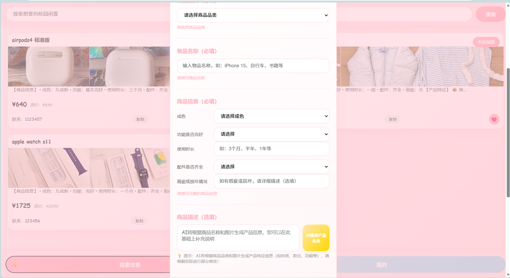

# Tuần thi cuối kỳ, sinh viên năm 2 lén dùng AI tạo "Chợ trời sinh viên"

<p style="font-size: 52px; line-height: 1; margin: 0 0 12px;">🎓</p>

::: tip 📖 Story này từ Trung Quốc
Câu chuyện một sinh viên năm 2 ở Trung Quốc — vừa ôn thi cuối kỳ, vừa làm ra **demo platform giao dịch second-hand trong trường** chỉ trong vài tuần. Nhân vật phụ "anh Lư" (master coder) build website chat AI **trong 3 giờ**. **Story chứng minh: ngưỡng "sáng tạo product" với AI thấp hơn bạn tưởng — kể cả sinh viên không nền tảng IT.**
:::

**Người kể: một sinh viên năm 2**

---

## 01 "Kỳ tích 3 giờ" của anh Lư — và CPU của tôi muốn cháy

> 💬 *"Giúp tôi test, chat với nó tí đi."*
>
> 💬 *"Giỏi quá, gần thi rồi vẫn thức gõ code, ôn bài đi chứ."*
>
> 💬 *"Chỉ mất 3 giờ thôi."*

**Tuần thi cuối kỳ tháng 1/2026**. Tôi đang ôn bài, đột nhiên nhận được link từ tech master **anh Lư**.

Là một website chat AI — trong đó có **lịch, theo dõi phim, đầy đủ chức năng** — UI cũng có dáng dấp ngon lành.

**3 giờ?** Tôi nhìn màn hình, cảm thấy CPU sắp cháy. Tốc độ của master này lại làm mới nhận thức của tôi.

Anh ấy lại gửi tiếp một đống tài liệu — mở ra:

> *"Từng chữ tôi đều biết, ghép lại thành sách trời."*

Muốn hỏi nhưng sợ lộ "gà". Nên chỉ có thể:

| Step | Action |
|------|------|
| 1 | Anh ấy ném thuật ngữ |
| 2 | Tôi âm thầm copy cho AI (ChatGPT/Claude) |
| 3 | Đợi AI giải thích |
| 4 | Cẩn thận trả lời lại |

→ Học của tôi từ **"người truyền người"** thành **"người ↔ AI ↔ người"**.


## 02 Vào group ngày đầu, tôi chọn im lặng

Tháng 1, nhóm học chung khởi động. Anh Lư kéo tôi vào group học lớn. **Mở màn: self-introduction.**

- *"Nhiều năm kinh nghiệm dev"*
- *"Đang làm ở big tech"*
- *"Founder startup AI"*

Nhìn intro người khác, ngón tay tôi dừng vài giây trên bàn phím, cuối cùng **xoá luôn 2 dòng vừa gõ**.

Trong lòng âm thầm thở dài:

> *"Haiz, cao thủ ra chiêu, ngu thì im đi cho lành."*

Sau tôi cùng anh Lư + 1 bạn mới quen **lập team 3 người**, group nhỏ — trạng thái tôi cuối cùng cũng thả lỏng.

::: tip 🌱 Không khí khác trường ĐH thường
- ❌ Không ai quan tâm bạn bao tuổi, làm nghề gì, giỏi hay không
- ✅ Gặp vấn đề → trao đổi bình đẳng, cùng mò ra
- ✅ Không bị label định, chỉ vì sở thích cùng tiến
:::

> *"Cảm giác này ở trường tôi ít gặp."*


## 03 Tuần thi "trốn việc" lại học hăng hơn

Đợt học này, cảm giác **căng thẳng và lo âu giảm nhiều**.

Chuẩn bị thi cuối kỳ, dù tiến độ check-in hơi chậm, cũng không ai giục, trách — **mọi thứ tự mình chịu trách nhiệm với mình**.

Khác với không khí học đáp án chuẩn ở cấp 3 và đại học VN nói chung, **cảm giác tự do này lại khiến tôi có động lực hơn**.

> *"Task check-in mỗi ngày như đánh quái lên cấp."*

→ Học chủ động hơn, học được nhiều hơn.


## 04 Nóng đầu, tự đào cho mình một "hố lớn"

Chớp mắt nghỉ đông sắp đến, đợt học gần kết. **Trước livestream tốt nghiệp**, thầy hỏi tôi có muốn demo một sản phẩm không.

> *"Có!"*

Tôi gần như phản xạ trả lời — dù chưa nghĩ làm gì.

Lướt thông tin **bán đồ second-hand trong group ký túc xá**, tôi đột nhiên có gợi ý:

::: tip 💡 Pain spotted
Giao dịch second-hand trong trường luôn **nằm rải rác** trong các group chat tạm thời.
- ❌ Mua bán hẹn thẳng ở ký túc / căng-tin
- ❌ Ít ai dùng platform second-hand chính thống (tương đương VN: **Chợ Tốt, Facebook Marketplace**)
- ❌ Không có "scope trường" → tìm kiếm khó

Vậy nếu có 1 platform **chỉ thuộc về trường**?
- ✅ Hiển thị chính xác đồ second-hand trong trường mình / các trường gần
- ✅ Tự nhiên thêm 1 layer **tin tưởng** (cùng sinh viên)
- ✅ Giảm lo bị lừa cho người dùng
:::

Nói là làm. Tôi bắt đầu **product design AI đầu tiên đời mình**.

### Page design khá mượt

```
[Search bar ────────────────────]
[Item grid ─── browse]
[─ Của tôi ─][─ Tôi muốn bán ─]
```

Đơn giản, trực tiếp.

### Việc đau đầu: chức năng AI thêm ở đâu?

| Idea | Status | Lý do bỏ |
|------|------|------|
| AI recommendation kiểu shopping | ❌ Bỏ | "Tỉ lệ giá-trị" không đo thống nhất |
| AI scoring | ❌ Bỏ | Không trụ vững |
| ... | ❌ | Hướng kẹt hẳn |

Cho đến khi tôi nói chuyện với 1 bạn **fan đồ điện tử**, anh ấy chỉ một câu thức tỉnh tôi:

> *"Mọi người bán đồ second-hand chỉ viết dùng bao lâu, có khuyết điểm ở đâu, có function gì — không viết params như merchant. Có AI giúp người mua mới hiểu rõ item, đỡ phải tra tài liệu khắp nơi thì sao?"*

**Lập tức hướng rõ:**

- 🤖 **AI thêm mô tả item** (parse từ ảnh + tên model → spec đầy đủ)
- 💰 **Smart pricing** (đề xuất giá hợp lý theo market data)



## 05 Trong livestream làm "học sinh kém", nhưng nhận được công nhận quý nhất

Tác phẩm tôi tốn nhiều tâm huyết cuối cùng cũng xong **trước livestream**. Nhưng càng gần lúc demo, tôi càng hồi hộp.

Các tác phẩm demo trước tôi rất tinh xảo, interaction một cái mượt hơn một cái. Vốn trước thi đầy tự tin, đến lúc thật sự lên thì, lòng chỉ còn 1 câu:

> *"Phải cho phép học sinh kém tồn tại chứ."*

Vậy là tôi hít sâu, **dũng cảm và bất an** kể xong demo của mình.

Sau khi trình bày, đầu tôi nổ ra chuỗi tự phủ định:
- 😞 Câu hỏi tôi nêu rất ngu
- 😞 Tác phẩm tôi không hoàn hảo
- 😞 Idea tôi nhàm chán
- 😞 Nhiều chỗ chưa thực hiện

**Không ngờ** — các thầy tại chỗ không những không phủ định, mà còn cho **nhiều gợi ý cụ thể có thể landed**.

::: tip 🌟 Khoảnh khắc thức tỉnh
> *"Hoá ra **không hoàn hảo cũng được đối xử nghiêm túc**.*
>
> *Cơ hội yên tâm demo một tác phẩm chưa trưởng thành thế này, trước đây gần như không có."*
:::


## 06 Tôi nhận được nhiều hơn 1 Demo

Qua đợt học này, **năng lực giải quyết vấn đề thực** của tôi thật sự được kéo lên.

### 🚀 Hiệu suất học tăng

Tôi học cách **tự build tool nhỏ**:
- 📅 Lịch AI cá nhân
- 📝 Blog cá nhân
- 🎯 Habit tracker
- 📚 Flashcard học từ vựng

### 🔄 Cách học cũng đổi

- ❌ Trước: ngấu nghiến tutorial dày
- ✅ Sau: **tự tay design project nhỏ, học trong khi làm**

> *"Không biết code không sao, AI có thể viết.*
>
> *Gặp vấn đề hỏi thẳng AI:*
> - *'Chuỗi này nghĩa gì?'*
> - *'Dùng kiến thức gì?'*
> - *'Error này fix sao?'"*

### 💡 Insight cuối

Có AI IDE rồi, **bức tường cao giữa "nghĩ" và "làm" như thấp xuống**.

Dù không có nền lập trình chắc, tôi cũng có thể **từng chút biến ý trong đầu thành hiện thực** — thấy product không ngừng iterate.

Cảm giác thành tựu trong lòng là **thật**.

> *"Trải nghiệm này khiến tôi tin rằng: **ngưỡng sáng tạo có thể thật sự không cao như tưởng.**"*

---

## 🎥 Watch & Learn — 3 video về student founder

<ChapterVideos :videos="[
  { id: 'oFtjKbXKqbg', title: 'Pieter Levels: Programming, Viral AI Startups (Lex Fridman #440)', channel: 'Lex Fridman', duration: '3:55:00', why: 'Pieter ship 40+ startup một mình. \'12 startups in 12 months\' — anh Lư build 3 giờ cũng là cùng spirit.' },
  { id: '7BX8Mt7K10c', title: 'How Pieter Levels Went from Failed Web Business to $3M/yr', channel: 'Starter Story', duration: '30:00', why: 'Case study build sản phẩm trong vài giờ và ship ngay — model giống \'Chợ trời\' 3 giờ.' },
  { id: '8AWEPx5cHWQ', title: 'Cursor Vibe Coding Tutorial — For COMPLETE Beginners', channel: 'Riley Brown', duration: '250:00', why: '4 project full thực hành — đủ cho sinh viên năm 2 follow từng bước build marketplace.' }
]" />

---

## 🔬 6 Bài học & Technique từ sinh viên năm 2

::: tip 🎯 Apply cho student founder VN

**1. ⏱️ Ship-in-3-hours rule**
- Build MVP trong khung thời gian cố định, không scope creep
- Apply VN: tuần thi vẫn ship được nếu rút brief xuống 1 màn hình + 1 luồng chính

**2. 🤖 AI item description as feature**
- Chụp 1 ảnh → AI gen tiêu đề + mô tả + giá đề xuất
- Prompt template: "category, condition, expected lifespan, comparable price"
- Apply VN: campus có thể plug GPT-4o-mini + nhận ảnh từ Zalo

**3. 🎯 Niche down (campus only)**
- UniYard chỉ phục vụ UO students; StudiFlip chỉ Purdue
- Apply VN: bot Chợ trời chỉ cho 1 trường (BK, KTQD, ĐHQG) → trust + viral nội bộ

**4. 👤 Solo founder + AI = team of 5**
- Sahil Lavingia (Gumroad) ship feature từ Slack → production vài phút, **41% commit do AI agent viết**
- Apply VN: sinh viên không cần co-founder dev, chỉ cần Cursor + Lovable

**5. ✅ Validation TRƯỚC feature**
- Build landing page + form chờ trước khi viết DB
- Tony Dinh (VN) ship Typing Mind vài giờ sau ChatGPT launch
- Apply VN: post lên group lớp trước, đo response, rồi build

**6. 📣 Distribution > product**
- Marc Lou: "marketing is the engine"
- Pieter Levels có 600K followers TRƯỚC khi launch Photo AI
- Apply VN: sinh viên build audience TikTok/Threads song song product
:::

---

## 📚 More Similar Stories (2025-2026)

### Case A: UniYard — University of Oregon (2025)

| Item | Detail |
|------|------|
| Founders | 3 sinh viên business — Cedric Roberge, Arlo Snodgrass + 1 co-founder |
| Stack | AI-assisted no-code, **3 tuần build site** |
| Result | Hàng trăm sinh viên UO đang dùng |
| Plan | Mở rộng Oregon State, Washington |
| Quote | *"I primarily used AI to help build the site."* |

> Source: [Daily Emerald](https://dailyemerald.com/174492/news/uo-students-leverage-ai-to-create-college-marketplace)

### Case B: StudiFlip — Purdue (2025)

| Item | Detail |
|------|------|
| Background | Purdue alum tạo marketplace seniors → freshmen |
| Stack | Campus-only marketplace + safe-exchange features |
| Result | Niche tightly scoped — chỉ 1 trường ĐH |

> Source: [Purdue Exponent](https://purdueexponent.org/campus/purdue-alum-launches-studiflip)

### Case C: 🇻🇳 Tony Dinh — Typing Mind (Việt Nam → global)

| Item | Số |
|------|------|
| Background | Dev Việt 32 tuổi rời job → indie hacker |
| Stack | ChatGPT wrapper + Stripe |
| TypingMind MRR | **$45K** |
| Portfolio MRR | **$140K/tháng** |
| Black Magic sold | **$128K** |
| Xnapper sold | **$150K** |
| Quote | *"Tony ships before it embarrasses him too much."* |

> Source: [Starter Story](https://starterstory.com/typingmind-breakdown) | [Medium](https://medium.com/@yumaueno/tony-dinh-the-legendary-vietnamese-developer)

---

## 🛠️ Tools 2026 cho student founder

| Tool | Cost | Use case |
|------|------|------|
| **Lovable** | $25/tháng Pro | Build marketplace UI + auth + DB trong 1 prompt. Q2 2026: visual editor + GitHub export |
| **Cursor Pro** | $20/tháng | Refine code Lovable export, add real Stripe checkout |
| **Supabase** | Free tier (500 user) | DB + auth + storage cho ảnh sản phẩm |
| **Vercel** | Free hobby | Deploy Next.js marketplace |
| **Stripe Checkout** | 2.9% + $0.30 | Payment cho global; VN dùng Stripe Atlas hoặc VNPay/MoMo |
| **GPT-4o-mini API** | $0.15/1M input tokens | AI item description generator |
| **YC Early Decision (2025)** | Free apply | Defer đến sau khi tốt nghiệp. Apply nếu MVP có traction |

---

::: tip 🇻🇳 Sinh viên Việt Nam có thể học gì?

**1. VN có pain tương tự — opportunity tương tự**

| Pain trong trường ĐH VN | Idea Vibe Coding |
|------|------|
| Group chat ký túc bán đồ rải rác | Mini app "Chợ trời ĐH X" |
| Tìm bạn cùng học / cùng môn | Study buddy matching app |
| Đặt phòng tự học / mượn sách | Mini program booking |
| Tổng hợp đề thi cũ scattered | Đề thi DB + AI search |
| Tìm phòng trọ gần trường | "Trọ ĐH X" với AI Q&A |

**2. Stack cho sinh viên VN 2026 — free tier đủ làm full app**

| Layer | Tool | Free tier |
|------|------|------|
| **AI IDE** | Cursor, Windsurf, Trae, Claude Code | Free tier rộng rãi |
| **No-code Vibe Coding** | Bolt.new, Lovable, v0, Replit | Free credits đủ làm 1-2 app |
| **Backend** | Supabase, Firebase, Pocketbase | Free tier đủ cho dưới 1000 user |
| **Auth** | Clerk, Supabase Auth, NextAuth | Setup 5 phút |
| **Deploy** | Vercel, Netlify, Cloudflare Pages | Zero-cost |
| **Domain** | `.io.vn`, `.id.vn` từ Mat Bao | ~50k VND/năm |

**3. VN-specific: nơi launch sản phẩm sinh viên**

- 📱 **Facebook group trường** (DTU, HUST, FTU, RMIT confessions) — viral hơn
- 💬 **Zalo group** môn học / ký túc
- 🎓 **TikTok #sinhvienVN** — đăng demo build product trong 7 ngày
- 🌐 **F8 community, Hoidanit, Bytecode VN** — chia sẻ tech

**4. Bài học cốt lõi từ story này**

::: warning 💪 4 thông điệp cho sinh viên VN
> **1. "Ngu thì im đi" là tâm lý sai**
> Ai cũng từng "ngu". Im chỉ làm bạn ngu lâu hơn. Hỏi đi.
>
> **2. AI = bộ phiên dịch "thuật ngữ → người thường"**
> Đừng giả vờ hiểu. Copy paste vào ChatGPT/Claude. Hỏi đến khi hiểu thật.
>
> **3. Pain bạn thấy hằng ngày = idea startup**
> Group chat bán đồ ký túc = "Chợ trời sinh viên". Pain càng nhỏ, càng dễ landed.
>
> **4. Demo "học sinh kém" vẫn có giá trị**
> Không cần hoàn hảo. Cần thật. Người nghiêm túc sẽ cho feedback nghiêm túc.
:::

**5. Startup sinh viên VN đáng follow**
- **Got It** (xếp hàng nhà hàng) — bắt đầu từ Stanford sinh viên VN
- **Base.vn** (HR SaaS) — co-founder từng là sinh viên FPT
- **Coc Coc** team có nhiều ex-sinh viên BK
- **Sky Mavis (Axie Infinity)** — đội VN-Norwegian, nhiều người vào ngành lúc còn ĐH

**6. Trường có cộng đồng dev mạnh ở VN**
- 🏫 **HUST, UET-VNU, BK-HCM**: nhiều CLB lập trình
- 🏫 **FPT, RMIT**: practical, dễ launch product
- 🏫 **NEU, FTU**: business + tech combo, hợp founder/PM track
:::
