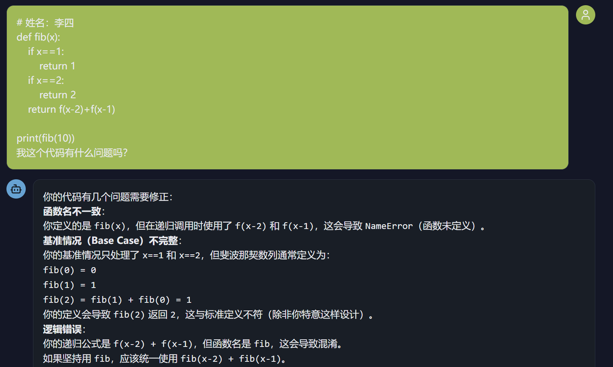
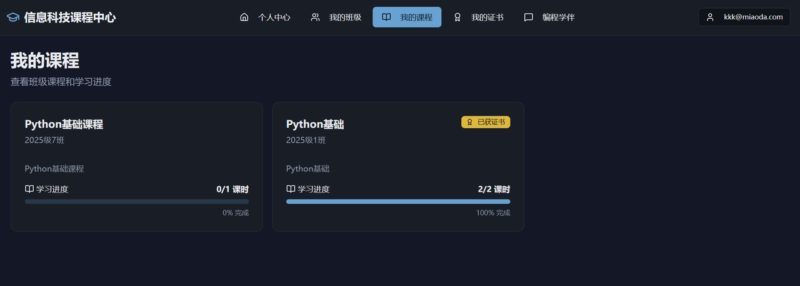
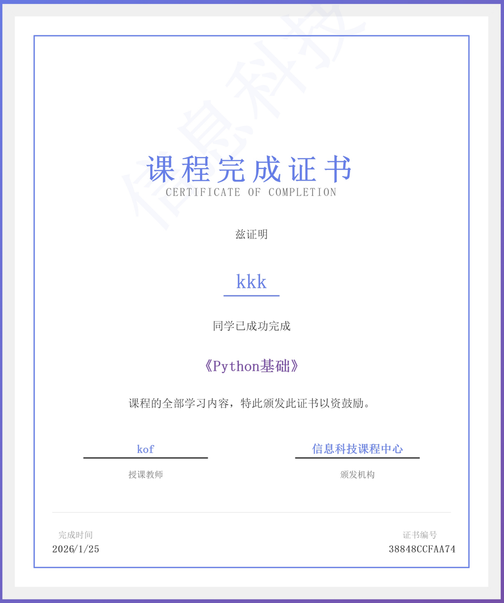

# Tôi làm cho mỗi học sinh một "bạn cùng bàn học bá" không biết mệt

🧑‍🏫

::: tip 📖 Story này từ Trung Quốc
Câu chuyện của một giáo viên Tin học cấp 3 ở Thạch Gia Trang — bị "50 HS giơ tay cùng lúc" đẩy tới quyết định **tự build AI assistant cho lớp**. Pain "1 thầy 50 trò" này ở VN giáo viên Tin học chắc chắn cũng quen.
:::

**Người kể: một giáo viên Tin học cấp 3**

---

Tôi là giáo viên Tin học cấp 3, đồng thời là Chủ nhiệm Trung tâm Thông tin trường, và là một trong các "AIGC seed teacher" của thành phố. Các danh hiệu này nghe sang chảnh, nhưng đơn giản là làm 3 việc:

- 🎓 Bồi dưỡng nhân tài cho đất nước
- 💼 Giảm tải cho giáo viên
- 📈 Nâng hiệu suất giảng dạy

Vì vậy việc tôi học AI, suy nghĩ ứng dụng — vừa là yêu cầu công việc, vừa là sở thích cá nhân. Nhưng **thứ thật sự khiến tôi quyết tâm làm gì đó** là môn thực hành Python tôi phụ trách.

## 01 Tiết Python suýt "nhấn chìm" tôi

Môn lập trình Python tôi dạy không phức tạp. Học sinh chỉ cần viết chương trình **tính BMI**: nhập chiều cao, cân nặng, đánh giá béo gầy, output kết quả.

Nhưng với học sinh không có nền lập trình, tiếp xúc lĩnh vực hoàn toàn mới và hiểu rule vận hành **rất khó**.

Nhiều khi điều thầy giảng và điều học sinh hiểu cách xa. Nội dung đã giảng vẫn bị học sinh hỏi lặp lại. Task vừa giao, một lát sau bốn phương tám hướng đều tay giơ:

> *"Thầy ơi thầy ơi thầy ơi!"*

Cảm giác như đứng giữa chợ rau, mỗi sạp đều gọi bạn.

**50 học sinh, 1 thầy.** Mỗi em kẹt ở điểm khác:
- Em A không hiểu `input()` làm gì
- Em B không biết viết `if` thế nào
- Em C hoàn toàn không hiểu chuyển đổi data type

Tiết 45 phút, tôi như công nhân vặn ốc không ngừng — **bên này vừa vặn chặt 1 con, quay đầu thấy bên kia 3 con đã lỏng**.

Tuy không dừng tay phút nào, học sinh giơ tay không bớt. Có em đợi vài phút không tới lượt, tự nghịch máy. Có em đơn giản nằm úp xuống ngủ.

Khi tiếng chuông tan tiết vang lên, tôi đứng giữa phòng máy, nhìn cảnh hỗn loạn, đột nhiên thấy **bất lực vô cùng**.

Không phải lỗi học sinh — các em đã cố. Cũng không phải tôi dạy không tốt — mà **bản thân mô hình này có vấn đề**.

> **Lập trình không phải Toán** — không thể giảng chung mọi vấn đề cho cả lớp. Phải chỉ từng người.

## 02 Cho mỗi học sinh một "bạn học bá" không biết mệt

Tối hôm đó tôi mất ngủ. Không phải lo âu — mà nghĩ một vấn đề:

> *"Nếu mỗi học sinh đều có 1 'trợ giảng' trả lời thắc mắc bất cứ lúc nào, sẽ ra sao?"*

Trợ giảng này **không cho đáp án trực tiếp**, chỉ cần nói cho em:
- "Chỗ này sai"
- "Function này dùng thế này"
- "Đổi cách nghĩ thử xem"

Như khi đi học, người ngồi cạnh là học bá. Bạn kẹt, hỏi 1 câu, anh ấy gợi ý 1 cái → rồi bạn tự giải được.

Nghĩ tới đây, tôi đột nhiên nhận ra: **AI có thể trở thành "bạn cùng bàn học bá" này.**

Các tool AI lập trình hiện có (như Cursor, Copilot) **cho đáp án trực tiếp**, nhưng chưa làm được guide học thật sự. Nên tôi quyết tự làm 1 app mới — AI assistant biết dạy, biết guide, biết đồng hành để học sinh **nghĩ rõ vấn đề**.

## 03 Từ ước mơ tới hiện thực: bạn học lập trình

Tôi từng chỉ viết vài phần mềm đơn giản, chưa đụng dev app phức tạp thế này. Càng không có kinh nghiệm "dev app tích hợp AI" — ban đầu trong lòng rất không chắc.

Từ lúc đó, tôi — **"giáo viên biết dạy nhưng không biết làm product phức tạp"** — lần đầu thật sự đưa ý trong đầu chạy được, thành app dùng được.

Thời gian đó tôi liên tục 5 tối check-in học theo khoá. **Khó nhất khi dev không phải viết code**, mà tìm AI API:
- Platform nào free?
- Cái nào tốc độ nhanh?
- Cái nào hợp kịch bản giáo dục?

→ Đều phải thử từng cái.

Tôi vẫn nhớ lần đầu integrate AI vào app, nhập "function input dùng thế nào", thấy nó thật sự return code mẫu + giải thích — sự phấn khích và an ủi đó tới giờ còn nhớ.

Tôi đặt tên app này **"Trung tâm Khoá Tin học"**, module core là **"Bạn học lập trình"**.

Nó làm được 3 việc:

**1. 📚 Hỏi đáp kiến thức nền**
Học sinh hỏi "viết for loop thế nào", "list dùng sao" → bạn học trực tiếp đưa cách dùng và code mẫu. Vì là kiến thức nền, không phải đề bài tập.

**2. 🧭 Guide đề bài tập**
Học sinh cầm đề thầy giao tới hỏi → bạn học **không đưa code đầy đủ**, mà dùng câu hỏi kiểu **Socratic** từng bước guide em tự nghĩ ra.

**3. 🔍 Code review**
Học sinh dán code mình viết lên → bạn học **chỉ ra vấn đề ở đâu**, nhưng không trực tiếp sửa hộ.

::: tip 💡 Vì sao design thế này?
Vì mục đích học không phải **"hoàn thành bài tập"**, mà **"học giải quyết vấn đề"**.

Nếu AI cho đáp án trực tiếp → học sinh chỉ copy paste, bề mặt giao bài, thực chất không học gì.

→ Đây cũng là pain của Cursor, Copilot trong trường học: **quá giỏi → học sinh phụ thuộc**.
:::

## 04 Bài tập và ghi chép thành phiền mới

Sau khi làm xong phần mềm, tôi tự test, thấy ổn. Đồng nghiệp xem cũng nói:

> *"Cái này quá hay, giải quyết pain của chúng ta."*

Nhưng tuần đầu sau khai giảng, **vấn đề mới tới**: học sinh trên lớp dùng Bạn học lập trình giải xong vấn đề, **rồi bài tập nộp đâu?**

Trước chúng tôi dùng phần mềm lớp học truyền thống (ở VN tương đương: Google Classroom, MS Teams Education) — học sinh nộp ở phòng máy, tôi thu trên máy giáo viên.

Nhưng hệ thống này có **vấn đề chí mạng**: chỉ dùng trong phòng máy, tan tiết là đứt. Học sinh ngoài phòng máy:
- ❌ Không thể tiếp tục làm bài
- ❌ Không thể xem lại lịch sử học

Vậy là tôi lại tốn vài tối, thêm cả bộ hệ thống quản lý lớp và khoá cho "Bạn học lập trình":

- ✅ Giáo viên tạo được lớp và khoá
- ✅ Học sinh join lớp xong thấy được mọi nội dung khoá và bài tập
- ✅ Trên lớp chưa xong, sau tiết vẫn làm tiếp, nộp tiếp
- ✅ Giáo viên chấm bài sau tiết, không đạt thì trả lại làm lại
- ✅ Khi học sinh qua mọi bài tập của 1 khoá, hệ thống tự gửi **certificate hoàn thành khoá**

"Certificate" này tôi cố ý thêm. Vì tôi biết: với học sinh cấp 3, **một công nhận nhỏ + cảm giác nghi thức** đủ để em cảm thấy *"tôi thật sự đã học được gì đó"*.

Bạn học lập trình + quản lý khoá → tạo thành **closed loop học hoàn chỉnh**. Cũng làm việc học của học sinh có đầu có cuối, có cảm giác thành tựu hơn.

## 05 Nếu mỗi giáo viên đều có thêm 1 trợ thủ thì tốt biết bao

Giờ học sinh nghỉ rồi. Tuy hệ thống quản lý khoá chưa thật sự dùng quy mô lớn, **feedback test của đồng nghiệp** khiến tôi rất tự tin:

> *"Đây chính là thứ chúng ta cần."*

Càng bất ngờ — hệ thống này thậm chí có khả năng mở rộng cho các trường khác trong toàn thành phố.

Tôi ban đầu chỉ muốn giải quyết vấn đề của 50 học sinh lớp mình, không nghĩ làm gì lớn. Nhưng nghĩ lại: **nếu giáo viên Tin học toàn thành phố đều đối mặt cùng tình trạng**, tất cả học sinh đều gọi "thầy ơi" mà thầy chỉ có 1 — thì tool này **đúng là nên được nhiều người dùng**.

AI có thể là câu trả lời. **Không phải dùng AI thay giáo viên** — mà dùng AI giúp giáo viên, để mỗi học sinh đều nhận được hướng dẫn cá nhân hoá.

## 06 Kết

Cuối cùng nói về tech.

Tôi dùng platform low-code AI để build (tương đương VN: **Bolt.new, Vercel v0, Lovable**), deploy **chi phí 0**. Trường tôi không có budget server nên "0 chi phí" này đặc biệt quan trọng.

- ⏱️ **5 ngày**: product từ ý tưởng tới online
- 🌙 Từ học Vibe Coding tới làm app, **dùng đều là thời gian vụn buổi tối**

Tôi không phải dev chuyên, không phải tech bigshot. Chỉ là 1 giáo viên Tin học cấp 3 bình thường, một đêm mất ngủ nghĩ giải quyết 1 vấn đề thật.

Sau tôi phát hiện: **công nghệ thật sự có thể thay đổi giáo dục**. Không phải "cách mạng giáo dục" hùng vĩ kiểu narrative lớn — mà là **thay đổi cụ thể, nhỏ, nhưng hiệu quả thật**.

Nếu bạn cũng là giáo viên Tin học, cũng đối mặt khó khăn tương tự, hoan nghênh tiếp tục trao đổi. Cùng nhau làm công nghệ thật sự phục vụ giáo dục.

---

## 🎥 Watch & Learn — 3 video về AI tutor personalized

<ChapterVideos :videos="[
  { id: 'hJP5GqnTrNo', title: 'How AI Could Save (Not Destroy) Education', channel: 'TED (Sal Khan)', duration: '15:30', why: 'Triết lý gốc cho \'tutor cho mọi học sinh\' — Sal Khan cite Bloom 2-sigma problem (1-on-1 tutor giúp HS giỏi hơn 2 độ lệch chuẩn).' },
  { id: 'Ia3CPhVkUtg', title: 'Meet Khanmigo: Student Tutor AI Tested in Schools', channel: '60 Minutes', duration: '13:00', why: 'Footage thật trong lớp Mỹ — GV theo dõi 30 HS dùng Khanmigo cùng lúc. Pain hệt thầy Tin với 50 HS.' },
  { id: 'P6FORpg0KVo', title: 'How to Make Learning as Addictive as Social Media', channel: 'TED (Luis Von Ahn, Duolingo)', duration: '10:30', why: 'Bài học làm AI tutor \'addictive\' — streak, gamification, personalization. Thầy Tin có thể copy mô hình cho \'bạn cùng bàn\'.' }
]" />

---

## 🔬 6 Bài học & Technique từ thầy Tin

::: tip 🎯 Apply cho giáo viên VN xây AI tutor

**1. 🤔 Socratic method qua prompt**
- Khanmigo system prompt: "Don't give answers. Ask 1 leading question at a time."
- Apply VN: thầy paste prompt vào Custom GPT / Claude Project = có ngay tutor cho lớp

**2. 🧠 Per-student memory**
- Mỗi HS có 1 chat thread, AI nhớ HS yếu chỗ nào
- Technique: OpenAI Assistants API với thread per user, hoặc Google Sheet log "Tuần này HS X chưa vững phép chia"

**3. 📊 Đánh giá vô hình (invisible assessment)**
- Riiid Santa: phân tích từng câu trả lời → dự đoán điểm + recommend bài tiếp
- Apply VN: embed quiz đơn giản, AI ghi điểm mượt mà

**4. 🔥 Engagement loop của Duolingo**
- Streak + leaderboard + small wins → 6.6M paying subscribers (2024)
- Apply VN: gửi notification "Lan đã học 7 ngày liên tục" qua **Zalo phụ huynh**

**5. 👨‍🏫 AI as teaching assistant, NOT replacement**
- Khan Academy CEO: AI giải phóng **50% thời gian GV** soạn bài → GV có thời gian cho HS yếu nhất
- Apply VN: dùng Khanmigo Teacher tools soạn nhanh, dành thời gian kèm 1-1

**6. 📈 Bloom's 2-sigma problem**
- 1-on-1 tutoring + mastery learning = **98% HS đạt mức "A"**
- Apply VN: gọi AI là "gia sư cá nhân" trong PR với phụ huynh — có science backing từ 1984, không phải hype
:::

---

## 📚 More Similar Stories (2025-2026)

### Case A: Khanmigo — **700K users** (2024-25 school year)

| Item | Số |
|------|------|
| Background | Khan Academy AI tutor, GPT-4 based |
| User growth | **68K (2023) → 700K (2024-25)** |
| District partners | **45 → 380** |
| Pricing | $15/HS/năm cho district |

> Source: [Khanmigo](https://khanmigo.ai) | [Khan Academy blog](https://blog.khanacademy.org/how-khan-academy-is-building-a-better-ai-tutor)

### Case B: Riiid Santa — Hàn Quốc, **4M users global**

| Item | Số |
|------|------|
| Launch | 2017 (AI tutor TOEIC) |
| Stack | Deep learning trên **300M data points** |
| Result | HS tăng **trung bình 124 điểm** sau 20h học |
| Engagement | **+25.13%** |

> Source: [AI Tutor Santa](https://aitutorsanta.com) | [arXiv 2505.02443](https://arxiv.org/abs/2505.02443)

### Case C: 🇻🇳 Vietnam Foundation × Khanmigo VN (T11/2025)

| Item | Detail |
|------|------|
| Bản tiếng Việt | **Free** cho GV cả nước (sponsor by Microsoft) |
| Stack | Khanmigo Teacher tools (25 tools) |
| Result | **Vietnamese = ngôn ngữ native thứ 4** của Khanmigo |
| Quote | *"AI as a tutor that promotes personalised thinking, not answer-giving."* |

> Source: [Vietnam Foundation](https://vnfoundation.org)

---

## 🛠️ Tools 2026 cho personalized AI tutor

| Tool | Cost | Use case |
|------|------|------|
| **Khanmigo for Teachers (VN)** 🇻🇳 | **Free** qua VNF | 25 tools planning + per-student differentiation |
| **OpenAI Custom GPTs** | $20/tháng (ChatGPT Plus) | Tạo "Bạn cùng bàn Toán lớp 8" prompt cố định + KB riêng |
| **Claude Projects** | $20/tháng | Dài-context tutor cho nguyên kỳ học, nhớ HS yếu chỗ nào |
| **Google NotebookLM** | Free | Upload SGK + giáo án → AI hỏi ngược HS đúng nội dung lớp |
| **Duolingo Max** | $14/tháng | HS tự học tiếng Anh ngoài giờ, GV theo dõi qua family plan |
| **Zalo Mini App + GPT API** | ~$5/HS/tháng | Tutor chạy trên Zalo (phụ huynh + HS VN dùng nhiều) |

**Update Q1-Q2 2026**: Khanmigo open thêm môn xã hội tiếng Việt; ChatGPT release "Study Mode" cho free tier.

---

::: tip 🇻🇳 Giáo viên VN có thể học gì?

1. **Pain "1 thầy 50 trò" giống hệt VN**:
   - Lớp Tin học cấp 3 VN cũng 40-50 HS
   - HS chênh lệch trình độ: có em đã biết code, có em chưa
   - Thầy giảng chung không kịp hỗ trợ cá nhân

2. **AI tutor pattern phù hợp VN**:
   - **Không cho đáp án thẳng** → Socratic guidance
   - **Code review không sửa hộ** → chỉ ra bug, để HS tự fix
   - → Phù hợp với mục tiêu "học giải quyết vấn đề", không phải "làm xong bài"

3. **Build AI tutor cho lớp VN với 2026 stack**:
   - **No-code**: Bolt.new, Lovable (mô tả → ra app)
   - **API LLM**: OpenAI, Anthropic, Google Gemini (đều có VN-accessible)
   - **Auth + DB**: Supabase, Clerk (free tier đủ cho 1 trường)
   - **Deploy**: Vercel, Cloudflare Pages (zero-cost)

4. **VN context cần custom**:
   - System prompt bằng tiếng Việt
   - Đề bài tập VN (vd theo SGK Tin học mới)
   - Tích hợp Zalo OA hoặc app trường cho HS thuận tiện

5. **Communities VN**:
   - **GDG Vietnam**: meetup giáo viên dùng AI
   - **Microsoft Education VN**: có grant cho giáo viên dùng Azure OpenAI
   - **CEED**: trung tâm về EdTech tại VN
:::

---

## 🎓 Lessons Applied — 6 lessons từ Thầy Tin

::: tip 💡 Apply cho GV xây AI tutor

**Lesson 1. 🤔 Socratic > Direct answer**
- AI hỏi ngược: "Em đã thử bước nào chưa?", không "Đáp án là 42"
- Apply: system prompt "Don't give answers, ask leading questions"

**Lesson 2. 🧠 Per-student memory**
- Mỗi HS có thread riêng, AI nhớ chỗ yếu
- Apply: OpenAI Assistants API thread per user (hoặc Google Sheet log đơn giản)

**Lesson 3. 📊 Invisible assessment**
- AI phân tích từng câu trả lời → predict điểm + recommend bài tiếp
- Apply: embed quiz đơn giản trong tutor flow

**Lesson 4. 🔥 Engagement loop**
- Streak + small wins (Duolingo pattern)
- Apply: notification "Lan đã học 7 ngày liên tục" → phụ huynh Zalo

**Lesson 5. 🎯 Bloom's 2-sigma**
- 1-on-1 tutor + mastery learning → 98% HS đạt mức "A"
- Apply: AI là "gia sư cá nhân" — science từ 1984, không phải hype

**Lesson 6. 🛠️ Teacher-augmented, not replaced**
- AI tiết kiệm 50% time soạn bài → GV focus 5 HS yếu nhất
- Apply: dùng Khanmigo Teacher tools (FREE qua VNF) cho VN
:::

---

## 🏗️ Try Yourself — Build mini AI tutor cho lớp bạn

::: warning 🎯 Mini-tutor trong 1 tuần

**Goal**: Build + deploy 1 AI tutor đơn giản cho 1 chủ đề bạn dạy (Toán, Tin, Anh văn, Lịch sử...) — 10 HS test thực tế.

**Step 1 — Define** (1 giờ):
- Pick 1 chủ đề cụ thể (vd: "Phép chia có dư lớp 3", "Câu điều kiện loại 1 lớp 11")
- Define 5 typical mistake HS hay mắc

**Step 2 — Build no-code** (2 giờ):
- Mở **Google NotebookLM** (FREE) → upload SGK chapter
- Cấu hình prompt: "Em là gia sư Toán lớp 3. Khi HS sai, không cho đáp án — hỏi ngược 1 câu dẫn dắt."
- Test 5 conversation mẫu

**Step 3 — Deploy** (1 giờ):
- Share link NotebookLM cho lớp
- HOẶC build Custom GPT (ChatGPT Plus $20) cho UI đẹp hơn

**Step 4 — Iterate** (3 ngày):
- 10 HS test
- Document: chỗ nào AI dạy tốt? chỗ nào AI sai?
- Adjust prompt

**Output**:
- Live AI tutor link
- 10 HS test, có chat history
- Document feedback + adjustment

**Time**: 1 tuần (1h/ngày)
:::

---

## 🎯 Knowledge Check

::: details 1. Khanmigo for Teachers VN có pricing?
**A.** $15/HS/year
**B.** $50/teacher/year
**C.** FREE hoàn toàn qua Vietnam Foundation ✅
**D.** Chưa có VN

**Đáp án: C** — **Free hoàn toàn** cho mọi GV VN qua VNF (sponsor by Microsoft). 25 tools. Vietnamese = ngôn ngữ native thứ 4.
:::

::: details 2. Riiid Santa (Hàn) tăng điểm trung bình bao nhiêu sau 20h học?
**A.** 50 điểm
**B.** 124 điểm ✅
**C.** 300 điểm
**D.** Không impact

**Đáp án: B** — Riiid Santa AI tutor TOEIC: HS tăng **trung bình 124 điểm** sau 20h. Engagement +25.13%. 4M users global.
:::

::: details 3. Khanmigo user growth 2023 → 2024-25?
**A.** Same
**B.** 68K → 700K ✅
**C.** 1K → 1M
**D.** Bị giảm

**Đáp án: B** — Khanmigo: **68K (2023) → 700K (2024-25)**. District partners 45 → 380. Pricing $15/HS/year cho district.
:::

::: details 4. Bloom's 2-sigma problem nói gì?
**A.** Lớp đông học kém
**B.** 1-on-1 tutor giúp 98% HS đạt "A" ✅
**C.** Cần 2 sigma chuẩn deviation
**D.** Là math problem

**Đáp án: B** — Bloom 1984: **1-on-1 tutoring + mastery learning = 98% HS đạt "A"** (top 2% kiểu truyền thống). Science backing cho AI tutor narrative.
:::

::: details 5. AI tutor pattern KHÔNG nên là?
**A.** Socratic guidance
**B.** Per-student memory
**C.** Cho đáp án thẳng ✅
**D.** Engagement loop

**Đáp án: C** — KHÔNG cho đáp án thẳng. Khanmigo system prompt: "Don't give answers. Ask 1 leading question at a time."
:::

::: details 6. Duolingo Luis Von Ahn key insight?
**A.** Học phải khó
**B.** Make learning addictive like social media (streak + small wins) ✅
**C.** Một thầy nhiều trò
**D.** Không cần gamification

**Đáp án: B** — Duolingo: **streak + leaderboard + small wins**. Result: 6.6M paying subscribers (2024).
:::

::: details 7. Vietnam Foundation Khanmigo launch khi nào?
**A.** T1/2025
**B.** T6/2025
**C.** T11/2025 ✅
**D.** Chưa launch

**Đáp án: C** — **T11/2025**: VNF launch Khanmigo VN. Vietnamese trở thành ngôn ngữ **native thứ 4** của platform (sau English + Spanish + Portuguese).
:::

**Score**:
- 6-7/7 ✅ Sang Story 4
- 4-5/7 ⚠️ Re-read lessons
- <4/7 ❌ Build actual tutor
:::
