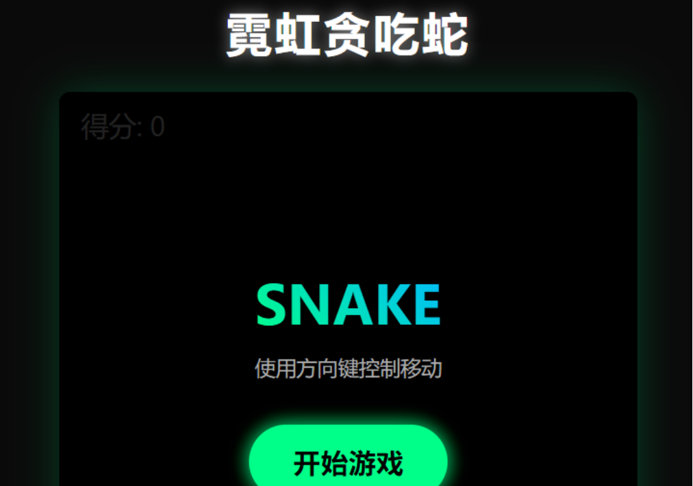
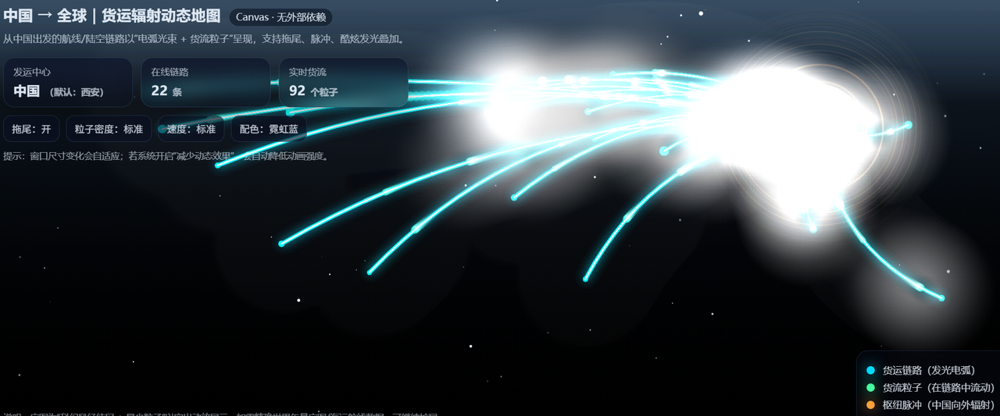
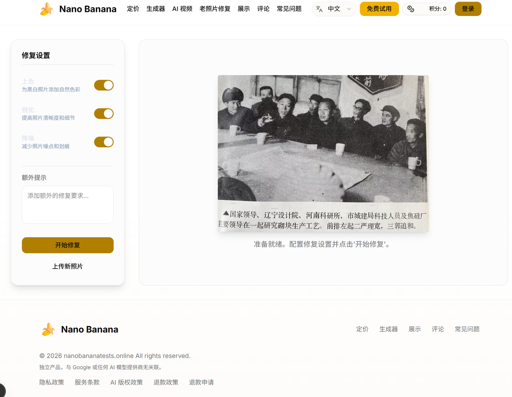
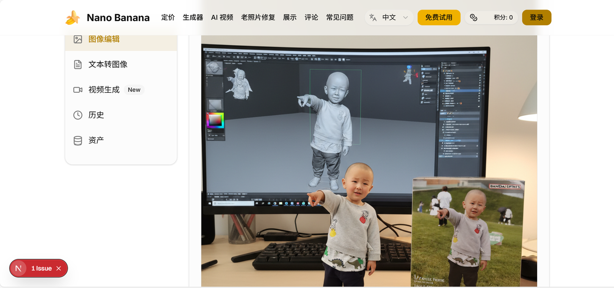
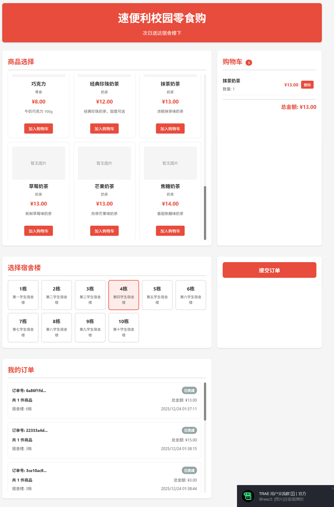

# Tài xế xe tải 48 tuổi, thức nhiều đêm, dùng AI build website ra biển lớn

🚚

::: tip 📖 Story này từ Trung Quốc
Câu chuyện của anh Hoàng — tài xế xe tải 48 tuổi ở Trịnh Châu. Không phải dev, không có bằng IT. Nhưng tự học AI Coding rồi launch website thu được tiền thật từ user toàn cầu. **Story chứng minh: tuổi tác + nền tảng không phải barrier với AI Vibe Coding.**
:::

**Người kể: tài xế xe tải anh Hoàng**

---

## 01 "Tổng thống Nam Tư" quyết đổi đường đua

> *"Năm nay tôi 48, tuổi cầm tinh con giáp. Ở tuổi 'không sờ máy tính 10 năm', mùa xuân 2025 DeepSeek bùng nổ như tiếng sấm trầm đánh thức tôi."*

Anh Hoàng lớn lên ở Tiêu Tác — thành phố hạng 4 nhỏ. Vì hồi nhỏ có nickname nên thi thoảng được trêu là "Tổng thống Nam Tư". Giờ người xung quanh gọi thẳng **anh Hoàng**.

Anh là người vận chuyển hàng cho **máy bán hàng tự động** (vending machine). Cuối năm 2024, GPT-4 phổ biến, đến mùa xuân 2025 DeepSeek bùng nổ — khiến anh nhận ra:

> *"Đoàn tàu thời đại sắp khởi. Dù người uống cà phê trong cao ốc, hay người gặm bánh trong xe tải — đều sẽ bị làn sóng AI ảnh hưởng. Không bắt kịp thì chỉ có thể bị bỏ lại ăn bụi."*

Vậy là **tay ngoại đạo chính hiệu** này quyết nghiêm túc học. Anh muốn xem:

> *"Bàn tay từng chỉ biết lái xe có gõ được cánh cửa lập trình AI không."*

## 02 Từ "thủ công" thành "nghệ thuật chỉ huy"

2 tuần đầu học, lòng anh Hoàng đập thình thịch:

> *"Code dạng gì còn không biết, làm được không đây?"*

Nhưng lời của thầy và trợ giảng cho anh tự tin: **thời đại lập trình AI, không phải mình là "phu vận chuyển code", mà là đạo diễn**.

Viết chương trình không phải xếp từng viên gạch nữa — chỉ cần nói rõ với AI là làm ra từng bước.

Vậy là anh Hoàng bắt đầu tiếp xúc **Vibe Coding**.

- 👨‍💻 *"Giúp tôi làm Snake, đẹp tí, có nút Start!"*
- 🌍 *"Tạo map động, demo hiệu ứng cool hàng từ Trung Quốc gửi đi toàn cầu!"*

**Vù một cái** — app ra.

Cảm giác kỳ diệu này làm anh chấn động. **Lập trình từ "thủ công" chán phèo thành "nghệ thuật" chỉ huy ung dung.** Đôi tay cầm vô-lăng nửa đời nay, cũng có thể cầm vô-lăng thế giới số.

## 03 Trong sụp đổ và kiên trì, cứng đầu chạy thông "closed loop thương mại"

> *"Chỉ nói không làm là giả vờ — phải thực chiến!"*

Task số 5 của khoá là tự hoàn thành **1 đồ án lớn**. Anh Hoàng quyết làm 1 tool site AI **go-global**:

- ✅ Phải dùng được
- ✅ Deploy được
- ✅ Còn thu được tiền
- ✅ Tốt nhất tạo thành **"closed loop thương mại"** hoàn chỉnh

Mới đầu replicate prototype website khá suôn sẻ. Nhưng tới bước 2, implement **"function core image-to-image"** — hệ thống bắt đầu báo lỗi điên cuồng.

Là gà, anh Hoàng chỉ có thể vừa chat AI debug, vừa bù kiến thức nền.

**Liên tục 4-5 ngày**:
- 🌞 Ban ngày lái xe tiếp hàng
- 🌙 Tối về cùng AI bày trận "luân xa" — chat, debug, học lặp lại

Lúc sụp đổ nhất, anh ngồi trước màn hình, đối diện doc dev F12 ngồi cả đêm.

Anh cũng từng nghĩ bỏ cuộc. Là sự trả lời tích cực trong group học, sự chia sẻ chuyên môn của các phiên kiến thức — kéo anh quay lại.

Sau anh dùng AI coding tool quốc nội (tương đương: **Cursor, Windsurf, Trae** — đều free tier có) — error giảm, giao tiếp mượt hơn.

Anh Hoàng làm 1 hơi tích hợp:
- 🎨 Text-to-image
- 🎬 Text-to-video
- 🖼️ Recovery ảnh cũ

**Cục xương khó nhằn nhất** là:
1. Set domain email
2. Config Google login
3. Integrate hệ thống thanh toán (**PayPal** và **Creem**)

Anh đối diện doc chính thức, vừa hỏi AI, vừa tự design và config. Cứ vậy — **một mình hoàn thành kết nối payment interface từ 0 tới 1**.

Anh nói, khoảnh khắc Nano Banana chạy thông, mình thực sự muốn hét lớn:

> *"Design implement 1 website thật sự chạy được closed loop thương mại — **không còn là việc chỉ programmer của big tech mới làm được!**"*

## 04 "Quy tắc dev zero-base" của anh Hoàng

Anh Hoàng vừa mò vừa đạp hố, đúc kết được vài kinh nghiệm "đẫm máu":

::: tip 🎯 4 quy tắc vàng

**1. 🧩 Quy tắc xếp hình**
Đừng nghĩ ăn một miếng thành béo. Mỗi lần chỉ sửa 1 function nhỏ, sửa xong rồi mới đi bước tiếp.

**2. 💬 Học đưa ví dụ**
Giao tiếp với AI đừng nói đạo lý lớn → đưa thẳng:
- Ví dụ cụ thể
- Error message
- Hiệu quả mong muốn

**3. 🕵️ Học "ăn cắp" nghề**
Đừng chỉ copy paste. **Cố hiểu AI viết thế tại sao** — đó mới là cách học code thật.

**4. 🧘 Điều chỉnh tâm thái**
Báo lỗi đừng sợ — đó là **AI đang dạy bạn tránh hố**.
:::

## 05 Tàu thời đại, ai cũng lên được

Giờ, anh Hoàng vẫn là tài xế xe tải chạy ở Trịnh Châu. Nhưng khác trước — giờ anh có thêm **danh tính: dev ứng dụng AI**.

Gần đây anh còn dev cho công ty 1 mini program **"Tiện ích snack học đường nhanh"** (web app phục vụ thầy cô + HS mua snack tại trường) — nâng đáng kể trải nghiệm mua sắm.

Như anh Hoàng nói:

> *"Chỉ cần có thôi thúc giải quyết vấn đề, code không còn là ngưỡng."*

Lời nhắn của anh cũng rất thẳng:

::: warning 💪 Gửi các bạn còn đang phân vân
> *"Đừng sợ, chỉ cần bạn muốn khởi hành, lúc nào cũng không muộn.*
>
> ***Vô-lăng, ngay trong tay bạn!***"
:::

---

## 🎥 Watch & Learn — 3 video về solo founder go-global

<ChapterVideos :videos="[
  { id: 'oFtjKbXKqbg', title: 'Pieter Levels: Programming, Viral AI Startups (Lex Fridman #440)', channel: 'Lex Fridman', duration: '3:55:00', why: 'Pieter kể chi tiết Photo AI ($132K MRR), built solo, không VC — đúng playbook cho anh Hoàng go-global.' },
  { id: '7BX8Mt7K10c', title: 'How Pieter Levels Went from Failed Web Business to $3M/yr', channel: 'Starter Story', duration: '30:00', why: 'Tổng quan Photo AI / Nomadlist / Remote OK — clone framework: 1 niche, 1 payment, ship nhanh.' },
  { id: 'KVZ3vMx_aJ4', title: 'Gumroad CEO Sahil Lavingia: 40x team productivity with v0, Cursor, Devin', channel: 'Lenny\'s Newsletter', duration: '50:00', why: 'AI agents viết 41% code Gumroad. Người không-IT cũng làm được nếu dùng đúng tool, đúng prompt.' }
]" />

---

## 🔬 7 Bài học & Technique từ anh Hoàng

::: tip 🎯 Apply cho late-career switcher VN

**1. 🎂 Late-start advantage**
- 48 tuổi có life experience để hiểu user thật, biết vấn đề thật
- Apply VN: anh Hoàng biết tài xế cần gì → build công cụ cho tài xế thay clone B2B SaaS

**2. 💳 Closed-loop payment first**
- Đăng ký Paddle / Creem (Merchant of Record) → khỏi lo VAT/tax/chargeback
- Apply VN: dùng **Paddle** (5% + $0.50/tx) hoặc **Creem** thay vì cố build VNPay cho khách global

**3. 🤖 AI as the entire dev team**
- Cursor + Replit + Lovable + ChatGPT đủ cho 1 người ship product
- Pieter dùng Cursor làm fly.pieter.com → **$52K/tháng trong 2 tuần**
- Apply VN: anh Hoàng học 1 tool / tháng × 3 tháng = ship v1

**4. 📣 Build in public + small audience first**
- Pieter mất 10 năm build **600K followers** trước Photo AI
- Apply VN: post hàng tuần lên Threads/X/LinkedIn "Day 12: solo dev 48 tuổi build image gen"

**5. ⏰ Ship before ready**
- Marc Lou + Tony Dinh đều ship "trước khi xấu hổ quá đáng"
- Apply VN: đặt deadline 30 ngày → bất kể UI, public link

**6. 💰 Pricing > features**
- Photo AI giá **$39/tháng, 87% profit margin** ($13K cost / $132K revenue)
- Apply VN: anh Hoàng tính price global ($19-49/tháng) cao hơn nhiều VN giá → 1 user global = 50 user VN

**7. 🎯 Niche wrapper, NOT horizontal AI**
- "Podcast-to-clips cho nha sĩ" > ChatGPT clone
- Apply VN: launch "AI ảnh sản phẩm cho shop Etsy" hoặc "AI ảnh chân dung cho LinkedIn Asia" thay vì "AI image gen" generic
:::

---

## 📚 More Similar Stories (2025-2026)

### Case A: Pieter Levels — Photo AI **$1.65M ARR solo**

| Item | Số |
|------|------|
| Background | Dutch solo dev, không VC |
| Stack | Cursor + Stripe + nano-banana style flow |
| MRR T11/2025 | **$132K** |
| **Profit margin** | **87%** ($13K cost / $132K revenue) |
| Time | **18 tháng từ 0** |
| Quote | *"Most of my startups will fail — and that's okay, as long as something sticks."* |

> Source: [Indie Hackers deep dive](https://indiehackers.com/post/photo-ai-by-pieter-levels-complete-deep-dive-case-study)

### Case B: 🇻🇳 Tony Dinh — solopreneur VN → global **$140K/month**

| Item | Số |
|------|------|
| Background | Software engineer VN 7 năm KN → indie hacker full-time 2021 (28 tuổi) |
| Stack | ChatGPT API + Stripe + landing page Twitter-marketed |
| TypingMind | **$45K MRR** |
| Black Magic | Bán **$128K** |
| Xnapper | Bán **$150K** |
| Portfolio | **$140K/tháng** tổng |
| Quote | *"Ship the smallest useful version, in contact with reality from day one."* |

> Source: [Starter Story](https://starterstory.com/typingmind-breakdown)

### Case C: Marc Lou — Sa thải → **$80K/tháng Bali**

| Item | Số |
|------|------|
| Background | Sa thải khỏi job software → indie hacker, ship **16 product trong 2 năm** |
| Stack | ShipFast Next.js boilerplate + Stripe |
| **Revenue T7/2025** | **$80K/tháng** từ portfolio (ShipFast, IndiePage, ZenVoice...) |
| Sống ở | Bali |
| Quote | *"Make Fast, Ship Fast."* |

> Source: [IndiePattern](https://indiepattern.com/stories/marc-lou) | [Medium](https://medium.com/@IndieKim/80k-month-in-bali-marc-lous-full-solopreneur-strategy)

---

## 🛠️ Tools 2026 cho late-career solo founder go-global

| Tool | Cost | Use case |
|------|------|------|
| **Cursor Pro** | $20/tháng | AI viết code, anh chỉ review + chạy |
| **Lovable** | $25/tháng | Build UI nhanh nhất 2026, mở browser là dùng |
| **Replit + Agent v2** | $25/tháng Core | Deploy full-stack ngay trên web, không cần local setup |
| **Paddle** 💳 | 5% + $0.50/tx | Merchant of Record xử lý VAT/tax global |
| **Creem** | 0% đến €1K, sau đó ~5% | Alternative Paddle, friendly cho indie + AI builder |
| **PayPal Business** | 3.49% + fixed | Backup payment cho khách không có thẻ Stripe |
| **fal.ai / Replicate API** | $0.003-0.01/image | Backbone cho image gen site, không tự host model |
| **OpenAI gpt-image-1 / nano-banana** | $0.04/image (Gemini) | State-of-the-art image gen, free tier để test |
| **Buy Me a Coffee + Ko-fi** | 0-5% | Thử lấy first $100 trước khi build subscription |
| **X / Threads / LinkedIn** | Free | Build-in-public audience |

**Update Q1-Q2 2026**: Cursor có voice mode tốt; Lovable hỗ trợ mobile-first; nano-banana upgrade Gemini 3 Image.

---

::: tip 🇻🇳 VN dev (mọi tuổi, mọi nền tảng) có thể học gì?

**1. Tuổi tác không phải barrier**
- VN có rất nhiều "career switcher" 30+, 40+ chuyển sang IT thành công
- Anh Hoàng 48 tuổi, không nền tảng → vẫn build được product có user thật

**2. Stack "go-global" cho dev VN 2026**

| Layer | Tool | Note |
|------|------|------|
| **Vibe Coding IDE** | Cursor, Windsurf, Claude Code, Lovable, Bolt.new | Đều có free tier |
| **AI API** | OpenAI, Anthropic, Gemini, DeepSeek | DeepSeek rẻ nhất; OpenAI dễ tích hợp nhất |
| **Image/Video gen** | Replicate, fal.ai, Together AI | Aggregator tiện cho dev solo |
| **Auth** | Clerk, Supabase Auth | Setup 5 phút |
| **Payment** | Stripe (best), Paddle, Lemon Squeezy, Creem | Stripe yêu cầu công ty Singapore/HK; Paddle + Lemon dễ hơn cho cá nhân VN |
| **Deploy** | Vercel, Cloudflare Pages, Netlify | Zero-cost cho project nhỏ |

**3. Closed loop thương mại = đỉnh cao của Vibe Coding**
Không phải chỉ build app — mà **build app thu tiền được**.

Chuỗi cần thông: User → Sign up → Use feature → Pay → Get value → Refer

Anh Hoàng chứng minh: 1 người + AI + 4-5 ngày → chạy được full chuỗi này.

**4. VN-specific tips**
- **Domain rẻ**: PA Việt Nam, Mat Bao, Nhân Hoà
- **Payment cho user VN**: VNPay, MoMo, ZaloPay (nếu chỉ target VN); Stripe / Paddle nếu go-global
- **Quy định**: app có thu tiền → đăng ký kinh doanh, hoá đơn điện tử (Misa, Viettel SInvoice)
- **Tax**: thu nhập từ AI app vẫn phải khai thuế thu nhập cá nhân

**5. Tinh thần "phu xe tới đạo diễn"**
- Cũ: code = vận chuyển từng dòng
- Mới: code = chỉ đạo AI làm gì
- → Mọi nghề chuyển ngành AI được, miễn có **thôi thúc giải quyết vấn đề thật**
:::

---

## 🎓 Lessons Applied — 7 lessons từ anh Hoàng (48y career switcher)

::: tip 💡 Apply cho late-career switcher VN

**Lesson 1. 🎂 Late-start = advantage**
- 48 tuổi có life experience → hiểu user thật, biết vấn đề thật
- Apply: build cho COMMUNITY bạn biết (tài xế, kế toán, GV, etc.)

**Lesson 2. 💳 Closed-loop payment first**
- Paddle / Creem (Merchant of Record) → outsource VAT/tax global
- Apply: ngay từ MVP, set up payment global — đừng chỉ build "free demo"

**Lesson 3. 🤖 AI = entire dev team**
- Cursor + Lovable + Replit + ChatGPT cho 1 người
- Apply: học 1 tool/tháng × 3 tháng → ship product v1

**Lesson 4. 📣 Build-in-public + small audience**
- Pieter Levels 10 năm → 700K followers → CAC $0
- Apply: 1 post/tuần "Day 12: solo dev 48 tuổi build [X]" — audience tích lũy slowly

**Lesson 5. ⏰ Ship before ready**
- Đặt deadline 30 ngày → public link bất kể UI
- Apply: "Done is better than perfect" (Pieter mantra)

**Lesson 6. 💰 Pricing > features**
- $39/tháng Photo AI = 87% profit margin
- Apply: 1 user global = 50 user VN. Price global ($19-49/mo), không VN ($1-5/mo)

**Lesson 7. 🎯 Niche wrapper, NOT horizontal**
- "Podcast-to-clips cho nha sĩ" > ChatGPT clone
- Apply: "AI ảnh sản phẩm cho shop Etsy" > "AI image gen tool"
:::

---

## 🏗️ Try Yourself — Late-career switcher 30-day sprint

::: warning 🎯 Sprint cho người 30+/40+ muốn chuyển ngành

**Tuần 1 — Identify**:
- List 3 community bạn am hiểu (current job, hobby, hometown)
- Mỗi community: 5 pain points
- Pick 1 pain niche nhất → 5 customer interview (real conversation)

**Tuần 2 — Build**:
- Spec với Claude (2h)
- Build no-code MVP với Lovable / Bolt (8h)
- Connect Paddle/Creem (2h)
- Deploy + test (2h)

**Tuần 3 — Launch**:
- Twitter/LinkedIn post "Solo dev 4Xy ship [X]"
- Email 50 từ community step 1
- ProductHunt soft launch

**Tuần 4 — Validate**:
- 50+ signup OR pivot
- 5+ paying customer
- Document journey thành Twitter thread

**Output**:
- Live URL với payment work
- 5+ paying customer ($1+)
- Build-in-public Twitter thread 30-tweet
- Case study post (LinkedIn)

**Mantra**:
> *"Không bao giờ muộn. Vô-lăng ngay trong tay bạn."* — anh Hoàng
:::

---

## 🎯 Knowledge Check

::: details 1. Anh Hoàng làm gì trước khi học Vibe Coding?
**A.** Software engineer
**B.** Tài xế xe tải 48 tuổi ✅
**C.** Marketing
**D.** Designer

**Đáp án: B** — Tài xế xe tải 48 tuổi ở Trịnh Châu (TQ), không IT background. Mùa xuân 2025 DeepSeek bùng nổ → quyết học AI.
:::

::: details 2. Pieter Levels Photo AI profit margin?
**A.** 20%
**B.** 50%
**C.** 87% ✅
**D.** 100%

**Đáp án: C** — Photo AI: $132K MRR, $13K cost = **87% profit margin**. Pricing $39/tháng. Solo, 0 employees, ~$1.65M ARR.
:::

::: details 3. Stripe vs Paddle vs Lemon Squeezy — pick nào cho VN solo founder?
**A.** Stripe luôn
**B.** Paddle / Lemon Squeezy (Merchant of Record) ✅
**C.** PayPal Business
**D.** Tự build VNPay

**Đáp án: B** — **Paddle / Lemon Squeezy** = Merchant of Record → outsource VAT/GST/sales tax globally. VN founder không cần accountant quốc tế. Stripe needs self-handle tax (US-focused).
:::

::: details 4. Pieter Levels build PhotoAI trong stack gì?
**A.** Next.js + TypeScript
**B.** React + Node
**C.** 14,000 dòng raw PHP ✅
**D.** Python Django

**Đáp án: C** — Pieter Levels: PhotoAI = **14,000 dòng raw PHP** + inline HTML + JS. 0 employees, $132K MRR. Tweet 4.8M view. Motto: "Ship fast. Ship ugly. Ship in public."
:::

::: details 5. Marc Lou Bali income/tháng?
**A.** $5K
**B.** $20K
**C.** $80K từ portfolio (ShipFast, IndiePage, ZenVoice...) ✅
**D.** $1M

**Đáp án: C** — Marc Lou Bali: **$80K/tháng** từ portfolio (ShipFast $54K + IndiePage + ZenVoice + ...). Sa thải khỏi job → indie hacker, ship 16 product trong 2 năm.
:::

::: details 6. Pieter Levels mất bao lâu build 600K followers trước Photo AI?
**A.** 1 năm
**B.** 5 năm
**C.** 10 năm ✅
**D.** 20 năm

**Đáp án: C** — Pieter mất **10 năm build 600K followers** trước Photo AI. Build-in-public daily. CAC ~$0 khi launch product.
:::

::: details 7. Tony Dinh (VN) ship Typing Mind sau ChatGPT launch?
**A.** 1 năm
**B.** 6 tháng
**C.** Vài giờ ✅
**D.** Chưa ship

**Đáp án: C** — Tony Dinh ship Typing Mind **vài giờ sau ChatGPT launch**. Pattern: "Ship before it embarrasses him too much". Indie hacker full-time từ 2021.
:::

**Score**:
- 6-7/7 ✅ Module Vibe Stories mastered
- 4-5/7 ⚠️ Re-read lessons
- <4/7 ❌ Try 30-day sprint thật
:::
